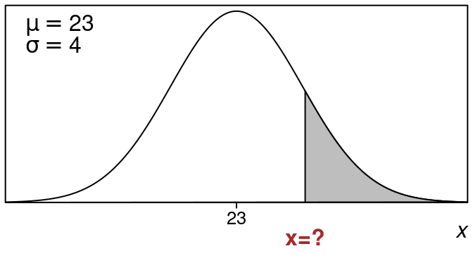

::: {.cell}

:::

# Backwards Problems {#backwards-problems}

In this section we want to go in the opposite direction from previous chapters. That is we want to find an **_x-value that will give us a certain left tail or right tail area_**. These are called **backwards** problems since they start with the area and then find the x-value. This is backwards from what we have done before.

So in previous chapters we had this:

_**Find Area From an X-value**_

1. Start with an x-value
1. Compute its z-value
1. Find the area using the z table (or use NORMSDIST)

Now we want to go in the other direction:

_**Find X-value From an Area**_

1. Start with an area
1. Find the z-value that gives that area
1. Compute the x-value from the z-value

Before we do these full backwards problems from area to x-value, first lets solve an easier problem that involves finding the z-value that goes with a particular area.

Then once we can do that, we will see how to find the x-value from the z-value for backwards problems.

Okay so we are given an area (left or right tail) and we want to find the z-value.

:::{#exm-z-value-for-left-tail-z-equals-1.23}
## z-value for left tail $z=1.23$

::: {.cell}
::: {.cell-output-display}


::: {.cell}

:::


Find the z-value that gives a left tail area of $25\%$.

**_Solution:_**


::: {.cell}

:::


::: {.cell}

:::

We want to find the z-value for a given left tail area of $25\%$. 

This is an example of a **backwards** problem, since we are going from an **area to a z-value**.

Here is what the picture looks like: 
    

::: {.cell layout-align="center"}
::: {.cell-output-display}
{fig-align='center' width=336}
:::
:::

     
The shaded left tail area corresponds to **25%** of the data.  We use the standard normal table to find the z-value that goes with this left tail.   

We look through the table and **_look for the area that is closest_** to the value **25%** which we need.    
    
We might not find this value exactly but we locate the closest value that we can:


::: {.cell}
::: {.cell-output-display}

```{=html}
<table class="huxtable" data-quarto-disable-processing="true"  style="width: 85%; margin-left: auto; margin-right: auto;">
<col><col><col><col><col><col><col><col><col><col><col><thead>
<tr>
<th class="huxtable-cell huxtable-header" style="text-align: center;  border-style: solid solid solid solid; border-width: 0.5pt 0.5pt 0.5pt 0.5pt; border-top-color: rgb(0, 0, 0);  border-right-color: rgb(0, 0, 0);  border-bottom-color: rgb(0, 0, 0);  border-left-color: rgb(0, 0, 0);      font-size: 11pt;"></th><th class="huxtable-cell huxtable-header" style="text-align: center;  border-style: solid solid solid solid; border-width: 0.5pt 0.5pt 0.5pt 0.5pt; border-top-color: rgb(0, 0, 0);  border-right-color: rgb(0, 0, 0);  border-bottom-color: rgb(0, 0, 0);  border-left-color: rgb(0, 0, 0);      font-size: 11pt;">.00</th><th class="huxtable-cell huxtable-header" style="text-align: center;  border-style: solid solid solid solid; border-width: 0.5pt 0.5pt 0.5pt 0.5pt; border-top-color: rgb(0, 0, 0);  border-right-color: rgb(0, 0, 0);  border-bottom-color: rgb(0, 0, 0);  border-left-color: rgb(0, 0, 0);      font-size: 11pt;">.01</th><th class="huxtable-cell huxtable-header" style="text-align: center;  border-style: solid solid solid solid; border-width: 0.5pt 0.5pt 0.5pt 0.5pt; border-top-color: rgb(0, 0, 0);  border-right-color: rgb(0, 0, 0);  border-bottom-color: rgb(0, 0, 0);  border-left-color: rgb(0, 0, 0);      font-size: 11pt;">.02</th><th class="huxtable-cell huxtable-header" style="text-align: center;  border-style: solid solid solid solid; border-width: 0.5pt 0.5pt 0.5pt 0.5pt; border-top-color: rgb(0, 0, 0);  border-right-color: rgb(0, 0, 0);  border-bottom-color: rgb(0, 0, 0);  border-left-color: rgb(0, 0, 0);      font-size: 11pt;">.03</th><th class="huxtable-cell huxtable-header" style="text-align: center;  border-style: solid solid solid solid; border-width: 0.5pt 0.5pt 0.5pt 0.5pt; border-top-color: rgb(0, 0, 0);  border-right-color: rgb(0, 0, 0);  border-bottom-color: rgb(0, 0, 0);  border-left-color: rgb(0, 0, 0);      font-size: 11pt;">.04</th><th class="huxtable-cell huxtable-header" style="text-align: center;  border-style: solid solid solid solid; border-width: 0.5pt 0.5pt 0.5pt 0.5pt; border-top-color: rgb(0, 0, 0);  border-right-color: rgb(0, 0, 0);  border-bottom-color: rgb(0, 0, 0);  border-left-color: rgb(0, 0, 0);      font-size: 11pt;">.05</th><th class="huxtable-cell huxtable-header" style="text-align: center;  border-style: solid solid solid solid; border-width: 0.5pt 0.5pt 0.5pt 0.5pt; border-top-color: rgb(0, 0, 0);  border-right-color: rgb(0, 0, 0);  border-bottom-color: rgb(0, 0, 0);  border-left-color: rgb(0, 0, 0);      font-size: 11pt;">.06</th><th class="huxtable-cell huxtable-header" style="text-align: center;  border-style: solid solid solid solid; border-width: 0.5pt 0.5pt 0.5pt 0.5pt; border-top-color: rgb(0, 0, 0);  border-right-color: rgb(0, 0, 0);  border-bottom-color: rgb(0, 0, 0);  border-left-color: rgb(0, 0, 0);      font-size: 11pt;">.07</th><th class="huxtable-cell huxtable-header" style="text-align: center;  border-style: solid solid solid solid; border-width: 0.5pt 0.5pt 0.5pt 0.5pt; border-top-color: rgb(0, 0, 0);  border-right-color: rgb(0, 0, 0);  border-bottom-color: rgb(0, 0, 0);  border-left-color: rgb(0, 0, 0);      font-size: 11pt;">.08</th><th class="huxtable-cell huxtable-header" style="text-align: center;  border-style: solid solid solid solid; border-width: 0.5pt 0.5pt 0.5pt 0.5pt; border-top-color: rgb(0, 0, 0);  border-right-color: rgb(0, 0, 0);  border-bottom-color: rgb(0, 0, 0);  border-left-color: rgb(0, 0, 0);      font-size: 11pt;">.09</th></tr>
</thead>
<tbody>
<tr>
<td class="huxtable-cell" style="text-align: center;  border-style: solid solid solid solid; border-width: 0.5pt 0.5pt 0.5pt 0.5pt; border-top-color: rgb(0, 0, 0);  border-right-color: rgb(0, 0, 0);  border-bottom-color: rgb(0, 0, 0);  border-left-color: rgb(0, 0, 0);   font-weight: bold;   font-size: 11pt;">-0.7</td><td class="huxtable-cell" style="text-align: center;  border-style: solid solid solid solid; border-width: 0.5pt 0.5pt 0.5pt 0.5pt; border-top-color: rgb(0, 0, 0);  border-right-color: rgb(0, 0, 0);  border-bottom-color: rgb(0, 0, 0);  border-left-color: rgb(0, 0, 0);      font-size: 11pt;">.2420</td><td class="huxtable-cell" style="text-align: center;  border-style: solid solid solid solid; border-width: 0.5pt 0.5pt 0.5pt 0.5pt; border-top-color: rgb(0, 0, 0);  border-right-color: rgb(0, 0, 0);  border-bottom-color: rgb(0, 0, 0);  border-left-color: rgb(0, 0, 0);      font-size: 11pt;">.2389</td><td class="huxtable-cell" style="text-align: center;  border-style: solid solid solid solid; border-width: 0.5pt 0.5pt 0.5pt 0.5pt; border-top-color: rgb(0, 0, 0);  border-right-color: rgb(0, 0, 0);  border-bottom-color: rgb(0, 0, 0);  border-left-color: rgb(0, 0, 0);      font-size: 11pt;">.2358</td><td class="huxtable-cell" style="text-align: center;  border-style: solid solid solid solid; border-width: 0.5pt 0.5pt 0.5pt 0.5pt; border-top-color: rgb(0, 0, 0);  border-right-color: rgb(0, 0, 0);  border-bottom-color: rgb(0, 0, 0);  border-left-color: rgb(0, 0, 0);      font-size: 11pt;">.2327</td><td class="huxtable-cell" style="text-align: center;  border-style: solid solid solid solid; border-width: 0.5pt 0.5pt 0.5pt 0.5pt; border-top-color: rgb(0, 0, 0);  border-right-color: rgb(0, 0, 0);  border-bottom-color: rgb(0, 0, 0);  border-left-color: rgb(0, 0, 0);      font-size: 11pt;">.2296</td><td class="huxtable-cell" style="text-align: center;  border-style: solid solid solid solid; border-width: 0.5pt 0.5pt 0.5pt 0.5pt; border-top-color: rgb(0, 0, 0);  border-right-color: rgb(0, 0, 0);  border-bottom-color: rgb(0, 0, 0);  border-left-color: rgb(0, 0, 0);      font-size: 11pt;">.2266</td><td class="huxtable-cell" style="text-align: center;  border-style: solid solid solid solid; border-width: 0.5pt 0.5pt 0.5pt 0.5pt; border-top-color: rgb(0, 0, 0);  border-right-color: rgb(0, 0, 0);  border-bottom-color: rgb(0, 0, 0);  border-left-color: rgb(0, 0, 0);      font-size: 11pt;">.2236</td><td class="huxtable-cell" style="text-align: center;  border-style: solid solid solid solid; border-width: 0.5pt 0.5pt 0.5pt 0.5pt; border-top-color: rgb(0, 0, 0);  border-right-color: rgb(0, 0, 0);  border-bottom-color: rgb(0, 0, 0);  border-left-color: rgb(0, 0, 0);  background-color: rgb(204, 204, 204);    font-size: 11pt;">.2206</td><td class="huxtable-cell" style="text-align: center;  border-style: solid solid solid solid; border-width: 0.5pt 0.5pt 0.5pt 0.5pt; border-top-color: rgb(0, 0, 0);  border-right-color: rgb(0, 0, 0);  border-bottom-color: rgb(0, 0, 0);  border-left-color: rgb(0, 0, 0);      font-size: 11pt;">.2177</td><td class="huxtable-cell" style="text-align: center;  border-style: solid solid solid solid; border-width: 0.5pt 0.5pt 0.5pt 0.5pt; border-top-color: rgb(0, 0, 0);  border-right-color: rgb(0, 0, 0);  border-bottom-color: rgb(0, 0, 0);  border-left-color: rgb(0, 0, 0);      font-size: 11pt;">.2148</td></tr>
<tr>
<td class="huxtable-cell" style="text-align: center;  border-style: solid solid solid solid; border-width: 0.5pt 0.5pt 0.5pt 0.5pt; border-top-color: rgb(0, 0, 0);  border-right-color: rgb(0, 0, 0);  border-bottom-color: rgb(0, 0, 0);  border-left-color: rgb(0, 0, 0);   font-weight: bold;   font-size: 11pt;">-0.6</td><td class="huxtable-cell" style="text-align: center;  border-style: solid solid solid solid; border-width: 0.5pt 0.5pt 0.5pt 0.5pt; border-top-color: rgb(0, 0, 0);  border-right-color: rgb(0, 0, 0);  border-bottom-color: rgb(0, 0, 0);  border-left-color: rgb(0, 0, 0);  background-color: rgb(204, 204, 204);    font-size: 11pt;">.2743</td><td class="huxtable-cell" style="text-align: center;  border-style: solid solid solid solid; border-width: 0.5pt 0.5pt 0.5pt 0.5pt; border-top-color: rgb(0, 0, 0);  border-right-color: rgb(0, 0, 0);  border-bottom-color: rgb(0, 0, 0);  border-left-color: rgb(0, 0, 0);  background-color: rgb(204, 204, 204);    font-size: 11pt;">.2709</td><td class="huxtable-cell" style="text-align: center;  border-style: solid solid solid solid; border-width: 0.5pt 0.5pt 0.5pt 0.5pt; border-top-color: rgb(0, 0, 0);  border-right-color: rgb(0, 0, 0);  border-bottom-color: rgb(0, 0, 0);  border-left-color: rgb(0, 0, 0);  background-color: rgb(204, 204, 204);    font-size: 11pt;">.2676</td><td class="huxtable-cell" style="text-align: center;  border-style: solid solid solid solid; border-width: 0.5pt 0.5pt 0.5pt 0.5pt; border-top-color: rgb(0, 0, 0);  border-right-color: rgb(0, 0, 0);  border-bottom-color: rgb(0, 0, 0);  border-left-color: rgb(0, 0, 0);  background-color: rgb(204, 204, 204);    font-size: 11pt;">.2643</td><td class="huxtable-cell" style="text-align: center;  border-style: solid solid solid solid; border-width: 0.5pt 0.5pt 0.5pt 0.5pt; border-top-color: rgb(0, 0, 0);  border-right-color: rgb(0, 0, 0);  border-bottom-color: rgb(0, 0, 0);  border-left-color: rgb(0, 0, 0);  background-color: rgb(204, 204, 204);    font-size: 11pt;">.2611</td><td class="huxtable-cell" style="text-align: center;  border-style: solid solid solid solid; border-width: 0.5pt 0.5pt 0.5pt 0.5pt; border-top-color: rgb(0, 0, 0);  border-right-color: rgb(0, 0, 0);  border-bottom-color: rgb(0, 0, 0);  border-left-color: rgb(0, 0, 0);  background-color: rgb(204, 204, 204);    font-size: 11pt;">.2578</td><td class="huxtable-cell" style="text-align: center;  border-style: solid solid solid solid; border-width: 0.5pt 0.5pt 0.5pt 0.5pt; border-top-color: rgb(0, 0, 0);  border-right-color: rgb(0, 0, 0);  border-bottom-color: rgb(0, 0, 0);  border-left-color: rgb(0, 0, 0);  background-color: rgb(204, 204, 204);    font-size: 11pt;">.2546</td><td class="huxtable-cell" style="text-align: center;  border-style: solid solid solid solid; border-width: 0.5pt 0.5pt 0.5pt 0.5pt; border-top-color: rgb(0, 0, 0);  border-right-color: rgb(0, 0, 0);  border-bottom-color: rgb(0, 0, 0);  border-left-color: rgb(0, 0, 0);  background-color: rgb(217, 217, 217); font-weight: bold;   font-size: 11pt;">.2514</td><td class="huxtable-cell" style="text-align: center;  border-style: solid solid solid solid; border-width: 0.5pt 0.5pt 0.5pt 0.5pt; border-top-color: rgb(0, 0, 0);  border-right-color: rgb(0, 0, 0);  border-bottom-color: rgb(0, 0, 0);  border-left-color: rgb(0, 0, 0);      font-size: 11pt;">.2483</td><td class="huxtable-cell" style="text-align: center;  border-style: solid solid solid solid; border-width: 0.5pt 0.5pt 0.5pt 0.5pt; border-top-color: rgb(0, 0, 0);  border-right-color: rgb(0, 0, 0);  border-bottom-color: rgb(0, 0, 0);  border-left-color: rgb(0, 0, 0);      font-size: 11pt;">.2451</td></tr>
<tr>
<td class="huxtable-cell" style="text-align: center;  border-style: solid solid solid solid; border-width: 0.5pt 0.5pt 0.5pt 0.5pt; border-top-color: rgb(0, 0, 0);  border-right-color: rgb(0, 0, 0);  border-bottom-color: rgb(0, 0, 0);  border-left-color: rgb(0, 0, 0);   font-weight: bold;   font-size: 11pt;">-0.5</td><td class="huxtable-cell" style="text-align: center;  border-style: solid solid solid solid; border-width: 0.5pt 0.5pt 0.5pt 0.5pt; border-top-color: rgb(0, 0, 0);  border-right-color: rgb(0, 0, 0);  border-bottom-color: rgb(0, 0, 0);  border-left-color: rgb(0, 0, 0);      font-size: 11pt;">.3085</td><td class="huxtable-cell" style="text-align: center;  border-style: solid solid solid solid; border-width: 0.5pt 0.5pt 0.5pt 0.5pt; border-top-color: rgb(0, 0, 0);  border-right-color: rgb(0, 0, 0);  border-bottom-color: rgb(0, 0, 0);  border-left-color: rgb(0, 0, 0);      font-size: 11pt;">.3050</td><td class="huxtable-cell" style="text-align: center;  border-style: solid solid solid solid; border-width: 0.5pt 0.5pt 0.5pt 0.5pt; border-top-color: rgb(0, 0, 0);  border-right-color: rgb(0, 0, 0);  border-bottom-color: rgb(0, 0, 0);  border-left-color: rgb(0, 0, 0);      font-size: 11pt;">.3015</td><td class="huxtable-cell" style="text-align: center;  border-style: solid solid solid solid; border-width: 0.5pt 0.5pt 0.5pt 0.5pt; border-top-color: rgb(0, 0, 0);  border-right-color: rgb(0, 0, 0);  border-bottom-color: rgb(0, 0, 0);  border-left-color: rgb(0, 0, 0);      font-size: 11pt;">.2981</td><td class="huxtable-cell" style="text-align: center;  border-style: solid solid solid solid; border-width: 0.5pt 0.5pt 0.5pt 0.5pt; border-top-color: rgb(0, 0, 0);  border-right-color: rgb(0, 0, 0);  border-bottom-color: rgb(0, 0, 0);  border-left-color: rgb(0, 0, 0);      font-size: 11pt;">.2946</td><td class="huxtable-cell" style="text-align: center;  border-style: solid solid solid solid; border-width: 0.5pt 0.5pt 0.5pt 0.5pt; border-top-color: rgb(0, 0, 0);  border-right-color: rgb(0, 0, 0);  border-bottom-color: rgb(0, 0, 0);  border-left-color: rgb(0, 0, 0);      font-size: 11pt;">.2912</td><td class="huxtable-cell" style="text-align: center;  border-style: solid solid solid solid; border-width: 0.5pt 0.5pt 0.5pt 0.5pt; border-top-color: rgb(0, 0, 0);  border-right-color: rgb(0, 0, 0);  border-bottom-color: rgb(0, 0, 0);  border-left-color: rgb(0, 0, 0);      font-size: 11pt;">.2877</td><td class="huxtable-cell" style="text-align: center;  border-style: solid solid solid solid; border-width: 0.5pt 0.5pt 0.5pt 0.5pt; border-top-color: rgb(0, 0, 0);  border-right-color: rgb(0, 0, 0);  border-bottom-color: rgb(0, 0, 0);  border-left-color: rgb(0, 0, 0);      font-size: 11pt;">.2843</td><td class="huxtable-cell" style="text-align: center;  border-style: solid solid solid solid; border-width: 0.5pt 0.5pt 0.5pt 0.5pt; border-top-color: rgb(0, 0, 0);  border-right-color: rgb(0, 0, 0);  border-bottom-color: rgb(0, 0, 0);  border-left-color: rgb(0, 0, 0);      font-size: 11pt;">.2810</td><td class="huxtable-cell" style="text-align: center;  border-style: solid solid solid solid; border-width: 0.5pt 0.5pt 0.5pt 0.5pt; border-top-color: rgb(0, 0, 0);  border-right-color: rgb(0, 0, 0);  border-bottom-color: rgb(0, 0, 0);  border-left-color: rgb(0, 0, 0);      font-size: 11pt;">.2776</td></tr>
</tbody>
</table>

```

:::
:::

So that means we can take:

\begin{equation}
z =-0.67 
\end{equation}

as our solution. That is the z-value that we need. 

Here is the picture then:


::: {.cell layout-align="center"}
::: {.cell-output-display}
{fig-align='center' width=336}
:::
:::


$$
\tag*{$\blacksquare$}
$$
:::
:::

:::

:::{#exm-z-value-for-right-tail-of-18-percent}
## z-value for right tail of $18\%$

::: {.cell}
::: {.cell-output-display}


::: {.cell}

:::


Find the z-value that gives a right tail area of $18\%$.

**_Solution:_**


::: {.cell}

:::


::: {.cell}

:::


We want to find the z-value for a given right tail area of $18\%$. 
    
This is an example of a **backwards** problem, since we are going from an **area to a z-value**.

Here is what the picture looks like: 


::: {.cell layout-align="center"}
::: {.cell-output-display}
{fig-align='center' width=336}
:::
:::

     
The shaded right tail area corresponds to **18%** of the data.   
     
Now we can't just look up the area in the z-table since **the table only has left tails** and we have a right tail. 

But we have this:

\begin{equation}
\text{left tail} =  1.0 - \text{right tail} 
\end{equation}

So instead of looking for a right tail of size **0.18**, we can look for a left tail of size **0.82**.  

We look through the table and **_look for the area that is closest_** to the value **82%** which we need.    
    
We might not find this value exactly but lets locate the closest value that we can:


::: {.cell}
::: {.cell-output-display}

```{=html}
<table class="huxtable" data-quarto-disable-processing="true"  style="width: 85%; margin-left: auto; margin-right: auto;">
<col><col><col><col><col><col><col><col><col><col><col><thead>
<tr>
<th class="huxtable-cell huxtable-header" style="text-align: center;  border-style: solid solid solid solid; border-width: 0.5pt 0.5pt 0.5pt 0.5pt; border-top-color: rgb(0, 0, 0);  border-right-color: rgb(0, 0, 0);  border-bottom-color: rgb(0, 0, 0);  border-left-color: rgb(0, 0, 0);      font-size: 11pt;"></th><th class="huxtable-cell huxtable-header" style="text-align: center;  border-style: solid solid solid solid; border-width: 0.5pt 0.5pt 0.5pt 0.5pt; border-top-color: rgb(0, 0, 0);  border-right-color: rgb(0, 0, 0);  border-bottom-color: rgb(0, 0, 0);  border-left-color: rgb(0, 0, 0);      font-size: 11pt;">.00</th><th class="huxtable-cell huxtable-header" style="text-align: center;  border-style: solid solid solid solid; border-width: 0.5pt 0.5pt 0.5pt 0.5pt; border-top-color: rgb(0, 0, 0);  border-right-color: rgb(0, 0, 0);  border-bottom-color: rgb(0, 0, 0);  border-left-color: rgb(0, 0, 0);      font-size: 11pt;">.01</th><th class="huxtable-cell huxtable-header" style="text-align: center;  border-style: solid solid solid solid; border-width: 0.5pt 0.5pt 0.5pt 0.5pt; border-top-color: rgb(0, 0, 0);  border-right-color: rgb(0, 0, 0);  border-bottom-color: rgb(0, 0, 0);  border-left-color: rgb(0, 0, 0);      font-size: 11pt;">.02</th><th class="huxtable-cell huxtable-header" style="text-align: center;  border-style: solid solid solid solid; border-width: 0.5pt 0.5pt 0.5pt 0.5pt; border-top-color: rgb(0, 0, 0);  border-right-color: rgb(0, 0, 0);  border-bottom-color: rgb(0, 0, 0);  border-left-color: rgb(0, 0, 0);      font-size: 11pt;">.03</th><th class="huxtable-cell huxtable-header" style="text-align: center;  border-style: solid solid solid solid; border-width: 0.5pt 0.5pt 0.5pt 0.5pt; border-top-color: rgb(0, 0, 0);  border-right-color: rgb(0, 0, 0);  border-bottom-color: rgb(0, 0, 0);  border-left-color: rgb(0, 0, 0);      font-size: 11pt;">.04</th><th class="huxtable-cell huxtable-header" style="text-align: center;  border-style: solid solid solid solid; border-width: 0.5pt 0.5pt 0.5pt 0.5pt; border-top-color: rgb(0, 0, 0);  border-right-color: rgb(0, 0, 0);  border-bottom-color: rgb(0, 0, 0);  border-left-color: rgb(0, 0, 0);      font-size: 11pt;">.05</th><th class="huxtable-cell huxtable-header" style="text-align: center;  border-style: solid solid solid solid; border-width: 0.5pt 0.5pt 0.5pt 0.5pt; border-top-color: rgb(0, 0, 0);  border-right-color: rgb(0, 0, 0);  border-bottom-color: rgb(0, 0, 0);  border-left-color: rgb(0, 0, 0);      font-size: 11pt;">.06</th><th class="huxtable-cell huxtable-header" style="text-align: center;  border-style: solid solid solid solid; border-width: 0.5pt 0.5pt 0.5pt 0.5pt; border-top-color: rgb(0, 0, 0);  border-right-color: rgb(0, 0, 0);  border-bottom-color: rgb(0, 0, 0);  border-left-color: rgb(0, 0, 0);      font-size: 11pt;">.07</th><th class="huxtable-cell huxtable-header" style="text-align: center;  border-style: solid solid solid solid; border-width: 0.5pt 0.5pt 0.5pt 0.5pt; border-top-color: rgb(0, 0, 0);  border-right-color: rgb(0, 0, 0);  border-bottom-color: rgb(0, 0, 0);  border-left-color: rgb(0, 0, 0);      font-size: 11pt;">.08</th><th class="huxtable-cell huxtable-header" style="text-align: center;  border-style: solid solid solid solid; border-width: 0.5pt 0.5pt 0.5pt 0.5pt; border-top-color: rgb(0, 0, 0);  border-right-color: rgb(0, 0, 0);  border-bottom-color: rgb(0, 0, 0);  border-left-color: rgb(0, 0, 0);      font-size: 11pt;">.09</th></tr>
</thead>
<tbody>
<tr>
<td class="huxtable-cell" style="text-align: center;  border-style: solid solid solid solid; border-width: 0.5pt 0.5pt 0.5pt 0.5pt; border-top-color: rgb(0, 0, 0);  border-right-color: rgb(0, 0, 0);  border-bottom-color: rgb(0, 0, 0);  border-left-color: rgb(0, 0, 0);   font-weight: bold;   font-size: 11pt;">0.8</td><td class="huxtable-cell" style="text-align: center;  border-style: solid solid solid solid; border-width: 0.5pt 0.5pt 0.5pt 0.5pt; border-top-color: rgb(0, 0, 0);  border-right-color: rgb(0, 0, 0);  border-bottom-color: rgb(0, 0, 0);  border-left-color: rgb(0, 0, 0);      font-size: 11pt;">.7881</td><td class="huxtable-cell" style="text-align: center;  border-style: solid solid solid solid; border-width: 0.5pt 0.5pt 0.5pt 0.5pt; border-top-color: rgb(0, 0, 0);  border-right-color: rgb(0, 0, 0);  border-bottom-color: rgb(0, 0, 0);  border-left-color: rgb(0, 0, 0);      font-size: 11pt;">.7910</td><td class="huxtable-cell" style="text-align: center;  border-style: solid solid solid solid; border-width: 0.5pt 0.5pt 0.5pt 0.5pt; border-top-color: rgb(0, 0, 0);  border-right-color: rgb(0, 0, 0);  border-bottom-color: rgb(0, 0, 0);  border-left-color: rgb(0, 0, 0);  background-color: rgb(204, 204, 204);    font-size: 11pt;">.7939</td><td class="huxtable-cell" style="text-align: center;  border-style: solid solid solid solid; border-width: 0.5pt 0.5pt 0.5pt 0.5pt; border-top-color: rgb(0, 0, 0);  border-right-color: rgb(0, 0, 0);  border-bottom-color: rgb(0, 0, 0);  border-left-color: rgb(0, 0, 0);      font-size: 11pt;">.7967</td><td class="huxtable-cell" style="text-align: center;  border-style: solid solid solid solid; border-width: 0.5pt 0.5pt 0.5pt 0.5pt; border-top-color: rgb(0, 0, 0);  border-right-color: rgb(0, 0, 0);  border-bottom-color: rgb(0, 0, 0);  border-left-color: rgb(0, 0, 0);      font-size: 11pt;">.7995</td><td class="huxtable-cell" style="text-align: center;  border-style: solid solid solid solid; border-width: 0.5pt 0.5pt 0.5pt 0.5pt; border-top-color: rgb(0, 0, 0);  border-right-color: rgb(0, 0, 0);  border-bottom-color: rgb(0, 0, 0);  border-left-color: rgb(0, 0, 0);      font-size: 11pt;">.8023</td><td class="huxtable-cell" style="text-align: center;  border-style: solid solid solid solid; border-width: 0.5pt 0.5pt 0.5pt 0.5pt; border-top-color: rgb(0, 0, 0);  border-right-color: rgb(0, 0, 0);  border-bottom-color: rgb(0, 0, 0);  border-left-color: rgb(0, 0, 0);      font-size: 11pt;">.8051</td><td class="huxtable-cell" style="text-align: center;  border-style: solid solid solid solid; border-width: 0.5pt 0.5pt 0.5pt 0.5pt; border-top-color: rgb(0, 0, 0);  border-right-color: rgb(0, 0, 0);  border-bottom-color: rgb(0, 0, 0);  border-left-color: rgb(0, 0, 0);      font-size: 11pt;">.8078</td><td class="huxtable-cell" style="text-align: center;  border-style: solid solid solid solid; border-width: 0.5pt 0.5pt 0.5pt 0.5pt; border-top-color: rgb(0, 0, 0);  border-right-color: rgb(0, 0, 0);  border-bottom-color: rgb(0, 0, 0);  border-left-color: rgb(0, 0, 0);      font-size: 11pt;">.8106</td><td class="huxtable-cell" style="text-align: center;  border-style: solid solid solid solid; border-width: 0.5pt 0.5pt 0.5pt 0.5pt; border-top-color: rgb(0, 0, 0);  border-right-color: rgb(0, 0, 0);  border-bottom-color: rgb(0, 0, 0);  border-left-color: rgb(0, 0, 0);      font-size: 11pt;">.8133</td></tr>
<tr>
<td class="huxtable-cell" style="text-align: center;  border-style: solid solid solid solid; border-width: 0.5pt 0.5pt 0.5pt 0.5pt; border-top-color: rgb(0, 0, 0);  border-right-color: rgb(0, 0, 0);  border-bottom-color: rgb(0, 0, 0);  border-left-color: rgb(0, 0, 0);   font-weight: bold;   font-size: 11pt;">0.9</td><td class="huxtable-cell" style="text-align: center;  border-style: solid solid solid solid; border-width: 0.5pt 0.5pt 0.5pt 0.5pt; border-top-color: rgb(0, 0, 0);  border-right-color: rgb(0, 0, 0);  border-bottom-color: rgb(0, 0, 0);  border-left-color: rgb(0, 0, 0);  background-color: rgb(204, 204, 204);    font-size: 11pt;">.8159</td><td class="huxtable-cell" style="text-align: center;  border-style: solid solid solid solid; border-width: 0.5pt 0.5pt 0.5pt 0.5pt; border-top-color: rgb(0, 0, 0);  border-right-color: rgb(0, 0, 0);  border-bottom-color: rgb(0, 0, 0);  border-left-color: rgb(0, 0, 0);  background-color: rgb(204, 204, 204);    font-size: 11pt;">.8186</td><td class="huxtable-cell" style="text-align: center;  border-style: solid solid solid solid; border-width: 0.5pt 0.5pt 0.5pt 0.5pt; border-top-color: rgb(0, 0, 0);  border-right-color: rgb(0, 0, 0);  border-bottom-color: rgb(0, 0, 0);  border-left-color: rgb(0, 0, 0);  background-color: rgb(217, 217, 217); font-weight: bold;   font-size: 11pt;">.8212</td><td class="huxtable-cell" style="text-align: center;  border-style: solid solid solid solid; border-width: 0.5pt 0.5pt 0.5pt 0.5pt; border-top-color: rgb(0, 0, 0);  border-right-color: rgb(0, 0, 0);  border-bottom-color: rgb(0, 0, 0);  border-left-color: rgb(0, 0, 0);      font-size: 11pt;">.8238</td><td class="huxtable-cell" style="text-align: center;  border-style: solid solid solid solid; border-width: 0.5pt 0.5pt 0.5pt 0.5pt; border-top-color: rgb(0, 0, 0);  border-right-color: rgb(0, 0, 0);  border-bottom-color: rgb(0, 0, 0);  border-left-color: rgb(0, 0, 0);      font-size: 11pt;">.8264</td><td class="huxtable-cell" style="text-align: center;  border-style: solid solid solid solid; border-width: 0.5pt 0.5pt 0.5pt 0.5pt; border-top-color: rgb(0, 0, 0);  border-right-color: rgb(0, 0, 0);  border-bottom-color: rgb(0, 0, 0);  border-left-color: rgb(0, 0, 0);      font-size: 11pt;">.8289</td><td class="huxtable-cell" style="text-align: center;  border-style: solid solid solid solid; border-width: 0.5pt 0.5pt 0.5pt 0.5pt; border-top-color: rgb(0, 0, 0);  border-right-color: rgb(0, 0, 0);  border-bottom-color: rgb(0, 0, 0);  border-left-color: rgb(0, 0, 0);      font-size: 11pt;">.8315</td><td class="huxtable-cell" style="text-align: center;  border-style: solid solid solid solid; border-width: 0.5pt 0.5pt 0.5pt 0.5pt; border-top-color: rgb(0, 0, 0);  border-right-color: rgb(0, 0, 0);  border-bottom-color: rgb(0, 0, 0);  border-left-color: rgb(0, 0, 0);      font-size: 11pt;">.8340</td><td class="huxtable-cell" style="text-align: center;  border-style: solid solid solid solid; border-width: 0.5pt 0.5pt 0.5pt 0.5pt; border-top-color: rgb(0, 0, 0);  border-right-color: rgb(0, 0, 0);  border-bottom-color: rgb(0, 0, 0);  border-left-color: rgb(0, 0, 0);      font-size: 11pt;">.8365</td><td class="huxtable-cell" style="text-align: center;  border-style: solid solid solid solid; border-width: 0.5pt 0.5pt 0.5pt 0.5pt; border-top-color: rgb(0, 0, 0);  border-right-color: rgb(0, 0, 0);  border-bottom-color: rgb(0, 0, 0);  border-left-color: rgb(0, 0, 0);      font-size: 11pt;">.8389</td></tr>
<tr>
<td class="huxtable-cell" style="text-align: center;  border-style: solid solid solid solid; border-width: 0.5pt 0.5pt 0.5pt 0.5pt; border-top-color: rgb(0, 0, 0);  border-right-color: rgb(0, 0, 0);  border-bottom-color: rgb(0, 0, 0);  border-left-color: rgb(0, 0, 0);   font-weight: bold;   font-size: 11pt;">1.0</td><td class="huxtable-cell" style="text-align: center;  border-style: solid solid solid solid; border-width: 0.5pt 0.5pt 0.5pt 0.5pt; border-top-color: rgb(0, 0, 0);  border-right-color: rgb(0, 0, 0);  border-bottom-color: rgb(0, 0, 0);  border-left-color: rgb(0, 0, 0);      font-size: 11pt;">.8413</td><td class="huxtable-cell" style="text-align: center;  border-style: solid solid solid solid; border-width: 0.5pt 0.5pt 0.5pt 0.5pt; border-top-color: rgb(0, 0, 0);  border-right-color: rgb(0, 0, 0);  border-bottom-color: rgb(0, 0, 0);  border-left-color: rgb(0, 0, 0);      font-size: 11pt;">.8438</td><td class="huxtable-cell" style="text-align: center;  border-style: solid solid solid solid; border-width: 0.5pt 0.5pt 0.5pt 0.5pt; border-top-color: rgb(0, 0, 0);  border-right-color: rgb(0, 0, 0);  border-bottom-color: rgb(0, 0, 0);  border-left-color: rgb(0, 0, 0);      font-size: 11pt;">.8461</td><td class="huxtable-cell" style="text-align: center;  border-style: solid solid solid solid; border-width: 0.5pt 0.5pt 0.5pt 0.5pt; border-top-color: rgb(0, 0, 0);  border-right-color: rgb(0, 0, 0);  border-bottom-color: rgb(0, 0, 0);  border-left-color: rgb(0, 0, 0);      font-size: 11pt;">.8485</td><td class="huxtable-cell" style="text-align: center;  border-style: solid solid solid solid; border-width: 0.5pt 0.5pt 0.5pt 0.5pt; border-top-color: rgb(0, 0, 0);  border-right-color: rgb(0, 0, 0);  border-bottom-color: rgb(0, 0, 0);  border-left-color: rgb(0, 0, 0);      font-size: 11pt;">.8508</td><td class="huxtable-cell" style="text-align: center;  border-style: solid solid solid solid; border-width: 0.5pt 0.5pt 0.5pt 0.5pt; border-top-color: rgb(0, 0, 0);  border-right-color: rgb(0, 0, 0);  border-bottom-color: rgb(0, 0, 0);  border-left-color: rgb(0, 0, 0);      font-size: 11pt;">.8531</td><td class="huxtable-cell" style="text-align: center;  border-style: solid solid solid solid; border-width: 0.5pt 0.5pt 0.5pt 0.5pt; border-top-color: rgb(0, 0, 0);  border-right-color: rgb(0, 0, 0);  border-bottom-color: rgb(0, 0, 0);  border-left-color: rgb(0, 0, 0);      font-size: 11pt;">.8554</td><td class="huxtable-cell" style="text-align: center;  border-style: solid solid solid solid; border-width: 0.5pt 0.5pt 0.5pt 0.5pt; border-top-color: rgb(0, 0, 0);  border-right-color: rgb(0, 0, 0);  border-bottom-color: rgb(0, 0, 0);  border-left-color: rgb(0, 0, 0);      font-size: 11pt;">.8577</td><td class="huxtable-cell" style="text-align: center;  border-style: solid solid solid solid; border-width: 0.5pt 0.5pt 0.5pt 0.5pt; border-top-color: rgb(0, 0, 0);  border-right-color: rgb(0, 0, 0);  border-bottom-color: rgb(0, 0, 0);  border-left-color: rgb(0, 0, 0);      font-size: 11pt;">.8599</td><td class="huxtable-cell" style="text-align: center;  border-style: solid solid solid solid; border-width: 0.5pt 0.5pt 0.5pt 0.5pt; border-top-color: rgb(0, 0, 0);  border-right-color: rgb(0, 0, 0);  border-bottom-color: rgb(0, 0, 0);  border-left-color: rgb(0, 0, 0);      font-size: 11pt;">.8621</td></tr>
</tbody>
</table>

```

:::
:::


So that means we can take:

\begin{equation}
z =0.92 
\end{equation}

as our solution. That is the z-value that we need. 

Here is the picture then:


::: {.cell layout-align="center"}
::: {.cell-output-display}
{fig-align='center' width=336}
:::
:::


$$
\tag*{$\blacksquare$}
$$
:::
:::

:::

## Solve Backwards for X-value

Once you have the z-value that you need using one of the above you can solve backward for the x-value that you need. It works like this:

_**Find X-value by Solving Z-score Formula Backwards**_

1. Find the z-value you need using technique above
1. Plug the z-value into the z-score formula
1. Plug in $\mu$ and $\sigma$ (these are known)
1. Solve for the x-value

So basically you just plug your z-value, $\mu$ and $\sigma$ into this and solve for x:

$$
z =\frac{x-\mu}{\sigma}
$$ {#eq-solve-this-for-x}

Here is an example where we want to find the **lower 25%** of the data. That means we want to find the x-value that has a left tail area of 25%.

:::{#exm-Find-x-for-bottom-25-percent-of-data}
## Find $x$ for bottom $25\%$ of data

::: {.cell}
::: {.cell-output-display}


::: {.cell}

:::


Suppose that a normal distribution has mean $18$ and standard deviation $3$. Find the x-value that represents a left tail area of $25\%$.

**_Solution:_**


::: {.cell}

:::


::: {.cell}

:::

We have $\mu=18$ and $\sigma = 3$. 

We want an x-value whose **left tail area** is $0.25$ (or $25\%$). 

Here is what the picture looks like: 


::: {.cell layout-align="center"}
::: {.cell-output-display}
{fig-align='center' width=336}
:::
:::


To do this we first find the z-value that goes with this same left tail area. It looks like this:


::: {.cell layout-align="center"}
::: {.cell-output-display}
{fig-align='center' width=336}
:::
:::


We use the table backwards and look for the closest z-value to our area 0.25. We may not find it exactly so we look for the entry that is closest to 0.25.
    

::: {.cell}
::: {.cell-output-display}

```{=html}
<table class="huxtable" data-quarto-disable-processing="true"  style="width: 85%; margin-left: auto; margin-right: auto;">
<col><col><col><col><col><col><col><col><col><col><col><thead>
<tr>
<th class="huxtable-cell huxtable-header" style="text-align: center;  border-style: solid solid solid solid; border-width: 0.5pt 0.5pt 0.5pt 0.5pt; border-top-color: rgb(0, 0, 0);  border-right-color: rgb(0, 0, 0);  border-bottom-color: rgb(0, 0, 0);  border-left-color: rgb(0, 0, 0);      font-size: 11pt;"></th><th class="huxtable-cell huxtable-header" style="text-align: center;  border-style: solid solid solid solid; border-width: 0.5pt 0.5pt 0.5pt 0.5pt; border-top-color: rgb(0, 0, 0);  border-right-color: rgb(0, 0, 0);  border-bottom-color: rgb(0, 0, 0);  border-left-color: rgb(0, 0, 0);      font-size: 11pt;">.00</th><th class="huxtable-cell huxtable-header" style="text-align: center;  border-style: solid solid solid solid; border-width: 0.5pt 0.5pt 0.5pt 0.5pt; border-top-color: rgb(0, 0, 0);  border-right-color: rgb(0, 0, 0);  border-bottom-color: rgb(0, 0, 0);  border-left-color: rgb(0, 0, 0);      font-size: 11pt;">.01</th><th class="huxtable-cell huxtable-header" style="text-align: center;  border-style: solid solid solid solid; border-width: 0.5pt 0.5pt 0.5pt 0.5pt; border-top-color: rgb(0, 0, 0);  border-right-color: rgb(0, 0, 0);  border-bottom-color: rgb(0, 0, 0);  border-left-color: rgb(0, 0, 0);      font-size: 11pt;">.02</th><th class="huxtable-cell huxtable-header" style="text-align: center;  border-style: solid solid solid solid; border-width: 0.5pt 0.5pt 0.5pt 0.5pt; border-top-color: rgb(0, 0, 0);  border-right-color: rgb(0, 0, 0);  border-bottom-color: rgb(0, 0, 0);  border-left-color: rgb(0, 0, 0);      font-size: 11pt;">.03</th><th class="huxtable-cell huxtable-header" style="text-align: center;  border-style: solid solid solid solid; border-width: 0.5pt 0.5pt 0.5pt 0.5pt; border-top-color: rgb(0, 0, 0);  border-right-color: rgb(0, 0, 0);  border-bottom-color: rgb(0, 0, 0);  border-left-color: rgb(0, 0, 0);      font-size: 11pt;">.04</th><th class="huxtable-cell huxtable-header" style="text-align: center;  border-style: solid solid solid solid; border-width: 0.5pt 0.5pt 0.5pt 0.5pt; border-top-color: rgb(0, 0, 0);  border-right-color: rgb(0, 0, 0);  border-bottom-color: rgb(0, 0, 0);  border-left-color: rgb(0, 0, 0);      font-size: 11pt;">.05</th><th class="huxtable-cell huxtable-header" style="text-align: center;  border-style: solid solid solid solid; border-width: 0.5pt 0.5pt 0.5pt 0.5pt; border-top-color: rgb(0, 0, 0);  border-right-color: rgb(0, 0, 0);  border-bottom-color: rgb(0, 0, 0);  border-left-color: rgb(0, 0, 0);      font-size: 11pt;">.06</th><th class="huxtable-cell huxtable-header" style="text-align: center;  border-style: solid solid solid solid; border-width: 0.5pt 0.5pt 0.5pt 0.5pt; border-top-color: rgb(0, 0, 0);  border-right-color: rgb(0, 0, 0);  border-bottom-color: rgb(0, 0, 0);  border-left-color: rgb(0, 0, 0);      font-size: 11pt;">.07</th><th class="huxtable-cell huxtable-header" style="text-align: center;  border-style: solid solid solid solid; border-width: 0.5pt 0.5pt 0.5pt 0.5pt; border-top-color: rgb(0, 0, 0);  border-right-color: rgb(0, 0, 0);  border-bottom-color: rgb(0, 0, 0);  border-left-color: rgb(0, 0, 0);      font-size: 11pt;">.08</th><th class="huxtable-cell huxtable-header" style="text-align: center;  border-style: solid solid solid solid; border-width: 0.5pt 0.5pt 0.5pt 0.5pt; border-top-color: rgb(0, 0, 0);  border-right-color: rgb(0, 0, 0);  border-bottom-color: rgb(0, 0, 0);  border-left-color: rgb(0, 0, 0);      font-size: 11pt;">.09</th></tr>
</thead>
<tbody>
<tr>
<td class="huxtable-cell" style="text-align: center;  border-style: solid solid solid solid; border-width: 0.5pt 0.5pt 0.5pt 0.5pt; border-top-color: rgb(0, 0, 0);  border-right-color: rgb(0, 0, 0);  border-bottom-color: rgb(0, 0, 0);  border-left-color: rgb(0, 0, 0);   font-weight: bold;   font-size: 11pt;">-0.7</td><td class="huxtable-cell" style="text-align: center;  border-style: solid solid solid solid; border-width: 0.5pt 0.5pt 0.5pt 0.5pt; border-top-color: rgb(0, 0, 0);  border-right-color: rgb(0, 0, 0);  border-bottom-color: rgb(0, 0, 0);  border-left-color: rgb(0, 0, 0);      font-size: 11pt;">.2420</td><td class="huxtable-cell" style="text-align: center;  border-style: solid solid solid solid; border-width: 0.5pt 0.5pt 0.5pt 0.5pt; border-top-color: rgb(0, 0, 0);  border-right-color: rgb(0, 0, 0);  border-bottom-color: rgb(0, 0, 0);  border-left-color: rgb(0, 0, 0);      font-size: 11pt;">.2389</td><td class="huxtable-cell" style="text-align: center;  border-style: solid solid solid solid; border-width: 0.5pt 0.5pt 0.5pt 0.5pt; border-top-color: rgb(0, 0, 0);  border-right-color: rgb(0, 0, 0);  border-bottom-color: rgb(0, 0, 0);  border-left-color: rgb(0, 0, 0);      font-size: 11pt;">.2358</td><td class="huxtable-cell" style="text-align: center;  border-style: solid solid solid solid; border-width: 0.5pt 0.5pt 0.5pt 0.5pt; border-top-color: rgb(0, 0, 0);  border-right-color: rgb(0, 0, 0);  border-bottom-color: rgb(0, 0, 0);  border-left-color: rgb(0, 0, 0);      font-size: 11pt;">.2327</td><td class="huxtable-cell" style="text-align: center;  border-style: solid solid solid solid; border-width: 0.5pt 0.5pt 0.5pt 0.5pt; border-top-color: rgb(0, 0, 0);  border-right-color: rgb(0, 0, 0);  border-bottom-color: rgb(0, 0, 0);  border-left-color: rgb(0, 0, 0);      font-size: 11pt;">.2296</td><td class="huxtable-cell" style="text-align: center;  border-style: solid solid solid solid; border-width: 0.5pt 0.5pt 0.5pt 0.5pt; border-top-color: rgb(0, 0, 0);  border-right-color: rgb(0, 0, 0);  border-bottom-color: rgb(0, 0, 0);  border-left-color: rgb(0, 0, 0);      font-size: 11pt;">.2266</td><td class="huxtable-cell" style="text-align: center;  border-style: solid solid solid solid; border-width: 0.5pt 0.5pt 0.5pt 0.5pt; border-top-color: rgb(0, 0, 0);  border-right-color: rgb(0, 0, 0);  border-bottom-color: rgb(0, 0, 0);  border-left-color: rgb(0, 0, 0);      font-size: 11pt;">.2236</td><td class="huxtable-cell" style="text-align: center;  border-style: solid solid solid solid; border-width: 0.5pt 0.5pt 0.5pt 0.5pt; border-top-color: rgb(0, 0, 0);  border-right-color: rgb(0, 0, 0);  border-bottom-color: rgb(0, 0, 0);  border-left-color: rgb(0, 0, 0);  background-color: rgb(204, 204, 204);    font-size: 11pt;">.2206</td><td class="huxtable-cell" style="text-align: center;  border-style: solid solid solid solid; border-width: 0.5pt 0.5pt 0.5pt 0.5pt; border-top-color: rgb(0, 0, 0);  border-right-color: rgb(0, 0, 0);  border-bottom-color: rgb(0, 0, 0);  border-left-color: rgb(0, 0, 0);      font-size: 11pt;">.2177</td><td class="huxtable-cell" style="text-align: center;  border-style: solid solid solid solid; border-width: 0.5pt 0.5pt 0.5pt 0.5pt; border-top-color: rgb(0, 0, 0);  border-right-color: rgb(0, 0, 0);  border-bottom-color: rgb(0, 0, 0);  border-left-color: rgb(0, 0, 0);      font-size: 11pt;">.2148</td></tr>
<tr>
<td class="huxtable-cell" style="text-align: center;  border-style: solid solid solid solid; border-width: 0.5pt 0.5pt 0.5pt 0.5pt; border-top-color: rgb(0, 0, 0);  border-right-color: rgb(0, 0, 0);  border-bottom-color: rgb(0, 0, 0);  border-left-color: rgb(0, 0, 0);   font-weight: bold;   font-size: 11pt;">-0.6</td><td class="huxtable-cell" style="text-align: center;  border-style: solid solid solid solid; border-width: 0.5pt 0.5pt 0.5pt 0.5pt; border-top-color: rgb(0, 0, 0);  border-right-color: rgb(0, 0, 0);  border-bottom-color: rgb(0, 0, 0);  border-left-color: rgb(0, 0, 0);  background-color: rgb(204, 204, 204);    font-size: 11pt;">.2743</td><td class="huxtable-cell" style="text-align: center;  border-style: solid solid solid solid; border-width: 0.5pt 0.5pt 0.5pt 0.5pt; border-top-color: rgb(0, 0, 0);  border-right-color: rgb(0, 0, 0);  border-bottom-color: rgb(0, 0, 0);  border-left-color: rgb(0, 0, 0);  background-color: rgb(204, 204, 204);    font-size: 11pt;">.2709</td><td class="huxtable-cell" style="text-align: center;  border-style: solid solid solid solid; border-width: 0.5pt 0.5pt 0.5pt 0.5pt; border-top-color: rgb(0, 0, 0);  border-right-color: rgb(0, 0, 0);  border-bottom-color: rgb(0, 0, 0);  border-left-color: rgb(0, 0, 0);  background-color: rgb(204, 204, 204);    font-size: 11pt;">.2676</td><td class="huxtable-cell" style="text-align: center;  border-style: solid solid solid solid; border-width: 0.5pt 0.5pt 0.5pt 0.5pt; border-top-color: rgb(0, 0, 0);  border-right-color: rgb(0, 0, 0);  border-bottom-color: rgb(0, 0, 0);  border-left-color: rgb(0, 0, 0);  background-color: rgb(204, 204, 204);    font-size: 11pt;">.2643</td><td class="huxtable-cell" style="text-align: center;  border-style: solid solid solid solid; border-width: 0.5pt 0.5pt 0.5pt 0.5pt; border-top-color: rgb(0, 0, 0);  border-right-color: rgb(0, 0, 0);  border-bottom-color: rgb(0, 0, 0);  border-left-color: rgb(0, 0, 0);  background-color: rgb(204, 204, 204);    font-size: 11pt;">.2611</td><td class="huxtable-cell" style="text-align: center;  border-style: solid solid solid solid; border-width: 0.5pt 0.5pt 0.5pt 0.5pt; border-top-color: rgb(0, 0, 0);  border-right-color: rgb(0, 0, 0);  border-bottom-color: rgb(0, 0, 0);  border-left-color: rgb(0, 0, 0);  background-color: rgb(204, 204, 204);    font-size: 11pt;">.2578</td><td class="huxtable-cell" style="text-align: center;  border-style: solid solid solid solid; border-width: 0.5pt 0.5pt 0.5pt 0.5pt; border-top-color: rgb(0, 0, 0);  border-right-color: rgb(0, 0, 0);  border-bottom-color: rgb(0, 0, 0);  border-left-color: rgb(0, 0, 0);  background-color: rgb(204, 204, 204);    font-size: 11pt;">.2546</td><td class="huxtable-cell" style="text-align: center;  border-style: solid solid solid solid; border-width: 0.5pt 0.5pt 0.5pt 0.5pt; border-top-color: rgb(0, 0, 0);  border-right-color: rgb(0, 0, 0);  border-bottom-color: rgb(0, 0, 0);  border-left-color: rgb(0, 0, 0);  background-color: rgb(217, 217, 217); font-weight: bold;   font-size: 11pt;">.2514</td><td class="huxtable-cell" style="text-align: center;  border-style: solid solid solid solid; border-width: 0.5pt 0.5pt 0.5pt 0.5pt; border-top-color: rgb(0, 0, 0);  border-right-color: rgb(0, 0, 0);  border-bottom-color: rgb(0, 0, 0);  border-left-color: rgb(0, 0, 0);      font-size: 11pt;">.2483</td><td class="huxtable-cell" style="text-align: center;  border-style: solid solid solid solid; border-width: 0.5pt 0.5pt 0.5pt 0.5pt; border-top-color: rgb(0, 0, 0);  border-right-color: rgb(0, 0, 0);  border-bottom-color: rgb(0, 0, 0);  border-left-color: rgb(0, 0, 0);      font-size: 11pt;">.2451</td></tr>
<tr>
<td class="huxtable-cell" style="text-align: center;  border-style: solid solid solid solid; border-width: 0.5pt 0.5pt 0.5pt 0.5pt; border-top-color: rgb(0, 0, 0);  border-right-color: rgb(0, 0, 0);  border-bottom-color: rgb(0, 0, 0);  border-left-color: rgb(0, 0, 0);   font-weight: bold;   font-size: 11pt;">-0.5</td><td class="huxtable-cell" style="text-align: center;  border-style: solid solid solid solid; border-width: 0.5pt 0.5pt 0.5pt 0.5pt; border-top-color: rgb(0, 0, 0);  border-right-color: rgb(0, 0, 0);  border-bottom-color: rgb(0, 0, 0);  border-left-color: rgb(0, 0, 0);      font-size: 11pt;">.3085</td><td class="huxtable-cell" style="text-align: center;  border-style: solid solid solid solid; border-width: 0.5pt 0.5pt 0.5pt 0.5pt; border-top-color: rgb(0, 0, 0);  border-right-color: rgb(0, 0, 0);  border-bottom-color: rgb(0, 0, 0);  border-left-color: rgb(0, 0, 0);      font-size: 11pt;">.3050</td><td class="huxtable-cell" style="text-align: center;  border-style: solid solid solid solid; border-width: 0.5pt 0.5pt 0.5pt 0.5pt; border-top-color: rgb(0, 0, 0);  border-right-color: rgb(0, 0, 0);  border-bottom-color: rgb(0, 0, 0);  border-left-color: rgb(0, 0, 0);      font-size: 11pt;">.3015</td><td class="huxtable-cell" style="text-align: center;  border-style: solid solid solid solid; border-width: 0.5pt 0.5pt 0.5pt 0.5pt; border-top-color: rgb(0, 0, 0);  border-right-color: rgb(0, 0, 0);  border-bottom-color: rgb(0, 0, 0);  border-left-color: rgb(0, 0, 0);      font-size: 11pt;">.2981</td><td class="huxtable-cell" style="text-align: center;  border-style: solid solid solid solid; border-width: 0.5pt 0.5pt 0.5pt 0.5pt; border-top-color: rgb(0, 0, 0);  border-right-color: rgb(0, 0, 0);  border-bottom-color: rgb(0, 0, 0);  border-left-color: rgb(0, 0, 0);      font-size: 11pt;">.2946</td><td class="huxtable-cell" style="text-align: center;  border-style: solid solid solid solid; border-width: 0.5pt 0.5pt 0.5pt 0.5pt; border-top-color: rgb(0, 0, 0);  border-right-color: rgb(0, 0, 0);  border-bottom-color: rgb(0, 0, 0);  border-left-color: rgb(0, 0, 0);      font-size: 11pt;">.2912</td><td class="huxtable-cell" style="text-align: center;  border-style: solid solid solid solid; border-width: 0.5pt 0.5pt 0.5pt 0.5pt; border-top-color: rgb(0, 0, 0);  border-right-color: rgb(0, 0, 0);  border-bottom-color: rgb(0, 0, 0);  border-left-color: rgb(0, 0, 0);      font-size: 11pt;">.2877</td><td class="huxtable-cell" style="text-align: center;  border-style: solid solid solid solid; border-width: 0.5pt 0.5pt 0.5pt 0.5pt; border-top-color: rgb(0, 0, 0);  border-right-color: rgb(0, 0, 0);  border-bottom-color: rgb(0, 0, 0);  border-left-color: rgb(0, 0, 0);      font-size: 11pt;">.2843</td><td class="huxtable-cell" style="text-align: center;  border-style: solid solid solid solid; border-width: 0.5pt 0.5pt 0.5pt 0.5pt; border-top-color: rgb(0, 0, 0);  border-right-color: rgb(0, 0, 0);  border-bottom-color: rgb(0, 0, 0);  border-left-color: rgb(0, 0, 0);      font-size: 11pt;">.2810</td><td class="huxtable-cell" style="text-align: center;  border-style: solid solid solid solid; border-width: 0.5pt 0.5pt 0.5pt 0.5pt; border-top-color: rgb(0, 0, 0);  border-right-color: rgb(0, 0, 0);  border-bottom-color: rgb(0, 0, 0);  border-left-color: rgb(0, 0, 0);      font-size: 11pt;">.2776</td></tr>
</tbody>
</table>

```

:::
:::


We get this z-value: 

\begin{equation} 
z = -0.67 
\end{equation}

Then we can find the x-value by plugging in the z-value and the $\mu=18$ and $\sigma = 3$ (which were given) and solving for x: 

\begin{align} 
z &= \frac{x-\mu}{\sigma} \\
-0.67 &= \frac{x-18}{3} \\
3(-0.67) &= x-18 \\
-2.01+ 18 &= x \\ 
15.99 &= x 
\end{align}

_**Steps to solve for x:**_

1. Plug in $\mu=18$, $\sigma=3$ and $z=-0.67$
2. Multiple by $3$ on both sides
3. Add $18$ to both sides as well

This gives us the x-value that we need. Here is the graph:


::: {.cell layout-align="center"}
::: {.cell-output-display}
{fig-align='center' width=288}
:::
:::


So $x=15.99$ is the x-value that has a left tail area of $25$%. 


$$
\tag*{$\blacksquare$}
$$
:::
:::

:::

Here is an example where we want to find the **upper 15%** of the data. That means we want to find the x-value that has a right tail area of 15%.

:::{#exm-Find-x-for-top-15-percent-of-data}
## Find $x$ for top $15\%$ of data

::: {.cell}
::: {.cell-output-display}


::: {.cell}

:::


Suppose that a normal distribution has mean $23$ and standard deviation $4$. Find the x-value that represents a right tail area of $15\%$.

**_Solution:_**


::: {.cell}

:::


::: {.cell}

:::

We have $\mu=23$ and $\sigma = 4$. 

We want an x-value whose **right tail area** is $0.15$ (or $15\%$). 

Here is what the picture looks like: 


::: {.cell layout-align="center"}
::: {.cell-output-display}
{fig-align='center' width=336}
:::
:::


To do this we first find the z-value that goes with this same right tail area. 


::: {.cell layout-align="center"}
::: {.cell-output-display}
{fig-align='center' width=336}
:::
:::

    
Since the right tail is **0.15**, the left tail is **0.85** and so we just need to find the z-value that corresponds to a left tail area of **0.85**.  

We use the table backwards and look for the closest z-value to our area 0.85. We may not find it exactly so we look for the entry that is closest to 0.85.
    

::: {.cell}
::: {.cell-output-display}

```{=html}
<table class="huxtable" data-quarto-disable-processing="true"  style="width: 85%; margin-left: auto; margin-right: auto;">
<col><col><col><col><col><col><col><col><col><col><col><thead>
<tr>
<th class="huxtable-cell huxtable-header" style="text-align: center;  border-style: solid solid solid solid; border-width: 0.5pt 0.5pt 0.5pt 0.5pt; border-top-color: rgb(0, 0, 0);  border-right-color: rgb(0, 0, 0);  border-bottom-color: rgb(0, 0, 0);  border-left-color: rgb(0, 0, 0);      font-size: 11pt;"></th><th class="huxtable-cell huxtable-header" style="text-align: center;  border-style: solid solid solid solid; border-width: 0.5pt 0.5pt 0.5pt 0.5pt; border-top-color: rgb(0, 0, 0);  border-right-color: rgb(0, 0, 0);  border-bottom-color: rgb(0, 0, 0);  border-left-color: rgb(0, 0, 0);      font-size: 11pt;">.00</th><th class="huxtable-cell huxtable-header" style="text-align: center;  border-style: solid solid solid solid; border-width: 0.5pt 0.5pt 0.5pt 0.5pt; border-top-color: rgb(0, 0, 0);  border-right-color: rgb(0, 0, 0);  border-bottom-color: rgb(0, 0, 0);  border-left-color: rgb(0, 0, 0);      font-size: 11pt;">.01</th><th class="huxtable-cell huxtable-header" style="text-align: center;  border-style: solid solid solid solid; border-width: 0.5pt 0.5pt 0.5pt 0.5pt; border-top-color: rgb(0, 0, 0);  border-right-color: rgb(0, 0, 0);  border-bottom-color: rgb(0, 0, 0);  border-left-color: rgb(0, 0, 0);      font-size: 11pt;">.02</th><th class="huxtable-cell huxtable-header" style="text-align: center;  border-style: solid solid solid solid; border-width: 0.5pt 0.5pt 0.5pt 0.5pt; border-top-color: rgb(0, 0, 0);  border-right-color: rgb(0, 0, 0);  border-bottom-color: rgb(0, 0, 0);  border-left-color: rgb(0, 0, 0);      font-size: 11pt;">.03</th><th class="huxtable-cell huxtable-header" style="text-align: center;  border-style: solid solid solid solid; border-width: 0.5pt 0.5pt 0.5pt 0.5pt; border-top-color: rgb(0, 0, 0);  border-right-color: rgb(0, 0, 0);  border-bottom-color: rgb(0, 0, 0);  border-left-color: rgb(0, 0, 0);      font-size: 11pt;">.04</th><th class="huxtable-cell huxtable-header" style="text-align: center;  border-style: solid solid solid solid; border-width: 0.5pt 0.5pt 0.5pt 0.5pt; border-top-color: rgb(0, 0, 0);  border-right-color: rgb(0, 0, 0);  border-bottom-color: rgb(0, 0, 0);  border-left-color: rgb(0, 0, 0);      font-size: 11pt;">.05</th><th class="huxtable-cell huxtable-header" style="text-align: center;  border-style: solid solid solid solid; border-width: 0.5pt 0.5pt 0.5pt 0.5pt; border-top-color: rgb(0, 0, 0);  border-right-color: rgb(0, 0, 0);  border-bottom-color: rgb(0, 0, 0);  border-left-color: rgb(0, 0, 0);      font-size: 11pt;">.06</th><th class="huxtable-cell huxtable-header" style="text-align: center;  border-style: solid solid solid solid; border-width: 0.5pt 0.5pt 0.5pt 0.5pt; border-top-color: rgb(0, 0, 0);  border-right-color: rgb(0, 0, 0);  border-bottom-color: rgb(0, 0, 0);  border-left-color: rgb(0, 0, 0);      font-size: 11pt;">.07</th><th class="huxtable-cell huxtable-header" style="text-align: center;  border-style: solid solid solid solid; border-width: 0.5pt 0.5pt 0.5pt 0.5pt; border-top-color: rgb(0, 0, 0);  border-right-color: rgb(0, 0, 0);  border-bottom-color: rgb(0, 0, 0);  border-left-color: rgb(0, 0, 0);      font-size: 11pt;">.08</th><th class="huxtable-cell huxtable-header" style="text-align: center;  border-style: solid solid solid solid; border-width: 0.5pt 0.5pt 0.5pt 0.5pt; border-top-color: rgb(0, 0, 0);  border-right-color: rgb(0, 0, 0);  border-bottom-color: rgb(0, 0, 0);  border-left-color: rgb(0, 0, 0);      font-size: 11pt;">.09</th></tr>
</thead>
<tbody>
<tr>
<td class="huxtable-cell" style="text-align: center;  border-style: solid solid solid solid; border-width: 0.5pt 0.5pt 0.5pt 0.5pt; border-top-color: rgb(0, 0, 0);  border-right-color: rgb(0, 0, 0);  border-bottom-color: rgb(0, 0, 0);  border-left-color: rgb(0, 0, 0);   font-weight: bold;   font-size: 11pt;">0.9</td><td class="huxtable-cell" style="text-align: center;  border-style: solid solid solid solid; border-width: 0.5pt 0.5pt 0.5pt 0.5pt; border-top-color: rgb(0, 0, 0);  border-right-color: rgb(0, 0, 0);  border-bottom-color: rgb(0, 0, 0);  border-left-color: rgb(0, 0, 0);      font-size: 11pt;">.8159</td><td class="huxtable-cell" style="text-align: center;  border-style: solid solid solid solid; border-width: 0.5pt 0.5pt 0.5pt 0.5pt; border-top-color: rgb(0, 0, 0);  border-right-color: rgb(0, 0, 0);  border-bottom-color: rgb(0, 0, 0);  border-left-color: rgb(0, 0, 0);      font-size: 11pt;">.8186</td><td class="huxtable-cell" style="text-align: center;  border-style: solid solid solid solid; border-width: 0.5pt 0.5pt 0.5pt 0.5pt; border-top-color: rgb(0, 0, 0);  border-right-color: rgb(0, 0, 0);  border-bottom-color: rgb(0, 0, 0);  border-left-color: rgb(0, 0, 0);      font-size: 11pt;">.8212</td><td class="huxtable-cell" style="text-align: center;  border-style: solid solid solid solid; border-width: 0.5pt 0.5pt 0.5pt 0.5pt; border-top-color: rgb(0, 0, 0);  border-right-color: rgb(0, 0, 0);  border-bottom-color: rgb(0, 0, 0);  border-left-color: rgb(0, 0, 0);      font-size: 11pt;">.8238</td><td class="huxtable-cell" style="text-align: center;  border-style: solid solid solid solid; border-width: 0.5pt 0.5pt 0.5pt 0.5pt; border-top-color: rgb(0, 0, 0);  border-right-color: rgb(0, 0, 0);  border-bottom-color: rgb(0, 0, 0);  border-left-color: rgb(0, 0, 0);  background-color: rgb(204, 204, 204);    font-size: 11pt;">.8264</td><td class="huxtable-cell" style="text-align: center;  border-style: solid solid solid solid; border-width: 0.5pt 0.5pt 0.5pt 0.5pt; border-top-color: rgb(0, 0, 0);  border-right-color: rgb(0, 0, 0);  border-bottom-color: rgb(0, 0, 0);  border-left-color: rgb(0, 0, 0);      font-size: 11pt;">.8289</td><td class="huxtable-cell" style="text-align: center;  border-style: solid solid solid solid; border-width: 0.5pt 0.5pt 0.5pt 0.5pt; border-top-color: rgb(0, 0, 0);  border-right-color: rgb(0, 0, 0);  border-bottom-color: rgb(0, 0, 0);  border-left-color: rgb(0, 0, 0);      font-size: 11pt;">.8315</td><td class="huxtable-cell" style="text-align: center;  border-style: solid solid solid solid; border-width: 0.5pt 0.5pt 0.5pt 0.5pt; border-top-color: rgb(0, 0, 0);  border-right-color: rgb(0, 0, 0);  border-bottom-color: rgb(0, 0, 0);  border-left-color: rgb(0, 0, 0);      font-size: 11pt;">.8340</td><td class="huxtable-cell" style="text-align: center;  border-style: solid solid solid solid; border-width: 0.5pt 0.5pt 0.5pt 0.5pt; border-top-color: rgb(0, 0, 0);  border-right-color: rgb(0, 0, 0);  border-bottom-color: rgb(0, 0, 0);  border-left-color: rgb(0, 0, 0);      font-size: 11pt;">.8365</td><td class="huxtable-cell" style="text-align: center;  border-style: solid solid solid solid; border-width: 0.5pt 0.5pt 0.5pt 0.5pt; border-top-color: rgb(0, 0, 0);  border-right-color: rgb(0, 0, 0);  border-bottom-color: rgb(0, 0, 0);  border-left-color: rgb(0, 0, 0);      font-size: 11pt;">.8389</td></tr>
<tr>
<td class="huxtable-cell" style="text-align: center;  border-style: solid solid solid solid; border-width: 0.5pt 0.5pt 0.5pt 0.5pt; border-top-color: rgb(0, 0, 0);  border-right-color: rgb(0, 0, 0);  border-bottom-color: rgb(0, 0, 0);  border-left-color: rgb(0, 0, 0);   font-weight: bold;   font-size: 11pt;">1.0</td><td class="huxtable-cell" style="text-align: center;  border-style: solid solid solid solid; border-width: 0.5pt 0.5pt 0.5pt 0.5pt; border-top-color: rgb(0, 0, 0);  border-right-color: rgb(0, 0, 0);  border-bottom-color: rgb(0, 0, 0);  border-left-color: rgb(0, 0, 0);  background-color: rgb(204, 204, 204);    font-size: 11pt;">.8413</td><td class="huxtable-cell" style="text-align: center;  border-style: solid solid solid solid; border-width: 0.5pt 0.5pt 0.5pt 0.5pt; border-top-color: rgb(0, 0, 0);  border-right-color: rgb(0, 0, 0);  border-bottom-color: rgb(0, 0, 0);  border-left-color: rgb(0, 0, 0);  background-color: rgb(204, 204, 204);    font-size: 11pt;">.8438</td><td class="huxtable-cell" style="text-align: center;  border-style: solid solid solid solid; border-width: 0.5pt 0.5pt 0.5pt 0.5pt; border-top-color: rgb(0, 0, 0);  border-right-color: rgb(0, 0, 0);  border-bottom-color: rgb(0, 0, 0);  border-left-color: rgb(0, 0, 0);  background-color: rgb(204, 204, 204);    font-size: 11pt;">.8461</td><td class="huxtable-cell" style="text-align: center;  border-style: solid solid solid solid; border-width: 0.5pt 0.5pt 0.5pt 0.5pt; border-top-color: rgb(0, 0, 0);  border-right-color: rgb(0, 0, 0);  border-bottom-color: rgb(0, 0, 0);  border-left-color: rgb(0, 0, 0);  background-color: rgb(204, 204, 204);    font-size: 11pt;">.8485</td><td class="huxtable-cell" style="text-align: center;  border-style: solid solid solid solid; border-width: 0.5pt 0.5pt 0.5pt 0.5pt; border-top-color: rgb(0, 0, 0);  border-right-color: rgb(0, 0, 0);  border-bottom-color: rgb(0, 0, 0);  border-left-color: rgb(0, 0, 0);  background-color: rgb(217, 217, 217); font-weight: bold;   font-size: 11pt;">.8508</td><td class="huxtable-cell" style="text-align: center;  border-style: solid solid solid solid; border-width: 0.5pt 0.5pt 0.5pt 0.5pt; border-top-color: rgb(0, 0, 0);  border-right-color: rgb(0, 0, 0);  border-bottom-color: rgb(0, 0, 0);  border-left-color: rgb(0, 0, 0);      font-size: 11pt;">.8531</td><td class="huxtable-cell" style="text-align: center;  border-style: solid solid solid solid; border-width: 0.5pt 0.5pt 0.5pt 0.5pt; border-top-color: rgb(0, 0, 0);  border-right-color: rgb(0, 0, 0);  border-bottom-color: rgb(0, 0, 0);  border-left-color: rgb(0, 0, 0);      font-size: 11pt;">.8554</td><td class="huxtable-cell" style="text-align: center;  border-style: solid solid solid solid; border-width: 0.5pt 0.5pt 0.5pt 0.5pt; border-top-color: rgb(0, 0, 0);  border-right-color: rgb(0, 0, 0);  border-bottom-color: rgb(0, 0, 0);  border-left-color: rgb(0, 0, 0);      font-size: 11pt;">.8577</td><td class="huxtable-cell" style="text-align: center;  border-style: solid solid solid solid; border-width: 0.5pt 0.5pt 0.5pt 0.5pt; border-top-color: rgb(0, 0, 0);  border-right-color: rgb(0, 0, 0);  border-bottom-color: rgb(0, 0, 0);  border-left-color: rgb(0, 0, 0);      font-size: 11pt;">.8599</td><td class="huxtable-cell" style="text-align: center;  border-style: solid solid solid solid; border-width: 0.5pt 0.5pt 0.5pt 0.5pt; border-top-color: rgb(0, 0, 0);  border-right-color: rgb(0, 0, 0);  border-bottom-color: rgb(0, 0, 0);  border-left-color: rgb(0, 0, 0);      font-size: 11pt;">.8621</td></tr>
<tr>
<td class="huxtable-cell" style="text-align: center;  border-style: solid solid solid solid; border-width: 0.5pt 0.5pt 0.5pt 0.5pt; border-top-color: rgb(0, 0, 0);  border-right-color: rgb(0, 0, 0);  border-bottom-color: rgb(0, 0, 0);  border-left-color: rgb(0, 0, 0);   font-weight: bold;   font-size: 11pt;">1.1</td><td class="huxtable-cell" style="text-align: center;  border-style: solid solid solid solid; border-width: 0.5pt 0.5pt 0.5pt 0.5pt; border-top-color: rgb(0, 0, 0);  border-right-color: rgb(0, 0, 0);  border-bottom-color: rgb(0, 0, 0);  border-left-color: rgb(0, 0, 0);      font-size: 11pt;">.8643</td><td class="huxtable-cell" style="text-align: center;  border-style: solid solid solid solid; border-width: 0.5pt 0.5pt 0.5pt 0.5pt; border-top-color: rgb(0, 0, 0);  border-right-color: rgb(0, 0, 0);  border-bottom-color: rgb(0, 0, 0);  border-left-color: rgb(0, 0, 0);      font-size: 11pt;">.8665</td><td class="huxtable-cell" style="text-align: center;  border-style: solid solid solid solid; border-width: 0.5pt 0.5pt 0.5pt 0.5pt; border-top-color: rgb(0, 0, 0);  border-right-color: rgb(0, 0, 0);  border-bottom-color: rgb(0, 0, 0);  border-left-color: rgb(0, 0, 0);      font-size: 11pt;">.8686</td><td class="huxtable-cell" style="text-align: center;  border-style: solid solid solid solid; border-width: 0.5pt 0.5pt 0.5pt 0.5pt; border-top-color: rgb(0, 0, 0);  border-right-color: rgb(0, 0, 0);  border-bottom-color: rgb(0, 0, 0);  border-left-color: rgb(0, 0, 0);      font-size: 11pt;">.8708</td><td class="huxtable-cell" style="text-align: center;  border-style: solid solid solid solid; border-width: 0.5pt 0.5pt 0.5pt 0.5pt; border-top-color: rgb(0, 0, 0);  border-right-color: rgb(0, 0, 0);  border-bottom-color: rgb(0, 0, 0);  border-left-color: rgb(0, 0, 0);      font-size: 11pt;">.8729</td><td class="huxtable-cell" style="text-align: center;  border-style: solid solid solid solid; border-width: 0.5pt 0.5pt 0.5pt 0.5pt; border-top-color: rgb(0, 0, 0);  border-right-color: rgb(0, 0, 0);  border-bottom-color: rgb(0, 0, 0);  border-left-color: rgb(0, 0, 0);      font-size: 11pt;">.8749</td><td class="huxtable-cell" style="text-align: center;  border-style: solid solid solid solid; border-width: 0.5pt 0.5pt 0.5pt 0.5pt; border-top-color: rgb(0, 0, 0);  border-right-color: rgb(0, 0, 0);  border-bottom-color: rgb(0, 0, 0);  border-left-color: rgb(0, 0, 0);      font-size: 11pt;">.8770</td><td class="huxtable-cell" style="text-align: center;  border-style: solid solid solid solid; border-width: 0.5pt 0.5pt 0.5pt 0.5pt; border-top-color: rgb(0, 0, 0);  border-right-color: rgb(0, 0, 0);  border-bottom-color: rgb(0, 0, 0);  border-left-color: rgb(0, 0, 0);      font-size: 11pt;">.8790</td><td class="huxtable-cell" style="text-align: center;  border-style: solid solid solid solid; border-width: 0.5pt 0.5pt 0.5pt 0.5pt; border-top-color: rgb(0, 0, 0);  border-right-color: rgb(0, 0, 0);  border-bottom-color: rgb(0, 0, 0);  border-left-color: rgb(0, 0, 0);      font-size: 11pt;">.8810</td><td class="huxtable-cell" style="text-align: center;  border-style: solid solid solid solid; border-width: 0.5pt 0.5pt 0.5pt 0.5pt; border-top-color: rgb(0, 0, 0);  border-right-color: rgb(0, 0, 0);  border-bottom-color: rgb(0, 0, 0);  border-left-color: rgb(0, 0, 0);      font-size: 11pt;">.8830</td></tr>
</tbody>
</table>

```

:::
:::


We get this z-value: 

$$ 
z = 1.04 
$$

Then we can find the x-value by plugging in the z-value and the $\mu=23$ and $\sigma = 4$ (which were given) and solving for x: 

\begin{align} 
z &= \frac{x-\mu}{\sigma} \\
1.04 &= \frac{x-23}{4} \\
4(1.04) &= x-23 \\
4.16+ 23 &= x \\ 
27.16 &= x 
\end{align}

_**Steps to solve for x:**_

1. Plug in $\mu=23$, $\sigma=4$ and $z=1.04$
2. Multiple by $4$ on both sides
3. Add $23$ to both sides as well.

This gives us the x-value that we need. Here is the graph:


::: {.cell layout-align="center"}
::: {.cell-output-display}
{fig-align='center' width=288}
:::
:::


So $x=27.16$ is the x-value that has a right tail area of $15$%. 


$$
\tag*{$\blacksquare$}
$$
:::
:::

:::

## Applications of Backwards Problems

Here is an example where you want to find out when a demand value would be in the bottom 10% of your demand expectations for an item.

:::{#exm-Bottom-10-percent-of-Demand-Values}
## Bottom $10\%$ of Demand Values

::: {.cell}
::: {.cell-output-display}


::: {.cell}

:::


Suppose you have a retail item SKU with demand on average of 257 units per month with a standard deviation of 45. What demand would correspond to the bottom 10% of all demand values here?

**_Solution:_**


::: {.cell}

:::


::: {.cell}

:::


::: {.cell}

:::

We have $\mu=257$ and $\sigma = 45$. 

We want an x-value whose **left tail area** is $0.1$ (or $10\%$). 

Here is what the picture looks like: 


::: {.cell layout-align="center"}
::: {.cell-output-display}
{fig-align='center' width=336}
:::
:::


To do this we first find the z-value that goes with this same left tail area. It looks like this:


::: {.cell layout-align="center"}
::: {.cell-output-display}
{fig-align='center' width=336}
:::
:::


We use the table backwards and look for the closest z-value to our area 0.1. We may not find it exactly so we look for the entry that is closest to 0.1.
    

::: {.cell}
::: {.cell-output-display}

```{=html}
<table class="huxtable" data-quarto-disable-processing="true"  style="width: 85%; margin-left: auto; margin-right: auto;">
<col><col><col><col><col><col><col><col><col><col><col><thead>
<tr>
<th class="huxtable-cell huxtable-header" style="text-align: center;  border-style: solid solid solid solid; border-width: 0.5pt 0.5pt 0.5pt 0.5pt; border-top-color: rgb(0, 0, 0);  border-right-color: rgb(0, 0, 0);  border-bottom-color: rgb(0, 0, 0);  border-left-color: rgb(0, 0, 0);      font-size: 11pt;"></th><th class="huxtable-cell huxtable-header" style="text-align: center;  border-style: solid solid solid solid; border-width: 0.5pt 0.5pt 0.5pt 0.5pt; border-top-color: rgb(0, 0, 0);  border-right-color: rgb(0, 0, 0);  border-bottom-color: rgb(0, 0, 0);  border-left-color: rgb(0, 0, 0);      font-size: 11pt;">.00</th><th class="huxtable-cell huxtable-header" style="text-align: center;  border-style: solid solid solid solid; border-width: 0.5pt 0.5pt 0.5pt 0.5pt; border-top-color: rgb(0, 0, 0);  border-right-color: rgb(0, 0, 0);  border-bottom-color: rgb(0, 0, 0);  border-left-color: rgb(0, 0, 0);      font-size: 11pt;">.01</th><th class="huxtable-cell huxtable-header" style="text-align: center;  border-style: solid solid solid solid; border-width: 0.5pt 0.5pt 0.5pt 0.5pt; border-top-color: rgb(0, 0, 0);  border-right-color: rgb(0, 0, 0);  border-bottom-color: rgb(0, 0, 0);  border-left-color: rgb(0, 0, 0);      font-size: 11pt;">.02</th><th class="huxtable-cell huxtable-header" style="text-align: center;  border-style: solid solid solid solid; border-width: 0.5pt 0.5pt 0.5pt 0.5pt; border-top-color: rgb(0, 0, 0);  border-right-color: rgb(0, 0, 0);  border-bottom-color: rgb(0, 0, 0);  border-left-color: rgb(0, 0, 0);      font-size: 11pt;">.03</th><th class="huxtable-cell huxtable-header" style="text-align: center;  border-style: solid solid solid solid; border-width: 0.5pt 0.5pt 0.5pt 0.5pt; border-top-color: rgb(0, 0, 0);  border-right-color: rgb(0, 0, 0);  border-bottom-color: rgb(0, 0, 0);  border-left-color: rgb(0, 0, 0);      font-size: 11pt;">.04</th><th class="huxtable-cell huxtable-header" style="text-align: center;  border-style: solid solid solid solid; border-width: 0.5pt 0.5pt 0.5pt 0.5pt; border-top-color: rgb(0, 0, 0);  border-right-color: rgb(0, 0, 0);  border-bottom-color: rgb(0, 0, 0);  border-left-color: rgb(0, 0, 0);      font-size: 11pt;">.05</th><th class="huxtable-cell huxtable-header" style="text-align: center;  border-style: solid solid solid solid; border-width: 0.5pt 0.5pt 0.5pt 0.5pt; border-top-color: rgb(0, 0, 0);  border-right-color: rgb(0, 0, 0);  border-bottom-color: rgb(0, 0, 0);  border-left-color: rgb(0, 0, 0);      font-size: 11pt;">.06</th><th class="huxtable-cell huxtable-header" style="text-align: center;  border-style: solid solid solid solid; border-width: 0.5pt 0.5pt 0.5pt 0.5pt; border-top-color: rgb(0, 0, 0);  border-right-color: rgb(0, 0, 0);  border-bottom-color: rgb(0, 0, 0);  border-left-color: rgb(0, 0, 0);      font-size: 11pt;">.07</th><th class="huxtable-cell huxtable-header" style="text-align: center;  border-style: solid solid solid solid; border-width: 0.5pt 0.5pt 0.5pt 0.5pt; border-top-color: rgb(0, 0, 0);  border-right-color: rgb(0, 0, 0);  border-bottom-color: rgb(0, 0, 0);  border-left-color: rgb(0, 0, 0);      font-size: 11pt;">.08</th><th class="huxtable-cell huxtable-header" style="text-align: center;  border-style: solid solid solid solid; border-width: 0.5pt 0.5pt 0.5pt 0.5pt; border-top-color: rgb(0, 0, 0);  border-right-color: rgb(0, 0, 0);  border-bottom-color: rgb(0, 0, 0);  border-left-color: rgb(0, 0, 0);      font-size: 11pt;">.09</th></tr>
</thead>
<tbody>
<tr>
<td class="huxtable-cell" style="text-align: center;  border-style: solid solid solid solid; border-width: 0.5pt 0.5pt 0.5pt 0.5pt; border-top-color: rgb(0, 0, 0);  border-right-color: rgb(0, 0, 0);  border-bottom-color: rgb(0, 0, 0);  border-left-color: rgb(0, 0, 0);   font-weight: bold;   font-size: 11pt;">-1.3</td><td class="huxtable-cell" style="text-align: center;  border-style: solid solid solid solid; border-width: 0.5pt 0.5pt 0.5pt 0.5pt; border-top-color: rgb(0, 0, 0);  border-right-color: rgb(0, 0, 0);  border-bottom-color: rgb(0, 0, 0);  border-left-color: rgb(0, 0, 0);      font-size: 11pt;">.0968</td><td class="huxtable-cell" style="text-align: center;  border-style: solid solid solid solid; border-width: 0.5pt 0.5pt 0.5pt 0.5pt; border-top-color: rgb(0, 0, 0);  border-right-color: rgb(0, 0, 0);  border-bottom-color: rgb(0, 0, 0);  border-left-color: rgb(0, 0, 0);      font-size: 11pt;">.0951</td><td class="huxtable-cell" style="text-align: center;  border-style: solid solid solid solid; border-width: 0.5pt 0.5pt 0.5pt 0.5pt; border-top-color: rgb(0, 0, 0);  border-right-color: rgb(0, 0, 0);  border-bottom-color: rgb(0, 0, 0);  border-left-color: rgb(0, 0, 0);      font-size: 11pt;">.0934</td><td class="huxtable-cell" style="text-align: center;  border-style: solid solid solid solid; border-width: 0.5pt 0.5pt 0.5pt 0.5pt; border-top-color: rgb(0, 0, 0);  border-right-color: rgb(0, 0, 0);  border-bottom-color: rgb(0, 0, 0);  border-left-color: rgb(0, 0, 0);      font-size: 11pt;">.0918</td><td class="huxtable-cell" style="text-align: center;  border-style: solid solid solid solid; border-width: 0.5pt 0.5pt 0.5pt 0.5pt; border-top-color: rgb(0, 0, 0);  border-right-color: rgb(0, 0, 0);  border-bottom-color: rgb(0, 0, 0);  border-left-color: rgb(0, 0, 0);      font-size: 11pt;">.0901</td><td class="huxtable-cell" style="text-align: center;  border-style: solid solid solid solid; border-width: 0.5pt 0.5pt 0.5pt 0.5pt; border-top-color: rgb(0, 0, 0);  border-right-color: rgb(0, 0, 0);  border-bottom-color: rgb(0, 0, 0);  border-left-color: rgb(0, 0, 0);      font-size: 11pt;">.0885</td><td class="huxtable-cell" style="text-align: center;  border-style: solid solid solid solid; border-width: 0.5pt 0.5pt 0.5pt 0.5pt; border-top-color: rgb(0, 0, 0);  border-right-color: rgb(0, 0, 0);  border-bottom-color: rgb(0, 0, 0);  border-left-color: rgb(0, 0, 0);      font-size: 11pt;">.0869</td><td class="huxtable-cell" style="text-align: center;  border-style: solid solid solid solid; border-width: 0.5pt 0.5pt 0.5pt 0.5pt; border-top-color: rgb(0, 0, 0);  border-right-color: rgb(0, 0, 0);  border-bottom-color: rgb(0, 0, 0);  border-left-color: rgb(0, 0, 0);      font-size: 11pt;">.0853</td><td class="huxtable-cell" style="text-align: center;  border-style: solid solid solid solid; border-width: 0.5pt 0.5pt 0.5pt 0.5pt; border-top-color: rgb(0, 0, 0);  border-right-color: rgb(0, 0, 0);  border-bottom-color: rgb(0, 0, 0);  border-left-color: rgb(0, 0, 0);  background-color: rgb(204, 204, 204);    font-size: 11pt;">.0838</td><td class="huxtable-cell" style="text-align: center;  border-style: solid solid solid solid; border-width: 0.5pt 0.5pt 0.5pt 0.5pt; border-top-color: rgb(0, 0, 0);  border-right-color: rgb(0, 0, 0);  border-bottom-color: rgb(0, 0, 0);  border-left-color: rgb(0, 0, 0);      font-size: 11pt;">.0823</td></tr>
<tr>
<td class="huxtable-cell" style="text-align: center;  border-style: solid solid solid solid; border-width: 0.5pt 0.5pt 0.5pt 0.5pt; border-top-color: rgb(0, 0, 0);  border-right-color: rgb(0, 0, 0);  border-bottom-color: rgb(0, 0, 0);  border-left-color: rgb(0, 0, 0);   font-weight: bold;   font-size: 11pt;">-1.2</td><td class="huxtable-cell" style="text-align: center;  border-style: solid solid solid solid; border-width: 0.5pt 0.5pt 0.5pt 0.5pt; border-top-color: rgb(0, 0, 0);  border-right-color: rgb(0, 0, 0);  border-bottom-color: rgb(0, 0, 0);  border-left-color: rgb(0, 0, 0);  background-color: rgb(204, 204, 204);    font-size: 11pt;">.1151</td><td class="huxtable-cell" style="text-align: center;  border-style: solid solid solid solid; border-width: 0.5pt 0.5pt 0.5pt 0.5pt; border-top-color: rgb(0, 0, 0);  border-right-color: rgb(0, 0, 0);  border-bottom-color: rgb(0, 0, 0);  border-left-color: rgb(0, 0, 0);  background-color: rgb(204, 204, 204);    font-size: 11pt;">.1131</td><td class="huxtable-cell" style="text-align: center;  border-style: solid solid solid solid; border-width: 0.5pt 0.5pt 0.5pt 0.5pt; border-top-color: rgb(0, 0, 0);  border-right-color: rgb(0, 0, 0);  border-bottom-color: rgb(0, 0, 0);  border-left-color: rgb(0, 0, 0);  background-color: rgb(204, 204, 204);    font-size: 11pt;">.1112</td><td class="huxtable-cell" style="text-align: center;  border-style: solid solid solid solid; border-width: 0.5pt 0.5pt 0.5pt 0.5pt; border-top-color: rgb(0, 0, 0);  border-right-color: rgb(0, 0, 0);  border-bottom-color: rgb(0, 0, 0);  border-left-color: rgb(0, 0, 0);  background-color: rgb(204, 204, 204);    font-size: 11pt;">.1093</td><td class="huxtable-cell" style="text-align: center;  border-style: solid solid solid solid; border-width: 0.5pt 0.5pt 0.5pt 0.5pt; border-top-color: rgb(0, 0, 0);  border-right-color: rgb(0, 0, 0);  border-bottom-color: rgb(0, 0, 0);  border-left-color: rgb(0, 0, 0);  background-color: rgb(204, 204, 204);    font-size: 11pt;">.1075</td><td class="huxtable-cell" style="text-align: center;  border-style: solid solid solid solid; border-width: 0.5pt 0.5pt 0.5pt 0.5pt; border-top-color: rgb(0, 0, 0);  border-right-color: rgb(0, 0, 0);  border-bottom-color: rgb(0, 0, 0);  border-left-color: rgb(0, 0, 0);  background-color: rgb(204, 204, 204);    font-size: 11pt;">.1056</td><td class="huxtable-cell" style="text-align: center;  border-style: solid solid solid solid; border-width: 0.5pt 0.5pt 0.5pt 0.5pt; border-top-color: rgb(0, 0, 0);  border-right-color: rgb(0, 0, 0);  border-bottom-color: rgb(0, 0, 0);  border-left-color: rgb(0, 0, 0);  background-color: rgb(204, 204, 204);    font-size: 11pt;">.1038</td><td class="huxtable-cell" style="text-align: center;  border-style: solid solid solid solid; border-width: 0.5pt 0.5pt 0.5pt 0.5pt; border-top-color: rgb(0, 0, 0);  border-right-color: rgb(0, 0, 0);  border-bottom-color: rgb(0, 0, 0);  border-left-color: rgb(0, 0, 0);  background-color: rgb(204, 204, 204);    font-size: 11pt;">.1020</td><td class="huxtable-cell" style="text-align: center;  border-style: solid solid solid solid; border-width: 0.5pt 0.5pt 0.5pt 0.5pt; border-top-color: rgb(0, 0, 0);  border-right-color: rgb(0, 0, 0);  border-bottom-color: rgb(0, 0, 0);  border-left-color: rgb(0, 0, 0);  background-color: rgb(217, 217, 217); font-weight: bold;   font-size: 11pt;">.1003</td><td class="huxtable-cell" style="text-align: center;  border-style: solid solid solid solid; border-width: 0.5pt 0.5pt 0.5pt 0.5pt; border-top-color: rgb(0, 0, 0);  border-right-color: rgb(0, 0, 0);  border-bottom-color: rgb(0, 0, 0);  border-left-color: rgb(0, 0, 0);      font-size: 11pt;">.0985</td></tr>
<tr>
<td class="huxtable-cell" style="text-align: center;  border-style: solid solid solid solid; border-width: 0.5pt 0.5pt 0.5pt 0.5pt; border-top-color: rgb(0, 0, 0);  border-right-color: rgb(0, 0, 0);  border-bottom-color: rgb(0, 0, 0);  border-left-color: rgb(0, 0, 0);   font-weight: bold;   font-size: 11pt;">-1.1</td><td class="huxtable-cell" style="text-align: center;  border-style: solid solid solid solid; border-width: 0.5pt 0.5pt 0.5pt 0.5pt; border-top-color: rgb(0, 0, 0);  border-right-color: rgb(0, 0, 0);  border-bottom-color: rgb(0, 0, 0);  border-left-color: rgb(0, 0, 0);      font-size: 11pt;">.1357</td><td class="huxtable-cell" style="text-align: center;  border-style: solid solid solid solid; border-width: 0.5pt 0.5pt 0.5pt 0.5pt; border-top-color: rgb(0, 0, 0);  border-right-color: rgb(0, 0, 0);  border-bottom-color: rgb(0, 0, 0);  border-left-color: rgb(0, 0, 0);      font-size: 11pt;">.1335</td><td class="huxtable-cell" style="text-align: center;  border-style: solid solid solid solid; border-width: 0.5pt 0.5pt 0.5pt 0.5pt; border-top-color: rgb(0, 0, 0);  border-right-color: rgb(0, 0, 0);  border-bottom-color: rgb(0, 0, 0);  border-left-color: rgb(0, 0, 0);      font-size: 11pt;">.1314</td><td class="huxtable-cell" style="text-align: center;  border-style: solid solid solid solid; border-width: 0.5pt 0.5pt 0.5pt 0.5pt; border-top-color: rgb(0, 0, 0);  border-right-color: rgb(0, 0, 0);  border-bottom-color: rgb(0, 0, 0);  border-left-color: rgb(0, 0, 0);      font-size: 11pt;">.1292</td><td class="huxtable-cell" style="text-align: center;  border-style: solid solid solid solid; border-width: 0.5pt 0.5pt 0.5pt 0.5pt; border-top-color: rgb(0, 0, 0);  border-right-color: rgb(0, 0, 0);  border-bottom-color: rgb(0, 0, 0);  border-left-color: rgb(0, 0, 0);      font-size: 11pt;">.1271</td><td class="huxtable-cell" style="text-align: center;  border-style: solid solid solid solid; border-width: 0.5pt 0.5pt 0.5pt 0.5pt; border-top-color: rgb(0, 0, 0);  border-right-color: rgb(0, 0, 0);  border-bottom-color: rgb(0, 0, 0);  border-left-color: rgb(0, 0, 0);      font-size: 11pt;">.1251</td><td class="huxtable-cell" style="text-align: center;  border-style: solid solid solid solid; border-width: 0.5pt 0.5pt 0.5pt 0.5pt; border-top-color: rgb(0, 0, 0);  border-right-color: rgb(0, 0, 0);  border-bottom-color: rgb(0, 0, 0);  border-left-color: rgb(0, 0, 0);      font-size: 11pt;">.1230</td><td class="huxtable-cell" style="text-align: center;  border-style: solid solid solid solid; border-width: 0.5pt 0.5pt 0.5pt 0.5pt; border-top-color: rgb(0, 0, 0);  border-right-color: rgb(0, 0, 0);  border-bottom-color: rgb(0, 0, 0);  border-left-color: rgb(0, 0, 0);      font-size: 11pt;">.1210</td><td class="huxtable-cell" style="text-align: center;  border-style: solid solid solid solid; border-width: 0.5pt 0.5pt 0.5pt 0.5pt; border-top-color: rgb(0, 0, 0);  border-right-color: rgb(0, 0, 0);  border-bottom-color: rgb(0, 0, 0);  border-left-color: rgb(0, 0, 0);      font-size: 11pt;">.1190</td><td class="huxtable-cell" style="text-align: center;  border-style: solid solid solid solid; border-width: 0.5pt 0.5pt 0.5pt 0.5pt; border-top-color: rgb(0, 0, 0);  border-right-color: rgb(0, 0, 0);  border-bottom-color: rgb(0, 0, 0);  border-left-color: rgb(0, 0, 0);      font-size: 11pt;">.1170</td></tr>
</tbody>
</table>

```

:::
:::


We get this z-value: 

\begin{equation} 
z = -1.28 
\end{equation}

Then we can find the x-value by plugging in the z-value and the $\mu=257$ and $\sigma = 45$ (which were given) and solving for x: 

\begin{align} 
z &= \frac{x-\mu}{\sigma} \\
-1.28 &= \frac{x-257}{45} \\
45(-1.28) &= x-257 \\
-57.6+ 257 &= x \\ 
199.4 &= x 
\end{align}

_**Steps to solve for x:**_

1. Plug in $\mu=257$, $\sigma=45$ and $z=-1.28$
2. Multiple by $45$ on both sides
3. Add $257$ to both sides as well

This gives us the x-value that we need. Here is the graph:


::: {.cell layout-align="center"}
::: {.cell-output-display}
{fig-align='center' width=288}
:::
:::


So $x=199.4$ is the x-value that has a left tail area of $10$%. 


So any demand value below this would be in the bottom $10\%$ of the demand expectations for this SKU.

$$
\tag*{$\blacksquare$}
$$
:::
:::

:::

Here is another application of backwards problems:

The **_service level_** in retail corresponds to the chance that a retailer would experience a lost sale (out of stock situation) for some period of interest.

- A service level of 90% means that lost sales would happen 10% of the time.
- A service level of 95% means that lost sales would happen be 5% of the time.
- A service level of 99% means that lost sales would happen be 1% of the time.

Different items and categories can have different service levels as well, with some items being "high" service level items while others being "low" service level items.

The next example shows how to set inventory levels for an item to achieve a certain service level.

:::{#exm-Inventory-For-95-percent-service-level}
## Inventory For $95\%$ service level

::: {.cell}
::: {.cell-output-display}


::: {.cell}

:::


Suppose you have a retail item SKU with demand on average of $340$ units per month with a standard deviation of $80$. What level inventory should you carry in the upcoming month to assure that you have $95\%$ service level on this item?

**_Solution:_**


::: {.cell}

:::


::: {.cell}

:::


::: {.cell}

:::

We have $\mu=340$ and $\sigma = 80$. 

We want an x-value whose **left tail area** is $0.95$ (or $95\%$). 

Here is what the picture looks like: 


::: {.cell layout-align="center"}
::: {.cell-output-display}
{fig-align='center' width=336}
:::
:::


To do this we first find the z-value that goes with this same left tail area. It looks like this:


::: {.cell layout-align="center"}
::: {.cell-output-display}
{fig-align='center' width=336}
:::
:::


We use the table backwards and look for the closest z-value to our area 0.95. We may not find it exactly so we look for the entry that is closest to 0.95.
    

::: {.cell}
::: {.cell-output-display}

```{=html}
<table class="huxtable" data-quarto-disable-processing="true"  style="width: 85%; margin-left: auto; margin-right: auto;">
<col><col><col><col><col><col><col><col><col><col><col><thead>
<tr>
<th class="huxtable-cell huxtable-header" style="text-align: center;  border-style: solid solid solid solid; border-width: 0.5pt 0.5pt 0.5pt 0.5pt; border-top-color: rgb(0, 0, 0);  border-right-color: rgb(0, 0, 0);  border-bottom-color: rgb(0, 0, 0);  border-left-color: rgb(0, 0, 0);      font-size: 11pt;"></th><th class="huxtable-cell huxtable-header" style="text-align: center;  border-style: solid solid solid solid; border-width: 0.5pt 0.5pt 0.5pt 0.5pt; border-top-color: rgb(0, 0, 0);  border-right-color: rgb(0, 0, 0);  border-bottom-color: rgb(0, 0, 0);  border-left-color: rgb(0, 0, 0);      font-size: 11pt;">.00</th><th class="huxtable-cell huxtable-header" style="text-align: center;  border-style: solid solid solid solid; border-width: 0.5pt 0.5pt 0.5pt 0.5pt; border-top-color: rgb(0, 0, 0);  border-right-color: rgb(0, 0, 0);  border-bottom-color: rgb(0, 0, 0);  border-left-color: rgb(0, 0, 0);      font-size: 11pt;">.01</th><th class="huxtable-cell huxtable-header" style="text-align: center;  border-style: solid solid solid solid; border-width: 0.5pt 0.5pt 0.5pt 0.5pt; border-top-color: rgb(0, 0, 0);  border-right-color: rgb(0, 0, 0);  border-bottom-color: rgb(0, 0, 0);  border-left-color: rgb(0, 0, 0);      font-size: 11pt;">.02</th><th class="huxtable-cell huxtable-header" style="text-align: center;  border-style: solid solid solid solid; border-width: 0.5pt 0.5pt 0.5pt 0.5pt; border-top-color: rgb(0, 0, 0);  border-right-color: rgb(0, 0, 0);  border-bottom-color: rgb(0, 0, 0);  border-left-color: rgb(0, 0, 0);      font-size: 11pt;">.03</th><th class="huxtable-cell huxtable-header" style="text-align: center;  border-style: solid solid solid solid; border-width: 0.5pt 0.5pt 0.5pt 0.5pt; border-top-color: rgb(0, 0, 0);  border-right-color: rgb(0, 0, 0);  border-bottom-color: rgb(0, 0, 0);  border-left-color: rgb(0, 0, 0);      font-size: 11pt;">.04</th><th class="huxtable-cell huxtable-header" style="text-align: center;  border-style: solid solid solid solid; border-width: 0.5pt 0.5pt 0.5pt 0.5pt; border-top-color: rgb(0, 0, 0);  border-right-color: rgb(0, 0, 0);  border-bottom-color: rgb(0, 0, 0);  border-left-color: rgb(0, 0, 0);      font-size: 11pt;">.05</th><th class="huxtable-cell huxtable-header" style="text-align: center;  border-style: solid solid solid solid; border-width: 0.5pt 0.5pt 0.5pt 0.5pt; border-top-color: rgb(0, 0, 0);  border-right-color: rgb(0, 0, 0);  border-bottom-color: rgb(0, 0, 0);  border-left-color: rgb(0, 0, 0);      font-size: 11pt;">.06</th><th class="huxtable-cell huxtable-header" style="text-align: center;  border-style: solid solid solid solid; border-width: 0.5pt 0.5pt 0.5pt 0.5pt; border-top-color: rgb(0, 0, 0);  border-right-color: rgb(0, 0, 0);  border-bottom-color: rgb(0, 0, 0);  border-left-color: rgb(0, 0, 0);      font-size: 11pt;">.07</th><th class="huxtable-cell huxtable-header" style="text-align: center;  border-style: solid solid solid solid; border-width: 0.5pt 0.5pt 0.5pt 0.5pt; border-top-color: rgb(0, 0, 0);  border-right-color: rgb(0, 0, 0);  border-bottom-color: rgb(0, 0, 0);  border-left-color: rgb(0, 0, 0);      font-size: 11pt;">.08</th><th class="huxtable-cell huxtable-header" style="text-align: center;  border-style: solid solid solid solid; border-width: 0.5pt 0.5pt 0.5pt 0.5pt; border-top-color: rgb(0, 0, 0);  border-right-color: rgb(0, 0, 0);  border-bottom-color: rgb(0, 0, 0);  border-left-color: rgb(0, 0, 0);      font-size: 11pt;">.09</th></tr>
</thead>
<tbody>
<tr>
<td class="huxtable-cell" style="text-align: center;  border-style: solid solid solid solid; border-width: 0.5pt 0.5pt 0.5pt 0.5pt; border-top-color: rgb(0, 0, 0);  border-right-color: rgb(0, 0, 0);  border-bottom-color: rgb(0, 0, 0);  border-left-color: rgb(0, 0, 0);   font-weight: bold;   font-size: 11pt;">1.5</td><td class="huxtable-cell" style="text-align: center;  border-style: solid solid solid solid; border-width: 0.5pt 0.5pt 0.5pt 0.5pt; border-top-color: rgb(0, 0, 0);  border-right-color: rgb(0, 0, 0);  border-bottom-color: rgb(0, 0, 0);  border-left-color: rgb(0, 0, 0);      font-size: 11pt;">.9332</td><td class="huxtable-cell" style="text-align: center;  border-style: solid solid solid solid; border-width: 0.5pt 0.5pt 0.5pt 0.5pt; border-top-color: rgb(0, 0, 0);  border-right-color: rgb(0, 0, 0);  border-bottom-color: rgb(0, 0, 0);  border-left-color: rgb(0, 0, 0);      font-size: 11pt;">.9345</td><td class="huxtable-cell" style="text-align: center;  border-style: solid solid solid solid; border-width: 0.5pt 0.5pt 0.5pt 0.5pt; border-top-color: rgb(0, 0, 0);  border-right-color: rgb(0, 0, 0);  border-bottom-color: rgb(0, 0, 0);  border-left-color: rgb(0, 0, 0);      font-size: 11pt;">.9357</td><td class="huxtable-cell" style="text-align: center;  border-style: solid solid solid solid; border-width: 0.5pt 0.5pt 0.5pt 0.5pt; border-top-color: rgb(0, 0, 0);  border-right-color: rgb(0, 0, 0);  border-bottom-color: rgb(0, 0, 0);  border-left-color: rgb(0, 0, 0);      font-size: 11pt;">.9370</td><td class="huxtable-cell" style="text-align: center;  border-style: solid solid solid solid; border-width: 0.5pt 0.5pt 0.5pt 0.5pt; border-top-color: rgb(0, 0, 0);  border-right-color: rgb(0, 0, 0);  border-bottom-color: rgb(0, 0, 0);  border-left-color: rgb(0, 0, 0);  background-color: rgb(204, 204, 204);    font-size: 11pt;">.9382</td><td class="huxtable-cell" style="text-align: center;  border-style: solid solid solid solid; border-width: 0.5pt 0.5pt 0.5pt 0.5pt; border-top-color: rgb(0, 0, 0);  border-right-color: rgb(0, 0, 0);  border-bottom-color: rgb(0, 0, 0);  border-left-color: rgb(0, 0, 0);      font-size: 11pt;">.9394</td><td class="huxtable-cell" style="text-align: center;  border-style: solid solid solid solid; border-width: 0.5pt 0.5pt 0.5pt 0.5pt; border-top-color: rgb(0, 0, 0);  border-right-color: rgb(0, 0, 0);  border-bottom-color: rgb(0, 0, 0);  border-left-color: rgb(0, 0, 0);      font-size: 11pt;">.9406</td><td class="huxtable-cell" style="text-align: center;  border-style: solid solid solid solid; border-width: 0.5pt 0.5pt 0.5pt 0.5pt; border-top-color: rgb(0, 0, 0);  border-right-color: rgb(0, 0, 0);  border-bottom-color: rgb(0, 0, 0);  border-left-color: rgb(0, 0, 0);      font-size: 11pt;">.9418</td><td class="huxtable-cell" style="text-align: center;  border-style: solid solid solid solid; border-width: 0.5pt 0.5pt 0.5pt 0.5pt; border-top-color: rgb(0, 0, 0);  border-right-color: rgb(0, 0, 0);  border-bottom-color: rgb(0, 0, 0);  border-left-color: rgb(0, 0, 0);      font-size: 11pt;">.9429</td><td class="huxtable-cell" style="text-align: center;  border-style: solid solid solid solid; border-width: 0.5pt 0.5pt 0.5pt 0.5pt; border-top-color: rgb(0, 0, 0);  border-right-color: rgb(0, 0, 0);  border-bottom-color: rgb(0, 0, 0);  border-left-color: rgb(0, 0, 0);      font-size: 11pt;">.9441</td></tr>
<tr>
<td class="huxtable-cell" style="text-align: center;  border-style: solid solid solid solid; border-width: 0.5pt 0.5pt 0.5pt 0.5pt; border-top-color: rgb(0, 0, 0);  border-right-color: rgb(0, 0, 0);  border-bottom-color: rgb(0, 0, 0);  border-left-color: rgb(0, 0, 0);   font-weight: bold;   font-size: 11pt;">1.6</td><td class="huxtable-cell" style="text-align: center;  border-style: solid solid solid solid; border-width: 0.5pt 0.5pt 0.5pt 0.5pt; border-top-color: rgb(0, 0, 0);  border-right-color: rgb(0, 0, 0);  border-bottom-color: rgb(0, 0, 0);  border-left-color: rgb(0, 0, 0);  background-color: rgb(204, 204, 204);    font-size: 11pt;">.9452</td><td class="huxtable-cell" style="text-align: center;  border-style: solid solid solid solid; border-width: 0.5pt 0.5pt 0.5pt 0.5pt; border-top-color: rgb(0, 0, 0);  border-right-color: rgb(0, 0, 0);  border-bottom-color: rgb(0, 0, 0);  border-left-color: rgb(0, 0, 0);  background-color: rgb(204, 204, 204);    font-size: 11pt;">.9463</td><td class="huxtable-cell" style="text-align: center;  border-style: solid solid solid solid; border-width: 0.5pt 0.5pt 0.5pt 0.5pt; border-top-color: rgb(0, 0, 0);  border-right-color: rgb(0, 0, 0);  border-bottom-color: rgb(0, 0, 0);  border-left-color: rgb(0, 0, 0);  background-color: rgb(204, 204, 204);    font-size: 11pt;">.9474</td><td class="huxtable-cell" style="text-align: center;  border-style: solid solid solid solid; border-width: 0.5pt 0.5pt 0.5pt 0.5pt; border-top-color: rgb(0, 0, 0);  border-right-color: rgb(0, 0, 0);  border-bottom-color: rgb(0, 0, 0);  border-left-color: rgb(0, 0, 0);  background-color: rgb(204, 204, 204);    font-size: 11pt;">.9484</td><td class="huxtable-cell" style="text-align: center;  border-style: solid solid solid solid; border-width: 0.5pt 0.5pt 0.5pt 0.5pt; border-top-color: rgb(0, 0, 0);  border-right-color: rgb(0, 0, 0);  border-bottom-color: rgb(0, 0, 0);  border-left-color: rgb(0, 0, 0);  background-color: rgb(217, 217, 217); font-weight: bold;   font-size: 11pt;">.9495</td><td class="huxtable-cell" style="text-align: center;  border-style: solid solid solid solid; border-width: 0.5pt 0.5pt 0.5pt 0.5pt; border-top-color: rgb(0, 0, 0);  border-right-color: rgb(0, 0, 0);  border-bottom-color: rgb(0, 0, 0);  border-left-color: rgb(0, 0, 0);      font-size: 11pt;">.9505</td><td class="huxtable-cell" style="text-align: center;  border-style: solid solid solid solid; border-width: 0.5pt 0.5pt 0.5pt 0.5pt; border-top-color: rgb(0, 0, 0);  border-right-color: rgb(0, 0, 0);  border-bottom-color: rgb(0, 0, 0);  border-left-color: rgb(0, 0, 0);      font-size: 11pt;">.9515</td><td class="huxtable-cell" style="text-align: center;  border-style: solid solid solid solid; border-width: 0.5pt 0.5pt 0.5pt 0.5pt; border-top-color: rgb(0, 0, 0);  border-right-color: rgb(0, 0, 0);  border-bottom-color: rgb(0, 0, 0);  border-left-color: rgb(0, 0, 0);      font-size: 11pt;">.9525</td><td class="huxtable-cell" style="text-align: center;  border-style: solid solid solid solid; border-width: 0.5pt 0.5pt 0.5pt 0.5pt; border-top-color: rgb(0, 0, 0);  border-right-color: rgb(0, 0, 0);  border-bottom-color: rgb(0, 0, 0);  border-left-color: rgb(0, 0, 0);      font-size: 11pt;">.9535</td><td class="huxtable-cell" style="text-align: center;  border-style: solid solid solid solid; border-width: 0.5pt 0.5pt 0.5pt 0.5pt; border-top-color: rgb(0, 0, 0);  border-right-color: rgb(0, 0, 0);  border-bottom-color: rgb(0, 0, 0);  border-left-color: rgb(0, 0, 0);      font-size: 11pt;">.9545</td></tr>
<tr>
<td class="huxtable-cell" style="text-align: center;  border-style: solid solid solid solid; border-width: 0.5pt 0.5pt 0.5pt 0.5pt; border-top-color: rgb(0, 0, 0);  border-right-color: rgb(0, 0, 0);  border-bottom-color: rgb(0, 0, 0);  border-left-color: rgb(0, 0, 0);   font-weight: bold;   font-size: 11pt;">1.7</td><td class="huxtable-cell" style="text-align: center;  border-style: solid solid solid solid; border-width: 0.5pt 0.5pt 0.5pt 0.5pt; border-top-color: rgb(0, 0, 0);  border-right-color: rgb(0, 0, 0);  border-bottom-color: rgb(0, 0, 0);  border-left-color: rgb(0, 0, 0);      font-size: 11pt;">.9554</td><td class="huxtable-cell" style="text-align: center;  border-style: solid solid solid solid; border-width: 0.5pt 0.5pt 0.5pt 0.5pt; border-top-color: rgb(0, 0, 0);  border-right-color: rgb(0, 0, 0);  border-bottom-color: rgb(0, 0, 0);  border-left-color: rgb(0, 0, 0);      font-size: 11pt;">.9564</td><td class="huxtable-cell" style="text-align: center;  border-style: solid solid solid solid; border-width: 0.5pt 0.5pt 0.5pt 0.5pt; border-top-color: rgb(0, 0, 0);  border-right-color: rgb(0, 0, 0);  border-bottom-color: rgb(0, 0, 0);  border-left-color: rgb(0, 0, 0);      font-size: 11pt;">.9573</td><td class="huxtable-cell" style="text-align: center;  border-style: solid solid solid solid; border-width: 0.5pt 0.5pt 0.5pt 0.5pt; border-top-color: rgb(0, 0, 0);  border-right-color: rgb(0, 0, 0);  border-bottom-color: rgb(0, 0, 0);  border-left-color: rgb(0, 0, 0);      font-size: 11pt;">.9582</td><td class="huxtable-cell" style="text-align: center;  border-style: solid solid solid solid; border-width: 0.5pt 0.5pt 0.5pt 0.5pt; border-top-color: rgb(0, 0, 0);  border-right-color: rgb(0, 0, 0);  border-bottom-color: rgb(0, 0, 0);  border-left-color: rgb(0, 0, 0);      font-size: 11pt;">.9591</td><td class="huxtable-cell" style="text-align: center;  border-style: solid solid solid solid; border-width: 0.5pt 0.5pt 0.5pt 0.5pt; border-top-color: rgb(0, 0, 0);  border-right-color: rgb(0, 0, 0);  border-bottom-color: rgb(0, 0, 0);  border-left-color: rgb(0, 0, 0);      font-size: 11pt;">.9599</td><td class="huxtable-cell" style="text-align: center;  border-style: solid solid solid solid; border-width: 0.5pt 0.5pt 0.5pt 0.5pt; border-top-color: rgb(0, 0, 0);  border-right-color: rgb(0, 0, 0);  border-bottom-color: rgb(0, 0, 0);  border-left-color: rgb(0, 0, 0);      font-size: 11pt;">.9608</td><td class="huxtable-cell" style="text-align: center;  border-style: solid solid solid solid; border-width: 0.5pt 0.5pt 0.5pt 0.5pt; border-top-color: rgb(0, 0, 0);  border-right-color: rgb(0, 0, 0);  border-bottom-color: rgb(0, 0, 0);  border-left-color: rgb(0, 0, 0);      font-size: 11pt;">.9616</td><td class="huxtable-cell" style="text-align: center;  border-style: solid solid solid solid; border-width: 0.5pt 0.5pt 0.5pt 0.5pt; border-top-color: rgb(0, 0, 0);  border-right-color: rgb(0, 0, 0);  border-bottom-color: rgb(0, 0, 0);  border-left-color: rgb(0, 0, 0);      font-size: 11pt;">.9625</td><td class="huxtable-cell" style="text-align: center;  border-style: solid solid solid solid; border-width: 0.5pt 0.5pt 0.5pt 0.5pt; border-top-color: rgb(0, 0, 0);  border-right-color: rgb(0, 0, 0);  border-bottom-color: rgb(0, 0, 0);  border-left-color: rgb(0, 0, 0);      font-size: 11pt;">.9633</td></tr>
</tbody>
</table>

```

:::
:::


We get this z-value: 

\begin{equation} 
z = 1.64 
\end{equation}

Then we can find the x-value by plugging in the z-value and the $\mu=340$ and $\sigma = 80$ (which were given) and solving for x: 

\begin{align} 
z &= \frac{x-\mu}{\sigma} \\
1.64 &= \frac{x-340}{80} \\
80(1.64) &= x-340 \\
131.2+ 340 &= x \\ 
471.2 &= x 
\end{align}

_**Steps to solve for x:**_

1. Plug in $\mu=340$, $\sigma=80$ and $z=1.64$
2. Multiple by $80$ on both sides
3. Add $340$ to both sides as well

This gives us the x-value that we need. Here is the graph:


::: {.cell layout-align="center"}
::: {.cell-output-display}
{fig-align='center' width=288}
:::
:::


So $x=471.2$ is the x-value that has a left tail area of $95$%. 


So you should have at least $472$ for inventory to insure you have a $95\%$ service level.

$$
\tag*{$\blacksquare$}
$$
:::
:::

:::

In this interpretation service level corresponds to a certain left tail area for the normal distribution:

- A service level of 90% means you want a left tail area of 90%
- A service level of 95% means you want a left tail area of 95%.
- A service level of 99% means you want a left tail area of 99%.

Or you can say it this way as well:

- A service level of 90% means you have lost sales 10% of the time.
- A service level of 95% means you have lost sales 5% of the time.
- A service level of 99% means you have lost sales 1% of the time.


