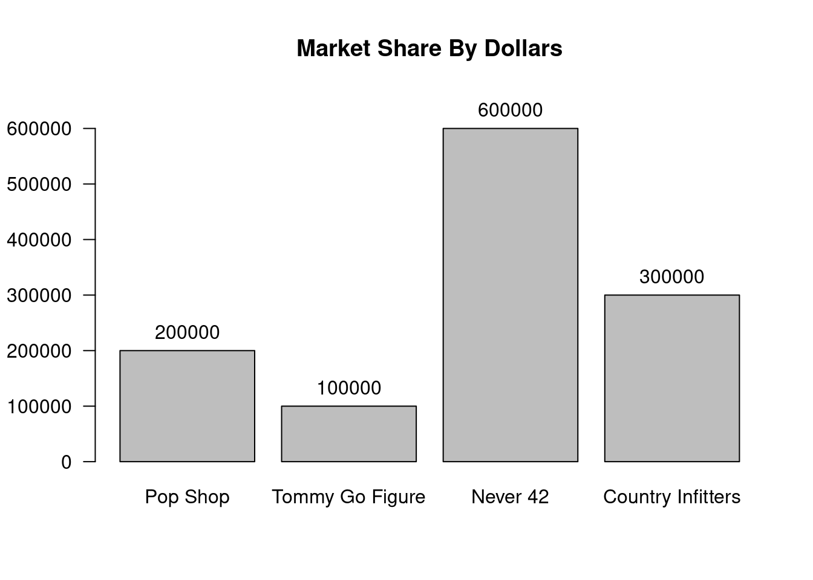
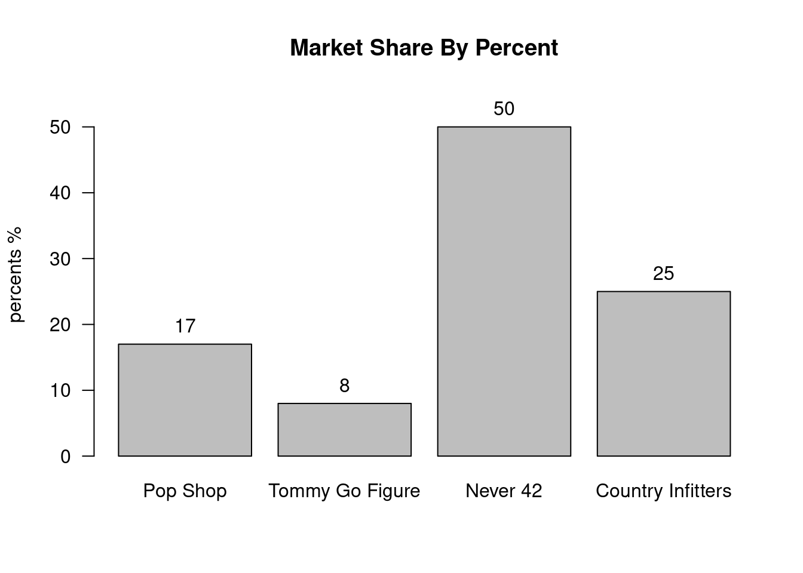

::: {.cell}

:::

::: {.cell}

:::

# Barplots {#barplots}

Most people are familar with bar charts. They show amounts for different categories.

The amounts will typically be either counts (frequencies) or percents.

We look at an example of both here.

## Market Share

Suppose the following fashion stores having competing products with the following market shares:

::: {.cell}
::: {.cell-output-display}

|Company           |  Sales|
|:-----------------|------:|
|Pop Shop          | 200000|
|Tommy Go Figure   | 100000|
|Never 42          | 600000|
|Country Infitters | 300000|

:::
:::

Here is the barplot that goes with this:

::: {.cell layout-align="center" example='true' title='Market Share By Dollars'}
::: {.cell-output-display}
{fig-align='center' width=672}
:::
:::

Now suppose we want the percentage breakdown of these market shares:

- From Pop Shop:

$$
\frac{200000}{1200000} =
17\%
$$

- From Tommy Go Figure:

$$
\frac{100000}{1200000} =
8\%
$$

- From Never 42:

$$
\frac{600000}{1200000} =
50\%
$$

- From Country Infitters:

$$
\frac{300000}{1200000} =
25\%
$$

So here is the market share by percentage:

::: {.cell}
::: {.cell-output-display}

|Company           | Percent|
|:-----------------|-------:|
|Pop Shop          |      17|
|Tommy Go Figure   |       8|
|Never 42          |      50|
|Country Infitters |      25|

:::
:::

Now if we make a barplot with percentages this looks like this:

:::{#exm-market-share-by-percent}
## Market Share By Percent

::: {.cell layout-align="center"}
::: {.cell-output-display}
{fig-align='center' width=672}
:::
:::

$$ \tag*{$\blacksquare$} $$
:::

Of course the graph does not look any different, but it is nice to see the percentage breakdown in the chart easily.

::: {.cell}

:::

