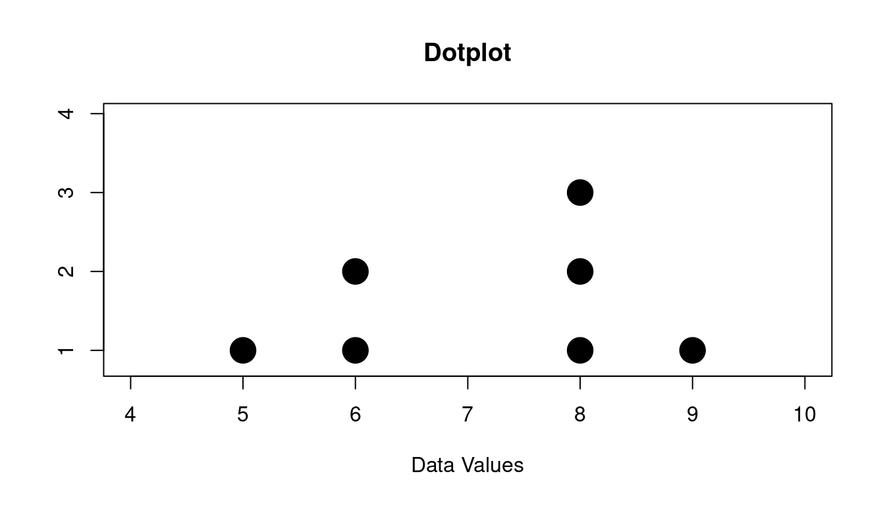
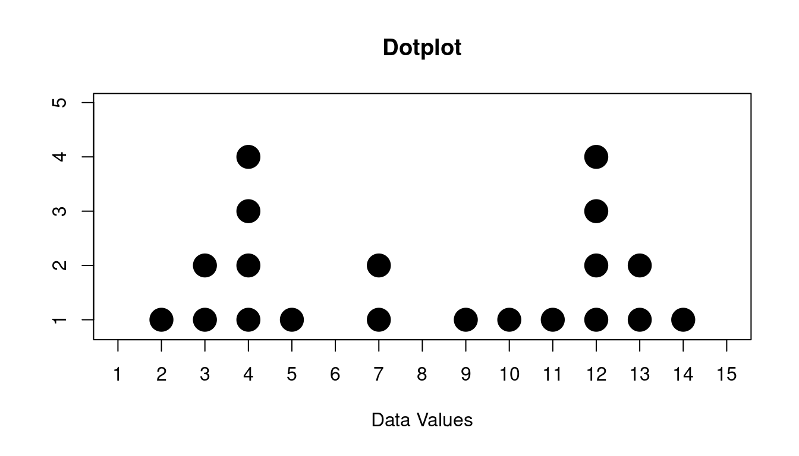
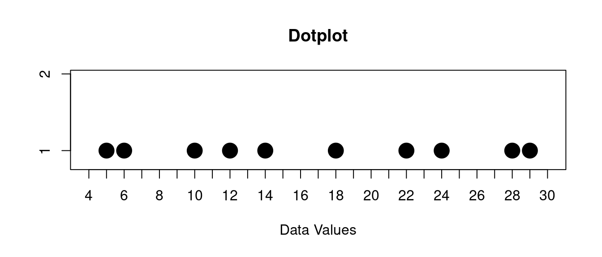
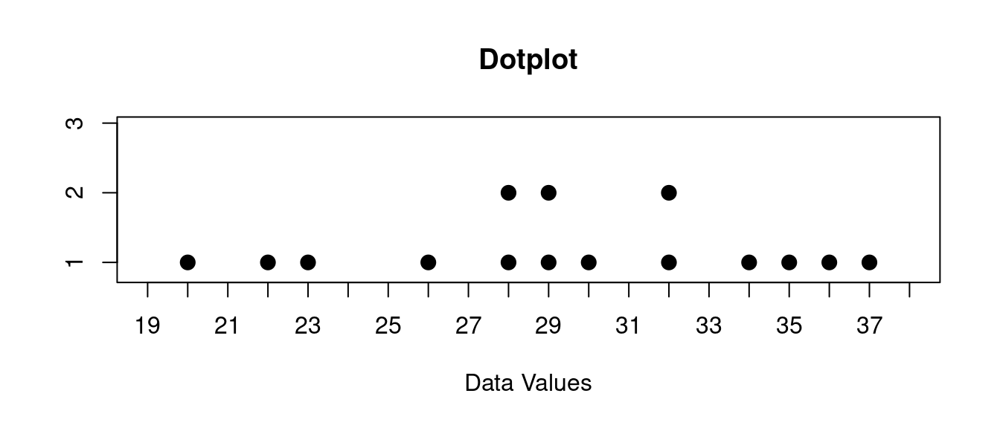
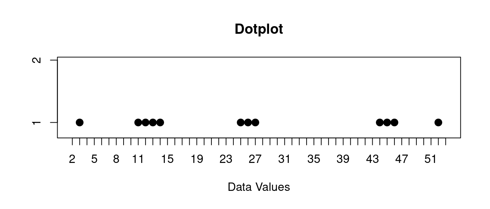
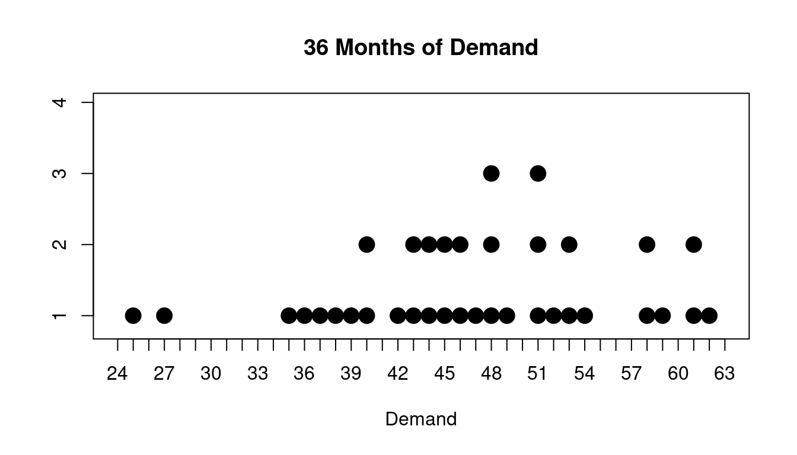

::: {.cell}

:::

# Dotplots and Distributions {#dotplots-and-distributions}

Dotplots are visual representations of a set of data. They show the data values in a set of data as \"stacks of dots\" according to how many data values there are. They are very simple, and so are very easy to interpret. If your data set is very big though, they can become cluttered.

Let\'s see some examples.

## Dotplot

For example suppose we have the following data set:

::: {.cell}

:::

$$
6, 8, 8, 9, 5, 6, 8
$$

Here is the dotplot that goes with this:

::: {.cell layout-align="center" example='true' title='Simple Dotplot'}
::: {.cell-output-display}
{fig-align='center' width=672}
:::
:::

You can see there are:

- one 5
- two 6s
- three 8s
- one 9

Dotplots are very good at showing the overall shape of the data. This shape is sometimes called the **distribution**.

So you will hear people speaking about the data and just calling it a \"distribution\".

## Three Important Properties of Distributions

Three very important properties about distributions:

- Are there any peaks?
- How spread out is the data?
- Are there any outliers?

### Peaks

For the peaks you might have just one or you might have more than one.

Or you might have none!

Here is some data that we want to look for peaks for:

::: {.cell}

:::

$$
13, 2, 12, 13, 7, 4, 4, 4, 12, 4, 3, 11, 7, 14, 3, 12, 9, 12, 5, 10
$$

If we make a dotplot of this data it looks like this:

::: {.cell layout-align="center" example='true' title='Distribution with Two Peaks'}
::: {.cell-output-display}
{fig-align='center' width=672}
:::
:::

You might describe this like this:

> The data has two peaks, one at 4 and one at 12

You might also have a distribution with no peaks. Here is an example of that:

::: {.cell}

:::

$$
12, 29, 18, 14, 22, 28, 5, 24, 6, 10
$$

If we make a dotplot of this data it looks like this:

::: {.cell layout-align="center" example='true' title='Distribution With No Peaks'}
::: {.cell-output-display}
{fig-align='center' width=672}
:::
:::

You might describe this like this:

> The data has no peaks

Some people describe peaks as \"clusters\", but it is also possible to have clustering without a peak.

I think it is better to describe \"peaks\" as high points in the distribution and \"clusters\" as data values that are close to each other along the horizontal axis.

You can see an example of clusters that are not peaks below.

### Spread

For the spread of the data, one common way to talk about the spread is to look for the \"range\" it has.

The **range** is from the **minimum** value to the **maximum** value.

Here\'s an example:

::: {.cell}

:::

$$
30, 29, 22, 26, 32, 32, 23, 28, 20, 28, 37, 35, 29, 36, 34
$$

If we make a dotplot of this data it looks like this:

::: {.cell layout-align="center" example='true' title='Range of Distribution'}
::: {.cell-output-display}
{fig-align='center' width=672}
:::
:::

You might describe this like this:

> The range of this data is from 20 to 37

The range is one part important part of the spread. But it is not all of the story. You might also look for clusters of data as well.

Here is another example of some data:

::: {.cell}

:::

$$
3, 12, 11, 13, 14, 25, 26, 27, 45, 46, 44, 52
$$

If we make a dotplot of this data it looks like this:

::: {.cell layout-align="center" example='true' title='Clusters'}
::: {.cell-output-display}
{fig-align='center' width=672}
:::
:::

You might describe this like this:

> The data is in three clusters, one at about 13, one about 26, and one at 45.

The range of this data is from 3 to 52, but you would also notice this clustering as well.

### Outliers

Finally you might also look for **outliers**.

Outliers are data values that are far from the others in the data, and do not look typical. Sometimes outliers are errors in the data collection process. Sometimes they are just unusual values that happened.

Below is an example three years of demand data for a product.

::: {.cell}

:::

Here are the actual values from the last 36 months for this product:

$$
38, 46, 58, 36, 44, 46, 51, 43, 61, 44, 48, 53, 42, 37, 59, 27, 52, 45, 53, 48, 62, 35, 58, 61, 45, 25, 49, 40, 51, 47, 51, 48, 54, 43, 39, 40
$$

Of course we are interested in whether there is some months where demand was very low or some months where the demand was vary high.

We could just look at the numbers above, but it is nice to see this as a graph as well too. So lets look at a dotplot of these values:

::: {.cell layout-align="center" example='true' title='Outliers in Demand'}
::: {.cell-output-display}
{fig-align='center' width=672}
:::
:::

You might describe this like this:

> The data has a couple of outliers at 25 and 27

Most of the time the demand for this product was roughly between 34 and 54 but there were some outliers. You might be tempted to ask what happened for those months where the demand was 25 or 27.

Also there are a couple of clusters of high values as well around 58 and 62.

These might not be considered outliers but you would definitely like to understand what is happening there as well.
