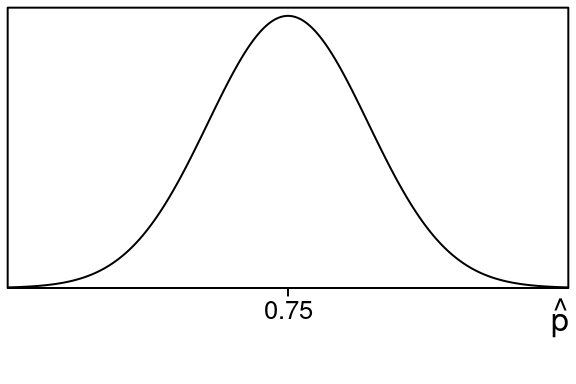
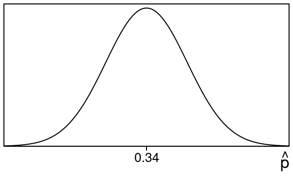

::: {.cell}

:::


# Hypothesis Testing - Proportions {#hypothesis-testing-proportions}

Remember we said that typically we do not know things like parameters
for populations. For example we don't always know population proportions
in situations we are interested in.

But suppose **someone claims that a population proportion is some
value** (like 75%).

What kinds of sample proportions would we expect to get from such a
population?

If you remember the Central Limit Theorem it says that in this case the
sampling distribution of sample proportions would look something like
this:


::: {.cell layout-align="center"}
::: {.cell-output-display}
{fig-align='center' width=288}
:::
:::

with the middle of it at .75.

So if this were true, if we took sample proportions we would usually
wind up near .75, and more rarely we would get sample proportions that
would be farther away.

We can use this idea to **test the claim that the population proportion
is equal to the claimed value**.

This is called a **hypothesis test** of the (claimed) population
proportion. The results from a hypothesis test will be roughly this:

- If our **sample proportion is too far away** we say it is **evidence against the claim**.
- If our **sample proportion is close to the middle**, we say it is
**no evidence against the claim**.

Basically if the sample proportion is too far away from the (claimed)
population proportion, we believe that claim about the population
proportion may be bogus.

Now remember someone can claim anything, even something outrageous\....
Like "90% of Republicans will vote for Obama" or "FIT consists of 50%
male students".

With Hypothesis Testing we can test the validity of such claims (and
more reasonable claims too).

By looking at a sample, and examining how close the sample proportion is
to the (claimed) population proportion we can figure out whether the
claim makes sense or not.

## Steps for Hypothesis Testing

Note: We use $p_{0}$ as the notation for the proposed population proportion. You should think of this as an actual number like $.32$ or $.75$. It is the **claimed** population proportion.

### 1) Write down the claimed null hypothesis {-}

$H_{0}:\ p = p_{0}$

This is called null hypothesis (or "H zero") and its interpretation in
words is this:

"**The population proportion is equal to $p_{0}$**"

### 2) Write down the alternative hypothesis {-}

This will be one of the following types:

-   $H_{a}:\ p < p_{0}$ (This one is called a **left tail test** )

This one is interpreted "**the population proportion is less than $p_{0}$**"

-   $H_{a}:\ p > p_{0}$ (This one is called a **right tail test** )

This one is interpreted "**the population proportion is greater than $p_{0}$**"

-   $H_{a}:\ p \neq p_{0}$ (This one is called a **two tail test** )

This one is interpreted "**the population proportion is not equal to $p_{0}$**"

Which of these you pick depends on what you (as the researcher) want to
show about the population proportion:

-   If you think it is actually smaller than what was claimed, pick the **left tail test**
-   If you think it is actually bigger than what was claimed, pick the **right tail test**
-   If you just want to show its different from what was claimed, and you don't care about how it is different (bigger or smaller would be fine from your viewpoint), pick the **two tailed test**

### 3) Take a (random) sample from the population and compute the sample proportion {-}

$$
\widehat{p} = \frac{count}{\text{sample size}} = \frac{count}{n}
$$

This is called the **test statistic**

### 4) Compute the z-score for the test statistic {-}

$$
z = \frac{\widehat{p}-p_{0}}{\sqrt{\frac{p_{0}(1-p_{0})}{n}}}
$$

Here you use the (proposed) population proportion $p_{0}$ and the
$\widehat{p}$ is the sample proportion you got in the previous step.

### 5) Find the the P-value {-}

The **P-value** is what you use to conclude your test.

Its value represents the chance that you get your sample proportion or something more extreme given that the null hypothesis is true.

In more concrete terms, it is going to be an area (left tail, right tail or both) that comes from your sample proportion.

Here is how you compute it:

-   For **left tail test**, the $P = \text{left tail area}$
-   For **right tail test**, the $P = \text{right tail area}$
-   For **two tail test**, the $P = 2(\text{area of tail})$

To get these areas you just use the z-value from step \#4 above and compute them from that.

### 6a) Find the conclusion from the P-value {-}

To find your conclusion for a hypothesis test once you have your P-value you can use the following guide based on the size of the P-value:

-   P-value bigger than .1, then **little or no** evidence against  ${H_{0}}_{}$
-   P-value between .05 and .1, then **some** evidence against ${H_{0}}_{}$
-   P-value between .01 and .05, then **moderate** evidence against ${H_{0}}_{}$
-   P-value between .001 and .01, then **strong** evidence against ${H_{0}}_{}$
-   P-value less than .001, then **very strong** evidence against ${H_{0}}_{}$

One thing to notice about the conclusions is: **small P-values are
evidence against the null hypothesis.**

That's because a small P-value represents a small area for a tail and
that happens when the z-value (and hence the sample proportion) is more
extreme.

:::{#exm-conclusion-of-hypothesis-test}
## Conclusion of Hypothesis Test

::: {.cell example='true' title='Conclusion of Hypothesis Test'}

Suppose you are doing a hypothesis test and you find out that your P-value is $p=.047$.

Since

$$
.01 < .047 < .05
$$

This means that your conclusion is **moderate** evidence against the null $H_0$.
:::

:::

### 6b) Find the conclusion from level of significance {-}
Sometimes the conclusion part of a hypothesis test is done in a different way than the above step 6a.

If you are given a **level of significance** (called $\alpha$) you decide your conclusion in a slightly different way:

- If $P < \alpha$, then you **Reject the null hypothesis**
- If $P \geq \alpha$, then you **Fail to reject the null hypothesis**

Some people use the term **accept the null hypothesis** instead of **fail to reject the null hypothesis**. We take these to be equivalent.

Using the level of signifcance like this means you state your conclusion differently than in section 6a above. The $\alpha$ is more like a **cut-off** for rejecting the null hypothesis in this case.

And in the case you either **reject the null** or **fail to reject the null**, and there is no othersituation (no "moderate evidence" or "very strong evidence"... just reject or not plain and simple)

:::{#exm-level-of-significance}
## Level of Significance

::: {.cell}

Suppose you are doing a hypothesis test at the 5% level of significance,(which is $\alpha=.05$) and you find out that your P-value is $P=.023$.

Since

$$
.023 < .05
$$

This means that $P < \alpha$ and so you **reject the null hypothesis**.
:::

:::

So in this case you decide your conclusion by comparing to the given $\alpha$ value and not by the method in section 6a. If your P-value is smaller than $\alpha$, you **reject the null hypothesis**, otherwise you **fail to reject the null hypothesis**.

## Other terminology

Sometimes you will hear people say **accept the null hypothesis** when $p \geq \alpha$. This is just a different way of saying **fail to reject the null hypothesis**.

Finally keep this is mind as well:

- **reject the null hypothesis** means you believe the alternative
- **failure to reject the null hypothesis** means you believe the null could be true

And one more that is like a court case verdict:

- **reject the null hypothesis** is in favor of $H_a$
- **failure to reject the null hypothesis** is in favor of $H_0$

## Type I and Type II Error

Let us take a minute to mention two types of errors that take place with hypothesis testing called **Type I Error** and **Type II Error.**

Here are the complete options when you’re dealing with these hypothesis tests. Recall that $H_0$ stands for the null hypothesis. Also we will use the phrase \"accept $H_0$\" instead of \"fail to reject $H_0$\". These mean the same thing.

- If $H_0$ is actually true and in our testing we accept $H_0$  then there is no mistake
- If $H_0$ is actually false and in our testing we reject $H_0$  then there is no mistake
- If $H_0$ is actually true and in our testing we reject $H_0$ then that is a mistake and this is called a **Type I Error**
- If $H_0$ is actually false and in our testing we accept $H_0$ then that is a mistake and this is called a **Type II Error**.

Most people give a guilty vs. innocent example so we will too.

- If an innocent person is not convicted then there is no mistake
- If a guilty person is convicted then there is no mistake
- If an innocent person is convicted then that is a mistake and is called a **Type I Error**
- If a guilty person is not convicted then that is a mistake and is called a **Type II Error**

These errors can impact our daily lives in a huge way, like in the example mentioned above.  More everyday examples include construction projects, our safety, and more.

## Examples of Hypothesis Testing

The first example is a left tail test:

:::{#exm-left-tail-hypothesis-test-proportions}
## Left Tail Hypothesis Test Proportions

::: {.cell}
::: {.cell-output-display}


::: {.cell}

:::


Suppose someone claims a population proportion is $79\%$ but we believe that it is less than this. To test this we take a sample proportion and get $190$ out of $250$. Perform a hypothesis test for this situation.

**_Solution:_**


::: {.cell}

:::


::: {.cell}

:::


The claim about the population proportion involves $0.79$.

Here are the null and the alternative hypotheses:

\begin{align}
H_0:p &= 0.79 \\
H_a:p &< 0.79 
\end{align}

- The null hypothesis says **The population proportion is $0.79$**
- The alternative hypothesis says **The population proportion is less than 
$0.79$**

Before we start we check the conditions of the Central Limit Theorem to make sure we can use a normal distribution here:

$np=(250)(0.79)= 197.5$ and $n(1-p)=(250)(0.21)= 52.5$

Since these are both at least $5$ we are in good shape.

Now if the null hypothesis is true, the Central Limit Theorem says the sampling distribution of sample proportions would look like this:


::: {.cell layout-align="center"}
::: {.cell-output-display}
{fig-align='center' width=288}
:::
:::


Next we look at our test statistic, which is just our sample proportion:

\begin{equation}
\hat p = \frac{count}{n} = \frac{190}{250} = 0.76 
\end{equation}

So we want to know how likely it is to get a sample proportion of 0.76 in this situation.  

In fact the **P-value is just this left tail area**


::: {.cell layout-align="center"}
::: {.cell-output-display}
{fig-align='center' width=288}
:::
:::


We want the shaded **_left tail area_** that is to the left of $\hat p = 0.76$:

We will find this area by changing the sample proportion $\hat p$ into a z-value and using the standard normal table. 

First we need the calculation of the standard deviation since we need this in our z-value calculation:

\begin{equation}
\small{
stdev=\sqrt{\frac{(1-p)p}{n}} 
 =\sqrt{\frac{(1-0.79)0.79}{250}}
 =\sqrt{\frac{(0.21)0.79}{250}}
 =\sqrt{\frac{0.1659}{250}}
 =0.0257604 
 }
\end{equation}

Now lets find the z-value using the sample proportion $\hat p= 0.76$, the population proportion $p=0.79$ and the standard deviation $stdev$ we just found:

\begin{equation}
z=\frac{\hat p-p}{stdev}
 =\frac{0.76-0.79}{0.0257604}
 =\frac{-0.03}{0.0257604}
 =-1.16 
\end{equation}

So here is the equivalent left tail area for of $z=-1.16$. 


::: {.cell layout-align="center"}
::: {.cell-output-display}
{fig-align='center' width=288}
:::
:::


This area is the same size as our original area so we just find this one using the standard normal distribution.

We can look up the area in the standard normal z-table using $z=-1.16$  
    
We go to the row that has -1.1 and then to the column that contains .06 and we see this: 


::: {.cell}
::: {.cell-output-display}

```{=html}
<table class="huxtable" data-quarto-disable-processing="true"  style="width: 85%; margin-left: auto; margin-right: auto;">
<col><col><col><col><col><col><col><col><col><col><col><thead>
<tr>
<th class="huxtable-cell huxtable-header" style="text-align: center;  border-style: solid solid solid solid; border-width: 0.5pt 0.5pt 0.5pt 0.5pt; border-top-color: rgb(0, 0, 0);  border-right-color: rgb(0, 0, 0);  border-bottom-color: rgb(0, 0, 0);  border-left-color: rgb(0, 0, 0);      font-size: 11pt;"></th><th class="huxtable-cell huxtable-header" style="text-align: center;  border-style: solid solid solid solid; border-width: 0.5pt 0.5pt 0.5pt 0.5pt; border-top-color: rgb(0, 0, 0);  border-right-color: rgb(0, 0, 0);  border-bottom-color: rgb(0, 0, 0);  border-left-color: rgb(0, 0, 0);      font-size: 11pt;">.00</th><th class="huxtable-cell huxtable-header" style="text-align: center;  border-style: solid solid solid solid; border-width: 0.5pt 0.5pt 0.5pt 0.5pt; border-top-color: rgb(0, 0, 0);  border-right-color: rgb(0, 0, 0);  border-bottom-color: rgb(0, 0, 0);  border-left-color: rgb(0, 0, 0);      font-size: 11pt;">.01</th><th class="huxtable-cell huxtable-header" style="text-align: center;  border-style: solid solid solid solid; border-width: 0.5pt 0.5pt 0.5pt 0.5pt; border-top-color: rgb(0, 0, 0);  border-right-color: rgb(0, 0, 0);  border-bottom-color: rgb(0, 0, 0);  border-left-color: rgb(0, 0, 0);      font-size: 11pt;">.02</th><th class="huxtable-cell huxtable-header" style="text-align: center;  border-style: solid solid solid solid; border-width: 0.5pt 0.5pt 0.5pt 0.5pt; border-top-color: rgb(0, 0, 0);  border-right-color: rgb(0, 0, 0);  border-bottom-color: rgb(0, 0, 0);  border-left-color: rgb(0, 0, 0);      font-size: 11pt;">.03</th><th class="huxtable-cell huxtable-header" style="text-align: center;  border-style: solid solid solid solid; border-width: 0.5pt 0.5pt 0.5pt 0.5pt; border-top-color: rgb(0, 0, 0);  border-right-color: rgb(0, 0, 0);  border-bottom-color: rgb(0, 0, 0);  border-left-color: rgb(0, 0, 0);      font-size: 11pt;">.04</th><th class="huxtable-cell huxtable-header" style="text-align: center;  border-style: solid solid solid solid; border-width: 0.5pt 0.5pt 0.5pt 0.5pt; border-top-color: rgb(0, 0, 0);  border-right-color: rgb(0, 0, 0);  border-bottom-color: rgb(0, 0, 0);  border-left-color: rgb(0, 0, 0);      font-size: 11pt;">.05</th><th class="huxtable-cell huxtable-header" style="text-align: center;  border-style: solid solid solid solid; border-width: 0.5pt 0.5pt 0.5pt 0.5pt; border-top-color: rgb(0, 0, 0);  border-right-color: rgb(0, 0, 0);  border-bottom-color: rgb(0, 0, 0);  border-left-color: rgb(0, 0, 0);      font-size: 11pt;">.06</th><th class="huxtable-cell huxtable-header" style="text-align: center;  border-style: solid solid solid solid; border-width: 0.5pt 0.5pt 0.5pt 0.5pt; border-top-color: rgb(0, 0, 0);  border-right-color: rgb(0, 0, 0);  border-bottom-color: rgb(0, 0, 0);  border-left-color: rgb(0, 0, 0);      font-size: 11pt;">.07</th><th class="huxtable-cell huxtable-header" style="text-align: center;  border-style: solid solid solid solid; border-width: 0.5pt 0.5pt 0.5pt 0.5pt; border-top-color: rgb(0, 0, 0);  border-right-color: rgb(0, 0, 0);  border-bottom-color: rgb(0, 0, 0);  border-left-color: rgb(0, 0, 0);      font-size: 11pt;">.08</th><th class="huxtable-cell huxtable-header" style="text-align: center;  border-style: solid solid solid solid; border-width: 0.5pt 0.5pt 0.5pt 0.5pt; border-top-color: rgb(0, 0, 0);  border-right-color: rgb(0, 0, 0);  border-bottom-color: rgb(0, 0, 0);  border-left-color: rgb(0, 0, 0);      font-size: 11pt;">.09</th></tr>
</thead>
<tbody>
<tr>
<td class="huxtable-cell" style="text-align: center;  border-style: solid solid solid solid; border-width: 0.5pt 0.5pt 0.5pt 0.5pt; border-top-color: rgb(0, 0, 0);  border-right-color: rgb(0, 0, 0);  border-bottom-color: rgb(0, 0, 0);  border-left-color: rgb(0, 0, 0);   font-weight: bold;   font-size: 11pt;">-1.2</td><td class="huxtable-cell" style="text-align: center;  border-style: solid solid solid solid; border-width: 0.5pt 0.5pt 0.5pt 0.5pt; border-top-color: rgb(0, 0, 0);  border-right-color: rgb(0, 0, 0);  border-bottom-color: rgb(0, 0, 0);  border-left-color: rgb(0, 0, 0);      font-size: 11pt;">.1151</td><td class="huxtable-cell" style="text-align: center;  border-style: solid solid solid solid; border-width: 0.5pt 0.5pt 0.5pt 0.5pt; border-top-color: rgb(0, 0, 0);  border-right-color: rgb(0, 0, 0);  border-bottom-color: rgb(0, 0, 0);  border-left-color: rgb(0, 0, 0);      font-size: 11pt;">.1131</td><td class="huxtable-cell" style="text-align: center;  border-style: solid solid solid solid; border-width: 0.5pt 0.5pt 0.5pt 0.5pt; border-top-color: rgb(0, 0, 0);  border-right-color: rgb(0, 0, 0);  border-bottom-color: rgb(0, 0, 0);  border-left-color: rgb(0, 0, 0);      font-size: 11pt;">.1112</td><td class="huxtable-cell" style="text-align: center;  border-style: solid solid solid solid; border-width: 0.5pt 0.5pt 0.5pt 0.5pt; border-top-color: rgb(0, 0, 0);  border-right-color: rgb(0, 0, 0);  border-bottom-color: rgb(0, 0, 0);  border-left-color: rgb(0, 0, 0);      font-size: 11pt;">.1093</td><td class="huxtable-cell" style="text-align: center;  border-style: solid solid solid solid; border-width: 0.5pt 0.5pt 0.5pt 0.5pt; border-top-color: rgb(0, 0, 0);  border-right-color: rgb(0, 0, 0);  border-bottom-color: rgb(0, 0, 0);  border-left-color: rgb(0, 0, 0);      font-size: 11pt;">.1075</td><td class="huxtable-cell" style="text-align: center;  border-style: solid solid solid solid; border-width: 0.5pt 0.5pt 0.5pt 0.5pt; border-top-color: rgb(0, 0, 0);  border-right-color: rgb(0, 0, 0);  border-bottom-color: rgb(0, 0, 0);  border-left-color: rgb(0, 0, 0);      font-size: 11pt;">.1056</td><td class="huxtable-cell" style="text-align: center;  border-style: solid solid solid solid; border-width: 0.5pt 0.5pt 0.5pt 0.5pt; border-top-color: rgb(0, 0, 0);  border-right-color: rgb(0, 0, 0);  border-bottom-color: rgb(0, 0, 0);  border-left-color: rgb(0, 0, 0);  background-color: rgb(204, 204, 204);    font-size: 11pt;">.1038</td><td class="huxtable-cell" style="text-align: center;  border-style: solid solid solid solid; border-width: 0.5pt 0.5pt 0.5pt 0.5pt; border-top-color: rgb(0, 0, 0);  border-right-color: rgb(0, 0, 0);  border-bottom-color: rgb(0, 0, 0);  border-left-color: rgb(0, 0, 0);      font-size: 11pt;">.1020</td><td class="huxtable-cell" style="text-align: center;  border-style: solid solid solid solid; border-width: 0.5pt 0.5pt 0.5pt 0.5pt; border-top-color: rgb(0, 0, 0);  border-right-color: rgb(0, 0, 0);  border-bottom-color: rgb(0, 0, 0);  border-left-color: rgb(0, 0, 0);      font-size: 11pt;">.1003</td><td class="huxtable-cell" style="text-align: center;  border-style: solid solid solid solid; border-width: 0.5pt 0.5pt 0.5pt 0.5pt; border-top-color: rgb(0, 0, 0);  border-right-color: rgb(0, 0, 0);  border-bottom-color: rgb(0, 0, 0);  border-left-color: rgb(0, 0, 0);      font-size: 11pt;">.0985</td></tr>
<tr>
<td class="huxtable-cell" style="text-align: center;  border-style: solid solid solid solid; border-width: 0.5pt 0.5pt 0.5pt 0.5pt; border-top-color: rgb(0, 0, 0);  border-right-color: rgb(0, 0, 0);  border-bottom-color: rgb(0, 0, 0);  border-left-color: rgb(0, 0, 0);   font-weight: bold;   font-size: 11pt;">-1.1</td><td class="huxtable-cell" style="text-align: center;  border-style: solid solid solid solid; border-width: 0.5pt 0.5pt 0.5pt 0.5pt; border-top-color: rgb(0, 0, 0);  border-right-color: rgb(0, 0, 0);  border-bottom-color: rgb(0, 0, 0);  border-left-color: rgb(0, 0, 0);  background-color: rgb(204, 204, 204);    font-size: 11pt;">.1357</td><td class="huxtable-cell" style="text-align: center;  border-style: solid solid solid solid; border-width: 0.5pt 0.5pt 0.5pt 0.5pt; border-top-color: rgb(0, 0, 0);  border-right-color: rgb(0, 0, 0);  border-bottom-color: rgb(0, 0, 0);  border-left-color: rgb(0, 0, 0);  background-color: rgb(204, 204, 204);    font-size: 11pt;">.1335</td><td class="huxtable-cell" style="text-align: center;  border-style: solid solid solid solid; border-width: 0.5pt 0.5pt 0.5pt 0.5pt; border-top-color: rgb(0, 0, 0);  border-right-color: rgb(0, 0, 0);  border-bottom-color: rgb(0, 0, 0);  border-left-color: rgb(0, 0, 0);  background-color: rgb(204, 204, 204);    font-size: 11pt;">.1314</td><td class="huxtable-cell" style="text-align: center;  border-style: solid solid solid solid; border-width: 0.5pt 0.5pt 0.5pt 0.5pt; border-top-color: rgb(0, 0, 0);  border-right-color: rgb(0, 0, 0);  border-bottom-color: rgb(0, 0, 0);  border-left-color: rgb(0, 0, 0);  background-color: rgb(204, 204, 204);    font-size: 11pt;">.1292</td><td class="huxtable-cell" style="text-align: center;  border-style: solid solid solid solid; border-width: 0.5pt 0.5pt 0.5pt 0.5pt; border-top-color: rgb(0, 0, 0);  border-right-color: rgb(0, 0, 0);  border-bottom-color: rgb(0, 0, 0);  border-left-color: rgb(0, 0, 0);  background-color: rgb(204, 204, 204);    font-size: 11pt;">.1271</td><td class="huxtable-cell" style="text-align: center;  border-style: solid solid solid solid; border-width: 0.5pt 0.5pt 0.5pt 0.5pt; border-top-color: rgb(0, 0, 0);  border-right-color: rgb(0, 0, 0);  border-bottom-color: rgb(0, 0, 0);  border-left-color: rgb(0, 0, 0);  background-color: rgb(204, 204, 204);    font-size: 11pt;">.1251</td><td class="huxtable-cell" style="text-align: center;  border-style: solid solid solid solid; border-width: 0.5pt 0.5pt 0.5pt 0.5pt; border-top-color: rgb(0, 0, 0);  border-right-color: rgb(0, 0, 0);  border-bottom-color: rgb(0, 0, 0);  border-left-color: rgb(0, 0, 0);  background-color: rgb(217, 217, 217); font-weight: bold;   font-size: 11pt;">.1230</td><td class="huxtable-cell" style="text-align: center;  border-style: solid solid solid solid; border-width: 0.5pt 0.5pt 0.5pt 0.5pt; border-top-color: rgb(0, 0, 0);  border-right-color: rgb(0, 0, 0);  border-bottom-color: rgb(0, 0, 0);  border-left-color: rgb(0, 0, 0);      font-size: 11pt;">.1210</td><td class="huxtable-cell" style="text-align: center;  border-style: solid solid solid solid; border-width: 0.5pt 0.5pt 0.5pt 0.5pt; border-top-color: rgb(0, 0, 0);  border-right-color: rgb(0, 0, 0);  border-bottom-color: rgb(0, 0, 0);  border-left-color: rgb(0, 0, 0);      font-size: 11pt;">.1190</td><td class="huxtable-cell" style="text-align: center;  border-style: solid solid solid solid; border-width: 0.5pt 0.5pt 0.5pt 0.5pt; border-top-color: rgb(0, 0, 0);  border-right-color: rgb(0, 0, 0);  border-bottom-color: rgb(0, 0, 0);  border-left-color: rgb(0, 0, 0);      font-size: 11pt;">.1170</td></tr>
<tr>
<td class="huxtable-cell" style="text-align: center;  border-style: solid solid solid solid; border-width: 0.5pt 0.5pt 0.5pt 0.5pt; border-top-color: rgb(0, 0, 0);  border-right-color: rgb(0, 0, 0);  border-bottom-color: rgb(0, 0, 0);  border-left-color: rgb(0, 0, 0);   font-weight: bold;   font-size: 11pt;">-1.0</td><td class="huxtable-cell" style="text-align: center;  border-style: solid solid solid solid; border-width: 0.5pt 0.5pt 0.5pt 0.5pt; border-top-color: rgb(0, 0, 0);  border-right-color: rgb(0, 0, 0);  border-bottom-color: rgb(0, 0, 0);  border-left-color: rgb(0, 0, 0);      font-size: 11pt;">.1587</td><td class="huxtable-cell" style="text-align: center;  border-style: solid solid solid solid; border-width: 0.5pt 0.5pt 0.5pt 0.5pt; border-top-color: rgb(0, 0, 0);  border-right-color: rgb(0, 0, 0);  border-bottom-color: rgb(0, 0, 0);  border-left-color: rgb(0, 0, 0);      font-size: 11pt;">.1562</td><td class="huxtable-cell" style="text-align: center;  border-style: solid solid solid solid; border-width: 0.5pt 0.5pt 0.5pt 0.5pt; border-top-color: rgb(0, 0, 0);  border-right-color: rgb(0, 0, 0);  border-bottom-color: rgb(0, 0, 0);  border-left-color: rgb(0, 0, 0);      font-size: 11pt;">.1539</td><td class="huxtable-cell" style="text-align: center;  border-style: solid solid solid solid; border-width: 0.5pt 0.5pt 0.5pt 0.5pt; border-top-color: rgb(0, 0, 0);  border-right-color: rgb(0, 0, 0);  border-bottom-color: rgb(0, 0, 0);  border-left-color: rgb(0, 0, 0);      font-size: 11pt;">.1515</td><td class="huxtable-cell" style="text-align: center;  border-style: solid solid solid solid; border-width: 0.5pt 0.5pt 0.5pt 0.5pt; border-top-color: rgb(0, 0, 0);  border-right-color: rgb(0, 0, 0);  border-bottom-color: rgb(0, 0, 0);  border-left-color: rgb(0, 0, 0);      font-size: 11pt;">.1492</td><td class="huxtable-cell" style="text-align: center;  border-style: solid solid solid solid; border-width: 0.5pt 0.5pt 0.5pt 0.5pt; border-top-color: rgb(0, 0, 0);  border-right-color: rgb(0, 0, 0);  border-bottom-color: rgb(0, 0, 0);  border-left-color: rgb(0, 0, 0);      font-size: 11pt;">.1469</td><td class="huxtable-cell" style="text-align: center;  border-style: solid solid solid solid; border-width: 0.5pt 0.5pt 0.5pt 0.5pt; border-top-color: rgb(0, 0, 0);  border-right-color: rgb(0, 0, 0);  border-bottom-color: rgb(0, 0, 0);  border-left-color: rgb(0, 0, 0);      font-size: 11pt;">.1446</td><td class="huxtable-cell" style="text-align: center;  border-style: solid solid solid solid; border-width: 0.5pt 0.5pt 0.5pt 0.5pt; border-top-color: rgb(0, 0, 0);  border-right-color: rgb(0, 0, 0);  border-bottom-color: rgb(0, 0, 0);  border-left-color: rgb(0, 0, 0);      font-size: 11pt;">.1423</td><td class="huxtable-cell" style="text-align: center;  border-style: solid solid solid solid; border-width: 0.5pt 0.5pt 0.5pt 0.5pt; border-top-color: rgb(0, 0, 0);  border-right-color: rgb(0, 0, 0);  border-bottom-color: rgb(0, 0, 0);  border-left-color: rgb(0, 0, 0);      font-size: 11pt;">.1401</td><td class="huxtable-cell" style="text-align: center;  border-style: solid solid solid solid; border-width: 0.5pt 0.5pt 0.5pt 0.5pt; border-top-color: rgb(0, 0, 0);  border-right-color: rgb(0, 0, 0);  border-bottom-color: rgb(0, 0, 0);  border-left-color: rgb(0, 0, 0);      font-size: 11pt;">.1379</td></tr>
</tbody>
</table>

```

:::
:::


So that means the **P-value** we need in this situation is:

\begin{equation}
P = \text{left tail area} =0.123 
\end{equation}

So based on this our conclusion is that this is **little or no evidence against the null hypothesis**.


$$
\tag*{$\blacksquare$}
$$
:::
:::

:::

Now let's see an example of a right tail test:

:::{#exm-right-tail-hypothesis-test-proportions}
## Right Tail Hypothesis Test-Proportions

::: {.cell}
::: {.cell-output-display}


::: {.cell}

:::


Suppose someone claims a population proportion is $34\%$ but we believe that it is more than this. To test this we take a sample proportion and get $101$ out of $250$. Perform a hypothesis test for this situation.

**_Solution:_**


::: {.cell}

:::


::: {.cell}

:::


The claim about the population proportion involves $0.34$.

Here are the null and the alternative hypotheses:

\begin{align}
H_0:p &= 0.34 \\
H_a:p &> 0.34 
\end{align}

- The null hypothesis says **The population proportion is $0.34$**
- The alternative hypothesis says **The population proportion is more than 
$0.34$**

Before we start we check the conditions of the Central Limit Theorem to make sure we can use a normal distribution here:

$np=(250)(0.34)= 85$ and $n(1-p)=(250)(0.66)= 165$

Since these are both at least $5$ we are in good shape.

Now if the null hypothesis is true, the Central Limit Theorem says the sampling distribution of sample proportions would look like this:


::: {.cell layout-align="center"}
::: {.cell-output-display}
{fig-align='center' width=288}
:::
:::


Next we look at our test statistic, which is just our sample proportion:

\begin{equation}
\hat p = \frac{count}{n} = \frac{101}{250} = 0.404 
\end{equation}

So we want to know how likely it is to get a sample proportion of 0.404 in this situation.  
    
In fact the **P-value is just this right tail area**


::: {.cell layout-align="center"}
::: {.cell-output-display}
{fig-align='center' width=288}
:::
:::


We want the shaded **_right tail area_** that is to the right of $\hat p = 0.404$:

We will find this area by changing the sample proportion $\hat p$ into a z-value and using the standard normal table. 

First we need the calculation of the standard deviation since we need this in our z-value calculation:

\begin{equation}
\small{
stdev=\sqrt{\frac{(1-p)p}{n}} 
 =\sqrt{\frac{(1-0.34)0.34}{250}}
 =\sqrt{\frac{(0.66)0.34}{250}}
 =\sqrt{\frac{0.2244}{250}}
 =0.02996 
 }
\end{equation}

Now lets find the z-value using the sample proportion $\hat p= 0.404$ the population proportion $p=0.34$ and the standard deviation $stdev$ we just found:

\begin{equation}
z=\frac{\hat p-p}{stdev}
 =\frac{0.404-0.34}{0.02996}
 =\frac{0.064}{0.02996}
 =2.14 
\end{equation}

So here is the equivalent right tail area for of $z=2.14$. 


::: {.cell layout-align="center"}
::: {.cell-output-display}
{fig-align='center' width=288}
:::
:::


This area is the same size as our original area so we just find this one using the standard normal distribution.

We can find the right tail area for $z=2.14$ by finding the left tail area and then subtracting that from 1.0.   
    
So lets look up the left tail area first. Go to the row that has 2.1 and then to the column that contains .04 and we see this: 


::: {.cell}
::: {.cell-output-display}

```{=html}
<table class="huxtable" data-quarto-disable-processing="true"  style="width: 85%; margin-left: auto; margin-right: auto;">
<col><col><col><col><col><col><col><col><col><col><col><thead>
<tr>
<th class="huxtable-cell huxtable-header" style="text-align: center;  border-style: solid solid solid solid; border-width: 0.5pt 0.5pt 0.5pt 0.5pt; border-top-color: rgb(0, 0, 0);  border-right-color: rgb(0, 0, 0);  border-bottom-color: rgb(0, 0, 0);  border-left-color: rgb(0, 0, 0);      font-size: 11pt;"></th><th class="huxtable-cell huxtable-header" style="text-align: center;  border-style: solid solid solid solid; border-width: 0.5pt 0.5pt 0.5pt 0.5pt; border-top-color: rgb(0, 0, 0);  border-right-color: rgb(0, 0, 0);  border-bottom-color: rgb(0, 0, 0);  border-left-color: rgb(0, 0, 0);      font-size: 11pt;">.00</th><th class="huxtable-cell huxtable-header" style="text-align: center;  border-style: solid solid solid solid; border-width: 0.5pt 0.5pt 0.5pt 0.5pt; border-top-color: rgb(0, 0, 0);  border-right-color: rgb(0, 0, 0);  border-bottom-color: rgb(0, 0, 0);  border-left-color: rgb(0, 0, 0);      font-size: 11pt;">.01</th><th class="huxtable-cell huxtable-header" style="text-align: center;  border-style: solid solid solid solid; border-width: 0.5pt 0.5pt 0.5pt 0.5pt; border-top-color: rgb(0, 0, 0);  border-right-color: rgb(0, 0, 0);  border-bottom-color: rgb(0, 0, 0);  border-left-color: rgb(0, 0, 0);      font-size: 11pt;">.02</th><th class="huxtable-cell huxtable-header" style="text-align: center;  border-style: solid solid solid solid; border-width: 0.5pt 0.5pt 0.5pt 0.5pt; border-top-color: rgb(0, 0, 0);  border-right-color: rgb(0, 0, 0);  border-bottom-color: rgb(0, 0, 0);  border-left-color: rgb(0, 0, 0);      font-size: 11pt;">.03</th><th class="huxtable-cell huxtable-header" style="text-align: center;  border-style: solid solid solid solid; border-width: 0.5pt 0.5pt 0.5pt 0.5pt; border-top-color: rgb(0, 0, 0);  border-right-color: rgb(0, 0, 0);  border-bottom-color: rgb(0, 0, 0);  border-left-color: rgb(0, 0, 0);      font-size: 11pt;">.04</th><th class="huxtable-cell huxtable-header" style="text-align: center;  border-style: solid solid solid solid; border-width: 0.5pt 0.5pt 0.5pt 0.5pt; border-top-color: rgb(0, 0, 0);  border-right-color: rgb(0, 0, 0);  border-bottom-color: rgb(0, 0, 0);  border-left-color: rgb(0, 0, 0);      font-size: 11pt;">.05</th><th class="huxtable-cell huxtable-header" style="text-align: center;  border-style: solid solid solid solid; border-width: 0.5pt 0.5pt 0.5pt 0.5pt; border-top-color: rgb(0, 0, 0);  border-right-color: rgb(0, 0, 0);  border-bottom-color: rgb(0, 0, 0);  border-left-color: rgb(0, 0, 0);      font-size: 11pt;">.06</th><th class="huxtable-cell huxtable-header" style="text-align: center;  border-style: solid solid solid solid; border-width: 0.5pt 0.5pt 0.5pt 0.5pt; border-top-color: rgb(0, 0, 0);  border-right-color: rgb(0, 0, 0);  border-bottom-color: rgb(0, 0, 0);  border-left-color: rgb(0, 0, 0);      font-size: 11pt;">.07</th><th class="huxtable-cell huxtable-header" style="text-align: center;  border-style: solid solid solid solid; border-width: 0.5pt 0.5pt 0.5pt 0.5pt; border-top-color: rgb(0, 0, 0);  border-right-color: rgb(0, 0, 0);  border-bottom-color: rgb(0, 0, 0);  border-left-color: rgb(0, 0, 0);      font-size: 11pt;">.08</th><th class="huxtable-cell huxtable-header" style="text-align: center;  border-style: solid solid solid solid; border-width: 0.5pt 0.5pt 0.5pt 0.5pt; border-top-color: rgb(0, 0, 0);  border-right-color: rgb(0, 0, 0);  border-bottom-color: rgb(0, 0, 0);  border-left-color: rgb(0, 0, 0);      font-size: 11pt;">.09</th></tr>
</thead>
<tbody>
<tr>
<td class="huxtable-cell" style="text-align: center;  border-style: solid solid solid solid; border-width: 0.5pt 0.5pt 0.5pt 0.5pt; border-top-color: rgb(0, 0, 0);  border-right-color: rgb(0, 0, 0);  border-bottom-color: rgb(0, 0, 0);  border-left-color: rgb(0, 0, 0);   font-weight: bold;   font-size: 11pt;">2.0</td><td class="huxtable-cell" style="text-align: center;  border-style: solid solid solid solid; border-width: 0.5pt 0.5pt 0.5pt 0.5pt; border-top-color: rgb(0, 0, 0);  border-right-color: rgb(0, 0, 0);  border-bottom-color: rgb(0, 0, 0);  border-left-color: rgb(0, 0, 0);      font-size: 11pt;">.9772</td><td class="huxtable-cell" style="text-align: center;  border-style: solid solid solid solid; border-width: 0.5pt 0.5pt 0.5pt 0.5pt; border-top-color: rgb(0, 0, 0);  border-right-color: rgb(0, 0, 0);  border-bottom-color: rgb(0, 0, 0);  border-left-color: rgb(0, 0, 0);      font-size: 11pt;">.9778</td><td class="huxtable-cell" style="text-align: center;  border-style: solid solid solid solid; border-width: 0.5pt 0.5pt 0.5pt 0.5pt; border-top-color: rgb(0, 0, 0);  border-right-color: rgb(0, 0, 0);  border-bottom-color: rgb(0, 0, 0);  border-left-color: rgb(0, 0, 0);      font-size: 11pt;">.9783</td><td class="huxtable-cell" style="text-align: center;  border-style: solid solid solid solid; border-width: 0.5pt 0.5pt 0.5pt 0.5pt; border-top-color: rgb(0, 0, 0);  border-right-color: rgb(0, 0, 0);  border-bottom-color: rgb(0, 0, 0);  border-left-color: rgb(0, 0, 0);      font-size: 11pt;">.9788</td><td class="huxtable-cell" style="text-align: center;  border-style: solid solid solid solid; border-width: 0.5pt 0.5pt 0.5pt 0.5pt; border-top-color: rgb(0, 0, 0);  border-right-color: rgb(0, 0, 0);  border-bottom-color: rgb(0, 0, 0);  border-left-color: rgb(0, 0, 0);  background-color: rgb(204, 204, 204);    font-size: 11pt;">.9793</td><td class="huxtable-cell" style="text-align: center;  border-style: solid solid solid solid; border-width: 0.5pt 0.5pt 0.5pt 0.5pt; border-top-color: rgb(0, 0, 0);  border-right-color: rgb(0, 0, 0);  border-bottom-color: rgb(0, 0, 0);  border-left-color: rgb(0, 0, 0);      font-size: 11pt;">.9798</td><td class="huxtable-cell" style="text-align: center;  border-style: solid solid solid solid; border-width: 0.5pt 0.5pt 0.5pt 0.5pt; border-top-color: rgb(0, 0, 0);  border-right-color: rgb(0, 0, 0);  border-bottom-color: rgb(0, 0, 0);  border-left-color: rgb(0, 0, 0);      font-size: 11pt;">.9803</td><td class="huxtable-cell" style="text-align: center;  border-style: solid solid solid solid; border-width: 0.5pt 0.5pt 0.5pt 0.5pt; border-top-color: rgb(0, 0, 0);  border-right-color: rgb(0, 0, 0);  border-bottom-color: rgb(0, 0, 0);  border-left-color: rgb(0, 0, 0);      font-size: 11pt;">.9808</td><td class="huxtable-cell" style="text-align: center;  border-style: solid solid solid solid; border-width: 0.5pt 0.5pt 0.5pt 0.5pt; border-top-color: rgb(0, 0, 0);  border-right-color: rgb(0, 0, 0);  border-bottom-color: rgb(0, 0, 0);  border-left-color: rgb(0, 0, 0);      font-size: 11pt;">.9812</td><td class="huxtable-cell" style="text-align: center;  border-style: solid solid solid solid; border-width: 0.5pt 0.5pt 0.5pt 0.5pt; border-top-color: rgb(0, 0, 0);  border-right-color: rgb(0, 0, 0);  border-bottom-color: rgb(0, 0, 0);  border-left-color: rgb(0, 0, 0);      font-size: 11pt;">.9817</td></tr>
<tr>
<td class="huxtable-cell" style="text-align: center;  border-style: solid solid solid solid; border-width: 0.5pt 0.5pt 0.5pt 0.5pt; border-top-color: rgb(0, 0, 0);  border-right-color: rgb(0, 0, 0);  border-bottom-color: rgb(0, 0, 0);  border-left-color: rgb(0, 0, 0);   font-weight: bold;   font-size: 11pt;">2.1</td><td class="huxtable-cell" style="text-align: center;  border-style: solid solid solid solid; border-width: 0.5pt 0.5pt 0.5pt 0.5pt; border-top-color: rgb(0, 0, 0);  border-right-color: rgb(0, 0, 0);  border-bottom-color: rgb(0, 0, 0);  border-left-color: rgb(0, 0, 0);  background-color: rgb(204, 204, 204);    font-size: 11pt;">.9821</td><td class="huxtable-cell" style="text-align: center;  border-style: solid solid solid solid; border-width: 0.5pt 0.5pt 0.5pt 0.5pt; border-top-color: rgb(0, 0, 0);  border-right-color: rgb(0, 0, 0);  border-bottom-color: rgb(0, 0, 0);  border-left-color: rgb(0, 0, 0);  background-color: rgb(204, 204, 204);    font-size: 11pt;">.9826</td><td class="huxtable-cell" style="text-align: center;  border-style: solid solid solid solid; border-width: 0.5pt 0.5pt 0.5pt 0.5pt; border-top-color: rgb(0, 0, 0);  border-right-color: rgb(0, 0, 0);  border-bottom-color: rgb(0, 0, 0);  border-left-color: rgb(0, 0, 0);  background-color: rgb(204, 204, 204);    font-size: 11pt;">.9830</td><td class="huxtable-cell" style="text-align: center;  border-style: solid solid solid solid; border-width: 0.5pt 0.5pt 0.5pt 0.5pt; border-top-color: rgb(0, 0, 0);  border-right-color: rgb(0, 0, 0);  border-bottom-color: rgb(0, 0, 0);  border-left-color: rgb(0, 0, 0);  background-color: rgb(204, 204, 204);    font-size: 11pt;">.9834</td><td class="huxtable-cell" style="text-align: center;  border-style: solid solid solid solid; border-width: 0.5pt 0.5pt 0.5pt 0.5pt; border-top-color: rgb(0, 0, 0);  border-right-color: rgb(0, 0, 0);  border-bottom-color: rgb(0, 0, 0);  border-left-color: rgb(0, 0, 0);  background-color: rgb(217, 217, 217); font-weight: bold;   font-size: 11pt;">.9838</td><td class="huxtable-cell" style="text-align: center;  border-style: solid solid solid solid; border-width: 0.5pt 0.5pt 0.5pt 0.5pt; border-top-color: rgb(0, 0, 0);  border-right-color: rgb(0, 0, 0);  border-bottom-color: rgb(0, 0, 0);  border-left-color: rgb(0, 0, 0);      font-size: 11pt;">.9842</td><td class="huxtable-cell" style="text-align: center;  border-style: solid solid solid solid; border-width: 0.5pt 0.5pt 0.5pt 0.5pt; border-top-color: rgb(0, 0, 0);  border-right-color: rgb(0, 0, 0);  border-bottom-color: rgb(0, 0, 0);  border-left-color: rgb(0, 0, 0);      font-size: 11pt;">.9846</td><td class="huxtable-cell" style="text-align: center;  border-style: solid solid solid solid; border-width: 0.5pt 0.5pt 0.5pt 0.5pt; border-top-color: rgb(0, 0, 0);  border-right-color: rgb(0, 0, 0);  border-bottom-color: rgb(0, 0, 0);  border-left-color: rgb(0, 0, 0);      font-size: 11pt;">.9850</td><td class="huxtable-cell" style="text-align: center;  border-style: solid solid solid solid; border-width: 0.5pt 0.5pt 0.5pt 0.5pt; border-top-color: rgb(0, 0, 0);  border-right-color: rgb(0, 0, 0);  border-bottom-color: rgb(0, 0, 0);  border-left-color: rgb(0, 0, 0);      font-size: 11pt;">.9854</td><td class="huxtable-cell" style="text-align: center;  border-style: solid solid solid solid; border-width: 0.5pt 0.5pt 0.5pt 0.5pt; border-top-color: rgb(0, 0, 0);  border-right-color: rgb(0, 0, 0);  border-bottom-color: rgb(0, 0, 0);  border-left-color: rgb(0, 0, 0);      font-size: 11pt;">.9857</td></tr>
<tr>
<td class="huxtable-cell" style="text-align: center;  border-style: solid solid solid solid; border-width: 0.5pt 0.5pt 0.5pt 0.5pt; border-top-color: rgb(0, 0, 0);  border-right-color: rgb(0, 0, 0);  border-bottom-color: rgb(0, 0, 0);  border-left-color: rgb(0, 0, 0);   font-weight: bold;   font-size: 11pt;">2.2</td><td class="huxtable-cell" style="text-align: center;  border-style: solid solid solid solid; border-width: 0.5pt 0.5pt 0.5pt 0.5pt; border-top-color: rgb(0, 0, 0);  border-right-color: rgb(0, 0, 0);  border-bottom-color: rgb(0, 0, 0);  border-left-color: rgb(0, 0, 0);      font-size: 11pt;">.9861</td><td class="huxtable-cell" style="text-align: center;  border-style: solid solid solid solid; border-width: 0.5pt 0.5pt 0.5pt 0.5pt; border-top-color: rgb(0, 0, 0);  border-right-color: rgb(0, 0, 0);  border-bottom-color: rgb(0, 0, 0);  border-left-color: rgb(0, 0, 0);      font-size: 11pt;">.9864</td><td class="huxtable-cell" style="text-align: center;  border-style: solid solid solid solid; border-width: 0.5pt 0.5pt 0.5pt 0.5pt; border-top-color: rgb(0, 0, 0);  border-right-color: rgb(0, 0, 0);  border-bottom-color: rgb(0, 0, 0);  border-left-color: rgb(0, 0, 0);      font-size: 11pt;">.9868</td><td class="huxtable-cell" style="text-align: center;  border-style: solid solid solid solid; border-width: 0.5pt 0.5pt 0.5pt 0.5pt; border-top-color: rgb(0, 0, 0);  border-right-color: rgb(0, 0, 0);  border-bottom-color: rgb(0, 0, 0);  border-left-color: rgb(0, 0, 0);      font-size: 11pt;">.9871</td><td class="huxtable-cell" style="text-align: center;  border-style: solid solid solid solid; border-width: 0.5pt 0.5pt 0.5pt 0.5pt; border-top-color: rgb(0, 0, 0);  border-right-color: rgb(0, 0, 0);  border-bottom-color: rgb(0, 0, 0);  border-left-color: rgb(0, 0, 0);      font-size: 11pt;">.9875</td><td class="huxtable-cell" style="text-align: center;  border-style: solid solid solid solid; border-width: 0.5pt 0.5pt 0.5pt 0.5pt; border-top-color: rgb(0, 0, 0);  border-right-color: rgb(0, 0, 0);  border-bottom-color: rgb(0, 0, 0);  border-left-color: rgb(0, 0, 0);      font-size: 11pt;">.9878</td><td class="huxtable-cell" style="text-align: center;  border-style: solid solid solid solid; border-width: 0.5pt 0.5pt 0.5pt 0.5pt; border-top-color: rgb(0, 0, 0);  border-right-color: rgb(0, 0, 0);  border-bottom-color: rgb(0, 0, 0);  border-left-color: rgb(0, 0, 0);      font-size: 11pt;">.9881</td><td class="huxtable-cell" style="text-align: center;  border-style: solid solid solid solid; border-width: 0.5pt 0.5pt 0.5pt 0.5pt; border-top-color: rgb(0, 0, 0);  border-right-color: rgb(0, 0, 0);  border-bottom-color: rgb(0, 0, 0);  border-left-color: rgb(0, 0, 0);      font-size: 11pt;">.9884</td><td class="huxtable-cell" style="text-align: center;  border-style: solid solid solid solid; border-width: 0.5pt 0.5pt 0.5pt 0.5pt; border-top-color: rgb(0, 0, 0);  border-right-color: rgb(0, 0, 0);  border-bottom-color: rgb(0, 0, 0);  border-left-color: rgb(0, 0, 0);      font-size: 11pt;">.9887</td><td class="huxtable-cell" style="text-align: center;  border-style: solid solid solid solid; border-width: 0.5pt 0.5pt 0.5pt 0.5pt; border-top-color: rgb(0, 0, 0);  border-right-color: rgb(0, 0, 0);  border-bottom-color: rgb(0, 0, 0);  border-left-color: rgb(0, 0, 0);      font-size: 11pt;">.9890</td></tr>
</tbody>
</table>

```

:::
:::


So that means the left tail area we need in this situation is:

\begin{equation}
\text{left tail area} =0.9838 
\end{equation}

This means that the right tail that we want to find is going to be this left tail subtracted from 1.0. 


::: {.cell}

:::


\begin{equation}
P = \text{right tail area} = 1.0 - 0.9838 = 0.0162 
\end{equation}


So based on this our conclusion is that this is **moderate evidence against the null hypothesis**.    


$$
\tag*{$\blacksquare$}
$$
:::
:::

:::

## Applications of Hypothesis Testing

Here is an application about selling clothes online:

:::{#exm-selling-clothes-online}
## Selling Clothes Online

::: {.cell}
::: {.cell-output-display}


::: {.cell}

:::


Your company is trying to figure out what percentage of students sell clothes online at a website like Poshmark at some point in their college career. They think that $40\%$ of students do it. You believe it is more than this. You take a sample of $700$ graduating seniors. You find out that $313$ of them have sold clothes online at some point while in college. Does your evidence support the claim of your company?

**_Solution:_**


::: {.cell}

:::


::: {.cell}

:::


::: {.cell}

:::


The claim about the population proportion involves $0.4$.

Here are the null and the alternative hypotheses:

\begin{align}
H_0:p &= 0.4 \\
H_a:p &> 0.4 
\end{align}

- The null hypothesis says **The population proportion is $0.4$**
- The alternative hypothesis says **The population proportion is more than 
$0.4$**

Before we start we check the conditions of the Central Limit Theorem to make sure we can use a normal distribution here:

$np=(700)(0.4)= 280$ and $n(1-p)=(700)(0.6)= 420$

Since these are both at least $5$ we are in good shape.

Now if the null hypothesis is true, the Central Limit Theorem says the sampling distribution of sample proportions would look like this:


::: {.cell layout-align="center"}
::: {.cell-output-display}
{fig-align='center' width=288}
:::
:::


Next we look at our test statistic, which is just our sample proportion:

\begin{equation}
\hat p = \frac{count}{n} = \frac{313}{700} = 0.4471429 
\end{equation}

So we want to know how likely it is to get a sample proportion of 0.4471429 in this situation.  
    
In fact the **P-value is just this right tail area**


::: {.cell layout-align="center"}
::: {.cell-output-display}
{fig-align='center' width=288}
:::
:::


We want the shaded **_right tail area_** that is to the right of $\hat p = 0.4471429$:

We will find this area by changing the sample proportion $\hat p$ into a z-value and using the standard normal table. 

First we need the calculation of the standard deviation since we need this in our z-value calculation:

\begin{equation}
\small{
stdev=\sqrt{\frac{(1-p)p}{n}} 
 =\sqrt{\frac{(1-0.4)0.4}{700}}
 =\sqrt{\frac{(0.6)0.4}{700}}
 =\sqrt{\frac{0.24}{700}}
 =0.0185164 
 }
\end{equation}

Now lets find the z-value using the sample proportion $\hat p= 0.4471429$ the population proportion $p=0.4$ and the standard deviation $stdev$ we just found:

\begin{equation}
z=\frac{\hat p-p}{stdev}
 =\frac{0.4471429-0.4}{0.0185164}
 =\frac{0.0471429}{0.0185164}
 =2.55 
\end{equation}

So here is the equivalent right tail area for of $z=2.55$. 


::: {.cell layout-align="center"}
::: {.cell-output-display}
{fig-align='center' width=288}
:::
:::


This area is the same size as our original area so we just find this one using the standard normal distribution.

We can find the right tail area for $z=2.55$ by finding the left tail area and then subtracting that from 1.0.   
    
So lets look up the left tail area first. Go to the row that has 2.5 and then to the column that contains .05 and we see this: 


::: {.cell}
::: {.cell-output-display}

```{=html}
<table class="huxtable" data-quarto-disable-processing="true"  style="width: 85%; margin-left: auto; margin-right: auto;">
<col><col><col><col><col><col><col><col><col><col><col><thead>
<tr>
<th class="huxtable-cell huxtable-header" style="text-align: center;  border-style: solid solid solid solid; border-width: 0.5pt 0.5pt 0.5pt 0.5pt; border-top-color: rgb(0, 0, 0);  border-right-color: rgb(0, 0, 0);  border-bottom-color: rgb(0, 0, 0);  border-left-color: rgb(0, 0, 0);      font-size: 11pt;"></th><th class="huxtable-cell huxtable-header" style="text-align: center;  border-style: solid solid solid solid; border-width: 0.5pt 0.5pt 0.5pt 0.5pt; border-top-color: rgb(0, 0, 0);  border-right-color: rgb(0, 0, 0);  border-bottom-color: rgb(0, 0, 0);  border-left-color: rgb(0, 0, 0);      font-size: 11pt;">.00</th><th class="huxtable-cell huxtable-header" style="text-align: center;  border-style: solid solid solid solid; border-width: 0.5pt 0.5pt 0.5pt 0.5pt; border-top-color: rgb(0, 0, 0);  border-right-color: rgb(0, 0, 0);  border-bottom-color: rgb(0, 0, 0);  border-left-color: rgb(0, 0, 0);      font-size: 11pt;">.01</th><th class="huxtable-cell huxtable-header" style="text-align: center;  border-style: solid solid solid solid; border-width: 0.5pt 0.5pt 0.5pt 0.5pt; border-top-color: rgb(0, 0, 0);  border-right-color: rgb(0, 0, 0);  border-bottom-color: rgb(0, 0, 0);  border-left-color: rgb(0, 0, 0);      font-size: 11pt;">.02</th><th class="huxtable-cell huxtable-header" style="text-align: center;  border-style: solid solid solid solid; border-width: 0.5pt 0.5pt 0.5pt 0.5pt; border-top-color: rgb(0, 0, 0);  border-right-color: rgb(0, 0, 0);  border-bottom-color: rgb(0, 0, 0);  border-left-color: rgb(0, 0, 0);      font-size: 11pt;">.03</th><th class="huxtable-cell huxtable-header" style="text-align: center;  border-style: solid solid solid solid; border-width: 0.5pt 0.5pt 0.5pt 0.5pt; border-top-color: rgb(0, 0, 0);  border-right-color: rgb(0, 0, 0);  border-bottom-color: rgb(0, 0, 0);  border-left-color: rgb(0, 0, 0);      font-size: 11pt;">.04</th><th class="huxtable-cell huxtable-header" style="text-align: center;  border-style: solid solid solid solid; border-width: 0.5pt 0.5pt 0.5pt 0.5pt; border-top-color: rgb(0, 0, 0);  border-right-color: rgb(0, 0, 0);  border-bottom-color: rgb(0, 0, 0);  border-left-color: rgb(0, 0, 0);      font-size: 11pt;">.05</th><th class="huxtable-cell huxtable-header" style="text-align: center;  border-style: solid solid solid solid; border-width: 0.5pt 0.5pt 0.5pt 0.5pt; border-top-color: rgb(0, 0, 0);  border-right-color: rgb(0, 0, 0);  border-bottom-color: rgb(0, 0, 0);  border-left-color: rgb(0, 0, 0);      font-size: 11pt;">.06</th><th class="huxtable-cell huxtable-header" style="text-align: center;  border-style: solid solid solid solid; border-width: 0.5pt 0.5pt 0.5pt 0.5pt; border-top-color: rgb(0, 0, 0);  border-right-color: rgb(0, 0, 0);  border-bottom-color: rgb(0, 0, 0);  border-left-color: rgb(0, 0, 0);      font-size: 11pt;">.07</th><th class="huxtable-cell huxtable-header" style="text-align: center;  border-style: solid solid solid solid; border-width: 0.5pt 0.5pt 0.5pt 0.5pt; border-top-color: rgb(0, 0, 0);  border-right-color: rgb(0, 0, 0);  border-bottom-color: rgb(0, 0, 0);  border-left-color: rgb(0, 0, 0);      font-size: 11pt;">.08</th><th class="huxtable-cell huxtable-header" style="text-align: center;  border-style: solid solid solid solid; border-width: 0.5pt 0.5pt 0.5pt 0.5pt; border-top-color: rgb(0, 0, 0);  border-right-color: rgb(0, 0, 0);  border-bottom-color: rgb(0, 0, 0);  border-left-color: rgb(0, 0, 0);      font-size: 11pt;">.09</th></tr>
</thead>
<tbody>
<tr>
<td class="huxtable-cell" style="text-align: center;  border-style: solid solid solid solid; border-width: 0.5pt 0.5pt 0.5pt 0.5pt; border-top-color: rgb(0, 0, 0);  border-right-color: rgb(0, 0, 0);  border-bottom-color: rgb(0, 0, 0);  border-left-color: rgb(0, 0, 0);   font-weight: bold;   font-size: 11pt;">2.4</td><td class="huxtable-cell" style="text-align: center;  border-style: solid solid solid solid; border-width: 0.5pt 0.5pt 0.5pt 0.5pt; border-top-color: rgb(0, 0, 0);  border-right-color: rgb(0, 0, 0);  border-bottom-color: rgb(0, 0, 0);  border-left-color: rgb(0, 0, 0);      font-size: 11pt;">.9918</td><td class="huxtable-cell" style="text-align: center;  border-style: solid solid solid solid; border-width: 0.5pt 0.5pt 0.5pt 0.5pt; border-top-color: rgb(0, 0, 0);  border-right-color: rgb(0, 0, 0);  border-bottom-color: rgb(0, 0, 0);  border-left-color: rgb(0, 0, 0);      font-size: 11pt;">.9920</td><td class="huxtable-cell" style="text-align: center;  border-style: solid solid solid solid; border-width: 0.5pt 0.5pt 0.5pt 0.5pt; border-top-color: rgb(0, 0, 0);  border-right-color: rgb(0, 0, 0);  border-bottom-color: rgb(0, 0, 0);  border-left-color: rgb(0, 0, 0);      font-size: 11pt;">.9922</td><td class="huxtable-cell" style="text-align: center;  border-style: solid solid solid solid; border-width: 0.5pt 0.5pt 0.5pt 0.5pt; border-top-color: rgb(0, 0, 0);  border-right-color: rgb(0, 0, 0);  border-bottom-color: rgb(0, 0, 0);  border-left-color: rgb(0, 0, 0);      font-size: 11pt;">.9925</td><td class="huxtable-cell" style="text-align: center;  border-style: solid solid solid solid; border-width: 0.5pt 0.5pt 0.5pt 0.5pt; border-top-color: rgb(0, 0, 0);  border-right-color: rgb(0, 0, 0);  border-bottom-color: rgb(0, 0, 0);  border-left-color: rgb(0, 0, 0);      font-size: 11pt;">.9927</td><td class="huxtable-cell" style="text-align: center;  border-style: solid solid solid solid; border-width: 0.5pt 0.5pt 0.5pt 0.5pt; border-top-color: rgb(0, 0, 0);  border-right-color: rgb(0, 0, 0);  border-bottom-color: rgb(0, 0, 0);  border-left-color: rgb(0, 0, 0);  background-color: rgb(204, 204, 204);    font-size: 11pt;">.9929</td><td class="huxtable-cell" style="text-align: center;  border-style: solid solid solid solid; border-width: 0.5pt 0.5pt 0.5pt 0.5pt; border-top-color: rgb(0, 0, 0);  border-right-color: rgb(0, 0, 0);  border-bottom-color: rgb(0, 0, 0);  border-left-color: rgb(0, 0, 0);      font-size: 11pt;">.9931</td><td class="huxtable-cell" style="text-align: center;  border-style: solid solid solid solid; border-width: 0.5pt 0.5pt 0.5pt 0.5pt; border-top-color: rgb(0, 0, 0);  border-right-color: rgb(0, 0, 0);  border-bottom-color: rgb(0, 0, 0);  border-left-color: rgb(0, 0, 0);      font-size: 11pt;">.9932</td><td class="huxtable-cell" style="text-align: center;  border-style: solid solid solid solid; border-width: 0.5pt 0.5pt 0.5pt 0.5pt; border-top-color: rgb(0, 0, 0);  border-right-color: rgb(0, 0, 0);  border-bottom-color: rgb(0, 0, 0);  border-left-color: rgb(0, 0, 0);      font-size: 11pt;">.9934</td><td class="huxtable-cell" style="text-align: center;  border-style: solid solid solid solid; border-width: 0.5pt 0.5pt 0.5pt 0.5pt; border-top-color: rgb(0, 0, 0);  border-right-color: rgb(0, 0, 0);  border-bottom-color: rgb(0, 0, 0);  border-left-color: rgb(0, 0, 0);      font-size: 11pt;">.9936</td></tr>
<tr>
<td class="huxtable-cell" style="text-align: center;  border-style: solid solid solid solid; border-width: 0.5pt 0.5pt 0.5pt 0.5pt; border-top-color: rgb(0, 0, 0);  border-right-color: rgb(0, 0, 0);  border-bottom-color: rgb(0, 0, 0);  border-left-color: rgb(0, 0, 0);   font-weight: bold;   font-size: 11pt;">2.5</td><td class="huxtable-cell" style="text-align: center;  border-style: solid solid solid solid; border-width: 0.5pt 0.5pt 0.5pt 0.5pt; border-top-color: rgb(0, 0, 0);  border-right-color: rgb(0, 0, 0);  border-bottom-color: rgb(0, 0, 0);  border-left-color: rgb(0, 0, 0);  background-color: rgb(204, 204, 204);    font-size: 11pt;">.9938</td><td class="huxtable-cell" style="text-align: center;  border-style: solid solid solid solid; border-width: 0.5pt 0.5pt 0.5pt 0.5pt; border-top-color: rgb(0, 0, 0);  border-right-color: rgb(0, 0, 0);  border-bottom-color: rgb(0, 0, 0);  border-left-color: rgb(0, 0, 0);  background-color: rgb(204, 204, 204);    font-size: 11pt;">.9940</td><td class="huxtable-cell" style="text-align: center;  border-style: solid solid solid solid; border-width: 0.5pt 0.5pt 0.5pt 0.5pt; border-top-color: rgb(0, 0, 0);  border-right-color: rgb(0, 0, 0);  border-bottom-color: rgb(0, 0, 0);  border-left-color: rgb(0, 0, 0);  background-color: rgb(204, 204, 204);    font-size: 11pt;">.9941</td><td class="huxtable-cell" style="text-align: center;  border-style: solid solid solid solid; border-width: 0.5pt 0.5pt 0.5pt 0.5pt; border-top-color: rgb(0, 0, 0);  border-right-color: rgb(0, 0, 0);  border-bottom-color: rgb(0, 0, 0);  border-left-color: rgb(0, 0, 0);  background-color: rgb(204, 204, 204);    font-size: 11pt;">.9943</td><td class="huxtable-cell" style="text-align: center;  border-style: solid solid solid solid; border-width: 0.5pt 0.5pt 0.5pt 0.5pt; border-top-color: rgb(0, 0, 0);  border-right-color: rgb(0, 0, 0);  border-bottom-color: rgb(0, 0, 0);  border-left-color: rgb(0, 0, 0);  background-color: rgb(204, 204, 204);    font-size: 11pt;">.9945</td><td class="huxtable-cell" style="text-align: center;  border-style: solid solid solid solid; border-width: 0.5pt 0.5pt 0.5pt 0.5pt; border-top-color: rgb(0, 0, 0);  border-right-color: rgb(0, 0, 0);  border-bottom-color: rgb(0, 0, 0);  border-left-color: rgb(0, 0, 0);  background-color: rgb(217, 217, 217); font-weight: bold;   font-size: 11pt;">.9946</td><td class="huxtable-cell" style="text-align: center;  border-style: solid solid solid solid; border-width: 0.5pt 0.5pt 0.5pt 0.5pt; border-top-color: rgb(0, 0, 0);  border-right-color: rgb(0, 0, 0);  border-bottom-color: rgb(0, 0, 0);  border-left-color: rgb(0, 0, 0);      font-size: 11pt;">.9948</td><td class="huxtable-cell" style="text-align: center;  border-style: solid solid solid solid; border-width: 0.5pt 0.5pt 0.5pt 0.5pt; border-top-color: rgb(0, 0, 0);  border-right-color: rgb(0, 0, 0);  border-bottom-color: rgb(0, 0, 0);  border-left-color: rgb(0, 0, 0);      font-size: 11pt;">.9949</td><td class="huxtable-cell" style="text-align: center;  border-style: solid solid solid solid; border-width: 0.5pt 0.5pt 0.5pt 0.5pt; border-top-color: rgb(0, 0, 0);  border-right-color: rgb(0, 0, 0);  border-bottom-color: rgb(0, 0, 0);  border-left-color: rgb(0, 0, 0);      font-size: 11pt;">.9951</td><td class="huxtable-cell" style="text-align: center;  border-style: solid solid solid solid; border-width: 0.5pt 0.5pt 0.5pt 0.5pt; border-top-color: rgb(0, 0, 0);  border-right-color: rgb(0, 0, 0);  border-bottom-color: rgb(0, 0, 0);  border-left-color: rgb(0, 0, 0);      font-size: 11pt;">.9952</td></tr>
<tr>
<td class="huxtable-cell" style="text-align: center;  border-style: solid solid solid solid; border-width: 0.5pt 0.5pt 0.5pt 0.5pt; border-top-color: rgb(0, 0, 0);  border-right-color: rgb(0, 0, 0);  border-bottom-color: rgb(0, 0, 0);  border-left-color: rgb(0, 0, 0);   font-weight: bold;   font-size: 11pt;">2.6</td><td class="huxtable-cell" style="text-align: center;  border-style: solid solid solid solid; border-width: 0.5pt 0.5pt 0.5pt 0.5pt; border-top-color: rgb(0, 0, 0);  border-right-color: rgb(0, 0, 0);  border-bottom-color: rgb(0, 0, 0);  border-left-color: rgb(0, 0, 0);      font-size: 11pt;">.9953</td><td class="huxtable-cell" style="text-align: center;  border-style: solid solid solid solid; border-width: 0.5pt 0.5pt 0.5pt 0.5pt; border-top-color: rgb(0, 0, 0);  border-right-color: rgb(0, 0, 0);  border-bottom-color: rgb(0, 0, 0);  border-left-color: rgb(0, 0, 0);      font-size: 11pt;">.9955</td><td class="huxtable-cell" style="text-align: center;  border-style: solid solid solid solid; border-width: 0.5pt 0.5pt 0.5pt 0.5pt; border-top-color: rgb(0, 0, 0);  border-right-color: rgb(0, 0, 0);  border-bottom-color: rgb(0, 0, 0);  border-left-color: rgb(0, 0, 0);      font-size: 11pt;">.9956</td><td class="huxtable-cell" style="text-align: center;  border-style: solid solid solid solid; border-width: 0.5pt 0.5pt 0.5pt 0.5pt; border-top-color: rgb(0, 0, 0);  border-right-color: rgb(0, 0, 0);  border-bottom-color: rgb(0, 0, 0);  border-left-color: rgb(0, 0, 0);      font-size: 11pt;">.9957</td><td class="huxtable-cell" style="text-align: center;  border-style: solid solid solid solid; border-width: 0.5pt 0.5pt 0.5pt 0.5pt; border-top-color: rgb(0, 0, 0);  border-right-color: rgb(0, 0, 0);  border-bottom-color: rgb(0, 0, 0);  border-left-color: rgb(0, 0, 0);      font-size: 11pt;">.9959</td><td class="huxtable-cell" style="text-align: center;  border-style: solid solid solid solid; border-width: 0.5pt 0.5pt 0.5pt 0.5pt; border-top-color: rgb(0, 0, 0);  border-right-color: rgb(0, 0, 0);  border-bottom-color: rgb(0, 0, 0);  border-left-color: rgb(0, 0, 0);      font-size: 11pt;">.9960</td><td class="huxtable-cell" style="text-align: center;  border-style: solid solid solid solid; border-width: 0.5pt 0.5pt 0.5pt 0.5pt; border-top-color: rgb(0, 0, 0);  border-right-color: rgb(0, 0, 0);  border-bottom-color: rgb(0, 0, 0);  border-left-color: rgb(0, 0, 0);      font-size: 11pt;">.9961</td><td class="huxtable-cell" style="text-align: center;  border-style: solid solid solid solid; border-width: 0.5pt 0.5pt 0.5pt 0.5pt; border-top-color: rgb(0, 0, 0);  border-right-color: rgb(0, 0, 0);  border-bottom-color: rgb(0, 0, 0);  border-left-color: rgb(0, 0, 0);      font-size: 11pt;">.9962</td><td class="huxtable-cell" style="text-align: center;  border-style: solid solid solid solid; border-width: 0.5pt 0.5pt 0.5pt 0.5pt; border-top-color: rgb(0, 0, 0);  border-right-color: rgb(0, 0, 0);  border-bottom-color: rgb(0, 0, 0);  border-left-color: rgb(0, 0, 0);      font-size: 11pt;">.9963</td><td class="huxtable-cell" style="text-align: center;  border-style: solid solid solid solid; border-width: 0.5pt 0.5pt 0.5pt 0.5pt; border-top-color: rgb(0, 0, 0);  border-right-color: rgb(0, 0, 0);  border-bottom-color: rgb(0, 0, 0);  border-left-color: rgb(0, 0, 0);      font-size: 11pt;">.9964</td></tr>
</tbody>
</table>

```

:::
:::


So that means the left tail area we need in this situation is:

\begin{equation}
\text{left tail area} =0.9946 
\end{equation}

This means that the right tail that we want to find is going to be this left tail subtracted from 1.0. 


::: {.cell}

:::


\begin{equation}
P = \text{right tail area} = 1.0 - 0.9946 = 0.0054 
\end{equation}


So based on this our conclusion is that this is **strong evidence against the null hypothesis**.    


This evidence supports your claim that it is more than $40\%$.

$$
\tag*{$\blacksquare$}
$$
:::
:::

:::

Here is one about testing promotion effectiveness:

:::{#exm-promotion-effectiveness}
## Promotion Effectiveness

::: {.cell}
::: {.cell-output-display}


::: {.cell}

:::


Suppose a store manager thinks that $25\%$ of its customers would upgrade to a more expensive item during a promotion. You work there as well and find the store manager\'s claim too high. To find out, you sample $200$ customers and find out $38$ of them would upgrade. Does the evidence support the store manager\'s claim?

**_Solution:_**


::: {.cell}

:::


::: {.cell}

:::


::: {.cell}

:::


The claim about the population proportion involves $0.25$.

Here are the null and the alternative hypotheses:

\begin{align}
H_0:p &= 0.25 \\
H_a:p &< 0.25 
\end{align}

- The null hypothesis says **The population proportion is $0.25$**
- The alternative hypothesis says **The population proportion is less than 
$0.25$**

Before we start we check the conditions of the Central Limit Theorem to make sure we can use a normal distribution here:

$np=(200)(0.25)= 50$ and $n(1-p)=(200)(0.75)= 150$

Since these are both at least $5$ we are in good shape.

Now if the null hypothesis is true, the Central Limit Theorem says the sampling distribution of sample proportions would look like this:


::: {.cell layout-align="center"}
::: {.cell-output-display}
{fig-align='center' width=288}
:::
:::


Next we look at our test statistic, which is just our sample proportion:

\begin{equation}
\hat p = \frac{count}{n} = \frac{38}{200} = 0.19 
\end{equation}

So we want to know how likely it is to get a sample proportion of 0.19 in this situation.  

In fact the **P-value is just this left tail area**


::: {.cell layout-align="center"}
::: {.cell-output-display}
{fig-align='center' width=288}
:::
:::


We want the shaded **_left tail area_** that is to the left of $\hat p = 0.19$:

We will find this area by changing the sample proportion $\hat p$ into a z-value and using the standard normal table. 

First we need the calculation of the standard deviation since we need this in our z-value calculation:

\begin{equation}
\small{
stdev=\sqrt{\frac{(1-p)p}{n}} 
 =\sqrt{\frac{(1-0.25)0.25}{200}}
 =\sqrt{\frac{(0.75)0.25}{200}}
 =\sqrt{\frac{0.1875}{200}}
 =0.0306186 
 }
\end{equation}

Now lets find the z-value using the sample proportion $\hat p= 0.19$, the population proportion $p=0.25$ and the standard deviation $stdev$ we just found:

\begin{equation}
z=\frac{\hat p-p}{stdev}
 =\frac{0.19-0.25}{0.0306186}
 =\frac{-0.06}{0.0306186}
 =-1.96 
\end{equation}

So here is the equivalent left tail area for of $z=-1.96$. 


::: {.cell layout-align="center"}
::: {.cell-output-display}
{fig-align='center' width=288}
:::
:::


This area is the same size as our original area so we just find this one using the standard normal distribution.

We can look up the area in the standard normal z-table using $z=-1.96$  
    
We go to the row that has -1.9 and then to the column that contains .06 and we see this: 


::: {.cell}
::: {.cell-output-display}

```{=html}
<table class="huxtable" data-quarto-disable-processing="true"  style="width: 85%; margin-left: auto; margin-right: auto;">
<col><col><col><col><col><col><col><col><col><col><col><thead>
<tr>
<th class="huxtable-cell huxtable-header" style="text-align: center;  border-style: solid solid solid solid; border-width: 0.5pt 0.5pt 0.5pt 0.5pt; border-top-color: rgb(0, 0, 0);  border-right-color: rgb(0, 0, 0);  border-bottom-color: rgb(0, 0, 0);  border-left-color: rgb(0, 0, 0);      font-size: 11pt;"></th><th class="huxtable-cell huxtable-header" style="text-align: center;  border-style: solid solid solid solid; border-width: 0.5pt 0.5pt 0.5pt 0.5pt; border-top-color: rgb(0, 0, 0);  border-right-color: rgb(0, 0, 0);  border-bottom-color: rgb(0, 0, 0);  border-left-color: rgb(0, 0, 0);      font-size: 11pt;">.00</th><th class="huxtable-cell huxtable-header" style="text-align: center;  border-style: solid solid solid solid; border-width: 0.5pt 0.5pt 0.5pt 0.5pt; border-top-color: rgb(0, 0, 0);  border-right-color: rgb(0, 0, 0);  border-bottom-color: rgb(0, 0, 0);  border-left-color: rgb(0, 0, 0);      font-size: 11pt;">.01</th><th class="huxtable-cell huxtable-header" style="text-align: center;  border-style: solid solid solid solid; border-width: 0.5pt 0.5pt 0.5pt 0.5pt; border-top-color: rgb(0, 0, 0);  border-right-color: rgb(0, 0, 0);  border-bottom-color: rgb(0, 0, 0);  border-left-color: rgb(0, 0, 0);      font-size: 11pt;">.02</th><th class="huxtable-cell huxtable-header" style="text-align: center;  border-style: solid solid solid solid; border-width: 0.5pt 0.5pt 0.5pt 0.5pt; border-top-color: rgb(0, 0, 0);  border-right-color: rgb(0, 0, 0);  border-bottom-color: rgb(0, 0, 0);  border-left-color: rgb(0, 0, 0);      font-size: 11pt;">.03</th><th class="huxtable-cell huxtable-header" style="text-align: center;  border-style: solid solid solid solid; border-width: 0.5pt 0.5pt 0.5pt 0.5pt; border-top-color: rgb(0, 0, 0);  border-right-color: rgb(0, 0, 0);  border-bottom-color: rgb(0, 0, 0);  border-left-color: rgb(0, 0, 0);      font-size: 11pt;">.04</th><th class="huxtable-cell huxtable-header" style="text-align: center;  border-style: solid solid solid solid; border-width: 0.5pt 0.5pt 0.5pt 0.5pt; border-top-color: rgb(0, 0, 0);  border-right-color: rgb(0, 0, 0);  border-bottom-color: rgb(0, 0, 0);  border-left-color: rgb(0, 0, 0);      font-size: 11pt;">.05</th><th class="huxtable-cell huxtable-header" style="text-align: center;  border-style: solid solid solid solid; border-width: 0.5pt 0.5pt 0.5pt 0.5pt; border-top-color: rgb(0, 0, 0);  border-right-color: rgb(0, 0, 0);  border-bottom-color: rgb(0, 0, 0);  border-left-color: rgb(0, 0, 0);      font-size: 11pt;">.06</th><th class="huxtable-cell huxtable-header" style="text-align: center;  border-style: solid solid solid solid; border-width: 0.5pt 0.5pt 0.5pt 0.5pt; border-top-color: rgb(0, 0, 0);  border-right-color: rgb(0, 0, 0);  border-bottom-color: rgb(0, 0, 0);  border-left-color: rgb(0, 0, 0);      font-size: 11pt;">.07</th><th class="huxtable-cell huxtable-header" style="text-align: center;  border-style: solid solid solid solid; border-width: 0.5pt 0.5pt 0.5pt 0.5pt; border-top-color: rgb(0, 0, 0);  border-right-color: rgb(0, 0, 0);  border-bottom-color: rgb(0, 0, 0);  border-left-color: rgb(0, 0, 0);      font-size: 11pt;">.08</th><th class="huxtable-cell huxtable-header" style="text-align: center;  border-style: solid solid solid solid; border-width: 0.5pt 0.5pt 0.5pt 0.5pt; border-top-color: rgb(0, 0, 0);  border-right-color: rgb(0, 0, 0);  border-bottom-color: rgb(0, 0, 0);  border-left-color: rgb(0, 0, 0);      font-size: 11pt;">.09</th></tr>
</thead>
<tbody>
<tr>
<td class="huxtable-cell" style="text-align: center;  border-style: solid solid solid solid; border-width: 0.5pt 0.5pt 0.5pt 0.5pt; border-top-color: rgb(0, 0, 0);  border-right-color: rgb(0, 0, 0);  border-bottom-color: rgb(0, 0, 0);  border-left-color: rgb(0, 0, 0);   font-weight: bold;   font-size: 11pt;">-2.0</td><td class="huxtable-cell" style="text-align: center;  border-style: solid solid solid solid; border-width: 0.5pt 0.5pt 0.5pt 0.5pt; border-top-color: rgb(0, 0, 0);  border-right-color: rgb(0, 0, 0);  border-bottom-color: rgb(0, 0, 0);  border-left-color: rgb(0, 0, 0);      font-size: 11pt;">.0228</td><td class="huxtable-cell" style="text-align: center;  border-style: solid solid solid solid; border-width: 0.5pt 0.5pt 0.5pt 0.5pt; border-top-color: rgb(0, 0, 0);  border-right-color: rgb(0, 0, 0);  border-bottom-color: rgb(0, 0, 0);  border-left-color: rgb(0, 0, 0);      font-size: 11pt;">.0222</td><td class="huxtable-cell" style="text-align: center;  border-style: solid solid solid solid; border-width: 0.5pt 0.5pt 0.5pt 0.5pt; border-top-color: rgb(0, 0, 0);  border-right-color: rgb(0, 0, 0);  border-bottom-color: rgb(0, 0, 0);  border-left-color: rgb(0, 0, 0);      font-size: 11pt;">.0217</td><td class="huxtable-cell" style="text-align: center;  border-style: solid solid solid solid; border-width: 0.5pt 0.5pt 0.5pt 0.5pt; border-top-color: rgb(0, 0, 0);  border-right-color: rgb(0, 0, 0);  border-bottom-color: rgb(0, 0, 0);  border-left-color: rgb(0, 0, 0);      font-size: 11pt;">.0212</td><td class="huxtable-cell" style="text-align: center;  border-style: solid solid solid solid; border-width: 0.5pt 0.5pt 0.5pt 0.5pt; border-top-color: rgb(0, 0, 0);  border-right-color: rgb(0, 0, 0);  border-bottom-color: rgb(0, 0, 0);  border-left-color: rgb(0, 0, 0);      font-size: 11pt;">.0207</td><td class="huxtable-cell" style="text-align: center;  border-style: solid solid solid solid; border-width: 0.5pt 0.5pt 0.5pt 0.5pt; border-top-color: rgb(0, 0, 0);  border-right-color: rgb(0, 0, 0);  border-bottom-color: rgb(0, 0, 0);  border-left-color: rgb(0, 0, 0);      font-size: 11pt;">.0202</td><td class="huxtable-cell" style="text-align: center;  border-style: solid solid solid solid; border-width: 0.5pt 0.5pt 0.5pt 0.5pt; border-top-color: rgb(0, 0, 0);  border-right-color: rgb(0, 0, 0);  border-bottom-color: rgb(0, 0, 0);  border-left-color: rgb(0, 0, 0);  background-color: rgb(204, 204, 204);    font-size: 11pt;">.0197</td><td class="huxtable-cell" style="text-align: center;  border-style: solid solid solid solid; border-width: 0.5pt 0.5pt 0.5pt 0.5pt; border-top-color: rgb(0, 0, 0);  border-right-color: rgb(0, 0, 0);  border-bottom-color: rgb(0, 0, 0);  border-left-color: rgb(0, 0, 0);      font-size: 11pt;">.0192</td><td class="huxtable-cell" style="text-align: center;  border-style: solid solid solid solid; border-width: 0.5pt 0.5pt 0.5pt 0.5pt; border-top-color: rgb(0, 0, 0);  border-right-color: rgb(0, 0, 0);  border-bottom-color: rgb(0, 0, 0);  border-left-color: rgb(0, 0, 0);      font-size: 11pt;">.0188</td><td class="huxtable-cell" style="text-align: center;  border-style: solid solid solid solid; border-width: 0.5pt 0.5pt 0.5pt 0.5pt; border-top-color: rgb(0, 0, 0);  border-right-color: rgb(0, 0, 0);  border-bottom-color: rgb(0, 0, 0);  border-left-color: rgb(0, 0, 0);      font-size: 11pt;">.0183</td></tr>
<tr>
<td class="huxtable-cell" style="text-align: center;  border-style: solid solid solid solid; border-width: 0.5pt 0.5pt 0.5pt 0.5pt; border-top-color: rgb(0, 0, 0);  border-right-color: rgb(0, 0, 0);  border-bottom-color: rgb(0, 0, 0);  border-left-color: rgb(0, 0, 0);   font-weight: bold;   font-size: 11pt;">-1.9</td><td class="huxtable-cell" style="text-align: center;  border-style: solid solid solid solid; border-width: 0.5pt 0.5pt 0.5pt 0.5pt; border-top-color: rgb(0, 0, 0);  border-right-color: rgb(0, 0, 0);  border-bottom-color: rgb(0, 0, 0);  border-left-color: rgb(0, 0, 0);  background-color: rgb(204, 204, 204);    font-size: 11pt;">.0287</td><td class="huxtable-cell" style="text-align: center;  border-style: solid solid solid solid; border-width: 0.5pt 0.5pt 0.5pt 0.5pt; border-top-color: rgb(0, 0, 0);  border-right-color: rgb(0, 0, 0);  border-bottom-color: rgb(0, 0, 0);  border-left-color: rgb(0, 0, 0);  background-color: rgb(204, 204, 204);    font-size: 11pt;">.0281</td><td class="huxtable-cell" style="text-align: center;  border-style: solid solid solid solid; border-width: 0.5pt 0.5pt 0.5pt 0.5pt; border-top-color: rgb(0, 0, 0);  border-right-color: rgb(0, 0, 0);  border-bottom-color: rgb(0, 0, 0);  border-left-color: rgb(0, 0, 0);  background-color: rgb(204, 204, 204);    font-size: 11pt;">.0274</td><td class="huxtable-cell" style="text-align: center;  border-style: solid solid solid solid; border-width: 0.5pt 0.5pt 0.5pt 0.5pt; border-top-color: rgb(0, 0, 0);  border-right-color: rgb(0, 0, 0);  border-bottom-color: rgb(0, 0, 0);  border-left-color: rgb(0, 0, 0);  background-color: rgb(204, 204, 204);    font-size: 11pt;">.0268</td><td class="huxtable-cell" style="text-align: center;  border-style: solid solid solid solid; border-width: 0.5pt 0.5pt 0.5pt 0.5pt; border-top-color: rgb(0, 0, 0);  border-right-color: rgb(0, 0, 0);  border-bottom-color: rgb(0, 0, 0);  border-left-color: rgb(0, 0, 0);  background-color: rgb(204, 204, 204);    font-size: 11pt;">.0262</td><td class="huxtable-cell" style="text-align: center;  border-style: solid solid solid solid; border-width: 0.5pt 0.5pt 0.5pt 0.5pt; border-top-color: rgb(0, 0, 0);  border-right-color: rgb(0, 0, 0);  border-bottom-color: rgb(0, 0, 0);  border-left-color: rgb(0, 0, 0);  background-color: rgb(204, 204, 204);    font-size: 11pt;">.0256</td><td class="huxtable-cell" style="text-align: center;  border-style: solid solid solid solid; border-width: 0.5pt 0.5pt 0.5pt 0.5pt; border-top-color: rgb(0, 0, 0);  border-right-color: rgb(0, 0, 0);  border-bottom-color: rgb(0, 0, 0);  border-left-color: rgb(0, 0, 0);  background-color: rgb(217, 217, 217); font-weight: bold;   font-size: 11pt;">.0250</td><td class="huxtable-cell" style="text-align: center;  border-style: solid solid solid solid; border-width: 0.5pt 0.5pt 0.5pt 0.5pt; border-top-color: rgb(0, 0, 0);  border-right-color: rgb(0, 0, 0);  border-bottom-color: rgb(0, 0, 0);  border-left-color: rgb(0, 0, 0);      font-size: 11pt;">.0244</td><td class="huxtable-cell" style="text-align: center;  border-style: solid solid solid solid; border-width: 0.5pt 0.5pt 0.5pt 0.5pt; border-top-color: rgb(0, 0, 0);  border-right-color: rgb(0, 0, 0);  border-bottom-color: rgb(0, 0, 0);  border-left-color: rgb(0, 0, 0);      font-size: 11pt;">.0239</td><td class="huxtable-cell" style="text-align: center;  border-style: solid solid solid solid; border-width: 0.5pt 0.5pt 0.5pt 0.5pt; border-top-color: rgb(0, 0, 0);  border-right-color: rgb(0, 0, 0);  border-bottom-color: rgb(0, 0, 0);  border-left-color: rgb(0, 0, 0);      font-size: 11pt;">.0233</td></tr>
<tr>
<td class="huxtable-cell" style="text-align: center;  border-style: solid solid solid solid; border-width: 0.5pt 0.5pt 0.5pt 0.5pt; border-top-color: rgb(0, 0, 0);  border-right-color: rgb(0, 0, 0);  border-bottom-color: rgb(0, 0, 0);  border-left-color: rgb(0, 0, 0);   font-weight: bold;   font-size: 11pt;">-1.8</td><td class="huxtable-cell" style="text-align: center;  border-style: solid solid solid solid; border-width: 0.5pt 0.5pt 0.5pt 0.5pt; border-top-color: rgb(0, 0, 0);  border-right-color: rgb(0, 0, 0);  border-bottom-color: rgb(0, 0, 0);  border-left-color: rgb(0, 0, 0);      font-size: 11pt;">.0359</td><td class="huxtable-cell" style="text-align: center;  border-style: solid solid solid solid; border-width: 0.5pt 0.5pt 0.5pt 0.5pt; border-top-color: rgb(0, 0, 0);  border-right-color: rgb(0, 0, 0);  border-bottom-color: rgb(0, 0, 0);  border-left-color: rgb(0, 0, 0);      font-size: 11pt;">.0351</td><td class="huxtable-cell" style="text-align: center;  border-style: solid solid solid solid; border-width: 0.5pt 0.5pt 0.5pt 0.5pt; border-top-color: rgb(0, 0, 0);  border-right-color: rgb(0, 0, 0);  border-bottom-color: rgb(0, 0, 0);  border-left-color: rgb(0, 0, 0);      font-size: 11pt;">.0344</td><td class="huxtable-cell" style="text-align: center;  border-style: solid solid solid solid; border-width: 0.5pt 0.5pt 0.5pt 0.5pt; border-top-color: rgb(0, 0, 0);  border-right-color: rgb(0, 0, 0);  border-bottom-color: rgb(0, 0, 0);  border-left-color: rgb(0, 0, 0);      font-size: 11pt;">.0336</td><td class="huxtable-cell" style="text-align: center;  border-style: solid solid solid solid; border-width: 0.5pt 0.5pt 0.5pt 0.5pt; border-top-color: rgb(0, 0, 0);  border-right-color: rgb(0, 0, 0);  border-bottom-color: rgb(0, 0, 0);  border-left-color: rgb(0, 0, 0);      font-size: 11pt;">.0329</td><td class="huxtable-cell" style="text-align: center;  border-style: solid solid solid solid; border-width: 0.5pt 0.5pt 0.5pt 0.5pt; border-top-color: rgb(0, 0, 0);  border-right-color: rgb(0, 0, 0);  border-bottom-color: rgb(0, 0, 0);  border-left-color: rgb(0, 0, 0);      font-size: 11pt;">.0322</td><td class="huxtable-cell" style="text-align: center;  border-style: solid solid solid solid; border-width: 0.5pt 0.5pt 0.5pt 0.5pt; border-top-color: rgb(0, 0, 0);  border-right-color: rgb(0, 0, 0);  border-bottom-color: rgb(0, 0, 0);  border-left-color: rgb(0, 0, 0);      font-size: 11pt;">.0314</td><td class="huxtable-cell" style="text-align: center;  border-style: solid solid solid solid; border-width: 0.5pt 0.5pt 0.5pt 0.5pt; border-top-color: rgb(0, 0, 0);  border-right-color: rgb(0, 0, 0);  border-bottom-color: rgb(0, 0, 0);  border-left-color: rgb(0, 0, 0);      font-size: 11pt;">.0307</td><td class="huxtable-cell" style="text-align: center;  border-style: solid solid solid solid; border-width: 0.5pt 0.5pt 0.5pt 0.5pt; border-top-color: rgb(0, 0, 0);  border-right-color: rgb(0, 0, 0);  border-bottom-color: rgb(0, 0, 0);  border-left-color: rgb(0, 0, 0);      font-size: 11pt;">.0301</td><td class="huxtable-cell" style="text-align: center;  border-style: solid solid solid solid; border-width: 0.5pt 0.5pt 0.5pt 0.5pt; border-top-color: rgb(0, 0, 0);  border-right-color: rgb(0, 0, 0);  border-bottom-color: rgb(0, 0, 0);  border-left-color: rgb(0, 0, 0);      font-size: 11pt;">.0294</td></tr>
</tbody>
</table>

```

:::
:::


So that means the **P-value** we need in this situation is:

\begin{equation}
P = \text{left tail area} =0.025 
\end{equation}

So based on this our conclusion is that this is **moderate evidence against the null hypothesis**.


So this **does not** support the claim of the store manager. It looks like you were correct.


$$
\tag*{$\blacksquare$}
$$
:::
:::

:::
