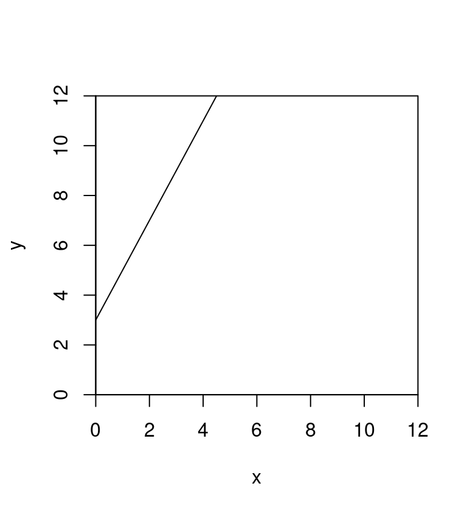
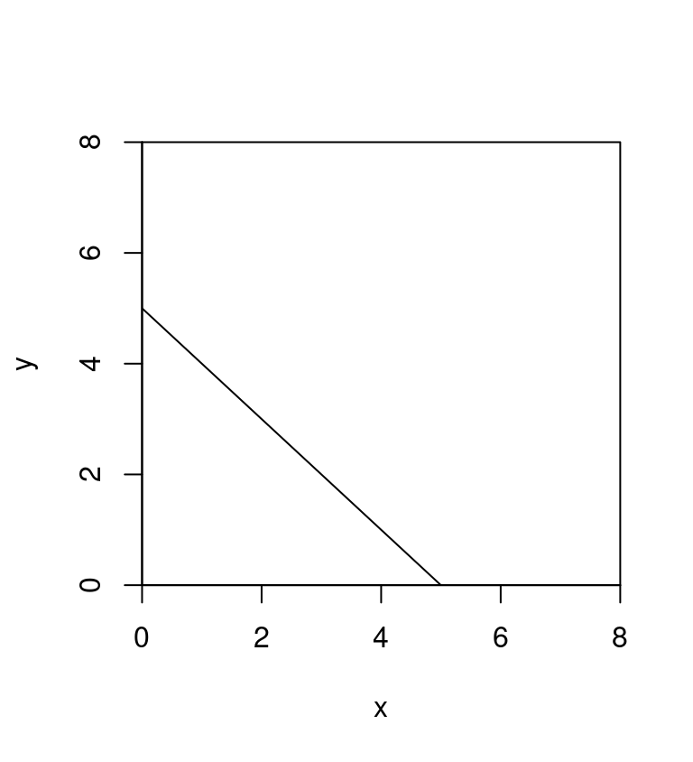
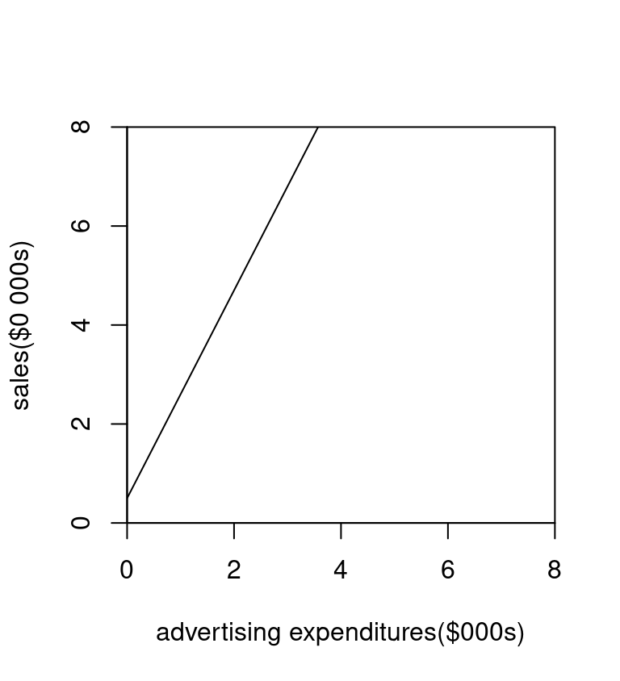

::: {.cell}

:::

# Straight Line Review {#lines}

In this section we give some examples of straight lines and also look at the interpretation of slope.   

Since we will use straight lines to model data when there is a trend (This is called regression) it is important that we understand what slopes mean and what the equations look like for different lines.  

For slopes:

- a **positive slope** means **_increasing_** or **_uphill trend_**
- a **negative slope** means **_decreasing_** or **_downhill trend_**

Here are some examples:  

**Example 1** 

::: {.cell}
::: {.cell-output-display}
{width=384}
:::
:::

  
The equation is:  

$y = 2x + 3$

- The slope is: $m = 2$
- intercept is: $b=  3$

**_Interpretation of slope_**

For each additional unit of x, there is an increase of 2 units of y

**Example 2** 

::: {.cell}
::: {.cell-output-display}
{width=384}
:::
:::

The equation is:  

$y = -1x + 5$

- The slope is: $m = -1$
- intercept is: $b=  5$

**_Interpretation of slope_**

For each additional unit of x, there is an decrease of 1 units of y

**Example 3** 

::: {.cell}
::: {.cell-output-display}
{width=384}
:::
:::

The equation is:  

$y = 2.1x + 0.5$

- The slope is: $m = 2.1$
- intercept is: $b=  0.5$

**_Units_**

Suppose $x$ = advertising expenditures (in $000s, so thousands of $)  
Suppose $y$ = sales (in $0 000s, so in ten thousands of $)
    
- So if $x = 1.2$ that stands for $1200   
- If $y = 5.6$ that stands for $56,000     
    
**_Interpretation of slope_**

For each additional unit of x (so each additional $1000 dollars spent on ads), there is an increase of 2.1 units of y (so an increase of $21,000 in sales) 

