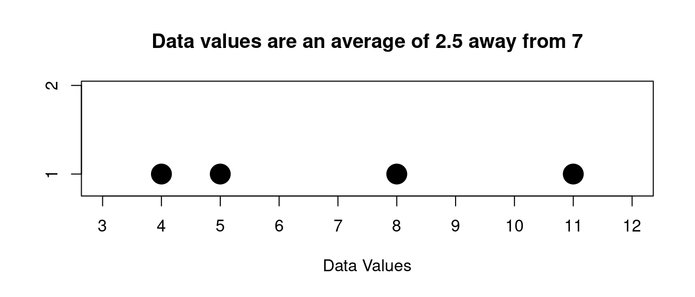

::: {.cell}

:::

# Measures of Spread {#measures-of-spread}

The mean, median and mode that we described in an earlier chapter all describe in some way where the \“middle\” of data set is located. These are called measures of \“central tendency\”. But none of these describe very well another property we are interested in for a set of data values – how spread out it is. Is the data all huddled together around the middle value, or is flung out and spread across a wide range?

This is called the data\’s **variability**.

And just like central tendency there are a few ways to describe it.

We will talk about 3 ways to describe spread:

- range
- mean deviation
- standard deviation

## Range

The **range** of the data is just the maximum value minus the minimum value. We have already talked about the range earlier when we talked about dotplots. So we just give a simple example

::: {.cell example='true' title='Range'}
Suppose we have the following sample data:

$$
10,6,5,14,6,12
$$

Then the largest value is 14 and the smallest is 5 so the range of the data is given by:

$$
range=max-min=14-5=9
$$ {#eq-range}
:::

## Mean Deviation

The **mean deviation** is just the average distance the data values are from the mean. So in order to find this you would find the mean, then find the distance between the mean and each data value, then average those distances.

This deviation shows how you can describe spread as an "average distance from the center", which is an important concept for describing the spread of data.

::: {.cell}

:::

::: {.cell example='true' title='Mean Deviation'}
Suppose we have the following sample data:

$$
5,8,4,11
$$

The mean is

$$
 \text{mean}=\frac{5+8+4+11}{4}=7
$$ {#eq-mean}

So the distance the data values are from the mean is like this:

|   |   |
|---|---|
|**data value** | **distance from 7 (the mean)** |
| 5 | 2 |
| 8 | 1 |
| 4 | 3 |
| 11 | 4 |

$$
 \text{mean deviation}=\frac{2+1+3+4}{4}=2.5
$$ {#eq-mean-deviation}

So we can say on average the distance the data values are from the center 7 is 2.5
:::

Here is a picture for the data from the last example:

::: {.cell}
::: {.cell-output-display}
{width=672}
:::
:::

Visually we can see that some values are more than 2.5 away from 7 and some are less that 2.5.

So the **mean deviation is a measure of how far on average the data is away from the center**, in this case given by the mean.

## Standard Deviation

The mean deviation shows the idea of the \"average distance away\" as a description of the spread of the data. The next measure of spread that we look at will be the one we use most frequently. It also is a measure of the \"average distance away\" from the center, but it uses a different way to calculate that distance.

We give the formula here for a population:

$$
\sigma = \text{standard deviation} = \sqrt{\frac{\sum (x-\mu)^2}{N}}
$$ {#eq-population-std-dev}

where $\mu$ is the mean of the population and $N$ is the population size

Now we will usually use this formula for a sample and not a population, and for a sample we adjust it a little:

$$
s = \text{sample standard deviation} = \sqrt{\frac{\sum (x-\bar x)^2}{n-1}}
$$ {#eq-sample-std-dev}

where $s$ is the sample mean and $n$ is the sample size. Notice that the denominator is $n-1$. That is a little different from the population version above. We won\'t go into the reasons for it here, but this gives the sample standard deviation better properties if we do this.

> We will NEVER use the formula directly, but always compute with a spreadsheet

### Calculating Standard Deviation in a Spreadsheet

So let's do an example of a sample standard deviation calculation using a spreadsheet so you can see how that goes:

Suppose we have this sample data (with sample size $n=7$):

$$
5,12,13,5,3,9,10
$$

Lets enter this into a column in a spreadsheet and find the mean and the sample standard deviation:

::: {.cell}
::: {.cell-output-display}

|   |A  |B    |C       |D               |E  |F  |
|:--|:--|:----|:-------|:---------------|:--|:--|
|1  |   |data |        |                |   |   |
|2  |   |5    |mean    |=AVERAGE(B2:B8) |   |   |
|3  |   |12   |std dev |=STDEV(B2:B8)   |   |   |
|4  |   |13   |        |                |   |   |
|5  |   |5    |        |                |   |   |
|6  |   |3    |        |                |   |   |
|7  |   |9    |        |                |   |   |
|8  |   |10   |        |                |   |   |
|9  |   |     |        |                |   |   |
|10 |   |     |        |                |   |   |

:::
:::

Here is the result

::: {.cell}
::: {.cell-output-display}

|   |A  |B    |C       |D                                                                                          |E  |F  |
|:--|:--|:----|:-------|:------------------------------------------------------------------------------------------|:--|:--|
|1  |   |data |        |                                                                                           |   |   |
|2  |   |5    |mean    |8.14                                                                                       |   |   |
|3  |   |12   |std dev |3.85                                                                                       |   |   |
|4  |   |13   |        |&nbsp; &nbsp; &nbsp; &nbsp; &nbsp; &nbsp; &nbsp; &nbsp; &nbsp; &nbsp; &nbsp; &nbsp; &nbsp; |   |   |
|5  |   |5    |        |                                                                                           |   |   |
|6  |   |3    |        |                                                                                           |   |   |
|7  |   |9    |        |                                                                                           |   |   |
|8  |   |10   |        |                                                                                           |   |   |
|9  |   |     |        |                                                                                           |   |   |
|10 |   |     |        |                                                                                           |   |   |

:::
:::

So you should always do standard deviation calculations using a spreadsheet. This is the best way.

### Interpretation of Standard Deviation

The way we interpret the results above is this:

We say that on average the typical data value is about 3.85 units from the mean 8.14.

