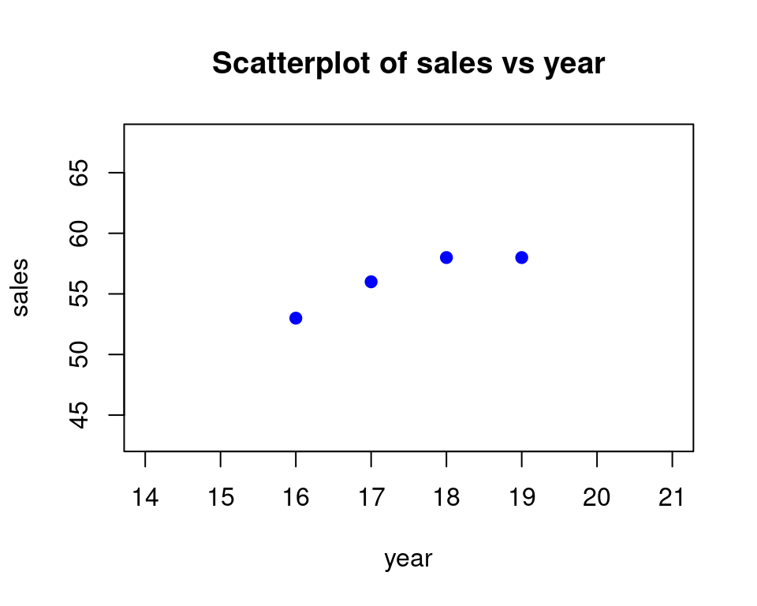
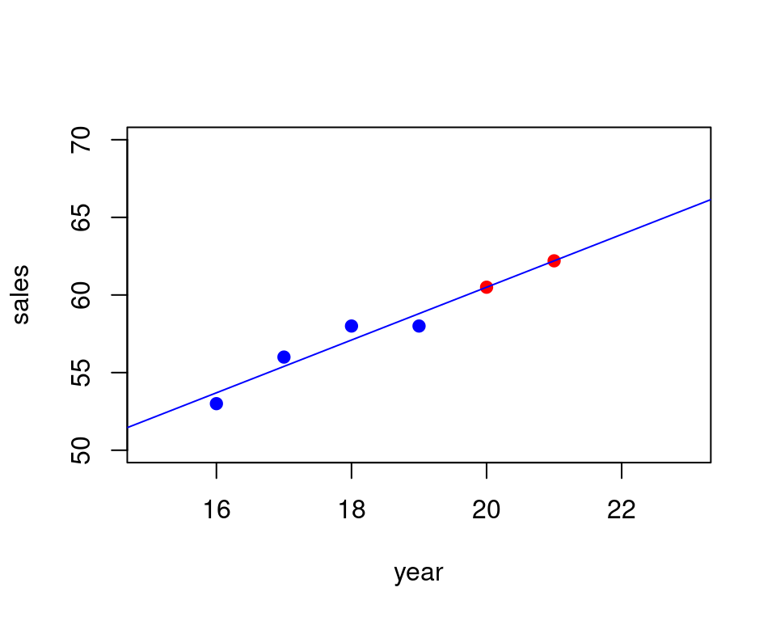

::: {.cell}

:::


# Regression SLOPE and INTERCEPT {#regression-slope-intercept}

## Data

Here is the data set we will work with:   


::: {.cell}
::: {.cell-output-display}

```{=html}
<table class="huxtable" data-quarto-disable-processing="true"  style="margin-left: auto; margin-right: auto;">
<col><col><thead>
<tr>
<th class="huxtable-cell huxtable-header" style="text-align: right;  border-style: solid solid solid solid; border-width: 1pt 1pt 1pt 1pt; border-top-color: rgb(255, 255, 255);  border-right-color: rgb(255, 255, 255);  border-bottom-color: rgb(255, 255, 255);  border-left-color: rgb(255, 255, 255);  background-color: rgb(204, 204, 204);">year</th><th class="huxtable-cell huxtable-header" style="text-align: right;  border-style: solid solid solid solid; border-width: 1pt 1pt 1pt 1pt; border-top-color: rgb(255, 255, 255);  border-right-color: rgb(255, 255, 255);  border-bottom-color: rgb(255, 255, 255);  border-left-color: rgb(255, 255, 255);  background-color: rgb(204, 204, 204);">sales</th></tr>
</thead>
<tbody>
<tr>
<td class="huxtable-cell" style="text-align: right;  border-style: solid solid solid solid; border-width: 1pt 1pt 1pt 1pt; border-top-color: rgb(255, 255, 255);  border-right-color: rgb(255, 255, 255);  border-bottom-color: rgb(255, 255, 255);  border-left-color: rgb(255, 255, 255);  background-color: rgb(242, 242, 242);">16</td><td class="huxtable-cell" style="text-align: right;  border-style: solid solid solid solid; border-width: 1pt 1pt 1pt 1pt; border-top-color: rgb(255, 255, 255);  border-right-color: rgb(255, 255, 255);  border-bottom-color: rgb(255, 255, 255);  border-left-color: rgb(255, 255, 255);  background-color: rgb(242, 242, 242);">53</td></tr>
<tr>
<td class="huxtable-cell" style="text-align: right;  border-style: solid solid solid solid; border-width: 1pt 1pt 1pt 1pt; border-top-color: rgb(255, 255, 255);  border-right-color: rgb(255, 255, 255);  border-bottom-color: rgb(255, 255, 255);  border-left-color: rgb(255, 255, 255);  background-color: rgb(230, 230, 230);">17</td><td class="huxtable-cell" style="text-align: right;  border-style: solid solid solid solid; border-width: 1pt 1pt 1pt 1pt; border-top-color: rgb(255, 255, 255);  border-right-color: rgb(255, 255, 255);  border-bottom-color: rgb(255, 255, 255);  border-left-color: rgb(255, 255, 255);  background-color: rgb(230, 230, 230);">56</td></tr>
<tr>
<td class="huxtable-cell" style="text-align: right;  border-style: solid solid solid solid; border-width: 1pt 1pt 1pt 1pt; border-top-color: rgb(255, 255, 255);  border-right-color: rgb(255, 255, 255);  border-bottom-color: rgb(255, 255, 255);  border-left-color: rgb(255, 255, 255);  background-color: rgb(242, 242, 242);">18</td><td class="huxtable-cell" style="text-align: right;  border-style: solid solid solid solid; border-width: 1pt 1pt 1pt 1pt; border-top-color: rgb(255, 255, 255);  border-right-color: rgb(255, 255, 255);  border-bottom-color: rgb(255, 255, 255);  border-left-color: rgb(255, 255, 255);  background-color: rgb(242, 242, 242);">58</td></tr>
<tr>
<td class="huxtable-cell" style="text-align: right;  border-style: solid solid solid solid; border-width: 1pt 1pt 1pt 1pt; border-top-color: rgb(255, 255, 255);  border-right-color: rgb(255, 255, 255);  border-bottom-color: rgb(255, 255, 255);  border-left-color: rgb(255, 255, 255);  background-color: rgb(230, 230, 230);">19</td><td class="huxtable-cell" style="text-align: right;  border-style: solid solid solid solid; border-width: 1pt 1pt 1pt 1pt; border-top-color: rgb(255, 255, 255);  border-right-color: rgb(255, 255, 255);  border-bottom-color: rgb(255, 255, 255);  border-left-color: rgb(255, 255, 255);  background-color: rgb(230, 230, 230);">58</td></tr>
</tbody>
</table>

```

:::
:::


The goal here will be to predict the y-value (called $sales$) from the x-value(called $year$). We can see already that as the years increase the sales increase as well. So we can roughly guess the trend by just be looking at the data. 

But we can also do more than just guessing by coming up with a formula that will make our predictions for us when we plug in the year. 

In order to do that we have to come up with an equation that will allow us to plug in an x-value ($year$) and get out a y-value ($sales$). This is what we mean by prediction.  

In our case we will use a straight line equation, so that is why this process is called _linear regression_, since linear means "using a line".

First lets see a scatterplot of the data:


::: {.cell layout-align="center"}
::: {.cell-output-display}
{fig-align='center' width=480}
:::
:::


So start by copying the data into your spreadsheet in columns A and B:   
    

::: {.cell}
::: {.cell-output-display}

```{=html}
<table class="huxtable" data-quarto-disable-processing="true"  style="margin-left: auto; margin-right: auto;">
<col><col><col><col><col><col><col><thead>
<tr>
<th class="huxtable-cell huxtable-header" style="text-align: right; white-space: nowrap; border-style: solid solid solid solid; border-width: 1pt 1pt 1pt 1pt; border-top-color: rgb(255, 255, 255);  border-right-color: rgb(255, 255, 255);  border-bottom-color: rgb(255, 255, 255);  border-left-color: rgb(255, 255, 255);  background-color: rgb(76, 175, 80);"><span style="color: rgb(255, 255, 255);"></span></th><th class="huxtable-cell huxtable-header" style="text-align: right; white-space: nowrap; border-style: solid solid solid solid; border-width: 1pt 1pt 1pt 1pt; border-top-color: rgb(255, 255, 255);  border-right-color: rgb(255, 255, 255);  border-bottom-color: rgb(255, 255, 255);  border-left-color: rgb(255, 255, 255);  background-color: rgb(76, 175, 80);"><span style="color: rgb(255, 255, 255);">A</span></th><th class="huxtable-cell huxtable-header" style="text-align: right; white-space: nowrap; border-style: solid solid solid solid; border-width: 1pt 1pt 1pt 1pt; border-top-color: rgb(255, 255, 255);  border-right-color: rgb(255, 255, 255);  border-bottom-color: rgb(255, 255, 255);  border-left-color: rgb(255, 255, 255);  background-color: rgb(76, 175, 80);"><span style="color: rgb(255, 255, 255);">B</span></th><th class="huxtable-cell huxtable-header" style="text-align: right; white-space: nowrap; border-style: solid solid solid solid; border-width: 1pt 1pt 1pt 1pt; border-top-color: rgb(255, 255, 255);  border-right-color: rgb(255, 255, 255);  border-bottom-color: rgb(255, 255, 255);  border-left-color: rgb(255, 255, 255);  background-color: rgb(76, 175, 80);"><span style="color: rgb(255, 255, 255);">C</span></th><th class="huxtable-cell huxtable-header" style="text-align: right; white-space: nowrap; border-style: solid solid solid solid; border-width: 1pt 1pt 1pt 1pt; border-top-color: rgb(255, 255, 255);  border-right-color: rgb(255, 255, 255);  border-bottom-color: rgb(255, 255, 255);  border-left-color: rgb(255, 255, 255);  background-color: rgb(76, 175, 80);"><span style="color: rgb(255, 255, 255);">D</span></th><th class="huxtable-cell huxtable-header" style="text-align: right; white-space: nowrap; border-style: solid solid solid solid; border-width: 1pt 1pt 1pt 1pt; border-top-color: rgb(255, 255, 255);  border-right-color: rgb(255, 255, 255);  border-bottom-color: rgb(255, 255, 255);  border-left-color: rgb(255, 255, 255);  background-color: rgb(76, 175, 80);"><span style="color: rgb(255, 255, 255);">E</span></th><th class="huxtable-cell huxtable-header" style="text-align: right; white-space: nowrap; border-style: solid solid solid solid; border-width: 1pt 1pt 1pt 1pt; border-top-color: rgb(255, 255, 255);  border-right-color: rgb(255, 255, 255);  border-bottom-color: rgb(255, 255, 255);  border-left-color: rgb(255, 255, 255);  background-color: rgb(76, 175, 80);"><span style="color: rgb(255, 255, 255);">F</span></th></tr>
</thead>
<tbody>
<tr>
<td class="huxtable-cell" style="text-align: right; white-space: nowrap; border-style: solid solid solid solid; border-width: 1pt 1pt 1pt 1pt; border-top-color: rgb(255, 255, 255);  border-right-color: rgb(255, 255, 255);  border-bottom-color: rgb(255, 255, 255);  border-left-color: rgb(255, 255, 255);  background-color: rgb(165, 214, 167);">1</td><td class="huxtable-cell" style="text-align: right; white-space: nowrap; border-style: solid solid solid solid; border-width: 1pt 1pt 1pt 1pt; border-top-color: rgb(255, 255, 255);  border-right-color: rgb(255, 255, 255);  border-bottom-color: rgb(255, 255, 255);  border-left-color: rgb(255, 255, 255);  background-color: rgb(165, 214, 167);">year</td><td class="huxtable-cell" style="text-align: right; white-space: nowrap; border-style: solid solid solid solid; border-width: 1pt 1pt 1pt 1pt; border-top-color: rgb(255, 255, 255);  border-right-color: rgb(255, 255, 255);  border-bottom-color: rgb(255, 255, 255);  border-left-color: rgb(255, 255, 255);  background-color: rgb(165, 214, 167);">sales</td><td class="huxtable-cell" style="text-align: right; white-space: nowrap; border-style: solid solid solid solid; border-width: 1pt 1pt 1pt 1pt; border-top-color: rgb(255, 255, 255);  border-right-color: rgb(255, 255, 255);  border-bottom-color: rgb(255, 255, 255);  border-left-color: rgb(255, 255, 255);  background-color: rgb(165, 214, 167);"></td><td class="huxtable-cell" style="text-align: right; white-space: nowrap; border-style: solid solid solid solid; border-width: 1pt 1pt 1pt 1pt; border-top-color: rgb(255, 255, 255);  border-right-color: rgb(255, 255, 255);  border-bottom-color: rgb(255, 255, 255);  border-left-color: rgb(255, 255, 255);  background-color: rgb(165, 214, 167);"></td><td class="huxtable-cell" style="text-align: right; white-space: nowrap; border-style: solid solid solid solid; border-width: 1pt 1pt 1pt 1pt; border-top-color: rgb(255, 255, 255);  border-right-color: rgb(255, 255, 255);  border-bottom-color: rgb(255, 255, 255);  border-left-color: rgb(255, 255, 255);  background-color: rgb(165, 214, 167);"></td><td class="huxtable-cell" style="text-align: right; white-space: nowrap; border-style: solid solid solid solid; border-width: 1pt 1pt 1pt 1pt; border-top-color: rgb(255, 255, 255);  border-right-color: rgb(255, 255, 255);  border-bottom-color: rgb(255, 255, 255);  border-left-color: rgb(255, 255, 255);  background-color: rgb(165, 214, 167);"></td></tr>
<tr>
<td class="huxtable-cell" style="text-align: right; white-space: nowrap; border-style: solid solid solid solid; border-width: 1pt 1pt 1pt 1pt; border-top-color: rgb(255, 255, 255);  border-right-color: rgb(255, 255, 255);  border-bottom-color: rgb(255, 255, 255);  border-left-color: rgb(255, 255, 255);  background-color: rgb(200, 230, 201);">2</td><td class="huxtable-cell" style="text-align: right; white-space: nowrap; border-style: solid solid solid solid; border-width: 1pt 1pt 1pt 1pt; border-top-color: rgb(255, 255, 255);  border-right-color: rgb(255, 255, 255);  border-bottom-color: rgb(255, 255, 255);  border-left-color: rgb(255, 255, 255);  background-color: rgb(200, 230, 201);">16</td><td class="huxtable-cell" style="text-align: right; white-space: nowrap; border-style: solid solid solid solid; border-width: 1pt 1pt 1pt 1pt; border-top-color: rgb(255, 255, 255);  border-right-color: rgb(255, 255, 255);  border-bottom-color: rgb(255, 255, 255);  border-left-color: rgb(255, 255, 255);  background-color: rgb(200, 230, 201);">53</td><td class="huxtable-cell" style="text-align: right; white-space: nowrap; border-style: solid solid solid solid; border-width: 1pt 1pt 1pt 1pt; border-top-color: rgb(255, 255, 255);  border-right-color: rgb(255, 255, 255);  border-bottom-color: rgb(255, 255, 255);  border-left-color: rgb(255, 255, 255);  background-color: rgb(200, 230, 201);"></td><td class="huxtable-cell" style="text-align: right; white-space: nowrap; border-style: solid solid solid solid; border-width: 1pt 1pt 1pt 1pt; border-top-color: rgb(255, 255, 255);  border-right-color: rgb(255, 255, 255);  border-bottom-color: rgb(255, 255, 255);  border-left-color: rgb(255, 255, 255);  background-color: rgb(200, 230, 201);"></td><td class="huxtable-cell" style="text-align: right; white-space: nowrap; border-style: solid solid solid solid; border-width: 1pt 1pt 1pt 1pt; border-top-color: rgb(255, 255, 255);  border-right-color: rgb(255, 255, 255);  border-bottom-color: rgb(255, 255, 255);  border-left-color: rgb(255, 255, 255);  background-color: rgb(200, 230, 201);"></td><td class="huxtable-cell" style="text-align: right; white-space: nowrap; border-style: solid solid solid solid; border-width: 1pt 1pt 1pt 1pt; border-top-color: rgb(255, 255, 255);  border-right-color: rgb(255, 255, 255);  border-bottom-color: rgb(255, 255, 255);  border-left-color: rgb(255, 255, 255);  background-color: rgb(200, 230, 201);"></td></tr>
<tr>
<td class="huxtable-cell" style="text-align: right; white-space: nowrap; border-style: solid solid solid solid; border-width: 1pt 1pt 1pt 1pt; border-top-color: rgb(255, 255, 255);  border-right-color: rgb(255, 255, 255);  border-bottom-color: rgb(255, 255, 255);  border-left-color: rgb(255, 255, 255);  background-color: rgb(165, 214, 167);">3</td><td class="huxtable-cell" style="text-align: right; white-space: nowrap; border-style: solid solid solid solid; border-width: 1pt 1pt 1pt 1pt; border-top-color: rgb(255, 255, 255);  border-right-color: rgb(255, 255, 255);  border-bottom-color: rgb(255, 255, 255);  border-left-color: rgb(255, 255, 255);  background-color: rgb(165, 214, 167);">17</td><td class="huxtable-cell" style="text-align: right; white-space: nowrap; border-style: solid solid solid solid; border-width: 1pt 1pt 1pt 1pt; border-top-color: rgb(255, 255, 255);  border-right-color: rgb(255, 255, 255);  border-bottom-color: rgb(255, 255, 255);  border-left-color: rgb(255, 255, 255);  background-color: rgb(165, 214, 167);">56</td><td class="huxtable-cell" style="text-align: right; white-space: nowrap; border-style: solid solid solid solid; border-width: 1pt 1pt 1pt 1pt; border-top-color: rgb(255, 255, 255);  border-right-color: rgb(255, 255, 255);  border-bottom-color: rgb(255, 255, 255);  border-left-color: rgb(255, 255, 255);  background-color: rgb(165, 214, 167);"></td><td class="huxtable-cell" style="text-align: right; white-space: nowrap; border-style: solid solid solid solid; border-width: 1pt 1pt 1pt 1pt; border-top-color: rgb(255, 255, 255);  border-right-color: rgb(255, 255, 255);  border-bottom-color: rgb(255, 255, 255);  border-left-color: rgb(255, 255, 255);  background-color: rgb(165, 214, 167);"></td><td class="huxtable-cell" style="text-align: right; white-space: nowrap; border-style: solid solid solid solid; border-width: 1pt 1pt 1pt 1pt; border-top-color: rgb(255, 255, 255);  border-right-color: rgb(255, 255, 255);  border-bottom-color: rgb(255, 255, 255);  border-left-color: rgb(255, 255, 255);  background-color: rgb(165, 214, 167);"></td><td class="huxtable-cell" style="text-align: right; white-space: nowrap; border-style: solid solid solid solid; border-width: 1pt 1pt 1pt 1pt; border-top-color: rgb(255, 255, 255);  border-right-color: rgb(255, 255, 255);  border-bottom-color: rgb(255, 255, 255);  border-left-color: rgb(255, 255, 255);  background-color: rgb(165, 214, 167);"></td></tr>
<tr>
<td class="huxtable-cell" style="text-align: right; white-space: nowrap; border-style: solid solid solid solid; border-width: 1pt 1pt 1pt 1pt; border-top-color: rgb(255, 255, 255);  border-right-color: rgb(255, 255, 255);  border-bottom-color: rgb(255, 255, 255);  border-left-color: rgb(255, 255, 255);  background-color: rgb(200, 230, 201);">4</td><td class="huxtable-cell" style="text-align: right; white-space: nowrap; border-style: solid solid solid solid; border-width: 1pt 1pt 1pt 1pt; border-top-color: rgb(255, 255, 255);  border-right-color: rgb(255, 255, 255);  border-bottom-color: rgb(255, 255, 255);  border-left-color: rgb(255, 255, 255);  background-color: rgb(200, 230, 201);">18</td><td class="huxtable-cell" style="text-align: right; white-space: nowrap; border-style: solid solid solid solid; border-width: 1pt 1pt 1pt 1pt; border-top-color: rgb(255, 255, 255);  border-right-color: rgb(255, 255, 255);  border-bottom-color: rgb(255, 255, 255);  border-left-color: rgb(255, 255, 255);  background-color: rgb(200, 230, 201);">58</td><td class="huxtable-cell" style="text-align: right; white-space: nowrap; border-style: solid solid solid solid; border-width: 1pt 1pt 1pt 1pt; border-top-color: rgb(255, 255, 255);  border-right-color: rgb(255, 255, 255);  border-bottom-color: rgb(255, 255, 255);  border-left-color: rgb(255, 255, 255);  background-color: rgb(200, 230, 201);"></td><td class="huxtable-cell" style="text-align: right; white-space: nowrap; border-style: solid solid solid solid; border-width: 1pt 1pt 1pt 1pt; border-top-color: rgb(255, 255, 255);  border-right-color: rgb(255, 255, 255);  border-bottom-color: rgb(255, 255, 255);  border-left-color: rgb(255, 255, 255);  background-color: rgb(200, 230, 201);"></td><td class="huxtable-cell" style="text-align: right; white-space: nowrap; border-style: solid solid solid solid; border-width: 1pt 1pt 1pt 1pt; border-top-color: rgb(255, 255, 255);  border-right-color: rgb(255, 255, 255);  border-bottom-color: rgb(255, 255, 255);  border-left-color: rgb(255, 255, 255);  background-color: rgb(200, 230, 201);"></td><td class="huxtable-cell" style="text-align: right; white-space: nowrap; border-style: solid solid solid solid; border-width: 1pt 1pt 1pt 1pt; border-top-color: rgb(255, 255, 255);  border-right-color: rgb(255, 255, 255);  border-bottom-color: rgb(255, 255, 255);  border-left-color: rgb(255, 255, 255);  background-color: rgb(200, 230, 201);"></td></tr>
<tr>
<td class="huxtable-cell" style="text-align: right; white-space: nowrap; border-style: solid solid solid solid; border-width: 1pt 1pt 1pt 1pt; border-top-color: rgb(255, 255, 255);  border-right-color: rgb(255, 255, 255);  border-bottom-color: rgb(255, 255, 255);  border-left-color: rgb(255, 255, 255);  background-color: rgb(165, 214, 167);">5</td><td class="huxtable-cell" style="text-align: right; white-space: nowrap; border-style: solid solid solid solid; border-width: 1pt 1pt 1pt 1pt; border-top-color: rgb(255, 255, 255);  border-right-color: rgb(255, 255, 255);  border-bottom-color: rgb(255, 255, 255);  border-left-color: rgb(255, 255, 255);  background-color: rgb(165, 214, 167);">19</td><td class="huxtable-cell" style="text-align: right; white-space: nowrap; border-style: solid solid solid solid; border-width: 1pt 1pt 1pt 1pt; border-top-color: rgb(255, 255, 255);  border-right-color: rgb(255, 255, 255);  border-bottom-color: rgb(255, 255, 255);  border-left-color: rgb(255, 255, 255);  background-color: rgb(165, 214, 167);">58</td><td class="huxtable-cell" style="text-align: right; white-space: nowrap; border-style: solid solid solid solid; border-width: 1pt 1pt 1pt 1pt; border-top-color: rgb(255, 255, 255);  border-right-color: rgb(255, 255, 255);  border-bottom-color: rgb(255, 255, 255);  border-left-color: rgb(255, 255, 255);  background-color: rgb(165, 214, 167);"></td><td class="huxtable-cell" style="text-align: right; white-space: nowrap; border-style: solid solid solid solid; border-width: 1pt 1pt 1pt 1pt; border-top-color: rgb(255, 255, 255);  border-right-color: rgb(255, 255, 255);  border-bottom-color: rgb(255, 255, 255);  border-left-color: rgb(255, 255, 255);  background-color: rgb(165, 214, 167);"></td><td class="huxtable-cell" style="text-align: right; white-space: nowrap; border-style: solid solid solid solid; border-width: 1pt 1pt 1pt 1pt; border-top-color: rgb(255, 255, 255);  border-right-color: rgb(255, 255, 255);  border-bottom-color: rgb(255, 255, 255);  border-left-color: rgb(255, 255, 255);  background-color: rgb(165, 214, 167);"></td><td class="huxtable-cell" style="text-align: right; white-space: nowrap; border-style: solid solid solid solid; border-width: 1pt 1pt 1pt 1pt; border-top-color: rgb(255, 255, 255);  border-right-color: rgb(255, 255, 255);  border-bottom-color: rgb(255, 255, 255);  border-left-color: rgb(255, 255, 255);  background-color: rgb(165, 214, 167);"></td></tr>
<tr>
<td class="huxtable-cell" style="text-align: right; white-space: nowrap; border-style: solid solid solid solid; border-width: 1pt 1pt 1pt 1pt; border-top-color: rgb(255, 255, 255);  border-right-color: rgb(255, 255, 255);  border-bottom-color: rgb(255, 255, 255);  border-left-color: rgb(255, 255, 255);  background-color: rgb(200, 230, 201);">6</td><td class="huxtable-cell" style="text-align: right; white-space: nowrap; border-style: solid solid solid solid; border-width: 1pt 1pt 1pt 1pt; border-top-color: rgb(255, 255, 255);  border-right-color: rgb(255, 255, 255);  border-bottom-color: rgb(255, 255, 255);  border-left-color: rgb(255, 255, 255);  background-color: rgb(200, 230, 201);"></td><td class="huxtable-cell" style="text-align: right; white-space: nowrap; border-style: solid solid solid solid; border-width: 1pt 1pt 1pt 1pt; border-top-color: rgb(255, 255, 255);  border-right-color: rgb(255, 255, 255);  border-bottom-color: rgb(255, 255, 255);  border-left-color: rgb(255, 255, 255);  background-color: rgb(200, 230, 201);"></td><td class="huxtable-cell" style="text-align: right; white-space: nowrap; border-style: solid solid solid solid; border-width: 1pt 1pt 1pt 1pt; border-top-color: rgb(255, 255, 255);  border-right-color: rgb(255, 255, 255);  border-bottom-color: rgb(255, 255, 255);  border-left-color: rgb(255, 255, 255);  background-color: rgb(200, 230, 201);"></td><td class="huxtable-cell" style="text-align: right; white-space: nowrap; border-style: solid solid solid solid; border-width: 1pt 1pt 1pt 1pt; border-top-color: rgb(255, 255, 255);  border-right-color: rgb(255, 255, 255);  border-bottom-color: rgb(255, 255, 255);  border-left-color: rgb(255, 255, 255);  background-color: rgb(200, 230, 201);"></td><td class="huxtable-cell" style="text-align: right; white-space: nowrap; border-style: solid solid solid solid; border-width: 1pt 1pt 1pt 1pt; border-top-color: rgb(255, 255, 255);  border-right-color: rgb(255, 255, 255);  border-bottom-color: rgb(255, 255, 255);  border-left-color: rgb(255, 255, 255);  background-color: rgb(200, 230, 201);"></td><td class="huxtable-cell" style="text-align: right; white-space: nowrap; border-style: solid solid solid solid; border-width: 1pt 1pt 1pt 1pt; border-top-color: rgb(255, 255, 255);  border-right-color: rgb(255, 255, 255);  border-bottom-color: rgb(255, 255, 255);  border-left-color: rgb(255, 255, 255);  background-color: rgb(200, 230, 201);"></td></tr>
<tr>
<td class="huxtable-cell" style="text-align: right; white-space: nowrap; border-style: solid solid solid solid; border-width: 1pt 1pt 1pt 1pt; border-top-color: rgb(255, 255, 255);  border-right-color: rgb(255, 255, 255);  border-bottom-color: rgb(255, 255, 255);  border-left-color: rgb(255, 255, 255);  background-color: rgb(165, 214, 167);">7</td><td class="huxtable-cell" style="text-align: right; white-space: nowrap; border-style: solid solid solid solid; border-width: 1pt 1pt 1pt 1pt; border-top-color: rgb(255, 255, 255);  border-right-color: rgb(255, 255, 255);  border-bottom-color: rgb(255, 255, 255);  border-left-color: rgb(255, 255, 255);  background-color: rgb(165, 214, 167);"></td><td class="huxtable-cell" style="text-align: right; white-space: nowrap; border-style: solid solid solid solid; border-width: 1pt 1pt 1pt 1pt; border-top-color: rgb(255, 255, 255);  border-right-color: rgb(255, 255, 255);  border-bottom-color: rgb(255, 255, 255);  border-left-color: rgb(255, 255, 255);  background-color: rgb(165, 214, 167);"></td><td class="huxtable-cell" style="text-align: right; white-space: nowrap; border-style: solid solid solid solid; border-width: 1pt 1pt 1pt 1pt; border-top-color: rgb(255, 255, 255);  border-right-color: rgb(255, 255, 255);  border-bottom-color: rgb(255, 255, 255);  border-left-color: rgb(255, 255, 255);  background-color: rgb(165, 214, 167);"></td><td class="huxtable-cell" style="text-align: right; white-space: nowrap; border-style: solid solid solid solid; border-width: 1pt 1pt 1pt 1pt; border-top-color: rgb(255, 255, 255);  border-right-color: rgb(255, 255, 255);  border-bottom-color: rgb(255, 255, 255);  border-left-color: rgb(255, 255, 255);  background-color: rgb(165, 214, 167);"></td><td class="huxtable-cell" style="text-align: right; white-space: nowrap; border-style: solid solid solid solid; border-width: 1pt 1pt 1pt 1pt; border-top-color: rgb(255, 255, 255);  border-right-color: rgb(255, 255, 255);  border-bottom-color: rgb(255, 255, 255);  border-left-color: rgb(255, 255, 255);  background-color: rgb(165, 214, 167);"></td><td class="huxtable-cell" style="text-align: right; white-space: nowrap; border-style: solid solid solid solid; border-width: 1pt 1pt 1pt 1pt; border-top-color: rgb(255, 255, 255);  border-right-color: rgb(255, 255, 255);  border-bottom-color: rgb(255, 255, 255);  border-left-color: rgb(255, 255, 255);  background-color: rgb(165, 214, 167);"></td></tr>
<tr>
<td class="huxtable-cell" style="text-align: right; white-space: nowrap; border-style: solid solid solid solid; border-width: 1pt 1pt 1pt 1pt; border-top-color: rgb(255, 255, 255);  border-right-color: rgb(255, 255, 255);  border-bottom-color: rgb(255, 255, 255);  border-left-color: rgb(255, 255, 255);  background-color: rgb(200, 230, 201);">8</td><td class="huxtable-cell" style="text-align: right; white-space: nowrap; border-style: solid solid solid solid; border-width: 1pt 1pt 1pt 1pt; border-top-color: rgb(255, 255, 255);  border-right-color: rgb(255, 255, 255);  border-bottom-color: rgb(255, 255, 255);  border-left-color: rgb(255, 255, 255);  background-color: rgb(200, 230, 201);"></td><td class="huxtable-cell" style="text-align: right; white-space: nowrap; border-style: solid solid solid solid; border-width: 1pt 1pt 1pt 1pt; border-top-color: rgb(255, 255, 255);  border-right-color: rgb(255, 255, 255);  border-bottom-color: rgb(255, 255, 255);  border-left-color: rgb(255, 255, 255);  background-color: rgb(200, 230, 201);"></td><td class="huxtable-cell" style="text-align: right; white-space: nowrap; border-style: solid solid solid solid; border-width: 1pt 1pt 1pt 1pt; border-top-color: rgb(255, 255, 255);  border-right-color: rgb(255, 255, 255);  border-bottom-color: rgb(255, 255, 255);  border-left-color: rgb(255, 255, 255);  background-color: rgb(200, 230, 201);"></td><td class="huxtable-cell" style="text-align: right; white-space: nowrap; border-style: solid solid solid solid; border-width: 1pt 1pt 1pt 1pt; border-top-color: rgb(255, 255, 255);  border-right-color: rgb(255, 255, 255);  border-bottom-color: rgb(255, 255, 255);  border-left-color: rgb(255, 255, 255);  background-color: rgb(200, 230, 201);"></td><td class="huxtable-cell" style="text-align: right; white-space: nowrap; border-style: solid solid solid solid; border-width: 1pt 1pt 1pt 1pt; border-top-color: rgb(255, 255, 255);  border-right-color: rgb(255, 255, 255);  border-bottom-color: rgb(255, 255, 255);  border-left-color: rgb(255, 255, 255);  background-color: rgb(200, 230, 201);"></td><td class="huxtable-cell" style="text-align: right; white-space: nowrap; border-style: solid solid solid solid; border-width: 1pt 1pt 1pt 1pt; border-top-color: rgb(255, 255, 255);  border-right-color: rgb(255, 255, 255);  border-bottom-color: rgb(255, 255, 255);  border-left-color: rgb(255, 255, 255);  background-color: rgb(200, 230, 201);"></td></tr>
</tbody>
</table>

```

:::
:::


## Finding Slope and Intercept of Regression Line 

Next lets compute the slope and intercept using the functions SLOPE and INTERCEPT in a spreadsheet. Make sure you enter the y cell range in first and then the x cell range when you are using SLOPE and INTERCEPT. And in fact most "regression" formulas for a spreadsheet require y-values range first and x-values range second.

Okay so here is what using the functions SLOPE and INTERCEPT look like. Slope is labeled m and intercept is labeled b:


::: {.cell}
::: {.cell-output-display}

```{=html}
<table class="huxtable" data-quarto-disable-processing="true"  style="margin-left: auto; margin-right: auto;">
<col><col><col><col><col><col><col><thead>
<tr>
<th class="huxtable-cell huxtable-header" style="text-align: right; white-space: nowrap; border-style: solid solid solid solid; border-width: 1pt 1pt 1pt 1pt; border-top-color: rgb(255, 255, 255);  border-right-color: rgb(255, 255, 255);  border-bottom-color: rgb(255, 255, 255);  border-left-color: rgb(255, 255, 255);  background-color: rgb(76, 175, 80);"><span style="color: rgb(255, 255, 255);"></span></th><th class="huxtable-cell huxtable-header" style="text-align: right; white-space: nowrap; border-style: solid solid solid solid; border-width: 1pt 1pt 1pt 1pt; border-top-color: rgb(255, 255, 255);  border-right-color: rgb(255, 255, 255);  border-bottom-color: rgb(255, 255, 255);  border-left-color: rgb(255, 255, 255);  background-color: rgb(76, 175, 80);"><span style="color: rgb(255, 255, 255);">A</span></th><th class="huxtable-cell huxtable-header" style="text-align: right; white-space: nowrap; border-style: solid solid solid solid; border-width: 1pt 1pt 1pt 1pt; border-top-color: rgb(255, 255, 255);  border-right-color: rgb(255, 255, 255);  border-bottom-color: rgb(255, 255, 255);  border-left-color: rgb(255, 255, 255);  background-color: rgb(76, 175, 80);"><span style="color: rgb(255, 255, 255);">B</span></th><th class="huxtable-cell huxtable-header" style="text-align: right; white-space: nowrap; border-style: solid solid solid solid; border-width: 1pt 1pt 1pt 1pt; border-top-color: rgb(255, 255, 255);  border-right-color: rgb(255, 255, 255);  border-bottom-color: rgb(255, 255, 255);  border-left-color: rgb(255, 255, 255);  background-color: rgb(76, 175, 80);"><span style="color: rgb(255, 255, 255);">C</span></th><th class="huxtable-cell huxtable-header" style="text-align: right; white-space: nowrap; border-style: solid solid solid solid; border-width: 1pt 1pt 1pt 1pt; border-top-color: rgb(255, 255, 255);  border-right-color: rgb(255, 255, 255);  border-bottom-color: rgb(255, 255, 255);  border-left-color: rgb(255, 255, 255);  background-color: rgb(76, 175, 80);"><span style="color: rgb(255, 255, 255);">D</span></th><th class="huxtable-cell huxtable-header" style="text-align: right; white-space: nowrap; border-style: solid solid solid solid; border-width: 1pt 1pt 1pt 1pt; border-top-color: rgb(255, 255, 255);  border-right-color: rgb(255, 255, 255);  border-bottom-color: rgb(255, 255, 255);  border-left-color: rgb(255, 255, 255);  background-color: rgb(76, 175, 80);"><span style="color: rgb(255, 255, 255);">E</span></th><th class="huxtable-cell huxtable-header" style="text-align: right; white-space: nowrap; border-style: solid solid solid solid; border-width: 1pt 1pt 1pt 1pt; border-top-color: rgb(255, 255, 255);  border-right-color: rgb(255, 255, 255);  border-bottom-color: rgb(255, 255, 255);  border-left-color: rgb(255, 255, 255);  background-color: rgb(76, 175, 80);"><span style="color: rgb(255, 255, 255);">F</span></th></tr>
</thead>
<tbody>
<tr>
<td class="huxtable-cell" style="text-align: right; white-space: nowrap; border-style: solid solid solid solid; border-width: 1pt 1pt 1pt 1pt; border-top-color: rgb(255, 255, 255);  border-right-color: rgb(255, 255, 255);  border-bottom-color: rgb(255, 255, 255);  border-left-color: rgb(255, 255, 255);  background-color: rgb(165, 214, 167);">1</td><td class="huxtable-cell" style="text-align: right; white-space: nowrap; border-style: solid solid solid solid; border-width: 1pt 1pt 1pt 1pt; border-top-color: rgb(255, 255, 255);  border-right-color: rgb(255, 255, 255);  border-bottom-color: rgb(255, 255, 255);  border-left-color: rgb(255, 255, 255);  background-color: rgb(165, 214, 167);">year</td><td class="huxtable-cell" style="text-align: right; white-space: nowrap; border-style: solid solid solid solid; border-width: 1pt 1pt 1pt 1pt; border-top-color: rgb(255, 255, 255);  border-right-color: rgb(255, 255, 255);  border-bottom-color: rgb(255, 255, 255);  border-left-color: rgb(255, 255, 255);  background-color: rgb(165, 214, 167);">sales</td><td class="huxtable-cell" style="text-align: right; white-space: nowrap; border-style: solid solid solid solid; border-width: 1pt 1pt 1pt 1pt; border-top-color: rgb(255, 255, 255);  border-right-color: rgb(255, 255, 255);  border-bottom-color: rgb(255, 255, 255);  border-left-color: rgb(255, 255, 255);  background-color: rgb(165, 214, 167);"></td><td class="huxtable-cell" style="text-align: right; white-space: nowrap; border-style: solid solid solid solid; border-width: 1pt 1pt 1pt 1pt; border-top-color: rgb(255, 255, 255);  border-right-color: rgb(255, 255, 255);  border-bottom-color: rgb(255, 255, 255);  border-left-color: rgb(255, 255, 255);  background-color: rgb(165, 214, 167);"></td><td class="huxtable-cell" style="text-align: right; white-space: nowrap; border-style: solid solid solid solid; border-width: 1pt 1pt 1pt 1pt; border-top-color: rgb(255, 255, 255);  border-right-color: rgb(255, 255, 255);  border-bottom-color: rgb(255, 255, 255);  border-left-color: rgb(255, 255, 255);  background-color: rgb(165, 214, 167);"></td><td class="huxtable-cell" style="text-align: right; white-space: nowrap; border-style: solid solid solid solid; border-width: 1pt 1pt 1pt 1pt; border-top-color: rgb(255, 255, 255);  border-right-color: rgb(255, 255, 255);  border-bottom-color: rgb(255, 255, 255);  border-left-color: rgb(255, 255, 255);  background-color: rgb(165, 214, 167);"></td></tr>
<tr>
<td class="huxtable-cell" style="text-align: right; white-space: nowrap; border-style: solid solid solid solid; border-width: 1pt 1pt 1pt 1pt; border-top-color: rgb(255, 255, 255);  border-right-color: rgb(255, 255, 255);  border-bottom-color: rgb(255, 255, 255);  border-left-color: rgb(255, 255, 255);  background-color: rgb(200, 230, 201);">2</td><td class="huxtable-cell" style="text-align: right; white-space: nowrap; border-style: solid solid solid solid; border-width: 1pt 1pt 1pt 1pt; border-top-color: rgb(255, 255, 255);  border-right-color: rgb(255, 255, 255);  border-bottom-color: rgb(255, 255, 255);  border-left-color: rgb(255, 255, 255);  background-color: rgb(200, 230, 201);">16</td><td class="huxtable-cell" style="text-align: right; white-space: nowrap; border-style: solid solid solid solid; border-width: 1pt 1pt 1pt 1pt; border-top-color: rgb(255, 255, 255);  border-right-color: rgb(255, 255, 255);  border-bottom-color: rgb(255, 255, 255);  border-left-color: rgb(255, 255, 255);  background-color: rgb(200, 230, 201);">53</td><td class="huxtable-cell" style="text-align: right; white-space: nowrap; border-style: solid solid solid solid; border-width: 1pt 1pt 1pt 1pt; border-top-color: rgb(255, 255, 255);  border-right-color: rgb(255, 255, 255);  border-bottom-color: rgb(255, 255, 255);  border-left-color: rgb(255, 255, 255);  background-color: rgb(200, 230, 201);"></td><td class="huxtable-cell" style="text-align: right; white-space: nowrap; border-style: solid solid solid solid; border-width: 1pt 1pt 1pt 1pt; border-top-color: rgb(255, 255, 255);  border-right-color: rgb(255, 255, 255);  border-bottom-color: rgb(255, 255, 255);  border-left-color: rgb(255, 255, 255);  background-color: rgb(200, 230, 201);">m</td><td class="huxtable-cell" style="text-align: right; white-space: nowrap; border-style: solid solid solid solid; border-width: 1pt 1pt 1pt 1pt; border-top-color: rgb(255, 255, 255);  border-right-color: rgb(255, 255, 255);  border-bottom-color: rgb(255, 255, 255);  border-left-color: rgb(255, 255, 255);  background-color: rgb(200, 230, 201);">=SLOPE(B2:B5,A2:A5)</td><td class="huxtable-cell" style="text-align: right; white-space: nowrap; border-style: solid solid solid solid; border-width: 1pt 1pt 1pt 1pt; border-top-color: rgb(255, 255, 255);  border-right-color: rgb(255, 255, 255);  border-bottom-color: rgb(255, 255, 255);  border-left-color: rgb(255, 255, 255);  background-color: rgb(200, 230, 201);"></td></tr>
<tr>
<td class="huxtable-cell" style="text-align: right; white-space: nowrap; border-style: solid solid solid solid; border-width: 1pt 1pt 1pt 1pt; border-top-color: rgb(255, 255, 255);  border-right-color: rgb(255, 255, 255);  border-bottom-color: rgb(255, 255, 255);  border-left-color: rgb(255, 255, 255);  background-color: rgb(165, 214, 167);">3</td><td class="huxtable-cell" style="text-align: right; white-space: nowrap; border-style: solid solid solid solid; border-width: 1pt 1pt 1pt 1pt; border-top-color: rgb(255, 255, 255);  border-right-color: rgb(255, 255, 255);  border-bottom-color: rgb(255, 255, 255);  border-left-color: rgb(255, 255, 255);  background-color: rgb(165, 214, 167);">17</td><td class="huxtable-cell" style="text-align: right; white-space: nowrap; border-style: solid solid solid solid; border-width: 1pt 1pt 1pt 1pt; border-top-color: rgb(255, 255, 255);  border-right-color: rgb(255, 255, 255);  border-bottom-color: rgb(255, 255, 255);  border-left-color: rgb(255, 255, 255);  background-color: rgb(165, 214, 167);">56</td><td class="huxtable-cell" style="text-align: right; white-space: nowrap; border-style: solid solid solid solid; border-width: 1pt 1pt 1pt 1pt; border-top-color: rgb(255, 255, 255);  border-right-color: rgb(255, 255, 255);  border-bottom-color: rgb(255, 255, 255);  border-left-color: rgb(255, 255, 255);  background-color: rgb(165, 214, 167);"></td><td class="huxtable-cell" style="text-align: right; white-space: nowrap; border-style: solid solid solid solid; border-width: 1pt 1pt 1pt 1pt; border-top-color: rgb(255, 255, 255);  border-right-color: rgb(255, 255, 255);  border-bottom-color: rgb(255, 255, 255);  border-left-color: rgb(255, 255, 255);  background-color: rgb(165, 214, 167);">b</td><td class="huxtable-cell" style="text-align: right; white-space: nowrap; border-style: solid solid solid solid; border-width: 1pt 1pt 1pt 1pt; border-top-color: rgb(255, 255, 255);  border-right-color: rgb(255, 255, 255);  border-bottom-color: rgb(255, 255, 255);  border-left-color: rgb(255, 255, 255);  background-color: rgb(165, 214, 167);">=INTERCEPT(B2:B5,A2:A5)</td><td class="huxtable-cell" style="text-align: right; white-space: nowrap; border-style: solid solid solid solid; border-width: 1pt 1pt 1pt 1pt; border-top-color: rgb(255, 255, 255);  border-right-color: rgb(255, 255, 255);  border-bottom-color: rgb(255, 255, 255);  border-left-color: rgb(255, 255, 255);  background-color: rgb(165, 214, 167);"></td></tr>
<tr>
<td class="huxtable-cell" style="text-align: right; white-space: nowrap; border-style: solid solid solid solid; border-width: 1pt 1pt 1pt 1pt; border-top-color: rgb(255, 255, 255);  border-right-color: rgb(255, 255, 255);  border-bottom-color: rgb(255, 255, 255);  border-left-color: rgb(255, 255, 255);  background-color: rgb(200, 230, 201);">4</td><td class="huxtable-cell" style="text-align: right; white-space: nowrap; border-style: solid solid solid solid; border-width: 1pt 1pt 1pt 1pt; border-top-color: rgb(255, 255, 255);  border-right-color: rgb(255, 255, 255);  border-bottom-color: rgb(255, 255, 255);  border-left-color: rgb(255, 255, 255);  background-color: rgb(200, 230, 201);">18</td><td class="huxtable-cell" style="text-align: right; white-space: nowrap; border-style: solid solid solid solid; border-width: 1pt 1pt 1pt 1pt; border-top-color: rgb(255, 255, 255);  border-right-color: rgb(255, 255, 255);  border-bottom-color: rgb(255, 255, 255);  border-left-color: rgb(255, 255, 255);  background-color: rgb(200, 230, 201);">58</td><td class="huxtable-cell" style="text-align: right; white-space: nowrap; border-style: solid solid solid solid; border-width: 1pt 1pt 1pt 1pt; border-top-color: rgb(255, 255, 255);  border-right-color: rgb(255, 255, 255);  border-bottom-color: rgb(255, 255, 255);  border-left-color: rgb(255, 255, 255);  background-color: rgb(200, 230, 201);"></td><td class="huxtable-cell" style="text-align: right; white-space: nowrap; border-style: solid solid solid solid; border-width: 1pt 1pt 1pt 1pt; border-top-color: rgb(255, 255, 255);  border-right-color: rgb(255, 255, 255);  border-bottom-color: rgb(255, 255, 255);  border-left-color: rgb(255, 255, 255);  background-color: rgb(200, 230, 201);"></td><td class="huxtable-cell" style="text-align: right; white-space: nowrap; border-style: solid solid solid solid; border-width: 1pt 1pt 1pt 1pt; border-top-color: rgb(255, 255, 255);  border-right-color: rgb(255, 255, 255);  border-bottom-color: rgb(255, 255, 255);  border-left-color: rgb(255, 255, 255);  background-color: rgb(200, 230, 201);"></td><td class="huxtable-cell" style="text-align: right; white-space: nowrap; border-style: solid solid solid solid; border-width: 1pt 1pt 1pt 1pt; border-top-color: rgb(255, 255, 255);  border-right-color: rgb(255, 255, 255);  border-bottom-color: rgb(255, 255, 255);  border-left-color: rgb(255, 255, 255);  background-color: rgb(200, 230, 201);"></td></tr>
<tr>
<td class="huxtable-cell" style="text-align: right; white-space: nowrap; border-style: solid solid solid solid; border-width: 1pt 1pt 1pt 1pt; border-top-color: rgb(255, 255, 255);  border-right-color: rgb(255, 255, 255);  border-bottom-color: rgb(255, 255, 255);  border-left-color: rgb(255, 255, 255);  background-color: rgb(165, 214, 167);">5</td><td class="huxtable-cell" style="text-align: right; white-space: nowrap; border-style: solid solid solid solid; border-width: 1pt 1pt 1pt 1pt; border-top-color: rgb(255, 255, 255);  border-right-color: rgb(255, 255, 255);  border-bottom-color: rgb(255, 255, 255);  border-left-color: rgb(255, 255, 255);  background-color: rgb(165, 214, 167);">19</td><td class="huxtable-cell" style="text-align: right; white-space: nowrap; border-style: solid solid solid solid; border-width: 1pt 1pt 1pt 1pt; border-top-color: rgb(255, 255, 255);  border-right-color: rgb(255, 255, 255);  border-bottom-color: rgb(255, 255, 255);  border-left-color: rgb(255, 255, 255);  background-color: rgb(165, 214, 167);">58</td><td class="huxtable-cell" style="text-align: right; white-space: nowrap; border-style: solid solid solid solid; border-width: 1pt 1pt 1pt 1pt; border-top-color: rgb(255, 255, 255);  border-right-color: rgb(255, 255, 255);  border-bottom-color: rgb(255, 255, 255);  border-left-color: rgb(255, 255, 255);  background-color: rgb(165, 214, 167);"></td><td class="huxtable-cell" style="text-align: right; white-space: nowrap; border-style: solid solid solid solid; border-width: 1pt 1pt 1pt 1pt; border-top-color: rgb(255, 255, 255);  border-right-color: rgb(255, 255, 255);  border-bottom-color: rgb(255, 255, 255);  border-left-color: rgb(255, 255, 255);  background-color: rgb(165, 214, 167);"></td><td class="huxtable-cell" style="text-align: right; white-space: nowrap; border-style: solid solid solid solid; border-width: 1pt 1pt 1pt 1pt; border-top-color: rgb(255, 255, 255);  border-right-color: rgb(255, 255, 255);  border-bottom-color: rgb(255, 255, 255);  border-left-color: rgb(255, 255, 255);  background-color: rgb(165, 214, 167);"></td><td class="huxtable-cell" style="text-align: right; white-space: nowrap; border-style: solid solid solid solid; border-width: 1pt 1pt 1pt 1pt; border-top-color: rgb(255, 255, 255);  border-right-color: rgb(255, 255, 255);  border-bottom-color: rgb(255, 255, 255);  border-left-color: rgb(255, 255, 255);  background-color: rgb(165, 214, 167);"></td></tr>
<tr>
<td class="huxtable-cell" style="text-align: right; white-space: nowrap; border-style: solid solid solid solid; border-width: 1pt 1pt 1pt 1pt; border-top-color: rgb(255, 255, 255);  border-right-color: rgb(255, 255, 255);  border-bottom-color: rgb(255, 255, 255);  border-left-color: rgb(255, 255, 255);  background-color: rgb(200, 230, 201);">6</td><td class="huxtable-cell" style="text-align: right; white-space: nowrap; border-style: solid solid solid solid; border-width: 1pt 1pt 1pt 1pt; border-top-color: rgb(255, 255, 255);  border-right-color: rgb(255, 255, 255);  border-bottom-color: rgb(255, 255, 255);  border-left-color: rgb(255, 255, 255);  background-color: rgb(200, 230, 201);"></td><td class="huxtable-cell" style="text-align: right; white-space: nowrap; border-style: solid solid solid solid; border-width: 1pt 1pt 1pt 1pt; border-top-color: rgb(255, 255, 255);  border-right-color: rgb(255, 255, 255);  border-bottom-color: rgb(255, 255, 255);  border-left-color: rgb(255, 255, 255);  background-color: rgb(200, 230, 201);"></td><td class="huxtable-cell" style="text-align: right; white-space: nowrap; border-style: solid solid solid solid; border-width: 1pt 1pt 1pt 1pt; border-top-color: rgb(255, 255, 255);  border-right-color: rgb(255, 255, 255);  border-bottom-color: rgb(255, 255, 255);  border-left-color: rgb(255, 255, 255);  background-color: rgb(200, 230, 201);"></td><td class="huxtable-cell" style="text-align: right; white-space: nowrap; border-style: solid solid solid solid; border-width: 1pt 1pt 1pt 1pt; border-top-color: rgb(255, 255, 255);  border-right-color: rgb(255, 255, 255);  border-bottom-color: rgb(255, 255, 255);  border-left-color: rgb(255, 255, 255);  background-color: rgb(200, 230, 201);"></td><td class="huxtable-cell" style="text-align: right; white-space: nowrap; border-style: solid solid solid solid; border-width: 1pt 1pt 1pt 1pt; border-top-color: rgb(255, 255, 255);  border-right-color: rgb(255, 255, 255);  border-bottom-color: rgb(255, 255, 255);  border-left-color: rgb(255, 255, 255);  background-color: rgb(200, 230, 201);"></td><td class="huxtable-cell" style="text-align: right; white-space: nowrap; border-style: solid solid solid solid; border-width: 1pt 1pt 1pt 1pt; border-top-color: rgb(255, 255, 255);  border-right-color: rgb(255, 255, 255);  border-bottom-color: rgb(255, 255, 255);  border-left-color: rgb(255, 255, 255);  background-color: rgb(200, 230, 201);"></td></tr>
<tr>
<td class="huxtable-cell" style="text-align: right; white-space: nowrap; border-style: solid solid solid solid; border-width: 1pt 1pt 1pt 1pt; border-top-color: rgb(255, 255, 255);  border-right-color: rgb(255, 255, 255);  border-bottom-color: rgb(255, 255, 255);  border-left-color: rgb(255, 255, 255);  background-color: rgb(165, 214, 167);">7</td><td class="huxtable-cell" style="text-align: right; white-space: nowrap; border-style: solid solid solid solid; border-width: 1pt 1pt 1pt 1pt; border-top-color: rgb(255, 255, 255);  border-right-color: rgb(255, 255, 255);  border-bottom-color: rgb(255, 255, 255);  border-left-color: rgb(255, 255, 255);  background-color: rgb(165, 214, 167);"></td><td class="huxtable-cell" style="text-align: right; white-space: nowrap; border-style: solid solid solid solid; border-width: 1pt 1pt 1pt 1pt; border-top-color: rgb(255, 255, 255);  border-right-color: rgb(255, 255, 255);  border-bottom-color: rgb(255, 255, 255);  border-left-color: rgb(255, 255, 255);  background-color: rgb(165, 214, 167);"></td><td class="huxtable-cell" style="text-align: right; white-space: nowrap; border-style: solid solid solid solid; border-width: 1pt 1pt 1pt 1pt; border-top-color: rgb(255, 255, 255);  border-right-color: rgb(255, 255, 255);  border-bottom-color: rgb(255, 255, 255);  border-left-color: rgb(255, 255, 255);  background-color: rgb(165, 214, 167);"></td><td class="huxtable-cell" style="text-align: right; white-space: nowrap; border-style: solid solid solid solid; border-width: 1pt 1pt 1pt 1pt; border-top-color: rgb(255, 255, 255);  border-right-color: rgb(255, 255, 255);  border-bottom-color: rgb(255, 255, 255);  border-left-color: rgb(255, 255, 255);  background-color: rgb(165, 214, 167);"></td><td class="huxtable-cell" style="text-align: right; white-space: nowrap; border-style: solid solid solid solid; border-width: 1pt 1pt 1pt 1pt; border-top-color: rgb(255, 255, 255);  border-right-color: rgb(255, 255, 255);  border-bottom-color: rgb(255, 255, 255);  border-left-color: rgb(255, 255, 255);  background-color: rgb(165, 214, 167);"></td><td class="huxtable-cell" style="text-align: right; white-space: nowrap; border-style: solid solid solid solid; border-width: 1pt 1pt 1pt 1pt; border-top-color: rgb(255, 255, 255);  border-right-color: rgb(255, 255, 255);  border-bottom-color: rgb(255, 255, 255);  border-left-color: rgb(255, 255, 255);  background-color: rgb(165, 214, 167);"></td></tr>
<tr>
<td class="huxtable-cell" style="text-align: right; white-space: nowrap; border-style: solid solid solid solid; border-width: 1pt 1pt 1pt 1pt; border-top-color: rgb(255, 255, 255);  border-right-color: rgb(255, 255, 255);  border-bottom-color: rgb(255, 255, 255);  border-left-color: rgb(255, 255, 255);  background-color: rgb(200, 230, 201);">8</td><td class="huxtable-cell" style="text-align: right; white-space: nowrap; border-style: solid solid solid solid; border-width: 1pt 1pt 1pt 1pt; border-top-color: rgb(255, 255, 255);  border-right-color: rgb(255, 255, 255);  border-bottom-color: rgb(255, 255, 255);  border-left-color: rgb(255, 255, 255);  background-color: rgb(200, 230, 201);"></td><td class="huxtable-cell" style="text-align: right; white-space: nowrap; border-style: solid solid solid solid; border-width: 1pt 1pt 1pt 1pt; border-top-color: rgb(255, 255, 255);  border-right-color: rgb(255, 255, 255);  border-bottom-color: rgb(255, 255, 255);  border-left-color: rgb(255, 255, 255);  background-color: rgb(200, 230, 201);"></td><td class="huxtable-cell" style="text-align: right; white-space: nowrap; border-style: solid solid solid solid; border-width: 1pt 1pt 1pt 1pt; border-top-color: rgb(255, 255, 255);  border-right-color: rgb(255, 255, 255);  border-bottom-color: rgb(255, 255, 255);  border-left-color: rgb(255, 255, 255);  background-color: rgb(200, 230, 201);"></td><td class="huxtable-cell" style="text-align: right; white-space: nowrap; border-style: solid solid solid solid; border-width: 1pt 1pt 1pt 1pt; border-top-color: rgb(255, 255, 255);  border-right-color: rgb(255, 255, 255);  border-bottom-color: rgb(255, 255, 255);  border-left-color: rgb(255, 255, 255);  background-color: rgb(200, 230, 201);"></td><td class="huxtable-cell" style="text-align: right; white-space: nowrap; border-style: solid solid solid solid; border-width: 1pt 1pt 1pt 1pt; border-top-color: rgb(255, 255, 255);  border-right-color: rgb(255, 255, 255);  border-bottom-color: rgb(255, 255, 255);  border-left-color: rgb(255, 255, 255);  background-color: rgb(200, 230, 201);"></td><td class="huxtable-cell" style="text-align: right; white-space: nowrap; border-style: solid solid solid solid; border-width: 1pt 1pt 1pt 1pt; border-top-color: rgb(255, 255, 255);  border-right-color: rgb(255, 255, 255);  border-bottom-color: rgb(255, 255, 255);  border-left-color: rgb(255, 255, 255);  background-color: rgb(200, 230, 201);"></td></tr>
</tbody>
</table>

```

:::
:::


Here are the values for after using the formulas:


::: {.cell}
::: {.cell-output-display}

```{=html}
<table class="huxtable" data-quarto-disable-processing="true"  style="margin-left: auto; margin-right: auto;">
<col><col><col><col><col><col><col><thead>
<tr>
<th class="huxtable-cell huxtable-header" style="text-align: right; white-space: nowrap; border-style: solid solid solid solid; border-width: 1pt 1pt 1pt 1pt; border-top-color: rgb(255, 255, 255);  border-right-color: rgb(255, 255, 255);  border-bottom-color: rgb(255, 255, 255);  border-left-color: rgb(255, 255, 255);  background-color: rgb(76, 175, 80);"><span style="color: rgb(255, 255, 255);"></span></th><th class="huxtable-cell huxtable-header" style="text-align: right; white-space: nowrap; border-style: solid solid solid solid; border-width: 1pt 1pt 1pt 1pt; border-top-color: rgb(255, 255, 255);  border-right-color: rgb(255, 255, 255);  border-bottom-color: rgb(255, 255, 255);  border-left-color: rgb(255, 255, 255);  background-color: rgb(76, 175, 80);"><span style="color: rgb(255, 255, 255);">A</span></th><th class="huxtable-cell huxtable-header" style="text-align: right; white-space: nowrap; border-style: solid solid solid solid; border-width: 1pt 1pt 1pt 1pt; border-top-color: rgb(255, 255, 255);  border-right-color: rgb(255, 255, 255);  border-bottom-color: rgb(255, 255, 255);  border-left-color: rgb(255, 255, 255);  background-color: rgb(76, 175, 80);"><span style="color: rgb(255, 255, 255);">B</span></th><th class="huxtable-cell huxtable-header" style="text-align: right; white-space: nowrap; border-style: solid solid solid solid; border-width: 1pt 1pt 1pt 1pt; border-top-color: rgb(255, 255, 255);  border-right-color: rgb(255, 255, 255);  border-bottom-color: rgb(255, 255, 255);  border-left-color: rgb(255, 255, 255);  background-color: rgb(76, 175, 80);"><span style="color: rgb(255, 255, 255);">C</span></th><th class="huxtable-cell huxtable-header" style="text-align: right; white-space: nowrap; border-style: solid solid solid solid; border-width: 1pt 1pt 1pt 1pt; border-top-color: rgb(255, 255, 255);  border-right-color: rgb(255, 255, 255);  border-bottom-color: rgb(255, 255, 255);  border-left-color: rgb(255, 255, 255);  background-color: rgb(76, 175, 80);"><span style="color: rgb(255, 255, 255);">D</span></th><th class="huxtable-cell huxtable-header" style="text-align: right; white-space: nowrap; border-style: solid solid solid solid; border-width: 1pt 1pt 1pt 1pt; border-top-color: rgb(255, 255, 255);  border-right-color: rgb(255, 255, 255);  border-bottom-color: rgb(255, 255, 255);  border-left-color: rgb(255, 255, 255);  background-color: rgb(76, 175, 80);"><span style="color: rgb(255, 255, 255);">E</span></th><th class="huxtable-cell huxtable-header" style="text-align: right; white-space: nowrap; border-style: solid solid solid solid; border-width: 1pt 1pt 1pt 1pt; border-top-color: rgb(255, 255, 255);  border-right-color: rgb(255, 255, 255);  border-bottom-color: rgb(255, 255, 255);  border-left-color: rgb(255, 255, 255);  background-color: rgb(76, 175, 80);"><span style="color: rgb(255, 255, 255);">F</span></th></tr>
</thead>
<tbody>
<tr>
<td class="huxtable-cell" style="text-align: right; white-space: nowrap; border-style: solid solid solid solid; border-width: 1pt 1pt 1pt 1pt; border-top-color: rgb(255, 255, 255);  border-right-color: rgb(255, 255, 255);  border-bottom-color: rgb(255, 255, 255);  border-left-color: rgb(255, 255, 255);  background-color: rgb(165, 214, 167);">1</td><td class="huxtable-cell" style="text-align: right; white-space: nowrap; border-style: solid solid solid solid; border-width: 1pt 1pt 1pt 1pt; border-top-color: rgb(255, 255, 255);  border-right-color: rgb(255, 255, 255);  border-bottom-color: rgb(255, 255, 255);  border-left-color: rgb(255, 255, 255);  background-color: rgb(165, 214, 167);">year</td><td class="huxtable-cell" style="text-align: right; white-space: nowrap; border-style: solid solid solid solid; border-width: 1pt 1pt 1pt 1pt; border-top-color: rgb(255, 255, 255);  border-right-color: rgb(255, 255, 255);  border-bottom-color: rgb(255, 255, 255);  border-left-color: rgb(255, 255, 255);  background-color: rgb(165, 214, 167);">sales</td><td class="huxtable-cell" style="text-align: right; white-space: nowrap; border-style: solid solid solid solid; border-width: 1pt 1pt 1pt 1pt; border-top-color: rgb(255, 255, 255);  border-right-color: rgb(255, 255, 255);  border-bottom-color: rgb(255, 255, 255);  border-left-color: rgb(255, 255, 255);  background-color: rgb(165, 214, 167);"></td><td class="huxtable-cell" style="text-align: right; white-space: nowrap; border-style: solid solid solid solid; border-width: 1pt 1pt 1pt 1pt; border-top-color: rgb(255, 255, 255);  border-right-color: rgb(255, 255, 255);  border-bottom-color: rgb(255, 255, 255);  border-left-color: rgb(255, 255, 255);  background-color: rgb(165, 214, 167);"></td><td class="huxtable-cell" style="text-align: right; white-space: nowrap; border-style: solid solid solid solid; border-width: 1pt 1pt 1pt 1pt; border-top-color: rgb(255, 255, 255);  border-right-color: rgb(255, 255, 255);  border-bottom-color: rgb(255, 255, 255);  border-left-color: rgb(255, 255, 255);  background-color: rgb(165, 214, 167);"></td><td class="huxtable-cell" style="text-align: right; white-space: nowrap; border-style: solid solid solid solid; border-width: 1pt 1pt 1pt 1pt; border-top-color: rgb(255, 255, 255);  border-right-color: rgb(255, 255, 255);  border-bottom-color: rgb(255, 255, 255);  border-left-color: rgb(255, 255, 255);  background-color: rgb(165, 214, 167);"></td></tr>
<tr>
<td class="huxtable-cell" style="text-align: right; white-space: nowrap; border-style: solid solid solid solid; border-width: 1pt 1pt 1pt 1pt; border-top-color: rgb(255, 255, 255);  border-right-color: rgb(255, 255, 255);  border-bottom-color: rgb(255, 255, 255);  border-left-color: rgb(255, 255, 255);  background-color: rgb(200, 230, 201);">2</td><td class="huxtable-cell" style="text-align: right; white-space: nowrap; border-style: solid solid solid solid; border-width: 1pt 1pt 1pt 1pt; border-top-color: rgb(255, 255, 255);  border-right-color: rgb(255, 255, 255);  border-bottom-color: rgb(255, 255, 255);  border-left-color: rgb(255, 255, 255);  background-color: rgb(200, 230, 201);">16</td><td class="huxtable-cell" style="text-align: right; white-space: nowrap; border-style: solid solid solid solid; border-width: 1pt 1pt 1pt 1pt; border-top-color: rgb(255, 255, 255);  border-right-color: rgb(255, 255, 255);  border-bottom-color: rgb(255, 255, 255);  border-left-color: rgb(255, 255, 255);  background-color: rgb(200, 230, 201);">53</td><td class="huxtable-cell" style="text-align: right; white-space: nowrap; border-style: solid solid solid solid; border-width: 1pt 1pt 1pt 1pt; border-top-color: rgb(255, 255, 255);  border-right-color: rgb(255, 255, 255);  border-bottom-color: rgb(255, 255, 255);  border-left-color: rgb(255, 255, 255);  background-color: rgb(200, 230, 201);"></td><td class="huxtable-cell" style="text-align: right; white-space: nowrap; border-style: solid solid solid solid; border-width: 1pt 1pt 1pt 1pt; border-top-color: rgb(255, 255, 255);  border-right-color: rgb(255, 255, 255);  border-bottom-color: rgb(255, 255, 255);  border-left-color: rgb(255, 255, 255);  background-color: rgb(200, 230, 201);">m</td><td class="huxtable-cell" style="text-align: right; white-space: nowrap; border-style: solid solid solid solid; border-width: 1pt 1pt 1pt 1pt; border-top-color: rgb(255, 255, 255);  border-right-color: rgb(255, 255, 255);  border-bottom-color: rgb(255, 255, 255);  border-left-color: rgb(255, 255, 255);  background-color: rgb(200, 230, 201);">1.7</td><td class="huxtable-cell" style="text-align: right; white-space: nowrap; border-style: solid solid solid solid; border-width: 1pt 1pt 1pt 1pt; border-top-color: rgb(255, 255, 255);  border-right-color: rgb(255, 255, 255);  border-bottom-color: rgb(255, 255, 255);  border-left-color: rgb(255, 255, 255);  background-color: rgb(200, 230, 201);"></td></tr>
<tr>
<td class="huxtable-cell" style="text-align: right; white-space: nowrap; border-style: solid solid solid solid; border-width: 1pt 1pt 1pt 1pt; border-top-color: rgb(255, 255, 255);  border-right-color: rgb(255, 255, 255);  border-bottom-color: rgb(255, 255, 255);  border-left-color: rgb(255, 255, 255);  background-color: rgb(165, 214, 167);">3</td><td class="huxtable-cell" style="text-align: right; white-space: nowrap; border-style: solid solid solid solid; border-width: 1pt 1pt 1pt 1pt; border-top-color: rgb(255, 255, 255);  border-right-color: rgb(255, 255, 255);  border-bottom-color: rgb(255, 255, 255);  border-left-color: rgb(255, 255, 255);  background-color: rgb(165, 214, 167);">17</td><td class="huxtable-cell" style="text-align: right; white-space: nowrap; border-style: solid solid solid solid; border-width: 1pt 1pt 1pt 1pt; border-top-color: rgb(255, 255, 255);  border-right-color: rgb(255, 255, 255);  border-bottom-color: rgb(255, 255, 255);  border-left-color: rgb(255, 255, 255);  background-color: rgb(165, 214, 167);">56</td><td class="huxtable-cell" style="text-align: right; white-space: nowrap; border-style: solid solid solid solid; border-width: 1pt 1pt 1pt 1pt; border-top-color: rgb(255, 255, 255);  border-right-color: rgb(255, 255, 255);  border-bottom-color: rgb(255, 255, 255);  border-left-color: rgb(255, 255, 255);  background-color: rgb(165, 214, 167);"></td><td class="huxtable-cell" style="text-align: right; white-space: nowrap; border-style: solid solid solid solid; border-width: 1pt 1pt 1pt 1pt; border-top-color: rgb(255, 255, 255);  border-right-color: rgb(255, 255, 255);  border-bottom-color: rgb(255, 255, 255);  border-left-color: rgb(255, 255, 255);  background-color: rgb(165, 214, 167);">b</td><td class="huxtable-cell" style="text-align: right; white-space: nowrap; border-style: solid solid solid solid; border-width: 1pt 1pt 1pt 1pt; border-top-color: rgb(255, 255, 255);  border-right-color: rgb(255, 255, 255);  border-bottom-color: rgb(255, 255, 255);  border-left-color: rgb(255, 255, 255);  background-color: rgb(165, 214, 167);">26.5</td><td class="huxtable-cell" style="text-align: right; white-space: nowrap; border-style: solid solid solid solid; border-width: 1pt 1pt 1pt 1pt; border-top-color: rgb(255, 255, 255);  border-right-color: rgb(255, 255, 255);  border-bottom-color: rgb(255, 255, 255);  border-left-color: rgb(255, 255, 255);  background-color: rgb(165, 214, 167);"></td></tr>
<tr>
<td class="huxtable-cell" style="text-align: right; white-space: nowrap; border-style: solid solid solid solid; border-width: 1pt 1pt 1pt 1pt; border-top-color: rgb(255, 255, 255);  border-right-color: rgb(255, 255, 255);  border-bottom-color: rgb(255, 255, 255);  border-left-color: rgb(255, 255, 255);  background-color: rgb(200, 230, 201);">4</td><td class="huxtable-cell" style="text-align: right; white-space: nowrap; border-style: solid solid solid solid; border-width: 1pt 1pt 1pt 1pt; border-top-color: rgb(255, 255, 255);  border-right-color: rgb(255, 255, 255);  border-bottom-color: rgb(255, 255, 255);  border-left-color: rgb(255, 255, 255);  background-color: rgb(200, 230, 201);">18</td><td class="huxtable-cell" style="text-align: right; white-space: nowrap; border-style: solid solid solid solid; border-width: 1pt 1pt 1pt 1pt; border-top-color: rgb(255, 255, 255);  border-right-color: rgb(255, 255, 255);  border-bottom-color: rgb(255, 255, 255);  border-left-color: rgb(255, 255, 255);  background-color: rgb(200, 230, 201);">58</td><td class="huxtable-cell" style="text-align: right; white-space: nowrap; border-style: solid solid solid solid; border-width: 1pt 1pt 1pt 1pt; border-top-color: rgb(255, 255, 255);  border-right-color: rgb(255, 255, 255);  border-bottom-color: rgb(255, 255, 255);  border-left-color: rgb(255, 255, 255);  background-color: rgb(200, 230, 201);"></td><td class="huxtable-cell" style="text-align: right; white-space: nowrap; border-style: solid solid solid solid; border-width: 1pt 1pt 1pt 1pt; border-top-color: rgb(255, 255, 255);  border-right-color: rgb(255, 255, 255);  border-bottom-color: rgb(255, 255, 255);  border-left-color: rgb(255, 255, 255);  background-color: rgb(200, 230, 201);"></td><td class="huxtable-cell" style="text-align: right; white-space: nowrap; border-style: solid solid solid solid; border-width: 1pt 1pt 1pt 1pt; border-top-color: rgb(255, 255, 255);  border-right-color: rgb(255, 255, 255);  border-bottom-color: rgb(255, 255, 255);  border-left-color: rgb(255, 255, 255);  background-color: rgb(200, 230, 201);"></td><td class="huxtable-cell" style="text-align: right; white-space: nowrap; border-style: solid solid solid solid; border-width: 1pt 1pt 1pt 1pt; border-top-color: rgb(255, 255, 255);  border-right-color: rgb(255, 255, 255);  border-bottom-color: rgb(255, 255, 255);  border-left-color: rgb(255, 255, 255);  background-color: rgb(200, 230, 201);"></td></tr>
<tr>
<td class="huxtable-cell" style="text-align: right; white-space: nowrap; border-style: solid solid solid solid; border-width: 1pt 1pt 1pt 1pt; border-top-color: rgb(255, 255, 255);  border-right-color: rgb(255, 255, 255);  border-bottom-color: rgb(255, 255, 255);  border-left-color: rgb(255, 255, 255);  background-color: rgb(165, 214, 167);">5</td><td class="huxtable-cell" style="text-align: right; white-space: nowrap; border-style: solid solid solid solid; border-width: 1pt 1pt 1pt 1pt; border-top-color: rgb(255, 255, 255);  border-right-color: rgb(255, 255, 255);  border-bottom-color: rgb(255, 255, 255);  border-left-color: rgb(255, 255, 255);  background-color: rgb(165, 214, 167);">19</td><td class="huxtable-cell" style="text-align: right; white-space: nowrap; border-style: solid solid solid solid; border-width: 1pt 1pt 1pt 1pt; border-top-color: rgb(255, 255, 255);  border-right-color: rgb(255, 255, 255);  border-bottom-color: rgb(255, 255, 255);  border-left-color: rgb(255, 255, 255);  background-color: rgb(165, 214, 167);">58</td><td class="huxtable-cell" style="text-align: right; white-space: nowrap; border-style: solid solid solid solid; border-width: 1pt 1pt 1pt 1pt; border-top-color: rgb(255, 255, 255);  border-right-color: rgb(255, 255, 255);  border-bottom-color: rgb(255, 255, 255);  border-left-color: rgb(255, 255, 255);  background-color: rgb(165, 214, 167);"></td><td class="huxtable-cell" style="text-align: right; white-space: nowrap; border-style: solid solid solid solid; border-width: 1pt 1pt 1pt 1pt; border-top-color: rgb(255, 255, 255);  border-right-color: rgb(255, 255, 255);  border-bottom-color: rgb(255, 255, 255);  border-left-color: rgb(255, 255, 255);  background-color: rgb(165, 214, 167);"></td><td class="huxtable-cell" style="text-align: right; white-space: nowrap; border-style: solid solid solid solid; border-width: 1pt 1pt 1pt 1pt; border-top-color: rgb(255, 255, 255);  border-right-color: rgb(255, 255, 255);  border-bottom-color: rgb(255, 255, 255);  border-left-color: rgb(255, 255, 255);  background-color: rgb(165, 214, 167);"></td><td class="huxtable-cell" style="text-align: right; white-space: nowrap; border-style: solid solid solid solid; border-width: 1pt 1pt 1pt 1pt; border-top-color: rgb(255, 255, 255);  border-right-color: rgb(255, 255, 255);  border-bottom-color: rgb(255, 255, 255);  border-left-color: rgb(255, 255, 255);  background-color: rgb(165, 214, 167);"></td></tr>
<tr>
<td class="huxtable-cell" style="text-align: right; white-space: nowrap; border-style: solid solid solid solid; border-width: 1pt 1pt 1pt 1pt; border-top-color: rgb(255, 255, 255);  border-right-color: rgb(255, 255, 255);  border-bottom-color: rgb(255, 255, 255);  border-left-color: rgb(255, 255, 255);  background-color: rgb(200, 230, 201);">6</td><td class="huxtable-cell" style="text-align: right; white-space: nowrap; border-style: solid solid solid solid; border-width: 1pt 1pt 1pt 1pt; border-top-color: rgb(255, 255, 255);  border-right-color: rgb(255, 255, 255);  border-bottom-color: rgb(255, 255, 255);  border-left-color: rgb(255, 255, 255);  background-color: rgb(200, 230, 201);"></td><td class="huxtable-cell" style="text-align: right; white-space: nowrap; border-style: solid solid solid solid; border-width: 1pt 1pt 1pt 1pt; border-top-color: rgb(255, 255, 255);  border-right-color: rgb(255, 255, 255);  border-bottom-color: rgb(255, 255, 255);  border-left-color: rgb(255, 255, 255);  background-color: rgb(200, 230, 201);"></td><td class="huxtable-cell" style="text-align: right; white-space: nowrap; border-style: solid solid solid solid; border-width: 1pt 1pt 1pt 1pt; border-top-color: rgb(255, 255, 255);  border-right-color: rgb(255, 255, 255);  border-bottom-color: rgb(255, 255, 255);  border-left-color: rgb(255, 255, 255);  background-color: rgb(200, 230, 201);"></td><td class="huxtable-cell" style="text-align: right; white-space: nowrap; border-style: solid solid solid solid; border-width: 1pt 1pt 1pt 1pt; border-top-color: rgb(255, 255, 255);  border-right-color: rgb(255, 255, 255);  border-bottom-color: rgb(255, 255, 255);  border-left-color: rgb(255, 255, 255);  background-color: rgb(200, 230, 201);"></td><td class="huxtable-cell" style="text-align: right; white-space: nowrap; border-style: solid solid solid solid; border-width: 1pt 1pt 1pt 1pt; border-top-color: rgb(255, 255, 255);  border-right-color: rgb(255, 255, 255);  border-bottom-color: rgb(255, 255, 255);  border-left-color: rgb(255, 255, 255);  background-color: rgb(200, 230, 201);"></td><td class="huxtable-cell" style="text-align: right; white-space: nowrap; border-style: solid solid solid solid; border-width: 1pt 1pt 1pt 1pt; border-top-color: rgb(255, 255, 255);  border-right-color: rgb(255, 255, 255);  border-bottom-color: rgb(255, 255, 255);  border-left-color: rgb(255, 255, 255);  background-color: rgb(200, 230, 201);"></td></tr>
<tr>
<td class="huxtable-cell" style="text-align: right; white-space: nowrap; border-style: solid solid solid solid; border-width: 1pt 1pt 1pt 1pt; border-top-color: rgb(255, 255, 255);  border-right-color: rgb(255, 255, 255);  border-bottom-color: rgb(255, 255, 255);  border-left-color: rgb(255, 255, 255);  background-color: rgb(165, 214, 167);">7</td><td class="huxtable-cell" style="text-align: right; white-space: nowrap; border-style: solid solid solid solid; border-width: 1pt 1pt 1pt 1pt; border-top-color: rgb(255, 255, 255);  border-right-color: rgb(255, 255, 255);  border-bottom-color: rgb(255, 255, 255);  border-left-color: rgb(255, 255, 255);  background-color: rgb(165, 214, 167);"></td><td class="huxtable-cell" style="text-align: right; white-space: nowrap; border-style: solid solid solid solid; border-width: 1pt 1pt 1pt 1pt; border-top-color: rgb(255, 255, 255);  border-right-color: rgb(255, 255, 255);  border-bottom-color: rgb(255, 255, 255);  border-left-color: rgb(255, 255, 255);  background-color: rgb(165, 214, 167);"></td><td class="huxtable-cell" style="text-align: right; white-space: nowrap; border-style: solid solid solid solid; border-width: 1pt 1pt 1pt 1pt; border-top-color: rgb(255, 255, 255);  border-right-color: rgb(255, 255, 255);  border-bottom-color: rgb(255, 255, 255);  border-left-color: rgb(255, 255, 255);  background-color: rgb(165, 214, 167);"></td><td class="huxtable-cell" style="text-align: right; white-space: nowrap; border-style: solid solid solid solid; border-width: 1pt 1pt 1pt 1pt; border-top-color: rgb(255, 255, 255);  border-right-color: rgb(255, 255, 255);  border-bottom-color: rgb(255, 255, 255);  border-left-color: rgb(255, 255, 255);  background-color: rgb(165, 214, 167);"></td><td class="huxtable-cell" style="text-align: right; white-space: nowrap; border-style: solid solid solid solid; border-width: 1pt 1pt 1pt 1pt; border-top-color: rgb(255, 255, 255);  border-right-color: rgb(255, 255, 255);  border-bottom-color: rgb(255, 255, 255);  border-left-color: rgb(255, 255, 255);  background-color: rgb(165, 214, 167);"></td><td class="huxtable-cell" style="text-align: right; white-space: nowrap; border-style: solid solid solid solid; border-width: 1pt 1pt 1pt 1pt; border-top-color: rgb(255, 255, 255);  border-right-color: rgb(255, 255, 255);  border-bottom-color: rgb(255, 255, 255);  border-left-color: rgb(255, 255, 255);  background-color: rgb(165, 214, 167);"></td></tr>
<tr>
<td class="huxtable-cell" style="text-align: right; white-space: nowrap; border-style: solid solid solid solid; border-width: 1pt 1pt 1pt 1pt; border-top-color: rgb(255, 255, 255);  border-right-color: rgb(255, 255, 255);  border-bottom-color: rgb(255, 255, 255);  border-left-color: rgb(255, 255, 255);  background-color: rgb(200, 230, 201);">8</td><td class="huxtable-cell" style="text-align: right; white-space: nowrap; border-style: solid solid solid solid; border-width: 1pt 1pt 1pt 1pt; border-top-color: rgb(255, 255, 255);  border-right-color: rgb(255, 255, 255);  border-bottom-color: rgb(255, 255, 255);  border-left-color: rgb(255, 255, 255);  background-color: rgb(200, 230, 201);"></td><td class="huxtable-cell" style="text-align: right; white-space: nowrap; border-style: solid solid solid solid; border-width: 1pt 1pt 1pt 1pt; border-top-color: rgb(255, 255, 255);  border-right-color: rgb(255, 255, 255);  border-bottom-color: rgb(255, 255, 255);  border-left-color: rgb(255, 255, 255);  background-color: rgb(200, 230, 201);"></td><td class="huxtable-cell" style="text-align: right; white-space: nowrap; border-style: solid solid solid solid; border-width: 1pt 1pt 1pt 1pt; border-top-color: rgb(255, 255, 255);  border-right-color: rgb(255, 255, 255);  border-bottom-color: rgb(255, 255, 255);  border-left-color: rgb(255, 255, 255);  background-color: rgb(200, 230, 201);"></td><td class="huxtable-cell" style="text-align: right; white-space: nowrap; border-style: solid solid solid solid; border-width: 1pt 1pt 1pt 1pt; border-top-color: rgb(255, 255, 255);  border-right-color: rgb(255, 255, 255);  border-bottom-color: rgb(255, 255, 255);  border-left-color: rgb(255, 255, 255);  background-color: rgb(200, 230, 201);"></td><td class="huxtable-cell" style="text-align: right; white-space: nowrap; border-style: solid solid solid solid; border-width: 1pt 1pt 1pt 1pt; border-top-color: rgb(255, 255, 255);  border-right-color: rgb(255, 255, 255);  border-bottom-color: rgb(255, 255, 255);  border-left-color: rgb(255, 255, 255);  background-color: rgb(200, 230, 201);"></td><td class="huxtable-cell" style="text-align: right; white-space: nowrap; border-style: solid solid solid solid; border-width: 1pt 1pt 1pt 1pt; border-top-color: rgb(255, 255, 255);  border-right-color: rgb(255, 255, 255);  border-bottom-color: rgb(255, 255, 255);  border-left-color: rgb(255, 255, 255);  background-color: rgb(200, 230, 201);"></td></tr>
</tbody>
</table>

```

:::
:::


From this we see that the regression equation is given below:  
     

::: {.cell}

:::

$$ 
sales= 1.7(year) + 26.5
$$


## Making Predictions Using the Regression Equation 

Next we will make some predictions using the equation above. We want to make predictions for the following values:    


::: {.cell}
::: {.cell-output-display}

```{=html}
<table class="huxtable" data-quarto-disable-processing="true"  style="margin-left: auto; margin-right: auto;">
<col><col><thead>
<tr>
<th class="huxtable-cell huxtable-header" style="text-align: right;  border-style: solid solid solid solid; border-width: 1pt 1pt 1pt 1pt; border-top-color: rgb(255, 255, 255);  border-right-color: rgb(255, 255, 255);  border-bottom-color: rgb(255, 255, 255);  border-left-color: rgb(255, 255, 255);  background-color: rgb(204, 204, 204);">year</th><th class="huxtable-cell huxtable-header" style="border-style: solid solid solid solid; border-width: 1pt 1pt 1pt 1pt; border-top-color: rgb(255, 255, 255);  border-right-color: rgb(255, 255, 255);  border-bottom-color: rgb(255, 255, 255);  border-left-color: rgb(255, 255, 255);  background-color: rgb(204, 204, 204);">sales</th></tr>
</thead>
<tbody>
<tr>
<td class="huxtable-cell" style="text-align: right;  border-style: solid solid solid solid; border-width: 1pt 1pt 1pt 1pt; border-top-color: rgb(255, 255, 255);  border-right-color: rgb(255, 255, 255);  border-bottom-color: rgb(255, 255, 255);  border-left-color: rgb(255, 255, 255);  background-color: rgb(242, 242, 242);">20</td><td class="huxtable-cell" style="border-style: solid solid solid solid; border-width: 1pt 1pt 1pt 1pt; border-top-color: rgb(255, 255, 255);  border-right-color: rgb(255, 255, 255);  border-bottom-color: rgb(255, 255, 255);  border-left-color: rgb(255, 255, 255);  background-color: rgb(242, 242, 242);">?</td></tr>
<tr>
<td class="huxtable-cell" style="text-align: right;  border-style: solid solid solid solid; border-width: 1pt 1pt 1pt 1pt; border-top-color: rgb(255, 255, 255);  border-right-color: rgb(255, 255, 255);  border-bottom-color: rgb(255, 255, 255);  border-left-color: rgb(255, 255, 255);  background-color: rgb(230, 230, 230);">21</td><td class="huxtable-cell" style="border-style: solid solid solid solid; border-width: 1pt 1pt 1pt 1pt; border-top-color: rgb(255, 255, 255);  border-right-color: rgb(255, 255, 255);  border-bottom-color: rgb(255, 255, 255);  border-left-color: rgb(255, 255, 255);  background-color: rgb(230, 230, 230);">?</td></tr>
</tbody>
</table>

```

:::
:::


So first we set up a part of the spreadsheet to hold our predictions. We call this sections "predictions". Then we list the x-values that will make predictions for. Then along side that we fill in a formula for the regression equation. We use the entries for the slope and the intercept that we found above:


::: {.cell}
::: {.cell-output-display}

```{=html}
<table class="huxtable" data-quarto-disable-processing="true"  style="margin-left: auto; margin-right: auto;">
<col><col><col><col><col><col><col><thead>
<tr>
<th class="huxtable-cell huxtable-header" style="text-align: right; white-space: nowrap; border-style: solid solid solid solid; border-width: 1pt 1pt 1pt 1pt; border-top-color: rgb(255, 255, 255);  border-right-color: rgb(255, 255, 255);  border-bottom-color: rgb(255, 255, 255);  border-left-color: rgb(255, 255, 255);  background-color: rgb(76, 175, 80);"><span style="color: rgb(255, 255, 255);"></span></th><th class="huxtable-cell huxtable-header" style="text-align: right; white-space: nowrap; border-style: solid solid solid solid; border-width: 1pt 1pt 1pt 1pt; border-top-color: rgb(255, 255, 255);  border-right-color: rgb(255, 255, 255);  border-bottom-color: rgb(255, 255, 255);  border-left-color: rgb(255, 255, 255);  background-color: rgb(76, 175, 80);"><span style="color: rgb(255, 255, 255);">A</span></th><th class="huxtable-cell huxtable-header" style="text-align: right; white-space: nowrap; border-style: solid solid solid solid; border-width: 1pt 1pt 1pt 1pt; border-top-color: rgb(255, 255, 255);  border-right-color: rgb(255, 255, 255);  border-bottom-color: rgb(255, 255, 255);  border-left-color: rgb(255, 255, 255);  background-color: rgb(76, 175, 80);"><span style="color: rgb(255, 255, 255);">B</span></th><th class="huxtable-cell huxtable-header" style="text-align: right; white-space: nowrap; border-style: solid solid solid solid; border-width: 1pt 1pt 1pt 1pt; border-top-color: rgb(255, 255, 255);  border-right-color: rgb(255, 255, 255);  border-bottom-color: rgb(255, 255, 255);  border-left-color: rgb(255, 255, 255);  background-color: rgb(76, 175, 80);"><span style="color: rgb(255, 255, 255);">C</span></th><th class="huxtable-cell huxtable-header" style="text-align: right; white-space: nowrap; border-style: solid solid solid solid; border-width: 1pt 1pt 1pt 1pt; border-top-color: rgb(255, 255, 255);  border-right-color: rgb(255, 255, 255);  border-bottom-color: rgb(255, 255, 255);  border-left-color: rgb(255, 255, 255);  background-color: rgb(76, 175, 80);"><span style="color: rgb(255, 255, 255);">D</span></th><th class="huxtable-cell huxtable-header" style="text-align: right; white-space: nowrap; border-style: solid solid solid solid; border-width: 1pt 1pt 1pt 1pt; border-top-color: rgb(255, 255, 255);  border-right-color: rgb(255, 255, 255);  border-bottom-color: rgb(255, 255, 255);  border-left-color: rgb(255, 255, 255);  background-color: rgb(76, 175, 80);"><span style="color: rgb(255, 255, 255);">E</span></th><th class="huxtable-cell huxtable-header" style="text-align: right; white-space: nowrap; border-style: solid solid solid solid; border-width: 1pt 1pt 1pt 1pt; border-top-color: rgb(255, 255, 255);  border-right-color: rgb(255, 255, 255);  border-bottom-color: rgb(255, 255, 255);  border-left-color: rgb(255, 255, 255);  background-color: rgb(76, 175, 80);"><span style="color: rgb(255, 255, 255);">F</span></th></tr>
</thead>
<tbody>
<tr>
<td class="huxtable-cell" style="text-align: right; white-space: nowrap; border-style: solid solid solid solid; border-width: 1pt 1pt 1pt 1pt; border-top-color: rgb(255, 255, 255);  border-right-color: rgb(255, 255, 255);  border-bottom-color: rgb(255, 255, 255);  border-left-color: rgb(255, 255, 255);  background-color: rgb(165, 214, 167);">1</td><td class="huxtable-cell" style="text-align: right; white-space: nowrap; border-style: solid solid solid solid; border-width: 1pt 1pt 1pt 1pt; border-top-color: rgb(255, 255, 255);  border-right-color: rgb(255, 255, 255);  border-bottom-color: rgb(255, 255, 255);  border-left-color: rgb(255, 255, 255);  background-color: rgb(165, 214, 167);">year</td><td class="huxtable-cell" style="text-align: right; white-space: nowrap; border-style: solid solid solid solid; border-width: 1pt 1pt 1pt 1pt; border-top-color: rgb(255, 255, 255);  border-right-color: rgb(255, 255, 255);  border-bottom-color: rgb(255, 255, 255);  border-left-color: rgb(255, 255, 255);  background-color: rgb(165, 214, 167);">sales</td><td class="huxtable-cell" style="text-align: right; white-space: nowrap; border-style: solid solid solid solid; border-width: 1pt 1pt 1pt 1pt; border-top-color: rgb(255, 255, 255);  border-right-color: rgb(255, 255, 255);  border-bottom-color: rgb(255, 255, 255);  border-left-color: rgb(255, 255, 255);  background-color: rgb(165, 214, 167);">predictions</td><td class="huxtable-cell" style="text-align: right; white-space: nowrap; border-style: solid solid solid solid; border-width: 1pt 1pt 1pt 1pt; border-top-color: rgb(255, 255, 255);  border-right-color: rgb(255, 255, 255);  border-bottom-color: rgb(255, 255, 255);  border-left-color: rgb(255, 255, 255);  background-color: rgb(165, 214, 167);"></td><td class="huxtable-cell" style="text-align: right; white-space: nowrap; border-style: solid solid solid solid; border-width: 1pt 1pt 1pt 1pt; border-top-color: rgb(255, 255, 255);  border-right-color: rgb(255, 255, 255);  border-bottom-color: rgb(255, 255, 255);  border-left-color: rgb(255, 255, 255);  background-color: rgb(165, 214, 167);"></td><td class="huxtable-cell" style="text-align: right; white-space: nowrap; border-style: solid solid solid solid; border-width: 1pt 1pt 1pt 1pt; border-top-color: rgb(255, 255, 255);  border-right-color: rgb(255, 255, 255);  border-bottom-color: rgb(255, 255, 255);  border-left-color: rgb(255, 255, 255);  background-color: rgb(165, 214, 167);"></td></tr>
<tr>
<td class="huxtable-cell" style="text-align: right; white-space: nowrap; border-style: solid solid solid solid; border-width: 1pt 1pt 1pt 1pt; border-top-color: rgb(255, 255, 255);  border-right-color: rgb(255, 255, 255);  border-bottom-color: rgb(255, 255, 255);  border-left-color: rgb(255, 255, 255);  background-color: rgb(200, 230, 201);">2</td><td class="huxtable-cell" style="text-align: right; white-space: nowrap; border-style: solid solid solid solid; border-width: 1pt 1pt 1pt 1pt; border-top-color: rgb(255, 255, 255);  border-right-color: rgb(255, 255, 255);  border-bottom-color: rgb(255, 255, 255);  border-left-color: rgb(255, 255, 255);  background-color: rgb(200, 230, 201);">16</td><td class="huxtable-cell" style="text-align: right; white-space: nowrap; border-style: solid solid solid solid; border-width: 1pt 1pt 1pt 1pt; border-top-color: rgb(255, 255, 255);  border-right-color: rgb(255, 255, 255);  border-bottom-color: rgb(255, 255, 255);  border-left-color: rgb(255, 255, 255);  background-color: rgb(200, 230, 201);">53</td><td class="huxtable-cell" style="text-align: right; white-space: nowrap; border-style: solid solid solid solid; border-width: 1pt 1pt 1pt 1pt; border-top-color: rgb(255, 255, 255);  border-right-color: rgb(255, 255, 255);  border-bottom-color: rgb(255, 255, 255);  border-left-color: rgb(255, 255, 255);  background-color: rgb(200, 230, 201);"></td><td class="huxtable-cell" style="text-align: right; white-space: nowrap; border-style: solid solid solid solid; border-width: 1pt 1pt 1pt 1pt; border-top-color: rgb(255, 255, 255);  border-right-color: rgb(255, 255, 255);  border-bottom-color: rgb(255, 255, 255);  border-left-color: rgb(255, 255, 255);  background-color: rgb(200, 230, 201);">m</td><td class="huxtable-cell" style="text-align: right; white-space: nowrap; border-style: solid solid solid solid; border-width: 1pt 1pt 1pt 1pt; border-top-color: rgb(255, 255, 255);  border-right-color: rgb(255, 255, 255);  border-bottom-color: rgb(255, 255, 255);  border-left-color: rgb(255, 255, 255);  background-color: rgb(200, 230, 201);">1.7</td><td class="huxtable-cell" style="text-align: right; white-space: nowrap; border-style: solid solid solid solid; border-width: 1pt 1pt 1pt 1pt; border-top-color: rgb(255, 255, 255);  border-right-color: rgb(255, 255, 255);  border-bottom-color: rgb(255, 255, 255);  border-left-color: rgb(255, 255, 255);  background-color: rgb(200, 230, 201);"></td></tr>
<tr>
<td class="huxtable-cell" style="text-align: right; white-space: nowrap; border-style: solid solid solid solid; border-width: 1pt 1pt 1pt 1pt; border-top-color: rgb(255, 255, 255);  border-right-color: rgb(255, 255, 255);  border-bottom-color: rgb(255, 255, 255);  border-left-color: rgb(255, 255, 255);  background-color: rgb(165, 214, 167);">3</td><td class="huxtable-cell" style="text-align: right; white-space: nowrap; border-style: solid solid solid solid; border-width: 1pt 1pt 1pt 1pt; border-top-color: rgb(255, 255, 255);  border-right-color: rgb(255, 255, 255);  border-bottom-color: rgb(255, 255, 255);  border-left-color: rgb(255, 255, 255);  background-color: rgb(165, 214, 167);">17</td><td class="huxtable-cell" style="text-align: right; white-space: nowrap; border-style: solid solid solid solid; border-width: 1pt 1pt 1pt 1pt; border-top-color: rgb(255, 255, 255);  border-right-color: rgb(255, 255, 255);  border-bottom-color: rgb(255, 255, 255);  border-left-color: rgb(255, 255, 255);  background-color: rgb(165, 214, 167);">56</td><td class="huxtable-cell" style="text-align: right; white-space: nowrap; border-style: solid solid solid solid; border-width: 1pt 1pt 1pt 1pt; border-top-color: rgb(255, 255, 255);  border-right-color: rgb(255, 255, 255);  border-bottom-color: rgb(255, 255, 255);  border-left-color: rgb(255, 255, 255);  background-color: rgb(165, 214, 167);"></td><td class="huxtable-cell" style="text-align: right; white-space: nowrap; border-style: solid solid solid solid; border-width: 1pt 1pt 1pt 1pt; border-top-color: rgb(255, 255, 255);  border-right-color: rgb(255, 255, 255);  border-bottom-color: rgb(255, 255, 255);  border-left-color: rgb(255, 255, 255);  background-color: rgb(165, 214, 167);">b</td><td class="huxtable-cell" style="text-align: right; white-space: nowrap; border-style: solid solid solid solid; border-width: 1pt 1pt 1pt 1pt; border-top-color: rgb(255, 255, 255);  border-right-color: rgb(255, 255, 255);  border-bottom-color: rgb(255, 255, 255);  border-left-color: rgb(255, 255, 255);  background-color: rgb(165, 214, 167);">26.5</td><td class="huxtable-cell" style="text-align: right; white-space: nowrap; border-style: solid solid solid solid; border-width: 1pt 1pt 1pt 1pt; border-top-color: rgb(255, 255, 255);  border-right-color: rgb(255, 255, 255);  border-bottom-color: rgb(255, 255, 255);  border-left-color: rgb(255, 255, 255);  background-color: rgb(165, 214, 167);"></td></tr>
<tr>
<td class="huxtable-cell" style="text-align: right; white-space: nowrap; border-style: solid solid solid solid; border-width: 1pt 1pt 1pt 1pt; border-top-color: rgb(255, 255, 255);  border-right-color: rgb(255, 255, 255);  border-bottom-color: rgb(255, 255, 255);  border-left-color: rgb(255, 255, 255);  background-color: rgb(200, 230, 201);">4</td><td class="huxtable-cell" style="text-align: right; white-space: nowrap; border-style: solid solid solid solid; border-width: 1pt 1pt 1pt 1pt; border-top-color: rgb(255, 255, 255);  border-right-color: rgb(255, 255, 255);  border-bottom-color: rgb(255, 255, 255);  border-left-color: rgb(255, 255, 255);  background-color: rgb(200, 230, 201);">18</td><td class="huxtable-cell" style="text-align: right; white-space: nowrap; border-style: solid solid solid solid; border-width: 1pt 1pt 1pt 1pt; border-top-color: rgb(255, 255, 255);  border-right-color: rgb(255, 255, 255);  border-bottom-color: rgb(255, 255, 255);  border-left-color: rgb(255, 255, 255);  background-color: rgb(200, 230, 201);">58</td><td class="huxtable-cell" style="text-align: right; white-space: nowrap; border-style: solid solid solid solid; border-width: 1pt 1pt 1pt 1pt; border-top-color: rgb(255, 255, 255);  border-right-color: rgb(255, 255, 255);  border-bottom-color: rgb(255, 255, 255);  border-left-color: rgb(255, 255, 255);  background-color: rgb(200, 230, 201);"></td><td class="huxtable-cell" style="text-align: right; white-space: nowrap; border-style: solid solid solid solid; border-width: 1pt 1pt 1pt 1pt; border-top-color: rgb(255, 255, 255);  border-right-color: rgb(255, 255, 255);  border-bottom-color: rgb(255, 255, 255);  border-left-color: rgb(255, 255, 255);  background-color: rgb(200, 230, 201);"></td><td class="huxtable-cell" style="text-align: right; white-space: nowrap; border-style: solid solid solid solid; border-width: 1pt 1pt 1pt 1pt; border-top-color: rgb(255, 255, 255);  border-right-color: rgb(255, 255, 255);  border-bottom-color: rgb(255, 255, 255);  border-left-color: rgb(255, 255, 255);  background-color: rgb(200, 230, 201);"></td><td class="huxtable-cell" style="text-align: right; white-space: nowrap; border-style: solid solid solid solid; border-width: 1pt 1pt 1pt 1pt; border-top-color: rgb(255, 255, 255);  border-right-color: rgb(255, 255, 255);  border-bottom-color: rgb(255, 255, 255);  border-left-color: rgb(255, 255, 255);  background-color: rgb(200, 230, 201);"></td></tr>
<tr>
<td class="huxtable-cell" style="text-align: right; white-space: nowrap; border-style: solid solid solid solid; border-width: 1pt 1pt 1pt 1pt; border-top-color: rgb(255, 255, 255);  border-right-color: rgb(255, 255, 255);  border-bottom-color: rgb(255, 255, 255);  border-left-color: rgb(255, 255, 255);  background-color: rgb(165, 214, 167);">5</td><td class="huxtable-cell" style="text-align: right; white-space: nowrap; border-style: solid solid solid solid; border-width: 1pt 1pt 1pt 1pt; border-top-color: rgb(255, 255, 255);  border-right-color: rgb(255, 255, 255);  border-bottom-color: rgb(255, 255, 255);  border-left-color: rgb(255, 255, 255);  background-color: rgb(165, 214, 167);">19</td><td class="huxtable-cell" style="text-align: right; white-space: nowrap; border-style: solid solid solid solid; border-width: 1pt 1pt 1pt 1pt; border-top-color: rgb(255, 255, 255);  border-right-color: rgb(255, 255, 255);  border-bottom-color: rgb(255, 255, 255);  border-left-color: rgb(255, 255, 255);  background-color: rgb(165, 214, 167);">58</td><td class="huxtable-cell" style="text-align: right; white-space: nowrap; border-style: solid solid solid solid; border-width: 1pt 1pt 1pt 1pt; border-top-color: rgb(255, 255, 255);  border-right-color: rgb(255, 255, 255);  border-bottom-color: rgb(255, 255, 255);  border-left-color: rgb(255, 255, 255);  background-color: rgb(165, 214, 167);"></td><td class="huxtable-cell" style="text-align: right; white-space: nowrap; border-style: solid solid solid solid; border-width: 1pt 1pt 1pt 1pt; border-top-color: rgb(255, 255, 255);  border-right-color: rgb(255, 255, 255);  border-bottom-color: rgb(255, 255, 255);  border-left-color: rgb(255, 255, 255);  background-color: rgb(165, 214, 167);"></td><td class="huxtable-cell" style="text-align: right; white-space: nowrap; border-style: solid solid solid solid; border-width: 1pt 1pt 1pt 1pt; border-top-color: rgb(255, 255, 255);  border-right-color: rgb(255, 255, 255);  border-bottom-color: rgb(255, 255, 255);  border-left-color: rgb(255, 255, 255);  background-color: rgb(165, 214, 167);"></td><td class="huxtable-cell" style="text-align: right; white-space: nowrap; border-style: solid solid solid solid; border-width: 1pt 1pt 1pt 1pt; border-top-color: rgb(255, 255, 255);  border-right-color: rgb(255, 255, 255);  border-bottom-color: rgb(255, 255, 255);  border-left-color: rgb(255, 255, 255);  background-color: rgb(165, 214, 167);"></td></tr>
<tr>
<td class="huxtable-cell" style="text-align: right; white-space: nowrap; border-style: solid solid solid solid; border-width: 1pt 1pt 1pt 1pt; border-top-color: rgb(255, 255, 255);  border-right-color: rgb(255, 255, 255);  border-bottom-color: rgb(255, 255, 255);  border-left-color: rgb(255, 255, 255);  background-color: rgb(200, 230, 201);">6</td><td class="huxtable-cell" style="text-align: right; white-space: nowrap; border-style: solid solid solid solid; border-width: 1pt 1pt 1pt 1pt; border-top-color: rgb(255, 255, 255);  border-right-color: rgb(255, 255, 255);  border-bottom-color: rgb(255, 255, 255);  border-left-color: rgb(255, 255, 255);  background-color: rgb(200, 230, 201);">20</td><td class="huxtable-cell" style="text-align: right; white-space: nowrap; border-style: solid solid solid solid; border-width: 1pt 1pt 1pt 1pt; border-top-color: rgb(255, 255, 255);  border-right-color: rgb(255, 255, 255);  border-bottom-color: rgb(255, 255, 255);  border-left-color: rgb(255, 255, 255);  background-color: rgb(200, 230, 201);"></td><td class="huxtable-cell" style="text-align: right; white-space: nowrap; border-style: solid solid solid solid; border-width: 1pt 1pt 1pt 1pt; border-top-color: rgb(255, 255, 255);  border-right-color: rgb(255, 255, 255);  border-bottom-color: rgb(255, 255, 255);  border-left-color: rgb(255, 255, 255);  background-color: rgb(200, 230, 201);">=$E$2*A6+$E$3</td><td class="huxtable-cell" style="text-align: right; white-space: nowrap; border-style: solid solid solid solid; border-width: 1pt 1pt 1pt 1pt; border-top-color: rgb(255, 255, 255);  border-right-color: rgb(255, 255, 255);  border-bottom-color: rgb(255, 255, 255);  border-left-color: rgb(255, 255, 255);  background-color: rgb(200, 230, 201);"></td><td class="huxtable-cell" style="text-align: right; white-space: nowrap; border-style: solid solid solid solid; border-width: 1pt 1pt 1pt 1pt; border-top-color: rgb(255, 255, 255);  border-right-color: rgb(255, 255, 255);  border-bottom-color: rgb(255, 255, 255);  border-left-color: rgb(255, 255, 255);  background-color: rgb(200, 230, 201);"></td><td class="huxtable-cell" style="text-align: right; white-space: nowrap; border-style: solid solid solid solid; border-width: 1pt 1pt 1pt 1pt; border-top-color: rgb(255, 255, 255);  border-right-color: rgb(255, 255, 255);  border-bottom-color: rgb(255, 255, 255);  border-left-color: rgb(255, 255, 255);  background-color: rgb(200, 230, 201);"></td></tr>
<tr>
<td class="huxtable-cell" style="text-align: right; white-space: nowrap; border-style: solid solid solid solid; border-width: 1pt 1pt 1pt 1pt; border-top-color: rgb(255, 255, 255);  border-right-color: rgb(255, 255, 255);  border-bottom-color: rgb(255, 255, 255);  border-left-color: rgb(255, 255, 255);  background-color: rgb(165, 214, 167);">7</td><td class="huxtable-cell" style="text-align: right; white-space: nowrap; border-style: solid solid solid solid; border-width: 1pt 1pt 1pt 1pt; border-top-color: rgb(255, 255, 255);  border-right-color: rgb(255, 255, 255);  border-bottom-color: rgb(255, 255, 255);  border-left-color: rgb(255, 255, 255);  background-color: rgb(165, 214, 167);">21</td><td class="huxtable-cell" style="text-align: right; white-space: nowrap; border-style: solid solid solid solid; border-width: 1pt 1pt 1pt 1pt; border-top-color: rgb(255, 255, 255);  border-right-color: rgb(255, 255, 255);  border-bottom-color: rgb(255, 255, 255);  border-left-color: rgb(255, 255, 255);  background-color: rgb(165, 214, 167);"></td><td class="huxtable-cell" style="text-align: right; white-space: nowrap; border-style: solid solid solid solid; border-width: 1pt 1pt 1pt 1pt; border-top-color: rgb(255, 255, 255);  border-right-color: rgb(255, 255, 255);  border-bottom-color: rgb(255, 255, 255);  border-left-color: rgb(255, 255, 255);  background-color: rgb(165, 214, 167);">=$E$2*A7+$E$3</td><td class="huxtable-cell" style="text-align: right; white-space: nowrap; border-style: solid solid solid solid; border-width: 1pt 1pt 1pt 1pt; border-top-color: rgb(255, 255, 255);  border-right-color: rgb(255, 255, 255);  border-bottom-color: rgb(255, 255, 255);  border-left-color: rgb(255, 255, 255);  background-color: rgb(165, 214, 167);"></td><td class="huxtable-cell" style="text-align: right; white-space: nowrap; border-style: solid solid solid solid; border-width: 1pt 1pt 1pt 1pt; border-top-color: rgb(255, 255, 255);  border-right-color: rgb(255, 255, 255);  border-bottom-color: rgb(255, 255, 255);  border-left-color: rgb(255, 255, 255);  background-color: rgb(165, 214, 167);"></td><td class="huxtable-cell" style="text-align: right; white-space: nowrap; border-style: solid solid solid solid; border-width: 1pt 1pt 1pt 1pt; border-top-color: rgb(255, 255, 255);  border-right-color: rgb(255, 255, 255);  border-bottom-color: rgb(255, 255, 255);  border-left-color: rgb(255, 255, 255);  background-color: rgb(165, 214, 167);"></td></tr>
<tr>
<td class="huxtable-cell" style="text-align: right; white-space: nowrap; border-style: solid solid solid solid; border-width: 1pt 1pt 1pt 1pt; border-top-color: rgb(255, 255, 255);  border-right-color: rgb(255, 255, 255);  border-bottom-color: rgb(255, 255, 255);  border-left-color: rgb(255, 255, 255);  background-color: rgb(200, 230, 201);">8</td><td class="huxtable-cell" style="text-align: right; white-space: nowrap; border-style: solid solid solid solid; border-width: 1pt 1pt 1pt 1pt; border-top-color: rgb(255, 255, 255);  border-right-color: rgb(255, 255, 255);  border-bottom-color: rgb(255, 255, 255);  border-left-color: rgb(255, 255, 255);  background-color: rgb(200, 230, 201);"></td><td class="huxtable-cell" style="text-align: right; white-space: nowrap; border-style: solid solid solid solid; border-width: 1pt 1pt 1pt 1pt; border-top-color: rgb(255, 255, 255);  border-right-color: rgb(255, 255, 255);  border-bottom-color: rgb(255, 255, 255);  border-left-color: rgb(255, 255, 255);  background-color: rgb(200, 230, 201);"></td><td class="huxtable-cell" style="text-align: right; white-space: nowrap; border-style: solid solid solid solid; border-width: 1pt 1pt 1pt 1pt; border-top-color: rgb(255, 255, 255);  border-right-color: rgb(255, 255, 255);  border-bottom-color: rgb(255, 255, 255);  border-left-color: rgb(255, 255, 255);  background-color: rgb(200, 230, 201);"></td><td class="huxtable-cell" style="text-align: right; white-space: nowrap; border-style: solid solid solid solid; border-width: 1pt 1pt 1pt 1pt; border-top-color: rgb(255, 255, 255);  border-right-color: rgb(255, 255, 255);  border-bottom-color: rgb(255, 255, 255);  border-left-color: rgb(255, 255, 255);  background-color: rgb(200, 230, 201);"></td><td class="huxtable-cell" style="text-align: right; white-space: nowrap; border-style: solid solid solid solid; border-width: 1pt 1pt 1pt 1pt; border-top-color: rgb(255, 255, 255);  border-right-color: rgb(255, 255, 255);  border-bottom-color: rgb(255, 255, 255);  border-left-color: rgb(255, 255, 255);  background-color: rgb(200, 230, 201);"></td><td class="huxtable-cell" style="text-align: right; white-space: nowrap; border-style: solid solid solid solid; border-width: 1pt 1pt 1pt 1pt; border-top-color: rgb(255, 255, 255);  border-right-color: rgb(255, 255, 255);  border-bottom-color: rgb(255, 255, 255);  border-left-color: rgb(255, 255, 255);  background-color: rgb(200, 230, 201);"></td></tr>
</tbody>
</table>

```

:::
:::


Here you should use absolute references for the slope and intercept since if you create your predictions by dragging you do not want the formula to update out of the cells where the m and b are. 

Finally here are the predictions:


::: {.cell}
::: {.cell-output-display}

```{=html}
<table class="huxtable" data-quarto-disable-processing="true"  style="margin-left: auto; margin-right: auto;">
<col><col><col><col><col><col><col><thead>
<tr>
<th class="huxtable-cell huxtable-header" style="text-align: right; white-space: nowrap; border-style: solid solid solid solid; border-width: 1pt 1pt 1pt 1pt; border-top-color: rgb(255, 255, 255);  border-right-color: rgb(255, 255, 255);  border-bottom-color: rgb(255, 255, 255);  border-left-color: rgb(255, 255, 255);  background-color: rgb(76, 175, 80);"><span style="color: rgb(255, 255, 255);"></span></th><th class="huxtable-cell huxtable-header" style="text-align: right; white-space: nowrap; border-style: solid solid solid solid; border-width: 1pt 1pt 1pt 1pt; border-top-color: rgb(255, 255, 255);  border-right-color: rgb(255, 255, 255);  border-bottom-color: rgb(255, 255, 255);  border-left-color: rgb(255, 255, 255);  background-color: rgb(76, 175, 80);"><span style="color: rgb(255, 255, 255);">A</span></th><th class="huxtable-cell huxtable-header" style="text-align: right; white-space: nowrap; border-style: solid solid solid solid; border-width: 1pt 1pt 1pt 1pt; border-top-color: rgb(255, 255, 255);  border-right-color: rgb(255, 255, 255);  border-bottom-color: rgb(255, 255, 255);  border-left-color: rgb(255, 255, 255);  background-color: rgb(76, 175, 80);"><span style="color: rgb(255, 255, 255);">B</span></th><th class="huxtable-cell huxtable-header" style="text-align: right; white-space: nowrap; border-style: solid solid solid solid; border-width: 1pt 1pt 1pt 1pt; border-top-color: rgb(255, 255, 255);  border-right-color: rgb(255, 255, 255);  border-bottom-color: rgb(255, 255, 255);  border-left-color: rgb(255, 255, 255);  background-color: rgb(76, 175, 80);"><span style="color: rgb(255, 255, 255);">C</span></th><th class="huxtable-cell huxtable-header" style="text-align: right; white-space: nowrap; border-style: solid solid solid solid; border-width: 1pt 1pt 1pt 1pt; border-top-color: rgb(255, 255, 255);  border-right-color: rgb(255, 255, 255);  border-bottom-color: rgb(255, 255, 255);  border-left-color: rgb(255, 255, 255);  background-color: rgb(76, 175, 80);"><span style="color: rgb(255, 255, 255);">D</span></th><th class="huxtable-cell huxtable-header" style="text-align: right; white-space: nowrap; border-style: solid solid solid solid; border-width: 1pt 1pt 1pt 1pt; border-top-color: rgb(255, 255, 255);  border-right-color: rgb(255, 255, 255);  border-bottom-color: rgb(255, 255, 255);  border-left-color: rgb(255, 255, 255);  background-color: rgb(76, 175, 80);"><span style="color: rgb(255, 255, 255);">E</span></th><th class="huxtable-cell huxtable-header" style="text-align: right; white-space: nowrap; border-style: solid solid solid solid; border-width: 1pt 1pt 1pt 1pt; border-top-color: rgb(255, 255, 255);  border-right-color: rgb(255, 255, 255);  border-bottom-color: rgb(255, 255, 255);  border-left-color: rgb(255, 255, 255);  background-color: rgb(76, 175, 80);"><span style="color: rgb(255, 255, 255);">F</span></th></tr>
</thead>
<tbody>
<tr>
<td class="huxtable-cell" style="text-align: right; white-space: nowrap; border-style: solid solid solid solid; border-width: 1pt 1pt 1pt 1pt; border-top-color: rgb(255, 255, 255);  border-right-color: rgb(255, 255, 255);  border-bottom-color: rgb(255, 255, 255);  border-left-color: rgb(255, 255, 255);  background-color: rgb(165, 214, 167);">1</td><td class="huxtable-cell" style="text-align: right; white-space: nowrap; border-style: solid solid solid solid; border-width: 1pt 1pt 1pt 1pt; border-top-color: rgb(255, 255, 255);  border-right-color: rgb(255, 255, 255);  border-bottom-color: rgb(255, 255, 255);  border-left-color: rgb(255, 255, 255);  background-color: rgb(165, 214, 167);">year</td><td class="huxtable-cell" style="text-align: right; white-space: nowrap; border-style: solid solid solid solid; border-width: 1pt 1pt 1pt 1pt; border-top-color: rgb(255, 255, 255);  border-right-color: rgb(255, 255, 255);  border-bottom-color: rgb(255, 255, 255);  border-left-color: rgb(255, 255, 255);  background-color: rgb(165, 214, 167);">sales</td><td class="huxtable-cell" style="text-align: right; white-space: nowrap; border-style: solid solid solid solid; border-width: 1pt 1pt 1pt 1pt; border-top-color: rgb(255, 255, 255);  border-right-color: rgb(255, 255, 255);  border-bottom-color: rgb(255, 255, 255);  border-left-color: rgb(255, 255, 255);  background-color: rgb(165, 214, 167);">predictions</td><td class="huxtable-cell" style="text-align: right; white-space: nowrap; border-style: solid solid solid solid; border-width: 1pt 1pt 1pt 1pt; border-top-color: rgb(255, 255, 255);  border-right-color: rgb(255, 255, 255);  border-bottom-color: rgb(255, 255, 255);  border-left-color: rgb(255, 255, 255);  background-color: rgb(165, 214, 167);"></td><td class="huxtable-cell" style="text-align: right; white-space: nowrap; border-style: solid solid solid solid; border-width: 1pt 1pt 1pt 1pt; border-top-color: rgb(255, 255, 255);  border-right-color: rgb(255, 255, 255);  border-bottom-color: rgb(255, 255, 255);  border-left-color: rgb(255, 255, 255);  background-color: rgb(165, 214, 167);"></td><td class="huxtable-cell" style="text-align: right; white-space: nowrap; border-style: solid solid solid solid; border-width: 1pt 1pt 1pt 1pt; border-top-color: rgb(255, 255, 255);  border-right-color: rgb(255, 255, 255);  border-bottom-color: rgb(255, 255, 255);  border-left-color: rgb(255, 255, 255);  background-color: rgb(165, 214, 167);"></td></tr>
<tr>
<td class="huxtable-cell" style="text-align: right; white-space: nowrap; border-style: solid solid solid solid; border-width: 1pt 1pt 1pt 1pt; border-top-color: rgb(255, 255, 255);  border-right-color: rgb(255, 255, 255);  border-bottom-color: rgb(255, 255, 255);  border-left-color: rgb(255, 255, 255);  background-color: rgb(200, 230, 201);">2</td><td class="huxtable-cell" style="text-align: right; white-space: nowrap; border-style: solid solid solid solid; border-width: 1pt 1pt 1pt 1pt; border-top-color: rgb(255, 255, 255);  border-right-color: rgb(255, 255, 255);  border-bottom-color: rgb(255, 255, 255);  border-left-color: rgb(255, 255, 255);  background-color: rgb(200, 230, 201);">16</td><td class="huxtable-cell" style="text-align: right; white-space: nowrap; border-style: solid solid solid solid; border-width: 1pt 1pt 1pt 1pt; border-top-color: rgb(255, 255, 255);  border-right-color: rgb(255, 255, 255);  border-bottom-color: rgb(255, 255, 255);  border-left-color: rgb(255, 255, 255);  background-color: rgb(200, 230, 201);">53</td><td class="huxtable-cell" style="text-align: right; white-space: nowrap; border-style: solid solid solid solid; border-width: 1pt 1pt 1pt 1pt; border-top-color: rgb(255, 255, 255);  border-right-color: rgb(255, 255, 255);  border-bottom-color: rgb(255, 255, 255);  border-left-color: rgb(255, 255, 255);  background-color: rgb(200, 230, 201);"></td><td class="huxtable-cell" style="text-align: right; white-space: nowrap; border-style: solid solid solid solid; border-width: 1pt 1pt 1pt 1pt; border-top-color: rgb(255, 255, 255);  border-right-color: rgb(255, 255, 255);  border-bottom-color: rgb(255, 255, 255);  border-left-color: rgb(255, 255, 255);  background-color: rgb(200, 230, 201);">m</td><td class="huxtable-cell" style="text-align: right; white-space: nowrap; border-style: solid solid solid solid; border-width: 1pt 1pt 1pt 1pt; border-top-color: rgb(255, 255, 255);  border-right-color: rgb(255, 255, 255);  border-bottom-color: rgb(255, 255, 255);  border-left-color: rgb(255, 255, 255);  background-color: rgb(200, 230, 201);">1.7</td><td class="huxtable-cell" style="text-align: right; white-space: nowrap; border-style: solid solid solid solid; border-width: 1pt 1pt 1pt 1pt; border-top-color: rgb(255, 255, 255);  border-right-color: rgb(255, 255, 255);  border-bottom-color: rgb(255, 255, 255);  border-left-color: rgb(255, 255, 255);  background-color: rgb(200, 230, 201);"></td></tr>
<tr>
<td class="huxtable-cell" style="text-align: right; white-space: nowrap; border-style: solid solid solid solid; border-width: 1pt 1pt 1pt 1pt; border-top-color: rgb(255, 255, 255);  border-right-color: rgb(255, 255, 255);  border-bottom-color: rgb(255, 255, 255);  border-left-color: rgb(255, 255, 255);  background-color: rgb(165, 214, 167);">3</td><td class="huxtable-cell" style="text-align: right; white-space: nowrap; border-style: solid solid solid solid; border-width: 1pt 1pt 1pt 1pt; border-top-color: rgb(255, 255, 255);  border-right-color: rgb(255, 255, 255);  border-bottom-color: rgb(255, 255, 255);  border-left-color: rgb(255, 255, 255);  background-color: rgb(165, 214, 167);">17</td><td class="huxtable-cell" style="text-align: right; white-space: nowrap; border-style: solid solid solid solid; border-width: 1pt 1pt 1pt 1pt; border-top-color: rgb(255, 255, 255);  border-right-color: rgb(255, 255, 255);  border-bottom-color: rgb(255, 255, 255);  border-left-color: rgb(255, 255, 255);  background-color: rgb(165, 214, 167);">56</td><td class="huxtable-cell" style="text-align: right; white-space: nowrap; border-style: solid solid solid solid; border-width: 1pt 1pt 1pt 1pt; border-top-color: rgb(255, 255, 255);  border-right-color: rgb(255, 255, 255);  border-bottom-color: rgb(255, 255, 255);  border-left-color: rgb(255, 255, 255);  background-color: rgb(165, 214, 167);"></td><td class="huxtable-cell" style="text-align: right; white-space: nowrap; border-style: solid solid solid solid; border-width: 1pt 1pt 1pt 1pt; border-top-color: rgb(255, 255, 255);  border-right-color: rgb(255, 255, 255);  border-bottom-color: rgb(255, 255, 255);  border-left-color: rgb(255, 255, 255);  background-color: rgb(165, 214, 167);">b</td><td class="huxtable-cell" style="text-align: right; white-space: nowrap; border-style: solid solid solid solid; border-width: 1pt 1pt 1pt 1pt; border-top-color: rgb(255, 255, 255);  border-right-color: rgb(255, 255, 255);  border-bottom-color: rgb(255, 255, 255);  border-left-color: rgb(255, 255, 255);  background-color: rgb(165, 214, 167);">26.5</td><td class="huxtable-cell" style="text-align: right; white-space: nowrap; border-style: solid solid solid solid; border-width: 1pt 1pt 1pt 1pt; border-top-color: rgb(255, 255, 255);  border-right-color: rgb(255, 255, 255);  border-bottom-color: rgb(255, 255, 255);  border-left-color: rgb(255, 255, 255);  background-color: rgb(165, 214, 167);"></td></tr>
<tr>
<td class="huxtable-cell" style="text-align: right; white-space: nowrap; border-style: solid solid solid solid; border-width: 1pt 1pt 1pt 1pt; border-top-color: rgb(255, 255, 255);  border-right-color: rgb(255, 255, 255);  border-bottom-color: rgb(255, 255, 255);  border-left-color: rgb(255, 255, 255);  background-color: rgb(200, 230, 201);">4</td><td class="huxtable-cell" style="text-align: right; white-space: nowrap; border-style: solid solid solid solid; border-width: 1pt 1pt 1pt 1pt; border-top-color: rgb(255, 255, 255);  border-right-color: rgb(255, 255, 255);  border-bottom-color: rgb(255, 255, 255);  border-left-color: rgb(255, 255, 255);  background-color: rgb(200, 230, 201);">18</td><td class="huxtable-cell" style="text-align: right; white-space: nowrap; border-style: solid solid solid solid; border-width: 1pt 1pt 1pt 1pt; border-top-color: rgb(255, 255, 255);  border-right-color: rgb(255, 255, 255);  border-bottom-color: rgb(255, 255, 255);  border-left-color: rgb(255, 255, 255);  background-color: rgb(200, 230, 201);">58</td><td class="huxtable-cell" style="text-align: right; white-space: nowrap; border-style: solid solid solid solid; border-width: 1pt 1pt 1pt 1pt; border-top-color: rgb(255, 255, 255);  border-right-color: rgb(255, 255, 255);  border-bottom-color: rgb(255, 255, 255);  border-left-color: rgb(255, 255, 255);  background-color: rgb(200, 230, 201);"></td><td class="huxtable-cell" style="text-align: right; white-space: nowrap; border-style: solid solid solid solid; border-width: 1pt 1pt 1pt 1pt; border-top-color: rgb(255, 255, 255);  border-right-color: rgb(255, 255, 255);  border-bottom-color: rgb(255, 255, 255);  border-left-color: rgb(255, 255, 255);  background-color: rgb(200, 230, 201);"></td><td class="huxtable-cell" style="text-align: right; white-space: nowrap; border-style: solid solid solid solid; border-width: 1pt 1pt 1pt 1pt; border-top-color: rgb(255, 255, 255);  border-right-color: rgb(255, 255, 255);  border-bottom-color: rgb(255, 255, 255);  border-left-color: rgb(255, 255, 255);  background-color: rgb(200, 230, 201);"></td><td class="huxtable-cell" style="text-align: right; white-space: nowrap; border-style: solid solid solid solid; border-width: 1pt 1pt 1pt 1pt; border-top-color: rgb(255, 255, 255);  border-right-color: rgb(255, 255, 255);  border-bottom-color: rgb(255, 255, 255);  border-left-color: rgb(255, 255, 255);  background-color: rgb(200, 230, 201);"></td></tr>
<tr>
<td class="huxtable-cell" style="text-align: right; white-space: nowrap; border-style: solid solid solid solid; border-width: 1pt 1pt 1pt 1pt; border-top-color: rgb(255, 255, 255);  border-right-color: rgb(255, 255, 255);  border-bottom-color: rgb(255, 255, 255);  border-left-color: rgb(255, 255, 255);  background-color: rgb(165, 214, 167);">5</td><td class="huxtable-cell" style="text-align: right; white-space: nowrap; border-style: solid solid solid solid; border-width: 1pt 1pt 1pt 1pt; border-top-color: rgb(255, 255, 255);  border-right-color: rgb(255, 255, 255);  border-bottom-color: rgb(255, 255, 255);  border-left-color: rgb(255, 255, 255);  background-color: rgb(165, 214, 167);">19</td><td class="huxtable-cell" style="text-align: right; white-space: nowrap; border-style: solid solid solid solid; border-width: 1pt 1pt 1pt 1pt; border-top-color: rgb(255, 255, 255);  border-right-color: rgb(255, 255, 255);  border-bottom-color: rgb(255, 255, 255);  border-left-color: rgb(255, 255, 255);  background-color: rgb(165, 214, 167);">58</td><td class="huxtable-cell" style="text-align: right; white-space: nowrap; border-style: solid solid solid solid; border-width: 1pt 1pt 1pt 1pt; border-top-color: rgb(255, 255, 255);  border-right-color: rgb(255, 255, 255);  border-bottom-color: rgb(255, 255, 255);  border-left-color: rgb(255, 255, 255);  background-color: rgb(165, 214, 167);"></td><td class="huxtable-cell" style="text-align: right; white-space: nowrap; border-style: solid solid solid solid; border-width: 1pt 1pt 1pt 1pt; border-top-color: rgb(255, 255, 255);  border-right-color: rgb(255, 255, 255);  border-bottom-color: rgb(255, 255, 255);  border-left-color: rgb(255, 255, 255);  background-color: rgb(165, 214, 167);"></td><td class="huxtable-cell" style="text-align: right; white-space: nowrap; border-style: solid solid solid solid; border-width: 1pt 1pt 1pt 1pt; border-top-color: rgb(255, 255, 255);  border-right-color: rgb(255, 255, 255);  border-bottom-color: rgb(255, 255, 255);  border-left-color: rgb(255, 255, 255);  background-color: rgb(165, 214, 167);"></td><td class="huxtable-cell" style="text-align: right; white-space: nowrap; border-style: solid solid solid solid; border-width: 1pt 1pt 1pt 1pt; border-top-color: rgb(255, 255, 255);  border-right-color: rgb(255, 255, 255);  border-bottom-color: rgb(255, 255, 255);  border-left-color: rgb(255, 255, 255);  background-color: rgb(165, 214, 167);"></td></tr>
<tr>
<td class="huxtable-cell" style="text-align: right; white-space: nowrap; border-style: solid solid solid solid; border-width: 1pt 1pt 1pt 1pt; border-top-color: rgb(255, 255, 255);  border-right-color: rgb(255, 255, 255);  border-bottom-color: rgb(255, 255, 255);  border-left-color: rgb(255, 255, 255);  background-color: rgb(200, 230, 201);">6</td><td class="huxtable-cell" style="text-align: right; white-space: nowrap; border-style: solid solid solid solid; border-width: 1pt 1pt 1pt 1pt; border-top-color: rgb(255, 255, 255);  border-right-color: rgb(255, 255, 255);  border-bottom-color: rgb(255, 255, 255);  border-left-color: rgb(255, 255, 255);  background-color: rgb(200, 230, 201);">20</td><td class="huxtable-cell" style="text-align: right; white-space: nowrap; border-style: solid solid solid solid; border-width: 1pt 1pt 1pt 1pt; border-top-color: rgb(255, 255, 255);  border-right-color: rgb(255, 255, 255);  border-bottom-color: rgb(255, 255, 255);  border-left-color: rgb(255, 255, 255);  background-color: rgb(200, 230, 201);"></td><td class="huxtable-cell" style="text-align: right; white-space: nowrap; border-style: solid solid solid solid; border-width: 1pt 1pt 1pt 1pt; border-top-color: rgb(255, 255, 255);  border-right-color: rgb(255, 255, 255);  border-bottom-color: rgb(255, 255, 255);  border-left-color: rgb(255, 255, 255);  background-color: rgb(200, 230, 201);">60.5</td><td class="huxtable-cell" style="text-align: right; white-space: nowrap; border-style: solid solid solid solid; border-width: 1pt 1pt 1pt 1pt; border-top-color: rgb(255, 255, 255);  border-right-color: rgb(255, 255, 255);  border-bottom-color: rgb(255, 255, 255);  border-left-color: rgb(255, 255, 255);  background-color: rgb(200, 230, 201);"></td><td class="huxtable-cell" style="text-align: right; white-space: nowrap; border-style: solid solid solid solid; border-width: 1pt 1pt 1pt 1pt; border-top-color: rgb(255, 255, 255);  border-right-color: rgb(255, 255, 255);  border-bottom-color: rgb(255, 255, 255);  border-left-color: rgb(255, 255, 255);  background-color: rgb(200, 230, 201);"></td><td class="huxtable-cell" style="text-align: right; white-space: nowrap; border-style: solid solid solid solid; border-width: 1pt 1pt 1pt 1pt; border-top-color: rgb(255, 255, 255);  border-right-color: rgb(255, 255, 255);  border-bottom-color: rgb(255, 255, 255);  border-left-color: rgb(255, 255, 255);  background-color: rgb(200, 230, 201);"></td></tr>
<tr>
<td class="huxtable-cell" style="text-align: right; white-space: nowrap; border-style: solid solid solid solid; border-width: 1pt 1pt 1pt 1pt; border-top-color: rgb(255, 255, 255);  border-right-color: rgb(255, 255, 255);  border-bottom-color: rgb(255, 255, 255);  border-left-color: rgb(255, 255, 255);  background-color: rgb(165, 214, 167);">7</td><td class="huxtable-cell" style="text-align: right; white-space: nowrap; border-style: solid solid solid solid; border-width: 1pt 1pt 1pt 1pt; border-top-color: rgb(255, 255, 255);  border-right-color: rgb(255, 255, 255);  border-bottom-color: rgb(255, 255, 255);  border-left-color: rgb(255, 255, 255);  background-color: rgb(165, 214, 167);">21</td><td class="huxtable-cell" style="text-align: right; white-space: nowrap; border-style: solid solid solid solid; border-width: 1pt 1pt 1pt 1pt; border-top-color: rgb(255, 255, 255);  border-right-color: rgb(255, 255, 255);  border-bottom-color: rgb(255, 255, 255);  border-left-color: rgb(255, 255, 255);  background-color: rgb(165, 214, 167);"></td><td class="huxtable-cell" style="text-align: right; white-space: nowrap; border-style: solid solid solid solid; border-width: 1pt 1pt 1pt 1pt; border-top-color: rgb(255, 255, 255);  border-right-color: rgb(255, 255, 255);  border-bottom-color: rgb(255, 255, 255);  border-left-color: rgb(255, 255, 255);  background-color: rgb(165, 214, 167);">62.2</td><td class="huxtable-cell" style="text-align: right; white-space: nowrap; border-style: solid solid solid solid; border-width: 1pt 1pt 1pt 1pt; border-top-color: rgb(255, 255, 255);  border-right-color: rgb(255, 255, 255);  border-bottom-color: rgb(255, 255, 255);  border-left-color: rgb(255, 255, 255);  background-color: rgb(165, 214, 167);"></td><td class="huxtable-cell" style="text-align: right; white-space: nowrap; border-style: solid solid solid solid; border-width: 1pt 1pt 1pt 1pt; border-top-color: rgb(255, 255, 255);  border-right-color: rgb(255, 255, 255);  border-bottom-color: rgb(255, 255, 255);  border-left-color: rgb(255, 255, 255);  background-color: rgb(165, 214, 167);"></td><td class="huxtable-cell" style="text-align: right; white-space: nowrap; border-style: solid solid solid solid; border-width: 1pt 1pt 1pt 1pt; border-top-color: rgb(255, 255, 255);  border-right-color: rgb(255, 255, 255);  border-bottom-color: rgb(255, 255, 255);  border-left-color: rgb(255, 255, 255);  background-color: rgb(165, 214, 167);"></td></tr>
<tr>
<td class="huxtable-cell" style="text-align: right; white-space: nowrap; border-style: solid solid solid solid; border-width: 1pt 1pt 1pt 1pt; border-top-color: rgb(255, 255, 255);  border-right-color: rgb(255, 255, 255);  border-bottom-color: rgb(255, 255, 255);  border-left-color: rgb(255, 255, 255);  background-color: rgb(200, 230, 201);">8</td><td class="huxtable-cell" style="text-align: right; white-space: nowrap; border-style: solid solid solid solid; border-width: 1pt 1pt 1pt 1pt; border-top-color: rgb(255, 255, 255);  border-right-color: rgb(255, 255, 255);  border-bottom-color: rgb(255, 255, 255);  border-left-color: rgb(255, 255, 255);  background-color: rgb(200, 230, 201);"></td><td class="huxtable-cell" style="text-align: right; white-space: nowrap; border-style: solid solid solid solid; border-width: 1pt 1pt 1pt 1pt; border-top-color: rgb(255, 255, 255);  border-right-color: rgb(255, 255, 255);  border-bottom-color: rgb(255, 255, 255);  border-left-color: rgb(255, 255, 255);  background-color: rgb(200, 230, 201);"></td><td class="huxtable-cell" style="text-align: right; white-space: nowrap; border-style: solid solid solid solid; border-width: 1pt 1pt 1pt 1pt; border-top-color: rgb(255, 255, 255);  border-right-color: rgb(255, 255, 255);  border-bottom-color: rgb(255, 255, 255);  border-left-color: rgb(255, 255, 255);  background-color: rgb(200, 230, 201);"></td><td class="huxtable-cell" style="text-align: right; white-space: nowrap; border-style: solid solid solid solid; border-width: 1pt 1pt 1pt 1pt; border-top-color: rgb(255, 255, 255);  border-right-color: rgb(255, 255, 255);  border-bottom-color: rgb(255, 255, 255);  border-left-color: rgb(255, 255, 255);  background-color: rgb(200, 230, 201);"></td><td class="huxtable-cell" style="text-align: right; white-space: nowrap; border-style: solid solid solid solid; border-width: 1pt 1pt 1pt 1pt; border-top-color: rgb(255, 255, 255);  border-right-color: rgb(255, 255, 255);  border-bottom-color: rgb(255, 255, 255);  border-left-color: rgb(255, 255, 255);  background-color: rgb(200, 230, 201);"></td><td class="huxtable-cell" style="text-align: right; white-space: nowrap; border-style: solid solid solid solid; border-width: 1pt 1pt 1pt 1pt; border-top-color: rgb(255, 255, 255);  border-right-color: rgb(255, 255, 255);  border-bottom-color: rgb(255, 255, 255);  border-left-color: rgb(255, 255, 255);  background-color: rgb(200, 230, 201);"></td></tr>
</tbody>
</table>

```

:::
:::


## A Plot of the Predictions 

Below we show the regression line

$$ 
sales= 1.7(year) + 26.5
$$

and the predictions for $year=20$ and $year=21$


::: {.cell layout-align="center"}
::: {.cell-output-display}
{fig-align='center' width=480}
:::
:::


The predictions were made by plugging in the x-values into the equation for the line. Here are the details of one of the calculations so you can see what the spreadsheet is doing:

For $year=20$:

$$
sales= 1.7(20) + 26.5 = 60.5
$$

So that point is at $(20,60.5)$ on the line.

Remember these predictions might not be perfect, but they match the trend that we see from the straight line we came up with. 

The line we are using is called the _regression line_ or the _line of best fit_ or the _line of least squares_. It goes by a few different names, we will usually call it the _regression line_.

The software comes up with it by fitting a line as best it can between the points so that it is not too far away from them and follows the pattern they form. This is where the term _best fit_ comes from as well.

