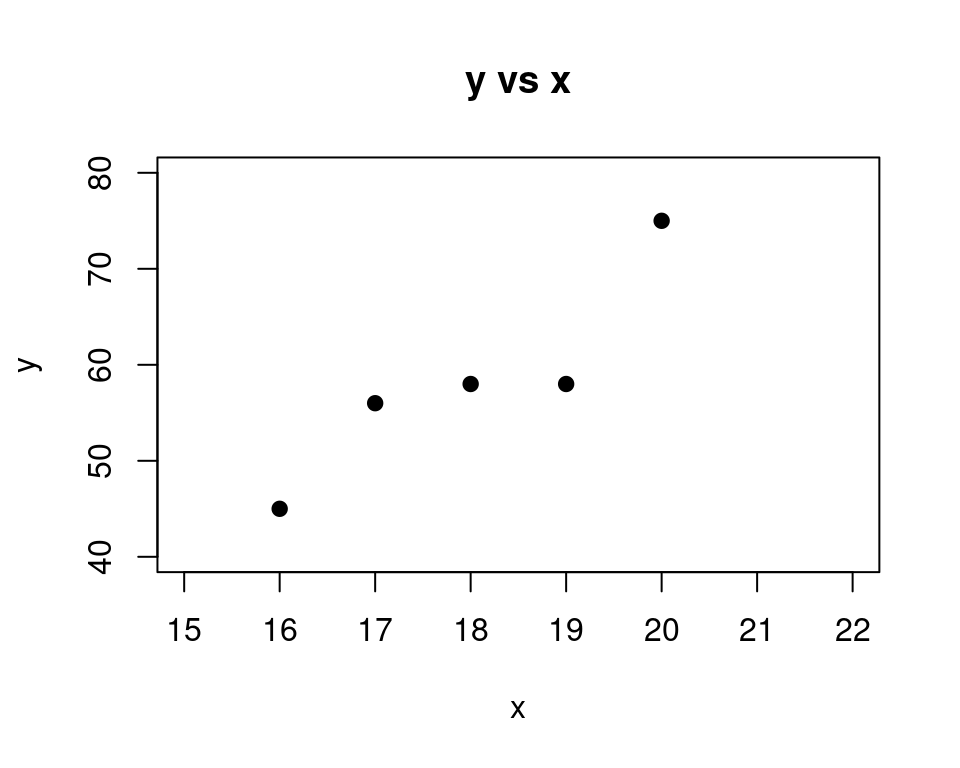
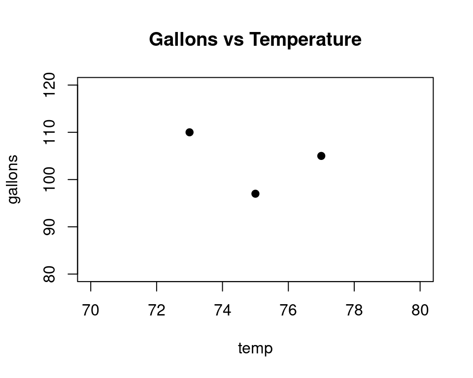

# Using the ToolPak for Regression Modeling {#regression-toolpak}

## The Data 

Lets run a regression analysis using the data analysis **ToolPak**. This add-in is called the
[_Excel Analysis ToolPak_](https://support.microsoft.com/en-us/office/load-the-analysis-toolpak-in-excel-6a63e598-cd6d-42e3-9317-6b40ba1a66b4) in Excel. For Google Sheets it is called the [_XLMiner Analysis ToolPak_](https://workspace.google.com/marketplace/app/xlminer_analysis_toolpak/600284989882). They both work the same way and produce similar output. The links show how to install these tools. 

Here is the data we will work with for our analysis:


::: {.cell}
::: {.cell-output-display}

```{=html}
<table class="huxtable" data-quarto-disable-processing="true"  style="margin-left: auto; margin-right: auto;" id="tab:data">
<col><col><thead>
<tr>
<th class="huxtable-cell huxtable-header" style="text-align: right;  border-style: solid solid solid solid; border-width: 1pt 1pt 1pt 1pt; border-top-color: rgb(255, 255, 255);  border-right-color: rgb(255, 255, 255);  border-bottom-color: rgb(255, 255, 255);  border-left-color: rgb(255, 255, 255);  background-color: rgb(204, 204, 204);">x</th><th class="huxtable-cell huxtable-header" style="text-align: right;  border-style: solid solid solid solid; border-width: 1pt 1pt 1pt 1pt; border-top-color: rgb(255, 255, 255);  border-right-color: rgb(255, 255, 255);  border-bottom-color: rgb(255, 255, 255);  border-left-color: rgb(255, 255, 255);  background-color: rgb(204, 204, 204);">y</th></tr>
</thead>
<tbody>
<tr>
<td class="huxtable-cell" style="text-align: right;  border-style: solid solid solid solid; border-width: 1pt 1pt 1pt 1pt; border-top-color: rgb(255, 255, 255);  border-right-color: rgb(255, 255, 255);  border-bottom-color: rgb(255, 255, 255);  border-left-color: rgb(255, 255, 255);  background-color: rgb(242, 242, 242);">16</td><td class="huxtable-cell" style="text-align: right;  border-style: solid solid solid solid; border-width: 1pt 1pt 1pt 1pt; border-top-color: rgb(255, 255, 255);  border-right-color: rgb(255, 255, 255);  border-bottom-color: rgb(255, 255, 255);  border-left-color: rgb(255, 255, 255);  background-color: rgb(242, 242, 242);">45</td></tr>
<tr>
<td class="huxtable-cell" style="text-align: right;  border-style: solid solid solid solid; border-width: 1pt 1pt 1pt 1pt; border-top-color: rgb(255, 255, 255);  border-right-color: rgb(255, 255, 255);  border-bottom-color: rgb(255, 255, 255);  border-left-color: rgb(255, 255, 255);  background-color: rgb(230, 230, 230);">17</td><td class="huxtable-cell" style="text-align: right;  border-style: solid solid solid solid; border-width: 1pt 1pt 1pt 1pt; border-top-color: rgb(255, 255, 255);  border-right-color: rgb(255, 255, 255);  border-bottom-color: rgb(255, 255, 255);  border-left-color: rgb(255, 255, 255);  background-color: rgb(230, 230, 230);">56</td></tr>
<tr>
<td class="huxtable-cell" style="text-align: right;  border-style: solid solid solid solid; border-width: 1pt 1pt 1pt 1pt; border-top-color: rgb(255, 255, 255);  border-right-color: rgb(255, 255, 255);  border-bottom-color: rgb(255, 255, 255);  border-left-color: rgb(255, 255, 255);  background-color: rgb(242, 242, 242);">18</td><td class="huxtable-cell" style="text-align: right;  border-style: solid solid solid solid; border-width: 1pt 1pt 1pt 1pt; border-top-color: rgb(255, 255, 255);  border-right-color: rgb(255, 255, 255);  border-bottom-color: rgb(255, 255, 255);  border-left-color: rgb(255, 255, 255);  background-color: rgb(242, 242, 242);">58</td></tr>
<tr>
<td class="huxtable-cell" style="text-align: right;  border-style: solid solid solid solid; border-width: 1pt 1pt 1pt 1pt; border-top-color: rgb(255, 255, 255);  border-right-color: rgb(255, 255, 255);  border-bottom-color: rgb(255, 255, 255);  border-left-color: rgb(255, 255, 255);  background-color: rgb(230, 230, 230);">19</td><td class="huxtable-cell" style="text-align: right;  border-style: solid solid solid solid; border-width: 1pt 1pt 1pt 1pt; border-top-color: rgb(255, 255, 255);  border-right-color: rgb(255, 255, 255);  border-bottom-color: rgb(255, 255, 255);  border-left-color: rgb(255, 255, 255);  background-color: rgb(230, 230, 230);">58</td></tr>
<tr>
<td class="huxtable-cell" style="text-align: right;  border-style: solid solid solid solid; border-width: 1pt 1pt 1pt 1pt; border-top-color: rgb(255, 255, 255);  border-right-color: rgb(255, 255, 255);  border-bottom-color: rgb(255, 255, 255);  border-left-color: rgb(255, 255, 255);  background-color: rgb(242, 242, 242);">20</td><td class="huxtable-cell" style="text-align: right;  border-style: solid solid solid solid; border-width: 1pt 1pt 1pt 1pt; border-top-color: rgb(255, 255, 255);  border-right-color: rgb(255, 255, 255);  border-bottom-color: rgb(255, 255, 255);  border-left-color: rgb(255, 255, 255);  background-color: rgb(242, 242, 242);">75</td></tr>
</tbody>
</table>

```

:::
:::


Here is a scatterplot of this data:


::: {.cell layout-align="center"}
::: {.cell-output-display}
{fig-align='center' width=480}
:::
:::


Make sure this data is entered into a spreadsheet in columns A and B of the spreadsheet. Include the names "x" and "y" in the first row as well. These are the sometimes called the **labels** for the variables.


::: {.cell}
::: {.cell-output-display}

```{=html}
<table class="huxtable" data-quarto-disable-processing="true"  style="margin-left: auto; margin-right: auto;" id="tab:spreadsheet">
<col><col><col><col><col><col><col><thead>
<tr>
<th class="huxtable-cell huxtable-header" style="text-align: right; white-space: nowrap; border-style: solid solid solid solid; border-width: 1pt 1pt 1pt 1pt; border-top-color: rgb(255, 255, 255);  border-right-color: rgb(255, 255, 255);  border-bottom-color: rgb(255, 255, 255);  border-left-color: rgb(255, 255, 255);  background-color: rgb(76, 175, 80);"><span style="color: rgb(255, 255, 255);"></span></th><th class="huxtable-cell huxtable-header" style="text-align: right; white-space: nowrap; border-style: solid solid solid solid; border-width: 1pt 1pt 1pt 1pt; border-top-color: rgb(255, 255, 255);  border-right-color: rgb(255, 255, 255);  border-bottom-color: rgb(255, 255, 255);  border-left-color: rgb(255, 255, 255);  background-color: rgb(76, 175, 80);"><span style="color: rgb(255, 255, 255);">A</span></th><th class="huxtable-cell huxtable-header" style="text-align: right; white-space: nowrap; border-style: solid solid solid solid; border-width: 1pt 1pt 1pt 1pt; border-top-color: rgb(255, 255, 255);  border-right-color: rgb(255, 255, 255);  border-bottom-color: rgb(255, 255, 255);  border-left-color: rgb(255, 255, 255);  background-color: rgb(76, 175, 80);"><span style="color: rgb(255, 255, 255);">B</span></th><th class="huxtable-cell huxtable-header" style="text-align: right; white-space: nowrap; border-style: solid solid solid solid; border-width: 1pt 1pt 1pt 1pt; border-top-color: rgb(255, 255, 255);  border-right-color: rgb(255, 255, 255);  border-bottom-color: rgb(255, 255, 255);  border-left-color: rgb(255, 255, 255);  background-color: rgb(76, 175, 80);"><span style="color: rgb(255, 255, 255);">C</span></th><th class="huxtable-cell huxtable-header" style="text-align: right; white-space: nowrap; border-style: solid solid solid solid; border-width: 1pt 1pt 1pt 1pt; border-top-color: rgb(255, 255, 255);  border-right-color: rgb(255, 255, 255);  border-bottom-color: rgb(255, 255, 255);  border-left-color: rgb(255, 255, 255);  background-color: rgb(76, 175, 80);"><span style="color: rgb(255, 255, 255);">D</span></th><th class="huxtable-cell huxtable-header" style="text-align: right; white-space: nowrap; border-style: solid solid solid solid; border-width: 1pt 1pt 1pt 1pt; border-top-color: rgb(255, 255, 255);  border-right-color: rgb(255, 255, 255);  border-bottom-color: rgb(255, 255, 255);  border-left-color: rgb(255, 255, 255);  background-color: rgb(76, 175, 80);"><span style="color: rgb(255, 255, 255);">E</span></th><th class="huxtable-cell huxtable-header" style="text-align: right; white-space: nowrap; border-style: solid solid solid solid; border-width: 1pt 1pt 1pt 1pt; border-top-color: rgb(255, 255, 255);  border-right-color: rgb(255, 255, 255);  border-bottom-color: rgb(255, 255, 255);  border-left-color: rgb(255, 255, 255);  background-color: rgb(76, 175, 80);"><span style="color: rgb(255, 255, 255);">F</span></th></tr>
</thead>
<tbody>
<tr>
<td class="huxtable-cell" style="text-align: right; white-space: nowrap; border-style: solid solid solid solid; border-width: 1pt 1pt 1pt 1pt; border-top-color: rgb(255, 255, 255);  border-right-color: rgb(255, 255, 255);  border-bottom-color: rgb(255, 255, 255);  border-left-color: rgb(255, 255, 255);  background-color: rgb(165, 214, 167);">1</td><td class="huxtable-cell" style="text-align: right; white-space: nowrap; border-style: solid solid solid solid; border-width: 1pt 1pt 1pt 1pt; border-top-color: rgb(255, 255, 255);  border-right-color: rgb(255, 255, 255);  border-bottom-color: rgb(255, 255, 255);  border-left-color: rgb(255, 255, 255);  background-color: rgb(165, 214, 167);">x</td><td class="huxtable-cell" style="text-align: right; white-space: nowrap; border-style: solid solid solid solid; border-width: 1pt 1pt 1pt 1pt; border-top-color: rgb(255, 255, 255);  border-right-color: rgb(255, 255, 255);  border-bottom-color: rgb(255, 255, 255);  border-left-color: rgb(255, 255, 255);  background-color: rgb(165, 214, 167);">y</td><td class="huxtable-cell" style="text-align: right; white-space: nowrap; border-style: solid solid solid solid; border-width: 1pt 1pt 1pt 1pt; border-top-color: rgb(255, 255, 255);  border-right-color: rgb(255, 255, 255);  border-bottom-color: rgb(255, 255, 255);  border-left-color: rgb(255, 255, 255);  background-color: rgb(165, 214, 167);"></td><td class="huxtable-cell" style="text-align: right; white-space: nowrap; border-style: solid solid solid solid; border-width: 1pt 1pt 1pt 1pt; border-top-color: rgb(255, 255, 255);  border-right-color: rgb(255, 255, 255);  border-bottom-color: rgb(255, 255, 255);  border-left-color: rgb(255, 255, 255);  background-color: rgb(165, 214, 167);"></td><td class="huxtable-cell" style="text-align: right; white-space: nowrap; border-style: solid solid solid solid; border-width: 1pt 1pt 1pt 1pt; border-top-color: rgb(255, 255, 255);  border-right-color: rgb(255, 255, 255);  border-bottom-color: rgb(255, 255, 255);  border-left-color: rgb(255, 255, 255);  background-color: rgb(165, 214, 167);"></td><td class="huxtable-cell" style="text-align: right; white-space: nowrap; border-style: solid solid solid solid; border-width: 1pt 1pt 1pt 1pt; border-top-color: rgb(255, 255, 255);  border-right-color: rgb(255, 255, 255);  border-bottom-color: rgb(255, 255, 255);  border-left-color: rgb(255, 255, 255);  background-color: rgb(165, 214, 167);"></td></tr>
<tr>
<td class="huxtable-cell" style="text-align: right; white-space: nowrap; border-style: solid solid solid solid; border-width: 1pt 1pt 1pt 1pt; border-top-color: rgb(255, 255, 255);  border-right-color: rgb(255, 255, 255);  border-bottom-color: rgb(255, 255, 255);  border-left-color: rgb(255, 255, 255);  background-color: rgb(200, 230, 201);">2</td><td class="huxtable-cell" style="text-align: right; white-space: nowrap; border-style: solid solid solid solid; border-width: 1pt 1pt 1pt 1pt; border-top-color: rgb(255, 255, 255);  border-right-color: rgb(255, 255, 255);  border-bottom-color: rgb(255, 255, 255);  border-left-color: rgb(255, 255, 255);  background-color: rgb(200, 230, 201);">16</td><td class="huxtable-cell" style="text-align: right; white-space: nowrap; border-style: solid solid solid solid; border-width: 1pt 1pt 1pt 1pt; border-top-color: rgb(255, 255, 255);  border-right-color: rgb(255, 255, 255);  border-bottom-color: rgb(255, 255, 255);  border-left-color: rgb(255, 255, 255);  background-color: rgb(200, 230, 201);">45</td><td class="huxtable-cell" style="text-align: right; white-space: nowrap; border-style: solid solid solid solid; border-width: 1pt 1pt 1pt 1pt; border-top-color: rgb(255, 255, 255);  border-right-color: rgb(255, 255, 255);  border-bottom-color: rgb(255, 255, 255);  border-left-color: rgb(255, 255, 255);  background-color: rgb(200, 230, 201);"></td><td class="huxtable-cell" style="text-align: right; white-space: nowrap; border-style: solid solid solid solid; border-width: 1pt 1pt 1pt 1pt; border-top-color: rgb(255, 255, 255);  border-right-color: rgb(255, 255, 255);  border-bottom-color: rgb(255, 255, 255);  border-left-color: rgb(255, 255, 255);  background-color: rgb(200, 230, 201);"></td><td class="huxtable-cell" style="text-align: right; white-space: nowrap; border-style: solid solid solid solid; border-width: 1pt 1pt 1pt 1pt; border-top-color: rgb(255, 255, 255);  border-right-color: rgb(255, 255, 255);  border-bottom-color: rgb(255, 255, 255);  border-left-color: rgb(255, 255, 255);  background-color: rgb(200, 230, 201);"></td><td class="huxtable-cell" style="text-align: right; white-space: nowrap; border-style: solid solid solid solid; border-width: 1pt 1pt 1pt 1pt; border-top-color: rgb(255, 255, 255);  border-right-color: rgb(255, 255, 255);  border-bottom-color: rgb(255, 255, 255);  border-left-color: rgb(255, 255, 255);  background-color: rgb(200, 230, 201);"></td></tr>
<tr>
<td class="huxtable-cell" style="text-align: right; white-space: nowrap; border-style: solid solid solid solid; border-width: 1pt 1pt 1pt 1pt; border-top-color: rgb(255, 255, 255);  border-right-color: rgb(255, 255, 255);  border-bottom-color: rgb(255, 255, 255);  border-left-color: rgb(255, 255, 255);  background-color: rgb(165, 214, 167);">3</td><td class="huxtable-cell" style="text-align: right; white-space: nowrap; border-style: solid solid solid solid; border-width: 1pt 1pt 1pt 1pt; border-top-color: rgb(255, 255, 255);  border-right-color: rgb(255, 255, 255);  border-bottom-color: rgb(255, 255, 255);  border-left-color: rgb(255, 255, 255);  background-color: rgb(165, 214, 167);">17</td><td class="huxtable-cell" style="text-align: right; white-space: nowrap; border-style: solid solid solid solid; border-width: 1pt 1pt 1pt 1pt; border-top-color: rgb(255, 255, 255);  border-right-color: rgb(255, 255, 255);  border-bottom-color: rgb(255, 255, 255);  border-left-color: rgb(255, 255, 255);  background-color: rgb(165, 214, 167);">56</td><td class="huxtable-cell" style="text-align: right; white-space: nowrap; border-style: solid solid solid solid; border-width: 1pt 1pt 1pt 1pt; border-top-color: rgb(255, 255, 255);  border-right-color: rgb(255, 255, 255);  border-bottom-color: rgb(255, 255, 255);  border-left-color: rgb(255, 255, 255);  background-color: rgb(165, 214, 167);"></td><td class="huxtable-cell" style="text-align: right; white-space: nowrap; border-style: solid solid solid solid; border-width: 1pt 1pt 1pt 1pt; border-top-color: rgb(255, 255, 255);  border-right-color: rgb(255, 255, 255);  border-bottom-color: rgb(255, 255, 255);  border-left-color: rgb(255, 255, 255);  background-color: rgb(165, 214, 167);"></td><td class="huxtable-cell" style="text-align: right; white-space: nowrap; border-style: solid solid solid solid; border-width: 1pt 1pt 1pt 1pt; border-top-color: rgb(255, 255, 255);  border-right-color: rgb(255, 255, 255);  border-bottom-color: rgb(255, 255, 255);  border-left-color: rgb(255, 255, 255);  background-color: rgb(165, 214, 167);"></td><td class="huxtable-cell" style="text-align: right; white-space: nowrap; border-style: solid solid solid solid; border-width: 1pt 1pt 1pt 1pt; border-top-color: rgb(255, 255, 255);  border-right-color: rgb(255, 255, 255);  border-bottom-color: rgb(255, 255, 255);  border-left-color: rgb(255, 255, 255);  background-color: rgb(165, 214, 167);"></td></tr>
<tr>
<td class="huxtable-cell" style="text-align: right; white-space: nowrap; border-style: solid solid solid solid; border-width: 1pt 1pt 1pt 1pt; border-top-color: rgb(255, 255, 255);  border-right-color: rgb(255, 255, 255);  border-bottom-color: rgb(255, 255, 255);  border-left-color: rgb(255, 255, 255);  background-color: rgb(200, 230, 201);">4</td><td class="huxtable-cell" style="text-align: right; white-space: nowrap; border-style: solid solid solid solid; border-width: 1pt 1pt 1pt 1pt; border-top-color: rgb(255, 255, 255);  border-right-color: rgb(255, 255, 255);  border-bottom-color: rgb(255, 255, 255);  border-left-color: rgb(255, 255, 255);  background-color: rgb(200, 230, 201);">18</td><td class="huxtable-cell" style="text-align: right; white-space: nowrap; border-style: solid solid solid solid; border-width: 1pt 1pt 1pt 1pt; border-top-color: rgb(255, 255, 255);  border-right-color: rgb(255, 255, 255);  border-bottom-color: rgb(255, 255, 255);  border-left-color: rgb(255, 255, 255);  background-color: rgb(200, 230, 201);">58</td><td class="huxtable-cell" style="text-align: right; white-space: nowrap; border-style: solid solid solid solid; border-width: 1pt 1pt 1pt 1pt; border-top-color: rgb(255, 255, 255);  border-right-color: rgb(255, 255, 255);  border-bottom-color: rgb(255, 255, 255);  border-left-color: rgb(255, 255, 255);  background-color: rgb(200, 230, 201);"></td><td class="huxtable-cell" style="text-align: right; white-space: nowrap; border-style: solid solid solid solid; border-width: 1pt 1pt 1pt 1pt; border-top-color: rgb(255, 255, 255);  border-right-color: rgb(255, 255, 255);  border-bottom-color: rgb(255, 255, 255);  border-left-color: rgb(255, 255, 255);  background-color: rgb(200, 230, 201);"></td><td class="huxtable-cell" style="text-align: right; white-space: nowrap; border-style: solid solid solid solid; border-width: 1pt 1pt 1pt 1pt; border-top-color: rgb(255, 255, 255);  border-right-color: rgb(255, 255, 255);  border-bottom-color: rgb(255, 255, 255);  border-left-color: rgb(255, 255, 255);  background-color: rgb(200, 230, 201);"></td><td class="huxtable-cell" style="text-align: right; white-space: nowrap; border-style: solid solid solid solid; border-width: 1pt 1pt 1pt 1pt; border-top-color: rgb(255, 255, 255);  border-right-color: rgb(255, 255, 255);  border-bottom-color: rgb(255, 255, 255);  border-left-color: rgb(255, 255, 255);  background-color: rgb(200, 230, 201);"></td></tr>
<tr>
<td class="huxtable-cell" style="text-align: right; white-space: nowrap; border-style: solid solid solid solid; border-width: 1pt 1pt 1pt 1pt; border-top-color: rgb(255, 255, 255);  border-right-color: rgb(255, 255, 255);  border-bottom-color: rgb(255, 255, 255);  border-left-color: rgb(255, 255, 255);  background-color: rgb(165, 214, 167);">5</td><td class="huxtable-cell" style="text-align: right; white-space: nowrap; border-style: solid solid solid solid; border-width: 1pt 1pt 1pt 1pt; border-top-color: rgb(255, 255, 255);  border-right-color: rgb(255, 255, 255);  border-bottom-color: rgb(255, 255, 255);  border-left-color: rgb(255, 255, 255);  background-color: rgb(165, 214, 167);">19</td><td class="huxtable-cell" style="text-align: right; white-space: nowrap; border-style: solid solid solid solid; border-width: 1pt 1pt 1pt 1pt; border-top-color: rgb(255, 255, 255);  border-right-color: rgb(255, 255, 255);  border-bottom-color: rgb(255, 255, 255);  border-left-color: rgb(255, 255, 255);  background-color: rgb(165, 214, 167);">58</td><td class="huxtable-cell" style="text-align: right; white-space: nowrap; border-style: solid solid solid solid; border-width: 1pt 1pt 1pt 1pt; border-top-color: rgb(255, 255, 255);  border-right-color: rgb(255, 255, 255);  border-bottom-color: rgb(255, 255, 255);  border-left-color: rgb(255, 255, 255);  background-color: rgb(165, 214, 167);"></td><td class="huxtable-cell" style="text-align: right; white-space: nowrap; border-style: solid solid solid solid; border-width: 1pt 1pt 1pt 1pt; border-top-color: rgb(255, 255, 255);  border-right-color: rgb(255, 255, 255);  border-bottom-color: rgb(255, 255, 255);  border-left-color: rgb(255, 255, 255);  background-color: rgb(165, 214, 167);"></td><td class="huxtable-cell" style="text-align: right; white-space: nowrap; border-style: solid solid solid solid; border-width: 1pt 1pt 1pt 1pt; border-top-color: rgb(255, 255, 255);  border-right-color: rgb(255, 255, 255);  border-bottom-color: rgb(255, 255, 255);  border-left-color: rgb(255, 255, 255);  background-color: rgb(165, 214, 167);"></td><td class="huxtable-cell" style="text-align: right; white-space: nowrap; border-style: solid solid solid solid; border-width: 1pt 1pt 1pt 1pt; border-top-color: rgb(255, 255, 255);  border-right-color: rgb(255, 255, 255);  border-bottom-color: rgb(255, 255, 255);  border-left-color: rgb(255, 255, 255);  background-color: rgb(165, 214, 167);"></td></tr>
<tr>
<td class="huxtable-cell" style="text-align: right; white-space: nowrap; border-style: solid solid solid solid; border-width: 1pt 1pt 1pt 1pt; border-top-color: rgb(255, 255, 255);  border-right-color: rgb(255, 255, 255);  border-bottom-color: rgb(255, 255, 255);  border-left-color: rgb(255, 255, 255);  background-color: rgb(200, 230, 201);">6</td><td class="huxtable-cell" style="text-align: right; white-space: nowrap; border-style: solid solid solid solid; border-width: 1pt 1pt 1pt 1pt; border-top-color: rgb(255, 255, 255);  border-right-color: rgb(255, 255, 255);  border-bottom-color: rgb(255, 255, 255);  border-left-color: rgb(255, 255, 255);  background-color: rgb(200, 230, 201);">20</td><td class="huxtable-cell" style="text-align: right; white-space: nowrap; border-style: solid solid solid solid; border-width: 1pt 1pt 1pt 1pt; border-top-color: rgb(255, 255, 255);  border-right-color: rgb(255, 255, 255);  border-bottom-color: rgb(255, 255, 255);  border-left-color: rgb(255, 255, 255);  background-color: rgb(200, 230, 201);">75</td><td class="huxtable-cell" style="text-align: right; white-space: nowrap; border-style: solid solid solid solid; border-width: 1pt 1pt 1pt 1pt; border-top-color: rgb(255, 255, 255);  border-right-color: rgb(255, 255, 255);  border-bottom-color: rgb(255, 255, 255);  border-left-color: rgb(255, 255, 255);  background-color: rgb(200, 230, 201);"></td><td class="huxtable-cell" style="text-align: right; white-space: nowrap; border-style: solid solid solid solid; border-width: 1pt 1pt 1pt 1pt; border-top-color: rgb(255, 255, 255);  border-right-color: rgb(255, 255, 255);  border-bottom-color: rgb(255, 255, 255);  border-left-color: rgb(255, 255, 255);  background-color: rgb(200, 230, 201);"></td><td class="huxtable-cell" style="text-align: right; white-space: nowrap; border-style: solid solid solid solid; border-width: 1pt 1pt 1pt 1pt; border-top-color: rgb(255, 255, 255);  border-right-color: rgb(255, 255, 255);  border-bottom-color: rgb(255, 255, 255);  border-left-color: rgb(255, 255, 255);  background-color: rgb(200, 230, 201);"></td><td class="huxtable-cell" style="text-align: right; white-space: nowrap; border-style: solid solid solid solid; border-width: 1pt 1pt 1pt 1pt; border-top-color: rgb(255, 255, 255);  border-right-color: rgb(255, 255, 255);  border-bottom-color: rgb(255, 255, 255);  border-left-color: rgb(255, 255, 255);  background-color: rgb(200, 230, 201);"></td></tr>
<tr>
<td class="huxtable-cell" style="text-align: right; white-space: nowrap; border-style: solid solid solid solid; border-width: 1pt 1pt 1pt 1pt; border-top-color: rgb(255, 255, 255);  border-right-color: rgb(255, 255, 255);  border-bottom-color: rgb(255, 255, 255);  border-left-color: rgb(255, 255, 255);  background-color: rgb(165, 214, 167);">7</td><td class="huxtable-cell" style="text-align: right; white-space: nowrap; border-style: solid solid solid solid; border-width: 1pt 1pt 1pt 1pt; border-top-color: rgb(255, 255, 255);  border-right-color: rgb(255, 255, 255);  border-bottom-color: rgb(255, 255, 255);  border-left-color: rgb(255, 255, 255);  background-color: rgb(165, 214, 167);"></td><td class="huxtable-cell" style="text-align: right; white-space: nowrap; border-style: solid solid solid solid; border-width: 1pt 1pt 1pt 1pt; border-top-color: rgb(255, 255, 255);  border-right-color: rgb(255, 255, 255);  border-bottom-color: rgb(255, 255, 255);  border-left-color: rgb(255, 255, 255);  background-color: rgb(165, 214, 167);"></td><td class="huxtable-cell" style="text-align: right; white-space: nowrap; border-style: solid solid solid solid; border-width: 1pt 1pt 1pt 1pt; border-top-color: rgb(255, 255, 255);  border-right-color: rgb(255, 255, 255);  border-bottom-color: rgb(255, 255, 255);  border-left-color: rgb(255, 255, 255);  background-color: rgb(165, 214, 167);"></td><td class="huxtable-cell" style="text-align: right; white-space: nowrap; border-style: solid solid solid solid; border-width: 1pt 1pt 1pt 1pt; border-top-color: rgb(255, 255, 255);  border-right-color: rgb(255, 255, 255);  border-bottom-color: rgb(255, 255, 255);  border-left-color: rgb(255, 255, 255);  background-color: rgb(165, 214, 167);"></td><td class="huxtable-cell" style="text-align: right; white-space: nowrap; border-style: solid solid solid solid; border-width: 1pt 1pt 1pt 1pt; border-top-color: rgb(255, 255, 255);  border-right-color: rgb(255, 255, 255);  border-bottom-color: rgb(255, 255, 255);  border-left-color: rgb(255, 255, 255);  background-color: rgb(165, 214, 167);"></td><td class="huxtable-cell" style="text-align: right; white-space: nowrap; border-style: solid solid solid solid; border-width: 1pt 1pt 1pt 1pt; border-top-color: rgb(255, 255, 255);  border-right-color: rgb(255, 255, 255);  border-bottom-color: rgb(255, 255, 255);  border-left-color: rgb(255, 255, 255);  background-color: rgb(165, 214, 167);"></td></tr>
<tr>
<td class="huxtable-cell" style="text-align: right; white-space: nowrap; border-style: solid solid solid solid; border-width: 1pt 1pt 1pt 1pt; border-top-color: rgb(255, 255, 255);  border-right-color: rgb(255, 255, 255);  border-bottom-color: rgb(255, 255, 255);  border-left-color: rgb(255, 255, 255);  background-color: rgb(200, 230, 201);">8</td><td class="huxtable-cell" style="text-align: right; white-space: nowrap; border-style: solid solid solid solid; border-width: 1pt 1pt 1pt 1pt; border-top-color: rgb(255, 255, 255);  border-right-color: rgb(255, 255, 255);  border-bottom-color: rgb(255, 255, 255);  border-left-color: rgb(255, 255, 255);  background-color: rgb(200, 230, 201);"></td><td class="huxtable-cell" style="text-align: right; white-space: nowrap; border-style: solid solid solid solid; border-width: 1pt 1pt 1pt 1pt; border-top-color: rgb(255, 255, 255);  border-right-color: rgb(255, 255, 255);  border-bottom-color: rgb(255, 255, 255);  border-left-color: rgb(255, 255, 255);  background-color: rgb(200, 230, 201);"></td><td class="huxtable-cell" style="text-align: right; white-space: nowrap; border-style: solid solid solid solid; border-width: 1pt 1pt 1pt 1pt; border-top-color: rgb(255, 255, 255);  border-right-color: rgb(255, 255, 255);  border-bottom-color: rgb(255, 255, 255);  border-left-color: rgb(255, 255, 255);  background-color: rgb(200, 230, 201);"></td><td class="huxtable-cell" style="text-align: right; white-space: nowrap; border-style: solid solid solid solid; border-width: 1pt 1pt 1pt 1pt; border-top-color: rgb(255, 255, 255);  border-right-color: rgb(255, 255, 255);  border-bottom-color: rgb(255, 255, 255);  border-left-color: rgb(255, 255, 255);  background-color: rgb(200, 230, 201);"></td><td class="huxtable-cell" style="text-align: right; white-space: nowrap; border-style: solid solid solid solid; border-width: 1pt 1pt 1pt 1pt; border-top-color: rgb(255, 255, 255);  border-right-color: rgb(255, 255, 255);  border-bottom-color: rgb(255, 255, 255);  border-left-color: rgb(255, 255, 255);  background-color: rgb(200, 230, 201);"></td><td class="huxtable-cell" style="text-align: right; white-space: nowrap; border-style: solid solid solid solid; border-width: 1pt 1pt 1pt 1pt; border-top-color: rgb(255, 255, 255);  border-right-color: rgb(255, 255, 255);  border-bottom-color: rgb(255, 255, 255);  border-left-color: rgb(255, 255, 255);  background-color: rgb(200, 230, 201);"></td></tr>
<tr>
<td class="huxtable-cell" style="text-align: right; white-space: nowrap; border-style: solid solid solid solid; border-width: 1pt 1pt 1pt 1pt; border-top-color: rgb(255, 255, 255);  border-right-color: rgb(255, 255, 255);  border-bottom-color: rgb(255, 255, 255);  border-left-color: rgb(255, 255, 255);  background-color: rgb(165, 214, 167);">9</td><td class="huxtable-cell" style="text-align: right; white-space: nowrap; border-style: solid solid solid solid; border-width: 1pt 1pt 1pt 1pt; border-top-color: rgb(255, 255, 255);  border-right-color: rgb(255, 255, 255);  border-bottom-color: rgb(255, 255, 255);  border-left-color: rgb(255, 255, 255);  background-color: rgb(165, 214, 167);"></td><td class="huxtable-cell" style="text-align: right; white-space: nowrap; border-style: solid solid solid solid; border-width: 1pt 1pt 1pt 1pt; border-top-color: rgb(255, 255, 255);  border-right-color: rgb(255, 255, 255);  border-bottom-color: rgb(255, 255, 255);  border-left-color: rgb(255, 255, 255);  background-color: rgb(165, 214, 167);"></td><td class="huxtable-cell" style="text-align: right; white-space: nowrap; border-style: solid solid solid solid; border-width: 1pt 1pt 1pt 1pt; border-top-color: rgb(255, 255, 255);  border-right-color: rgb(255, 255, 255);  border-bottom-color: rgb(255, 255, 255);  border-left-color: rgb(255, 255, 255);  background-color: rgb(165, 214, 167);"></td><td class="huxtable-cell" style="text-align: right; white-space: nowrap; border-style: solid solid solid solid; border-width: 1pt 1pt 1pt 1pt; border-top-color: rgb(255, 255, 255);  border-right-color: rgb(255, 255, 255);  border-bottom-color: rgb(255, 255, 255);  border-left-color: rgb(255, 255, 255);  background-color: rgb(165, 214, 167);"></td><td class="huxtable-cell" style="text-align: right; white-space: nowrap; border-style: solid solid solid solid; border-width: 1pt 1pt 1pt 1pt; border-top-color: rgb(255, 255, 255);  border-right-color: rgb(255, 255, 255);  border-bottom-color: rgb(255, 255, 255);  border-left-color: rgb(255, 255, 255);  background-color: rgb(165, 214, 167);"></td><td class="huxtable-cell" style="text-align: right; white-space: nowrap; border-style: solid solid solid solid; border-width: 1pt 1pt 1pt 1pt; border-top-color: rgb(255, 255, 255);  border-right-color: rgb(255, 255, 255);  border-bottom-color: rgb(255, 255, 255);  border-left-color: rgb(255, 255, 255);  background-color: rgb(165, 214, 167);"></td></tr>
<tr>
<td class="huxtable-cell" style="text-align: right; white-space: nowrap; border-style: solid solid solid solid; border-width: 1pt 1pt 1pt 1pt; border-top-color: rgb(255, 255, 255);  border-right-color: rgb(255, 255, 255);  border-bottom-color: rgb(255, 255, 255);  border-left-color: rgb(255, 255, 255);  background-color: rgb(200, 230, 201);">10</td><td class="huxtable-cell" style="text-align: right; white-space: nowrap; border-style: solid solid solid solid; border-width: 1pt 1pt 1pt 1pt; border-top-color: rgb(255, 255, 255);  border-right-color: rgb(255, 255, 255);  border-bottom-color: rgb(255, 255, 255);  border-left-color: rgb(255, 255, 255);  background-color: rgb(200, 230, 201);"></td><td class="huxtable-cell" style="text-align: right; white-space: nowrap; border-style: solid solid solid solid; border-width: 1pt 1pt 1pt 1pt; border-top-color: rgb(255, 255, 255);  border-right-color: rgb(255, 255, 255);  border-bottom-color: rgb(255, 255, 255);  border-left-color: rgb(255, 255, 255);  background-color: rgb(200, 230, 201);"></td><td class="huxtable-cell" style="text-align: right; white-space: nowrap; border-style: solid solid solid solid; border-width: 1pt 1pt 1pt 1pt; border-top-color: rgb(255, 255, 255);  border-right-color: rgb(255, 255, 255);  border-bottom-color: rgb(255, 255, 255);  border-left-color: rgb(255, 255, 255);  background-color: rgb(200, 230, 201);"></td><td class="huxtable-cell" style="text-align: right; white-space: nowrap; border-style: solid solid solid solid; border-width: 1pt 1pt 1pt 1pt; border-top-color: rgb(255, 255, 255);  border-right-color: rgb(255, 255, 255);  border-bottom-color: rgb(255, 255, 255);  border-left-color: rgb(255, 255, 255);  background-color: rgb(200, 230, 201);"></td><td class="huxtable-cell" style="text-align: right; white-space: nowrap; border-style: solid solid solid solid; border-width: 1pt 1pt 1pt 1pt; border-top-color: rgb(255, 255, 255);  border-right-color: rgb(255, 255, 255);  border-bottom-color: rgb(255, 255, 255);  border-left-color: rgb(255, 255, 255);  background-color: rgb(200, 230, 201);"></td><td class="huxtable-cell" style="text-align: right; white-space: nowrap; border-style: solid solid solid solid; border-width: 1pt 1pt 1pt 1pt; border-top-color: rgb(255, 255, 255);  border-right-color: rgb(255, 255, 255);  border-bottom-color: rgb(255, 255, 255);  border-left-color: rgb(255, 255, 255);  background-color: rgb(200, 230, 201);"></td></tr>
</tbody>
</table>

```

:::
:::


## ToolPak Output 

Run the Tookpak add-in and select the linear regression tool. For "Input Y Range" enter in **B1:B6** and **A1:A6** for "Input X Range".

You can click on the "Labels" option since you have included row 1 and this contains the labels "x" and "y" for your data.

Now choose D2 as the output cell. This is where your regression summary will go. Go ahead and run the analysis and it should output something like this:


::: {.cell}
::: {.cell-output-display}

```{=html}
<table class="huxtable" data-quarto-disable-processing="true"  style="margin-left: auto; margin-right: auto;" id="tab:analysis">
<col><col><col><col><col><col><col><col><col><col><col><thead>
<tr>
<th class="huxtable-cell huxtable-header" style="text-align: right; white-space: nowrap; border-style: solid solid solid solid; border-width: 1pt 1pt 1pt 1pt; border-top-color: rgb(255, 255, 255);  border-right-color: rgb(255, 255, 255);  border-bottom-color: rgb(255, 255, 255);  border-left-color: rgb(255, 255, 255);  background-color: rgb(76, 175, 80); font-weight: normal;   font-size: 11pt;"><span style="color: rgb(255, 255, 255);"></span></th><th class="huxtable-cell huxtable-header" style="text-align: right; white-space: nowrap; border-style: solid solid solid solid; border-width: 1pt 1pt 1pt 1pt; border-top-color: rgb(255, 255, 255);  border-right-color: rgb(255, 255, 255);  border-bottom-color: rgb(255, 255, 255);  border-left-color: rgb(255, 255, 255);  background-color: rgb(76, 175, 80); font-weight: normal;   font-size: 11pt;"><span style="color: rgb(255, 255, 255);">A</span></th><th class="huxtable-cell huxtable-header" style="text-align: right; white-space: nowrap; border-style: solid solid solid solid; border-width: 1pt 1pt 1pt 1pt; border-top-color: rgb(255, 255, 255);  border-right-color: rgb(255, 255, 255);  border-bottom-color: rgb(255, 255, 255);  border-left-color: rgb(255, 255, 255);  background-color: rgb(76, 175, 80); font-weight: normal;   font-size: 11pt;"><span style="color: rgb(255, 255, 255);">B</span></th><th class="huxtable-cell huxtable-header" style="text-align: right; white-space: nowrap; border-style: solid solid solid solid; border-width: 1pt 1pt 1pt 1pt; border-top-color: rgb(255, 255, 255);  border-right-color: rgb(255, 255, 255);  border-bottom-color: rgb(255, 255, 255);  border-left-color: rgb(255, 255, 255);  background-color: rgb(76, 175, 80); font-weight: normal;   font-size: 11pt;"><span style="color: rgb(255, 255, 255);">C</span></th><th class="huxtable-cell huxtable-header" style="text-align: right; white-space: nowrap; border-style: solid solid solid solid; border-width: 1pt 1pt 1pt 1pt; border-top-color: rgb(255, 255, 255);  border-right-color: rgb(255, 255, 255);  border-bottom-color: rgb(255, 255, 255);  border-left-color: rgb(255, 255, 255);  background-color: rgb(76, 175, 80); font-weight: normal;   font-size: 11pt;"><span style="color: rgb(255, 255, 255);">D</span></th><th class="huxtable-cell huxtable-header" style="text-align: right; white-space: nowrap; border-style: solid solid solid solid; border-width: 1pt 1pt 1pt 1pt; border-top-color: rgb(255, 255, 255);  border-right-color: rgb(255, 255, 255);  border-bottom-color: rgb(255, 255, 255);  border-left-color: rgb(255, 255, 255);  background-color: rgb(76, 175, 80); font-weight: normal;   font-size: 11pt;"><span style="color: rgb(255, 255, 255);">E</span></th><th class="huxtable-cell huxtable-header" style="text-align: right; white-space: nowrap; border-style: solid solid solid solid; border-width: 1pt 1pt 1pt 1pt; border-top-color: rgb(255, 255, 255);  border-right-color: rgb(255, 255, 255);  border-bottom-color: rgb(255, 255, 255);  border-left-color: rgb(255, 255, 255);  background-color: rgb(76, 175, 80); font-weight: normal;   font-size: 11pt;"><span style="color: rgb(255, 255, 255);">F</span></th><th class="huxtable-cell huxtable-header" style="text-align: right; white-space: nowrap; border-style: solid solid solid solid; border-width: 1pt 1pt 1pt 1pt; border-top-color: rgb(255, 255, 255);  border-right-color: rgb(255, 255, 255);  border-bottom-color: rgb(255, 255, 255);  border-left-color: rgb(255, 255, 255);  background-color: rgb(76, 175, 80); font-weight: normal;   font-size: 11pt;"><span style="color: rgb(255, 255, 255);">G</span></th><th class="huxtable-cell huxtable-header" style="text-align: right; white-space: nowrap; border-style: solid solid solid solid; border-width: 1pt 1pt 1pt 1pt; border-top-color: rgb(255, 255, 255);  border-right-color: rgb(255, 255, 255);  border-bottom-color: rgb(255, 255, 255);  border-left-color: rgb(255, 255, 255);  background-color: rgb(76, 175, 80); font-weight: normal;   font-size: 11pt;"><span style="color: rgb(255, 255, 255);">H</span></th><th class="huxtable-cell huxtable-header" style="text-align: right; white-space: nowrap; border-style: solid solid solid solid; border-width: 1pt 1pt 1pt 1pt; border-top-color: rgb(255, 255, 255);  border-right-color: rgb(255, 255, 255);  border-bottom-color: rgb(255, 255, 255);  border-left-color: rgb(255, 255, 255);  background-color: rgb(76, 175, 80); font-weight: normal;   font-size: 11pt;"><span style="color: rgb(255, 255, 255);">I</span></th><th class="huxtable-cell huxtable-header" style="text-align: right; white-space: nowrap; border-style: solid solid solid solid; border-width: 1pt 1pt 1pt 1pt; border-top-color: rgb(255, 255, 255);  border-right-color: rgb(255, 255, 255);  border-bottom-color: rgb(255, 255, 255);  border-left-color: rgb(255, 255, 255);  background-color: rgb(76, 175, 80); font-weight: normal;   font-size: 11pt;"><span style="color: rgb(255, 255, 255);">J</span></th></tr>
</thead>
<tbody>
<tr>
<td class="huxtable-cell" style="text-align: right; white-space: nowrap; border-style: solid solid solid solid; border-width: 1pt 1pt 1pt 1pt; border-top-color: rgb(255, 255, 255);  border-right-color: rgb(255, 255, 255);  border-bottom-color: rgb(255, 255, 255);  border-left-color: rgb(255, 255, 255);  background-color: rgb(165, 214, 167);    font-size: 11pt;">1</td><td class="huxtable-cell" style="text-align: right; white-space: nowrap; border-style: solid solid solid solid; border-width: 1pt 1pt 1pt 1pt; border-top-color: rgb(255, 255, 255);  border-right-color: rgb(255, 255, 255);  border-bottom-color: rgb(255, 255, 255);  border-left-color: rgb(255, 255, 255);  background-color: rgb(165, 214, 167);    font-size: 11pt;">x</td><td class="huxtable-cell" style="text-align: right; white-space: nowrap; border-style: solid solid solid solid; border-width: 1pt 1pt 1pt 1pt; border-top-color: rgb(255, 255, 255);  border-right-color: rgb(255, 255, 255);  border-bottom-color: rgb(255, 255, 255);  border-left-color: rgb(255, 255, 255);  background-color: rgb(165, 214, 167);    font-size: 11pt;">y</td><td class="huxtable-cell" style="text-align: right; white-space: nowrap; border-style: solid solid solid solid; border-width: 1pt 1pt 1pt 1pt; border-top-color: rgb(255, 255, 255);  border-right-color: rgb(255, 255, 255);  border-bottom-color: rgb(255, 255, 255);  border-left-color: rgb(255, 255, 255);  background-color: rgb(165, 214, 167);    font-size: 11pt;"></td><td class="huxtable-cell" style="text-align: right; white-space: nowrap; border-style: solid solid solid solid; border-width: 1pt 1pt 1pt 1pt; border-top-color: rgb(255, 255, 255);  border-right-color: rgb(255, 255, 255);  border-bottom-color: rgb(255, 255, 255);  border-left-color: rgb(255, 255, 255);  background-color: rgb(165, 214, 167);    font-size: 11pt;"></td><td class="huxtable-cell" style="text-align: right; white-space: nowrap; border-style: solid solid solid solid; border-width: 1pt 1pt 1pt 1pt; border-top-color: rgb(255, 255, 255);  border-right-color: rgb(255, 255, 255);  border-bottom-color: rgb(255, 255, 255);  border-left-color: rgb(255, 255, 255);  background-color: rgb(165, 214, 167);    font-size: 11pt;"></td><td class="huxtable-cell" style="text-align: right; white-space: nowrap; border-style: solid solid solid solid; border-width: 1pt 1pt 1pt 1pt; border-top-color: rgb(255, 255, 255);  border-right-color: rgb(255, 255, 255);  border-bottom-color: rgb(255, 255, 255);  border-left-color: rgb(255, 255, 255);  background-color: rgb(165, 214, 167);    font-size: 11pt;"></td><td class="huxtable-cell" style="text-align: right; white-space: nowrap; border-style: solid solid solid solid; border-width: 1pt 1pt 1pt 1pt; border-top-color: rgb(255, 255, 255);  border-right-color: rgb(255, 255, 255);  border-bottom-color: rgb(255, 255, 255);  border-left-color: rgb(255, 255, 255);  background-color: rgb(165, 214, 167);    font-size: 11pt;"></td><td class="huxtable-cell" style="text-align: right; white-space: nowrap; border-style: solid solid solid solid; border-width: 1pt 1pt 1pt 1pt; border-top-color: rgb(255, 255, 255);  border-right-color: rgb(255, 255, 255);  border-bottom-color: rgb(255, 255, 255);  border-left-color: rgb(255, 255, 255);  background-color: rgb(165, 214, 167);    font-size: 11pt;"></td><td class="huxtable-cell" style="text-align: right; white-space: nowrap; border-style: solid solid solid solid; border-width: 1pt 1pt 1pt 1pt; border-top-color: rgb(255, 255, 255);  border-right-color: rgb(255, 255, 255);  border-bottom-color: rgb(255, 255, 255);  border-left-color: rgb(255, 255, 255);  background-color: rgb(165, 214, 167);    font-size: 11pt;"></td><td class="huxtable-cell" style="text-align: right; white-space: nowrap; border-style: solid solid solid solid; border-width: 1pt 1pt 1pt 1pt; border-top-color: rgb(255, 255, 255);  border-right-color: rgb(255, 255, 255);  border-bottom-color: rgb(255, 255, 255);  border-left-color: rgb(255, 255, 255);  background-color: rgb(165, 214, 167);    font-size: 11pt;"></td></tr>
<tr>
<td class="huxtable-cell" style="text-align: right; white-space: nowrap; border-style: solid solid solid solid; border-width: 1pt 1pt 1pt 1pt; border-top-color: rgb(255, 255, 255);  border-right-color: rgb(255, 255, 255);  border-bottom-color: rgb(255, 255, 255);  border-left-color: rgb(255, 255, 255);  background-color: rgb(200, 230, 201);    font-size: 11pt;">2</td><td class="huxtable-cell" style="text-align: right; white-space: nowrap; border-style: solid solid solid solid; border-width: 1pt 1pt 1pt 1pt; border-top-color: rgb(255, 255, 255);  border-right-color: rgb(255, 255, 255);  border-bottom-color: rgb(255, 255, 255);  border-left-color: rgb(255, 255, 255);  background-color: rgb(200, 230, 201);    font-size: 11pt;">16</td><td class="huxtable-cell" style="text-align: right; white-space: nowrap; border-style: solid solid solid solid; border-width: 1pt 1pt 1pt 1pt; border-top-color: rgb(255, 255, 255);  border-right-color: rgb(255, 255, 255);  border-bottom-color: rgb(255, 255, 255);  border-left-color: rgb(255, 255, 255);  background-color: rgb(200, 230, 201);    font-size: 11pt;">45</td><td class="huxtable-cell" style="text-align: right; white-space: nowrap; border-style: solid solid solid solid; border-width: 1pt 1pt 1pt 1pt; border-top-color: rgb(255, 255, 255);  border-right-color: rgb(255, 255, 255);  border-bottom-color: rgb(255, 255, 255);  border-left-color: rgb(255, 255, 255);  background-color: rgb(200, 230, 201);    font-size: 11pt;"></td><td class="huxtable-cell" style="white-space: nowrap; border-style: solid solid solid solid; border-width: 1pt 1pt 1pt 1pt; border-top-color: rgb(255, 255, 255);  border-right-color: rgb(255, 255, 255);  border-bottom-color: rgb(255, 255, 255);  border-left-color: rgb(255, 255, 255);  background-color: rgb(200, 230, 201);    font-size: 11pt;">Summary</td><td class="huxtable-cell" style="text-align: right; white-space: nowrap; border-style: solid solid solid solid; border-width: 1pt 1pt 1pt 1pt; border-top-color: rgb(255, 255, 255);  border-right-color: rgb(255, 255, 255);  border-bottom-color: rgb(255, 255, 255);  border-left-color: rgb(255, 255, 255);  background-color: rgb(200, 230, 201);    font-size: 11pt;"></td><td class="huxtable-cell" style="text-align: right; white-space: nowrap; border-style: solid solid solid solid; border-width: 1pt 1pt 1pt 1pt; border-top-color: rgb(255, 255, 255);  border-right-color: rgb(255, 255, 255);  border-bottom-color: rgb(255, 255, 255);  border-left-color: rgb(255, 255, 255);  background-color: rgb(200, 230, 201);    font-size: 11pt;"></td><td class="huxtable-cell" style="text-align: right; white-space: nowrap; border-style: solid solid solid solid; border-width: 1pt 1pt 1pt 1pt; border-top-color: rgb(255, 255, 255);  border-right-color: rgb(255, 255, 255);  border-bottom-color: rgb(255, 255, 255);  border-left-color: rgb(255, 255, 255);  background-color: rgb(200, 230, 201);    font-size: 11pt;"></td><td class="huxtable-cell" style="text-align: right; white-space: nowrap; border-style: solid solid solid solid; border-width: 1pt 1pt 1pt 1pt; border-top-color: rgb(255, 255, 255);  border-right-color: rgb(255, 255, 255);  border-bottom-color: rgb(255, 255, 255);  border-left-color: rgb(255, 255, 255);  background-color: rgb(200, 230, 201);    font-size: 11pt;"></td><td class="huxtable-cell" style="text-align: right; white-space: nowrap; border-style: solid solid solid solid; border-width: 1pt 1pt 1pt 1pt; border-top-color: rgb(255, 255, 255);  border-right-color: rgb(255, 255, 255);  border-bottom-color: rgb(255, 255, 255);  border-left-color: rgb(255, 255, 255);  background-color: rgb(200, 230, 201);    font-size: 11pt;"></td><td class="huxtable-cell" style="text-align: right; white-space: nowrap; border-style: solid solid solid solid; border-width: 1pt 1pt 1pt 1pt; border-top-color: rgb(255, 255, 255);  border-right-color: rgb(255, 255, 255);  border-bottom-color: rgb(255, 255, 255);  border-left-color: rgb(255, 255, 255);  background-color: rgb(200, 230, 201);    font-size: 11pt;"></td></tr>
<tr>
<td class="huxtable-cell" style="text-align: right; white-space: nowrap; border-style: solid solid solid solid; border-width: 1pt 1pt 1pt 1pt; border-top-color: rgb(255, 255, 255);  border-right-color: rgb(255, 255, 255);  border-bottom-color: rgb(255, 255, 255);  border-left-color: rgb(255, 255, 255);  background-color: rgb(165, 214, 167);    font-size: 11pt;">3</td><td class="huxtable-cell" style="text-align: right; white-space: nowrap; border-style: solid solid solid solid; border-width: 1pt 1pt 1pt 1pt; border-top-color: rgb(255, 255, 255);  border-right-color: rgb(255, 255, 255);  border-bottom-color: rgb(255, 255, 255);  border-left-color: rgb(255, 255, 255);  background-color: rgb(165, 214, 167);    font-size: 11pt;">17</td><td class="huxtable-cell" style="text-align: right; white-space: nowrap; border-style: solid solid solid solid; border-width: 1pt 1pt 1pt 1pt; border-top-color: rgb(255, 255, 255);  border-right-color: rgb(255, 255, 255);  border-bottom-color: rgb(255, 255, 255);  border-left-color: rgb(255, 255, 255);  background-color: rgb(165, 214, 167);    font-size: 11pt;">56</td><td class="huxtable-cell" style="text-align: right; white-space: nowrap; border-style: solid solid solid solid; border-width: 1pt 1pt 1pt 1pt; border-top-color: rgb(255, 255, 255);  border-right-color: rgb(255, 255, 255);  border-bottom-color: rgb(255, 255, 255);  border-left-color: rgb(255, 255, 255);  background-color: rgb(165, 214, 167);    font-size: 11pt;"></td><td class="huxtable-cell" style="white-space: nowrap; border-style: solid solid solid solid; border-width: 1pt 1pt 1pt 1pt; border-top-color: rgb(255, 255, 255);  border-right-color: rgb(255, 255, 255);  border-bottom-color: rgb(255, 255, 255);  border-left-color: rgb(255, 255, 255);  background-color: rgb(165, 214, 167);    font-size: 11pt;"></td><td class="huxtable-cell" style="text-align: right; white-space: nowrap; border-style: solid solid solid solid; border-width: 1pt 1pt 1pt 1pt; border-top-color: rgb(255, 255, 255);  border-right-color: rgb(255, 255, 255);  border-bottom-color: rgb(255, 255, 255);  border-left-color: rgb(255, 255, 255);  background-color: rgb(165, 214, 167);    font-size: 11pt;"></td><td class="huxtable-cell" style="text-align: right; white-space: nowrap; border-style: solid solid solid solid; border-width: 1pt 1pt 1pt 1pt; border-top-color: rgb(255, 255, 255);  border-right-color: rgb(255, 255, 255);  border-bottom-color: rgb(255, 255, 255);  border-left-color: rgb(255, 255, 255);  background-color: rgb(165, 214, 167);    font-size: 11pt;"></td><td class="huxtable-cell" style="text-align: right; white-space: nowrap; border-style: solid solid solid solid; border-width: 1pt 1pt 1pt 1pt; border-top-color: rgb(255, 255, 255);  border-right-color: rgb(255, 255, 255);  border-bottom-color: rgb(255, 255, 255);  border-left-color: rgb(255, 255, 255);  background-color: rgb(165, 214, 167);    font-size: 11pt;"></td><td class="huxtable-cell" style="text-align: right; white-space: nowrap; border-style: solid solid solid solid; border-width: 1pt 1pt 1pt 1pt; border-top-color: rgb(255, 255, 255);  border-right-color: rgb(255, 255, 255);  border-bottom-color: rgb(255, 255, 255);  border-left-color: rgb(255, 255, 255);  background-color: rgb(165, 214, 167);    font-size: 11pt;"></td><td class="huxtable-cell" style="text-align: right; white-space: nowrap; border-style: solid solid solid solid; border-width: 1pt 1pt 1pt 1pt; border-top-color: rgb(255, 255, 255);  border-right-color: rgb(255, 255, 255);  border-bottom-color: rgb(255, 255, 255);  border-left-color: rgb(255, 255, 255);  background-color: rgb(165, 214, 167);    font-size: 11pt;"></td><td class="huxtable-cell" style="text-align: right; white-space: nowrap; border-style: solid solid solid solid; border-width: 1pt 1pt 1pt 1pt; border-top-color: rgb(255, 255, 255);  border-right-color: rgb(255, 255, 255);  border-bottom-color: rgb(255, 255, 255);  border-left-color: rgb(255, 255, 255);  background-color: rgb(165, 214, 167);    font-size: 11pt;"></td></tr>
<tr>
<td class="huxtable-cell" style="text-align: right; white-space: nowrap; border-style: solid solid solid solid; border-width: 1pt 1pt 1pt 1pt; border-top-color: rgb(255, 255, 255);  border-right-color: rgb(255, 255, 255);  border-bottom-color: rgb(255, 255, 255);  border-left-color: rgb(255, 255, 255);  background-color: rgb(200, 230, 201);    font-size: 11pt;">4</td><td class="huxtable-cell" style="text-align: right; white-space: nowrap; border-style: solid solid solid solid; border-width: 1pt 1pt 1pt 1pt; border-top-color: rgb(255, 255, 255);  border-right-color: rgb(255, 255, 255);  border-bottom-color: rgb(255, 255, 255);  border-left-color: rgb(255, 255, 255);  background-color: rgb(200, 230, 201);    font-size: 11pt;">18</td><td class="huxtable-cell" style="text-align: right; white-space: nowrap; border-style: solid solid solid solid; border-width: 1pt 1pt 1pt 1pt; border-top-color: rgb(255, 255, 255);  border-right-color: rgb(255, 255, 255);  border-bottom-color: rgb(255, 255, 255);  border-left-color: rgb(255, 255, 255);  background-color: rgb(200, 230, 201);    font-size: 11pt;">58</td><td class="huxtable-cell" style="text-align: right; white-space: nowrap; border-style: solid solid solid solid; border-width: 1pt 1pt 1pt 1pt; border-top-color: rgb(255, 255, 255);  border-right-color: rgb(255, 255, 255);  border-bottom-color: rgb(255, 255, 255);  border-left-color: rgb(255, 255, 255);  background-color: rgb(200, 230, 201);    font-size: 11pt;"></td><td class="huxtable-cell" style="white-space: nowrap; border-style: solid solid solid solid; border-width: 1pt 1pt 1pt 1pt; border-top-color: rgb(255, 255, 255);  border-right-color: rgb(255, 255, 255);  border-bottom-color: rgb(255, 255, 255);  border-left-color: rgb(255, 255, 255);  background-color: rgb(200, 230, 201);    font-size: 11pt;">Regression</td><td class="huxtable-cell" style="text-align: right; white-space: nowrap; border-style: solid solid solid solid; border-width: 1pt 1pt 1pt 1pt; border-top-color: rgb(255, 255, 255);  border-right-color: rgb(255, 255, 255);  border-bottom-color: rgb(255, 255, 255);  border-left-color: rgb(255, 255, 255);  background-color: rgb(200, 230, 201);    font-size: 11pt;"></td><td class="huxtable-cell" style="text-align: right; white-space: nowrap; border-style: solid solid solid solid; border-width: 1pt 1pt 1pt 1pt; border-top-color: rgb(255, 255, 255);  border-right-color: rgb(255, 255, 255);  border-bottom-color: rgb(255, 255, 255);  border-left-color: rgb(255, 255, 255);  background-color: rgb(200, 230, 201);    font-size: 11pt;"></td><td class="huxtable-cell" style="text-align: right; white-space: nowrap; border-style: solid solid solid solid; border-width: 1pt 1pt 1pt 1pt; border-top-color: rgb(255, 255, 255);  border-right-color: rgb(255, 255, 255);  border-bottom-color: rgb(255, 255, 255);  border-left-color: rgb(255, 255, 255);  background-color: rgb(200, 230, 201);    font-size: 11pt;"></td><td class="huxtable-cell" style="text-align: right; white-space: nowrap; border-style: solid solid solid solid; border-width: 1pt 1pt 1pt 1pt; border-top-color: rgb(255, 255, 255);  border-right-color: rgb(255, 255, 255);  border-bottom-color: rgb(255, 255, 255);  border-left-color: rgb(255, 255, 255);  background-color: rgb(200, 230, 201);    font-size: 11pt;"></td><td class="huxtable-cell" style="text-align: right; white-space: nowrap; border-style: solid solid solid solid; border-width: 1pt 1pt 1pt 1pt; border-top-color: rgb(255, 255, 255);  border-right-color: rgb(255, 255, 255);  border-bottom-color: rgb(255, 255, 255);  border-left-color: rgb(255, 255, 255);  background-color: rgb(200, 230, 201);    font-size: 11pt;"></td><td class="huxtable-cell" style="text-align: right; white-space: nowrap; border-style: solid solid solid solid; border-width: 1pt 1pt 1pt 1pt; border-top-color: rgb(255, 255, 255);  border-right-color: rgb(255, 255, 255);  border-bottom-color: rgb(255, 255, 255);  border-left-color: rgb(255, 255, 255);  background-color: rgb(200, 230, 201);    font-size: 11pt;"></td></tr>
<tr>
<td class="huxtable-cell" style="text-align: right; white-space: nowrap; border-style: solid solid solid solid; border-width: 1pt 1pt 1pt 1pt; border-top-color: rgb(255, 255, 255);  border-right-color: rgb(255, 255, 255);  border-bottom-color: rgb(255, 255, 255);  border-left-color: rgb(255, 255, 255);  background-color: rgb(165, 214, 167);    font-size: 11pt;">5</td><td class="huxtable-cell" style="text-align: right; white-space: nowrap; border-style: solid solid solid solid; border-width: 1pt 1pt 1pt 1pt; border-top-color: rgb(255, 255, 255);  border-right-color: rgb(255, 255, 255);  border-bottom-color: rgb(255, 255, 255);  border-left-color: rgb(255, 255, 255);  background-color: rgb(165, 214, 167);    font-size: 11pt;">19</td><td class="huxtable-cell" style="text-align: right; white-space: nowrap; border-style: solid solid solid solid; border-width: 1pt 1pt 1pt 1pt; border-top-color: rgb(255, 255, 255);  border-right-color: rgb(255, 255, 255);  border-bottom-color: rgb(255, 255, 255);  border-left-color: rgb(255, 255, 255);  background-color: rgb(165, 214, 167);    font-size: 11pt;">58</td><td class="huxtable-cell" style="text-align: right; white-space: nowrap; border-style: solid solid solid solid; border-width: 1pt 1pt 1pt 1pt; border-top-color: rgb(255, 255, 255);  border-right-color: rgb(255, 255, 255);  border-bottom-color: rgb(255, 255, 255);  border-left-color: rgb(255, 255, 255);  background-color: rgb(165, 214, 167);    font-size: 11pt;"></td><td class="huxtable-cell" style="white-space: nowrap; border-style: solid solid solid solid; border-width: 1pt 1pt 1pt 1pt; border-top-color: rgb(255, 255, 255);  border-right-color: rgb(255, 255, 255);  border-bottom-color: rgb(255, 255, 255);  border-left-color: rgb(255, 255, 255);  background-color: rgb(165, 214, 167);    font-size: 11pt;">Multiple R</td><td class="huxtable-cell" style="text-align: right; white-space: nowrap; border-style: solid solid solid solid; border-width: 1pt 1pt 1pt 1pt; border-top-color: rgb(255, 255, 255);  border-right-color: rgb(255, 255, 255);  border-bottom-color: rgb(255, 255, 255);  border-left-color: rgb(255, 255, 255);  background-color: rgb(165, 214, 167);    font-size: 11pt;">0.913</td><td class="huxtable-cell" style="text-align: right; white-space: nowrap; border-style: solid solid solid solid; border-width: 1pt 1pt 1pt 1pt; border-top-color: rgb(255, 255, 255);  border-right-color: rgb(255, 255, 255);  border-bottom-color: rgb(255, 255, 255);  border-left-color: rgb(255, 255, 255);  background-color: rgb(165, 214, 167);    font-size: 11pt;"></td><td class="huxtable-cell" style="text-align: right; white-space: nowrap; border-style: solid solid solid solid; border-width: 1pt 1pt 1pt 1pt; border-top-color: rgb(255, 255, 255);  border-right-color: rgb(255, 255, 255);  border-bottom-color: rgb(255, 255, 255);  border-left-color: rgb(255, 255, 255);  background-color: rgb(165, 214, 167);    font-size: 11pt;"></td><td class="huxtable-cell" style="text-align: right; white-space: nowrap; border-style: solid solid solid solid; border-width: 1pt 1pt 1pt 1pt; border-top-color: rgb(255, 255, 255);  border-right-color: rgb(255, 255, 255);  border-bottom-color: rgb(255, 255, 255);  border-left-color: rgb(255, 255, 255);  background-color: rgb(165, 214, 167);    font-size: 11pt;"></td><td class="huxtable-cell" style="text-align: right; white-space: nowrap; border-style: solid solid solid solid; border-width: 1pt 1pt 1pt 1pt; border-top-color: rgb(255, 255, 255);  border-right-color: rgb(255, 255, 255);  border-bottom-color: rgb(255, 255, 255);  border-left-color: rgb(255, 255, 255);  background-color: rgb(165, 214, 167);    font-size: 11pt;"></td><td class="huxtable-cell" style="text-align: right; white-space: nowrap; border-style: solid solid solid solid; border-width: 1pt 1pt 1pt 1pt; border-top-color: rgb(255, 255, 255);  border-right-color: rgb(255, 255, 255);  border-bottom-color: rgb(255, 255, 255);  border-left-color: rgb(255, 255, 255);  background-color: rgb(165, 214, 167);    font-size: 11pt;"></td></tr>
<tr>
<td class="huxtable-cell" style="text-align: right; white-space: nowrap; border-style: solid solid solid solid; border-width: 1pt 1pt 1pt 1pt; border-top-color: rgb(255, 255, 255);  border-right-color: rgb(255, 255, 255);  border-bottom-color: rgb(255, 255, 255);  border-left-color: rgb(255, 255, 255);  background-color: rgb(200, 230, 201);    font-size: 11pt;">6</td><td class="huxtable-cell" style="text-align: right; white-space: nowrap; border-style: solid solid solid solid; border-width: 1pt 1pt 1pt 1pt; border-top-color: rgb(255, 255, 255);  border-right-color: rgb(255, 255, 255);  border-bottom-color: rgb(255, 255, 255);  border-left-color: rgb(255, 255, 255);  background-color: rgb(200, 230, 201);    font-size: 11pt;">20</td><td class="huxtable-cell" style="text-align: right; white-space: nowrap; border-style: solid solid solid solid; border-width: 1pt 1pt 1pt 1pt; border-top-color: rgb(255, 255, 255);  border-right-color: rgb(255, 255, 255);  border-bottom-color: rgb(255, 255, 255);  border-left-color: rgb(255, 255, 255);  background-color: rgb(200, 230, 201);    font-size: 11pt;">75</td><td class="huxtable-cell" style="text-align: right; white-space: nowrap; border-style: solid solid solid solid; border-width: 1pt 1pt 1pt 1pt; border-top-color: rgb(255, 255, 255);  border-right-color: rgb(255, 255, 255);  border-bottom-color: rgb(255, 255, 255);  border-left-color: rgb(255, 255, 255);  background-color: rgb(200, 230, 201);    font-size: 11pt;"></td><td class="huxtable-cell" style="white-space: nowrap; border-style: solid solid solid solid; border-width: 1pt 1pt 1pt 1pt; border-top-color: rgb(255, 255, 255);  border-right-color: rgb(255, 255, 255);  border-bottom-color: rgb(255, 255, 255);  border-left-color: rgb(255, 255, 255);  background-color: rgb(200, 230, 201);    font-size: 11pt;">R Square</td><td class="huxtable-cell" style="text-align: right; white-space: nowrap; border-style: solid solid solid solid; border-width: 1pt 1pt 1pt 1pt; border-top-color: rgb(255, 255, 255);  border-right-color: rgb(255, 255, 255);  border-bottom-color: rgb(255, 255, 255);  border-left-color: rgb(255, 255, 255);  background-color: rgb(200, 230, 201);    font-size: 11pt;">0.8335</td><td class="huxtable-cell" style="text-align: right; white-space: nowrap; border-style: solid solid solid solid; border-width: 1pt 1pt 1pt 1pt; border-top-color: rgb(255, 255, 255);  border-right-color: rgb(255, 255, 255);  border-bottom-color: rgb(255, 255, 255);  border-left-color: rgb(255, 255, 255);  background-color: rgb(200, 230, 201);    font-size: 11pt;"></td><td class="huxtable-cell" style="text-align: right; white-space: nowrap; border-style: solid solid solid solid; border-width: 1pt 1pt 1pt 1pt; border-top-color: rgb(255, 255, 255);  border-right-color: rgb(255, 255, 255);  border-bottom-color: rgb(255, 255, 255);  border-left-color: rgb(255, 255, 255);  background-color: rgb(200, 230, 201);    font-size: 11pt;"></td><td class="huxtable-cell" style="text-align: right; white-space: nowrap; border-style: solid solid solid solid; border-width: 1pt 1pt 1pt 1pt; border-top-color: rgb(255, 255, 255);  border-right-color: rgb(255, 255, 255);  border-bottom-color: rgb(255, 255, 255);  border-left-color: rgb(255, 255, 255);  background-color: rgb(200, 230, 201);    font-size: 11pt;"></td><td class="huxtable-cell" style="text-align: right; white-space: nowrap; border-style: solid solid solid solid; border-width: 1pt 1pt 1pt 1pt; border-top-color: rgb(255, 255, 255);  border-right-color: rgb(255, 255, 255);  border-bottom-color: rgb(255, 255, 255);  border-left-color: rgb(255, 255, 255);  background-color: rgb(200, 230, 201);    font-size: 11pt;"></td><td class="huxtable-cell" style="text-align: right; white-space: nowrap; border-style: solid solid solid solid; border-width: 1pt 1pt 1pt 1pt; border-top-color: rgb(255, 255, 255);  border-right-color: rgb(255, 255, 255);  border-bottom-color: rgb(255, 255, 255);  border-left-color: rgb(255, 255, 255);  background-color: rgb(200, 230, 201);    font-size: 11pt;"></td></tr>
<tr>
<td class="huxtable-cell" style="text-align: right; white-space: nowrap; border-style: solid solid solid solid; border-width: 1pt 1pt 1pt 1pt; border-top-color: rgb(255, 255, 255);  border-right-color: rgb(255, 255, 255);  border-bottom-color: rgb(255, 255, 255);  border-left-color: rgb(255, 255, 255);  background-color: rgb(165, 214, 167);    font-size: 11pt;">7</td><td class="huxtable-cell" style="text-align: right; white-space: nowrap; border-style: solid solid solid solid; border-width: 1pt 1pt 1pt 1pt; border-top-color: rgb(255, 255, 255);  border-right-color: rgb(255, 255, 255);  border-bottom-color: rgb(255, 255, 255);  border-left-color: rgb(255, 255, 255);  background-color: rgb(165, 214, 167);    font-size: 11pt;"></td><td class="huxtable-cell" style="text-align: right; white-space: nowrap; border-style: solid solid solid solid; border-width: 1pt 1pt 1pt 1pt; border-top-color: rgb(255, 255, 255);  border-right-color: rgb(255, 255, 255);  border-bottom-color: rgb(255, 255, 255);  border-left-color: rgb(255, 255, 255);  background-color: rgb(165, 214, 167);    font-size: 11pt;"></td><td class="huxtable-cell" style="text-align: right; white-space: nowrap; border-style: solid solid solid solid; border-width: 1pt 1pt 1pt 1pt; border-top-color: rgb(255, 255, 255);  border-right-color: rgb(255, 255, 255);  border-bottom-color: rgb(255, 255, 255);  border-left-color: rgb(255, 255, 255);  background-color: rgb(165, 214, 167);    font-size: 11pt;"></td><td class="huxtable-cell" style="white-space: nowrap; border-style: solid solid solid solid; border-width: 1pt 1pt 1pt 1pt; border-top-color: rgb(255, 255, 255);  border-right-color: rgb(255, 255, 255);  border-bottom-color: rgb(255, 255, 255);  border-left-color: rgb(255, 255, 255);  background-color: rgb(165, 214, 167);    font-size: 11pt;">Adj R Sq</td><td class="huxtable-cell" style="text-align: right; white-space: nowrap; border-style: solid solid solid solid; border-width: 1pt 1pt 1pt 1pt; border-top-color: rgb(255, 255, 255);  border-right-color: rgb(255, 255, 255);  border-bottom-color: rgb(255, 255, 255);  border-left-color: rgb(255, 255, 255);  background-color: rgb(165, 214, 167);    font-size: 11pt;">0.778</td><td class="huxtable-cell" style="text-align: right; white-space: nowrap; border-style: solid solid solid solid; border-width: 1pt 1pt 1pt 1pt; border-top-color: rgb(255, 255, 255);  border-right-color: rgb(255, 255, 255);  border-bottom-color: rgb(255, 255, 255);  border-left-color: rgb(255, 255, 255);  background-color: rgb(165, 214, 167);    font-size: 11pt;"></td><td class="huxtable-cell" style="text-align: right; white-space: nowrap; border-style: solid solid solid solid; border-width: 1pt 1pt 1pt 1pt; border-top-color: rgb(255, 255, 255);  border-right-color: rgb(255, 255, 255);  border-bottom-color: rgb(255, 255, 255);  border-left-color: rgb(255, 255, 255);  background-color: rgb(165, 214, 167);    font-size: 11pt;"></td><td class="huxtable-cell" style="text-align: right; white-space: nowrap; border-style: solid solid solid solid; border-width: 1pt 1pt 1pt 1pt; border-top-color: rgb(255, 255, 255);  border-right-color: rgb(255, 255, 255);  border-bottom-color: rgb(255, 255, 255);  border-left-color: rgb(255, 255, 255);  background-color: rgb(165, 214, 167);    font-size: 11pt;"></td><td class="huxtable-cell" style="text-align: right; white-space: nowrap; border-style: solid solid solid solid; border-width: 1pt 1pt 1pt 1pt; border-top-color: rgb(255, 255, 255);  border-right-color: rgb(255, 255, 255);  border-bottom-color: rgb(255, 255, 255);  border-left-color: rgb(255, 255, 255);  background-color: rgb(165, 214, 167);    font-size: 11pt;"></td><td class="huxtable-cell" style="text-align: right; white-space: nowrap; border-style: solid solid solid solid; border-width: 1pt 1pt 1pt 1pt; border-top-color: rgb(255, 255, 255);  border-right-color: rgb(255, 255, 255);  border-bottom-color: rgb(255, 255, 255);  border-left-color: rgb(255, 255, 255);  background-color: rgb(165, 214, 167);    font-size: 11pt;"></td></tr>
<tr>
<td class="huxtable-cell" style="text-align: right; white-space: nowrap; border-style: solid solid solid solid; border-width: 1pt 1pt 1pt 1pt; border-top-color: rgb(255, 255, 255);  border-right-color: rgb(255, 255, 255);  border-bottom-color: rgb(255, 255, 255);  border-left-color: rgb(255, 255, 255);  background-color: rgb(200, 230, 201);    font-size: 11pt;">8</td><td class="huxtable-cell" style="text-align: right; white-space: nowrap; border-style: solid solid solid solid; border-width: 1pt 1pt 1pt 1pt; border-top-color: rgb(255, 255, 255);  border-right-color: rgb(255, 255, 255);  border-bottom-color: rgb(255, 255, 255);  border-left-color: rgb(255, 255, 255);  background-color: rgb(200, 230, 201);    font-size: 11pt;"></td><td class="huxtable-cell" style="text-align: right; white-space: nowrap; border-style: solid solid solid solid; border-width: 1pt 1pt 1pt 1pt; border-top-color: rgb(255, 255, 255);  border-right-color: rgb(255, 255, 255);  border-bottom-color: rgb(255, 255, 255);  border-left-color: rgb(255, 255, 255);  background-color: rgb(200, 230, 201);    font-size: 11pt;"></td><td class="huxtable-cell" style="text-align: right; white-space: nowrap; border-style: solid solid solid solid; border-width: 1pt 1pt 1pt 1pt; border-top-color: rgb(255, 255, 255);  border-right-color: rgb(255, 255, 255);  border-bottom-color: rgb(255, 255, 255);  border-left-color: rgb(255, 255, 255);  background-color: rgb(200, 230, 201);    font-size: 11pt;"></td><td class="huxtable-cell" style="white-space: nowrap; border-style: solid solid solid solid; border-width: 1pt 1pt 1pt 1pt; border-top-color: rgb(255, 255, 255);  border-right-color: rgb(255, 255, 255);  border-bottom-color: rgb(255, 255, 255);  border-left-color: rgb(255, 255, 255);  background-color: rgb(200, 230, 201);    font-size: 11pt;">Standard Err</td><td class="huxtable-cell" style="text-align: right; white-space: nowrap; border-style: solid solid solid solid; border-width: 1pt 1pt 1pt 1pt; border-top-color: rgb(255, 255, 255);  border-right-color: rgb(255, 255, 255);  border-bottom-color: rgb(255, 255, 255);  border-left-color: rgb(255, 255, 255);  background-color: rgb(200, 230, 201);    font-size: 11pt;">5.0596</td><td class="huxtable-cell" style="text-align: right; white-space: nowrap; border-style: solid solid solid solid; border-width: 1pt 1pt 1pt 1pt; border-top-color: rgb(255, 255, 255);  border-right-color: rgb(255, 255, 255);  border-bottom-color: rgb(255, 255, 255);  border-left-color: rgb(255, 255, 255);  background-color: rgb(200, 230, 201);    font-size: 11pt;"></td><td class="huxtable-cell" style="text-align: right; white-space: nowrap; border-style: solid solid solid solid; border-width: 1pt 1pt 1pt 1pt; border-top-color: rgb(255, 255, 255);  border-right-color: rgb(255, 255, 255);  border-bottom-color: rgb(255, 255, 255);  border-left-color: rgb(255, 255, 255);  background-color: rgb(200, 230, 201);    font-size: 11pt;"></td><td class="huxtable-cell" style="text-align: right; white-space: nowrap; border-style: solid solid solid solid; border-width: 1pt 1pt 1pt 1pt; border-top-color: rgb(255, 255, 255);  border-right-color: rgb(255, 255, 255);  border-bottom-color: rgb(255, 255, 255);  border-left-color: rgb(255, 255, 255);  background-color: rgb(200, 230, 201);    font-size: 11pt;"></td><td class="huxtable-cell" style="text-align: right; white-space: nowrap; border-style: solid solid solid solid; border-width: 1pt 1pt 1pt 1pt; border-top-color: rgb(255, 255, 255);  border-right-color: rgb(255, 255, 255);  border-bottom-color: rgb(255, 255, 255);  border-left-color: rgb(255, 255, 255);  background-color: rgb(200, 230, 201);    font-size: 11pt;"></td><td class="huxtable-cell" style="text-align: right; white-space: nowrap; border-style: solid solid solid solid; border-width: 1pt 1pt 1pt 1pt; border-top-color: rgb(255, 255, 255);  border-right-color: rgb(255, 255, 255);  border-bottom-color: rgb(255, 255, 255);  border-left-color: rgb(255, 255, 255);  background-color: rgb(200, 230, 201);    font-size: 11pt;"></td></tr>
<tr>
<td class="huxtable-cell" style="text-align: right; white-space: nowrap; border-style: solid solid solid solid; border-width: 1pt 1pt 1pt 1pt; border-top-color: rgb(255, 255, 255);  border-right-color: rgb(255, 255, 255);  border-bottom-color: rgb(255, 255, 255);  border-left-color: rgb(255, 255, 255);  background-color: rgb(165, 214, 167);    font-size: 11pt;">9</td><td class="huxtable-cell" style="text-align: right; white-space: nowrap; border-style: solid solid solid solid; border-width: 1pt 1pt 1pt 1pt; border-top-color: rgb(255, 255, 255);  border-right-color: rgb(255, 255, 255);  border-bottom-color: rgb(255, 255, 255);  border-left-color: rgb(255, 255, 255);  background-color: rgb(165, 214, 167);    font-size: 11pt;"></td><td class="huxtable-cell" style="text-align: right; white-space: nowrap; border-style: solid solid solid solid; border-width: 1pt 1pt 1pt 1pt; border-top-color: rgb(255, 255, 255);  border-right-color: rgb(255, 255, 255);  border-bottom-color: rgb(255, 255, 255);  border-left-color: rgb(255, 255, 255);  background-color: rgb(165, 214, 167);    font-size: 11pt;"></td><td class="huxtable-cell" style="text-align: right; white-space: nowrap; border-style: solid solid solid solid; border-width: 1pt 1pt 1pt 1pt; border-top-color: rgb(255, 255, 255);  border-right-color: rgb(255, 255, 255);  border-bottom-color: rgb(255, 255, 255);  border-left-color: rgb(255, 255, 255);  background-color: rgb(165, 214, 167);    font-size: 11pt;"></td><td class="huxtable-cell" style="white-space: nowrap; border-style: solid solid solid solid; border-width: 1pt 1pt 1pt 1pt; border-top-color: rgb(255, 255, 255);  border-right-color: rgb(255, 255, 255);  border-bottom-color: rgb(255, 255, 255);  border-left-color: rgb(255, 255, 255);  background-color: rgb(165, 214, 167);    font-size: 11pt;">Observations</td><td class="huxtable-cell" style="text-align: right; white-space: nowrap; border-style: solid solid solid solid; border-width: 1pt 1pt 1pt 1pt; border-top-color: rgb(255, 255, 255);  border-right-color: rgb(255, 255, 255);  border-bottom-color: rgb(255, 255, 255);  border-left-color: rgb(255, 255, 255);  background-color: rgb(165, 214, 167);    font-size: 11pt;">5</td><td class="huxtable-cell" style="text-align: right; white-space: nowrap; border-style: solid solid solid solid; border-width: 1pt 1pt 1pt 1pt; border-top-color: rgb(255, 255, 255);  border-right-color: rgb(255, 255, 255);  border-bottom-color: rgb(255, 255, 255);  border-left-color: rgb(255, 255, 255);  background-color: rgb(165, 214, 167);    font-size: 11pt;"></td><td class="huxtable-cell" style="text-align: right; white-space: nowrap; border-style: solid solid solid solid; border-width: 1pt 1pt 1pt 1pt; border-top-color: rgb(255, 255, 255);  border-right-color: rgb(255, 255, 255);  border-bottom-color: rgb(255, 255, 255);  border-left-color: rgb(255, 255, 255);  background-color: rgb(165, 214, 167);    font-size: 11pt;"></td><td class="huxtable-cell" style="text-align: right; white-space: nowrap; border-style: solid solid solid solid; border-width: 1pt 1pt 1pt 1pt; border-top-color: rgb(255, 255, 255);  border-right-color: rgb(255, 255, 255);  border-bottom-color: rgb(255, 255, 255);  border-left-color: rgb(255, 255, 255);  background-color: rgb(165, 214, 167);    font-size: 11pt;"></td><td class="huxtable-cell" style="text-align: right; white-space: nowrap; border-style: solid solid solid solid; border-width: 1pt 1pt 1pt 1pt; border-top-color: rgb(255, 255, 255);  border-right-color: rgb(255, 255, 255);  border-bottom-color: rgb(255, 255, 255);  border-left-color: rgb(255, 255, 255);  background-color: rgb(165, 214, 167);    font-size: 11pt;"></td><td class="huxtable-cell" style="text-align: right; white-space: nowrap; border-style: solid solid solid solid; border-width: 1pt 1pt 1pt 1pt; border-top-color: rgb(255, 255, 255);  border-right-color: rgb(255, 255, 255);  border-bottom-color: rgb(255, 255, 255);  border-left-color: rgb(255, 255, 255);  background-color: rgb(165, 214, 167);    font-size: 11pt;"></td></tr>
<tr>
<td class="huxtable-cell" style="text-align: right; white-space: nowrap; border-style: solid solid solid solid; border-width: 1pt 1pt 1pt 1pt; border-top-color: rgb(255, 255, 255);  border-right-color: rgb(255, 255, 255);  border-bottom-color: rgb(255, 255, 255);  border-left-color: rgb(255, 255, 255);  background-color: rgb(200, 230, 201);    font-size: 11pt;">10</td><td class="huxtable-cell" style="text-align: right; white-space: nowrap; border-style: solid solid solid solid; border-width: 1pt 1pt 1pt 1pt; border-top-color: rgb(255, 255, 255);  border-right-color: rgb(255, 255, 255);  border-bottom-color: rgb(255, 255, 255);  border-left-color: rgb(255, 255, 255);  background-color: rgb(200, 230, 201);    font-size: 11pt;"></td><td class="huxtable-cell" style="text-align: right; white-space: nowrap; border-style: solid solid solid solid; border-width: 1pt 1pt 1pt 1pt; border-top-color: rgb(255, 255, 255);  border-right-color: rgb(255, 255, 255);  border-bottom-color: rgb(255, 255, 255);  border-left-color: rgb(255, 255, 255);  background-color: rgb(200, 230, 201);    font-size: 11pt;"></td><td class="huxtable-cell" style="text-align: right; white-space: nowrap; border-style: solid solid solid solid; border-width: 1pt 1pt 1pt 1pt; border-top-color: rgb(255, 255, 255);  border-right-color: rgb(255, 255, 255);  border-bottom-color: rgb(255, 255, 255);  border-left-color: rgb(255, 255, 255);  background-color: rgb(200, 230, 201);    font-size: 11pt;"></td><td class="huxtable-cell" style="text-align: right; white-space: nowrap; border-style: solid solid solid solid; border-width: 1pt 1pt 1pt 1pt; border-top-color: rgb(255, 255, 255);  border-right-color: rgb(255, 255, 255);  border-bottom-color: rgb(255, 255, 255);  border-left-color: rgb(255, 255, 255);  background-color: rgb(200, 230, 201);    font-size: 11pt;"></td><td class="huxtable-cell" style="text-align: right; white-space: nowrap; border-style: solid solid solid solid; border-width: 1pt 1pt 1pt 1pt; border-top-color: rgb(255, 255, 255);  border-right-color: rgb(255, 255, 255);  border-bottom-color: rgb(255, 255, 255);  border-left-color: rgb(255, 255, 255);  background-color: rgb(200, 230, 201);    font-size: 11pt;"></td><td class="huxtable-cell" style="text-align: right; white-space: nowrap; border-style: solid solid solid solid; border-width: 1pt 1pt 1pt 1pt; border-top-color: rgb(255, 255, 255);  border-right-color: rgb(255, 255, 255);  border-bottom-color: rgb(255, 255, 255);  border-left-color: rgb(255, 255, 255);  background-color: rgb(200, 230, 201);    font-size: 11pt;"></td><td class="huxtable-cell" style="text-align: right; white-space: nowrap; border-style: solid solid solid solid; border-width: 1pt 1pt 1pt 1pt; border-top-color: rgb(255, 255, 255);  border-right-color: rgb(255, 255, 255);  border-bottom-color: rgb(255, 255, 255);  border-left-color: rgb(255, 255, 255);  background-color: rgb(200, 230, 201);    font-size: 11pt;"></td><td class="huxtable-cell" style="text-align: right; white-space: nowrap; border-style: solid solid solid solid; border-width: 1pt 1pt 1pt 1pt; border-top-color: rgb(255, 255, 255);  border-right-color: rgb(255, 255, 255);  border-bottom-color: rgb(255, 255, 255);  border-left-color: rgb(255, 255, 255);  background-color: rgb(200, 230, 201);    font-size: 11pt;"></td><td class="huxtable-cell" style="text-align: right; white-space: nowrap; border-style: solid solid solid solid; border-width: 1pt 1pt 1pt 1pt; border-top-color: rgb(255, 255, 255);  border-right-color: rgb(255, 255, 255);  border-bottom-color: rgb(255, 255, 255);  border-left-color: rgb(255, 255, 255);  background-color: rgb(200, 230, 201);    font-size: 11pt;"></td><td class="huxtable-cell" style="text-align: right; white-space: nowrap; border-style: solid solid solid solid; border-width: 1pt 1pt 1pt 1pt; border-top-color: rgb(255, 255, 255);  border-right-color: rgb(255, 255, 255);  border-bottom-color: rgb(255, 255, 255);  border-left-color: rgb(255, 255, 255);  background-color: rgb(200, 230, 201);    font-size: 11pt;"></td></tr>
<tr>
<td class="huxtable-cell" style="text-align: right; white-space: nowrap; border-style: solid solid solid solid; border-width: 1pt 1pt 1pt 1pt; border-top-color: rgb(255, 255, 255);  border-right-color: rgb(255, 255, 255);  border-bottom-color: rgb(255, 255, 255);  border-left-color: rgb(255, 255, 255);  background-color: rgb(165, 214, 167);    font-size: 11pt;">11</td><td class="huxtable-cell" style="text-align: right; white-space: nowrap; border-style: solid solid solid solid; border-width: 1pt 1pt 1pt 1pt; border-top-color: rgb(255, 255, 255);  border-right-color: rgb(255, 255, 255);  border-bottom-color: rgb(255, 255, 255);  border-left-color: rgb(255, 255, 255);  background-color: rgb(165, 214, 167);    font-size: 11pt;"></td><td class="huxtable-cell" style="text-align: right; white-space: nowrap; border-style: solid solid solid solid; border-width: 1pt 1pt 1pt 1pt; border-top-color: rgb(255, 255, 255);  border-right-color: rgb(255, 255, 255);  border-bottom-color: rgb(255, 255, 255);  border-left-color: rgb(255, 255, 255);  background-color: rgb(165, 214, 167);    font-size: 11pt;"></td><td class="huxtable-cell" style="text-align: right; white-space: nowrap; border-style: solid solid solid solid; border-width: 1pt 1pt 1pt 1pt; border-top-color: rgb(255, 255, 255);  border-right-color: rgb(255, 255, 255);  border-bottom-color: rgb(255, 255, 255);  border-left-color: rgb(255, 255, 255);  background-color: rgb(165, 214, 167);    font-size: 11pt;"></td><td class="huxtable-cell" style="white-space: nowrap; border-style: solid solid solid solid; border-width: 1pt 1pt 1pt 1pt; border-top-color: rgb(255, 255, 255);  border-right-color: rgb(255, 255, 255);  border-bottom-color: rgb(255, 255, 255);  border-left-color: rgb(255, 255, 255);  background-color: rgb(165, 214, 167);    font-size: 11pt;">ANOVA</td><td class="huxtable-cell" style="text-align: right; white-space: nowrap; border-style: solid solid solid solid; border-width: 1pt 1pt 1pt 1pt; border-top-color: rgb(255, 255, 255);  border-right-color: rgb(255, 255, 255);  border-bottom-color: rgb(255, 255, 255);  border-left-color: rgb(255, 255, 255);  background-color: rgb(165, 214, 167);    font-size: 11pt;"></td><td class="huxtable-cell" style="text-align: right; white-space: nowrap; border-style: solid solid solid solid; border-width: 1pt 1pt 1pt 1pt; border-top-color: rgb(255, 255, 255);  border-right-color: rgb(255, 255, 255);  border-bottom-color: rgb(255, 255, 255);  border-left-color: rgb(255, 255, 255);  background-color: rgb(165, 214, 167);    font-size: 11pt;"></td><td class="huxtable-cell" style="text-align: right; white-space: nowrap; border-style: solid solid solid solid; border-width: 1pt 1pt 1pt 1pt; border-top-color: rgb(255, 255, 255);  border-right-color: rgb(255, 255, 255);  border-bottom-color: rgb(255, 255, 255);  border-left-color: rgb(255, 255, 255);  background-color: rgb(165, 214, 167);    font-size: 11pt;"></td><td class="huxtable-cell" style="text-align: right; white-space: nowrap; border-style: solid solid solid solid; border-width: 1pt 1pt 1pt 1pt; border-top-color: rgb(255, 255, 255);  border-right-color: rgb(255, 255, 255);  border-bottom-color: rgb(255, 255, 255);  border-left-color: rgb(255, 255, 255);  background-color: rgb(165, 214, 167);    font-size: 11pt;"></td><td class="huxtable-cell" style="text-align: right; white-space: nowrap; border-style: solid solid solid solid; border-width: 1pt 1pt 1pt 1pt; border-top-color: rgb(255, 255, 255);  border-right-color: rgb(255, 255, 255);  border-bottom-color: rgb(255, 255, 255);  border-left-color: rgb(255, 255, 255);  background-color: rgb(165, 214, 167);    font-size: 11pt;"></td><td class="huxtable-cell" style="text-align: right; white-space: nowrap; border-style: solid solid solid solid; border-width: 1pt 1pt 1pt 1pt; border-top-color: rgb(255, 255, 255);  border-right-color: rgb(255, 255, 255);  border-bottom-color: rgb(255, 255, 255);  border-left-color: rgb(255, 255, 255);  background-color: rgb(165, 214, 167);    font-size: 11pt;"></td></tr>
<tr>
<td class="huxtable-cell" style="text-align: right; white-space: nowrap; border-style: solid solid solid solid; border-width: 1pt 1pt 1pt 1pt; border-top-color: rgb(255, 255, 255);  border-right-color: rgb(255, 255, 255);  border-bottom-color: rgb(255, 255, 255);  border-left-color: rgb(255, 255, 255);  background-color: rgb(200, 230, 201);    font-size: 11pt;">12</td><td class="huxtable-cell" style="text-align: right; white-space: nowrap; border-style: solid solid solid solid; border-width: 1pt 1pt 1pt 1pt; border-top-color: rgb(255, 255, 255);  border-right-color: rgb(255, 255, 255);  border-bottom-color: rgb(255, 255, 255);  border-left-color: rgb(255, 255, 255);  background-color: rgb(200, 230, 201);    font-size: 11pt;"></td><td class="huxtable-cell" style="text-align: right; white-space: nowrap; border-style: solid solid solid solid; border-width: 1pt 1pt 1pt 1pt; border-top-color: rgb(255, 255, 255);  border-right-color: rgb(255, 255, 255);  border-bottom-color: rgb(255, 255, 255);  border-left-color: rgb(255, 255, 255);  background-color: rgb(200, 230, 201);    font-size: 11pt;"></td><td class="huxtable-cell" style="text-align: right; white-space: nowrap; border-style: solid solid solid solid; border-width: 1pt 1pt 1pt 1pt; border-top-color: rgb(255, 255, 255);  border-right-color: rgb(255, 255, 255);  border-bottom-color: rgb(255, 255, 255);  border-left-color: rgb(255, 255, 255);  background-color: rgb(200, 230, 201);    font-size: 11pt;"></td><td class="huxtable-cell" style="text-align: right; white-space: nowrap; border-style: solid solid solid solid; border-width: 1pt 1pt 1pt 1pt; border-top-color: rgb(255, 255, 255);  border-right-color: rgb(255, 255, 255);  border-bottom-color: rgb(255, 255, 255);  border-left-color: rgb(255, 255, 255);  background-color: rgb(200, 230, 201);    font-size: 11pt;"></td><td class="huxtable-cell" style="text-align: center; white-space: nowrap; border-style: solid solid solid solid; border-width: 1pt 1pt 1pt 1pt; border-top-color: rgb(255, 255, 255);  border-right-color: rgb(255, 255, 255);  border-bottom-color: rgb(255, 255, 255);  border-left-color: rgb(255, 255, 255);  background-color: rgb(200, 230, 201);  font-style: italic;  font-size: 11pt;">df</td><td class="huxtable-cell" style="text-align: center; white-space: nowrap; border-style: solid solid solid solid; border-width: 1pt 1pt 1pt 1pt; border-top-color: rgb(255, 255, 255);  border-right-color: rgb(255, 255, 255);  border-bottom-color: rgb(255, 255, 255);  border-left-color: rgb(255, 255, 255);  background-color: rgb(200, 230, 201);  font-style: italic;  font-size: 11pt;">SS</td><td class="huxtable-cell" style="text-align: center; white-space: nowrap; border-style: solid solid solid solid; border-width: 1pt 1pt 1pt 1pt; border-top-color: rgb(255, 255, 255);  border-right-color: rgb(255, 255, 255);  border-bottom-color: rgb(255, 255, 255);  border-left-color: rgb(255, 255, 255);  background-color: rgb(200, 230, 201);  font-style: italic;  font-size: 11pt;">MS</td><td class="huxtable-cell" style="text-align: center; white-space: nowrap; border-style: solid solid solid solid; border-width: 1pt 1pt 1pt 1pt; border-top-color: rgb(255, 255, 255);  border-right-color: rgb(255, 255, 255);  border-bottom-color: rgb(255, 255, 255);  border-left-color: rgb(255, 255, 255);  background-color: rgb(200, 230, 201);  font-style: italic;  font-size: 11pt;">F</td><td class="huxtable-cell" style="text-align: center; white-space: nowrap; border-style: solid solid solid solid; border-width: 1pt 1pt 1pt 1pt; border-top-color: rgb(255, 255, 255);  border-right-color: rgb(255, 255, 255);  border-bottom-color: rgb(255, 255, 255);  border-left-color: rgb(255, 255, 255);  background-color: rgb(200, 230, 201);  font-style: italic;  font-size: 11pt;">Significance F</td><td class="huxtable-cell" style="text-align: right; white-space: nowrap; border-style: solid solid solid solid; border-width: 1pt 1pt 1pt 1pt; border-top-color: rgb(255, 255, 255);  border-right-color: rgb(255, 255, 255);  border-bottom-color: rgb(255, 255, 255);  border-left-color: rgb(255, 255, 255);  background-color: rgb(200, 230, 201);    font-size: 11pt;"></td></tr>
<tr>
<td class="huxtable-cell" style="text-align: right; white-space: nowrap; border-style: solid solid solid solid; border-width: 1pt 1pt 1pt 1pt; border-top-color: rgb(255, 255, 255);  border-right-color: rgb(255, 255, 255);  border-bottom-color: rgb(255, 255, 255);  border-left-color: rgb(255, 255, 255);  background-color: rgb(165, 214, 167);    font-size: 11pt;">13</td><td class="huxtable-cell" style="text-align: right; white-space: nowrap; border-style: solid solid solid solid; border-width: 1pt 1pt 1pt 1pt; border-top-color: rgb(255, 255, 255);  border-right-color: rgb(255, 255, 255);  border-bottom-color: rgb(255, 255, 255);  border-left-color: rgb(255, 255, 255);  background-color: rgb(165, 214, 167);    font-size: 11pt;"></td><td class="huxtable-cell" style="text-align: right; white-space: nowrap; border-style: solid solid solid solid; border-width: 1pt 1pt 1pt 1pt; border-top-color: rgb(255, 255, 255);  border-right-color: rgb(255, 255, 255);  border-bottom-color: rgb(255, 255, 255);  border-left-color: rgb(255, 255, 255);  background-color: rgb(165, 214, 167);    font-size: 11pt;"></td><td class="huxtable-cell" style="text-align: right; white-space: nowrap; border-style: solid solid solid solid; border-width: 1pt 1pt 1pt 1pt; border-top-color: rgb(255, 255, 255);  border-right-color: rgb(255, 255, 255);  border-bottom-color: rgb(255, 255, 255);  border-left-color: rgb(255, 255, 255);  background-color: rgb(165, 214, 167);    font-size: 11pt;"></td><td class="huxtable-cell" style="white-space: nowrap; border-style: solid solid solid solid; border-width: 1pt 1pt 1pt 1pt; border-top-color: rgb(255, 255, 255);  border-right-color: rgb(255, 255, 255);  border-bottom-color: rgb(255, 255, 255);  border-left-color: rgb(255, 255, 255);  background-color: rgb(165, 214, 167);    font-size: 11pt;">Regression</td><td class="huxtable-cell" style="text-align: right; white-space: nowrap; border-style: solid solid solid solid; border-width: 1pt 1pt 1pt 1pt; border-top-color: rgb(255, 255, 255);  border-right-color: rgb(255, 255, 255);  border-bottom-color: rgb(255, 255, 255);  border-left-color: rgb(255, 255, 255);  background-color: rgb(165, 214, 167);    font-size: 11pt;">1</td><td class="huxtable-cell" style="text-align: right; white-space: nowrap; border-style: solid solid solid solid; border-width: 1pt 1pt 1pt 1pt; border-top-color: rgb(255, 255, 255);  border-right-color: rgb(255, 255, 255);  border-bottom-color: rgb(255, 255, 255);  border-left-color: rgb(255, 255, 255);  background-color: rgb(165, 214, 167);    font-size: 11pt;">384.4</td><td class="huxtable-cell" style="text-align: right; white-space: nowrap; border-style: solid solid solid solid; border-width: 1pt 1pt 1pt 1pt; border-top-color: rgb(255, 255, 255);  border-right-color: rgb(255, 255, 255);  border-bottom-color: rgb(255, 255, 255);  border-left-color: rgb(255, 255, 255);  background-color: rgb(165, 214, 167);    font-size: 11pt;">384.4</td><td class="huxtable-cell" style="text-align: right; white-space: nowrap; border-style: solid solid solid solid; border-width: 1pt 1pt 1pt 1pt; border-top-color: rgb(255, 255, 255);  border-right-color: rgb(255, 255, 255);  border-bottom-color: rgb(255, 255, 255);  border-left-color: rgb(255, 255, 255);  background-color: rgb(165, 214, 167);    font-size: 11pt;">15.0156</td><td class="huxtable-cell" style="text-align: right; white-space: nowrap; border-style: solid solid solid solid; border-width: 1pt 1pt 1pt 1pt; border-top-color: rgb(255, 255, 255);  border-right-color: rgb(255, 255, 255);  border-bottom-color: rgb(255, 255, 255);  border-left-color: rgb(255, 255, 255);  background-color: rgb(165, 214, 167);    font-size: 11pt;">0.0304</td><td class="huxtable-cell" style="text-align: right; white-space: nowrap; border-style: solid solid solid solid; border-width: 1pt 1pt 1pt 1pt; border-top-color: rgb(255, 255, 255);  border-right-color: rgb(255, 255, 255);  border-bottom-color: rgb(255, 255, 255);  border-left-color: rgb(255, 255, 255);  background-color: rgb(165, 214, 167);    font-size: 11pt;"></td></tr>
<tr>
<td class="huxtable-cell" style="text-align: right; white-space: nowrap; border-style: solid solid solid solid; border-width: 1pt 1pt 1pt 1pt; border-top-color: rgb(255, 255, 255);  border-right-color: rgb(255, 255, 255);  border-bottom-color: rgb(255, 255, 255);  border-left-color: rgb(255, 255, 255);  background-color: rgb(200, 230, 201);    font-size: 11pt;">14</td><td class="huxtable-cell" style="text-align: right; white-space: nowrap; border-style: solid solid solid solid; border-width: 1pt 1pt 1pt 1pt; border-top-color: rgb(255, 255, 255);  border-right-color: rgb(255, 255, 255);  border-bottom-color: rgb(255, 255, 255);  border-left-color: rgb(255, 255, 255);  background-color: rgb(200, 230, 201);    font-size: 11pt;"></td><td class="huxtable-cell" style="text-align: right; white-space: nowrap; border-style: solid solid solid solid; border-width: 1pt 1pt 1pt 1pt; border-top-color: rgb(255, 255, 255);  border-right-color: rgb(255, 255, 255);  border-bottom-color: rgb(255, 255, 255);  border-left-color: rgb(255, 255, 255);  background-color: rgb(200, 230, 201);    font-size: 11pt;"></td><td class="huxtable-cell" style="text-align: right; white-space: nowrap; border-style: solid solid solid solid; border-width: 1pt 1pt 1pt 1pt; border-top-color: rgb(255, 255, 255);  border-right-color: rgb(255, 255, 255);  border-bottom-color: rgb(255, 255, 255);  border-left-color: rgb(255, 255, 255);  background-color: rgb(200, 230, 201);    font-size: 11pt;"></td><td class="huxtable-cell" style="white-space: nowrap; border-style: solid solid solid solid; border-width: 1pt 1pt 1pt 1pt; border-top-color: rgb(255, 255, 255);  border-right-color: rgb(255, 255, 255);  border-bottom-color: rgb(255, 255, 255);  border-left-color: rgb(255, 255, 255);  background-color: rgb(200, 230, 201);    font-size: 11pt;">Residual</td><td class="huxtable-cell" style="text-align: right; white-space: nowrap; border-style: solid solid solid solid; border-width: 1pt 1pt 1pt 1pt; border-top-color: rgb(255, 255, 255);  border-right-color: rgb(255, 255, 255);  border-bottom-color: rgb(255, 255, 255);  border-left-color: rgb(255, 255, 255);  background-color: rgb(200, 230, 201);    font-size: 11pt;">3</td><td class="huxtable-cell" style="text-align: right; white-space: nowrap; border-style: solid solid solid solid; border-width: 1pt 1pt 1pt 1pt; border-top-color: rgb(255, 255, 255);  border-right-color: rgb(255, 255, 255);  border-bottom-color: rgb(255, 255, 255);  border-left-color: rgb(255, 255, 255);  background-color: rgb(200, 230, 201);    font-size: 11pt;">76.8</td><td class="huxtable-cell" style="text-align: right; white-space: nowrap; border-style: solid solid solid solid; border-width: 1pt 1pt 1pt 1pt; border-top-color: rgb(255, 255, 255);  border-right-color: rgb(255, 255, 255);  border-bottom-color: rgb(255, 255, 255);  border-left-color: rgb(255, 255, 255);  background-color: rgb(200, 230, 201);    font-size: 11pt;">25.6</td><td class="huxtable-cell" style="text-align: right; white-space: nowrap; border-style: solid solid solid solid; border-width: 1pt 1pt 1pt 1pt; border-top-color: rgb(255, 255, 255);  border-right-color: rgb(255, 255, 255);  border-bottom-color: rgb(255, 255, 255);  border-left-color: rgb(255, 255, 255);  background-color: rgb(200, 230, 201);    font-size: 11pt;"></td><td class="huxtable-cell" style="text-align: right; white-space: nowrap; border-style: solid solid solid solid; border-width: 1pt 1pt 1pt 1pt; border-top-color: rgb(255, 255, 255);  border-right-color: rgb(255, 255, 255);  border-bottom-color: rgb(255, 255, 255);  border-left-color: rgb(255, 255, 255);  background-color: rgb(200, 230, 201);    font-size: 11pt;"></td><td class="huxtable-cell" style="text-align: right; white-space: nowrap; border-style: solid solid solid solid; border-width: 1pt 1pt 1pt 1pt; border-top-color: rgb(255, 255, 255);  border-right-color: rgb(255, 255, 255);  border-bottom-color: rgb(255, 255, 255);  border-left-color: rgb(255, 255, 255);  background-color: rgb(200, 230, 201);    font-size: 11pt;"></td></tr>
<tr>
<td class="huxtable-cell" style="text-align: right; white-space: nowrap; border-style: solid solid solid solid; border-width: 1pt 1pt 1pt 1pt; border-top-color: rgb(255, 255, 255);  border-right-color: rgb(255, 255, 255);  border-bottom-color: rgb(255, 255, 255);  border-left-color: rgb(255, 255, 255);  background-color: rgb(165, 214, 167);    font-size: 11pt;">15</td><td class="huxtable-cell" style="text-align: right; white-space: nowrap; border-style: solid solid solid solid; border-width: 1pt 1pt 1pt 1pt; border-top-color: rgb(255, 255, 255);  border-right-color: rgb(255, 255, 255);  border-bottom-color: rgb(255, 255, 255);  border-left-color: rgb(255, 255, 255);  background-color: rgb(165, 214, 167);    font-size: 11pt;"></td><td class="huxtable-cell" style="text-align: right; white-space: nowrap; border-style: solid solid solid solid; border-width: 1pt 1pt 1pt 1pt; border-top-color: rgb(255, 255, 255);  border-right-color: rgb(255, 255, 255);  border-bottom-color: rgb(255, 255, 255);  border-left-color: rgb(255, 255, 255);  background-color: rgb(165, 214, 167);    font-size: 11pt;"></td><td class="huxtable-cell" style="text-align: right; white-space: nowrap; border-style: solid solid solid solid; border-width: 1pt 1pt 1pt 1pt; border-top-color: rgb(255, 255, 255);  border-right-color: rgb(255, 255, 255);  border-bottom-color: rgb(255, 255, 255);  border-left-color: rgb(255, 255, 255);  background-color: rgb(165, 214, 167);    font-size: 11pt;"></td><td class="huxtable-cell" style="white-space: nowrap; border-style: solid solid solid solid; border-width: 1pt 1pt 1pt 1pt; border-top-color: rgb(255, 255, 255);  border-right-color: rgb(255, 255, 255);  border-bottom-color: rgb(255, 255, 255);  border-left-color: rgb(255, 255, 255);  background-color: rgb(165, 214, 167);    font-size: 11pt;">Total</td><td class="huxtable-cell" style="text-align: right; white-space: nowrap; border-style: solid solid solid solid; border-width: 1pt 1pt 1pt 1pt; border-top-color: rgb(255, 255, 255);  border-right-color: rgb(255, 255, 255);  border-bottom-color: rgb(255, 255, 255);  border-left-color: rgb(255, 255, 255);  background-color: rgb(165, 214, 167);    font-size: 11pt;">4</td><td class="huxtable-cell" style="text-align: right; white-space: nowrap; border-style: solid solid solid solid; border-width: 1pt 1pt 1pt 1pt; border-top-color: rgb(255, 255, 255);  border-right-color: rgb(255, 255, 255);  border-bottom-color: rgb(255, 255, 255);  border-left-color: rgb(255, 255, 255);  background-color: rgb(165, 214, 167);    font-size: 11pt;">461.2</td><td class="huxtable-cell" style="text-align: right; white-space: nowrap; border-style: solid solid solid solid; border-width: 1pt 1pt 1pt 1pt; border-top-color: rgb(255, 255, 255);  border-right-color: rgb(255, 255, 255);  border-bottom-color: rgb(255, 255, 255);  border-left-color: rgb(255, 255, 255);  background-color: rgb(165, 214, 167);    font-size: 11pt;"></td><td class="huxtable-cell" style="text-align: right; white-space: nowrap; border-style: solid solid solid solid; border-width: 1pt 1pt 1pt 1pt; border-top-color: rgb(255, 255, 255);  border-right-color: rgb(255, 255, 255);  border-bottom-color: rgb(255, 255, 255);  border-left-color: rgb(255, 255, 255);  background-color: rgb(165, 214, 167);    font-size: 11pt;"></td><td class="huxtable-cell" style="text-align: right; white-space: nowrap; border-style: solid solid solid solid; border-width: 1pt 1pt 1pt 1pt; border-top-color: rgb(255, 255, 255);  border-right-color: rgb(255, 255, 255);  border-bottom-color: rgb(255, 255, 255);  border-left-color: rgb(255, 255, 255);  background-color: rgb(165, 214, 167);    font-size: 11pt;"></td><td class="huxtable-cell" style="text-align: right; white-space: nowrap; border-style: solid solid solid solid; border-width: 1pt 1pt 1pt 1pt; border-top-color: rgb(255, 255, 255);  border-right-color: rgb(255, 255, 255);  border-bottom-color: rgb(255, 255, 255);  border-left-color: rgb(255, 255, 255);  background-color: rgb(165, 214, 167);    font-size: 11pt;"></td></tr>
<tr>
<td class="huxtable-cell" style="text-align: right; white-space: nowrap; border-style: solid solid solid solid; border-width: 1pt 1pt 1pt 1pt; border-top-color: rgb(255, 255, 255);  border-right-color: rgb(255, 255, 255);  border-bottom-color: rgb(255, 255, 255);  border-left-color: rgb(255, 255, 255);  background-color: rgb(200, 230, 201);    font-size: 11pt;">16</td><td class="huxtable-cell" style="text-align: right; white-space: nowrap; border-style: solid solid solid solid; border-width: 1pt 1pt 1pt 1pt; border-top-color: rgb(255, 255, 255);  border-right-color: rgb(255, 255, 255);  border-bottom-color: rgb(255, 255, 255);  border-left-color: rgb(255, 255, 255);  background-color: rgb(200, 230, 201);    font-size: 11pt;"></td><td class="huxtable-cell" style="text-align: right; white-space: nowrap; border-style: solid solid solid solid; border-width: 1pt 1pt 1pt 1pt; border-top-color: rgb(255, 255, 255);  border-right-color: rgb(255, 255, 255);  border-bottom-color: rgb(255, 255, 255);  border-left-color: rgb(255, 255, 255);  background-color: rgb(200, 230, 201);    font-size: 11pt;"></td><td class="huxtable-cell" style="text-align: right; white-space: nowrap; border-style: solid solid solid solid; border-width: 1pt 1pt 1pt 1pt; border-top-color: rgb(255, 255, 255);  border-right-color: rgb(255, 255, 255);  border-bottom-color: rgb(255, 255, 255);  border-left-color: rgb(255, 255, 255);  background-color: rgb(200, 230, 201);    font-size: 11pt;"></td><td class="huxtable-cell" style="text-align: right; white-space: nowrap; border-style: solid solid solid solid; border-width: 1pt 1pt 1pt 1pt; border-top-color: rgb(255, 255, 255);  border-right-color: rgb(255, 255, 255);  border-bottom-color: rgb(255, 255, 255);  border-left-color: rgb(255, 255, 255);  background-color: rgb(200, 230, 201);    font-size: 11pt;"></td><td class="huxtable-cell" style="text-align: right; white-space: nowrap; border-style: solid solid solid solid; border-width: 1pt 1pt 1pt 1pt; border-top-color: rgb(255, 255, 255);  border-right-color: rgb(255, 255, 255);  border-bottom-color: rgb(255, 255, 255);  border-left-color: rgb(255, 255, 255);  background-color: rgb(200, 230, 201);    font-size: 11pt;"></td><td class="huxtable-cell" style="text-align: right; white-space: nowrap; border-style: solid solid solid solid; border-width: 1pt 1pt 1pt 1pt; border-top-color: rgb(255, 255, 255);  border-right-color: rgb(255, 255, 255);  border-bottom-color: rgb(255, 255, 255);  border-left-color: rgb(255, 255, 255);  background-color: rgb(200, 230, 201);    font-size: 11pt;"></td><td class="huxtable-cell" style="text-align: right; white-space: nowrap; border-style: solid solid solid solid; border-width: 1pt 1pt 1pt 1pt; border-top-color: rgb(255, 255, 255);  border-right-color: rgb(255, 255, 255);  border-bottom-color: rgb(255, 255, 255);  border-left-color: rgb(255, 255, 255);  background-color: rgb(200, 230, 201);    font-size: 11pt;"></td><td class="huxtable-cell" style="text-align: right; white-space: nowrap; border-style: solid solid solid solid; border-width: 1pt 1pt 1pt 1pt; border-top-color: rgb(255, 255, 255);  border-right-color: rgb(255, 255, 255);  border-bottom-color: rgb(255, 255, 255);  border-left-color: rgb(255, 255, 255);  background-color: rgb(200, 230, 201);    font-size: 11pt;"></td><td class="huxtable-cell" style="text-align: right; white-space: nowrap; border-style: solid solid solid solid; border-width: 1pt 1pt 1pt 1pt; border-top-color: rgb(255, 255, 255);  border-right-color: rgb(255, 255, 255);  border-bottom-color: rgb(255, 255, 255);  border-left-color: rgb(255, 255, 255);  background-color: rgb(200, 230, 201);    font-size: 11pt;"></td><td class="huxtable-cell" style="text-align: right; white-space: nowrap; border-style: solid solid solid solid; border-width: 1pt 1pt 1pt 1pt; border-top-color: rgb(255, 255, 255);  border-right-color: rgb(255, 255, 255);  border-bottom-color: rgb(255, 255, 255);  border-left-color: rgb(255, 255, 255);  background-color: rgb(200, 230, 201);    font-size: 11pt;"></td></tr>
<tr>
<td class="huxtable-cell" style="text-align: right; white-space: nowrap; border-style: solid solid solid solid; border-width: 1pt 1pt 1pt 1pt; border-top-color: rgb(255, 255, 255);  border-right-color: rgb(255, 255, 255);  border-bottom-color: rgb(255, 255, 255);  border-left-color: rgb(255, 255, 255);  background-color: rgb(165, 214, 167);    font-size: 11pt;">17</td><td class="huxtable-cell" style="text-align: right; white-space: nowrap; border-style: solid solid solid solid; border-width: 1pt 1pt 1pt 1pt; border-top-color: rgb(255, 255, 255);  border-right-color: rgb(255, 255, 255);  border-bottom-color: rgb(255, 255, 255);  border-left-color: rgb(255, 255, 255);  background-color: rgb(165, 214, 167);    font-size: 11pt;"></td><td class="huxtable-cell" style="text-align: right; white-space: nowrap; border-style: solid solid solid solid; border-width: 1pt 1pt 1pt 1pt; border-top-color: rgb(255, 255, 255);  border-right-color: rgb(255, 255, 255);  border-bottom-color: rgb(255, 255, 255);  border-left-color: rgb(255, 255, 255);  background-color: rgb(165, 214, 167);    font-size: 11pt;"></td><td class="huxtable-cell" style="text-align: right; white-space: nowrap; border-style: solid solid solid solid; border-width: 1pt 1pt 1pt 1pt; border-top-color: rgb(255, 255, 255);  border-right-color: rgb(255, 255, 255);  border-bottom-color: rgb(255, 255, 255);  border-left-color: rgb(255, 255, 255);  background-color: rgb(165, 214, 167);    font-size: 11pt;"></td><td class="huxtable-cell" style="text-align: right; white-space: nowrap; border-style: solid solid solid solid; border-width: 1pt 1pt 1pt 1pt; border-top-color: rgb(255, 255, 255);  border-right-color: rgb(255, 255, 255);  border-bottom-color: rgb(255, 255, 255);  border-left-color: rgb(255, 255, 255);  background-color: rgb(165, 214, 167);    font-size: 11pt;"></td><td class="huxtable-cell" style="text-align: center; white-space: nowrap; border-style: solid solid solid solid; border-width: 1pt 1pt 1pt 1pt; border-top-color: rgb(255, 255, 255);  border-right-color: rgb(255, 255, 255);  border-bottom-color: rgb(255, 255, 255);  border-left-color: rgb(255, 255, 255);  background-color: rgb(165, 214, 167);  font-style: italic;  font-size: 11pt;">Coefficients</td><td class="huxtable-cell" style="text-align: center; white-space: nowrap; border-style: solid solid solid solid; border-width: 1pt 1pt 1pt 1pt; border-top-color: rgb(255, 255, 255);  border-right-color: rgb(255, 255, 255);  border-bottom-color: rgb(255, 255, 255);  border-left-color: rgb(255, 255, 255);  background-color: rgb(165, 214, 167);  font-style: italic;  font-size: 11pt;">Std Err</td><td class="huxtable-cell" style="text-align: center; white-space: nowrap; border-style: solid solid solid solid; border-width: 1pt 1pt 1pt 1pt; border-top-color: rgb(255, 255, 255);  border-right-color: rgb(255, 255, 255);  border-bottom-color: rgb(255, 255, 255);  border-left-color: rgb(255, 255, 255);  background-color: rgb(165, 214, 167);  font-style: italic;  font-size: 11pt;">t Stat</td><td class="huxtable-cell" style="text-align: center; white-space: nowrap; border-style: solid solid solid solid; border-width: 1pt 1pt 1pt 1pt; border-top-color: rgb(255, 255, 255);  border-right-color: rgb(255, 255, 255);  border-bottom-color: rgb(255, 255, 255);  border-left-color: rgb(255, 255, 255);  background-color: rgb(165, 214, 167);  font-style: italic;  font-size: 11pt;">Pvalue</td><td class="huxtable-cell" style="text-align: right; white-space: nowrap; border-style: solid solid solid solid; border-width: 1pt 1pt 1pt 1pt; border-top-color: rgb(255, 255, 255);  border-right-color: rgb(255, 255, 255);  border-bottom-color: rgb(255, 255, 255);  border-left-color: rgb(255, 255, 255);  background-color: rgb(165, 214, 167);    font-size: 11pt;"></td><td class="huxtable-cell" style="text-align: right; white-space: nowrap; border-style: solid solid solid solid; border-width: 1pt 1pt 1pt 1pt; border-top-color: rgb(255, 255, 255);  border-right-color: rgb(255, 255, 255);  border-bottom-color: rgb(255, 255, 255);  border-left-color: rgb(255, 255, 255);  background-color: rgb(165, 214, 167);    font-size: 11pt;"></td></tr>
<tr>
<td class="huxtable-cell" style="text-align: right; white-space: nowrap; border-style: solid solid solid solid; border-width: 1pt 1pt 1pt 1pt; border-top-color: rgb(255, 255, 255);  border-right-color: rgb(255, 255, 255);  border-bottom-color: rgb(255, 255, 255);  border-left-color: rgb(255, 255, 255);  background-color: rgb(200, 230, 201);    font-size: 11pt;">18</td><td class="huxtable-cell" style="text-align: right; white-space: nowrap; border-style: solid solid solid solid; border-width: 1pt 1pt 1pt 1pt; border-top-color: rgb(255, 255, 255);  border-right-color: rgb(255, 255, 255);  border-bottom-color: rgb(255, 255, 255);  border-left-color: rgb(255, 255, 255);  background-color: rgb(200, 230, 201);    font-size: 11pt;"></td><td class="huxtable-cell" style="text-align: right; white-space: nowrap; border-style: solid solid solid solid; border-width: 1pt 1pt 1pt 1pt; border-top-color: rgb(255, 255, 255);  border-right-color: rgb(255, 255, 255);  border-bottom-color: rgb(255, 255, 255);  border-left-color: rgb(255, 255, 255);  background-color: rgb(200, 230, 201);    font-size: 11pt;"></td><td class="huxtable-cell" style="text-align: right; white-space: nowrap; border-style: solid solid solid solid; border-width: 1pt 1pt 1pt 1pt; border-top-color: rgb(255, 255, 255);  border-right-color: rgb(255, 255, 255);  border-bottom-color: rgb(255, 255, 255);  border-left-color: rgb(255, 255, 255);  background-color: rgb(200, 230, 201);    font-size: 11pt;"></td><td class="huxtable-cell" style="white-space: nowrap; border-style: solid solid solid solid; border-width: 1pt 1pt 1pt 1pt; border-top-color: rgb(255, 255, 255);  border-right-color: rgb(255, 255, 255);  border-bottom-color: rgb(255, 255, 255);  border-left-color: rgb(255, 255, 255);  background-color: rgb(200, 230, 201);    font-size: 11pt;">(Intercept)</td><td class="huxtable-cell" style="text-align: right; white-space: nowrap; border-style: solid solid solid solid; border-width: 1pt 1pt 1pt 1pt; border-top-color: rgb(255, 255, 255);  border-right-color: rgb(255, 255, 255);  border-bottom-color: rgb(255, 255, 255);  border-left-color: rgb(255, 255, 255);  background-color: rgb(200, 230, 201);    font-size: 11pt;">-53.2</td><td class="huxtable-cell" style="text-align: right; white-space: nowrap; border-style: solid solid solid solid; border-width: 1pt 1pt 1pt 1pt; border-top-color: rgb(255, 255, 255);  border-right-color: rgb(255, 255, 255);  border-bottom-color: rgb(255, 255, 255);  border-left-color: rgb(255, 255, 255);  background-color: rgb(200, 230, 201);    font-size: 11pt;">28.8888</td><td class="huxtable-cell" style="text-align: right; white-space: nowrap; border-style: solid solid solid solid; border-width: 1pt 1pt 1pt 1pt; border-top-color: rgb(255, 255, 255);  border-right-color: rgb(255, 255, 255);  border-bottom-color: rgb(255, 255, 255);  border-left-color: rgb(255, 255, 255);  background-color: rgb(200, 230, 201);    font-size: 11pt;">-1.8415</td><td class="huxtable-cell" style="text-align: right; white-space: nowrap; border-style: solid solid solid solid; border-width: 1pt 1pt 1pt 1pt; border-top-color: rgb(255, 255, 255);  border-right-color: rgb(255, 255, 255);  border-bottom-color: rgb(255, 255, 255);  border-left-color: rgb(255, 255, 255);  background-color: rgb(200, 230, 201);    font-size: 11pt;">0.1628</td><td class="huxtable-cell" style="text-align: right; white-space: nowrap; border-style: solid solid solid solid; border-width: 1pt 1pt 1pt 1pt; border-top-color: rgb(255, 255, 255);  border-right-color: rgb(255, 255, 255);  border-bottom-color: rgb(255, 255, 255);  border-left-color: rgb(255, 255, 255);  background-color: rgb(200, 230, 201);    font-size: 11pt;"></td><td class="huxtable-cell" style="text-align: right; white-space: nowrap; border-style: solid solid solid solid; border-width: 1pt 1pt 1pt 1pt; border-top-color: rgb(255, 255, 255);  border-right-color: rgb(255, 255, 255);  border-bottom-color: rgb(255, 255, 255);  border-left-color: rgb(255, 255, 255);  background-color: rgb(200, 230, 201);    font-size: 11pt;"></td></tr>
<tr>
<td class="huxtable-cell" style="text-align: right; white-space: nowrap; border-style: solid solid solid solid; border-width: 1pt 1pt 1pt 1pt; border-top-color: rgb(255, 255, 255);  border-right-color: rgb(255, 255, 255);  border-bottom-color: rgb(255, 255, 255);  border-left-color: rgb(255, 255, 255);  background-color: rgb(165, 214, 167);    font-size: 11pt;">19</td><td class="huxtable-cell" style="text-align: right; white-space: nowrap; border-style: solid solid solid solid; border-width: 1pt 1pt 1pt 1pt; border-top-color: rgb(255, 255, 255);  border-right-color: rgb(255, 255, 255);  border-bottom-color: rgb(255, 255, 255);  border-left-color: rgb(255, 255, 255);  background-color: rgb(165, 214, 167);    font-size: 11pt;"></td><td class="huxtable-cell" style="text-align: right; white-space: nowrap; border-style: solid solid solid solid; border-width: 1pt 1pt 1pt 1pt; border-top-color: rgb(255, 255, 255);  border-right-color: rgb(255, 255, 255);  border-bottom-color: rgb(255, 255, 255);  border-left-color: rgb(255, 255, 255);  background-color: rgb(165, 214, 167);    font-size: 11pt;"></td><td class="huxtable-cell" style="text-align: right; white-space: nowrap; border-style: solid solid solid solid; border-width: 1pt 1pt 1pt 1pt; border-top-color: rgb(255, 255, 255);  border-right-color: rgb(255, 255, 255);  border-bottom-color: rgb(255, 255, 255);  border-left-color: rgb(255, 255, 255);  background-color: rgb(165, 214, 167);    font-size: 11pt;"></td><td class="huxtable-cell" style="white-space: nowrap; border-style: solid solid solid solid; border-width: 1pt 1pt 1pt 1pt; border-top-color: rgb(255, 255, 255);  border-right-color: rgb(255, 255, 255);  border-bottom-color: rgb(255, 255, 255);  border-left-color: rgb(255, 255, 255);  background-color: rgb(165, 214, 167);    font-size: 11pt;">x</td><td class="huxtable-cell" style="text-align: right; white-space: nowrap; border-style: solid solid solid solid; border-width: 1pt 1pt 1pt 1pt; border-top-color: rgb(255, 255, 255);  border-right-color: rgb(255, 255, 255);  border-bottom-color: rgb(255, 255, 255);  border-left-color: rgb(255, 255, 255);  background-color: rgb(165, 214, 167);    font-size: 11pt;">6.2</td><td class="huxtable-cell" style="text-align: right; white-space: nowrap; border-style: solid solid solid solid; border-width: 1pt 1pt 1pt 1pt; border-top-color: rgb(255, 255, 255);  border-right-color: rgb(255, 255, 255);  border-bottom-color: rgb(255, 255, 255);  border-left-color: rgb(255, 255, 255);  background-color: rgb(165, 214, 167);    font-size: 11pt;">1.6</td><td class="huxtable-cell" style="text-align: right; white-space: nowrap; border-style: solid solid solid solid; border-width: 1pt 1pt 1pt 1pt; border-top-color: rgb(255, 255, 255);  border-right-color: rgb(255, 255, 255);  border-bottom-color: rgb(255, 255, 255);  border-left-color: rgb(255, 255, 255);  background-color: rgb(165, 214, 167);    font-size: 11pt;">3.875</td><td class="huxtable-cell" style="text-align: right; white-space: nowrap; border-style: solid solid solid solid; border-width: 1pt 1pt 1pt 1pt; border-top-color: rgb(255, 255, 255);  border-right-color: rgb(255, 255, 255);  border-bottom-color: rgb(255, 255, 255);  border-left-color: rgb(255, 255, 255);  background-color: rgb(165, 214, 167);    font-size: 11pt;">0.0304</td><td class="huxtable-cell" style="text-align: right; white-space: nowrap; border-style: solid solid solid solid; border-width: 1pt 1pt 1pt 1pt; border-top-color: rgb(255, 255, 255);  border-right-color: rgb(255, 255, 255);  border-bottom-color: rgb(255, 255, 255);  border-left-color: rgb(255, 255, 255);  background-color: rgb(165, 214, 167);    font-size: 11pt;"></td><td class="huxtable-cell" style="text-align: right; white-space: nowrap; border-style: solid solid solid solid; border-width: 1pt 1pt 1pt 1pt; border-top-color: rgb(255, 255, 255);  border-right-color: rgb(255, 255, 255);  border-bottom-color: rgb(255, 255, 255);  border-left-color: rgb(255, 255, 255);  background-color: rgb(165, 214, 167);    font-size: 11pt;"></td></tr>
<tr>
<td class="huxtable-cell" style="text-align: right; white-space: nowrap; border-style: solid solid solid solid; border-width: 1pt 1pt 1pt 1pt; border-top-color: rgb(255, 255, 255);  border-right-color: rgb(255, 255, 255);  border-bottom-color: rgb(255, 255, 255);  border-left-color: rgb(255, 255, 255);  background-color: rgb(200, 230, 201);    font-size: 11pt;">20</td><td class="huxtable-cell" style="text-align: right; white-space: nowrap; border-style: solid solid solid solid; border-width: 1pt 1pt 1pt 1pt; border-top-color: rgb(255, 255, 255);  border-right-color: rgb(255, 255, 255);  border-bottom-color: rgb(255, 255, 255);  border-left-color: rgb(255, 255, 255);  background-color: rgb(200, 230, 201);    font-size: 11pt;"></td><td class="huxtable-cell" style="text-align: right; white-space: nowrap; border-style: solid solid solid solid; border-width: 1pt 1pt 1pt 1pt; border-top-color: rgb(255, 255, 255);  border-right-color: rgb(255, 255, 255);  border-bottom-color: rgb(255, 255, 255);  border-left-color: rgb(255, 255, 255);  background-color: rgb(200, 230, 201);    font-size: 11pt;"></td><td class="huxtable-cell" style="text-align: right; white-space: nowrap; border-style: solid solid solid solid; border-width: 1pt 1pt 1pt 1pt; border-top-color: rgb(255, 255, 255);  border-right-color: rgb(255, 255, 255);  border-bottom-color: rgb(255, 255, 255);  border-left-color: rgb(255, 255, 255);  background-color: rgb(200, 230, 201);    font-size: 11pt;"></td><td class="huxtable-cell" style="text-align: right; white-space: nowrap; border-style: solid solid solid solid; border-width: 1pt 1pt 1pt 1pt; border-top-color: rgb(255, 255, 255);  border-right-color: rgb(255, 255, 255);  border-bottom-color: rgb(255, 255, 255);  border-left-color: rgb(255, 255, 255);  background-color: rgb(200, 230, 201);    font-size: 11pt;"></td><td class="huxtable-cell" style="text-align: right; white-space: nowrap; border-style: solid solid solid solid; border-width: 1pt 1pt 1pt 1pt; border-top-color: rgb(255, 255, 255);  border-right-color: rgb(255, 255, 255);  border-bottom-color: rgb(255, 255, 255);  border-left-color: rgb(255, 255, 255);  background-color: rgb(200, 230, 201);    font-size: 11pt;"></td><td class="huxtable-cell" style="text-align: right; white-space: nowrap; border-style: solid solid solid solid; border-width: 1pt 1pt 1pt 1pt; border-top-color: rgb(255, 255, 255);  border-right-color: rgb(255, 255, 255);  border-bottom-color: rgb(255, 255, 255);  border-left-color: rgb(255, 255, 255);  background-color: rgb(200, 230, 201);    font-size: 11pt;"></td><td class="huxtable-cell" style="text-align: right; white-space: nowrap; border-style: solid solid solid solid; border-width: 1pt 1pt 1pt 1pt; border-top-color: rgb(255, 255, 255);  border-right-color: rgb(255, 255, 255);  border-bottom-color: rgb(255, 255, 255);  border-left-color: rgb(255, 255, 255);  background-color: rgb(200, 230, 201);    font-size: 11pt;"></td><td class="huxtable-cell" style="text-align: right; white-space: nowrap; border-style: solid solid solid solid; border-width: 1pt 1pt 1pt 1pt; border-top-color: rgb(255, 255, 255);  border-right-color: rgb(255, 255, 255);  border-bottom-color: rgb(255, 255, 255);  border-left-color: rgb(255, 255, 255);  background-color: rgb(200, 230, 201);    font-size: 11pt;"></td><td class="huxtable-cell" style="text-align: right; white-space: nowrap; border-style: solid solid solid solid; border-width: 1pt 1pt 1pt 1pt; border-top-color: rgb(255, 255, 255);  border-right-color: rgb(255, 255, 255);  border-bottom-color: rgb(255, 255, 255);  border-left-color: rgb(255, 255, 255);  background-color: rgb(200, 230, 201);    font-size: 11pt;"></td><td class="huxtable-cell" style="text-align: right; white-space: nowrap; border-style: solid solid solid solid; border-width: 1pt 1pt 1pt 1pt; border-top-color: rgb(255, 255, 255);  border-right-color: rgb(255, 255, 255);  border-bottom-color: rgb(255, 255, 255);  border-left-color: rgb(255, 255, 255);  background-color: rgb(200, 230, 201);    font-size: 11pt;"></td></tr>
</tbody>
</table>

```

:::
:::


Lets look at some of these numbers and what they mean. We will use only some of them.

## Interpreting the output of the ToolPak analysis

- **Multiple R** is **0.913** in E5. 
    - This is the absolute value of the correlation coefficient, $R$.
- **R Squared** is **0.8335** in E6
    - This is the square of the correlation coefficient and usually denoted by $R^2$. 
      This number tells you how scattered the data is. 1.0 means no scatter, and 0.0 means all scatter
- **Adjusted R Squared** is **0.778** in E7
    - This is used for model evaluations in multiple regression. Multiple regression is when you have more than one column of x-variables. Its not useful for simple regression (with one x-variable).
- **Standard Error of Estimate** is **5.0596** in E8 
    - This is a error estimate for how far off your predictions might be. It is a typical error you might make when using this model for making predictions.
- **Observations** is **5** in E9 
    - This is how many rows of data you have. Its called the **sample size** sometimes as well. 

We will not use all the output from the summary, but we definitely will need two important parts:

- The equation of the regression line (the slope and the intercept)
- The p-value that tells us if the model is significant

The regression equation $y=mx+b$ is easy to identify from the __Coefficients__: 

- The **Intercept** is **-53.2**
    - This is the $b$ in the equation above
- The **slope** is **6.2** 
    - This is the $m$ in the equation above

Notice that the slope is next to the name of the x-variable, which in this case is just "x".

So the regression equation for this situation is this:

$$
y = 6.2x + -53.2 
$$

But before we start using this equation we need to see if a linear model is valid. This is what we described in the last section about the _signficance_ of the linear model.

Ultimately this tells us if we should use this equation for predictions or not.

We can determine this by examining the p-value that goes with the overall significance of the linear model. 

Locating this is explained in the next section.

## p-value for Overall Significance of the Linear Model  

If you examine the output of the regression analysis you will see this in the middle of the output some cells that look like this:

| F  | Significance F  |
|---|---|
| 15.0156 | 0.0304  |  

The thing we want is labeled "Signficance F" in this output. Almost everyone else calls this the "p-value" or the "p-value for the significance of the linear model". Here it is: 0.0304.

This p-value (if it is small enough) will tell us if there is a significant linear relationship between the y and the x. This notion of a significant linear model was discussed in the last section where we gave a graphical example that used a very small amount of data.

Here is the official test based on the above p-value and how we use it.

##  Test of Overall Significance of the Linear Model

- If $p < .05$, then there is a **significant linear relationship** between the y and x
    - Means it is **OK to use the regression equation (if your accuracy allows)**  
- If $p \geq .05$, then there is **not a significant linear relationship** between the y and x 
    - Means it is **NOT OK to use the regression equation** 

Since $p = 0.0304$ and this is less than $.05$, we conclude there is a significant linear relationship between y and the x. So it makes sense to use the regression equation for predictions.

Now that we know the linear model is significant, lets use the equation to predict y if $x=6$:

That would be: 

$$
y = 6.2x - 53.2= (6.2)(6)-53.2 = -16
$$

Now if the p-value had not been small enough (less than $.05$) you would **not** use the equation for predictions this way. Remember this test is for the validity of using a linear model (a straight line) to model your data. If the linear model is not significant, then you have no business using the equation for predictions. 

Keep this in mind, you always need to examine this p-value to make sure you are working with an appropriate model.


## Example Where The Linear Model is Not Significant 

Let's look at the example from a previous chapter where there was just 3 data points.


::: {.cell}
::: {.cell-output-display}

```{=html}
<table class="huxtable" data-quarto-disable-processing="true"  style="margin-left: auto; margin-right: auto;">
<col><col><thead>
<tr>
<th class="huxtable-cell huxtable-header" style="text-align: right;  border-style: solid solid solid solid; border-width: 1pt 1pt 1pt 1pt; border-top-color: rgb(255, 255, 255);  border-right-color: rgb(255, 255, 255);  border-bottom-color: rgb(255, 255, 255);  border-left-color: rgb(255, 255, 255);  background-color: rgb(204, 204, 204);">temp</th><th class="huxtable-cell huxtable-header" style="text-align: right;  border-style: solid solid solid solid; border-width: 1pt 1pt 1pt 1pt; border-top-color: rgb(255, 255, 255);  border-right-color: rgb(255, 255, 255);  border-bottom-color: rgb(255, 255, 255);  border-left-color: rgb(255, 255, 255);  background-color: rgb(204, 204, 204);">gallons</th></tr>
</thead>
<tbody>
<tr>
<td class="huxtable-cell" style="text-align: right;  border-style: solid solid solid solid; border-width: 1pt 1pt 1pt 1pt; border-top-color: rgb(255, 255, 255);  border-right-color: rgb(255, 255, 255);  border-bottom-color: rgb(255, 255, 255);  border-left-color: rgb(255, 255, 255);  background-color: rgb(242, 242, 242);">73</td><td class="huxtable-cell" style="text-align: right;  border-style: solid solid solid solid; border-width: 1pt 1pt 1pt 1pt; border-top-color: rgb(255, 255, 255);  border-right-color: rgb(255, 255, 255);  border-bottom-color: rgb(255, 255, 255);  border-left-color: rgb(255, 255, 255);  background-color: rgb(242, 242, 242);">110</td></tr>
<tr>
<td class="huxtable-cell" style="text-align: right;  border-style: solid solid solid solid; border-width: 1pt 1pt 1pt 1pt; border-top-color: rgb(255, 255, 255);  border-right-color: rgb(255, 255, 255);  border-bottom-color: rgb(255, 255, 255);  border-left-color: rgb(255, 255, 255);  background-color: rgb(230, 230, 230);">75</td><td class="huxtable-cell" style="text-align: right;  border-style: solid solid solid solid; border-width: 1pt 1pt 1pt 1pt; border-top-color: rgb(255, 255, 255);  border-right-color: rgb(255, 255, 255);  border-bottom-color: rgb(255, 255, 255);  border-left-color: rgb(255, 255, 255);  background-color: rgb(230, 230, 230);">97</td></tr>
<tr>
<td class="huxtable-cell" style="text-align: right;  border-style: solid solid solid solid; border-width: 1pt 1pt 1pt 1pt; border-top-color: rgb(255, 255, 255);  border-right-color: rgb(255, 255, 255);  border-bottom-color: rgb(255, 255, 255);  border-left-color: rgb(255, 255, 255);  background-color: rgb(242, 242, 242);">77</td><td class="huxtable-cell" style="text-align: right;  border-style: solid solid solid solid; border-width: 1pt 1pt 1pt 1pt; border-top-color: rgb(255, 255, 255);  border-right-color: rgb(255, 255, 255);  border-bottom-color: rgb(255, 255, 255);  border-left-color: rgb(255, 255, 255);  background-color: rgb(242, 242, 242);">105</td></tr>
</tbody>
</table>

```

:::
:::


Here is a scatterplot of this data:


::: {.cell layout-align="center"}
::: {.cell-output-display}
{fig-align='center' width=480}
:::
:::


Make sure this data is entered into a spreadsheet in columns A and B of the spreadsheet. Include the names "temp" and "gallons" in the first row as well.


::: {.cell}
::: {.cell-output-display}

```{=html}
<table class="huxtable" data-quarto-disable-processing="true"  style="margin-left: auto; margin-right: auto;">
<col><col><col><col><col><col><col><thead>
<tr>
<th class="huxtable-cell huxtable-header" style="text-align: right; white-space: nowrap; border-style: solid solid solid solid; border-width: 1pt 1pt 1pt 1pt; border-top-color: rgb(255, 255, 255);  border-right-color: rgb(255, 255, 255);  border-bottom-color: rgb(255, 255, 255);  border-left-color: rgb(255, 255, 255);  background-color: rgb(76, 175, 80);"><span style="color: rgb(255, 255, 255);"></span></th><th class="huxtable-cell huxtable-header" style="text-align: right; white-space: nowrap; border-style: solid solid solid solid; border-width: 1pt 1pt 1pt 1pt; border-top-color: rgb(255, 255, 255);  border-right-color: rgb(255, 255, 255);  border-bottom-color: rgb(255, 255, 255);  border-left-color: rgb(255, 255, 255);  background-color: rgb(76, 175, 80);"><span style="color: rgb(255, 255, 255);">A</span></th><th class="huxtable-cell huxtable-header" style="text-align: right; white-space: nowrap; border-style: solid solid solid solid; border-width: 1pt 1pt 1pt 1pt; border-top-color: rgb(255, 255, 255);  border-right-color: rgb(255, 255, 255);  border-bottom-color: rgb(255, 255, 255);  border-left-color: rgb(255, 255, 255);  background-color: rgb(76, 175, 80);"><span style="color: rgb(255, 255, 255);">B</span></th><th class="huxtable-cell huxtable-header" style="text-align: right; white-space: nowrap; border-style: solid solid solid solid; border-width: 1pt 1pt 1pt 1pt; border-top-color: rgb(255, 255, 255);  border-right-color: rgb(255, 255, 255);  border-bottom-color: rgb(255, 255, 255);  border-left-color: rgb(255, 255, 255);  background-color: rgb(76, 175, 80);"><span style="color: rgb(255, 255, 255);">C</span></th><th class="huxtable-cell huxtable-header" style="text-align: right; white-space: nowrap; border-style: solid solid solid solid; border-width: 1pt 1pt 1pt 1pt; border-top-color: rgb(255, 255, 255);  border-right-color: rgb(255, 255, 255);  border-bottom-color: rgb(255, 255, 255);  border-left-color: rgb(255, 255, 255);  background-color: rgb(76, 175, 80);"><span style="color: rgb(255, 255, 255);">D</span></th><th class="huxtable-cell huxtable-header" style="text-align: right; white-space: nowrap; border-style: solid solid solid solid; border-width: 1pt 1pt 1pt 1pt; border-top-color: rgb(255, 255, 255);  border-right-color: rgb(255, 255, 255);  border-bottom-color: rgb(255, 255, 255);  border-left-color: rgb(255, 255, 255);  background-color: rgb(76, 175, 80);"><span style="color: rgb(255, 255, 255);">E</span></th><th class="huxtable-cell huxtable-header" style="text-align: right; white-space: nowrap; border-style: solid solid solid solid; border-width: 1pt 1pt 1pt 1pt; border-top-color: rgb(255, 255, 255);  border-right-color: rgb(255, 255, 255);  border-bottom-color: rgb(255, 255, 255);  border-left-color: rgb(255, 255, 255);  background-color: rgb(76, 175, 80);"><span style="color: rgb(255, 255, 255);">F</span></th></tr>
</thead>
<tbody>
<tr>
<td class="huxtable-cell" style="text-align: right; white-space: nowrap; border-style: solid solid solid solid; border-width: 1pt 1pt 1pt 1pt; border-top-color: rgb(255, 255, 255);  border-right-color: rgb(255, 255, 255);  border-bottom-color: rgb(255, 255, 255);  border-left-color: rgb(255, 255, 255);  background-color: rgb(165, 214, 167);">1</td><td class="huxtable-cell" style="text-align: right; white-space: nowrap; border-style: solid solid solid solid; border-width: 1pt 1pt 1pt 1pt; border-top-color: rgb(255, 255, 255);  border-right-color: rgb(255, 255, 255);  border-bottom-color: rgb(255, 255, 255);  border-left-color: rgb(255, 255, 255);  background-color: rgb(165, 214, 167);">temp</td><td class="huxtable-cell" style="text-align: right; white-space: nowrap; border-style: solid solid solid solid; border-width: 1pt 1pt 1pt 1pt; border-top-color: rgb(255, 255, 255);  border-right-color: rgb(255, 255, 255);  border-bottom-color: rgb(255, 255, 255);  border-left-color: rgb(255, 255, 255);  background-color: rgb(165, 214, 167);">gallons</td><td class="huxtable-cell" style="text-align: right; white-space: nowrap; border-style: solid solid solid solid; border-width: 1pt 1pt 1pt 1pt; border-top-color: rgb(255, 255, 255);  border-right-color: rgb(255, 255, 255);  border-bottom-color: rgb(255, 255, 255);  border-left-color: rgb(255, 255, 255);  background-color: rgb(165, 214, 167);"></td><td class="huxtable-cell" style="text-align: right; white-space: nowrap; border-style: solid solid solid solid; border-width: 1pt 1pt 1pt 1pt; border-top-color: rgb(255, 255, 255);  border-right-color: rgb(255, 255, 255);  border-bottom-color: rgb(255, 255, 255);  border-left-color: rgb(255, 255, 255);  background-color: rgb(165, 214, 167);"></td><td class="huxtable-cell" style="text-align: right; white-space: nowrap; border-style: solid solid solid solid; border-width: 1pt 1pt 1pt 1pt; border-top-color: rgb(255, 255, 255);  border-right-color: rgb(255, 255, 255);  border-bottom-color: rgb(255, 255, 255);  border-left-color: rgb(255, 255, 255);  background-color: rgb(165, 214, 167);"></td><td class="huxtable-cell" style="text-align: right; white-space: nowrap; border-style: solid solid solid solid; border-width: 1pt 1pt 1pt 1pt; border-top-color: rgb(255, 255, 255);  border-right-color: rgb(255, 255, 255);  border-bottom-color: rgb(255, 255, 255);  border-left-color: rgb(255, 255, 255);  background-color: rgb(165, 214, 167);"></td></tr>
<tr>
<td class="huxtable-cell" style="text-align: right; white-space: nowrap; border-style: solid solid solid solid; border-width: 1pt 1pt 1pt 1pt; border-top-color: rgb(255, 255, 255);  border-right-color: rgb(255, 255, 255);  border-bottom-color: rgb(255, 255, 255);  border-left-color: rgb(255, 255, 255);  background-color: rgb(200, 230, 201);">2</td><td class="huxtable-cell" style="text-align: right; white-space: nowrap; border-style: solid solid solid solid; border-width: 1pt 1pt 1pt 1pt; border-top-color: rgb(255, 255, 255);  border-right-color: rgb(255, 255, 255);  border-bottom-color: rgb(255, 255, 255);  border-left-color: rgb(255, 255, 255);  background-color: rgb(200, 230, 201);">73</td><td class="huxtable-cell" style="text-align: right; white-space: nowrap; border-style: solid solid solid solid; border-width: 1pt 1pt 1pt 1pt; border-top-color: rgb(255, 255, 255);  border-right-color: rgb(255, 255, 255);  border-bottom-color: rgb(255, 255, 255);  border-left-color: rgb(255, 255, 255);  background-color: rgb(200, 230, 201);">110</td><td class="huxtable-cell" style="text-align: right; white-space: nowrap; border-style: solid solid solid solid; border-width: 1pt 1pt 1pt 1pt; border-top-color: rgb(255, 255, 255);  border-right-color: rgb(255, 255, 255);  border-bottom-color: rgb(255, 255, 255);  border-left-color: rgb(255, 255, 255);  background-color: rgb(200, 230, 201);"></td><td class="huxtable-cell" style="text-align: right; white-space: nowrap; border-style: solid solid solid solid; border-width: 1pt 1pt 1pt 1pt; border-top-color: rgb(255, 255, 255);  border-right-color: rgb(255, 255, 255);  border-bottom-color: rgb(255, 255, 255);  border-left-color: rgb(255, 255, 255);  background-color: rgb(200, 230, 201);"></td><td class="huxtable-cell" style="text-align: right; white-space: nowrap; border-style: solid solid solid solid; border-width: 1pt 1pt 1pt 1pt; border-top-color: rgb(255, 255, 255);  border-right-color: rgb(255, 255, 255);  border-bottom-color: rgb(255, 255, 255);  border-left-color: rgb(255, 255, 255);  background-color: rgb(200, 230, 201);"></td><td class="huxtable-cell" style="text-align: right; white-space: nowrap; border-style: solid solid solid solid; border-width: 1pt 1pt 1pt 1pt; border-top-color: rgb(255, 255, 255);  border-right-color: rgb(255, 255, 255);  border-bottom-color: rgb(255, 255, 255);  border-left-color: rgb(255, 255, 255);  background-color: rgb(200, 230, 201);"></td></tr>
<tr>
<td class="huxtable-cell" style="text-align: right; white-space: nowrap; border-style: solid solid solid solid; border-width: 1pt 1pt 1pt 1pt; border-top-color: rgb(255, 255, 255);  border-right-color: rgb(255, 255, 255);  border-bottom-color: rgb(255, 255, 255);  border-left-color: rgb(255, 255, 255);  background-color: rgb(165, 214, 167);">3</td><td class="huxtable-cell" style="text-align: right; white-space: nowrap; border-style: solid solid solid solid; border-width: 1pt 1pt 1pt 1pt; border-top-color: rgb(255, 255, 255);  border-right-color: rgb(255, 255, 255);  border-bottom-color: rgb(255, 255, 255);  border-left-color: rgb(255, 255, 255);  background-color: rgb(165, 214, 167);">75</td><td class="huxtable-cell" style="text-align: right; white-space: nowrap; border-style: solid solid solid solid; border-width: 1pt 1pt 1pt 1pt; border-top-color: rgb(255, 255, 255);  border-right-color: rgb(255, 255, 255);  border-bottom-color: rgb(255, 255, 255);  border-left-color: rgb(255, 255, 255);  background-color: rgb(165, 214, 167);">97</td><td class="huxtable-cell" style="text-align: right; white-space: nowrap; border-style: solid solid solid solid; border-width: 1pt 1pt 1pt 1pt; border-top-color: rgb(255, 255, 255);  border-right-color: rgb(255, 255, 255);  border-bottom-color: rgb(255, 255, 255);  border-left-color: rgb(255, 255, 255);  background-color: rgb(165, 214, 167);"></td><td class="huxtable-cell" style="text-align: right; white-space: nowrap; border-style: solid solid solid solid; border-width: 1pt 1pt 1pt 1pt; border-top-color: rgb(255, 255, 255);  border-right-color: rgb(255, 255, 255);  border-bottom-color: rgb(255, 255, 255);  border-left-color: rgb(255, 255, 255);  background-color: rgb(165, 214, 167);"></td><td class="huxtable-cell" style="text-align: right; white-space: nowrap; border-style: solid solid solid solid; border-width: 1pt 1pt 1pt 1pt; border-top-color: rgb(255, 255, 255);  border-right-color: rgb(255, 255, 255);  border-bottom-color: rgb(255, 255, 255);  border-left-color: rgb(255, 255, 255);  background-color: rgb(165, 214, 167);"></td><td class="huxtable-cell" style="text-align: right; white-space: nowrap; border-style: solid solid solid solid; border-width: 1pt 1pt 1pt 1pt; border-top-color: rgb(255, 255, 255);  border-right-color: rgb(255, 255, 255);  border-bottom-color: rgb(255, 255, 255);  border-left-color: rgb(255, 255, 255);  background-color: rgb(165, 214, 167);"></td></tr>
<tr>
<td class="huxtable-cell" style="text-align: right; white-space: nowrap; border-style: solid solid solid solid; border-width: 1pt 1pt 1pt 1pt; border-top-color: rgb(255, 255, 255);  border-right-color: rgb(255, 255, 255);  border-bottom-color: rgb(255, 255, 255);  border-left-color: rgb(255, 255, 255);  background-color: rgb(200, 230, 201);">4</td><td class="huxtable-cell" style="text-align: right; white-space: nowrap; border-style: solid solid solid solid; border-width: 1pt 1pt 1pt 1pt; border-top-color: rgb(255, 255, 255);  border-right-color: rgb(255, 255, 255);  border-bottom-color: rgb(255, 255, 255);  border-left-color: rgb(255, 255, 255);  background-color: rgb(200, 230, 201);">77</td><td class="huxtable-cell" style="text-align: right; white-space: nowrap; border-style: solid solid solid solid; border-width: 1pt 1pt 1pt 1pt; border-top-color: rgb(255, 255, 255);  border-right-color: rgb(255, 255, 255);  border-bottom-color: rgb(255, 255, 255);  border-left-color: rgb(255, 255, 255);  background-color: rgb(200, 230, 201);">105</td><td class="huxtable-cell" style="text-align: right; white-space: nowrap; border-style: solid solid solid solid; border-width: 1pt 1pt 1pt 1pt; border-top-color: rgb(255, 255, 255);  border-right-color: rgb(255, 255, 255);  border-bottom-color: rgb(255, 255, 255);  border-left-color: rgb(255, 255, 255);  background-color: rgb(200, 230, 201);"></td><td class="huxtable-cell" style="text-align: right; white-space: nowrap; border-style: solid solid solid solid; border-width: 1pt 1pt 1pt 1pt; border-top-color: rgb(255, 255, 255);  border-right-color: rgb(255, 255, 255);  border-bottom-color: rgb(255, 255, 255);  border-left-color: rgb(255, 255, 255);  background-color: rgb(200, 230, 201);"></td><td class="huxtable-cell" style="text-align: right; white-space: nowrap; border-style: solid solid solid solid; border-width: 1pt 1pt 1pt 1pt; border-top-color: rgb(255, 255, 255);  border-right-color: rgb(255, 255, 255);  border-bottom-color: rgb(255, 255, 255);  border-left-color: rgb(255, 255, 255);  background-color: rgb(200, 230, 201);"></td><td class="huxtable-cell" style="text-align: right; white-space: nowrap; border-style: solid solid solid solid; border-width: 1pt 1pt 1pt 1pt; border-top-color: rgb(255, 255, 255);  border-right-color: rgb(255, 255, 255);  border-bottom-color: rgb(255, 255, 255);  border-left-color: rgb(255, 255, 255);  background-color: rgb(200, 230, 201);"></td></tr>
<tr>
<td class="huxtable-cell" style="text-align: right; white-space: nowrap; border-style: solid solid solid solid; border-width: 1pt 1pt 1pt 1pt; border-top-color: rgb(255, 255, 255);  border-right-color: rgb(255, 255, 255);  border-bottom-color: rgb(255, 255, 255);  border-left-color: rgb(255, 255, 255);  background-color: rgb(165, 214, 167);">5</td><td class="huxtable-cell" style="text-align: right; white-space: nowrap; border-style: solid solid solid solid; border-width: 1pt 1pt 1pt 1pt; border-top-color: rgb(255, 255, 255);  border-right-color: rgb(255, 255, 255);  border-bottom-color: rgb(255, 255, 255);  border-left-color: rgb(255, 255, 255);  background-color: rgb(165, 214, 167);"></td><td class="huxtable-cell" style="text-align: right; white-space: nowrap; border-style: solid solid solid solid; border-width: 1pt 1pt 1pt 1pt; border-top-color: rgb(255, 255, 255);  border-right-color: rgb(255, 255, 255);  border-bottom-color: rgb(255, 255, 255);  border-left-color: rgb(255, 255, 255);  background-color: rgb(165, 214, 167);"></td><td class="huxtable-cell" style="text-align: right; white-space: nowrap; border-style: solid solid solid solid; border-width: 1pt 1pt 1pt 1pt; border-top-color: rgb(255, 255, 255);  border-right-color: rgb(255, 255, 255);  border-bottom-color: rgb(255, 255, 255);  border-left-color: rgb(255, 255, 255);  background-color: rgb(165, 214, 167);"></td><td class="huxtable-cell" style="text-align: right; white-space: nowrap; border-style: solid solid solid solid; border-width: 1pt 1pt 1pt 1pt; border-top-color: rgb(255, 255, 255);  border-right-color: rgb(255, 255, 255);  border-bottom-color: rgb(255, 255, 255);  border-left-color: rgb(255, 255, 255);  background-color: rgb(165, 214, 167);"></td><td class="huxtable-cell" style="text-align: right; white-space: nowrap; border-style: solid solid solid solid; border-width: 1pt 1pt 1pt 1pt; border-top-color: rgb(255, 255, 255);  border-right-color: rgb(255, 255, 255);  border-bottom-color: rgb(255, 255, 255);  border-left-color: rgb(255, 255, 255);  background-color: rgb(165, 214, 167);"></td><td class="huxtable-cell" style="text-align: right; white-space: nowrap; border-style: solid solid solid solid; border-width: 1pt 1pt 1pt 1pt; border-top-color: rgb(255, 255, 255);  border-right-color: rgb(255, 255, 255);  border-bottom-color: rgb(255, 255, 255);  border-left-color: rgb(255, 255, 255);  background-color: rgb(165, 214, 167);"></td></tr>
<tr>
<td class="huxtable-cell" style="text-align: right; white-space: nowrap; border-style: solid solid solid solid; border-width: 1pt 1pt 1pt 1pt; border-top-color: rgb(255, 255, 255);  border-right-color: rgb(255, 255, 255);  border-bottom-color: rgb(255, 255, 255);  border-left-color: rgb(255, 255, 255);  background-color: rgb(200, 230, 201);">6</td><td class="huxtable-cell" style="text-align: right; white-space: nowrap; border-style: solid solid solid solid; border-width: 1pt 1pt 1pt 1pt; border-top-color: rgb(255, 255, 255);  border-right-color: rgb(255, 255, 255);  border-bottom-color: rgb(255, 255, 255);  border-left-color: rgb(255, 255, 255);  background-color: rgb(200, 230, 201);"></td><td class="huxtable-cell" style="text-align: right; white-space: nowrap; border-style: solid solid solid solid; border-width: 1pt 1pt 1pt 1pt; border-top-color: rgb(255, 255, 255);  border-right-color: rgb(255, 255, 255);  border-bottom-color: rgb(255, 255, 255);  border-left-color: rgb(255, 255, 255);  background-color: rgb(200, 230, 201);"></td><td class="huxtable-cell" style="text-align: right; white-space: nowrap; border-style: solid solid solid solid; border-width: 1pt 1pt 1pt 1pt; border-top-color: rgb(255, 255, 255);  border-right-color: rgb(255, 255, 255);  border-bottom-color: rgb(255, 255, 255);  border-left-color: rgb(255, 255, 255);  background-color: rgb(200, 230, 201);"></td><td class="huxtable-cell" style="text-align: right; white-space: nowrap; border-style: solid solid solid solid; border-width: 1pt 1pt 1pt 1pt; border-top-color: rgb(255, 255, 255);  border-right-color: rgb(255, 255, 255);  border-bottom-color: rgb(255, 255, 255);  border-left-color: rgb(255, 255, 255);  background-color: rgb(200, 230, 201);"></td><td class="huxtable-cell" style="text-align: right; white-space: nowrap; border-style: solid solid solid solid; border-width: 1pt 1pt 1pt 1pt; border-top-color: rgb(255, 255, 255);  border-right-color: rgb(255, 255, 255);  border-bottom-color: rgb(255, 255, 255);  border-left-color: rgb(255, 255, 255);  background-color: rgb(200, 230, 201);"></td><td class="huxtable-cell" style="text-align: right; white-space: nowrap; border-style: solid solid solid solid; border-width: 1pt 1pt 1pt 1pt; border-top-color: rgb(255, 255, 255);  border-right-color: rgb(255, 255, 255);  border-bottom-color: rgb(255, 255, 255);  border-left-color: rgb(255, 255, 255);  background-color: rgb(200, 230, 201);"></td></tr>
<tr>
<td class="huxtable-cell" style="text-align: right; white-space: nowrap; border-style: solid solid solid solid; border-width: 1pt 1pt 1pt 1pt; border-top-color: rgb(255, 255, 255);  border-right-color: rgb(255, 255, 255);  border-bottom-color: rgb(255, 255, 255);  border-left-color: rgb(255, 255, 255);  background-color: rgb(165, 214, 167);">7</td><td class="huxtable-cell" style="text-align: right; white-space: nowrap; border-style: solid solid solid solid; border-width: 1pt 1pt 1pt 1pt; border-top-color: rgb(255, 255, 255);  border-right-color: rgb(255, 255, 255);  border-bottom-color: rgb(255, 255, 255);  border-left-color: rgb(255, 255, 255);  background-color: rgb(165, 214, 167);"></td><td class="huxtable-cell" style="text-align: right; white-space: nowrap; border-style: solid solid solid solid; border-width: 1pt 1pt 1pt 1pt; border-top-color: rgb(255, 255, 255);  border-right-color: rgb(255, 255, 255);  border-bottom-color: rgb(255, 255, 255);  border-left-color: rgb(255, 255, 255);  background-color: rgb(165, 214, 167);"></td><td class="huxtable-cell" style="text-align: right; white-space: nowrap; border-style: solid solid solid solid; border-width: 1pt 1pt 1pt 1pt; border-top-color: rgb(255, 255, 255);  border-right-color: rgb(255, 255, 255);  border-bottom-color: rgb(255, 255, 255);  border-left-color: rgb(255, 255, 255);  background-color: rgb(165, 214, 167);"></td><td class="huxtable-cell" style="text-align: right; white-space: nowrap; border-style: solid solid solid solid; border-width: 1pt 1pt 1pt 1pt; border-top-color: rgb(255, 255, 255);  border-right-color: rgb(255, 255, 255);  border-bottom-color: rgb(255, 255, 255);  border-left-color: rgb(255, 255, 255);  background-color: rgb(165, 214, 167);"></td><td class="huxtable-cell" style="text-align: right; white-space: nowrap; border-style: solid solid solid solid; border-width: 1pt 1pt 1pt 1pt; border-top-color: rgb(255, 255, 255);  border-right-color: rgb(255, 255, 255);  border-bottom-color: rgb(255, 255, 255);  border-left-color: rgb(255, 255, 255);  background-color: rgb(165, 214, 167);"></td><td class="huxtable-cell" style="text-align: right; white-space: nowrap; border-style: solid solid solid solid; border-width: 1pt 1pt 1pt 1pt; border-top-color: rgb(255, 255, 255);  border-right-color: rgb(255, 255, 255);  border-bottom-color: rgb(255, 255, 255);  border-left-color: rgb(255, 255, 255);  background-color: rgb(165, 214, 167);"></td></tr>
<tr>
<td class="huxtable-cell" style="text-align: right; white-space: nowrap; border-style: solid solid solid solid; border-width: 1pt 1pt 1pt 1pt; border-top-color: rgb(255, 255, 255);  border-right-color: rgb(255, 255, 255);  border-bottom-color: rgb(255, 255, 255);  border-left-color: rgb(255, 255, 255);  background-color: rgb(200, 230, 201);">8</td><td class="huxtable-cell" style="text-align: right; white-space: nowrap; border-style: solid solid solid solid; border-width: 1pt 1pt 1pt 1pt; border-top-color: rgb(255, 255, 255);  border-right-color: rgb(255, 255, 255);  border-bottom-color: rgb(255, 255, 255);  border-left-color: rgb(255, 255, 255);  background-color: rgb(200, 230, 201);"></td><td class="huxtable-cell" style="text-align: right; white-space: nowrap; border-style: solid solid solid solid; border-width: 1pt 1pt 1pt 1pt; border-top-color: rgb(255, 255, 255);  border-right-color: rgb(255, 255, 255);  border-bottom-color: rgb(255, 255, 255);  border-left-color: rgb(255, 255, 255);  background-color: rgb(200, 230, 201);"></td><td class="huxtable-cell" style="text-align: right; white-space: nowrap; border-style: solid solid solid solid; border-width: 1pt 1pt 1pt 1pt; border-top-color: rgb(255, 255, 255);  border-right-color: rgb(255, 255, 255);  border-bottom-color: rgb(255, 255, 255);  border-left-color: rgb(255, 255, 255);  background-color: rgb(200, 230, 201);"></td><td class="huxtable-cell" style="text-align: right; white-space: nowrap; border-style: solid solid solid solid; border-width: 1pt 1pt 1pt 1pt; border-top-color: rgb(255, 255, 255);  border-right-color: rgb(255, 255, 255);  border-bottom-color: rgb(255, 255, 255);  border-left-color: rgb(255, 255, 255);  background-color: rgb(200, 230, 201);"></td><td class="huxtable-cell" style="text-align: right; white-space: nowrap; border-style: solid solid solid solid; border-width: 1pt 1pt 1pt 1pt; border-top-color: rgb(255, 255, 255);  border-right-color: rgb(255, 255, 255);  border-bottom-color: rgb(255, 255, 255);  border-left-color: rgb(255, 255, 255);  background-color: rgb(200, 230, 201);"></td><td class="huxtable-cell" style="text-align: right; white-space: nowrap; border-style: solid solid solid solid; border-width: 1pt 1pt 1pt 1pt; border-top-color: rgb(255, 255, 255);  border-right-color: rgb(255, 255, 255);  border-bottom-color: rgb(255, 255, 255);  border-left-color: rgb(255, 255, 255);  background-color: rgb(200, 230, 201);"></td></tr>
<tr>
<td class="huxtable-cell" style="text-align: right; white-space: nowrap; border-style: solid solid solid solid; border-width: 1pt 1pt 1pt 1pt; border-top-color: rgb(255, 255, 255);  border-right-color: rgb(255, 255, 255);  border-bottom-color: rgb(255, 255, 255);  border-left-color: rgb(255, 255, 255);  background-color: rgb(165, 214, 167);">9</td><td class="huxtable-cell" style="text-align: right; white-space: nowrap; border-style: solid solid solid solid; border-width: 1pt 1pt 1pt 1pt; border-top-color: rgb(255, 255, 255);  border-right-color: rgb(255, 255, 255);  border-bottom-color: rgb(255, 255, 255);  border-left-color: rgb(255, 255, 255);  background-color: rgb(165, 214, 167);"></td><td class="huxtable-cell" style="text-align: right; white-space: nowrap; border-style: solid solid solid solid; border-width: 1pt 1pt 1pt 1pt; border-top-color: rgb(255, 255, 255);  border-right-color: rgb(255, 255, 255);  border-bottom-color: rgb(255, 255, 255);  border-left-color: rgb(255, 255, 255);  background-color: rgb(165, 214, 167);"></td><td class="huxtable-cell" style="text-align: right; white-space: nowrap; border-style: solid solid solid solid; border-width: 1pt 1pt 1pt 1pt; border-top-color: rgb(255, 255, 255);  border-right-color: rgb(255, 255, 255);  border-bottom-color: rgb(255, 255, 255);  border-left-color: rgb(255, 255, 255);  background-color: rgb(165, 214, 167);"></td><td class="huxtable-cell" style="text-align: right; white-space: nowrap; border-style: solid solid solid solid; border-width: 1pt 1pt 1pt 1pt; border-top-color: rgb(255, 255, 255);  border-right-color: rgb(255, 255, 255);  border-bottom-color: rgb(255, 255, 255);  border-left-color: rgb(255, 255, 255);  background-color: rgb(165, 214, 167);"></td><td class="huxtable-cell" style="text-align: right; white-space: nowrap; border-style: solid solid solid solid; border-width: 1pt 1pt 1pt 1pt; border-top-color: rgb(255, 255, 255);  border-right-color: rgb(255, 255, 255);  border-bottom-color: rgb(255, 255, 255);  border-left-color: rgb(255, 255, 255);  background-color: rgb(165, 214, 167);"></td><td class="huxtable-cell" style="text-align: right; white-space: nowrap; border-style: solid solid solid solid; border-width: 1pt 1pt 1pt 1pt; border-top-color: rgb(255, 255, 255);  border-right-color: rgb(255, 255, 255);  border-bottom-color: rgb(255, 255, 255);  border-left-color: rgb(255, 255, 255);  background-color: rgb(165, 214, 167);"></td></tr>
<tr>
<td class="huxtable-cell" style="text-align: right; white-space: nowrap; border-style: solid solid solid solid; border-width: 1pt 1pt 1pt 1pt; border-top-color: rgb(255, 255, 255);  border-right-color: rgb(255, 255, 255);  border-bottom-color: rgb(255, 255, 255);  border-left-color: rgb(255, 255, 255);  background-color: rgb(200, 230, 201);">10</td><td class="huxtable-cell" style="text-align: right; white-space: nowrap; border-style: solid solid solid solid; border-width: 1pt 1pt 1pt 1pt; border-top-color: rgb(255, 255, 255);  border-right-color: rgb(255, 255, 255);  border-bottom-color: rgb(255, 255, 255);  border-left-color: rgb(255, 255, 255);  background-color: rgb(200, 230, 201);"></td><td class="huxtable-cell" style="text-align: right; white-space: nowrap; border-style: solid solid solid solid; border-width: 1pt 1pt 1pt 1pt; border-top-color: rgb(255, 255, 255);  border-right-color: rgb(255, 255, 255);  border-bottom-color: rgb(255, 255, 255);  border-left-color: rgb(255, 255, 255);  background-color: rgb(200, 230, 201);"></td><td class="huxtable-cell" style="text-align: right; white-space: nowrap; border-style: solid solid solid solid; border-width: 1pt 1pt 1pt 1pt; border-top-color: rgb(255, 255, 255);  border-right-color: rgb(255, 255, 255);  border-bottom-color: rgb(255, 255, 255);  border-left-color: rgb(255, 255, 255);  background-color: rgb(200, 230, 201);"></td><td class="huxtable-cell" style="text-align: right; white-space: nowrap; border-style: solid solid solid solid; border-width: 1pt 1pt 1pt 1pt; border-top-color: rgb(255, 255, 255);  border-right-color: rgb(255, 255, 255);  border-bottom-color: rgb(255, 255, 255);  border-left-color: rgb(255, 255, 255);  background-color: rgb(200, 230, 201);"></td><td class="huxtable-cell" style="text-align: right; white-space: nowrap; border-style: solid solid solid solid; border-width: 1pt 1pt 1pt 1pt; border-top-color: rgb(255, 255, 255);  border-right-color: rgb(255, 255, 255);  border-bottom-color: rgb(255, 255, 255);  border-left-color: rgb(255, 255, 255);  background-color: rgb(200, 230, 201);"></td><td class="huxtable-cell" style="text-align: right; white-space: nowrap; border-style: solid solid solid solid; border-width: 1pt 1pt 1pt 1pt; border-top-color: rgb(255, 255, 255);  border-right-color: rgb(255, 255, 255);  border-bottom-color: rgb(255, 255, 255);  border-left-color: rgb(255, 255, 255);  background-color: rgb(200, 230, 201);"></td></tr>
</tbody>
</table>

```

:::
:::


Run the Tookpak add-in and select the linear regression tool. For "Input Y Range" enter in **B1:B4** and **A1:A4** for "Input X Range".

You can click on the "Labels" option since you have included row 1 and this contains the labels "temp" and "gallons" for your data.

Now choose D2 as the output cell. This is where your regression summary will go. Go ahead and run the analysis and it should output something like this:


::: {.cell}
::: {.cell-output-display}

```{=html}
<table class="huxtable" data-quarto-disable-processing="true"  style="margin-left: auto; margin-right: auto;">
<col><col><col><col><col><col><col><col><col><col><col><thead>
<tr>
<th class="huxtable-cell huxtable-header" style="text-align: right; white-space: nowrap; border-style: solid solid solid solid; border-width: 1pt 1pt 1pt 1pt; border-top-color: rgb(255, 255, 255);  border-right-color: rgb(255, 255, 255);  border-bottom-color: rgb(255, 255, 255);  border-left-color: rgb(255, 255, 255);  background-color: rgb(76, 175, 80); font-weight: normal;   font-size: 11pt;"><span style="color: rgb(255, 255, 255);"></span></th><th class="huxtable-cell huxtable-header" style="text-align: right; white-space: nowrap; border-style: solid solid solid solid; border-width: 1pt 1pt 1pt 1pt; border-top-color: rgb(255, 255, 255);  border-right-color: rgb(255, 255, 255);  border-bottom-color: rgb(255, 255, 255);  border-left-color: rgb(255, 255, 255);  background-color: rgb(76, 175, 80); font-weight: normal;   font-size: 11pt;"><span style="color: rgb(255, 255, 255);">A</span></th><th class="huxtable-cell huxtable-header" style="text-align: right; white-space: nowrap; border-style: solid solid solid solid; border-width: 1pt 1pt 1pt 1pt; border-top-color: rgb(255, 255, 255);  border-right-color: rgb(255, 255, 255);  border-bottom-color: rgb(255, 255, 255);  border-left-color: rgb(255, 255, 255);  background-color: rgb(76, 175, 80); font-weight: normal;   font-size: 11pt;"><span style="color: rgb(255, 255, 255);">B</span></th><th class="huxtable-cell huxtable-header" style="text-align: right; white-space: nowrap; border-style: solid solid solid solid; border-width: 1pt 1pt 1pt 1pt; border-top-color: rgb(255, 255, 255);  border-right-color: rgb(255, 255, 255);  border-bottom-color: rgb(255, 255, 255);  border-left-color: rgb(255, 255, 255);  background-color: rgb(76, 175, 80); font-weight: normal;   font-size: 11pt;"><span style="color: rgb(255, 255, 255);">C</span></th><th class="huxtable-cell huxtable-header" style="text-align: right; white-space: nowrap; border-style: solid solid solid solid; border-width: 1pt 1pt 1pt 1pt; border-top-color: rgb(255, 255, 255);  border-right-color: rgb(255, 255, 255);  border-bottom-color: rgb(255, 255, 255);  border-left-color: rgb(255, 255, 255);  background-color: rgb(76, 175, 80); font-weight: normal;   font-size: 11pt;"><span style="color: rgb(255, 255, 255);">D</span></th><th class="huxtable-cell huxtable-header" style="text-align: right; white-space: nowrap; border-style: solid solid solid solid; border-width: 1pt 1pt 1pt 1pt; border-top-color: rgb(255, 255, 255);  border-right-color: rgb(255, 255, 255);  border-bottom-color: rgb(255, 255, 255);  border-left-color: rgb(255, 255, 255);  background-color: rgb(76, 175, 80); font-weight: normal;   font-size: 11pt;"><span style="color: rgb(255, 255, 255);">E</span></th><th class="huxtable-cell huxtable-header" style="text-align: right; white-space: nowrap; border-style: solid solid solid solid; border-width: 1pt 1pt 1pt 1pt; border-top-color: rgb(255, 255, 255);  border-right-color: rgb(255, 255, 255);  border-bottom-color: rgb(255, 255, 255);  border-left-color: rgb(255, 255, 255);  background-color: rgb(76, 175, 80); font-weight: normal;   font-size: 11pt;"><span style="color: rgb(255, 255, 255);">F</span></th><th class="huxtable-cell huxtable-header" style="text-align: right; white-space: nowrap; border-style: solid solid solid solid; border-width: 1pt 1pt 1pt 1pt; border-top-color: rgb(255, 255, 255);  border-right-color: rgb(255, 255, 255);  border-bottom-color: rgb(255, 255, 255);  border-left-color: rgb(255, 255, 255);  background-color: rgb(76, 175, 80); font-weight: normal;   font-size: 11pt;"><span style="color: rgb(255, 255, 255);">G</span></th><th class="huxtable-cell huxtable-header" style="text-align: right; white-space: nowrap; border-style: solid solid solid solid; border-width: 1pt 1pt 1pt 1pt; border-top-color: rgb(255, 255, 255);  border-right-color: rgb(255, 255, 255);  border-bottom-color: rgb(255, 255, 255);  border-left-color: rgb(255, 255, 255);  background-color: rgb(76, 175, 80); font-weight: normal;   font-size: 11pt;"><span style="color: rgb(255, 255, 255);">H</span></th><th class="huxtable-cell huxtable-header" style="text-align: right; white-space: nowrap; border-style: solid solid solid solid; border-width: 1pt 1pt 1pt 1pt; border-top-color: rgb(255, 255, 255);  border-right-color: rgb(255, 255, 255);  border-bottom-color: rgb(255, 255, 255);  border-left-color: rgb(255, 255, 255);  background-color: rgb(76, 175, 80); font-weight: normal;   font-size: 11pt;"><span style="color: rgb(255, 255, 255);">I</span></th><th class="huxtable-cell huxtable-header" style="text-align: right; white-space: nowrap; border-style: solid solid solid solid; border-width: 1pt 1pt 1pt 1pt; border-top-color: rgb(255, 255, 255);  border-right-color: rgb(255, 255, 255);  border-bottom-color: rgb(255, 255, 255);  border-left-color: rgb(255, 255, 255);  background-color: rgb(76, 175, 80); font-weight: normal;   font-size: 11pt;"><span style="color: rgb(255, 255, 255);">J</span></th></tr>
</thead>
<tbody>
<tr>
<td class="huxtable-cell" style="text-align: right; white-space: nowrap; border-style: solid solid solid solid; border-width: 1pt 1pt 1pt 1pt; border-top-color: rgb(255, 255, 255);  border-right-color: rgb(255, 255, 255);  border-bottom-color: rgb(255, 255, 255);  border-left-color: rgb(255, 255, 255);  background-color: rgb(165, 214, 167);    font-size: 11pt;">1</td><td class="huxtable-cell" style="text-align: right; white-space: nowrap; border-style: solid solid solid solid; border-width: 1pt 1pt 1pt 1pt; border-top-color: rgb(255, 255, 255);  border-right-color: rgb(255, 255, 255);  border-bottom-color: rgb(255, 255, 255);  border-left-color: rgb(255, 255, 255);  background-color: rgb(165, 214, 167);    font-size: 11pt;">temp</td><td class="huxtable-cell" style="text-align: right; white-space: nowrap; border-style: solid solid solid solid; border-width: 1pt 1pt 1pt 1pt; border-top-color: rgb(255, 255, 255);  border-right-color: rgb(255, 255, 255);  border-bottom-color: rgb(255, 255, 255);  border-left-color: rgb(255, 255, 255);  background-color: rgb(165, 214, 167);    font-size: 11pt;">gallons</td><td class="huxtable-cell" style="text-align: right; white-space: nowrap; border-style: solid solid solid solid; border-width: 1pt 1pt 1pt 1pt; border-top-color: rgb(255, 255, 255);  border-right-color: rgb(255, 255, 255);  border-bottom-color: rgb(255, 255, 255);  border-left-color: rgb(255, 255, 255);  background-color: rgb(165, 214, 167);    font-size: 11pt;"></td><td class="huxtable-cell" style="text-align: right; white-space: nowrap; border-style: solid solid solid solid; border-width: 1pt 1pt 1pt 1pt; border-top-color: rgb(255, 255, 255);  border-right-color: rgb(255, 255, 255);  border-bottom-color: rgb(255, 255, 255);  border-left-color: rgb(255, 255, 255);  background-color: rgb(165, 214, 167);    font-size: 11pt;"></td><td class="huxtable-cell" style="text-align: right; white-space: nowrap; border-style: solid solid solid solid; border-width: 1pt 1pt 1pt 1pt; border-top-color: rgb(255, 255, 255);  border-right-color: rgb(255, 255, 255);  border-bottom-color: rgb(255, 255, 255);  border-left-color: rgb(255, 255, 255);  background-color: rgb(165, 214, 167);    font-size: 11pt;"></td><td class="huxtable-cell" style="text-align: right; white-space: nowrap; border-style: solid solid solid solid; border-width: 1pt 1pt 1pt 1pt; border-top-color: rgb(255, 255, 255);  border-right-color: rgb(255, 255, 255);  border-bottom-color: rgb(255, 255, 255);  border-left-color: rgb(255, 255, 255);  background-color: rgb(165, 214, 167);    font-size: 11pt;"></td><td class="huxtable-cell" style="text-align: right; white-space: nowrap; border-style: solid solid solid solid; border-width: 1pt 1pt 1pt 1pt; border-top-color: rgb(255, 255, 255);  border-right-color: rgb(255, 255, 255);  border-bottom-color: rgb(255, 255, 255);  border-left-color: rgb(255, 255, 255);  background-color: rgb(165, 214, 167);    font-size: 11pt;"></td><td class="huxtable-cell" style="text-align: right; white-space: nowrap; border-style: solid solid solid solid; border-width: 1pt 1pt 1pt 1pt; border-top-color: rgb(255, 255, 255);  border-right-color: rgb(255, 255, 255);  border-bottom-color: rgb(255, 255, 255);  border-left-color: rgb(255, 255, 255);  background-color: rgb(165, 214, 167);    font-size: 11pt;"></td><td class="huxtable-cell" style="text-align: right; white-space: nowrap; border-style: solid solid solid solid; border-width: 1pt 1pt 1pt 1pt; border-top-color: rgb(255, 255, 255);  border-right-color: rgb(255, 255, 255);  border-bottom-color: rgb(255, 255, 255);  border-left-color: rgb(255, 255, 255);  background-color: rgb(165, 214, 167);    font-size: 11pt;"></td><td class="huxtable-cell" style="text-align: right; white-space: nowrap; border-style: solid solid solid solid; border-width: 1pt 1pt 1pt 1pt; border-top-color: rgb(255, 255, 255);  border-right-color: rgb(255, 255, 255);  border-bottom-color: rgb(255, 255, 255);  border-left-color: rgb(255, 255, 255);  background-color: rgb(165, 214, 167);    font-size: 11pt;"></td></tr>
<tr>
<td class="huxtable-cell" style="text-align: right; white-space: nowrap; border-style: solid solid solid solid; border-width: 1pt 1pt 1pt 1pt; border-top-color: rgb(255, 255, 255);  border-right-color: rgb(255, 255, 255);  border-bottom-color: rgb(255, 255, 255);  border-left-color: rgb(255, 255, 255);  background-color: rgb(200, 230, 201);    font-size: 11pt;">2</td><td class="huxtable-cell" style="text-align: right; white-space: nowrap; border-style: solid solid solid solid; border-width: 1pt 1pt 1pt 1pt; border-top-color: rgb(255, 255, 255);  border-right-color: rgb(255, 255, 255);  border-bottom-color: rgb(255, 255, 255);  border-left-color: rgb(255, 255, 255);  background-color: rgb(200, 230, 201);    font-size: 11pt;">73</td><td class="huxtable-cell" style="text-align: right; white-space: nowrap; border-style: solid solid solid solid; border-width: 1pt 1pt 1pt 1pt; border-top-color: rgb(255, 255, 255);  border-right-color: rgb(255, 255, 255);  border-bottom-color: rgb(255, 255, 255);  border-left-color: rgb(255, 255, 255);  background-color: rgb(200, 230, 201);    font-size: 11pt;">110</td><td class="huxtable-cell" style="text-align: right; white-space: nowrap; border-style: solid solid solid solid; border-width: 1pt 1pt 1pt 1pt; border-top-color: rgb(255, 255, 255);  border-right-color: rgb(255, 255, 255);  border-bottom-color: rgb(255, 255, 255);  border-left-color: rgb(255, 255, 255);  background-color: rgb(200, 230, 201);    font-size: 11pt;"></td><td class="huxtable-cell" style="white-space: nowrap; border-style: solid solid solid solid; border-width: 1pt 1pt 1pt 1pt; border-top-color: rgb(255, 255, 255);  border-right-color: rgb(255, 255, 255);  border-bottom-color: rgb(255, 255, 255);  border-left-color: rgb(255, 255, 255);  background-color: rgb(200, 230, 201);    font-size: 11pt;">Summary</td><td class="huxtable-cell" style="text-align: right; white-space: nowrap; border-style: solid solid solid solid; border-width: 1pt 1pt 1pt 1pt; border-top-color: rgb(255, 255, 255);  border-right-color: rgb(255, 255, 255);  border-bottom-color: rgb(255, 255, 255);  border-left-color: rgb(255, 255, 255);  background-color: rgb(200, 230, 201);    font-size: 11pt;"></td><td class="huxtable-cell" style="text-align: right; white-space: nowrap; border-style: solid solid solid solid; border-width: 1pt 1pt 1pt 1pt; border-top-color: rgb(255, 255, 255);  border-right-color: rgb(255, 255, 255);  border-bottom-color: rgb(255, 255, 255);  border-left-color: rgb(255, 255, 255);  background-color: rgb(200, 230, 201);    font-size: 11pt;"></td><td class="huxtable-cell" style="text-align: right; white-space: nowrap; border-style: solid solid solid solid; border-width: 1pt 1pt 1pt 1pt; border-top-color: rgb(255, 255, 255);  border-right-color: rgb(255, 255, 255);  border-bottom-color: rgb(255, 255, 255);  border-left-color: rgb(255, 255, 255);  background-color: rgb(200, 230, 201);    font-size: 11pt;"></td><td class="huxtable-cell" style="text-align: right; white-space: nowrap; border-style: solid solid solid solid; border-width: 1pt 1pt 1pt 1pt; border-top-color: rgb(255, 255, 255);  border-right-color: rgb(255, 255, 255);  border-bottom-color: rgb(255, 255, 255);  border-left-color: rgb(255, 255, 255);  background-color: rgb(200, 230, 201);    font-size: 11pt;"></td><td class="huxtable-cell" style="text-align: right; white-space: nowrap; border-style: solid solid solid solid; border-width: 1pt 1pt 1pt 1pt; border-top-color: rgb(255, 255, 255);  border-right-color: rgb(255, 255, 255);  border-bottom-color: rgb(255, 255, 255);  border-left-color: rgb(255, 255, 255);  background-color: rgb(200, 230, 201);    font-size: 11pt;"></td><td class="huxtable-cell" style="text-align: right; white-space: nowrap; border-style: solid solid solid solid; border-width: 1pt 1pt 1pt 1pt; border-top-color: rgb(255, 255, 255);  border-right-color: rgb(255, 255, 255);  border-bottom-color: rgb(255, 255, 255);  border-left-color: rgb(255, 255, 255);  background-color: rgb(200, 230, 201);    font-size: 11pt;"></td></tr>
<tr>
<td class="huxtable-cell" style="text-align: right; white-space: nowrap; border-style: solid solid solid solid; border-width: 1pt 1pt 1pt 1pt; border-top-color: rgb(255, 255, 255);  border-right-color: rgb(255, 255, 255);  border-bottom-color: rgb(255, 255, 255);  border-left-color: rgb(255, 255, 255);  background-color: rgb(165, 214, 167);    font-size: 11pt;">3</td><td class="huxtable-cell" style="text-align: right; white-space: nowrap; border-style: solid solid solid solid; border-width: 1pt 1pt 1pt 1pt; border-top-color: rgb(255, 255, 255);  border-right-color: rgb(255, 255, 255);  border-bottom-color: rgb(255, 255, 255);  border-left-color: rgb(255, 255, 255);  background-color: rgb(165, 214, 167);    font-size: 11pt;">75</td><td class="huxtable-cell" style="text-align: right; white-space: nowrap; border-style: solid solid solid solid; border-width: 1pt 1pt 1pt 1pt; border-top-color: rgb(255, 255, 255);  border-right-color: rgb(255, 255, 255);  border-bottom-color: rgb(255, 255, 255);  border-left-color: rgb(255, 255, 255);  background-color: rgb(165, 214, 167);    font-size: 11pt;">97</td><td class="huxtable-cell" style="text-align: right; white-space: nowrap; border-style: solid solid solid solid; border-width: 1pt 1pt 1pt 1pt; border-top-color: rgb(255, 255, 255);  border-right-color: rgb(255, 255, 255);  border-bottom-color: rgb(255, 255, 255);  border-left-color: rgb(255, 255, 255);  background-color: rgb(165, 214, 167);    font-size: 11pt;"></td><td class="huxtable-cell" style="white-space: nowrap; border-style: solid solid solid solid; border-width: 1pt 1pt 1pt 1pt; border-top-color: rgb(255, 255, 255);  border-right-color: rgb(255, 255, 255);  border-bottom-color: rgb(255, 255, 255);  border-left-color: rgb(255, 255, 255);  background-color: rgb(165, 214, 167);    font-size: 11pt;"></td><td class="huxtable-cell" style="text-align: right; white-space: nowrap; border-style: solid solid solid solid; border-width: 1pt 1pt 1pt 1pt; border-top-color: rgb(255, 255, 255);  border-right-color: rgb(255, 255, 255);  border-bottom-color: rgb(255, 255, 255);  border-left-color: rgb(255, 255, 255);  background-color: rgb(165, 214, 167);    font-size: 11pt;"></td><td class="huxtable-cell" style="text-align: right; white-space: nowrap; border-style: solid solid solid solid; border-width: 1pt 1pt 1pt 1pt; border-top-color: rgb(255, 255, 255);  border-right-color: rgb(255, 255, 255);  border-bottom-color: rgb(255, 255, 255);  border-left-color: rgb(255, 255, 255);  background-color: rgb(165, 214, 167);    font-size: 11pt;"></td><td class="huxtable-cell" style="text-align: right; white-space: nowrap; border-style: solid solid solid solid; border-width: 1pt 1pt 1pt 1pt; border-top-color: rgb(255, 255, 255);  border-right-color: rgb(255, 255, 255);  border-bottom-color: rgb(255, 255, 255);  border-left-color: rgb(255, 255, 255);  background-color: rgb(165, 214, 167);    font-size: 11pt;"></td><td class="huxtable-cell" style="text-align: right; white-space: nowrap; border-style: solid solid solid solid; border-width: 1pt 1pt 1pt 1pt; border-top-color: rgb(255, 255, 255);  border-right-color: rgb(255, 255, 255);  border-bottom-color: rgb(255, 255, 255);  border-left-color: rgb(255, 255, 255);  background-color: rgb(165, 214, 167);    font-size: 11pt;"></td><td class="huxtable-cell" style="text-align: right; white-space: nowrap; border-style: solid solid solid solid; border-width: 1pt 1pt 1pt 1pt; border-top-color: rgb(255, 255, 255);  border-right-color: rgb(255, 255, 255);  border-bottom-color: rgb(255, 255, 255);  border-left-color: rgb(255, 255, 255);  background-color: rgb(165, 214, 167);    font-size: 11pt;"></td><td class="huxtable-cell" style="text-align: right; white-space: nowrap; border-style: solid solid solid solid; border-width: 1pt 1pt 1pt 1pt; border-top-color: rgb(255, 255, 255);  border-right-color: rgb(255, 255, 255);  border-bottom-color: rgb(255, 255, 255);  border-left-color: rgb(255, 255, 255);  background-color: rgb(165, 214, 167);    font-size: 11pt;"></td></tr>
<tr>
<td class="huxtable-cell" style="text-align: right; white-space: nowrap; border-style: solid solid solid solid; border-width: 1pt 1pt 1pt 1pt; border-top-color: rgb(255, 255, 255);  border-right-color: rgb(255, 255, 255);  border-bottom-color: rgb(255, 255, 255);  border-left-color: rgb(255, 255, 255);  background-color: rgb(200, 230, 201);    font-size: 11pt;">4</td><td class="huxtable-cell" style="text-align: right; white-space: nowrap; border-style: solid solid solid solid; border-width: 1pt 1pt 1pt 1pt; border-top-color: rgb(255, 255, 255);  border-right-color: rgb(255, 255, 255);  border-bottom-color: rgb(255, 255, 255);  border-left-color: rgb(255, 255, 255);  background-color: rgb(200, 230, 201);    font-size: 11pt;">77</td><td class="huxtable-cell" style="text-align: right; white-space: nowrap; border-style: solid solid solid solid; border-width: 1pt 1pt 1pt 1pt; border-top-color: rgb(255, 255, 255);  border-right-color: rgb(255, 255, 255);  border-bottom-color: rgb(255, 255, 255);  border-left-color: rgb(255, 255, 255);  background-color: rgb(200, 230, 201);    font-size: 11pt;">105</td><td class="huxtable-cell" style="text-align: right; white-space: nowrap; border-style: solid solid solid solid; border-width: 1pt 1pt 1pt 1pt; border-top-color: rgb(255, 255, 255);  border-right-color: rgb(255, 255, 255);  border-bottom-color: rgb(255, 255, 255);  border-left-color: rgb(255, 255, 255);  background-color: rgb(200, 230, 201);    font-size: 11pt;"></td><td class="huxtable-cell" style="white-space: nowrap; border-style: solid solid solid solid; border-width: 1pt 1pt 1pt 1pt; border-top-color: rgb(255, 255, 255);  border-right-color: rgb(255, 255, 255);  border-bottom-color: rgb(255, 255, 255);  border-left-color: rgb(255, 255, 255);  background-color: rgb(200, 230, 201);    font-size: 11pt;">Regression</td><td class="huxtable-cell" style="text-align: right; white-space: nowrap; border-style: solid solid solid solid; border-width: 1pt 1pt 1pt 1pt; border-top-color: rgb(255, 255, 255);  border-right-color: rgb(255, 255, 255);  border-bottom-color: rgb(255, 255, 255);  border-left-color: rgb(255, 255, 255);  background-color: rgb(200, 230, 201);    font-size: 11pt;"></td><td class="huxtable-cell" style="text-align: right; white-space: nowrap; border-style: solid solid solid solid; border-width: 1pt 1pt 1pt 1pt; border-top-color: rgb(255, 255, 255);  border-right-color: rgb(255, 255, 255);  border-bottom-color: rgb(255, 255, 255);  border-left-color: rgb(255, 255, 255);  background-color: rgb(200, 230, 201);    font-size: 11pt;"></td><td class="huxtable-cell" style="text-align: right; white-space: nowrap; border-style: solid solid solid solid; border-width: 1pt 1pt 1pt 1pt; border-top-color: rgb(255, 255, 255);  border-right-color: rgb(255, 255, 255);  border-bottom-color: rgb(255, 255, 255);  border-left-color: rgb(255, 255, 255);  background-color: rgb(200, 230, 201);    font-size: 11pt;"></td><td class="huxtable-cell" style="text-align: right; white-space: nowrap; border-style: solid solid solid solid; border-width: 1pt 1pt 1pt 1pt; border-top-color: rgb(255, 255, 255);  border-right-color: rgb(255, 255, 255);  border-bottom-color: rgb(255, 255, 255);  border-left-color: rgb(255, 255, 255);  background-color: rgb(200, 230, 201);    font-size: 11pt;"></td><td class="huxtable-cell" style="text-align: right; white-space: nowrap; border-style: solid solid solid solid; border-width: 1pt 1pt 1pt 1pt; border-top-color: rgb(255, 255, 255);  border-right-color: rgb(255, 255, 255);  border-bottom-color: rgb(255, 255, 255);  border-left-color: rgb(255, 255, 255);  background-color: rgb(200, 230, 201);    font-size: 11pt;"></td><td class="huxtable-cell" style="text-align: right; white-space: nowrap; border-style: solid solid solid solid; border-width: 1pt 1pt 1pt 1pt; border-top-color: rgb(255, 255, 255);  border-right-color: rgb(255, 255, 255);  border-bottom-color: rgb(255, 255, 255);  border-left-color: rgb(255, 255, 255);  background-color: rgb(200, 230, 201);    font-size: 11pt;"></td></tr>
<tr>
<td class="huxtable-cell" style="text-align: right; white-space: nowrap; border-style: solid solid solid solid; border-width: 1pt 1pt 1pt 1pt; border-top-color: rgb(255, 255, 255);  border-right-color: rgb(255, 255, 255);  border-bottom-color: rgb(255, 255, 255);  border-left-color: rgb(255, 255, 255);  background-color: rgb(165, 214, 167);    font-size: 11pt;">5</td><td class="huxtable-cell" style="text-align: right; white-space: nowrap; border-style: solid solid solid solid; border-width: 1pt 1pt 1pt 1pt; border-top-color: rgb(255, 255, 255);  border-right-color: rgb(255, 255, 255);  border-bottom-color: rgb(255, 255, 255);  border-left-color: rgb(255, 255, 255);  background-color: rgb(165, 214, 167);    font-size: 11pt;"></td><td class="huxtable-cell" style="text-align: right; white-space: nowrap; border-style: solid solid solid solid; border-width: 1pt 1pt 1pt 1pt; border-top-color: rgb(255, 255, 255);  border-right-color: rgb(255, 255, 255);  border-bottom-color: rgb(255, 255, 255);  border-left-color: rgb(255, 255, 255);  background-color: rgb(165, 214, 167);    font-size: 11pt;"></td><td class="huxtable-cell" style="text-align: right; white-space: nowrap; border-style: solid solid solid solid; border-width: 1pt 1pt 1pt 1pt; border-top-color: rgb(255, 255, 255);  border-right-color: rgb(255, 255, 255);  border-bottom-color: rgb(255, 255, 255);  border-left-color: rgb(255, 255, 255);  background-color: rgb(165, 214, 167);    font-size: 11pt;"></td><td class="huxtable-cell" style="white-space: nowrap; border-style: solid solid solid solid; border-width: 1pt 1pt 1pt 1pt; border-top-color: rgb(255, 255, 255);  border-right-color: rgb(255, 255, 255);  border-bottom-color: rgb(255, 255, 255);  border-left-color: rgb(255, 255, 255);  background-color: rgb(165, 214, 167);    font-size: 11pt;">Multiple R</td><td class="huxtable-cell" style="text-align: right; white-space: nowrap; border-style: solid solid solid solid; border-width: 1pt 1pt 1pt 1pt; border-top-color: rgb(255, 255, 255);  border-right-color: rgb(255, 255, 255);  border-bottom-color: rgb(255, 255, 255);  border-left-color: rgb(255, 255, 255);  background-color: rgb(165, 214, 167);    font-size: 11pt;">0.3812</td><td class="huxtable-cell" style="text-align: right; white-space: nowrap; border-style: solid solid solid solid; border-width: 1pt 1pt 1pt 1pt; border-top-color: rgb(255, 255, 255);  border-right-color: rgb(255, 255, 255);  border-bottom-color: rgb(255, 255, 255);  border-left-color: rgb(255, 255, 255);  background-color: rgb(165, 214, 167);    font-size: 11pt;"></td><td class="huxtable-cell" style="text-align: right; white-space: nowrap; border-style: solid solid solid solid; border-width: 1pt 1pt 1pt 1pt; border-top-color: rgb(255, 255, 255);  border-right-color: rgb(255, 255, 255);  border-bottom-color: rgb(255, 255, 255);  border-left-color: rgb(255, 255, 255);  background-color: rgb(165, 214, 167);    font-size: 11pt;"></td><td class="huxtable-cell" style="text-align: right; white-space: nowrap; border-style: solid solid solid solid; border-width: 1pt 1pt 1pt 1pt; border-top-color: rgb(255, 255, 255);  border-right-color: rgb(255, 255, 255);  border-bottom-color: rgb(255, 255, 255);  border-left-color: rgb(255, 255, 255);  background-color: rgb(165, 214, 167);    font-size: 11pt;"></td><td class="huxtable-cell" style="text-align: right; white-space: nowrap; border-style: solid solid solid solid; border-width: 1pt 1pt 1pt 1pt; border-top-color: rgb(255, 255, 255);  border-right-color: rgb(255, 255, 255);  border-bottom-color: rgb(255, 255, 255);  border-left-color: rgb(255, 255, 255);  background-color: rgb(165, 214, 167);    font-size: 11pt;"></td><td class="huxtable-cell" style="text-align: right; white-space: nowrap; border-style: solid solid solid solid; border-width: 1pt 1pt 1pt 1pt; border-top-color: rgb(255, 255, 255);  border-right-color: rgb(255, 255, 255);  border-bottom-color: rgb(255, 255, 255);  border-left-color: rgb(255, 255, 255);  background-color: rgb(165, 214, 167);    font-size: 11pt;"></td></tr>
<tr>
<td class="huxtable-cell" style="text-align: right; white-space: nowrap; border-style: solid solid solid solid; border-width: 1pt 1pt 1pt 1pt; border-top-color: rgb(255, 255, 255);  border-right-color: rgb(255, 255, 255);  border-bottom-color: rgb(255, 255, 255);  border-left-color: rgb(255, 255, 255);  background-color: rgb(200, 230, 201);    font-size: 11pt;">6</td><td class="huxtable-cell" style="text-align: right; white-space: nowrap; border-style: solid solid solid solid; border-width: 1pt 1pt 1pt 1pt; border-top-color: rgb(255, 255, 255);  border-right-color: rgb(255, 255, 255);  border-bottom-color: rgb(255, 255, 255);  border-left-color: rgb(255, 255, 255);  background-color: rgb(200, 230, 201);    font-size: 11pt;"></td><td class="huxtable-cell" style="text-align: right; white-space: nowrap; border-style: solid solid solid solid; border-width: 1pt 1pt 1pt 1pt; border-top-color: rgb(255, 255, 255);  border-right-color: rgb(255, 255, 255);  border-bottom-color: rgb(255, 255, 255);  border-left-color: rgb(255, 255, 255);  background-color: rgb(200, 230, 201);    font-size: 11pt;"></td><td class="huxtable-cell" style="text-align: right; white-space: nowrap; border-style: solid solid solid solid; border-width: 1pt 1pt 1pt 1pt; border-top-color: rgb(255, 255, 255);  border-right-color: rgb(255, 255, 255);  border-bottom-color: rgb(255, 255, 255);  border-left-color: rgb(255, 255, 255);  background-color: rgb(200, 230, 201);    font-size: 11pt;"></td><td class="huxtable-cell" style="white-space: nowrap; border-style: solid solid solid solid; border-width: 1pt 1pt 1pt 1pt; border-top-color: rgb(255, 255, 255);  border-right-color: rgb(255, 255, 255);  border-bottom-color: rgb(255, 255, 255);  border-left-color: rgb(255, 255, 255);  background-color: rgb(200, 230, 201);    font-size: 11pt;">R Square</td><td class="huxtable-cell" style="text-align: right; white-space: nowrap; border-style: solid solid solid solid; border-width: 1pt 1pt 1pt 1pt; border-top-color: rgb(255, 255, 255);  border-right-color: rgb(255, 255, 255);  border-bottom-color: rgb(255, 255, 255);  border-left-color: rgb(255, 255, 255);  background-color: rgb(200, 230, 201);    font-size: 11pt;">0.1453</td><td class="huxtable-cell" style="text-align: right; white-space: nowrap; border-style: solid solid solid solid; border-width: 1pt 1pt 1pt 1pt; border-top-color: rgb(255, 255, 255);  border-right-color: rgb(255, 255, 255);  border-bottom-color: rgb(255, 255, 255);  border-left-color: rgb(255, 255, 255);  background-color: rgb(200, 230, 201);    font-size: 11pt;"></td><td class="huxtable-cell" style="text-align: right; white-space: nowrap; border-style: solid solid solid solid; border-width: 1pt 1pt 1pt 1pt; border-top-color: rgb(255, 255, 255);  border-right-color: rgb(255, 255, 255);  border-bottom-color: rgb(255, 255, 255);  border-left-color: rgb(255, 255, 255);  background-color: rgb(200, 230, 201);    font-size: 11pt;"></td><td class="huxtable-cell" style="text-align: right; white-space: nowrap; border-style: solid solid solid solid; border-width: 1pt 1pt 1pt 1pt; border-top-color: rgb(255, 255, 255);  border-right-color: rgb(255, 255, 255);  border-bottom-color: rgb(255, 255, 255);  border-left-color: rgb(255, 255, 255);  background-color: rgb(200, 230, 201);    font-size: 11pt;"></td><td class="huxtable-cell" style="text-align: right; white-space: nowrap; border-style: solid solid solid solid; border-width: 1pt 1pt 1pt 1pt; border-top-color: rgb(255, 255, 255);  border-right-color: rgb(255, 255, 255);  border-bottom-color: rgb(255, 255, 255);  border-left-color: rgb(255, 255, 255);  background-color: rgb(200, 230, 201);    font-size: 11pt;"></td><td class="huxtable-cell" style="text-align: right; white-space: nowrap; border-style: solid solid solid solid; border-width: 1pt 1pt 1pt 1pt; border-top-color: rgb(255, 255, 255);  border-right-color: rgb(255, 255, 255);  border-bottom-color: rgb(255, 255, 255);  border-left-color: rgb(255, 255, 255);  background-color: rgb(200, 230, 201);    font-size: 11pt;"></td></tr>
<tr>
<td class="huxtable-cell" style="text-align: right; white-space: nowrap; border-style: solid solid solid solid; border-width: 1pt 1pt 1pt 1pt; border-top-color: rgb(255, 255, 255);  border-right-color: rgb(255, 255, 255);  border-bottom-color: rgb(255, 255, 255);  border-left-color: rgb(255, 255, 255);  background-color: rgb(165, 214, 167);    font-size: 11pt;">7</td><td class="huxtable-cell" style="text-align: right; white-space: nowrap; border-style: solid solid solid solid; border-width: 1pt 1pt 1pt 1pt; border-top-color: rgb(255, 255, 255);  border-right-color: rgb(255, 255, 255);  border-bottom-color: rgb(255, 255, 255);  border-left-color: rgb(255, 255, 255);  background-color: rgb(165, 214, 167);    font-size: 11pt;"></td><td class="huxtable-cell" style="text-align: right; white-space: nowrap; border-style: solid solid solid solid; border-width: 1pt 1pt 1pt 1pt; border-top-color: rgb(255, 255, 255);  border-right-color: rgb(255, 255, 255);  border-bottom-color: rgb(255, 255, 255);  border-left-color: rgb(255, 255, 255);  background-color: rgb(165, 214, 167);    font-size: 11pt;"></td><td class="huxtable-cell" style="text-align: right; white-space: nowrap; border-style: solid solid solid solid; border-width: 1pt 1pt 1pt 1pt; border-top-color: rgb(255, 255, 255);  border-right-color: rgb(255, 255, 255);  border-bottom-color: rgb(255, 255, 255);  border-left-color: rgb(255, 255, 255);  background-color: rgb(165, 214, 167);    font-size: 11pt;"></td><td class="huxtable-cell" style="white-space: nowrap; border-style: solid solid solid solid; border-width: 1pt 1pt 1pt 1pt; border-top-color: rgb(255, 255, 255);  border-right-color: rgb(255, 255, 255);  border-bottom-color: rgb(255, 255, 255);  border-left-color: rgb(255, 255, 255);  background-color: rgb(165, 214, 167);    font-size: 11pt;">Adj R Sq</td><td class="huxtable-cell" style="text-align: right; white-space: nowrap; border-style: solid solid solid solid; border-width: 1pt 1pt 1pt 1pt; border-top-color: rgb(255, 255, 255);  border-right-color: rgb(255, 255, 255);  border-bottom-color: rgb(255, 255, 255);  border-left-color: rgb(255, 255, 255);  background-color: rgb(165, 214, 167);    font-size: 11pt;">-0.7093</td><td class="huxtable-cell" style="text-align: right; white-space: nowrap; border-style: solid solid solid solid; border-width: 1pt 1pt 1pt 1pt; border-top-color: rgb(255, 255, 255);  border-right-color: rgb(255, 255, 255);  border-bottom-color: rgb(255, 255, 255);  border-left-color: rgb(255, 255, 255);  background-color: rgb(165, 214, 167);    font-size: 11pt;"></td><td class="huxtable-cell" style="text-align: right; white-space: nowrap; border-style: solid solid solid solid; border-width: 1pt 1pt 1pt 1pt; border-top-color: rgb(255, 255, 255);  border-right-color: rgb(255, 255, 255);  border-bottom-color: rgb(255, 255, 255);  border-left-color: rgb(255, 255, 255);  background-color: rgb(165, 214, 167);    font-size: 11pt;"></td><td class="huxtable-cell" style="text-align: right; white-space: nowrap; border-style: solid solid solid solid; border-width: 1pt 1pt 1pt 1pt; border-top-color: rgb(255, 255, 255);  border-right-color: rgb(255, 255, 255);  border-bottom-color: rgb(255, 255, 255);  border-left-color: rgb(255, 255, 255);  background-color: rgb(165, 214, 167);    font-size: 11pt;"></td><td class="huxtable-cell" style="text-align: right; white-space: nowrap; border-style: solid solid solid solid; border-width: 1pt 1pt 1pt 1pt; border-top-color: rgb(255, 255, 255);  border-right-color: rgb(255, 255, 255);  border-bottom-color: rgb(255, 255, 255);  border-left-color: rgb(255, 255, 255);  background-color: rgb(165, 214, 167);    font-size: 11pt;"></td><td class="huxtable-cell" style="text-align: right; white-space: nowrap; border-style: solid solid solid solid; border-width: 1pt 1pt 1pt 1pt; border-top-color: rgb(255, 255, 255);  border-right-color: rgb(255, 255, 255);  border-bottom-color: rgb(255, 255, 255);  border-left-color: rgb(255, 255, 255);  background-color: rgb(165, 214, 167);    font-size: 11pt;"></td></tr>
<tr>
<td class="huxtable-cell" style="text-align: right; white-space: nowrap; border-style: solid solid solid solid; border-width: 1pt 1pt 1pt 1pt; border-top-color: rgb(255, 255, 255);  border-right-color: rgb(255, 255, 255);  border-bottom-color: rgb(255, 255, 255);  border-left-color: rgb(255, 255, 255);  background-color: rgb(200, 230, 201);    font-size: 11pt;">8</td><td class="huxtable-cell" style="text-align: right; white-space: nowrap; border-style: solid solid solid solid; border-width: 1pt 1pt 1pt 1pt; border-top-color: rgb(255, 255, 255);  border-right-color: rgb(255, 255, 255);  border-bottom-color: rgb(255, 255, 255);  border-left-color: rgb(255, 255, 255);  background-color: rgb(200, 230, 201);    font-size: 11pt;"></td><td class="huxtable-cell" style="text-align: right; white-space: nowrap; border-style: solid solid solid solid; border-width: 1pt 1pt 1pt 1pt; border-top-color: rgb(255, 255, 255);  border-right-color: rgb(255, 255, 255);  border-bottom-color: rgb(255, 255, 255);  border-left-color: rgb(255, 255, 255);  background-color: rgb(200, 230, 201);    font-size: 11pt;"></td><td class="huxtable-cell" style="text-align: right; white-space: nowrap; border-style: solid solid solid solid; border-width: 1pt 1pt 1pt 1pt; border-top-color: rgb(255, 255, 255);  border-right-color: rgb(255, 255, 255);  border-bottom-color: rgb(255, 255, 255);  border-left-color: rgb(255, 255, 255);  background-color: rgb(200, 230, 201);    font-size: 11pt;"></td><td class="huxtable-cell" style="white-space: nowrap; border-style: solid solid solid solid; border-width: 1pt 1pt 1pt 1pt; border-top-color: rgb(255, 255, 255);  border-right-color: rgb(255, 255, 255);  border-bottom-color: rgb(255, 255, 255);  border-left-color: rgb(255, 255, 255);  background-color: rgb(200, 230, 201);    font-size: 11pt;">Standard Err</td><td class="huxtable-cell" style="text-align: right; white-space: nowrap; border-style: solid solid solid solid; border-width: 1pt 1pt 1pt 1pt; border-top-color: rgb(255, 255, 255);  border-right-color: rgb(255, 255, 255);  border-bottom-color: rgb(255, 255, 255);  border-left-color: rgb(255, 255, 255);  background-color: rgb(200, 230, 201);    font-size: 11pt;">8.5732</td><td class="huxtable-cell" style="text-align: right; white-space: nowrap; border-style: solid solid solid solid; border-width: 1pt 1pt 1pt 1pt; border-top-color: rgb(255, 255, 255);  border-right-color: rgb(255, 255, 255);  border-bottom-color: rgb(255, 255, 255);  border-left-color: rgb(255, 255, 255);  background-color: rgb(200, 230, 201);    font-size: 11pt;"></td><td class="huxtable-cell" style="text-align: right; white-space: nowrap; border-style: solid solid solid solid; border-width: 1pt 1pt 1pt 1pt; border-top-color: rgb(255, 255, 255);  border-right-color: rgb(255, 255, 255);  border-bottom-color: rgb(255, 255, 255);  border-left-color: rgb(255, 255, 255);  background-color: rgb(200, 230, 201);    font-size: 11pt;"></td><td class="huxtable-cell" style="text-align: right; white-space: nowrap; border-style: solid solid solid solid; border-width: 1pt 1pt 1pt 1pt; border-top-color: rgb(255, 255, 255);  border-right-color: rgb(255, 255, 255);  border-bottom-color: rgb(255, 255, 255);  border-left-color: rgb(255, 255, 255);  background-color: rgb(200, 230, 201);    font-size: 11pt;"></td><td class="huxtable-cell" style="text-align: right; white-space: nowrap; border-style: solid solid solid solid; border-width: 1pt 1pt 1pt 1pt; border-top-color: rgb(255, 255, 255);  border-right-color: rgb(255, 255, 255);  border-bottom-color: rgb(255, 255, 255);  border-left-color: rgb(255, 255, 255);  background-color: rgb(200, 230, 201);    font-size: 11pt;"></td><td class="huxtable-cell" style="text-align: right; white-space: nowrap; border-style: solid solid solid solid; border-width: 1pt 1pt 1pt 1pt; border-top-color: rgb(255, 255, 255);  border-right-color: rgb(255, 255, 255);  border-bottom-color: rgb(255, 255, 255);  border-left-color: rgb(255, 255, 255);  background-color: rgb(200, 230, 201);    font-size: 11pt;"></td></tr>
<tr>
<td class="huxtable-cell" style="text-align: right; white-space: nowrap; border-style: solid solid solid solid; border-width: 1pt 1pt 1pt 1pt; border-top-color: rgb(255, 255, 255);  border-right-color: rgb(255, 255, 255);  border-bottom-color: rgb(255, 255, 255);  border-left-color: rgb(255, 255, 255);  background-color: rgb(165, 214, 167);    font-size: 11pt;">9</td><td class="huxtable-cell" style="text-align: right; white-space: nowrap; border-style: solid solid solid solid; border-width: 1pt 1pt 1pt 1pt; border-top-color: rgb(255, 255, 255);  border-right-color: rgb(255, 255, 255);  border-bottom-color: rgb(255, 255, 255);  border-left-color: rgb(255, 255, 255);  background-color: rgb(165, 214, 167);    font-size: 11pt;"></td><td class="huxtable-cell" style="text-align: right; white-space: nowrap; border-style: solid solid solid solid; border-width: 1pt 1pt 1pt 1pt; border-top-color: rgb(255, 255, 255);  border-right-color: rgb(255, 255, 255);  border-bottom-color: rgb(255, 255, 255);  border-left-color: rgb(255, 255, 255);  background-color: rgb(165, 214, 167);    font-size: 11pt;"></td><td class="huxtable-cell" style="text-align: right; white-space: nowrap; border-style: solid solid solid solid; border-width: 1pt 1pt 1pt 1pt; border-top-color: rgb(255, 255, 255);  border-right-color: rgb(255, 255, 255);  border-bottom-color: rgb(255, 255, 255);  border-left-color: rgb(255, 255, 255);  background-color: rgb(165, 214, 167);    font-size: 11pt;"></td><td class="huxtable-cell" style="white-space: nowrap; border-style: solid solid solid solid; border-width: 1pt 1pt 1pt 1pt; border-top-color: rgb(255, 255, 255);  border-right-color: rgb(255, 255, 255);  border-bottom-color: rgb(255, 255, 255);  border-left-color: rgb(255, 255, 255);  background-color: rgb(165, 214, 167);    font-size: 11pt;">Observations</td><td class="huxtable-cell" style="text-align: right; white-space: nowrap; border-style: solid solid solid solid; border-width: 1pt 1pt 1pt 1pt; border-top-color: rgb(255, 255, 255);  border-right-color: rgb(255, 255, 255);  border-bottom-color: rgb(255, 255, 255);  border-left-color: rgb(255, 255, 255);  background-color: rgb(165, 214, 167);    font-size: 11pt;">3</td><td class="huxtable-cell" style="text-align: right; white-space: nowrap; border-style: solid solid solid solid; border-width: 1pt 1pt 1pt 1pt; border-top-color: rgb(255, 255, 255);  border-right-color: rgb(255, 255, 255);  border-bottom-color: rgb(255, 255, 255);  border-left-color: rgb(255, 255, 255);  background-color: rgb(165, 214, 167);    font-size: 11pt;"></td><td class="huxtable-cell" style="text-align: right; white-space: nowrap; border-style: solid solid solid solid; border-width: 1pt 1pt 1pt 1pt; border-top-color: rgb(255, 255, 255);  border-right-color: rgb(255, 255, 255);  border-bottom-color: rgb(255, 255, 255);  border-left-color: rgb(255, 255, 255);  background-color: rgb(165, 214, 167);    font-size: 11pt;"></td><td class="huxtable-cell" style="text-align: right; white-space: nowrap; border-style: solid solid solid solid; border-width: 1pt 1pt 1pt 1pt; border-top-color: rgb(255, 255, 255);  border-right-color: rgb(255, 255, 255);  border-bottom-color: rgb(255, 255, 255);  border-left-color: rgb(255, 255, 255);  background-color: rgb(165, 214, 167);    font-size: 11pt;"></td><td class="huxtable-cell" style="text-align: right; white-space: nowrap; border-style: solid solid solid solid; border-width: 1pt 1pt 1pt 1pt; border-top-color: rgb(255, 255, 255);  border-right-color: rgb(255, 255, 255);  border-bottom-color: rgb(255, 255, 255);  border-left-color: rgb(255, 255, 255);  background-color: rgb(165, 214, 167);    font-size: 11pt;"></td><td class="huxtable-cell" style="text-align: right; white-space: nowrap; border-style: solid solid solid solid; border-width: 1pt 1pt 1pt 1pt; border-top-color: rgb(255, 255, 255);  border-right-color: rgb(255, 255, 255);  border-bottom-color: rgb(255, 255, 255);  border-left-color: rgb(255, 255, 255);  background-color: rgb(165, 214, 167);    font-size: 11pt;"></td></tr>
<tr>
<td class="huxtable-cell" style="text-align: right; white-space: nowrap; border-style: solid solid solid solid; border-width: 1pt 1pt 1pt 1pt; border-top-color: rgb(255, 255, 255);  border-right-color: rgb(255, 255, 255);  border-bottom-color: rgb(255, 255, 255);  border-left-color: rgb(255, 255, 255);  background-color: rgb(200, 230, 201);    font-size: 11pt;">10</td><td class="huxtable-cell" style="text-align: right; white-space: nowrap; border-style: solid solid solid solid; border-width: 1pt 1pt 1pt 1pt; border-top-color: rgb(255, 255, 255);  border-right-color: rgb(255, 255, 255);  border-bottom-color: rgb(255, 255, 255);  border-left-color: rgb(255, 255, 255);  background-color: rgb(200, 230, 201);    font-size: 11pt;"></td><td class="huxtable-cell" style="text-align: right; white-space: nowrap; border-style: solid solid solid solid; border-width: 1pt 1pt 1pt 1pt; border-top-color: rgb(255, 255, 255);  border-right-color: rgb(255, 255, 255);  border-bottom-color: rgb(255, 255, 255);  border-left-color: rgb(255, 255, 255);  background-color: rgb(200, 230, 201);    font-size: 11pt;"></td><td class="huxtable-cell" style="text-align: right; white-space: nowrap; border-style: solid solid solid solid; border-width: 1pt 1pt 1pt 1pt; border-top-color: rgb(255, 255, 255);  border-right-color: rgb(255, 255, 255);  border-bottom-color: rgb(255, 255, 255);  border-left-color: rgb(255, 255, 255);  background-color: rgb(200, 230, 201);    font-size: 11pt;"></td><td class="huxtable-cell" style="text-align: right; white-space: nowrap; border-style: solid solid solid solid; border-width: 1pt 1pt 1pt 1pt; border-top-color: rgb(255, 255, 255);  border-right-color: rgb(255, 255, 255);  border-bottom-color: rgb(255, 255, 255);  border-left-color: rgb(255, 255, 255);  background-color: rgb(200, 230, 201);    font-size: 11pt;"></td><td class="huxtable-cell" style="text-align: right; white-space: nowrap; border-style: solid solid solid solid; border-width: 1pt 1pt 1pt 1pt; border-top-color: rgb(255, 255, 255);  border-right-color: rgb(255, 255, 255);  border-bottom-color: rgb(255, 255, 255);  border-left-color: rgb(255, 255, 255);  background-color: rgb(200, 230, 201);    font-size: 11pt;"></td><td class="huxtable-cell" style="text-align: right; white-space: nowrap; border-style: solid solid solid solid; border-width: 1pt 1pt 1pt 1pt; border-top-color: rgb(255, 255, 255);  border-right-color: rgb(255, 255, 255);  border-bottom-color: rgb(255, 255, 255);  border-left-color: rgb(255, 255, 255);  background-color: rgb(200, 230, 201);    font-size: 11pt;"></td><td class="huxtable-cell" style="text-align: right; white-space: nowrap; border-style: solid solid solid solid; border-width: 1pt 1pt 1pt 1pt; border-top-color: rgb(255, 255, 255);  border-right-color: rgb(255, 255, 255);  border-bottom-color: rgb(255, 255, 255);  border-left-color: rgb(255, 255, 255);  background-color: rgb(200, 230, 201);    font-size: 11pt;"></td><td class="huxtable-cell" style="text-align: right; white-space: nowrap; border-style: solid solid solid solid; border-width: 1pt 1pt 1pt 1pt; border-top-color: rgb(255, 255, 255);  border-right-color: rgb(255, 255, 255);  border-bottom-color: rgb(255, 255, 255);  border-left-color: rgb(255, 255, 255);  background-color: rgb(200, 230, 201);    font-size: 11pt;"></td><td class="huxtable-cell" style="text-align: right; white-space: nowrap; border-style: solid solid solid solid; border-width: 1pt 1pt 1pt 1pt; border-top-color: rgb(255, 255, 255);  border-right-color: rgb(255, 255, 255);  border-bottom-color: rgb(255, 255, 255);  border-left-color: rgb(255, 255, 255);  background-color: rgb(200, 230, 201);    font-size: 11pt;"></td><td class="huxtable-cell" style="text-align: right; white-space: nowrap; border-style: solid solid solid solid; border-width: 1pt 1pt 1pt 1pt; border-top-color: rgb(255, 255, 255);  border-right-color: rgb(255, 255, 255);  border-bottom-color: rgb(255, 255, 255);  border-left-color: rgb(255, 255, 255);  background-color: rgb(200, 230, 201);    font-size: 11pt;"></td></tr>
<tr>
<td class="huxtable-cell" style="text-align: right; white-space: nowrap; border-style: solid solid solid solid; border-width: 1pt 1pt 1pt 1pt; border-top-color: rgb(255, 255, 255);  border-right-color: rgb(255, 255, 255);  border-bottom-color: rgb(255, 255, 255);  border-left-color: rgb(255, 255, 255);  background-color: rgb(165, 214, 167);    font-size: 11pt;">11</td><td class="huxtable-cell" style="text-align: right; white-space: nowrap; border-style: solid solid solid solid; border-width: 1pt 1pt 1pt 1pt; border-top-color: rgb(255, 255, 255);  border-right-color: rgb(255, 255, 255);  border-bottom-color: rgb(255, 255, 255);  border-left-color: rgb(255, 255, 255);  background-color: rgb(165, 214, 167);    font-size: 11pt;"></td><td class="huxtable-cell" style="text-align: right; white-space: nowrap; border-style: solid solid solid solid; border-width: 1pt 1pt 1pt 1pt; border-top-color: rgb(255, 255, 255);  border-right-color: rgb(255, 255, 255);  border-bottom-color: rgb(255, 255, 255);  border-left-color: rgb(255, 255, 255);  background-color: rgb(165, 214, 167);    font-size: 11pt;"></td><td class="huxtable-cell" style="text-align: right; white-space: nowrap; border-style: solid solid solid solid; border-width: 1pt 1pt 1pt 1pt; border-top-color: rgb(255, 255, 255);  border-right-color: rgb(255, 255, 255);  border-bottom-color: rgb(255, 255, 255);  border-left-color: rgb(255, 255, 255);  background-color: rgb(165, 214, 167);    font-size: 11pt;"></td><td class="huxtable-cell" style="white-space: nowrap; border-style: solid solid solid solid; border-width: 1pt 1pt 1pt 1pt; border-top-color: rgb(255, 255, 255);  border-right-color: rgb(255, 255, 255);  border-bottom-color: rgb(255, 255, 255);  border-left-color: rgb(255, 255, 255);  background-color: rgb(165, 214, 167);    font-size: 11pt;">ANOVA</td><td class="huxtable-cell" style="text-align: right; white-space: nowrap; border-style: solid solid solid solid; border-width: 1pt 1pt 1pt 1pt; border-top-color: rgb(255, 255, 255);  border-right-color: rgb(255, 255, 255);  border-bottom-color: rgb(255, 255, 255);  border-left-color: rgb(255, 255, 255);  background-color: rgb(165, 214, 167);    font-size: 11pt;"></td><td class="huxtable-cell" style="text-align: right; white-space: nowrap; border-style: solid solid solid solid; border-width: 1pt 1pt 1pt 1pt; border-top-color: rgb(255, 255, 255);  border-right-color: rgb(255, 255, 255);  border-bottom-color: rgb(255, 255, 255);  border-left-color: rgb(255, 255, 255);  background-color: rgb(165, 214, 167);    font-size: 11pt;"></td><td class="huxtable-cell" style="text-align: right; white-space: nowrap; border-style: solid solid solid solid; border-width: 1pt 1pt 1pt 1pt; border-top-color: rgb(255, 255, 255);  border-right-color: rgb(255, 255, 255);  border-bottom-color: rgb(255, 255, 255);  border-left-color: rgb(255, 255, 255);  background-color: rgb(165, 214, 167);    font-size: 11pt;"></td><td class="huxtable-cell" style="text-align: right; white-space: nowrap; border-style: solid solid solid solid; border-width: 1pt 1pt 1pt 1pt; border-top-color: rgb(255, 255, 255);  border-right-color: rgb(255, 255, 255);  border-bottom-color: rgb(255, 255, 255);  border-left-color: rgb(255, 255, 255);  background-color: rgb(165, 214, 167);    font-size: 11pt;"></td><td class="huxtable-cell" style="text-align: right; white-space: nowrap; border-style: solid solid solid solid; border-width: 1pt 1pt 1pt 1pt; border-top-color: rgb(255, 255, 255);  border-right-color: rgb(255, 255, 255);  border-bottom-color: rgb(255, 255, 255);  border-left-color: rgb(255, 255, 255);  background-color: rgb(165, 214, 167);    font-size: 11pt;"></td><td class="huxtable-cell" style="text-align: right; white-space: nowrap; border-style: solid solid solid solid; border-width: 1pt 1pt 1pt 1pt; border-top-color: rgb(255, 255, 255);  border-right-color: rgb(255, 255, 255);  border-bottom-color: rgb(255, 255, 255);  border-left-color: rgb(255, 255, 255);  background-color: rgb(165, 214, 167);    font-size: 11pt;"></td></tr>
<tr>
<td class="huxtable-cell" style="text-align: right; white-space: nowrap; border-style: solid solid solid solid; border-width: 1pt 1pt 1pt 1pt; border-top-color: rgb(255, 255, 255);  border-right-color: rgb(255, 255, 255);  border-bottom-color: rgb(255, 255, 255);  border-left-color: rgb(255, 255, 255);  background-color: rgb(200, 230, 201);    font-size: 11pt;">12</td><td class="huxtable-cell" style="text-align: right; white-space: nowrap; border-style: solid solid solid solid; border-width: 1pt 1pt 1pt 1pt; border-top-color: rgb(255, 255, 255);  border-right-color: rgb(255, 255, 255);  border-bottom-color: rgb(255, 255, 255);  border-left-color: rgb(255, 255, 255);  background-color: rgb(200, 230, 201);    font-size: 11pt;"></td><td class="huxtable-cell" style="text-align: right; white-space: nowrap; border-style: solid solid solid solid; border-width: 1pt 1pt 1pt 1pt; border-top-color: rgb(255, 255, 255);  border-right-color: rgb(255, 255, 255);  border-bottom-color: rgb(255, 255, 255);  border-left-color: rgb(255, 255, 255);  background-color: rgb(200, 230, 201);    font-size: 11pt;"></td><td class="huxtable-cell" style="text-align: right; white-space: nowrap; border-style: solid solid solid solid; border-width: 1pt 1pt 1pt 1pt; border-top-color: rgb(255, 255, 255);  border-right-color: rgb(255, 255, 255);  border-bottom-color: rgb(255, 255, 255);  border-left-color: rgb(255, 255, 255);  background-color: rgb(200, 230, 201);    font-size: 11pt;"></td><td class="huxtable-cell" style="text-align: right; white-space: nowrap; border-style: solid solid solid solid; border-width: 1pt 1pt 1pt 1pt; border-top-color: rgb(255, 255, 255);  border-right-color: rgb(255, 255, 255);  border-bottom-color: rgb(255, 255, 255);  border-left-color: rgb(255, 255, 255);  background-color: rgb(200, 230, 201);    font-size: 11pt;"></td><td class="huxtable-cell" style="text-align: center; white-space: nowrap; border-style: solid solid solid solid; border-width: 1pt 1pt 1pt 1pt; border-top-color: rgb(255, 255, 255);  border-right-color: rgb(255, 255, 255);  border-bottom-color: rgb(255, 255, 255);  border-left-color: rgb(255, 255, 255);  background-color: rgb(200, 230, 201);  font-style: italic;  font-size: 11pt;">df</td><td class="huxtable-cell" style="text-align: center; white-space: nowrap; border-style: solid solid solid solid; border-width: 1pt 1pt 1pt 1pt; border-top-color: rgb(255, 255, 255);  border-right-color: rgb(255, 255, 255);  border-bottom-color: rgb(255, 255, 255);  border-left-color: rgb(255, 255, 255);  background-color: rgb(200, 230, 201);  font-style: italic;  font-size: 11pt;">SS</td><td class="huxtable-cell" style="text-align: center; white-space: nowrap; border-style: solid solid solid solid; border-width: 1pt 1pt 1pt 1pt; border-top-color: rgb(255, 255, 255);  border-right-color: rgb(255, 255, 255);  border-bottom-color: rgb(255, 255, 255);  border-left-color: rgb(255, 255, 255);  background-color: rgb(200, 230, 201);  font-style: italic;  font-size: 11pt;">MS</td><td class="huxtable-cell" style="text-align: center; white-space: nowrap; border-style: solid solid solid solid; border-width: 1pt 1pt 1pt 1pt; border-top-color: rgb(255, 255, 255);  border-right-color: rgb(255, 255, 255);  border-bottom-color: rgb(255, 255, 255);  border-left-color: rgb(255, 255, 255);  background-color: rgb(200, 230, 201);  font-style: italic;  font-size: 11pt;">F</td><td class="huxtable-cell" style="text-align: center; white-space: nowrap; border-style: solid solid solid solid; border-width: 1pt 1pt 1pt 1pt; border-top-color: rgb(255, 255, 255);  border-right-color: rgb(255, 255, 255);  border-bottom-color: rgb(255, 255, 255);  border-left-color: rgb(255, 255, 255);  background-color: rgb(200, 230, 201);  font-style: italic;  font-size: 11pt;">Significance F</td><td class="huxtable-cell" style="text-align: right; white-space: nowrap; border-style: solid solid solid solid; border-width: 1pt 1pt 1pt 1pt; border-top-color: rgb(255, 255, 255);  border-right-color: rgb(255, 255, 255);  border-bottom-color: rgb(255, 255, 255);  border-left-color: rgb(255, 255, 255);  background-color: rgb(200, 230, 201);    font-size: 11pt;"></td></tr>
<tr>
<td class="huxtable-cell" style="text-align: right; white-space: nowrap; border-style: solid solid solid solid; border-width: 1pt 1pt 1pt 1pt; border-top-color: rgb(255, 255, 255);  border-right-color: rgb(255, 255, 255);  border-bottom-color: rgb(255, 255, 255);  border-left-color: rgb(255, 255, 255);  background-color: rgb(165, 214, 167);    font-size: 11pt;">13</td><td class="huxtable-cell" style="text-align: right; white-space: nowrap; border-style: solid solid solid solid; border-width: 1pt 1pt 1pt 1pt; border-top-color: rgb(255, 255, 255);  border-right-color: rgb(255, 255, 255);  border-bottom-color: rgb(255, 255, 255);  border-left-color: rgb(255, 255, 255);  background-color: rgb(165, 214, 167);    font-size: 11pt;"></td><td class="huxtable-cell" style="text-align: right; white-space: nowrap; border-style: solid solid solid solid; border-width: 1pt 1pt 1pt 1pt; border-top-color: rgb(255, 255, 255);  border-right-color: rgb(255, 255, 255);  border-bottom-color: rgb(255, 255, 255);  border-left-color: rgb(255, 255, 255);  background-color: rgb(165, 214, 167);    font-size: 11pt;"></td><td class="huxtable-cell" style="text-align: right; white-space: nowrap; border-style: solid solid solid solid; border-width: 1pt 1pt 1pt 1pt; border-top-color: rgb(255, 255, 255);  border-right-color: rgb(255, 255, 255);  border-bottom-color: rgb(255, 255, 255);  border-left-color: rgb(255, 255, 255);  background-color: rgb(165, 214, 167);    font-size: 11pt;"></td><td class="huxtable-cell" style="white-space: nowrap; border-style: solid solid solid solid; border-width: 1pt 1pt 1pt 1pt; border-top-color: rgb(255, 255, 255);  border-right-color: rgb(255, 255, 255);  border-bottom-color: rgb(255, 255, 255);  border-left-color: rgb(255, 255, 255);  background-color: rgb(165, 214, 167);    font-size: 11pt;">Regression</td><td class="huxtable-cell" style="text-align: right; white-space: nowrap; border-style: solid solid solid solid; border-width: 1pt 1pt 1pt 1pt; border-top-color: rgb(255, 255, 255);  border-right-color: rgb(255, 255, 255);  border-bottom-color: rgb(255, 255, 255);  border-left-color: rgb(255, 255, 255);  background-color: rgb(165, 214, 167);    font-size: 11pt;">1</td><td class="huxtable-cell" style="text-align: right; white-space: nowrap; border-style: solid solid solid solid; border-width: 1pt 1pt 1pt 1pt; border-top-color: rgb(255, 255, 255);  border-right-color: rgb(255, 255, 255);  border-bottom-color: rgb(255, 255, 255);  border-left-color: rgb(255, 255, 255);  background-color: rgb(165, 214, 167);    font-size: 11pt;">12.5</td><td class="huxtable-cell" style="text-align: right; white-space: nowrap; border-style: solid solid solid solid; border-width: 1pt 1pt 1pt 1pt; border-top-color: rgb(255, 255, 255);  border-right-color: rgb(255, 255, 255);  border-bottom-color: rgb(255, 255, 255);  border-left-color: rgb(255, 255, 255);  background-color: rgb(165, 214, 167);    font-size: 11pt;">12.5</td><td class="huxtable-cell" style="text-align: right; white-space: nowrap; border-style: solid solid solid solid; border-width: 1pt 1pt 1pt 1pt; border-top-color: rgb(255, 255, 255);  border-right-color: rgb(255, 255, 255);  border-bottom-color: rgb(255, 255, 255);  border-left-color: rgb(255, 255, 255);  background-color: rgb(165, 214, 167);    font-size: 11pt;">0.1701</td><td class="huxtable-cell" style="text-align: right; white-space: nowrap; border-style: solid solid solid solid; border-width: 1pt 1pt 1pt 1pt; border-top-color: rgb(255, 255, 255);  border-right-color: rgb(255, 255, 255);  border-bottom-color: rgb(255, 255, 255);  border-left-color: rgb(255, 255, 255);  background-color: rgb(165, 214, 167);    font-size: 11pt;">0.751</td><td class="huxtable-cell" style="text-align: right; white-space: nowrap; border-style: solid solid solid solid; border-width: 1pt 1pt 1pt 1pt; border-top-color: rgb(255, 255, 255);  border-right-color: rgb(255, 255, 255);  border-bottom-color: rgb(255, 255, 255);  border-left-color: rgb(255, 255, 255);  background-color: rgb(165, 214, 167);    font-size: 11pt;"></td></tr>
<tr>
<td class="huxtable-cell" style="text-align: right; white-space: nowrap; border-style: solid solid solid solid; border-width: 1pt 1pt 1pt 1pt; border-top-color: rgb(255, 255, 255);  border-right-color: rgb(255, 255, 255);  border-bottom-color: rgb(255, 255, 255);  border-left-color: rgb(255, 255, 255);  background-color: rgb(200, 230, 201);    font-size: 11pt;">14</td><td class="huxtable-cell" style="text-align: right; white-space: nowrap; border-style: solid solid solid solid; border-width: 1pt 1pt 1pt 1pt; border-top-color: rgb(255, 255, 255);  border-right-color: rgb(255, 255, 255);  border-bottom-color: rgb(255, 255, 255);  border-left-color: rgb(255, 255, 255);  background-color: rgb(200, 230, 201);    font-size: 11pt;"></td><td class="huxtable-cell" style="text-align: right; white-space: nowrap; border-style: solid solid solid solid; border-width: 1pt 1pt 1pt 1pt; border-top-color: rgb(255, 255, 255);  border-right-color: rgb(255, 255, 255);  border-bottom-color: rgb(255, 255, 255);  border-left-color: rgb(255, 255, 255);  background-color: rgb(200, 230, 201);    font-size: 11pt;"></td><td class="huxtable-cell" style="text-align: right; white-space: nowrap; border-style: solid solid solid solid; border-width: 1pt 1pt 1pt 1pt; border-top-color: rgb(255, 255, 255);  border-right-color: rgb(255, 255, 255);  border-bottom-color: rgb(255, 255, 255);  border-left-color: rgb(255, 255, 255);  background-color: rgb(200, 230, 201);    font-size: 11pt;"></td><td class="huxtable-cell" style="white-space: nowrap; border-style: solid solid solid solid; border-width: 1pt 1pt 1pt 1pt; border-top-color: rgb(255, 255, 255);  border-right-color: rgb(255, 255, 255);  border-bottom-color: rgb(255, 255, 255);  border-left-color: rgb(255, 255, 255);  background-color: rgb(200, 230, 201);    font-size: 11pt;">Residual</td><td class="huxtable-cell" style="text-align: right; white-space: nowrap; border-style: solid solid solid solid; border-width: 1pt 1pt 1pt 1pt; border-top-color: rgb(255, 255, 255);  border-right-color: rgb(255, 255, 255);  border-bottom-color: rgb(255, 255, 255);  border-left-color: rgb(255, 255, 255);  background-color: rgb(200, 230, 201);    font-size: 11pt;">1</td><td class="huxtable-cell" style="text-align: right; white-space: nowrap; border-style: solid solid solid solid; border-width: 1pt 1pt 1pt 1pt; border-top-color: rgb(255, 255, 255);  border-right-color: rgb(255, 255, 255);  border-bottom-color: rgb(255, 255, 255);  border-left-color: rgb(255, 255, 255);  background-color: rgb(200, 230, 201);    font-size: 11pt;">73.5</td><td class="huxtable-cell" style="text-align: right; white-space: nowrap; border-style: solid solid solid solid; border-width: 1pt 1pt 1pt 1pt; border-top-color: rgb(255, 255, 255);  border-right-color: rgb(255, 255, 255);  border-bottom-color: rgb(255, 255, 255);  border-left-color: rgb(255, 255, 255);  background-color: rgb(200, 230, 201);    font-size: 11pt;">73.5</td><td class="huxtable-cell" style="text-align: right; white-space: nowrap; border-style: solid solid solid solid; border-width: 1pt 1pt 1pt 1pt; border-top-color: rgb(255, 255, 255);  border-right-color: rgb(255, 255, 255);  border-bottom-color: rgb(255, 255, 255);  border-left-color: rgb(255, 255, 255);  background-color: rgb(200, 230, 201);    font-size: 11pt;"></td><td class="huxtable-cell" style="text-align: right; white-space: nowrap; border-style: solid solid solid solid; border-width: 1pt 1pt 1pt 1pt; border-top-color: rgb(255, 255, 255);  border-right-color: rgb(255, 255, 255);  border-bottom-color: rgb(255, 255, 255);  border-left-color: rgb(255, 255, 255);  background-color: rgb(200, 230, 201);    font-size: 11pt;"></td><td class="huxtable-cell" style="text-align: right; white-space: nowrap; border-style: solid solid solid solid; border-width: 1pt 1pt 1pt 1pt; border-top-color: rgb(255, 255, 255);  border-right-color: rgb(255, 255, 255);  border-bottom-color: rgb(255, 255, 255);  border-left-color: rgb(255, 255, 255);  background-color: rgb(200, 230, 201);    font-size: 11pt;"></td></tr>
<tr>
<td class="huxtable-cell" style="text-align: right; white-space: nowrap; border-style: solid solid solid solid; border-width: 1pt 1pt 1pt 1pt; border-top-color: rgb(255, 255, 255);  border-right-color: rgb(255, 255, 255);  border-bottom-color: rgb(255, 255, 255);  border-left-color: rgb(255, 255, 255);  background-color: rgb(165, 214, 167);    font-size: 11pt;">15</td><td class="huxtable-cell" style="text-align: right; white-space: nowrap; border-style: solid solid solid solid; border-width: 1pt 1pt 1pt 1pt; border-top-color: rgb(255, 255, 255);  border-right-color: rgb(255, 255, 255);  border-bottom-color: rgb(255, 255, 255);  border-left-color: rgb(255, 255, 255);  background-color: rgb(165, 214, 167);    font-size: 11pt;"></td><td class="huxtable-cell" style="text-align: right; white-space: nowrap; border-style: solid solid solid solid; border-width: 1pt 1pt 1pt 1pt; border-top-color: rgb(255, 255, 255);  border-right-color: rgb(255, 255, 255);  border-bottom-color: rgb(255, 255, 255);  border-left-color: rgb(255, 255, 255);  background-color: rgb(165, 214, 167);    font-size: 11pt;"></td><td class="huxtable-cell" style="text-align: right; white-space: nowrap; border-style: solid solid solid solid; border-width: 1pt 1pt 1pt 1pt; border-top-color: rgb(255, 255, 255);  border-right-color: rgb(255, 255, 255);  border-bottom-color: rgb(255, 255, 255);  border-left-color: rgb(255, 255, 255);  background-color: rgb(165, 214, 167);    font-size: 11pt;"></td><td class="huxtable-cell" style="white-space: nowrap; border-style: solid solid solid solid; border-width: 1pt 1pt 1pt 1pt; border-top-color: rgb(255, 255, 255);  border-right-color: rgb(255, 255, 255);  border-bottom-color: rgb(255, 255, 255);  border-left-color: rgb(255, 255, 255);  background-color: rgb(165, 214, 167);    font-size: 11pt;">Total</td><td class="huxtable-cell" style="text-align: right; white-space: nowrap; border-style: solid solid solid solid; border-width: 1pt 1pt 1pt 1pt; border-top-color: rgb(255, 255, 255);  border-right-color: rgb(255, 255, 255);  border-bottom-color: rgb(255, 255, 255);  border-left-color: rgb(255, 255, 255);  background-color: rgb(165, 214, 167);    font-size: 11pt;">2</td><td class="huxtable-cell" style="text-align: right; white-space: nowrap; border-style: solid solid solid solid; border-width: 1pt 1pt 1pt 1pt; border-top-color: rgb(255, 255, 255);  border-right-color: rgb(255, 255, 255);  border-bottom-color: rgb(255, 255, 255);  border-left-color: rgb(255, 255, 255);  background-color: rgb(165, 214, 167);    font-size: 11pt;">86</td><td class="huxtable-cell" style="text-align: right; white-space: nowrap; border-style: solid solid solid solid; border-width: 1pt 1pt 1pt 1pt; border-top-color: rgb(255, 255, 255);  border-right-color: rgb(255, 255, 255);  border-bottom-color: rgb(255, 255, 255);  border-left-color: rgb(255, 255, 255);  background-color: rgb(165, 214, 167);    font-size: 11pt;"></td><td class="huxtable-cell" style="text-align: right; white-space: nowrap; border-style: solid solid solid solid; border-width: 1pt 1pt 1pt 1pt; border-top-color: rgb(255, 255, 255);  border-right-color: rgb(255, 255, 255);  border-bottom-color: rgb(255, 255, 255);  border-left-color: rgb(255, 255, 255);  background-color: rgb(165, 214, 167);    font-size: 11pt;"></td><td class="huxtable-cell" style="text-align: right; white-space: nowrap; border-style: solid solid solid solid; border-width: 1pt 1pt 1pt 1pt; border-top-color: rgb(255, 255, 255);  border-right-color: rgb(255, 255, 255);  border-bottom-color: rgb(255, 255, 255);  border-left-color: rgb(255, 255, 255);  background-color: rgb(165, 214, 167);    font-size: 11pt;"></td><td class="huxtable-cell" style="text-align: right; white-space: nowrap; border-style: solid solid solid solid; border-width: 1pt 1pt 1pt 1pt; border-top-color: rgb(255, 255, 255);  border-right-color: rgb(255, 255, 255);  border-bottom-color: rgb(255, 255, 255);  border-left-color: rgb(255, 255, 255);  background-color: rgb(165, 214, 167);    font-size: 11pt;"></td></tr>
<tr>
<td class="huxtable-cell" style="text-align: right; white-space: nowrap; border-style: solid solid solid solid; border-width: 1pt 1pt 1pt 1pt; border-top-color: rgb(255, 255, 255);  border-right-color: rgb(255, 255, 255);  border-bottom-color: rgb(255, 255, 255);  border-left-color: rgb(255, 255, 255);  background-color: rgb(200, 230, 201);    font-size: 11pt;">16</td><td class="huxtable-cell" style="text-align: right; white-space: nowrap; border-style: solid solid solid solid; border-width: 1pt 1pt 1pt 1pt; border-top-color: rgb(255, 255, 255);  border-right-color: rgb(255, 255, 255);  border-bottom-color: rgb(255, 255, 255);  border-left-color: rgb(255, 255, 255);  background-color: rgb(200, 230, 201);    font-size: 11pt;"></td><td class="huxtable-cell" style="text-align: right; white-space: nowrap; border-style: solid solid solid solid; border-width: 1pt 1pt 1pt 1pt; border-top-color: rgb(255, 255, 255);  border-right-color: rgb(255, 255, 255);  border-bottom-color: rgb(255, 255, 255);  border-left-color: rgb(255, 255, 255);  background-color: rgb(200, 230, 201);    font-size: 11pt;"></td><td class="huxtable-cell" style="text-align: right; white-space: nowrap; border-style: solid solid solid solid; border-width: 1pt 1pt 1pt 1pt; border-top-color: rgb(255, 255, 255);  border-right-color: rgb(255, 255, 255);  border-bottom-color: rgb(255, 255, 255);  border-left-color: rgb(255, 255, 255);  background-color: rgb(200, 230, 201);    font-size: 11pt;"></td><td class="huxtable-cell" style="text-align: right; white-space: nowrap; border-style: solid solid solid solid; border-width: 1pt 1pt 1pt 1pt; border-top-color: rgb(255, 255, 255);  border-right-color: rgb(255, 255, 255);  border-bottom-color: rgb(255, 255, 255);  border-left-color: rgb(255, 255, 255);  background-color: rgb(200, 230, 201);    font-size: 11pt;"></td><td class="huxtable-cell" style="text-align: right; white-space: nowrap; border-style: solid solid solid solid; border-width: 1pt 1pt 1pt 1pt; border-top-color: rgb(255, 255, 255);  border-right-color: rgb(255, 255, 255);  border-bottom-color: rgb(255, 255, 255);  border-left-color: rgb(255, 255, 255);  background-color: rgb(200, 230, 201);    font-size: 11pt;"></td><td class="huxtable-cell" style="text-align: right; white-space: nowrap; border-style: solid solid solid solid; border-width: 1pt 1pt 1pt 1pt; border-top-color: rgb(255, 255, 255);  border-right-color: rgb(255, 255, 255);  border-bottom-color: rgb(255, 255, 255);  border-left-color: rgb(255, 255, 255);  background-color: rgb(200, 230, 201);    font-size: 11pt;"></td><td class="huxtable-cell" style="text-align: right; white-space: nowrap; border-style: solid solid solid solid; border-width: 1pt 1pt 1pt 1pt; border-top-color: rgb(255, 255, 255);  border-right-color: rgb(255, 255, 255);  border-bottom-color: rgb(255, 255, 255);  border-left-color: rgb(255, 255, 255);  background-color: rgb(200, 230, 201);    font-size: 11pt;"></td><td class="huxtable-cell" style="text-align: right; white-space: nowrap; border-style: solid solid solid solid; border-width: 1pt 1pt 1pt 1pt; border-top-color: rgb(255, 255, 255);  border-right-color: rgb(255, 255, 255);  border-bottom-color: rgb(255, 255, 255);  border-left-color: rgb(255, 255, 255);  background-color: rgb(200, 230, 201);    font-size: 11pt;"></td><td class="huxtable-cell" style="text-align: right; white-space: nowrap; border-style: solid solid solid solid; border-width: 1pt 1pt 1pt 1pt; border-top-color: rgb(255, 255, 255);  border-right-color: rgb(255, 255, 255);  border-bottom-color: rgb(255, 255, 255);  border-left-color: rgb(255, 255, 255);  background-color: rgb(200, 230, 201);    font-size: 11pt;"></td><td class="huxtable-cell" style="text-align: right; white-space: nowrap; border-style: solid solid solid solid; border-width: 1pt 1pt 1pt 1pt; border-top-color: rgb(255, 255, 255);  border-right-color: rgb(255, 255, 255);  border-bottom-color: rgb(255, 255, 255);  border-left-color: rgb(255, 255, 255);  background-color: rgb(200, 230, 201);    font-size: 11pt;"></td></tr>
<tr>
<td class="huxtable-cell" style="text-align: right; white-space: nowrap; border-style: solid solid solid solid; border-width: 1pt 1pt 1pt 1pt; border-top-color: rgb(255, 255, 255);  border-right-color: rgb(255, 255, 255);  border-bottom-color: rgb(255, 255, 255);  border-left-color: rgb(255, 255, 255);  background-color: rgb(165, 214, 167);    font-size: 11pt;">17</td><td class="huxtable-cell" style="text-align: right; white-space: nowrap; border-style: solid solid solid solid; border-width: 1pt 1pt 1pt 1pt; border-top-color: rgb(255, 255, 255);  border-right-color: rgb(255, 255, 255);  border-bottom-color: rgb(255, 255, 255);  border-left-color: rgb(255, 255, 255);  background-color: rgb(165, 214, 167);    font-size: 11pt;"></td><td class="huxtable-cell" style="text-align: right; white-space: nowrap; border-style: solid solid solid solid; border-width: 1pt 1pt 1pt 1pt; border-top-color: rgb(255, 255, 255);  border-right-color: rgb(255, 255, 255);  border-bottom-color: rgb(255, 255, 255);  border-left-color: rgb(255, 255, 255);  background-color: rgb(165, 214, 167);    font-size: 11pt;"></td><td class="huxtable-cell" style="text-align: right; white-space: nowrap; border-style: solid solid solid solid; border-width: 1pt 1pt 1pt 1pt; border-top-color: rgb(255, 255, 255);  border-right-color: rgb(255, 255, 255);  border-bottom-color: rgb(255, 255, 255);  border-left-color: rgb(255, 255, 255);  background-color: rgb(165, 214, 167);    font-size: 11pt;"></td><td class="huxtable-cell" style="text-align: right; white-space: nowrap; border-style: solid solid solid solid; border-width: 1pt 1pt 1pt 1pt; border-top-color: rgb(255, 255, 255);  border-right-color: rgb(255, 255, 255);  border-bottom-color: rgb(255, 255, 255);  border-left-color: rgb(255, 255, 255);  background-color: rgb(165, 214, 167);    font-size: 11pt;"></td><td class="huxtable-cell" style="text-align: center; white-space: nowrap; border-style: solid solid solid solid; border-width: 1pt 1pt 1pt 1pt; border-top-color: rgb(255, 255, 255);  border-right-color: rgb(255, 255, 255);  border-bottom-color: rgb(255, 255, 255);  border-left-color: rgb(255, 255, 255);  background-color: rgb(165, 214, 167);  font-style: italic;  font-size: 11pt;">Coefficients</td><td class="huxtable-cell" style="text-align: center; white-space: nowrap; border-style: solid solid solid solid; border-width: 1pt 1pt 1pt 1pt; border-top-color: rgb(255, 255, 255);  border-right-color: rgb(255, 255, 255);  border-bottom-color: rgb(255, 255, 255);  border-left-color: rgb(255, 255, 255);  background-color: rgb(165, 214, 167);  font-style: italic;  font-size: 11pt;">Std Err</td><td class="huxtable-cell" style="text-align: center; white-space: nowrap; border-style: solid solid solid solid; border-width: 1pt 1pt 1pt 1pt; border-top-color: rgb(255, 255, 255);  border-right-color: rgb(255, 255, 255);  border-bottom-color: rgb(255, 255, 255);  border-left-color: rgb(255, 255, 255);  background-color: rgb(165, 214, 167);  font-style: italic;  font-size: 11pt;">t Stat</td><td class="huxtable-cell" style="text-align: center; white-space: nowrap; border-style: solid solid solid solid; border-width: 1pt 1pt 1pt 1pt; border-top-color: rgb(255, 255, 255);  border-right-color: rgb(255, 255, 255);  border-bottom-color: rgb(255, 255, 255);  border-left-color: rgb(255, 255, 255);  background-color: rgb(165, 214, 167);  font-style: italic;  font-size: 11pt;">Pvalue</td><td class="huxtable-cell" style="text-align: right; white-space: nowrap; border-style: solid solid solid solid; border-width: 1pt 1pt 1pt 1pt; border-top-color: rgb(255, 255, 255);  border-right-color: rgb(255, 255, 255);  border-bottom-color: rgb(255, 255, 255);  border-left-color: rgb(255, 255, 255);  background-color: rgb(165, 214, 167);    font-size: 11pt;"></td><td class="huxtable-cell" style="text-align: right; white-space: nowrap; border-style: solid solid solid solid; border-width: 1pt 1pt 1pt 1pt; border-top-color: rgb(255, 255, 255);  border-right-color: rgb(255, 255, 255);  border-bottom-color: rgb(255, 255, 255);  border-left-color: rgb(255, 255, 255);  background-color: rgb(165, 214, 167);    font-size: 11pt;"></td></tr>
<tr>
<td class="huxtable-cell" style="text-align: right; white-space: nowrap; border-style: solid solid solid solid; border-width: 1pt 1pt 1pt 1pt; border-top-color: rgb(255, 255, 255);  border-right-color: rgb(255, 255, 255);  border-bottom-color: rgb(255, 255, 255);  border-left-color: rgb(255, 255, 255);  background-color: rgb(200, 230, 201);    font-size: 11pt;">18</td><td class="huxtable-cell" style="text-align: right; white-space: nowrap; border-style: solid solid solid solid; border-width: 1pt 1pt 1pt 1pt; border-top-color: rgb(255, 255, 255);  border-right-color: rgb(255, 255, 255);  border-bottom-color: rgb(255, 255, 255);  border-left-color: rgb(255, 255, 255);  background-color: rgb(200, 230, 201);    font-size: 11pt;"></td><td class="huxtable-cell" style="text-align: right; white-space: nowrap; border-style: solid solid solid solid; border-width: 1pt 1pt 1pt 1pt; border-top-color: rgb(255, 255, 255);  border-right-color: rgb(255, 255, 255);  border-bottom-color: rgb(255, 255, 255);  border-left-color: rgb(255, 255, 255);  background-color: rgb(200, 230, 201);    font-size: 11pt;"></td><td class="huxtable-cell" style="text-align: right; white-space: nowrap; border-style: solid solid solid solid; border-width: 1pt 1pt 1pt 1pt; border-top-color: rgb(255, 255, 255);  border-right-color: rgb(255, 255, 255);  border-bottom-color: rgb(255, 255, 255);  border-left-color: rgb(255, 255, 255);  background-color: rgb(200, 230, 201);    font-size: 11pt;"></td><td class="huxtable-cell" style="white-space: nowrap; border-style: solid solid solid solid; border-width: 1pt 1pt 1pt 1pt; border-top-color: rgb(255, 255, 255);  border-right-color: rgb(255, 255, 255);  border-bottom-color: rgb(255, 255, 255);  border-left-color: rgb(255, 255, 255);  background-color: rgb(200, 230, 201);    font-size: 11pt;">(Intercept)</td><td class="huxtable-cell" style="text-align: right; white-space: nowrap; border-style: solid solid solid solid; border-width: 1pt 1pt 1pt 1pt; border-top-color: rgb(255, 255, 255);  border-right-color: rgb(255, 255, 255);  border-bottom-color: rgb(255, 255, 255);  border-left-color: rgb(255, 255, 255);  background-color: rgb(200, 230, 201);    font-size: 11pt;">197.75</td><td class="huxtable-cell" style="text-align: right; white-space: nowrap; border-style: solid solid solid solid; border-width: 1pt 1pt 1pt 1pt; border-top-color: rgb(255, 255, 255);  border-right-color: rgb(255, 255, 255);  border-bottom-color: rgb(255, 255, 255);  border-left-color: rgb(255, 255, 255);  background-color: rgb(200, 230, 201);    font-size: 11pt;">227.3855</td><td class="huxtable-cell" style="text-align: right; white-space: nowrap; border-style: solid solid solid solid; border-width: 1pt 1pt 1pt 1pt; border-top-color: rgb(255, 255, 255);  border-right-color: rgb(255, 255, 255);  border-bottom-color: rgb(255, 255, 255);  border-left-color: rgb(255, 255, 255);  background-color: rgb(200, 230, 201);    font-size: 11pt;">0.8697</td><td class="huxtable-cell" style="text-align: right; white-space: nowrap; border-style: solid solid solid solid; border-width: 1pt 1pt 1pt 1pt; border-top-color: rgb(255, 255, 255);  border-right-color: rgb(255, 255, 255);  border-bottom-color: rgb(255, 255, 255);  border-left-color: rgb(255, 255, 255);  background-color: rgb(200, 230, 201);    font-size: 11pt;">0.5443</td><td class="huxtable-cell" style="text-align: right; white-space: nowrap; border-style: solid solid solid solid; border-width: 1pt 1pt 1pt 1pt; border-top-color: rgb(255, 255, 255);  border-right-color: rgb(255, 255, 255);  border-bottom-color: rgb(255, 255, 255);  border-left-color: rgb(255, 255, 255);  background-color: rgb(200, 230, 201);    font-size: 11pt;"></td><td class="huxtable-cell" style="text-align: right; white-space: nowrap; border-style: solid solid solid solid; border-width: 1pt 1pt 1pt 1pt; border-top-color: rgb(255, 255, 255);  border-right-color: rgb(255, 255, 255);  border-bottom-color: rgb(255, 255, 255);  border-left-color: rgb(255, 255, 255);  background-color: rgb(200, 230, 201);    font-size: 11pt;"></td></tr>
<tr>
<td class="huxtable-cell" style="text-align: right; white-space: nowrap; border-style: solid solid solid solid; border-width: 1pt 1pt 1pt 1pt; border-top-color: rgb(255, 255, 255);  border-right-color: rgb(255, 255, 255);  border-bottom-color: rgb(255, 255, 255);  border-left-color: rgb(255, 255, 255);  background-color: rgb(165, 214, 167);    font-size: 11pt;">19</td><td class="huxtable-cell" style="text-align: right; white-space: nowrap; border-style: solid solid solid solid; border-width: 1pt 1pt 1pt 1pt; border-top-color: rgb(255, 255, 255);  border-right-color: rgb(255, 255, 255);  border-bottom-color: rgb(255, 255, 255);  border-left-color: rgb(255, 255, 255);  background-color: rgb(165, 214, 167);    font-size: 11pt;"></td><td class="huxtable-cell" style="text-align: right; white-space: nowrap; border-style: solid solid solid solid; border-width: 1pt 1pt 1pt 1pt; border-top-color: rgb(255, 255, 255);  border-right-color: rgb(255, 255, 255);  border-bottom-color: rgb(255, 255, 255);  border-left-color: rgb(255, 255, 255);  background-color: rgb(165, 214, 167);    font-size: 11pt;"></td><td class="huxtable-cell" style="text-align: right; white-space: nowrap; border-style: solid solid solid solid; border-width: 1pt 1pt 1pt 1pt; border-top-color: rgb(255, 255, 255);  border-right-color: rgb(255, 255, 255);  border-bottom-color: rgb(255, 255, 255);  border-left-color: rgb(255, 255, 255);  background-color: rgb(165, 214, 167);    font-size: 11pt;"></td><td class="huxtable-cell" style="white-space: nowrap; border-style: solid solid solid solid; border-width: 1pt 1pt 1pt 1pt; border-top-color: rgb(255, 255, 255);  border-right-color: rgb(255, 255, 255);  border-bottom-color: rgb(255, 255, 255);  border-left-color: rgb(255, 255, 255);  background-color: rgb(165, 214, 167);    font-size: 11pt;">temp</td><td class="huxtable-cell" style="text-align: right; white-space: nowrap; border-style: solid solid solid solid; border-width: 1pt 1pt 1pt 1pt; border-top-color: rgb(255, 255, 255);  border-right-color: rgb(255, 255, 255);  border-bottom-color: rgb(255, 255, 255);  border-left-color: rgb(255, 255, 255);  background-color: rgb(165, 214, 167);    font-size: 11pt;">-1.25</td><td class="huxtable-cell" style="text-align: right; white-space: nowrap; border-style: solid solid solid solid; border-width: 1pt 1pt 1pt 1pt; border-top-color: rgb(255, 255, 255);  border-right-color: rgb(255, 255, 255);  border-bottom-color: rgb(255, 255, 255);  border-left-color: rgb(255, 255, 255);  background-color: rgb(165, 214, 167);    font-size: 11pt;">3.0311</td><td class="huxtable-cell" style="text-align: right; white-space: nowrap; border-style: solid solid solid solid; border-width: 1pt 1pt 1pt 1pt; border-top-color: rgb(255, 255, 255);  border-right-color: rgb(255, 255, 255);  border-bottom-color: rgb(255, 255, 255);  border-left-color: rgb(255, 255, 255);  background-color: rgb(165, 214, 167);    font-size: 11pt;">-0.4124</td><td class="huxtable-cell" style="text-align: right; white-space: nowrap; border-style: solid solid solid solid; border-width: 1pt 1pt 1pt 1pt; border-top-color: rgb(255, 255, 255);  border-right-color: rgb(255, 255, 255);  border-bottom-color: rgb(255, 255, 255);  border-left-color: rgb(255, 255, 255);  background-color: rgb(165, 214, 167);    font-size: 11pt;">0.751</td><td class="huxtable-cell" style="text-align: right; white-space: nowrap; border-style: solid solid solid solid; border-width: 1pt 1pt 1pt 1pt; border-top-color: rgb(255, 255, 255);  border-right-color: rgb(255, 255, 255);  border-bottom-color: rgb(255, 255, 255);  border-left-color: rgb(255, 255, 255);  background-color: rgb(165, 214, 167);    font-size: 11pt;"></td><td class="huxtable-cell" style="text-align: right; white-space: nowrap; border-style: solid solid solid solid; border-width: 1pt 1pt 1pt 1pt; border-top-color: rgb(255, 255, 255);  border-right-color: rgb(255, 255, 255);  border-bottom-color: rgb(255, 255, 255);  border-left-color: rgb(255, 255, 255);  background-color: rgb(165, 214, 167);    font-size: 11pt;"></td></tr>
<tr>
<td class="huxtable-cell" style="text-align: right; white-space: nowrap; border-style: solid solid solid solid; border-width: 1pt 1pt 1pt 1pt; border-top-color: rgb(255, 255, 255);  border-right-color: rgb(255, 255, 255);  border-bottom-color: rgb(255, 255, 255);  border-left-color: rgb(255, 255, 255);  background-color: rgb(200, 230, 201);    font-size: 11pt;">20</td><td class="huxtable-cell" style="text-align: right; white-space: nowrap; border-style: solid solid solid solid; border-width: 1pt 1pt 1pt 1pt; border-top-color: rgb(255, 255, 255);  border-right-color: rgb(255, 255, 255);  border-bottom-color: rgb(255, 255, 255);  border-left-color: rgb(255, 255, 255);  background-color: rgb(200, 230, 201);    font-size: 11pt;"></td><td class="huxtable-cell" style="text-align: right; white-space: nowrap; border-style: solid solid solid solid; border-width: 1pt 1pt 1pt 1pt; border-top-color: rgb(255, 255, 255);  border-right-color: rgb(255, 255, 255);  border-bottom-color: rgb(255, 255, 255);  border-left-color: rgb(255, 255, 255);  background-color: rgb(200, 230, 201);    font-size: 11pt;"></td><td class="huxtable-cell" style="text-align: right; white-space: nowrap; border-style: solid solid solid solid; border-width: 1pt 1pt 1pt 1pt; border-top-color: rgb(255, 255, 255);  border-right-color: rgb(255, 255, 255);  border-bottom-color: rgb(255, 255, 255);  border-left-color: rgb(255, 255, 255);  background-color: rgb(200, 230, 201);    font-size: 11pt;"></td><td class="huxtable-cell" style="text-align: right; white-space: nowrap; border-style: solid solid solid solid; border-width: 1pt 1pt 1pt 1pt; border-top-color: rgb(255, 255, 255);  border-right-color: rgb(255, 255, 255);  border-bottom-color: rgb(255, 255, 255);  border-left-color: rgb(255, 255, 255);  background-color: rgb(200, 230, 201);    font-size: 11pt;"></td><td class="huxtable-cell" style="text-align: right; white-space: nowrap; border-style: solid solid solid solid; border-width: 1pt 1pt 1pt 1pt; border-top-color: rgb(255, 255, 255);  border-right-color: rgb(255, 255, 255);  border-bottom-color: rgb(255, 255, 255);  border-left-color: rgb(255, 255, 255);  background-color: rgb(200, 230, 201);    font-size: 11pt;"></td><td class="huxtable-cell" style="text-align: right; white-space: nowrap; border-style: solid solid solid solid; border-width: 1pt 1pt 1pt 1pt; border-top-color: rgb(255, 255, 255);  border-right-color: rgb(255, 255, 255);  border-bottom-color: rgb(255, 255, 255);  border-left-color: rgb(255, 255, 255);  background-color: rgb(200, 230, 201);    font-size: 11pt;"></td><td class="huxtable-cell" style="text-align: right; white-space: nowrap; border-style: solid solid solid solid; border-width: 1pt 1pt 1pt 1pt; border-top-color: rgb(255, 255, 255);  border-right-color: rgb(255, 255, 255);  border-bottom-color: rgb(255, 255, 255);  border-left-color: rgb(255, 255, 255);  background-color: rgb(200, 230, 201);    font-size: 11pt;"></td><td class="huxtable-cell" style="text-align: right; white-space: nowrap; border-style: solid solid solid solid; border-width: 1pt 1pt 1pt 1pt; border-top-color: rgb(255, 255, 255);  border-right-color: rgb(255, 255, 255);  border-bottom-color: rgb(255, 255, 255);  border-left-color: rgb(255, 255, 255);  background-color: rgb(200, 230, 201);    font-size: 11pt;"></td><td class="huxtable-cell" style="text-align: right; white-space: nowrap; border-style: solid solid solid solid; border-width: 1pt 1pt 1pt 1pt; border-top-color: rgb(255, 255, 255);  border-right-color: rgb(255, 255, 255);  border-bottom-color: rgb(255, 255, 255);  border-left-color: rgb(255, 255, 255);  background-color: rgb(200, 230, 201);    font-size: 11pt;"></td><td class="huxtable-cell" style="text-align: right; white-space: nowrap; border-style: solid solid solid solid; border-width: 1pt 1pt 1pt 1pt; border-top-color: rgb(255, 255, 255);  border-right-color: rgb(255, 255, 255);  border-bottom-color: rgb(255, 255, 255);  border-left-color: rgb(255, 255, 255);  background-color: rgb(200, 230, 201);    font-size: 11pt;"></td></tr>
</tbody>
</table>

```

:::
:::


In this case the p-value for the significance of the model is given in **I13** and the value is $0.7509899$. Since this is bigger then $.05$, the is not a significant linear relationship between $temp$ and $gallons$. 

So this means we should NOT use the regression equation here to make predictions. 

We have already seen that in fact the regression equation doesn\'t make sense once we include more of the data. The slope of the relationship here should be positive since as $temp$ goes up it is likely that $gallons$ would go up as well since this is gallons sold. 

