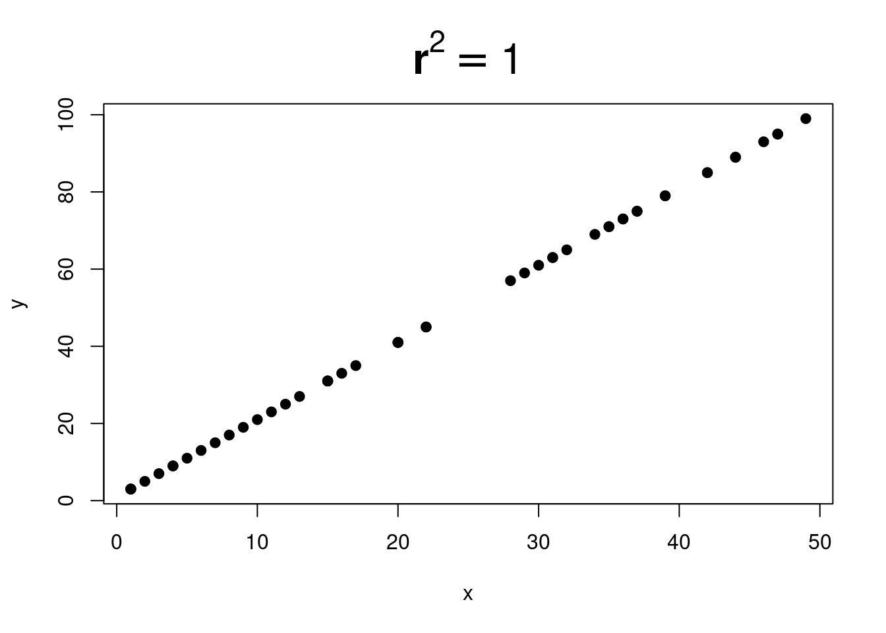
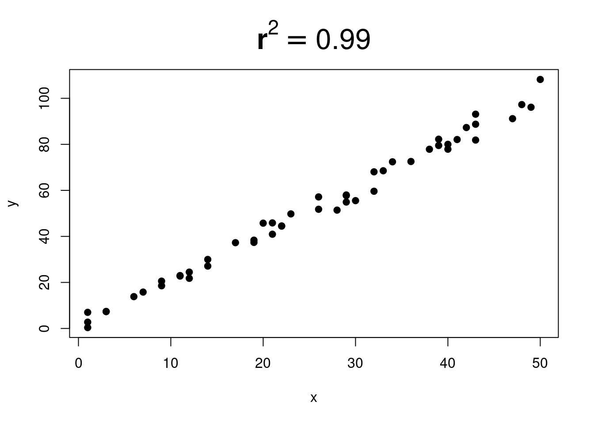
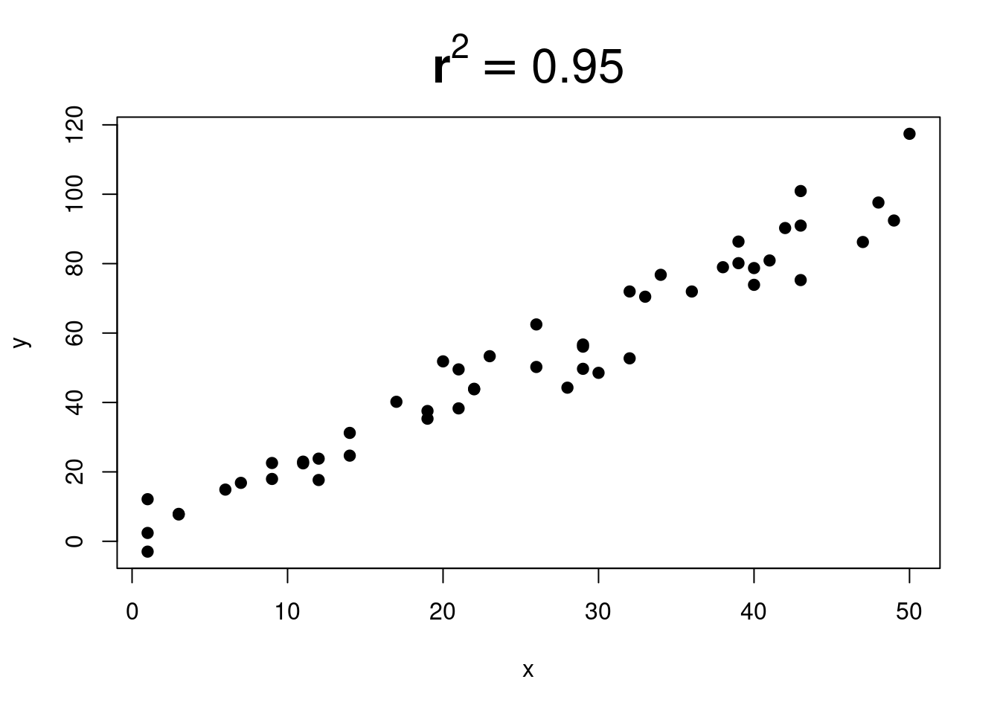
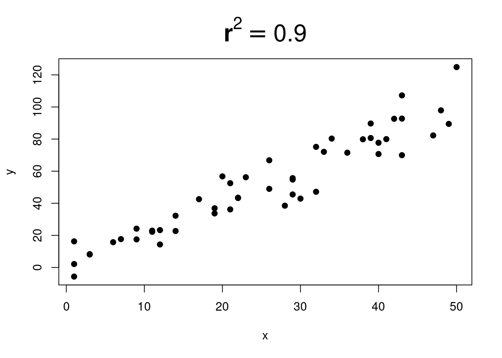
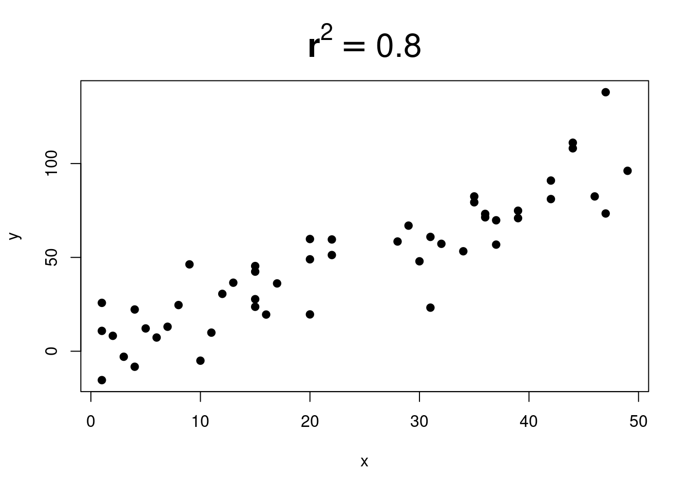
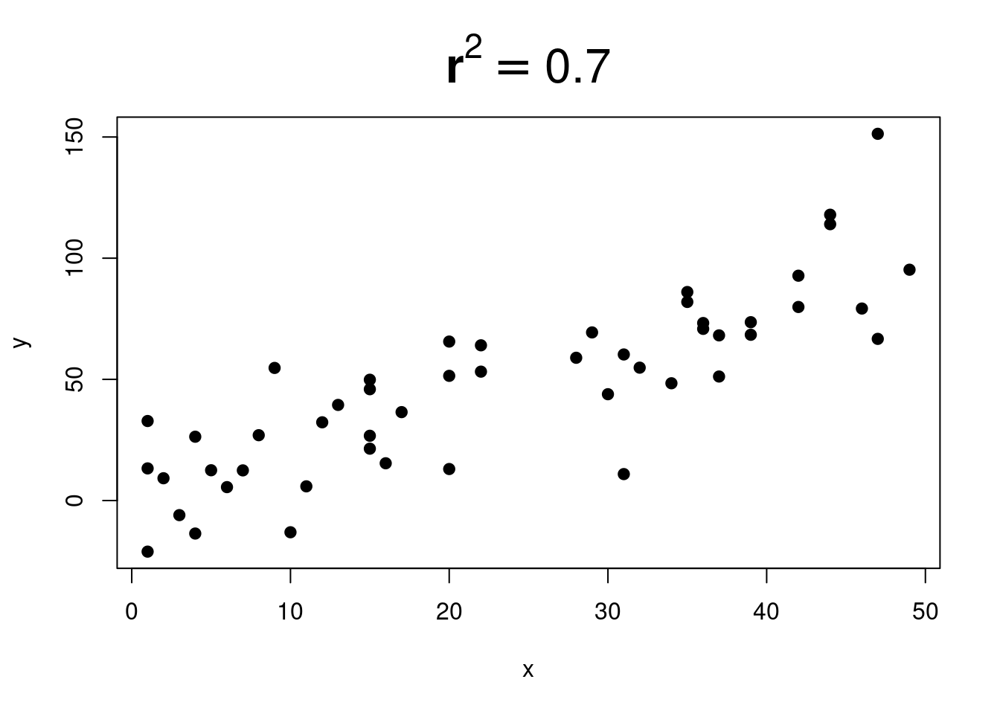
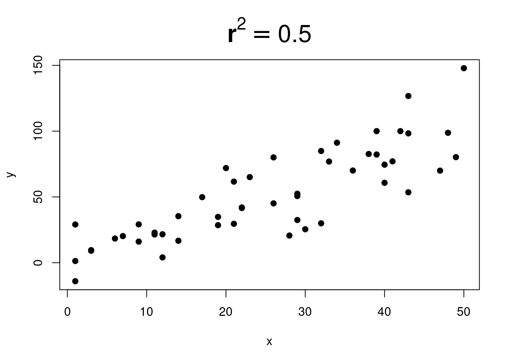
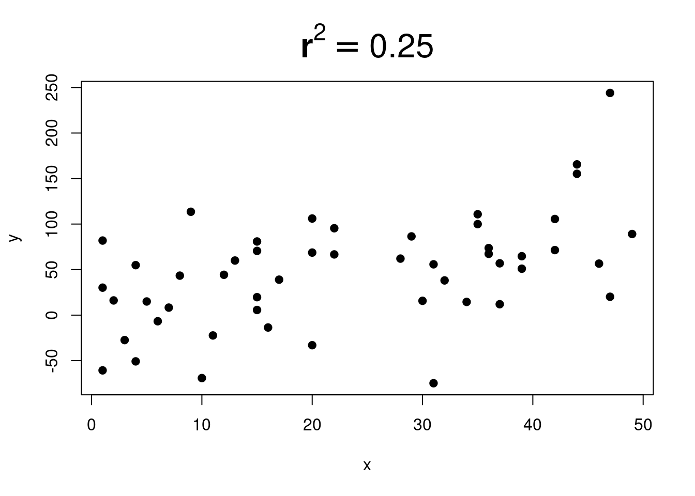
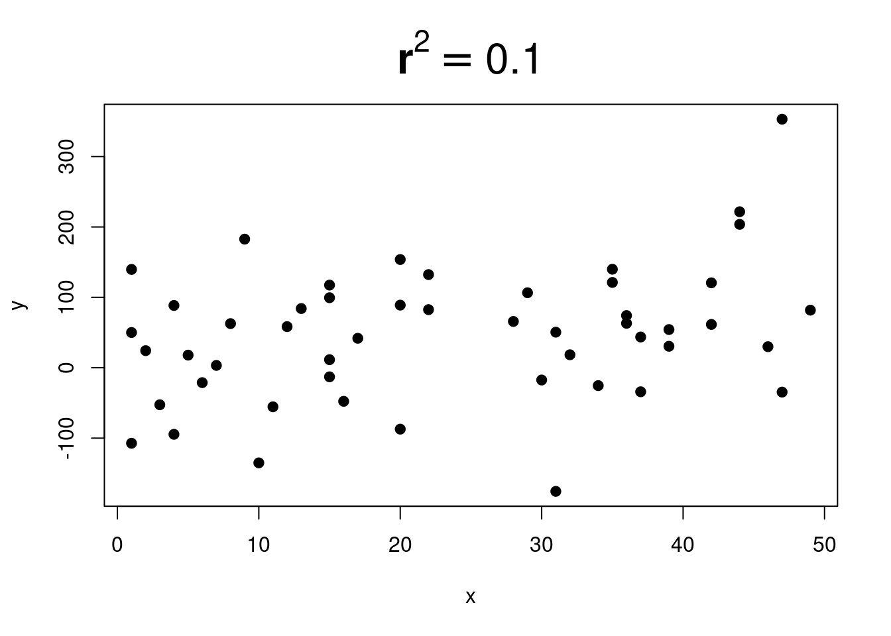

::: {.cell}

:::

::: {.cell}

:::

::: {.cell}

:::

# R-Squared ($r^2$) {#rsquared}

## How Good is the Fit

You might have wondered what $r^2$ tells you in the regression analyses output. It tells you about how tight the fit is for your scatter. 

- If **$r^2 \approx 1.0$**, then all the points will be on a line and their will be **no scatter**.
- If **$r^2 \approx 0.0$**, then you cannot detect where the line would even be. It is **all scatter**. 

The scatter affects the predictability and accuracy of your model. If you are using the regression equation to make predictions, you should be mindful if the $r^2$ is low, and whether or not that will be an issue for your situation. 

The question of whether the $r^2$ is too low depends on the context and the situation. Sometimes it is unacceptable to have a low $r^2$ but sometimes it is fine. 

You will have to look at your situation to decide whether your model provides benefit even if it is not very accurate when it has a low $r^2$.

## $r^2$ Examples 

Here are some pictures that show different $r^2$ values:

::: {.cell}
::: {.cell-output-display}
{width=50%}
:::

::: {.cell-output-display}
{width=50%}
:::
:::

Gradually more and more scatter.

::: {.cell}
::: {.cell-output-display}
{width=50%}
:::

::: {.cell-output-display}
{width=50%}
:::
:::

And more and more... 

::: {.cell}
::: {.cell-output-display}
{width=50%}
:::

::: {.cell-output-display}
{width=50%}
:::
:::

::: {.cell}
::: {.cell-output-display}
{width=50%}
:::

::: {.cell-output-display}
{width=50%}
:::
:::

When $r^2$ is close to $0$, it is very difficult to see any trend:

::: {.cell}
::: {.cell-output-display}
{width=50%}
:::

::: {.cell-output-display}
{width=50%}
:::
:::

## Explained Variation 

$r^2$ is sometimes called the **explained variation**.

This comes from this interpretation:

 - It is the **percent of the variation in y that is explained by using x** (and a linear model)   

The idea is that some of the variation in y can be understood by using a linear regression model, but not all of it. The **explained variation** is just the notion of how good that linear regression model is.

So if you see this:

- **90% of the variation in y is explained by x** you will know that it just means $r^2=.90$
- **45% of the variation in y is explained by x** you will know that it just means $r^2=.45$

We won't use this wording much in this book, but it comes up when people talk about and interpret regression results. 

::: {.cell}

:::

