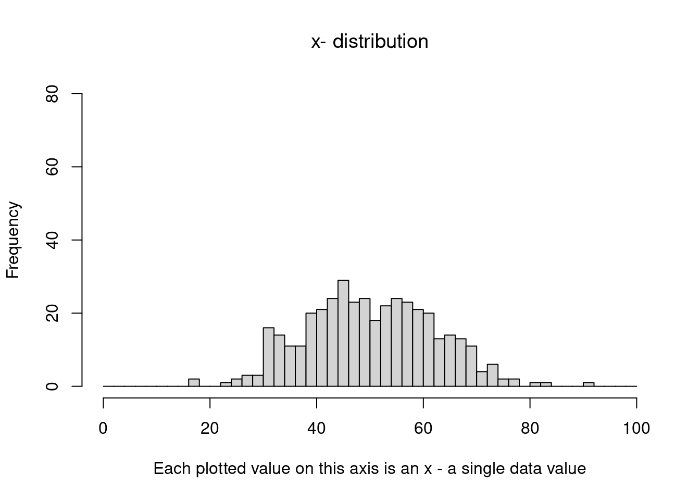
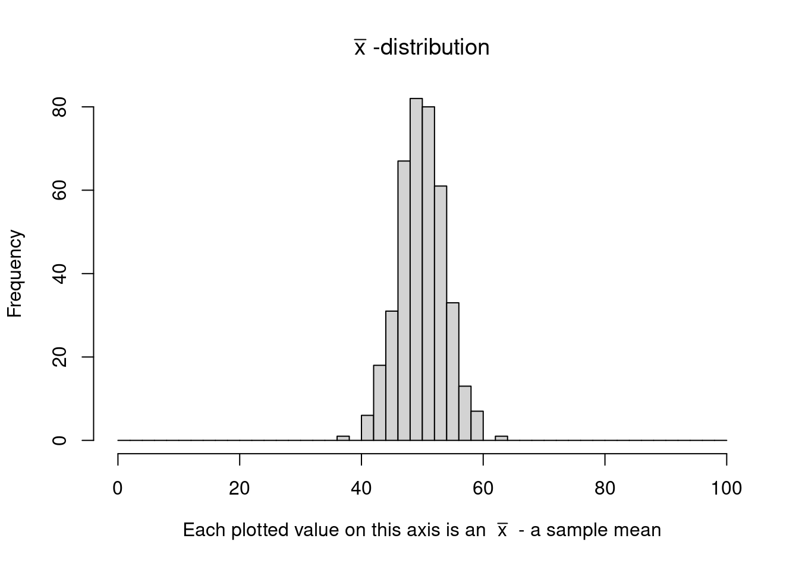
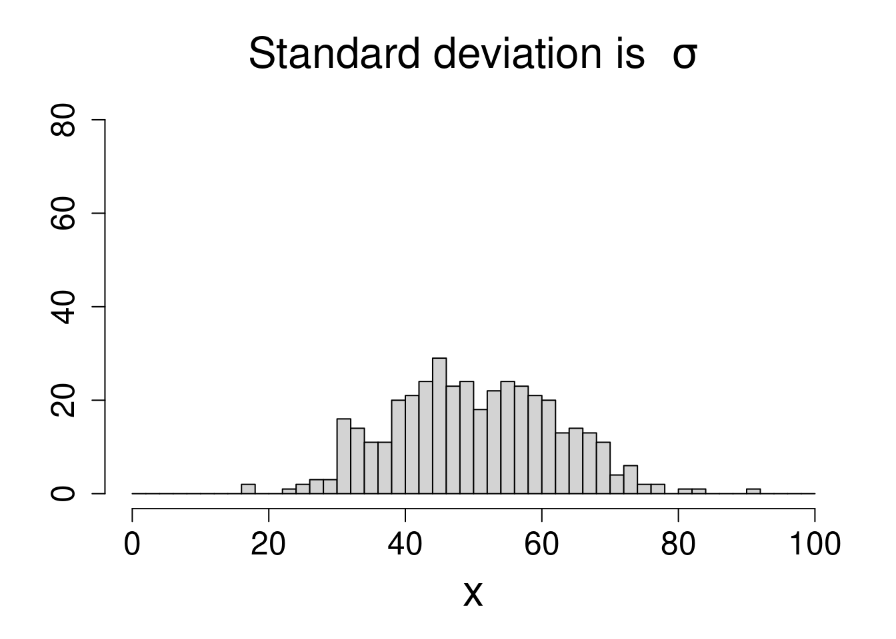
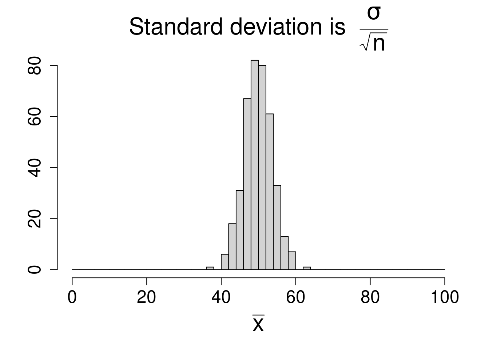

::: {.cell}

:::


# Sampling Distribution of Sample Means {#sample-means-distribution}

## Repeated Sampling For Means

Suppose we start with a population distribution that has a certain population mean $\mu$ and standard deviation $\sigma$. 

There is nothing special about this distribution. For example, it does not have to be normal. It could be. But what we are going to do works for any distribution actually. 

We will call this the **original distribution**, and sometimes we refer to it as the $x$-distribution. 

Then imagine we take samples of a certain size $n$ over and over again,
each time we calculate the sample mean $\bar x$ from our sample.

So we:

- choose a sample and calculate a sample mean $\bar x$
- choose a sample and calculate another sample mean $\bar x$
- choose a sample and calculate another sample mean $\bar x$
- and so on

Usually the sample means are close to the population mean 
but sometimes they are farther away (though this is less likely the farther away we get from the population mean).

**It turns out...**

If we then plot all these sample means on a histogram, we get
something that looks like a normal curve!

This is true if the sample size is big enough even if we start with the original distribution not being normal. 

## Start With An Original Distribution ($x$-distribution)


::: {.cell}

:::


Here we start with an original distribution which is normal (call it the $x$-distribution). It has mean $\mu=50$ and standard deviation of $\sigma = 12$.   

Lets pick some samples from this distribution and plot them so we can get and idea what this distribution looks like. Here is a plot of 400 data values from it:


::: {.cell}
::: {.cell-output-display}
{width=672}
:::
:::


We can see that roughly the standard deviation is about $\sigma=12$. 

You can also see that most of the data is between $\mu-3(\sigma)$ and $\mu+3(\sigma)$, which is the same as $z=-3$ up to $z=+3$:  

Let\'s see what those values are:

- $\mu-3\sigma=50-3(12)=14$ 
- $\mu+3\sigma=50+3(12)=86$

We know this is true for every normal curve actually. Most of the data is within 3 standard deviations of the mean.


::: {.cell}

:::


## Taking Sample Means   

Now we will take samples from this distribution. For each sample we pick 10 data values from the original distribution and and then compute the sample mean $\bar x$ for that sample.     


::: {.cell}
::: {.cell-output-display}


|         |  1|  2|  3|  4|  5|  6|  7|  8|  9| 10|    x̄|
|:--------|--:|--:|--:|--:|--:|--:|--:|--:|--:|--:|----:|
|Sample 1 | 69| 55| 55| 53| 59| 45| 66| 22| 63| 52| 53.9|
|Sample 2 | 36| 52| 20| 44| 56| 47| 54| 60| 48| 55| 47.2|
|Sample 3 | 54| 57| 46| 50| 61| 40| 48| 47| 35| 50| 48.8|
|Sample 4 | 29| 61| 56| 53| 54| 31| 38| 55| 41| 56| 47.4|
|Sample 5 | 50| 54| 47| 51| 63| 62| 35| 55| 64| 45| 52.6|


:::
:::


Suppose we continue and do this 400 times...

Let\'s take a look at the sample means in a histogram:


::: {.cell}
::: {.cell-output-display}
{width=672}
:::
:::


This distribution is called the **$\bar x$-distribution**. or the **sampling distribution of sample means**. 

It is a very important distribution in statistics.

## Sampling Distribution of Sample Means ($\bar x$-distribution) 

One important thing we can see is that the **shape of the $\bar x$-distribution is normal**. 

Next how does it compare to the original $x$-distribution?

Let\'s see the graphs of the original $x$-distribution and the $\bar x$-distribution side by side:


::: {.cell}
::: {.cell-output-display}
{width=50%}
:::

::: {.cell-output-display}
{width=50%}
:::
:::


We can clearly see that the $\bar x$-distribution is not as spread out as the original $x$-distribution. This is because when you take sample means, it averages the data out and when that happens it is more clustered towards the middle. 

In fact this clustering towards the middle is one of the main ideas of the **Central Limit Theorem** below. 

And it turns out that we can tell how \"squished\" the $\bar x$-distribution is...

The squish factor is just given by $\sqrt{n}$: 

$$ 
\text{standard deviation of the }\bar x\text{-distribution} = \frac{\sigma}{\sqrt{n}}
$$

where $\sigma$ is the standard deviation of the original $x$-distribution.

So for example if we took an $\bar x$ using:

 - $n=100$ that would mean the \"squish\" factor is $\sqrt{100}=10$, the spread is reduced by factor of $10$
 - $n=36$ that would mean the \"squish\" factor is $\sqrt{36}=6$, the spread is reduced by factor of $6$

So for the example above that we used the squish factor is:

$$
\sqrt{n} = \sqrt{10}=3.1622777
$$

So the standard deviation of the $\bar x$-distribution is:  

$$
\frac{\sigma}{\sqrt{n}} = 
   \frac{12}{\sqrt{10}} =
   \frac{12}{3.1622777}= 3.7947332
$$

So the $\bar x$-distribution is more concentrated around the center $\mu$

And finally its important to note that **sampling distributions** are made by repeatedly taking samples then computing a statistic, then collecting that data and graphing it in a histogram.

## Central Limit Theorem - Means 

It turns out that this \"normal curve\" shape turns up all the time for
sampling distributions under the right conditions, and that fact is
called the **Central Limit Theorem**.

This is one of the most important results in statistics and basically it
tells us that **we can use a normal distribution to approximate the 
sampling distribution** (the $\bar x$-distribution that is).

This will allow us to calculate areas for the $\bar x$-distribution
by calculating z-values and using a standard normal curve to find areas we want. 
    
:::{#thm-central-limit-theorem-means}
## Central Limit Theorem - Means

::: {.cell}
Suppose we have a large population with population mean $\mu$ and standard deviation $\sigma$ and consider samples of size $n$ from this population.

If $n>30$ or if the population we start with is approximately normal:

- The $\bar x$ distribution is normal
- The mean and standard deviation of the $\bar x$ distribution are
given by these formulas:

$$
\text{mean} = \mu
$$

$$
\text{standard deviation} = \frac{\sigma}{\sqrt{n}}
$$
:::

:::

Note: 

- if the population we start with is approximately normal the result is true for any sample size (even $n \leq 30$). 
- if the population we start with is not approximately normal, we must have $n>30$ for the result to be true.
    
The first bullet point of this theorem means:

- we can use a standard normal table to calculate areas under the $\bar x$-distribution

The second bullet point of the theorem means:

- the $\bar x$-distribution has $\mu$ as its center, and the standard deviation we can compute with the formula in the theorem.

## How to Calculate $\bar x$-distribution Areas 

So to find areas under the $\bar x$-distribution we will just
convert them to areas under a standard normal curve like we did before but this time we will use this formula for the z-scores:

$$
z=\frac{\bar x-\mu}{\frac{\sigma}{\sqrt{n}}}
$$

So just like before we will find **left tails, right tails** and **areas
between** but this time using the z-value formula above.

## Examples of Areas For $\bar x$-distribution

Lets see some examples of computing areas for the $\bar x$-distribution.

First lets see how to compute a left tail area:

:::{#exm-left-tail-area-for-xbar-distribution-when-xbar-equals-210}
## Left tail area for $\bar x$-distribution when $\bar x=210$ $\mu=220$ $\sigma=100$, and $n=10$

::: {.cell}
::: {.cell-output-display}


::: {.cell}

:::


Suppose that a normal distribution has a mean of $220$ and a standard deviation of $100$. If we take samples of size $10$ from this distribution what is the chance that $\bar x$ will be $210$ or less?

**_Solution:_**


::: {.cell}

:::


::: {.cell}

:::


We have $\bar x=210$, $\mu =220$, $\sigma=100$ and $n=10$.

We are interested in how likely it is to get a sample mean $\bar x=210$ or below for the $\bar x$-distribution here.

Here is the $\bar x$-distribution showing the area that we want:    


::: {.cell layout-align="center"}
::: {.cell-output-display}
{fig-align='center' width=288}
:::
:::


Notice:

- The sample mean $\bar x=210$ is at the edge of the shaded region we want to find 
- The population mean $\mu =220$ is in the center

We want the shaded **_left tail area_** that is to the left of $\bar x = 210$:

We will find this area by changing the sample mean $\bar x$ into a z-value and then using standard normal table. 

Lets find the z-value using the form of the z-value formula for the $\bar x$-distribution: 

\begin{equation}
z=\frac{\bar x-\mu}{\frac{\sigma}{\sqrt{n}}}
 =\frac{210-220}{\frac{100}{\sqrt{10}}}
 =\frac{-10}{31.6227766}
 =-0.32 
\end{equation}

Note that we use the $\sqrt{n}$ in the denominator. This is because we are using the $\bar x$-distribution. 

So here is the equivalent left tail area for of $z=-0.32$. 


::: {.cell layout-align="center"}
::: {.cell-output-display}
{fig-align='center' width=288}
:::
:::


This area is the same size as our original area so we just find this one using the standard normal distribution.

We can look up the area in the standard normal z-table using $z=-0.32$  
    
We go to the row that has -0.3 and then to the column that contains .02 and we see this: 


::: {.cell}
::: {.cell-output-display}

```{=html}
<table class="huxtable" data-quarto-disable-processing="true"  style="width: 85%; margin-left: auto; margin-right: auto;">
<col><col><col><col><col><col><col><col><col><col><col><thead>
<tr>
<th class="huxtable-cell huxtable-header" style="text-align: center;  border-style: solid solid solid solid; border-width: 0.5pt 0.5pt 0.5pt 0.5pt; border-top-color: rgb(0, 0, 0);  border-right-color: rgb(0, 0, 0);  border-bottom-color: rgb(0, 0, 0);  border-left-color: rgb(0, 0, 0);      font-size: 11pt;"></th><th class="huxtable-cell huxtable-header" style="text-align: center;  border-style: solid solid solid solid; border-width: 0.5pt 0.5pt 0.5pt 0.5pt; border-top-color: rgb(0, 0, 0);  border-right-color: rgb(0, 0, 0);  border-bottom-color: rgb(0, 0, 0);  border-left-color: rgb(0, 0, 0);      font-size: 11pt;">.00</th><th class="huxtable-cell huxtable-header" style="text-align: center;  border-style: solid solid solid solid; border-width: 0.5pt 0.5pt 0.5pt 0.5pt; border-top-color: rgb(0, 0, 0);  border-right-color: rgb(0, 0, 0);  border-bottom-color: rgb(0, 0, 0);  border-left-color: rgb(0, 0, 0);      font-size: 11pt;">.01</th><th class="huxtable-cell huxtable-header" style="text-align: center;  border-style: solid solid solid solid; border-width: 0.5pt 0.5pt 0.5pt 0.5pt; border-top-color: rgb(0, 0, 0);  border-right-color: rgb(0, 0, 0);  border-bottom-color: rgb(0, 0, 0);  border-left-color: rgb(0, 0, 0);      font-size: 11pt;">.02</th><th class="huxtable-cell huxtable-header" style="text-align: center;  border-style: solid solid solid solid; border-width: 0.5pt 0.5pt 0.5pt 0.5pt; border-top-color: rgb(0, 0, 0);  border-right-color: rgb(0, 0, 0);  border-bottom-color: rgb(0, 0, 0);  border-left-color: rgb(0, 0, 0);      font-size: 11pt;">.03</th><th class="huxtable-cell huxtable-header" style="text-align: center;  border-style: solid solid solid solid; border-width: 0.5pt 0.5pt 0.5pt 0.5pt; border-top-color: rgb(0, 0, 0);  border-right-color: rgb(0, 0, 0);  border-bottom-color: rgb(0, 0, 0);  border-left-color: rgb(0, 0, 0);      font-size: 11pt;">.04</th><th class="huxtable-cell huxtable-header" style="text-align: center;  border-style: solid solid solid solid; border-width: 0.5pt 0.5pt 0.5pt 0.5pt; border-top-color: rgb(0, 0, 0);  border-right-color: rgb(0, 0, 0);  border-bottom-color: rgb(0, 0, 0);  border-left-color: rgb(0, 0, 0);      font-size: 11pt;">.05</th><th class="huxtable-cell huxtable-header" style="text-align: center;  border-style: solid solid solid solid; border-width: 0.5pt 0.5pt 0.5pt 0.5pt; border-top-color: rgb(0, 0, 0);  border-right-color: rgb(0, 0, 0);  border-bottom-color: rgb(0, 0, 0);  border-left-color: rgb(0, 0, 0);      font-size: 11pt;">.06</th><th class="huxtable-cell huxtable-header" style="text-align: center;  border-style: solid solid solid solid; border-width: 0.5pt 0.5pt 0.5pt 0.5pt; border-top-color: rgb(0, 0, 0);  border-right-color: rgb(0, 0, 0);  border-bottom-color: rgb(0, 0, 0);  border-left-color: rgb(0, 0, 0);      font-size: 11pt;">.07</th><th class="huxtable-cell huxtable-header" style="text-align: center;  border-style: solid solid solid solid; border-width: 0.5pt 0.5pt 0.5pt 0.5pt; border-top-color: rgb(0, 0, 0);  border-right-color: rgb(0, 0, 0);  border-bottom-color: rgb(0, 0, 0);  border-left-color: rgb(0, 0, 0);      font-size: 11pt;">.08</th><th class="huxtable-cell huxtable-header" style="text-align: center;  border-style: solid solid solid solid; border-width: 0.5pt 0.5pt 0.5pt 0.5pt; border-top-color: rgb(0, 0, 0);  border-right-color: rgb(0, 0, 0);  border-bottom-color: rgb(0, 0, 0);  border-left-color: rgb(0, 0, 0);      font-size: 11pt;">.09</th></tr>
</thead>
<tbody>
<tr>
<td class="huxtable-cell" style="text-align: center;  border-style: solid solid solid solid; border-width: 0.5pt 0.5pt 0.5pt 0.5pt; border-top-color: rgb(0, 0, 0);  border-right-color: rgb(0, 0, 0);  border-bottom-color: rgb(0, 0, 0);  border-left-color: rgb(0, 0, 0);   font-weight: bold;   font-size: 11pt;">-0.4</td><td class="huxtable-cell" style="text-align: center;  border-style: solid solid solid solid; border-width: 0.5pt 0.5pt 0.5pt 0.5pt; border-top-color: rgb(0, 0, 0);  border-right-color: rgb(0, 0, 0);  border-bottom-color: rgb(0, 0, 0);  border-left-color: rgb(0, 0, 0);      font-size: 11pt;">.3446</td><td class="huxtable-cell" style="text-align: center;  border-style: solid solid solid solid; border-width: 0.5pt 0.5pt 0.5pt 0.5pt; border-top-color: rgb(0, 0, 0);  border-right-color: rgb(0, 0, 0);  border-bottom-color: rgb(0, 0, 0);  border-left-color: rgb(0, 0, 0);      font-size: 11pt;">.3409</td><td class="huxtable-cell" style="text-align: center;  border-style: solid solid solid solid; border-width: 0.5pt 0.5pt 0.5pt 0.5pt; border-top-color: rgb(0, 0, 0);  border-right-color: rgb(0, 0, 0);  border-bottom-color: rgb(0, 0, 0);  border-left-color: rgb(0, 0, 0);  background-color: rgb(204, 204, 204);    font-size: 11pt;">.3372</td><td class="huxtable-cell" style="text-align: center;  border-style: solid solid solid solid; border-width: 0.5pt 0.5pt 0.5pt 0.5pt; border-top-color: rgb(0, 0, 0);  border-right-color: rgb(0, 0, 0);  border-bottom-color: rgb(0, 0, 0);  border-left-color: rgb(0, 0, 0);      font-size: 11pt;">.3336</td><td class="huxtable-cell" style="text-align: center;  border-style: solid solid solid solid; border-width: 0.5pt 0.5pt 0.5pt 0.5pt; border-top-color: rgb(0, 0, 0);  border-right-color: rgb(0, 0, 0);  border-bottom-color: rgb(0, 0, 0);  border-left-color: rgb(0, 0, 0);      font-size: 11pt;">.3300</td><td class="huxtable-cell" style="text-align: center;  border-style: solid solid solid solid; border-width: 0.5pt 0.5pt 0.5pt 0.5pt; border-top-color: rgb(0, 0, 0);  border-right-color: rgb(0, 0, 0);  border-bottom-color: rgb(0, 0, 0);  border-left-color: rgb(0, 0, 0);      font-size: 11pt;">.3264</td><td class="huxtable-cell" style="text-align: center;  border-style: solid solid solid solid; border-width: 0.5pt 0.5pt 0.5pt 0.5pt; border-top-color: rgb(0, 0, 0);  border-right-color: rgb(0, 0, 0);  border-bottom-color: rgb(0, 0, 0);  border-left-color: rgb(0, 0, 0);      font-size: 11pt;">.3228</td><td class="huxtable-cell" style="text-align: center;  border-style: solid solid solid solid; border-width: 0.5pt 0.5pt 0.5pt 0.5pt; border-top-color: rgb(0, 0, 0);  border-right-color: rgb(0, 0, 0);  border-bottom-color: rgb(0, 0, 0);  border-left-color: rgb(0, 0, 0);      font-size: 11pt;">.3192</td><td class="huxtable-cell" style="text-align: center;  border-style: solid solid solid solid; border-width: 0.5pt 0.5pt 0.5pt 0.5pt; border-top-color: rgb(0, 0, 0);  border-right-color: rgb(0, 0, 0);  border-bottom-color: rgb(0, 0, 0);  border-left-color: rgb(0, 0, 0);      font-size: 11pt;">.3156</td><td class="huxtable-cell" style="text-align: center;  border-style: solid solid solid solid; border-width: 0.5pt 0.5pt 0.5pt 0.5pt; border-top-color: rgb(0, 0, 0);  border-right-color: rgb(0, 0, 0);  border-bottom-color: rgb(0, 0, 0);  border-left-color: rgb(0, 0, 0);      font-size: 11pt;">.3121</td></tr>
<tr>
<td class="huxtable-cell" style="text-align: center;  border-style: solid solid solid solid; border-width: 0.5pt 0.5pt 0.5pt 0.5pt; border-top-color: rgb(0, 0, 0);  border-right-color: rgb(0, 0, 0);  border-bottom-color: rgb(0, 0, 0);  border-left-color: rgb(0, 0, 0);   font-weight: bold;   font-size: 11pt;">-0.3</td><td class="huxtable-cell" style="text-align: center;  border-style: solid solid solid solid; border-width: 0.5pt 0.5pt 0.5pt 0.5pt; border-top-color: rgb(0, 0, 0);  border-right-color: rgb(0, 0, 0);  border-bottom-color: rgb(0, 0, 0);  border-left-color: rgb(0, 0, 0);  background-color: rgb(204, 204, 204);    font-size: 11pt;">.3821</td><td class="huxtable-cell" style="text-align: center;  border-style: solid solid solid solid; border-width: 0.5pt 0.5pt 0.5pt 0.5pt; border-top-color: rgb(0, 0, 0);  border-right-color: rgb(0, 0, 0);  border-bottom-color: rgb(0, 0, 0);  border-left-color: rgb(0, 0, 0);  background-color: rgb(204, 204, 204);    font-size: 11pt;">.3783</td><td class="huxtable-cell" style="text-align: center;  border-style: solid solid solid solid; border-width: 0.5pt 0.5pt 0.5pt 0.5pt; border-top-color: rgb(0, 0, 0);  border-right-color: rgb(0, 0, 0);  border-bottom-color: rgb(0, 0, 0);  border-left-color: rgb(0, 0, 0);  background-color: rgb(217, 217, 217); font-weight: bold;   font-size: 11pt;">.3745</td><td class="huxtable-cell" style="text-align: center;  border-style: solid solid solid solid; border-width: 0.5pt 0.5pt 0.5pt 0.5pt; border-top-color: rgb(0, 0, 0);  border-right-color: rgb(0, 0, 0);  border-bottom-color: rgb(0, 0, 0);  border-left-color: rgb(0, 0, 0);      font-size: 11pt;">.3707</td><td class="huxtable-cell" style="text-align: center;  border-style: solid solid solid solid; border-width: 0.5pt 0.5pt 0.5pt 0.5pt; border-top-color: rgb(0, 0, 0);  border-right-color: rgb(0, 0, 0);  border-bottom-color: rgb(0, 0, 0);  border-left-color: rgb(0, 0, 0);      font-size: 11pt;">.3669</td><td class="huxtable-cell" style="text-align: center;  border-style: solid solid solid solid; border-width: 0.5pt 0.5pt 0.5pt 0.5pt; border-top-color: rgb(0, 0, 0);  border-right-color: rgb(0, 0, 0);  border-bottom-color: rgb(0, 0, 0);  border-left-color: rgb(0, 0, 0);      font-size: 11pt;">.3632</td><td class="huxtable-cell" style="text-align: center;  border-style: solid solid solid solid; border-width: 0.5pt 0.5pt 0.5pt 0.5pt; border-top-color: rgb(0, 0, 0);  border-right-color: rgb(0, 0, 0);  border-bottom-color: rgb(0, 0, 0);  border-left-color: rgb(0, 0, 0);      font-size: 11pt;">.3594</td><td class="huxtable-cell" style="text-align: center;  border-style: solid solid solid solid; border-width: 0.5pt 0.5pt 0.5pt 0.5pt; border-top-color: rgb(0, 0, 0);  border-right-color: rgb(0, 0, 0);  border-bottom-color: rgb(0, 0, 0);  border-left-color: rgb(0, 0, 0);      font-size: 11pt;">.3557</td><td class="huxtable-cell" style="text-align: center;  border-style: solid solid solid solid; border-width: 0.5pt 0.5pt 0.5pt 0.5pt; border-top-color: rgb(0, 0, 0);  border-right-color: rgb(0, 0, 0);  border-bottom-color: rgb(0, 0, 0);  border-left-color: rgb(0, 0, 0);      font-size: 11pt;">.3520</td><td class="huxtable-cell" style="text-align: center;  border-style: solid solid solid solid; border-width: 0.5pt 0.5pt 0.5pt 0.5pt; border-top-color: rgb(0, 0, 0);  border-right-color: rgb(0, 0, 0);  border-bottom-color: rgb(0, 0, 0);  border-left-color: rgb(0, 0, 0);      font-size: 11pt;">.3483</td></tr>
<tr>
<td class="huxtable-cell" style="text-align: center;  border-style: solid solid solid solid; border-width: 0.5pt 0.5pt 0.5pt 0.5pt; border-top-color: rgb(0, 0, 0);  border-right-color: rgb(0, 0, 0);  border-bottom-color: rgb(0, 0, 0);  border-left-color: rgb(0, 0, 0);   font-weight: bold;   font-size: 11pt;">-0.2</td><td class="huxtable-cell" style="text-align: center;  border-style: solid solid solid solid; border-width: 0.5pt 0.5pt 0.5pt 0.5pt; border-top-color: rgb(0, 0, 0);  border-right-color: rgb(0, 0, 0);  border-bottom-color: rgb(0, 0, 0);  border-left-color: rgb(0, 0, 0);      font-size: 11pt;">.4207</td><td class="huxtable-cell" style="text-align: center;  border-style: solid solid solid solid; border-width: 0.5pt 0.5pt 0.5pt 0.5pt; border-top-color: rgb(0, 0, 0);  border-right-color: rgb(0, 0, 0);  border-bottom-color: rgb(0, 0, 0);  border-left-color: rgb(0, 0, 0);      font-size: 11pt;">.4168</td><td class="huxtable-cell" style="text-align: center;  border-style: solid solid solid solid; border-width: 0.5pt 0.5pt 0.5pt 0.5pt; border-top-color: rgb(0, 0, 0);  border-right-color: rgb(0, 0, 0);  border-bottom-color: rgb(0, 0, 0);  border-left-color: rgb(0, 0, 0);      font-size: 11pt;">.4129</td><td class="huxtable-cell" style="text-align: center;  border-style: solid solid solid solid; border-width: 0.5pt 0.5pt 0.5pt 0.5pt; border-top-color: rgb(0, 0, 0);  border-right-color: rgb(0, 0, 0);  border-bottom-color: rgb(0, 0, 0);  border-left-color: rgb(0, 0, 0);      font-size: 11pt;">.4090</td><td class="huxtable-cell" style="text-align: center;  border-style: solid solid solid solid; border-width: 0.5pt 0.5pt 0.5pt 0.5pt; border-top-color: rgb(0, 0, 0);  border-right-color: rgb(0, 0, 0);  border-bottom-color: rgb(0, 0, 0);  border-left-color: rgb(0, 0, 0);      font-size: 11pt;">.4052</td><td class="huxtable-cell" style="text-align: center;  border-style: solid solid solid solid; border-width: 0.5pt 0.5pt 0.5pt 0.5pt; border-top-color: rgb(0, 0, 0);  border-right-color: rgb(0, 0, 0);  border-bottom-color: rgb(0, 0, 0);  border-left-color: rgb(0, 0, 0);      font-size: 11pt;">.4013</td><td class="huxtable-cell" style="text-align: center;  border-style: solid solid solid solid; border-width: 0.5pt 0.5pt 0.5pt 0.5pt; border-top-color: rgb(0, 0, 0);  border-right-color: rgb(0, 0, 0);  border-bottom-color: rgb(0, 0, 0);  border-left-color: rgb(0, 0, 0);      font-size: 11pt;">.3974</td><td class="huxtable-cell" style="text-align: center;  border-style: solid solid solid solid; border-width: 0.5pt 0.5pt 0.5pt 0.5pt; border-top-color: rgb(0, 0, 0);  border-right-color: rgb(0, 0, 0);  border-bottom-color: rgb(0, 0, 0);  border-left-color: rgb(0, 0, 0);      font-size: 11pt;">.3936</td><td class="huxtable-cell" style="text-align: center;  border-style: solid solid solid solid; border-width: 0.5pt 0.5pt 0.5pt 0.5pt; border-top-color: rgb(0, 0, 0);  border-right-color: rgb(0, 0, 0);  border-bottom-color: rgb(0, 0, 0);  border-left-color: rgb(0, 0, 0);      font-size: 11pt;">.3897</td><td class="huxtable-cell" style="text-align: center;  border-style: solid solid solid solid; border-width: 0.5pt 0.5pt 0.5pt 0.5pt; border-top-color: rgb(0, 0, 0);  border-right-color: rgb(0, 0, 0);  border-bottom-color: rgb(0, 0, 0);  border-left-color: rgb(0, 0, 0);      font-size: 11pt;">.3859</td></tr>
</tbody>
</table>

```

:::
:::


So that means:

\begin{equation}
\text{left tail area} =0.3745 
\end{equation}

Rounded to the nearest percent this is 37%. This means that the **shaded area corresponds to 37%** of the entire data.

This means there is a 37% chance of getting a sample proportion of $\bar x=210$ or less for the $\bar x$-distribution with sample size of $n=10$.

$$
\tag*{$\blacksquare$}
$$
:::
:::

:::

Now lets see how to compute a right tail area:

:::{#exm-right-tail-area-for-xbar-distribution-when-xbar-equals-80}
## Right tail area for $\bar x$-distribution when $\bar x=80$ $\mu=90$ $\sigma=50$, and $n=20$

::: {.cell}
::: {.cell-output-display}


::: {.cell}

:::


Suppose that a normal distribution has a mean of $90$ and a standard deviation of $50$. If we take samples of size $20$ from this distribution what is the chance that $\bar x$ will be $80$ or more?

**_Solution:_**


::: {.cell}

:::


::: {.cell}

:::


We have $\bar x=80$, $\mu =90$, $\sigma=50$ and $n=20$.

We are interested in how likely it is to get a sample mean $\bar x=80$ or above for the $\bar x$-distribution.

Here is the $\bar x$-distribution showing the area that we want:    


::: {.cell layout-align="center"}
::: {.cell-output-display}
{fig-align='center' width=288}
:::
:::


Notice:

- The sample mean $\bar x=80$ is at the edge of the shaded region we want to find 
- The population mean $\mu =90$ is in the center

We want the shaded **_right tail area_** that is to the right of $\bar x = 80$:

We will find this area by changing the sample mean $\bar x$ into a z-value and then using standard normal table. 

Lets find the z-value using the form of the z-value formula for the $\bar x$-distribution: 

\begin{equation}
z=\frac{\bar x-\mu}{\frac{\sigma}{\sqrt{n}}}
 =\frac{80-90}{\frac{50}{\sqrt{20}}}
 =\frac{-10}{11.1803399}
 =-0.89 
\end{equation}

Note that we use the $\sqrt{n}$ in the denominator. This is because we are using the $\bar x$-distribution. 

So here is the equivalent left tail area for of $z=-0.89$. 


::: {.cell layout-align="center"}
::: {.cell-output-display}
{fig-align='center' width=288}
:::
:::


This area is the same size as our original area so we just find this one using the standard normal distribution.

We can find the right tail area for $z=-0.89$ by finding the left tail area and then subtracting that from 1.0.   
    
So lets look up the left tail area first. Go to the row that has -0.8 and then to the column that contains .09 and we see this: 


::: {.cell}
::: {.cell-output-display}

```{=html}
<table class="huxtable" data-quarto-disable-processing="true"  style="width: 85%; margin-left: auto; margin-right: auto;">
<col><col><col><col><col><col><col><col><col><col><col><thead>
<tr>
<th class="huxtable-cell huxtable-header" style="text-align: center;  border-style: solid solid solid solid; border-width: 0.5pt 0.5pt 0.5pt 0.5pt; border-top-color: rgb(0, 0, 0);  border-right-color: rgb(0, 0, 0);  border-bottom-color: rgb(0, 0, 0);  border-left-color: rgb(0, 0, 0);      font-size: 11pt;"></th><th class="huxtable-cell huxtable-header" style="text-align: center;  border-style: solid solid solid solid; border-width: 0.5pt 0.5pt 0.5pt 0.5pt; border-top-color: rgb(0, 0, 0);  border-right-color: rgb(0, 0, 0);  border-bottom-color: rgb(0, 0, 0);  border-left-color: rgb(0, 0, 0);      font-size: 11pt;">.00</th><th class="huxtable-cell huxtable-header" style="text-align: center;  border-style: solid solid solid solid; border-width: 0.5pt 0.5pt 0.5pt 0.5pt; border-top-color: rgb(0, 0, 0);  border-right-color: rgb(0, 0, 0);  border-bottom-color: rgb(0, 0, 0);  border-left-color: rgb(0, 0, 0);      font-size: 11pt;">.01</th><th class="huxtable-cell huxtable-header" style="text-align: center;  border-style: solid solid solid solid; border-width: 0.5pt 0.5pt 0.5pt 0.5pt; border-top-color: rgb(0, 0, 0);  border-right-color: rgb(0, 0, 0);  border-bottom-color: rgb(0, 0, 0);  border-left-color: rgb(0, 0, 0);      font-size: 11pt;">.02</th><th class="huxtable-cell huxtable-header" style="text-align: center;  border-style: solid solid solid solid; border-width: 0.5pt 0.5pt 0.5pt 0.5pt; border-top-color: rgb(0, 0, 0);  border-right-color: rgb(0, 0, 0);  border-bottom-color: rgb(0, 0, 0);  border-left-color: rgb(0, 0, 0);      font-size: 11pt;">.03</th><th class="huxtable-cell huxtable-header" style="text-align: center;  border-style: solid solid solid solid; border-width: 0.5pt 0.5pt 0.5pt 0.5pt; border-top-color: rgb(0, 0, 0);  border-right-color: rgb(0, 0, 0);  border-bottom-color: rgb(0, 0, 0);  border-left-color: rgb(0, 0, 0);      font-size: 11pt;">.04</th><th class="huxtable-cell huxtable-header" style="text-align: center;  border-style: solid solid solid solid; border-width: 0.5pt 0.5pt 0.5pt 0.5pt; border-top-color: rgb(0, 0, 0);  border-right-color: rgb(0, 0, 0);  border-bottom-color: rgb(0, 0, 0);  border-left-color: rgb(0, 0, 0);      font-size: 11pt;">.05</th><th class="huxtable-cell huxtable-header" style="text-align: center;  border-style: solid solid solid solid; border-width: 0.5pt 0.5pt 0.5pt 0.5pt; border-top-color: rgb(0, 0, 0);  border-right-color: rgb(0, 0, 0);  border-bottom-color: rgb(0, 0, 0);  border-left-color: rgb(0, 0, 0);      font-size: 11pt;">.06</th><th class="huxtable-cell huxtable-header" style="text-align: center;  border-style: solid solid solid solid; border-width: 0.5pt 0.5pt 0.5pt 0.5pt; border-top-color: rgb(0, 0, 0);  border-right-color: rgb(0, 0, 0);  border-bottom-color: rgb(0, 0, 0);  border-left-color: rgb(0, 0, 0);      font-size: 11pt;">.07</th><th class="huxtable-cell huxtable-header" style="text-align: center;  border-style: solid solid solid solid; border-width: 0.5pt 0.5pt 0.5pt 0.5pt; border-top-color: rgb(0, 0, 0);  border-right-color: rgb(0, 0, 0);  border-bottom-color: rgb(0, 0, 0);  border-left-color: rgb(0, 0, 0);      font-size: 11pt;">.08</th><th class="huxtable-cell huxtable-header" style="text-align: center;  border-style: solid solid solid solid; border-width: 0.5pt 0.5pt 0.5pt 0.5pt; border-top-color: rgb(0, 0, 0);  border-right-color: rgb(0, 0, 0);  border-bottom-color: rgb(0, 0, 0);  border-left-color: rgb(0, 0, 0);      font-size: 11pt;">.09</th></tr>
</thead>
<tbody>
<tr>
<td class="huxtable-cell" style="text-align: center;  border-style: solid solid solid solid; border-width: 0.5pt 0.5pt 0.5pt 0.5pt; border-top-color: rgb(0, 0, 0);  border-right-color: rgb(0, 0, 0);  border-bottom-color: rgb(0, 0, 0);  border-left-color: rgb(0, 0, 0);   font-weight: bold;   font-size: 11pt;">-0.9</td><td class="huxtable-cell" style="text-align: center;  border-style: solid solid solid solid; border-width: 0.5pt 0.5pt 0.5pt 0.5pt; border-top-color: rgb(0, 0, 0);  border-right-color: rgb(0, 0, 0);  border-bottom-color: rgb(0, 0, 0);  border-left-color: rgb(0, 0, 0);      font-size: 11pt;">.1841</td><td class="huxtable-cell" style="text-align: center;  border-style: solid solid solid solid; border-width: 0.5pt 0.5pt 0.5pt 0.5pt; border-top-color: rgb(0, 0, 0);  border-right-color: rgb(0, 0, 0);  border-bottom-color: rgb(0, 0, 0);  border-left-color: rgb(0, 0, 0);      font-size: 11pt;">.1814</td><td class="huxtable-cell" style="text-align: center;  border-style: solid solid solid solid; border-width: 0.5pt 0.5pt 0.5pt 0.5pt; border-top-color: rgb(0, 0, 0);  border-right-color: rgb(0, 0, 0);  border-bottom-color: rgb(0, 0, 0);  border-left-color: rgb(0, 0, 0);      font-size: 11pt;">.1788</td><td class="huxtable-cell" style="text-align: center;  border-style: solid solid solid solid; border-width: 0.5pt 0.5pt 0.5pt 0.5pt; border-top-color: rgb(0, 0, 0);  border-right-color: rgb(0, 0, 0);  border-bottom-color: rgb(0, 0, 0);  border-left-color: rgb(0, 0, 0);      font-size: 11pt;">.1762</td><td class="huxtable-cell" style="text-align: center;  border-style: solid solid solid solid; border-width: 0.5pt 0.5pt 0.5pt 0.5pt; border-top-color: rgb(0, 0, 0);  border-right-color: rgb(0, 0, 0);  border-bottom-color: rgb(0, 0, 0);  border-left-color: rgb(0, 0, 0);      font-size: 11pt;">.1736</td><td class="huxtable-cell" style="text-align: center;  border-style: solid solid solid solid; border-width: 0.5pt 0.5pt 0.5pt 0.5pt; border-top-color: rgb(0, 0, 0);  border-right-color: rgb(0, 0, 0);  border-bottom-color: rgb(0, 0, 0);  border-left-color: rgb(0, 0, 0);      font-size: 11pt;">.1711</td><td class="huxtable-cell" style="text-align: center;  border-style: solid solid solid solid; border-width: 0.5pt 0.5pt 0.5pt 0.5pt; border-top-color: rgb(0, 0, 0);  border-right-color: rgb(0, 0, 0);  border-bottom-color: rgb(0, 0, 0);  border-left-color: rgb(0, 0, 0);      font-size: 11pt;">.1685</td><td class="huxtable-cell" style="text-align: center;  border-style: solid solid solid solid; border-width: 0.5pt 0.5pt 0.5pt 0.5pt; border-top-color: rgb(0, 0, 0);  border-right-color: rgb(0, 0, 0);  border-bottom-color: rgb(0, 0, 0);  border-left-color: rgb(0, 0, 0);      font-size: 11pt;">.1660</td><td class="huxtable-cell" style="text-align: center;  border-style: solid solid solid solid; border-width: 0.5pt 0.5pt 0.5pt 0.5pt; border-top-color: rgb(0, 0, 0);  border-right-color: rgb(0, 0, 0);  border-bottom-color: rgb(0, 0, 0);  border-left-color: rgb(0, 0, 0);      font-size: 11pt;">.1635</td><td class="huxtable-cell" style="text-align: center;  border-style: solid solid solid solid; border-width: 0.5pt 0.5pt 0.5pt 0.5pt; border-top-color: rgb(0, 0, 0);  border-right-color: rgb(0, 0, 0);  border-bottom-color: rgb(0, 0, 0);  border-left-color: rgb(0, 0, 0);  background-color: rgb(204, 204, 204);    font-size: 11pt;">.1611</td></tr>
<tr>
<td class="huxtable-cell" style="text-align: center;  border-style: solid solid solid solid; border-width: 0.5pt 0.5pt 0.5pt 0.5pt; border-top-color: rgb(0, 0, 0);  border-right-color: rgb(0, 0, 0);  border-bottom-color: rgb(0, 0, 0);  border-left-color: rgb(0, 0, 0);   font-weight: bold;   font-size: 11pt;">-0.8</td><td class="huxtable-cell" style="text-align: center;  border-style: solid solid solid solid; border-width: 0.5pt 0.5pt 0.5pt 0.5pt; border-top-color: rgb(0, 0, 0);  border-right-color: rgb(0, 0, 0);  border-bottom-color: rgb(0, 0, 0);  border-left-color: rgb(0, 0, 0);  background-color: rgb(204, 204, 204);    font-size: 11pt;">.2119</td><td class="huxtable-cell" style="text-align: center;  border-style: solid solid solid solid; border-width: 0.5pt 0.5pt 0.5pt 0.5pt; border-top-color: rgb(0, 0, 0);  border-right-color: rgb(0, 0, 0);  border-bottom-color: rgb(0, 0, 0);  border-left-color: rgb(0, 0, 0);  background-color: rgb(204, 204, 204);    font-size: 11pt;">.2090</td><td class="huxtable-cell" style="text-align: center;  border-style: solid solid solid solid; border-width: 0.5pt 0.5pt 0.5pt 0.5pt; border-top-color: rgb(0, 0, 0);  border-right-color: rgb(0, 0, 0);  border-bottom-color: rgb(0, 0, 0);  border-left-color: rgb(0, 0, 0);  background-color: rgb(204, 204, 204);    font-size: 11pt;">.2061</td><td class="huxtable-cell" style="text-align: center;  border-style: solid solid solid solid; border-width: 0.5pt 0.5pt 0.5pt 0.5pt; border-top-color: rgb(0, 0, 0);  border-right-color: rgb(0, 0, 0);  border-bottom-color: rgb(0, 0, 0);  border-left-color: rgb(0, 0, 0);  background-color: rgb(204, 204, 204);    font-size: 11pt;">.2033</td><td class="huxtable-cell" style="text-align: center;  border-style: solid solid solid solid; border-width: 0.5pt 0.5pt 0.5pt 0.5pt; border-top-color: rgb(0, 0, 0);  border-right-color: rgb(0, 0, 0);  border-bottom-color: rgb(0, 0, 0);  border-left-color: rgb(0, 0, 0);  background-color: rgb(204, 204, 204);    font-size: 11pt;">.2005</td><td class="huxtable-cell" style="text-align: center;  border-style: solid solid solid solid; border-width: 0.5pt 0.5pt 0.5pt 0.5pt; border-top-color: rgb(0, 0, 0);  border-right-color: rgb(0, 0, 0);  border-bottom-color: rgb(0, 0, 0);  border-left-color: rgb(0, 0, 0);  background-color: rgb(204, 204, 204);    font-size: 11pt;">.1977</td><td class="huxtable-cell" style="text-align: center;  border-style: solid solid solid solid; border-width: 0.5pt 0.5pt 0.5pt 0.5pt; border-top-color: rgb(0, 0, 0);  border-right-color: rgb(0, 0, 0);  border-bottom-color: rgb(0, 0, 0);  border-left-color: rgb(0, 0, 0);  background-color: rgb(204, 204, 204);    font-size: 11pt;">.1949</td><td class="huxtable-cell" style="text-align: center;  border-style: solid solid solid solid; border-width: 0.5pt 0.5pt 0.5pt 0.5pt; border-top-color: rgb(0, 0, 0);  border-right-color: rgb(0, 0, 0);  border-bottom-color: rgb(0, 0, 0);  border-left-color: rgb(0, 0, 0);  background-color: rgb(204, 204, 204);    font-size: 11pt;">.1922</td><td class="huxtable-cell" style="text-align: center;  border-style: solid solid solid solid; border-width: 0.5pt 0.5pt 0.5pt 0.5pt; border-top-color: rgb(0, 0, 0);  border-right-color: rgb(0, 0, 0);  border-bottom-color: rgb(0, 0, 0);  border-left-color: rgb(0, 0, 0);  background-color: rgb(204, 204, 204);    font-size: 11pt;">.1894</td><td class="huxtable-cell" style="text-align: center;  border-style: solid solid solid solid; border-width: 0.5pt 0.5pt 0.5pt 0.5pt; border-top-color: rgb(0, 0, 0);  border-right-color: rgb(0, 0, 0);  border-bottom-color: rgb(0, 0, 0);  border-left-color: rgb(0, 0, 0);  background-color: rgb(217, 217, 217); font-weight: bold;   font-size: 11pt;">.1867</td></tr>
<tr>
<td class="huxtable-cell" style="text-align: center;  border-style: solid solid solid solid; border-width: 0.5pt 0.5pt 0.5pt 0.5pt; border-top-color: rgb(0, 0, 0);  border-right-color: rgb(0, 0, 0);  border-bottom-color: rgb(0, 0, 0);  border-left-color: rgb(0, 0, 0);   font-weight: bold;   font-size: 11pt;">-0.7</td><td class="huxtable-cell" style="text-align: center;  border-style: solid solid solid solid; border-width: 0.5pt 0.5pt 0.5pt 0.5pt; border-top-color: rgb(0, 0, 0);  border-right-color: rgb(0, 0, 0);  border-bottom-color: rgb(0, 0, 0);  border-left-color: rgb(0, 0, 0);      font-size: 11pt;">.2420</td><td class="huxtable-cell" style="text-align: center;  border-style: solid solid solid solid; border-width: 0.5pt 0.5pt 0.5pt 0.5pt; border-top-color: rgb(0, 0, 0);  border-right-color: rgb(0, 0, 0);  border-bottom-color: rgb(0, 0, 0);  border-left-color: rgb(0, 0, 0);      font-size: 11pt;">.2389</td><td class="huxtable-cell" style="text-align: center;  border-style: solid solid solid solid; border-width: 0.5pt 0.5pt 0.5pt 0.5pt; border-top-color: rgb(0, 0, 0);  border-right-color: rgb(0, 0, 0);  border-bottom-color: rgb(0, 0, 0);  border-left-color: rgb(0, 0, 0);      font-size: 11pt;">.2358</td><td class="huxtable-cell" style="text-align: center;  border-style: solid solid solid solid; border-width: 0.5pt 0.5pt 0.5pt 0.5pt; border-top-color: rgb(0, 0, 0);  border-right-color: rgb(0, 0, 0);  border-bottom-color: rgb(0, 0, 0);  border-left-color: rgb(0, 0, 0);      font-size: 11pt;">.2327</td><td class="huxtable-cell" style="text-align: center;  border-style: solid solid solid solid; border-width: 0.5pt 0.5pt 0.5pt 0.5pt; border-top-color: rgb(0, 0, 0);  border-right-color: rgb(0, 0, 0);  border-bottom-color: rgb(0, 0, 0);  border-left-color: rgb(0, 0, 0);      font-size: 11pt;">.2296</td><td class="huxtable-cell" style="text-align: center;  border-style: solid solid solid solid; border-width: 0.5pt 0.5pt 0.5pt 0.5pt; border-top-color: rgb(0, 0, 0);  border-right-color: rgb(0, 0, 0);  border-bottom-color: rgb(0, 0, 0);  border-left-color: rgb(0, 0, 0);      font-size: 11pt;">.2266</td><td class="huxtable-cell" style="text-align: center;  border-style: solid solid solid solid; border-width: 0.5pt 0.5pt 0.5pt 0.5pt; border-top-color: rgb(0, 0, 0);  border-right-color: rgb(0, 0, 0);  border-bottom-color: rgb(0, 0, 0);  border-left-color: rgb(0, 0, 0);      font-size: 11pt;">.2236</td><td class="huxtable-cell" style="text-align: center;  border-style: solid solid solid solid; border-width: 0.5pt 0.5pt 0.5pt 0.5pt; border-top-color: rgb(0, 0, 0);  border-right-color: rgb(0, 0, 0);  border-bottom-color: rgb(0, 0, 0);  border-left-color: rgb(0, 0, 0);      font-size: 11pt;">.2206</td><td class="huxtable-cell" style="text-align: center;  border-style: solid solid solid solid; border-width: 0.5pt 0.5pt 0.5pt 0.5pt; border-top-color: rgb(0, 0, 0);  border-right-color: rgb(0, 0, 0);  border-bottom-color: rgb(0, 0, 0);  border-left-color: rgb(0, 0, 0);      font-size: 11pt;">.2177</td><td class="huxtable-cell" style="text-align: center;  border-style: solid solid solid solid; border-width: 0.5pt 0.5pt 0.5pt 0.5pt; border-top-color: rgb(0, 0, 0);  border-right-color: rgb(0, 0, 0);  border-bottom-color: rgb(0, 0, 0);  border-left-color: rgb(0, 0, 0);      font-size: 11pt;">.2148</td></tr>
</tbody>
</table>

```

:::
:::


So that means:

\begin{equation}
\text{left tail area} =0.1867 
\end{equation}

This means that the right tail that we want to find is going to be this left tail subtracted from 1.0. 


::: {.cell}

:::


\begin{equation}
\text{right tail area} = 1.0 - 0.1867 = 0.8133 
\end{equation}

Rounded to the nearest percent this is 81%. This means the **shaded right tail area corresponds to 81%** of the entire data. 

This means there is a 81% chance of getting a sample mean of $\bar x=80$ or more for this population when using samples of size $n = 20$.

$$
\tag*{$\blacksquare$}
$$
:::
:::

:::

## Applications of Sampling Distribution of Sample Means 

:::{#exm-average-monthly-demand}
## Average Monthly Demand 

::: {.cell}
::: {.cell-output-display}


::: {.cell}

:::


Suppose that monthly demand in units for a retail product is given by a normal distribution that has a mean of $48$ and standard deviation $14$. Find the chance that that the average demand for the next 12 months is $40$ or fewer units.


**_Solution:_**


::: {.cell}

:::


::: {.cell}

:::


::: {.cell}

:::


We have $\bar x=40$, $\mu =48$, $\sigma=14$ and $n=12$.

We are interested in how likely it is to get a sample mean $\bar x=40$ or below for the $\bar x$-distribution here.

Here is the $\bar x$-distribution showing the area that we want:    


::: {.cell layout-align="center"}
::: {.cell-output-display}
{fig-align='center' width=288}
:::
:::


Notice:

- The sample mean $\bar x=40$ is at the edge of the shaded region we want to find 
- The population mean $\mu =48$ is in the center

We want the shaded **_left tail area_** that is to the left of $\bar x = 40$:

We will find this area by changing the sample mean $\bar x$ into a z-value and then using standard normal table. 

Lets find the z-value using the form of the z-value formula for the $\bar x$-distribution: 

\begin{equation}
z=\frac{\bar x-\mu}{\frac{\sigma}{\sqrt{n}}}
 =\frac{40-48}{\frac{14}{\sqrt{12}}}
 =\frac{-8}{4.0414519}
 =-1.98 
\end{equation}

Note that we use the $\sqrt{n}$ in the denominator. This is because we are using the $\bar x$-distribution. 

So here is the equivalent left tail area for of $z=-1.98$. 


::: {.cell layout-align="center"}
::: {.cell-output-display}
{fig-align='center' width=288}
:::
:::


This area is the same size as our original area so we just find this one using the standard normal distribution.

We can look up the area in the standard normal z-table using $z=-1.98$  
    
We go to the row that has -1.9 and then to the column that contains .08 and we see this: 


::: {.cell}
::: {.cell-output-display}

```{=html}
<table class="huxtable" data-quarto-disable-processing="true"  style="width: 85%; margin-left: auto; margin-right: auto;">
<col><col><col><col><col><col><col><col><col><col><col><thead>
<tr>
<th class="huxtable-cell huxtable-header" style="text-align: center;  border-style: solid solid solid solid; border-width: 0.5pt 0.5pt 0.5pt 0.5pt; border-top-color: rgb(0, 0, 0);  border-right-color: rgb(0, 0, 0);  border-bottom-color: rgb(0, 0, 0);  border-left-color: rgb(0, 0, 0);      font-size: 11pt;"></th><th class="huxtable-cell huxtable-header" style="text-align: center;  border-style: solid solid solid solid; border-width: 0.5pt 0.5pt 0.5pt 0.5pt; border-top-color: rgb(0, 0, 0);  border-right-color: rgb(0, 0, 0);  border-bottom-color: rgb(0, 0, 0);  border-left-color: rgb(0, 0, 0);      font-size: 11pt;">.00</th><th class="huxtable-cell huxtable-header" style="text-align: center;  border-style: solid solid solid solid; border-width: 0.5pt 0.5pt 0.5pt 0.5pt; border-top-color: rgb(0, 0, 0);  border-right-color: rgb(0, 0, 0);  border-bottom-color: rgb(0, 0, 0);  border-left-color: rgb(0, 0, 0);      font-size: 11pt;">.01</th><th class="huxtable-cell huxtable-header" style="text-align: center;  border-style: solid solid solid solid; border-width: 0.5pt 0.5pt 0.5pt 0.5pt; border-top-color: rgb(0, 0, 0);  border-right-color: rgb(0, 0, 0);  border-bottom-color: rgb(0, 0, 0);  border-left-color: rgb(0, 0, 0);      font-size: 11pt;">.02</th><th class="huxtable-cell huxtable-header" style="text-align: center;  border-style: solid solid solid solid; border-width: 0.5pt 0.5pt 0.5pt 0.5pt; border-top-color: rgb(0, 0, 0);  border-right-color: rgb(0, 0, 0);  border-bottom-color: rgb(0, 0, 0);  border-left-color: rgb(0, 0, 0);      font-size: 11pt;">.03</th><th class="huxtable-cell huxtable-header" style="text-align: center;  border-style: solid solid solid solid; border-width: 0.5pt 0.5pt 0.5pt 0.5pt; border-top-color: rgb(0, 0, 0);  border-right-color: rgb(0, 0, 0);  border-bottom-color: rgb(0, 0, 0);  border-left-color: rgb(0, 0, 0);      font-size: 11pt;">.04</th><th class="huxtable-cell huxtable-header" style="text-align: center;  border-style: solid solid solid solid; border-width: 0.5pt 0.5pt 0.5pt 0.5pt; border-top-color: rgb(0, 0, 0);  border-right-color: rgb(0, 0, 0);  border-bottom-color: rgb(0, 0, 0);  border-left-color: rgb(0, 0, 0);      font-size: 11pt;">.05</th><th class="huxtable-cell huxtable-header" style="text-align: center;  border-style: solid solid solid solid; border-width: 0.5pt 0.5pt 0.5pt 0.5pt; border-top-color: rgb(0, 0, 0);  border-right-color: rgb(0, 0, 0);  border-bottom-color: rgb(0, 0, 0);  border-left-color: rgb(0, 0, 0);      font-size: 11pt;">.06</th><th class="huxtable-cell huxtable-header" style="text-align: center;  border-style: solid solid solid solid; border-width: 0.5pt 0.5pt 0.5pt 0.5pt; border-top-color: rgb(0, 0, 0);  border-right-color: rgb(0, 0, 0);  border-bottom-color: rgb(0, 0, 0);  border-left-color: rgb(0, 0, 0);      font-size: 11pt;">.07</th><th class="huxtable-cell huxtable-header" style="text-align: center;  border-style: solid solid solid solid; border-width: 0.5pt 0.5pt 0.5pt 0.5pt; border-top-color: rgb(0, 0, 0);  border-right-color: rgb(0, 0, 0);  border-bottom-color: rgb(0, 0, 0);  border-left-color: rgb(0, 0, 0);      font-size: 11pt;">.08</th><th class="huxtable-cell huxtable-header" style="text-align: center;  border-style: solid solid solid solid; border-width: 0.5pt 0.5pt 0.5pt 0.5pt; border-top-color: rgb(0, 0, 0);  border-right-color: rgb(0, 0, 0);  border-bottom-color: rgb(0, 0, 0);  border-left-color: rgb(0, 0, 0);      font-size: 11pt;">.09</th></tr>
</thead>
<tbody>
<tr>
<td class="huxtable-cell" style="text-align: center;  border-style: solid solid solid solid; border-width: 0.5pt 0.5pt 0.5pt 0.5pt; border-top-color: rgb(0, 0, 0);  border-right-color: rgb(0, 0, 0);  border-bottom-color: rgb(0, 0, 0);  border-left-color: rgb(0, 0, 0);   font-weight: bold;   font-size: 11pt;">-2.0</td><td class="huxtable-cell" style="text-align: center;  border-style: solid solid solid solid; border-width: 0.5pt 0.5pt 0.5pt 0.5pt; border-top-color: rgb(0, 0, 0);  border-right-color: rgb(0, 0, 0);  border-bottom-color: rgb(0, 0, 0);  border-left-color: rgb(0, 0, 0);      font-size: 11pt;">.0228</td><td class="huxtable-cell" style="text-align: center;  border-style: solid solid solid solid; border-width: 0.5pt 0.5pt 0.5pt 0.5pt; border-top-color: rgb(0, 0, 0);  border-right-color: rgb(0, 0, 0);  border-bottom-color: rgb(0, 0, 0);  border-left-color: rgb(0, 0, 0);      font-size: 11pt;">.0222</td><td class="huxtable-cell" style="text-align: center;  border-style: solid solid solid solid; border-width: 0.5pt 0.5pt 0.5pt 0.5pt; border-top-color: rgb(0, 0, 0);  border-right-color: rgb(0, 0, 0);  border-bottom-color: rgb(0, 0, 0);  border-left-color: rgb(0, 0, 0);      font-size: 11pt;">.0217</td><td class="huxtable-cell" style="text-align: center;  border-style: solid solid solid solid; border-width: 0.5pt 0.5pt 0.5pt 0.5pt; border-top-color: rgb(0, 0, 0);  border-right-color: rgb(0, 0, 0);  border-bottom-color: rgb(0, 0, 0);  border-left-color: rgb(0, 0, 0);      font-size: 11pt;">.0212</td><td class="huxtable-cell" style="text-align: center;  border-style: solid solid solid solid; border-width: 0.5pt 0.5pt 0.5pt 0.5pt; border-top-color: rgb(0, 0, 0);  border-right-color: rgb(0, 0, 0);  border-bottom-color: rgb(0, 0, 0);  border-left-color: rgb(0, 0, 0);      font-size: 11pt;">.0207</td><td class="huxtable-cell" style="text-align: center;  border-style: solid solid solid solid; border-width: 0.5pt 0.5pt 0.5pt 0.5pt; border-top-color: rgb(0, 0, 0);  border-right-color: rgb(0, 0, 0);  border-bottom-color: rgb(0, 0, 0);  border-left-color: rgb(0, 0, 0);      font-size: 11pt;">.0202</td><td class="huxtable-cell" style="text-align: center;  border-style: solid solid solid solid; border-width: 0.5pt 0.5pt 0.5pt 0.5pt; border-top-color: rgb(0, 0, 0);  border-right-color: rgb(0, 0, 0);  border-bottom-color: rgb(0, 0, 0);  border-left-color: rgb(0, 0, 0);      font-size: 11pt;">.0197</td><td class="huxtable-cell" style="text-align: center;  border-style: solid solid solid solid; border-width: 0.5pt 0.5pt 0.5pt 0.5pt; border-top-color: rgb(0, 0, 0);  border-right-color: rgb(0, 0, 0);  border-bottom-color: rgb(0, 0, 0);  border-left-color: rgb(0, 0, 0);      font-size: 11pt;">.0192</td><td class="huxtable-cell" style="text-align: center;  border-style: solid solid solid solid; border-width: 0.5pt 0.5pt 0.5pt 0.5pt; border-top-color: rgb(0, 0, 0);  border-right-color: rgb(0, 0, 0);  border-bottom-color: rgb(0, 0, 0);  border-left-color: rgb(0, 0, 0);  background-color: rgb(204, 204, 204);    font-size: 11pt;">.0188</td><td class="huxtable-cell" style="text-align: center;  border-style: solid solid solid solid; border-width: 0.5pt 0.5pt 0.5pt 0.5pt; border-top-color: rgb(0, 0, 0);  border-right-color: rgb(0, 0, 0);  border-bottom-color: rgb(0, 0, 0);  border-left-color: rgb(0, 0, 0);      font-size: 11pt;">.0183</td></tr>
<tr>
<td class="huxtable-cell" style="text-align: center;  border-style: solid solid solid solid; border-width: 0.5pt 0.5pt 0.5pt 0.5pt; border-top-color: rgb(0, 0, 0);  border-right-color: rgb(0, 0, 0);  border-bottom-color: rgb(0, 0, 0);  border-left-color: rgb(0, 0, 0);   font-weight: bold;   font-size: 11pt;">-1.9</td><td class="huxtable-cell" style="text-align: center;  border-style: solid solid solid solid; border-width: 0.5pt 0.5pt 0.5pt 0.5pt; border-top-color: rgb(0, 0, 0);  border-right-color: rgb(0, 0, 0);  border-bottom-color: rgb(0, 0, 0);  border-left-color: rgb(0, 0, 0);  background-color: rgb(204, 204, 204);    font-size: 11pt;">.0287</td><td class="huxtable-cell" style="text-align: center;  border-style: solid solid solid solid; border-width: 0.5pt 0.5pt 0.5pt 0.5pt; border-top-color: rgb(0, 0, 0);  border-right-color: rgb(0, 0, 0);  border-bottom-color: rgb(0, 0, 0);  border-left-color: rgb(0, 0, 0);  background-color: rgb(204, 204, 204);    font-size: 11pt;">.0281</td><td class="huxtable-cell" style="text-align: center;  border-style: solid solid solid solid; border-width: 0.5pt 0.5pt 0.5pt 0.5pt; border-top-color: rgb(0, 0, 0);  border-right-color: rgb(0, 0, 0);  border-bottom-color: rgb(0, 0, 0);  border-left-color: rgb(0, 0, 0);  background-color: rgb(204, 204, 204);    font-size: 11pt;">.0274</td><td class="huxtable-cell" style="text-align: center;  border-style: solid solid solid solid; border-width: 0.5pt 0.5pt 0.5pt 0.5pt; border-top-color: rgb(0, 0, 0);  border-right-color: rgb(0, 0, 0);  border-bottom-color: rgb(0, 0, 0);  border-left-color: rgb(0, 0, 0);  background-color: rgb(204, 204, 204);    font-size: 11pt;">.0268</td><td class="huxtable-cell" style="text-align: center;  border-style: solid solid solid solid; border-width: 0.5pt 0.5pt 0.5pt 0.5pt; border-top-color: rgb(0, 0, 0);  border-right-color: rgb(0, 0, 0);  border-bottom-color: rgb(0, 0, 0);  border-left-color: rgb(0, 0, 0);  background-color: rgb(204, 204, 204);    font-size: 11pt;">.0262</td><td class="huxtable-cell" style="text-align: center;  border-style: solid solid solid solid; border-width: 0.5pt 0.5pt 0.5pt 0.5pt; border-top-color: rgb(0, 0, 0);  border-right-color: rgb(0, 0, 0);  border-bottom-color: rgb(0, 0, 0);  border-left-color: rgb(0, 0, 0);  background-color: rgb(204, 204, 204);    font-size: 11pt;">.0256</td><td class="huxtable-cell" style="text-align: center;  border-style: solid solid solid solid; border-width: 0.5pt 0.5pt 0.5pt 0.5pt; border-top-color: rgb(0, 0, 0);  border-right-color: rgb(0, 0, 0);  border-bottom-color: rgb(0, 0, 0);  border-left-color: rgb(0, 0, 0);  background-color: rgb(204, 204, 204);    font-size: 11pt;">.0250</td><td class="huxtable-cell" style="text-align: center;  border-style: solid solid solid solid; border-width: 0.5pt 0.5pt 0.5pt 0.5pt; border-top-color: rgb(0, 0, 0);  border-right-color: rgb(0, 0, 0);  border-bottom-color: rgb(0, 0, 0);  border-left-color: rgb(0, 0, 0);  background-color: rgb(204, 204, 204);    font-size: 11pt;">.0244</td><td class="huxtable-cell" style="text-align: center;  border-style: solid solid solid solid; border-width: 0.5pt 0.5pt 0.5pt 0.5pt; border-top-color: rgb(0, 0, 0);  border-right-color: rgb(0, 0, 0);  border-bottom-color: rgb(0, 0, 0);  border-left-color: rgb(0, 0, 0);  background-color: rgb(217, 217, 217); font-weight: bold;   font-size: 11pt;">.0239</td><td class="huxtable-cell" style="text-align: center;  border-style: solid solid solid solid; border-width: 0.5pt 0.5pt 0.5pt 0.5pt; border-top-color: rgb(0, 0, 0);  border-right-color: rgb(0, 0, 0);  border-bottom-color: rgb(0, 0, 0);  border-left-color: rgb(0, 0, 0);      font-size: 11pt;">.0233</td></tr>
<tr>
<td class="huxtable-cell" style="text-align: center;  border-style: solid solid solid solid; border-width: 0.5pt 0.5pt 0.5pt 0.5pt; border-top-color: rgb(0, 0, 0);  border-right-color: rgb(0, 0, 0);  border-bottom-color: rgb(0, 0, 0);  border-left-color: rgb(0, 0, 0);   font-weight: bold;   font-size: 11pt;">-1.8</td><td class="huxtable-cell" style="text-align: center;  border-style: solid solid solid solid; border-width: 0.5pt 0.5pt 0.5pt 0.5pt; border-top-color: rgb(0, 0, 0);  border-right-color: rgb(0, 0, 0);  border-bottom-color: rgb(0, 0, 0);  border-left-color: rgb(0, 0, 0);      font-size: 11pt;">.0359</td><td class="huxtable-cell" style="text-align: center;  border-style: solid solid solid solid; border-width: 0.5pt 0.5pt 0.5pt 0.5pt; border-top-color: rgb(0, 0, 0);  border-right-color: rgb(0, 0, 0);  border-bottom-color: rgb(0, 0, 0);  border-left-color: rgb(0, 0, 0);      font-size: 11pt;">.0351</td><td class="huxtable-cell" style="text-align: center;  border-style: solid solid solid solid; border-width: 0.5pt 0.5pt 0.5pt 0.5pt; border-top-color: rgb(0, 0, 0);  border-right-color: rgb(0, 0, 0);  border-bottom-color: rgb(0, 0, 0);  border-left-color: rgb(0, 0, 0);      font-size: 11pt;">.0344</td><td class="huxtable-cell" style="text-align: center;  border-style: solid solid solid solid; border-width: 0.5pt 0.5pt 0.5pt 0.5pt; border-top-color: rgb(0, 0, 0);  border-right-color: rgb(0, 0, 0);  border-bottom-color: rgb(0, 0, 0);  border-left-color: rgb(0, 0, 0);      font-size: 11pt;">.0336</td><td class="huxtable-cell" style="text-align: center;  border-style: solid solid solid solid; border-width: 0.5pt 0.5pt 0.5pt 0.5pt; border-top-color: rgb(0, 0, 0);  border-right-color: rgb(0, 0, 0);  border-bottom-color: rgb(0, 0, 0);  border-left-color: rgb(0, 0, 0);      font-size: 11pt;">.0329</td><td class="huxtable-cell" style="text-align: center;  border-style: solid solid solid solid; border-width: 0.5pt 0.5pt 0.5pt 0.5pt; border-top-color: rgb(0, 0, 0);  border-right-color: rgb(0, 0, 0);  border-bottom-color: rgb(0, 0, 0);  border-left-color: rgb(0, 0, 0);      font-size: 11pt;">.0322</td><td class="huxtable-cell" style="text-align: center;  border-style: solid solid solid solid; border-width: 0.5pt 0.5pt 0.5pt 0.5pt; border-top-color: rgb(0, 0, 0);  border-right-color: rgb(0, 0, 0);  border-bottom-color: rgb(0, 0, 0);  border-left-color: rgb(0, 0, 0);      font-size: 11pt;">.0314</td><td class="huxtable-cell" style="text-align: center;  border-style: solid solid solid solid; border-width: 0.5pt 0.5pt 0.5pt 0.5pt; border-top-color: rgb(0, 0, 0);  border-right-color: rgb(0, 0, 0);  border-bottom-color: rgb(0, 0, 0);  border-left-color: rgb(0, 0, 0);      font-size: 11pt;">.0307</td><td class="huxtable-cell" style="text-align: center;  border-style: solid solid solid solid; border-width: 0.5pt 0.5pt 0.5pt 0.5pt; border-top-color: rgb(0, 0, 0);  border-right-color: rgb(0, 0, 0);  border-bottom-color: rgb(0, 0, 0);  border-left-color: rgb(0, 0, 0);      font-size: 11pt;">.0301</td><td class="huxtable-cell" style="text-align: center;  border-style: solid solid solid solid; border-width: 0.5pt 0.5pt 0.5pt 0.5pt; border-top-color: rgb(0, 0, 0);  border-right-color: rgb(0, 0, 0);  border-bottom-color: rgb(0, 0, 0);  border-left-color: rgb(0, 0, 0);      font-size: 11pt;">.0294</td></tr>
</tbody>
</table>

```

:::
:::


So that means:

\begin{equation}
\text{left tail area} =0.0239 
\end{equation}

Rounded to the nearest percent this is 2%. This means that the **shaded area corresponds to 2%** of the entire data.

This means there is a 2% chance of getting a sample proportion of $\bar x=40$ or less for the $\bar x$-distribution with sample size of $n=12$.
This is the chance the average demand for the next year is $40$ or less.

$$
\tag*{$\blacksquare$}
$$
:::
:::

:::

