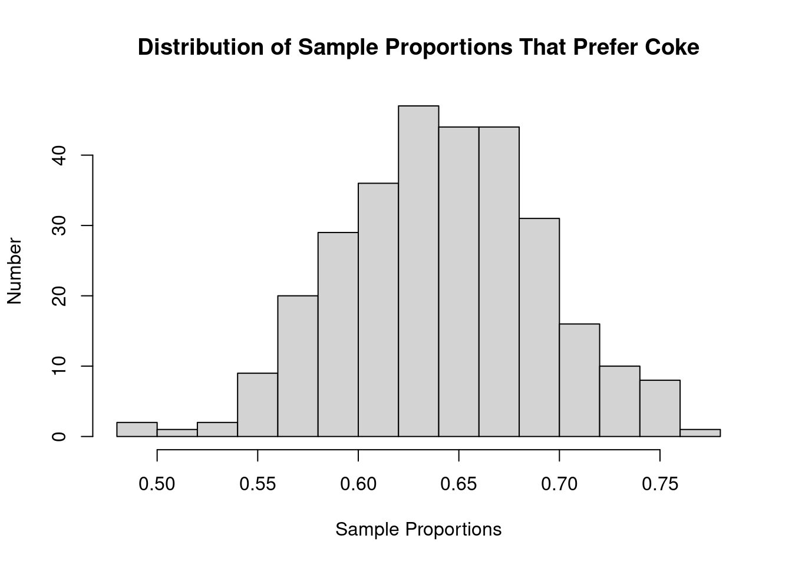
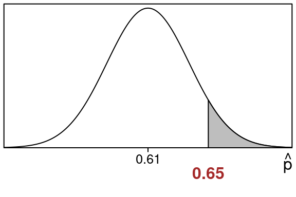
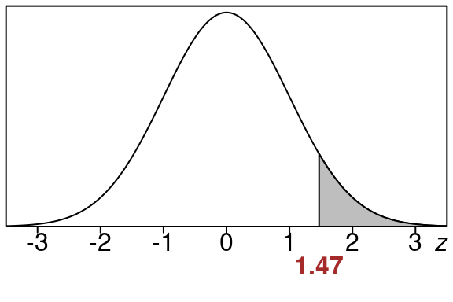

::: {.cell}

:::


# Sampling Distribution of Sample Proportions {#sample-proportions-distribution}

## Repeated Sampling For Proportions

Suppose we start with a population that has a certain population proportion $p$.

Then imagine we take samples of a certain size $n$ over and over again,
each time we calculate the sample proportion $\hat p$.

So we:

- choose a sample and calculate a sample proportion $\hat p$
- choose a sample and calculate another sample proportion $\hat p$
- choose a sample and calculate another sample proportion $\hat p$
- and so on

Usually the sample proportions are close to the population proportion $p$ but sometimes they are farther away (though this is less likely the farther away we get from the population proportion).

**It turns out...**

If we then plot all these sample proportions on a histogram, we get
something that looks like a normal curve!

## Coke vs Pepsi Example

Lets show this with a made up example.


::: {.cell}

:::


Suppose the population proportion of students that prefer coke to pepsi is $p=0.65$. 

This means for the whole student population:

- 65\% prefer coke
- 35\% prefer pepsi 

(We don't allow choosing neither as an answer here...its binary)

Suppose we take samples of size $n=100$ students with the following results:

- The first sample has $\hat p = 0.67$ prefer coke
- The second sample has $\hat p = 0.66$ prefer coke
- The third sample  has $\hat p = 0.57$  prefer coke
- and so on

Here are the sample proportions that we get for the first 50 samples:


::: {.cell}
::: {.cell-output-display}


|     |     |     |     |     |     |     |     |     |     |
|----:|----:|----:|----:|----:|----:|----:|----:|----:|----:|
| 0.67| 0.66| 0.57| 0.69| 0.67| 0.60| 0.71| 0.78| 0.62| 0.65|
| 0.66| 0.76| 0.63| 0.64| 0.57| 0.65| 0.66| 0.75| 0.61| 0.61|
| 0.62| 0.66| 0.67| 0.66| 0.63| 0.68| 0.68| 0.61| 0.62| 0.70|
| 0.71| 0.66| 0.64| 0.64| 0.63| 0.70| 0.62| 0.73| 0.56| 0.66|
| 0.66| 0.62| 0.68| 0.72| 0.64| 0.64| 0.64| 0.63| 0.70| 0.64|


:::
:::


Suppose we continue and do this 300 times...

Finally let's plot all of these sample proportions together in a histogram:


::: {.cell}
::: {.cell-output-display}
{width=672}
:::
:::


We can see that the **shape of the distribution is normal**

## Sampling Distribution of Sample Proportions  

This distribution of the sample proportions is called the **sampling
distribution of sample proportions** or the **$\hat p$-distribution**.

**Sampling distributions** are made by repeatedly taking samples then
computing a statistic, then collecting that data and graphing it in a histogram.

## Central Limit Theorem - Proportions 

It turns out that this "normal curve" shape turns up all the time for
sampling distributions under the right conditions, and that fact is
called the **Central Limit Theorem**.

This is one of the most important results in statistics and basically it
tells us that **we can use a normal distribution to approximate the 
sampling distribution** (the $\hat p$-distribution that is).

This will allow us to calculate areas for the $\widehat{p}$ distribution
by calculating z-values and using a standard normal curve to find areas we want. 
    
:::{#thm-central-limit-theorem}
## Central Limit Theorem-Proportions

::: {.cell}
When we use a large population with a population proportion of $p$
and consider samples of size n from this population

- The $\hat p$ distribution is approximately normal, becoming more and more accurate as n is larger  
- The mean and standard deviation of the $\hat p$ distribution are
given by these formulas:

$$
\text{mean} = p
$$

$$
\text{standard deviation} = \sqrt{\frac{p(1-p)}{n}}
$$

- For the above to be valid must have $n(p)>5$ and $n(1-p)>5$.
:::

:::
    
The first bullet point of this theorem says:

- we can use a standard normal table to calculate areas under the $\widehat{p}$-distribution

The second bullet point says:

- the $\widehat{p}$-distribution has $p$ as the center of it, and the standard deviation we can compute with the formula in the theorem.

The third bullet point says:

- You have to compute $n(p)$ and $n(1-p)$ and make sure they are at least $5$. Otherwise you cannot use this approach.

## How to Calculate $\hat p$-distribution Areas 

So to find areas under the $\widehat{p}$ distribution we will just
convert them to areas under a standard normal curve like we did before but this time we will use this formula for the z-scores:

$$
z=\frac{\hat p-p}{\sqrt{\frac{(1-p)(p)}{n}}}
$$

So just like before we will find **left tails, right tails** and **areas
between** but this time using the z-value formula above.

## Examples of Areas For $\hat p$-distribution

Lets see some examples of computing areas for the $\hat p$-distribution.

First lets see how to compute a left tail area:

:::{#exm-left-tail-area-for-p-hat-distribution}
## Left Tail Area for $\hat p$-distribution

::: {.cell}
::: {.cell-output-display}


::: {.cell}

:::


Suppose we have a population proportion of $79\%$ and take a sample of size $250$. Suppose the sample proportion from that sample is $190$ out of $250$. What is the chance of getting that sample proportion or less?

**_Solution:_**


::: {.cell}

:::


::: {.cell}

:::


We have population proportion of $p=0.79$ and sample proportion of $190$ out of $250$.

We are interested in how likely it is we get our sample proportion or below.

First let's calculate our sample proportion:   

\begin{equation}
\hat p = \frac{count}{n} = \frac{190}{250} = 0.76 
\end{equation}

Before we start we check the conditions of the Central Limit Theorem to make sure we can use a normal distribution here:

$np=(250)(0.79)= 197.5$ and $n(1-p)=(250)(0.21)= 52.5$

Since these are both at least $5$ we are in good shape.

Here is the $\hat p$-distribution showing the area that we want:    


::: {.cell layout-align="center"}
::: {.cell-output-display}
{fig-align='center' width=288}
:::
:::


Notice:

- The sample proportion $\hat p=0.76$ is at the edge of the shaded region we want to find. 
- The population proportion $p =0.79$ is in the center.

We want the shaded **_left tail area_** that is to the left of $\hat p = 0.76$:

We will find this area by changing the sample proportion $\hat p$ into a z-value and using the standard normal table. 

First we need the calculation of the standard deviation since we need this in our z-value calculation:

\begin{equation}
\small{
stdev=\sqrt{\frac{(1-p)p}{n}} 
 =\sqrt{\frac{(1-0.79)0.79}{250}}
 =\sqrt{\frac{(0.21)0.79}{250}}
 =\sqrt{\frac{0.1659}{250}}
 =0.0257604 
 }
\end{equation}

Now lets find the z-value using the sample proportion $\hat p= 0.76$ the population proportion $p=0.79$ and the standard deviation $stdev$ we just found:

\begin{equation}
z=\frac{\hat p-p}{stdev}
 =\frac{0.76-0.79}{0.0257604}
 =\frac{-0.03}{0.0257604}
 =-1.16 
\end{equation}

So here is the equivalent left tail area for of $z=-1.16$. 


::: {.cell layout-align="center"}
::: {.cell-output-display}
{fig-align='center' width=288}
:::
:::


This area is the same size as our original area so we just find this one using the standard normal distribution.

We can look up the area in the standard normal z-table using $z=-1.16$  
    
We go to the row that has -1.1 and then to the column that contains .06 and we see this: 


::: {.cell}
::: {.cell-output-display}

```{=html}
<table class="huxtable" data-quarto-disable-processing="true"  style="width: 85%; margin-left: auto; margin-right: auto;">
<col><col><col><col><col><col><col><col><col><col><col><thead>
<tr>
<th class="huxtable-cell huxtable-header" style="text-align: center;  border-style: solid solid solid solid; border-width: 0.5pt 0.5pt 0.5pt 0.5pt; border-top-color: rgb(0, 0, 0);  border-right-color: rgb(0, 0, 0);  border-bottom-color: rgb(0, 0, 0);  border-left-color: rgb(0, 0, 0);      font-size: 11pt;"></th><th class="huxtable-cell huxtable-header" style="text-align: center;  border-style: solid solid solid solid; border-width: 0.5pt 0.5pt 0.5pt 0.5pt; border-top-color: rgb(0, 0, 0);  border-right-color: rgb(0, 0, 0);  border-bottom-color: rgb(0, 0, 0);  border-left-color: rgb(0, 0, 0);      font-size: 11pt;">.00</th><th class="huxtable-cell huxtable-header" style="text-align: center;  border-style: solid solid solid solid; border-width: 0.5pt 0.5pt 0.5pt 0.5pt; border-top-color: rgb(0, 0, 0);  border-right-color: rgb(0, 0, 0);  border-bottom-color: rgb(0, 0, 0);  border-left-color: rgb(0, 0, 0);      font-size: 11pt;">.01</th><th class="huxtable-cell huxtable-header" style="text-align: center;  border-style: solid solid solid solid; border-width: 0.5pt 0.5pt 0.5pt 0.5pt; border-top-color: rgb(0, 0, 0);  border-right-color: rgb(0, 0, 0);  border-bottom-color: rgb(0, 0, 0);  border-left-color: rgb(0, 0, 0);      font-size: 11pt;">.02</th><th class="huxtable-cell huxtable-header" style="text-align: center;  border-style: solid solid solid solid; border-width: 0.5pt 0.5pt 0.5pt 0.5pt; border-top-color: rgb(0, 0, 0);  border-right-color: rgb(0, 0, 0);  border-bottom-color: rgb(0, 0, 0);  border-left-color: rgb(0, 0, 0);      font-size: 11pt;">.03</th><th class="huxtable-cell huxtable-header" style="text-align: center;  border-style: solid solid solid solid; border-width: 0.5pt 0.5pt 0.5pt 0.5pt; border-top-color: rgb(0, 0, 0);  border-right-color: rgb(0, 0, 0);  border-bottom-color: rgb(0, 0, 0);  border-left-color: rgb(0, 0, 0);      font-size: 11pt;">.04</th><th class="huxtable-cell huxtable-header" style="text-align: center;  border-style: solid solid solid solid; border-width: 0.5pt 0.5pt 0.5pt 0.5pt; border-top-color: rgb(0, 0, 0);  border-right-color: rgb(0, 0, 0);  border-bottom-color: rgb(0, 0, 0);  border-left-color: rgb(0, 0, 0);      font-size: 11pt;">.05</th><th class="huxtable-cell huxtable-header" style="text-align: center;  border-style: solid solid solid solid; border-width: 0.5pt 0.5pt 0.5pt 0.5pt; border-top-color: rgb(0, 0, 0);  border-right-color: rgb(0, 0, 0);  border-bottom-color: rgb(0, 0, 0);  border-left-color: rgb(0, 0, 0);      font-size: 11pt;">.06</th><th class="huxtable-cell huxtable-header" style="text-align: center;  border-style: solid solid solid solid; border-width: 0.5pt 0.5pt 0.5pt 0.5pt; border-top-color: rgb(0, 0, 0);  border-right-color: rgb(0, 0, 0);  border-bottom-color: rgb(0, 0, 0);  border-left-color: rgb(0, 0, 0);      font-size: 11pt;">.07</th><th class="huxtable-cell huxtable-header" style="text-align: center;  border-style: solid solid solid solid; border-width: 0.5pt 0.5pt 0.5pt 0.5pt; border-top-color: rgb(0, 0, 0);  border-right-color: rgb(0, 0, 0);  border-bottom-color: rgb(0, 0, 0);  border-left-color: rgb(0, 0, 0);      font-size: 11pt;">.08</th><th class="huxtable-cell huxtable-header" style="text-align: center;  border-style: solid solid solid solid; border-width: 0.5pt 0.5pt 0.5pt 0.5pt; border-top-color: rgb(0, 0, 0);  border-right-color: rgb(0, 0, 0);  border-bottom-color: rgb(0, 0, 0);  border-left-color: rgb(0, 0, 0);      font-size: 11pt;">.09</th></tr>
</thead>
<tbody>
<tr>
<td class="huxtable-cell" style="text-align: center;  border-style: solid solid solid solid; border-width: 0.5pt 0.5pt 0.5pt 0.5pt; border-top-color: rgb(0, 0, 0);  border-right-color: rgb(0, 0, 0);  border-bottom-color: rgb(0, 0, 0);  border-left-color: rgb(0, 0, 0);   font-weight: bold;   font-size: 11pt;">-1.2</td><td class="huxtable-cell" style="text-align: center;  border-style: solid solid solid solid; border-width: 0.5pt 0.5pt 0.5pt 0.5pt; border-top-color: rgb(0, 0, 0);  border-right-color: rgb(0, 0, 0);  border-bottom-color: rgb(0, 0, 0);  border-left-color: rgb(0, 0, 0);      font-size: 11pt;">.1151</td><td class="huxtable-cell" style="text-align: center;  border-style: solid solid solid solid; border-width: 0.5pt 0.5pt 0.5pt 0.5pt; border-top-color: rgb(0, 0, 0);  border-right-color: rgb(0, 0, 0);  border-bottom-color: rgb(0, 0, 0);  border-left-color: rgb(0, 0, 0);      font-size: 11pt;">.1131</td><td class="huxtable-cell" style="text-align: center;  border-style: solid solid solid solid; border-width: 0.5pt 0.5pt 0.5pt 0.5pt; border-top-color: rgb(0, 0, 0);  border-right-color: rgb(0, 0, 0);  border-bottom-color: rgb(0, 0, 0);  border-left-color: rgb(0, 0, 0);      font-size: 11pt;">.1112</td><td class="huxtable-cell" style="text-align: center;  border-style: solid solid solid solid; border-width: 0.5pt 0.5pt 0.5pt 0.5pt; border-top-color: rgb(0, 0, 0);  border-right-color: rgb(0, 0, 0);  border-bottom-color: rgb(0, 0, 0);  border-left-color: rgb(0, 0, 0);      font-size: 11pt;">.1093</td><td class="huxtable-cell" style="text-align: center;  border-style: solid solid solid solid; border-width: 0.5pt 0.5pt 0.5pt 0.5pt; border-top-color: rgb(0, 0, 0);  border-right-color: rgb(0, 0, 0);  border-bottom-color: rgb(0, 0, 0);  border-left-color: rgb(0, 0, 0);      font-size: 11pt;">.1075</td><td class="huxtable-cell" style="text-align: center;  border-style: solid solid solid solid; border-width: 0.5pt 0.5pt 0.5pt 0.5pt; border-top-color: rgb(0, 0, 0);  border-right-color: rgb(0, 0, 0);  border-bottom-color: rgb(0, 0, 0);  border-left-color: rgb(0, 0, 0);      font-size: 11pt;">.1056</td><td class="huxtable-cell" style="text-align: center;  border-style: solid solid solid solid; border-width: 0.5pt 0.5pt 0.5pt 0.5pt; border-top-color: rgb(0, 0, 0);  border-right-color: rgb(0, 0, 0);  border-bottom-color: rgb(0, 0, 0);  border-left-color: rgb(0, 0, 0);  background-color: rgb(204, 204, 204);    font-size: 11pt;">.1038</td><td class="huxtable-cell" style="text-align: center;  border-style: solid solid solid solid; border-width: 0.5pt 0.5pt 0.5pt 0.5pt; border-top-color: rgb(0, 0, 0);  border-right-color: rgb(0, 0, 0);  border-bottom-color: rgb(0, 0, 0);  border-left-color: rgb(0, 0, 0);      font-size: 11pt;">.1020</td><td class="huxtable-cell" style="text-align: center;  border-style: solid solid solid solid; border-width: 0.5pt 0.5pt 0.5pt 0.5pt; border-top-color: rgb(0, 0, 0);  border-right-color: rgb(0, 0, 0);  border-bottom-color: rgb(0, 0, 0);  border-left-color: rgb(0, 0, 0);      font-size: 11pt;">.1003</td><td class="huxtable-cell" style="text-align: center;  border-style: solid solid solid solid; border-width: 0.5pt 0.5pt 0.5pt 0.5pt; border-top-color: rgb(0, 0, 0);  border-right-color: rgb(0, 0, 0);  border-bottom-color: rgb(0, 0, 0);  border-left-color: rgb(0, 0, 0);      font-size: 11pt;">.0985</td></tr>
<tr>
<td class="huxtable-cell" style="text-align: center;  border-style: solid solid solid solid; border-width: 0.5pt 0.5pt 0.5pt 0.5pt; border-top-color: rgb(0, 0, 0);  border-right-color: rgb(0, 0, 0);  border-bottom-color: rgb(0, 0, 0);  border-left-color: rgb(0, 0, 0);   font-weight: bold;   font-size: 11pt;">-1.1</td><td class="huxtable-cell" style="text-align: center;  border-style: solid solid solid solid; border-width: 0.5pt 0.5pt 0.5pt 0.5pt; border-top-color: rgb(0, 0, 0);  border-right-color: rgb(0, 0, 0);  border-bottom-color: rgb(0, 0, 0);  border-left-color: rgb(0, 0, 0);  background-color: rgb(204, 204, 204);    font-size: 11pt;">.1357</td><td class="huxtable-cell" style="text-align: center;  border-style: solid solid solid solid; border-width: 0.5pt 0.5pt 0.5pt 0.5pt; border-top-color: rgb(0, 0, 0);  border-right-color: rgb(0, 0, 0);  border-bottom-color: rgb(0, 0, 0);  border-left-color: rgb(0, 0, 0);  background-color: rgb(204, 204, 204);    font-size: 11pt;">.1335</td><td class="huxtable-cell" style="text-align: center;  border-style: solid solid solid solid; border-width: 0.5pt 0.5pt 0.5pt 0.5pt; border-top-color: rgb(0, 0, 0);  border-right-color: rgb(0, 0, 0);  border-bottom-color: rgb(0, 0, 0);  border-left-color: rgb(0, 0, 0);  background-color: rgb(204, 204, 204);    font-size: 11pt;">.1314</td><td class="huxtable-cell" style="text-align: center;  border-style: solid solid solid solid; border-width: 0.5pt 0.5pt 0.5pt 0.5pt; border-top-color: rgb(0, 0, 0);  border-right-color: rgb(0, 0, 0);  border-bottom-color: rgb(0, 0, 0);  border-left-color: rgb(0, 0, 0);  background-color: rgb(204, 204, 204);    font-size: 11pt;">.1292</td><td class="huxtable-cell" style="text-align: center;  border-style: solid solid solid solid; border-width: 0.5pt 0.5pt 0.5pt 0.5pt; border-top-color: rgb(0, 0, 0);  border-right-color: rgb(0, 0, 0);  border-bottom-color: rgb(0, 0, 0);  border-left-color: rgb(0, 0, 0);  background-color: rgb(204, 204, 204);    font-size: 11pt;">.1271</td><td class="huxtable-cell" style="text-align: center;  border-style: solid solid solid solid; border-width: 0.5pt 0.5pt 0.5pt 0.5pt; border-top-color: rgb(0, 0, 0);  border-right-color: rgb(0, 0, 0);  border-bottom-color: rgb(0, 0, 0);  border-left-color: rgb(0, 0, 0);  background-color: rgb(204, 204, 204);    font-size: 11pt;">.1251</td><td class="huxtable-cell" style="text-align: center;  border-style: solid solid solid solid; border-width: 0.5pt 0.5pt 0.5pt 0.5pt; border-top-color: rgb(0, 0, 0);  border-right-color: rgb(0, 0, 0);  border-bottom-color: rgb(0, 0, 0);  border-left-color: rgb(0, 0, 0);  background-color: rgb(217, 217, 217); font-weight: bold;   font-size: 11pt;">.1230</td><td class="huxtable-cell" style="text-align: center;  border-style: solid solid solid solid; border-width: 0.5pt 0.5pt 0.5pt 0.5pt; border-top-color: rgb(0, 0, 0);  border-right-color: rgb(0, 0, 0);  border-bottom-color: rgb(0, 0, 0);  border-left-color: rgb(0, 0, 0);      font-size: 11pt;">.1210</td><td class="huxtable-cell" style="text-align: center;  border-style: solid solid solid solid; border-width: 0.5pt 0.5pt 0.5pt 0.5pt; border-top-color: rgb(0, 0, 0);  border-right-color: rgb(0, 0, 0);  border-bottom-color: rgb(0, 0, 0);  border-left-color: rgb(0, 0, 0);      font-size: 11pt;">.1190</td><td class="huxtable-cell" style="text-align: center;  border-style: solid solid solid solid; border-width: 0.5pt 0.5pt 0.5pt 0.5pt; border-top-color: rgb(0, 0, 0);  border-right-color: rgb(0, 0, 0);  border-bottom-color: rgb(0, 0, 0);  border-left-color: rgb(0, 0, 0);      font-size: 11pt;">.1170</td></tr>
<tr>
<td class="huxtable-cell" style="text-align: center;  border-style: solid solid solid solid; border-width: 0.5pt 0.5pt 0.5pt 0.5pt; border-top-color: rgb(0, 0, 0);  border-right-color: rgb(0, 0, 0);  border-bottom-color: rgb(0, 0, 0);  border-left-color: rgb(0, 0, 0);   font-weight: bold;   font-size: 11pt;">-1.0</td><td class="huxtable-cell" style="text-align: center;  border-style: solid solid solid solid; border-width: 0.5pt 0.5pt 0.5pt 0.5pt; border-top-color: rgb(0, 0, 0);  border-right-color: rgb(0, 0, 0);  border-bottom-color: rgb(0, 0, 0);  border-left-color: rgb(0, 0, 0);      font-size: 11pt;">.1587</td><td class="huxtable-cell" style="text-align: center;  border-style: solid solid solid solid; border-width: 0.5pt 0.5pt 0.5pt 0.5pt; border-top-color: rgb(0, 0, 0);  border-right-color: rgb(0, 0, 0);  border-bottom-color: rgb(0, 0, 0);  border-left-color: rgb(0, 0, 0);      font-size: 11pt;">.1562</td><td class="huxtable-cell" style="text-align: center;  border-style: solid solid solid solid; border-width: 0.5pt 0.5pt 0.5pt 0.5pt; border-top-color: rgb(0, 0, 0);  border-right-color: rgb(0, 0, 0);  border-bottom-color: rgb(0, 0, 0);  border-left-color: rgb(0, 0, 0);      font-size: 11pt;">.1539</td><td class="huxtable-cell" style="text-align: center;  border-style: solid solid solid solid; border-width: 0.5pt 0.5pt 0.5pt 0.5pt; border-top-color: rgb(0, 0, 0);  border-right-color: rgb(0, 0, 0);  border-bottom-color: rgb(0, 0, 0);  border-left-color: rgb(0, 0, 0);      font-size: 11pt;">.1515</td><td class="huxtable-cell" style="text-align: center;  border-style: solid solid solid solid; border-width: 0.5pt 0.5pt 0.5pt 0.5pt; border-top-color: rgb(0, 0, 0);  border-right-color: rgb(0, 0, 0);  border-bottom-color: rgb(0, 0, 0);  border-left-color: rgb(0, 0, 0);      font-size: 11pt;">.1492</td><td class="huxtable-cell" style="text-align: center;  border-style: solid solid solid solid; border-width: 0.5pt 0.5pt 0.5pt 0.5pt; border-top-color: rgb(0, 0, 0);  border-right-color: rgb(0, 0, 0);  border-bottom-color: rgb(0, 0, 0);  border-left-color: rgb(0, 0, 0);      font-size: 11pt;">.1469</td><td class="huxtable-cell" style="text-align: center;  border-style: solid solid solid solid; border-width: 0.5pt 0.5pt 0.5pt 0.5pt; border-top-color: rgb(0, 0, 0);  border-right-color: rgb(0, 0, 0);  border-bottom-color: rgb(0, 0, 0);  border-left-color: rgb(0, 0, 0);      font-size: 11pt;">.1446</td><td class="huxtable-cell" style="text-align: center;  border-style: solid solid solid solid; border-width: 0.5pt 0.5pt 0.5pt 0.5pt; border-top-color: rgb(0, 0, 0);  border-right-color: rgb(0, 0, 0);  border-bottom-color: rgb(0, 0, 0);  border-left-color: rgb(0, 0, 0);      font-size: 11pt;">.1423</td><td class="huxtable-cell" style="text-align: center;  border-style: solid solid solid solid; border-width: 0.5pt 0.5pt 0.5pt 0.5pt; border-top-color: rgb(0, 0, 0);  border-right-color: rgb(0, 0, 0);  border-bottom-color: rgb(0, 0, 0);  border-left-color: rgb(0, 0, 0);      font-size: 11pt;">.1401</td><td class="huxtable-cell" style="text-align: center;  border-style: solid solid solid solid; border-width: 0.5pt 0.5pt 0.5pt 0.5pt; border-top-color: rgb(0, 0, 0);  border-right-color: rgb(0, 0, 0);  border-bottom-color: rgb(0, 0, 0);  border-left-color: rgb(0, 0, 0);      font-size: 11pt;">.1379</td></tr>
</tbody>
</table>

```

:::
:::


So that means:

\begin{equation}
\text{left tail area} =0.123 
\end{equation}

Rounded to the nearest percent this is 12%. This means that the **shaded area corresponds to 12%** of the entire data.

This means there is a 12% chance of getting a sample proportion of $\hat p=0.76$ or less for this population when using samples of size $n = 250$.

$$
\tag*{$\blacksquare$}
$$
:::
:::

:::

Now lets see how to compute a right tail area:


:::{#exm-right-tail-area-for-p-hat-distribution}
## Right Tail Area for $\hat p$-distribution

::: {.cell}
::: {.cell-output-display}


::: {.cell}

:::


Suppose we have a population proportion of $61\%$ and take a sample of size $320$. Suppose the sample proportion from that sample is $208$ out of $320$. What is the chance of getting that sample proportion or more?

**_Solution:_**


::: {.cell}

:::


::: {.cell}

:::


We have population proportion of $p=0.61$ and sample proportion of $208$ out of $320$.

We are interested in how likely it is we get our sample proportion or above.

First let's calculate our sample proportion:   

\begin{equation}
\hat p = \frac{count}{n} = \frac{208}{320} = 0.65 
\end{equation}

Before we start we check the conditions of the Central Limit Theorem to make sure we can use a normal distribution here:

$np=(320)(0.61)= 195.2$ and $n(1-p)=(320)(0.39)= 124.8$

Since these are both at least $5$ we are in good shape.

Here is the $\hat p$-distribution showing the area that we want:    


::: {.cell layout-align="center"}
::: {.cell-output-display}
{fig-align='center' width=288}
:::
:::


Notice:

- The sample proportion $\hat p=0.65$ is at the edge of the shaded region we want to find. 
- The population proportion $p =0.61$ is in the center.

We want the shaded **_right tail area_** that is to the right of $\hat p = 0.65$:

We will find this area by changing the sample proportion $\hat p$ into a z-value and using the standard normal table. 

First we need the calculation of the standard deviation since we need this in our z-value calculation:

\begin{equation}
\small{
stdev=\sqrt{\frac{(1-p)p}{n}} 
 =\sqrt{\frac{(1-0.61)0.61}{320}}
 =\sqrt{\frac{(0.39)0.61}{320}}
 =\sqrt{\frac{0.2379}{320}}
 =0.0272661 
 }
\end{equation}

Now lets find the z-value using the sample proportion $\hat p= 0.65$ the population proportion $p=0.61$ and the standard deviation $stdev$ we just found:

\begin{equation}
z=\frac{\hat p-p}{stdev}
 =\frac{0.65-0.61}{0.0272661}
 =\frac{0.04}{0.0272661}
 =1.47 
\end{equation}

So here is the equivalent right tail area for of $z=1.47$. 


::: {.cell layout-align="center"}
::: {.cell-output-display}
{fig-align='center' width=288}
:::
:::


This area is the same size as our original area so we just find this one using the standard normal distribution.

We can find the right tail area for $z=1.47$ by finding the left tail area and then subtracting that from 1.0.   
    
So lets look up the left tail area first. Go to the row that has 1.4 and then to the column that contains .07 and we see this: 


::: {.cell}
::: {.cell-output-display}

```{=html}
<table class="huxtable" data-quarto-disable-processing="true"  style="width: 85%; margin-left: auto; margin-right: auto;">
<col><col><col><col><col><col><col><col><col><col><col><thead>
<tr>
<th class="huxtable-cell huxtable-header" style="text-align: center;  border-style: solid solid solid solid; border-width: 0.5pt 0.5pt 0.5pt 0.5pt; border-top-color: rgb(0, 0, 0);  border-right-color: rgb(0, 0, 0);  border-bottom-color: rgb(0, 0, 0);  border-left-color: rgb(0, 0, 0);      font-size: 11pt;"></th><th class="huxtable-cell huxtable-header" style="text-align: center;  border-style: solid solid solid solid; border-width: 0.5pt 0.5pt 0.5pt 0.5pt; border-top-color: rgb(0, 0, 0);  border-right-color: rgb(0, 0, 0);  border-bottom-color: rgb(0, 0, 0);  border-left-color: rgb(0, 0, 0);      font-size: 11pt;">.00</th><th class="huxtable-cell huxtable-header" style="text-align: center;  border-style: solid solid solid solid; border-width: 0.5pt 0.5pt 0.5pt 0.5pt; border-top-color: rgb(0, 0, 0);  border-right-color: rgb(0, 0, 0);  border-bottom-color: rgb(0, 0, 0);  border-left-color: rgb(0, 0, 0);      font-size: 11pt;">.01</th><th class="huxtable-cell huxtable-header" style="text-align: center;  border-style: solid solid solid solid; border-width: 0.5pt 0.5pt 0.5pt 0.5pt; border-top-color: rgb(0, 0, 0);  border-right-color: rgb(0, 0, 0);  border-bottom-color: rgb(0, 0, 0);  border-left-color: rgb(0, 0, 0);      font-size: 11pt;">.02</th><th class="huxtable-cell huxtable-header" style="text-align: center;  border-style: solid solid solid solid; border-width: 0.5pt 0.5pt 0.5pt 0.5pt; border-top-color: rgb(0, 0, 0);  border-right-color: rgb(0, 0, 0);  border-bottom-color: rgb(0, 0, 0);  border-left-color: rgb(0, 0, 0);      font-size: 11pt;">.03</th><th class="huxtable-cell huxtable-header" style="text-align: center;  border-style: solid solid solid solid; border-width: 0.5pt 0.5pt 0.5pt 0.5pt; border-top-color: rgb(0, 0, 0);  border-right-color: rgb(0, 0, 0);  border-bottom-color: rgb(0, 0, 0);  border-left-color: rgb(0, 0, 0);      font-size: 11pt;">.04</th><th class="huxtable-cell huxtable-header" style="text-align: center;  border-style: solid solid solid solid; border-width: 0.5pt 0.5pt 0.5pt 0.5pt; border-top-color: rgb(0, 0, 0);  border-right-color: rgb(0, 0, 0);  border-bottom-color: rgb(0, 0, 0);  border-left-color: rgb(0, 0, 0);      font-size: 11pt;">.05</th><th class="huxtable-cell huxtable-header" style="text-align: center;  border-style: solid solid solid solid; border-width: 0.5pt 0.5pt 0.5pt 0.5pt; border-top-color: rgb(0, 0, 0);  border-right-color: rgb(0, 0, 0);  border-bottom-color: rgb(0, 0, 0);  border-left-color: rgb(0, 0, 0);      font-size: 11pt;">.06</th><th class="huxtable-cell huxtable-header" style="text-align: center;  border-style: solid solid solid solid; border-width: 0.5pt 0.5pt 0.5pt 0.5pt; border-top-color: rgb(0, 0, 0);  border-right-color: rgb(0, 0, 0);  border-bottom-color: rgb(0, 0, 0);  border-left-color: rgb(0, 0, 0);      font-size: 11pt;">.07</th><th class="huxtable-cell huxtable-header" style="text-align: center;  border-style: solid solid solid solid; border-width: 0.5pt 0.5pt 0.5pt 0.5pt; border-top-color: rgb(0, 0, 0);  border-right-color: rgb(0, 0, 0);  border-bottom-color: rgb(0, 0, 0);  border-left-color: rgb(0, 0, 0);      font-size: 11pt;">.08</th><th class="huxtable-cell huxtable-header" style="text-align: center;  border-style: solid solid solid solid; border-width: 0.5pt 0.5pt 0.5pt 0.5pt; border-top-color: rgb(0, 0, 0);  border-right-color: rgb(0, 0, 0);  border-bottom-color: rgb(0, 0, 0);  border-left-color: rgb(0, 0, 0);      font-size: 11pt;">.09</th></tr>
</thead>
<tbody>
<tr>
<td class="huxtable-cell" style="text-align: center;  border-style: solid solid solid solid; border-width: 0.5pt 0.5pt 0.5pt 0.5pt; border-top-color: rgb(0, 0, 0);  border-right-color: rgb(0, 0, 0);  border-bottom-color: rgb(0, 0, 0);  border-left-color: rgb(0, 0, 0);   font-weight: bold;   font-size: 11pt;">1.3</td><td class="huxtable-cell" style="text-align: center;  border-style: solid solid solid solid; border-width: 0.5pt 0.5pt 0.5pt 0.5pt; border-top-color: rgb(0, 0, 0);  border-right-color: rgb(0, 0, 0);  border-bottom-color: rgb(0, 0, 0);  border-left-color: rgb(0, 0, 0);      font-size: 11pt;">.9032</td><td class="huxtable-cell" style="text-align: center;  border-style: solid solid solid solid; border-width: 0.5pt 0.5pt 0.5pt 0.5pt; border-top-color: rgb(0, 0, 0);  border-right-color: rgb(0, 0, 0);  border-bottom-color: rgb(0, 0, 0);  border-left-color: rgb(0, 0, 0);      font-size: 11pt;">.9049</td><td class="huxtable-cell" style="text-align: center;  border-style: solid solid solid solid; border-width: 0.5pt 0.5pt 0.5pt 0.5pt; border-top-color: rgb(0, 0, 0);  border-right-color: rgb(0, 0, 0);  border-bottom-color: rgb(0, 0, 0);  border-left-color: rgb(0, 0, 0);      font-size: 11pt;">.9066</td><td class="huxtable-cell" style="text-align: center;  border-style: solid solid solid solid; border-width: 0.5pt 0.5pt 0.5pt 0.5pt; border-top-color: rgb(0, 0, 0);  border-right-color: rgb(0, 0, 0);  border-bottom-color: rgb(0, 0, 0);  border-left-color: rgb(0, 0, 0);      font-size: 11pt;">.9082</td><td class="huxtable-cell" style="text-align: center;  border-style: solid solid solid solid; border-width: 0.5pt 0.5pt 0.5pt 0.5pt; border-top-color: rgb(0, 0, 0);  border-right-color: rgb(0, 0, 0);  border-bottom-color: rgb(0, 0, 0);  border-left-color: rgb(0, 0, 0);      font-size: 11pt;">.9099</td><td class="huxtable-cell" style="text-align: center;  border-style: solid solid solid solid; border-width: 0.5pt 0.5pt 0.5pt 0.5pt; border-top-color: rgb(0, 0, 0);  border-right-color: rgb(0, 0, 0);  border-bottom-color: rgb(0, 0, 0);  border-left-color: rgb(0, 0, 0);      font-size: 11pt;">.9115</td><td class="huxtable-cell" style="text-align: center;  border-style: solid solid solid solid; border-width: 0.5pt 0.5pt 0.5pt 0.5pt; border-top-color: rgb(0, 0, 0);  border-right-color: rgb(0, 0, 0);  border-bottom-color: rgb(0, 0, 0);  border-left-color: rgb(0, 0, 0);      font-size: 11pt;">.9131</td><td class="huxtable-cell" style="text-align: center;  border-style: solid solid solid solid; border-width: 0.5pt 0.5pt 0.5pt 0.5pt; border-top-color: rgb(0, 0, 0);  border-right-color: rgb(0, 0, 0);  border-bottom-color: rgb(0, 0, 0);  border-left-color: rgb(0, 0, 0);  background-color: rgb(204, 204, 204);    font-size: 11pt;">.9147</td><td class="huxtable-cell" style="text-align: center;  border-style: solid solid solid solid; border-width: 0.5pt 0.5pt 0.5pt 0.5pt; border-top-color: rgb(0, 0, 0);  border-right-color: rgb(0, 0, 0);  border-bottom-color: rgb(0, 0, 0);  border-left-color: rgb(0, 0, 0);      font-size: 11pt;">.9162</td><td class="huxtable-cell" style="text-align: center;  border-style: solid solid solid solid; border-width: 0.5pt 0.5pt 0.5pt 0.5pt; border-top-color: rgb(0, 0, 0);  border-right-color: rgb(0, 0, 0);  border-bottom-color: rgb(0, 0, 0);  border-left-color: rgb(0, 0, 0);      font-size: 11pt;">.9177</td></tr>
<tr>
<td class="huxtable-cell" style="text-align: center;  border-style: solid solid solid solid; border-width: 0.5pt 0.5pt 0.5pt 0.5pt; border-top-color: rgb(0, 0, 0);  border-right-color: rgb(0, 0, 0);  border-bottom-color: rgb(0, 0, 0);  border-left-color: rgb(0, 0, 0);   font-weight: bold;   font-size: 11pt;">1.4</td><td class="huxtable-cell" style="text-align: center;  border-style: solid solid solid solid; border-width: 0.5pt 0.5pt 0.5pt 0.5pt; border-top-color: rgb(0, 0, 0);  border-right-color: rgb(0, 0, 0);  border-bottom-color: rgb(0, 0, 0);  border-left-color: rgb(0, 0, 0);  background-color: rgb(204, 204, 204);    font-size: 11pt;">.9192</td><td class="huxtable-cell" style="text-align: center;  border-style: solid solid solid solid; border-width: 0.5pt 0.5pt 0.5pt 0.5pt; border-top-color: rgb(0, 0, 0);  border-right-color: rgb(0, 0, 0);  border-bottom-color: rgb(0, 0, 0);  border-left-color: rgb(0, 0, 0);  background-color: rgb(204, 204, 204);    font-size: 11pt;">.9207</td><td class="huxtable-cell" style="text-align: center;  border-style: solid solid solid solid; border-width: 0.5pt 0.5pt 0.5pt 0.5pt; border-top-color: rgb(0, 0, 0);  border-right-color: rgb(0, 0, 0);  border-bottom-color: rgb(0, 0, 0);  border-left-color: rgb(0, 0, 0);  background-color: rgb(204, 204, 204);    font-size: 11pt;">.9222</td><td class="huxtable-cell" style="text-align: center;  border-style: solid solid solid solid; border-width: 0.5pt 0.5pt 0.5pt 0.5pt; border-top-color: rgb(0, 0, 0);  border-right-color: rgb(0, 0, 0);  border-bottom-color: rgb(0, 0, 0);  border-left-color: rgb(0, 0, 0);  background-color: rgb(204, 204, 204);    font-size: 11pt;">.9236</td><td class="huxtable-cell" style="text-align: center;  border-style: solid solid solid solid; border-width: 0.5pt 0.5pt 0.5pt 0.5pt; border-top-color: rgb(0, 0, 0);  border-right-color: rgb(0, 0, 0);  border-bottom-color: rgb(0, 0, 0);  border-left-color: rgb(0, 0, 0);  background-color: rgb(204, 204, 204);    font-size: 11pt;">.9251</td><td class="huxtable-cell" style="text-align: center;  border-style: solid solid solid solid; border-width: 0.5pt 0.5pt 0.5pt 0.5pt; border-top-color: rgb(0, 0, 0);  border-right-color: rgb(0, 0, 0);  border-bottom-color: rgb(0, 0, 0);  border-left-color: rgb(0, 0, 0);  background-color: rgb(204, 204, 204);    font-size: 11pt;">.9265</td><td class="huxtable-cell" style="text-align: center;  border-style: solid solid solid solid; border-width: 0.5pt 0.5pt 0.5pt 0.5pt; border-top-color: rgb(0, 0, 0);  border-right-color: rgb(0, 0, 0);  border-bottom-color: rgb(0, 0, 0);  border-left-color: rgb(0, 0, 0);  background-color: rgb(204, 204, 204);    font-size: 11pt;">.9279</td><td class="huxtable-cell" style="text-align: center;  border-style: solid solid solid solid; border-width: 0.5pt 0.5pt 0.5pt 0.5pt; border-top-color: rgb(0, 0, 0);  border-right-color: rgb(0, 0, 0);  border-bottom-color: rgb(0, 0, 0);  border-left-color: rgb(0, 0, 0);  background-color: rgb(217, 217, 217); font-weight: bold;   font-size: 11pt;">.9292</td><td class="huxtable-cell" style="text-align: center;  border-style: solid solid solid solid; border-width: 0.5pt 0.5pt 0.5pt 0.5pt; border-top-color: rgb(0, 0, 0);  border-right-color: rgb(0, 0, 0);  border-bottom-color: rgb(0, 0, 0);  border-left-color: rgb(0, 0, 0);      font-size: 11pt;">.9306</td><td class="huxtable-cell" style="text-align: center;  border-style: solid solid solid solid; border-width: 0.5pt 0.5pt 0.5pt 0.5pt; border-top-color: rgb(0, 0, 0);  border-right-color: rgb(0, 0, 0);  border-bottom-color: rgb(0, 0, 0);  border-left-color: rgb(0, 0, 0);      font-size: 11pt;">.9319</td></tr>
<tr>
<td class="huxtable-cell" style="text-align: center;  border-style: solid solid solid solid; border-width: 0.5pt 0.5pt 0.5pt 0.5pt; border-top-color: rgb(0, 0, 0);  border-right-color: rgb(0, 0, 0);  border-bottom-color: rgb(0, 0, 0);  border-left-color: rgb(0, 0, 0);   font-weight: bold;   font-size: 11pt;">1.5</td><td class="huxtable-cell" style="text-align: center;  border-style: solid solid solid solid; border-width: 0.5pt 0.5pt 0.5pt 0.5pt; border-top-color: rgb(0, 0, 0);  border-right-color: rgb(0, 0, 0);  border-bottom-color: rgb(0, 0, 0);  border-left-color: rgb(0, 0, 0);      font-size: 11pt;">.9332</td><td class="huxtable-cell" style="text-align: center;  border-style: solid solid solid solid; border-width: 0.5pt 0.5pt 0.5pt 0.5pt; border-top-color: rgb(0, 0, 0);  border-right-color: rgb(0, 0, 0);  border-bottom-color: rgb(0, 0, 0);  border-left-color: rgb(0, 0, 0);      font-size: 11pt;">.9345</td><td class="huxtable-cell" style="text-align: center;  border-style: solid solid solid solid; border-width: 0.5pt 0.5pt 0.5pt 0.5pt; border-top-color: rgb(0, 0, 0);  border-right-color: rgb(0, 0, 0);  border-bottom-color: rgb(0, 0, 0);  border-left-color: rgb(0, 0, 0);      font-size: 11pt;">.9357</td><td class="huxtable-cell" style="text-align: center;  border-style: solid solid solid solid; border-width: 0.5pt 0.5pt 0.5pt 0.5pt; border-top-color: rgb(0, 0, 0);  border-right-color: rgb(0, 0, 0);  border-bottom-color: rgb(0, 0, 0);  border-left-color: rgb(0, 0, 0);      font-size: 11pt;">.9370</td><td class="huxtable-cell" style="text-align: center;  border-style: solid solid solid solid; border-width: 0.5pt 0.5pt 0.5pt 0.5pt; border-top-color: rgb(0, 0, 0);  border-right-color: rgb(0, 0, 0);  border-bottom-color: rgb(0, 0, 0);  border-left-color: rgb(0, 0, 0);      font-size: 11pt;">.9382</td><td class="huxtable-cell" style="text-align: center;  border-style: solid solid solid solid; border-width: 0.5pt 0.5pt 0.5pt 0.5pt; border-top-color: rgb(0, 0, 0);  border-right-color: rgb(0, 0, 0);  border-bottom-color: rgb(0, 0, 0);  border-left-color: rgb(0, 0, 0);      font-size: 11pt;">.9394</td><td class="huxtable-cell" style="text-align: center;  border-style: solid solid solid solid; border-width: 0.5pt 0.5pt 0.5pt 0.5pt; border-top-color: rgb(0, 0, 0);  border-right-color: rgb(0, 0, 0);  border-bottom-color: rgb(0, 0, 0);  border-left-color: rgb(0, 0, 0);      font-size: 11pt;">.9406</td><td class="huxtable-cell" style="text-align: center;  border-style: solid solid solid solid; border-width: 0.5pt 0.5pt 0.5pt 0.5pt; border-top-color: rgb(0, 0, 0);  border-right-color: rgb(0, 0, 0);  border-bottom-color: rgb(0, 0, 0);  border-left-color: rgb(0, 0, 0);      font-size: 11pt;">.9418</td><td class="huxtable-cell" style="text-align: center;  border-style: solid solid solid solid; border-width: 0.5pt 0.5pt 0.5pt 0.5pt; border-top-color: rgb(0, 0, 0);  border-right-color: rgb(0, 0, 0);  border-bottom-color: rgb(0, 0, 0);  border-left-color: rgb(0, 0, 0);      font-size: 11pt;">.9429</td><td class="huxtable-cell" style="text-align: center;  border-style: solid solid solid solid; border-width: 0.5pt 0.5pt 0.5pt 0.5pt; border-top-color: rgb(0, 0, 0);  border-right-color: rgb(0, 0, 0);  border-bottom-color: rgb(0, 0, 0);  border-left-color: rgb(0, 0, 0);      font-size: 11pt;">.9441</td></tr>
</tbody>
</table>

```

:::
:::


So that means:

\begin{equation}
\text{left tail area} =0.9292 
\end{equation}

This means that the right tail that we want to find is going to be this left tail subtracted from 1.0. 


::: {.cell}

:::


\begin{equation}
\text{right tail area} = 1.0 - 0.9292 = 0.0708 
\end{equation}

Rounded to the nearest percent this is 7%. This means the **shaded right tail area corresponds to 7%** of the entire data. 

This means there is a 7% chance of getting a sample proportion of $\hat p=0.65$ or more for this population when using samples of size $n = 320$.

$$
\tag*{$\blacksquare$}
$$
:::
:::

:::

