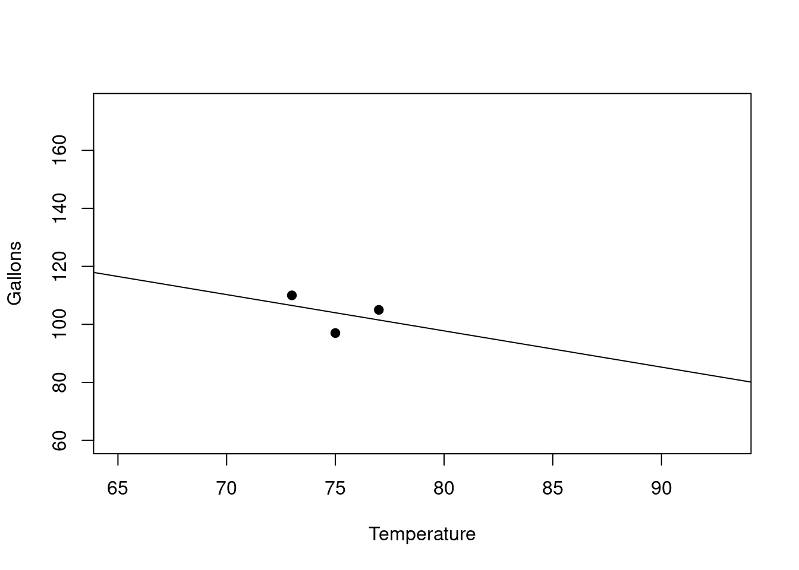
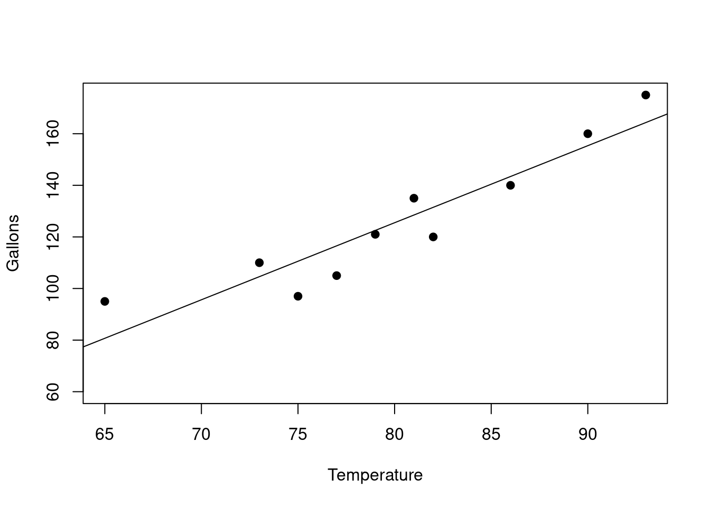
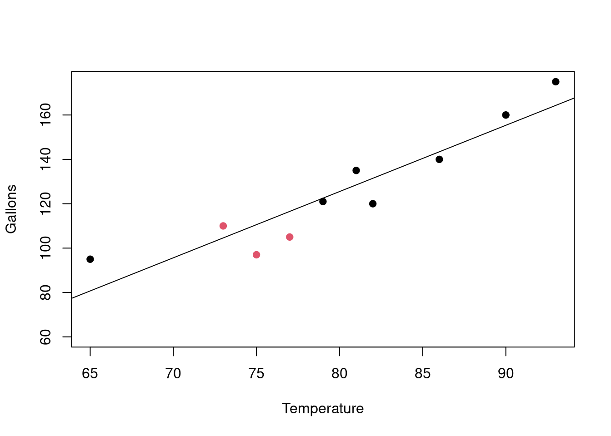

# Is This a Significant Linear Relationship? {#simple-regression-significance}


::: {.cell}

:::


      

Sometimes if there is not enough data or the trend is not strong enough, we should be careful about using a linear regression equation to model our data.

## Example With Small Amount of Data

Lets see some examples. Suppose we have the following data for an ice cream vendor involving the Temperature on a given day and the Gallons of ice cream sold that same day. We might be trying to predict the Gallons from the Temperature. 


::: {.cell}
::: {.cell-output-display}

```{=html}
<table class="huxtable" data-quarto-disable-processing="true"  style="margin-left: auto; margin-right: auto;">
<col><col><thead>
<tr>
<th class="huxtable-cell huxtable-header" style="text-align: right;  border-style: solid solid solid solid; border-width: 1pt 1pt 1pt 1pt; border-top-color: rgb(255, 255, 255);  border-right-color: rgb(255, 255, 255);  border-bottom-color: rgb(255, 255, 255);  border-left-color: rgb(255, 255, 255);  background-color: rgb(204, 204, 204);">Temperature</th><th class="huxtable-cell huxtable-header" style="text-align: right;  border-style: solid solid solid solid; border-width: 1pt 1pt 1pt 1pt; border-top-color: rgb(255, 255, 255);  border-right-color: rgb(255, 255, 255);  border-bottom-color: rgb(255, 255, 255);  border-left-color: rgb(255, 255, 255);  background-color: rgb(204, 204, 204);">Gallons</th></tr>
</thead>
<tbody>
<tr>
<td class="huxtable-cell" style="text-align: right;  border-style: solid solid solid solid; border-width: 1pt 1pt 1pt 1pt; border-top-color: rgb(255, 255, 255);  border-right-color: rgb(255, 255, 255);  border-bottom-color: rgb(255, 255, 255);  border-left-color: rgb(255, 255, 255);  background-color: rgb(242, 242, 242);">73</td><td class="huxtable-cell" style="text-align: right;  border-style: solid solid solid solid; border-width: 1pt 1pt 1pt 1pt; border-top-color: rgb(255, 255, 255);  border-right-color: rgb(255, 255, 255);  border-bottom-color: rgb(255, 255, 255);  border-left-color: rgb(255, 255, 255);  background-color: rgb(242, 242, 242);">110</td></tr>
<tr>
<td class="huxtable-cell" style="text-align: right;  border-style: solid solid solid solid; border-width: 1pt 1pt 1pt 1pt; border-top-color: rgb(255, 255, 255);  border-right-color: rgb(255, 255, 255);  border-bottom-color: rgb(255, 255, 255);  border-left-color: rgb(255, 255, 255);  background-color: rgb(230, 230, 230);">75</td><td class="huxtable-cell" style="text-align: right;  border-style: solid solid solid solid; border-width: 1pt 1pt 1pt 1pt; border-top-color: rgb(255, 255, 255);  border-right-color: rgb(255, 255, 255);  border-bottom-color: rgb(255, 255, 255);  border-left-color: rgb(255, 255, 255);  background-color: rgb(230, 230, 230);">97</td></tr>
<tr>
<td class="huxtable-cell" style="text-align: right;  border-style: solid solid solid solid; border-width: 1pt 1pt 1pt 1pt; border-top-color: rgb(255, 255, 255);  border-right-color: rgb(255, 255, 255);  border-bottom-color: rgb(255, 255, 255);  border-left-color: rgb(255, 255, 255);  background-color: rgb(242, 242, 242);">77</td><td class="huxtable-cell" style="text-align: right;  border-style: solid solid solid solid; border-width: 1pt 1pt 1pt 1pt; border-top-color: rgb(255, 255, 255);  border-right-color: rgb(255, 255, 255);  border-bottom-color: rgb(255, 255, 255);  border-left-color: rgb(255, 255, 255);  background-color: rgb(242, 242, 242);">105</td></tr>
</tbody>
</table>

```

:::
:::


Its not very much data, modeling based on 3 data points seems dodgy. So we should be careful about this. 

## Regression Line 

Lets look at the regression line we get for this data.(Say we ran the regression software in a spreadsheet we would get this):


::: {.cell}
::: {.cell-output-display}
{width=672}
:::
:::

    
As you can see the regression line has a negative slope. Here is its equation:

$$
Gallons = -1.25(Temperature) + 197.75
$$

## Should We Use the Regression Line? 

Should we use this line for predictions? We should probably be suspicious. 

The regression line has negative slope!! This says that as Temperature goes up the Gallons goes down.  

That sounds wrong actually. We expect it to be the other way around, right? 

## Looking at More Data 

Before we decide lets assume we collected more data and now we have the following:


::: {.cell}
::: {.cell-output-display}

```{=html}
<table class="huxtable" data-quarto-disable-processing="true"  style="margin-left: auto; margin-right: auto;">
<col><col><thead>
<tr>
<th class="huxtable-cell huxtable-header" style="text-align: right;  border-style: solid solid solid solid; border-width: 1pt 1pt 1pt 1pt; border-top-color: rgb(255, 255, 255);  border-right-color: rgb(255, 255, 255);  border-bottom-color: rgb(255, 255, 255);  border-left-color: rgb(255, 255, 255);  background-color: rgb(204, 204, 204);">Temperature</th><th class="huxtable-cell huxtable-header" style="text-align: right;  border-style: solid solid solid solid; border-width: 1pt 1pt 1pt 1pt; border-top-color: rgb(255, 255, 255);  border-right-color: rgb(255, 255, 255);  border-bottom-color: rgb(255, 255, 255);  border-left-color: rgb(255, 255, 255);  background-color: rgb(204, 204, 204);">Gallons</th></tr>
</thead>
<tbody>
<tr>
<td class="huxtable-cell" style="text-align: right;  border-style: solid solid solid solid; border-width: 1pt 1pt 1pt 1pt; border-top-color: rgb(255, 255, 255);  border-right-color: rgb(255, 255, 255);  border-bottom-color: rgb(255, 255, 255);  border-left-color: rgb(255, 255, 255);  background-color: rgb(242, 242, 242);">73</td><td class="huxtable-cell" style="text-align: right;  border-style: solid solid solid solid; border-width: 1pt 1pt 1pt 1pt; border-top-color: rgb(255, 255, 255);  border-right-color: rgb(255, 255, 255);  border-bottom-color: rgb(255, 255, 255);  border-left-color: rgb(255, 255, 255);  background-color: rgb(242, 242, 242);">110</td></tr>
<tr>
<td class="huxtable-cell" style="text-align: right;  border-style: solid solid solid solid; border-width: 1pt 1pt 1pt 1pt; border-top-color: rgb(255, 255, 255);  border-right-color: rgb(255, 255, 255);  border-bottom-color: rgb(255, 255, 255);  border-left-color: rgb(255, 255, 255);  background-color: rgb(230, 230, 230);">75</td><td class="huxtable-cell" style="text-align: right;  border-style: solid solid solid solid; border-width: 1pt 1pt 1pt 1pt; border-top-color: rgb(255, 255, 255);  border-right-color: rgb(255, 255, 255);  border-bottom-color: rgb(255, 255, 255);  border-left-color: rgb(255, 255, 255);  background-color: rgb(230, 230, 230);">97</td></tr>
<tr>
<td class="huxtable-cell" style="text-align: right;  border-style: solid solid solid solid; border-width: 1pt 1pt 1pt 1pt; border-top-color: rgb(255, 255, 255);  border-right-color: rgb(255, 255, 255);  border-bottom-color: rgb(255, 255, 255);  border-left-color: rgb(255, 255, 255);  background-color: rgb(242, 242, 242);">77</td><td class="huxtable-cell" style="text-align: right;  border-style: solid solid solid solid; border-width: 1pt 1pt 1pt 1pt; border-top-color: rgb(255, 255, 255);  border-right-color: rgb(255, 255, 255);  border-bottom-color: rgb(255, 255, 255);  border-left-color: rgb(255, 255, 255);  background-color: rgb(242, 242, 242);">105</td></tr>
<tr>
<td class="huxtable-cell" style="text-align: right;  border-style: solid solid solid solid; border-width: 1pt 1pt 1pt 1pt; border-top-color: rgb(255, 255, 255);  border-right-color: rgb(255, 255, 255);  border-bottom-color: rgb(255, 255, 255);  border-left-color: rgb(255, 255, 255);  background-color: rgb(230, 230, 230);">65</td><td class="huxtable-cell" style="text-align: right;  border-style: solid solid solid solid; border-width: 1pt 1pt 1pt 1pt; border-top-color: rgb(255, 255, 255);  border-right-color: rgb(255, 255, 255);  border-bottom-color: rgb(255, 255, 255);  border-left-color: rgb(255, 255, 255);  background-color: rgb(230, 230, 230);">95</td></tr>
<tr>
<td class="huxtable-cell" style="text-align: right;  border-style: solid solid solid solid; border-width: 1pt 1pt 1pt 1pt; border-top-color: rgb(255, 255, 255);  border-right-color: rgb(255, 255, 255);  border-bottom-color: rgb(255, 255, 255);  border-left-color: rgb(255, 255, 255);  background-color: rgb(242, 242, 242);">81</td><td class="huxtable-cell" style="text-align: right;  border-style: solid solid solid solid; border-width: 1pt 1pt 1pt 1pt; border-top-color: rgb(255, 255, 255);  border-right-color: rgb(255, 255, 255);  border-bottom-color: rgb(255, 255, 255);  border-left-color: rgb(255, 255, 255);  background-color: rgb(242, 242, 242);">135</td></tr>
<tr>
<td class="huxtable-cell" style="text-align: right;  border-style: solid solid solid solid; border-width: 1pt 1pt 1pt 1pt; border-top-color: rgb(255, 255, 255);  border-right-color: rgb(255, 255, 255);  border-bottom-color: rgb(255, 255, 255);  border-left-color: rgb(255, 255, 255);  background-color: rgb(230, 230, 230);">90</td><td class="huxtable-cell" style="text-align: right;  border-style: solid solid solid solid; border-width: 1pt 1pt 1pt 1pt; border-top-color: rgb(255, 255, 255);  border-right-color: rgb(255, 255, 255);  border-bottom-color: rgb(255, 255, 255);  border-left-color: rgb(255, 255, 255);  background-color: rgb(230, 230, 230);">160</td></tr>
<tr>
<td class="huxtable-cell" style="text-align: right;  border-style: solid solid solid solid; border-width: 1pt 1pt 1pt 1pt; border-top-color: rgb(255, 255, 255);  border-right-color: rgb(255, 255, 255);  border-bottom-color: rgb(255, 255, 255);  border-left-color: rgb(255, 255, 255);  background-color: rgb(242, 242, 242);">82</td><td class="huxtable-cell" style="text-align: right;  border-style: solid solid solid solid; border-width: 1pt 1pt 1pt 1pt; border-top-color: rgb(255, 255, 255);  border-right-color: rgb(255, 255, 255);  border-bottom-color: rgb(255, 255, 255);  border-left-color: rgb(255, 255, 255);  background-color: rgb(242, 242, 242);">120</td></tr>
<tr>
<td class="huxtable-cell" style="text-align: right;  border-style: solid solid solid solid; border-width: 1pt 1pt 1pt 1pt; border-top-color: rgb(255, 255, 255);  border-right-color: rgb(255, 255, 255);  border-bottom-color: rgb(255, 255, 255);  border-left-color: rgb(255, 255, 255);  background-color: rgb(230, 230, 230);">93</td><td class="huxtable-cell" style="text-align: right;  border-style: solid solid solid solid; border-width: 1pt 1pt 1pt 1pt; border-top-color: rgb(255, 255, 255);  border-right-color: rgb(255, 255, 255);  border-bottom-color: rgb(255, 255, 255);  border-left-color: rgb(255, 255, 255);  background-color: rgb(230, 230, 230);">175</td></tr>
<tr>
<td class="huxtable-cell" style="text-align: right;  border-style: solid solid solid solid; border-width: 1pt 1pt 1pt 1pt; border-top-color: rgb(255, 255, 255);  border-right-color: rgb(255, 255, 255);  border-bottom-color: rgb(255, 255, 255);  border-left-color: rgb(255, 255, 255);  background-color: rgb(242, 242, 242);">86</td><td class="huxtable-cell" style="text-align: right;  border-style: solid solid solid solid; border-width: 1pt 1pt 1pt 1pt; border-top-color: rgb(255, 255, 255);  border-right-color: rgb(255, 255, 255);  border-bottom-color: rgb(255, 255, 255);  border-left-color: rgb(255, 255, 255);  background-color: rgb(242, 242, 242);">140</td></tr>
<tr>
<td class="huxtable-cell" style="text-align: right;  border-style: solid solid solid solid; border-width: 1pt 1pt 1pt 1pt; border-top-color: rgb(255, 255, 255);  border-right-color: rgb(255, 255, 255);  border-bottom-color: rgb(255, 255, 255);  border-left-color: rgb(255, 255, 255);  background-color: rgb(230, 230, 230);">79</td><td class="huxtable-cell" style="text-align: right;  border-style: solid solid solid solid; border-width: 1pt 1pt 1pt 1pt; border-top-color: rgb(255, 255, 255);  border-right-color: rgb(255, 255, 255);  border-bottom-color: rgb(255, 255, 255);  border-left-color: rgb(255, 255, 255);  background-color: rgb(230, 230, 230);">121</td></tr>
</tbody>
</table>

```

:::
:::


## Regression Line Looks Different With More Data 

Lets see a scatterplot of this data and also look at the regression line now:


::: {.cell}
::: {.cell-output-display}
{width=672}
:::
:::


Now things look quite a bit different. In fact the rest of the data makes it clear that our original model based on just the three data points was not really representative of the rest of the situation. 

## The Original Data Did Not Show Full Picture 

You can see the original 3 points in red below above $x=73$ , $x=75$, and $x=77$:


::: {.cell}
::: {.cell-output-display}
{width=672}
:::
:::


Taken by themselves, the three data points we started with made it look like there was a downward trend, but actually overall there is an upward trend. So the moral of this story is that you cannot trust the regression model if the data set is too small.

## Is the Linear Regression Significant?

It turns out that there is a calculation that will tell us when we have situations like the above, either too little data or maybe no detectable trend given the amount of data. 

This is called the **overall significance test** of the model and it uses a p-value. When the p-value is smaller than .05, we say that there is a significant linear relationship between the y-variable and the x-variables. 

Without getting too technical, we will use this to mean \"its okay to go ahead and use the regression line for predictions if the model accuracy is suitable\". (note: We will check the accuracy using things like $R^2$ and the standard error.) If the p-value is not less than .05, then it is probably not okay to proceed to predictions using the model\'s regression equation at all. 

Usually you are in a situation like above with either too little data or no discernable trend for the data that you do have. You might be able go back and get more data and redo your analysis.

## Test for Overall Significance of the Linear Model 

So in summary:

- If $p < .05$, then there is a **significant linear relationship** between the y and x's
    - Means it is **OK to use the regression equation (if your accuracy allows)**  
- If $p \geq .05$, then there is **not a significant linear relationship**  
    - Means it is **NOT OK to use the regression equation** 
  
We will see how to find the p-value for the overall significance of the linear model in the spreadsheet examples.
