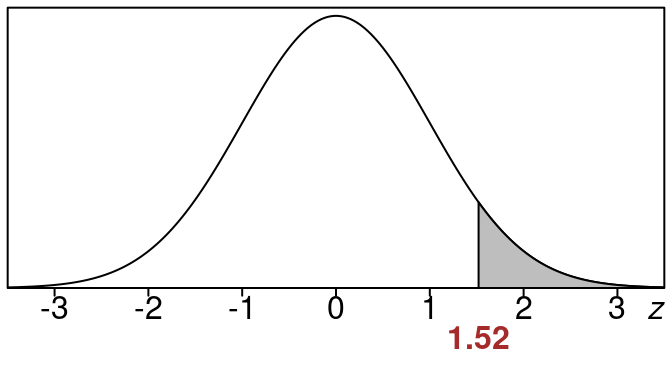
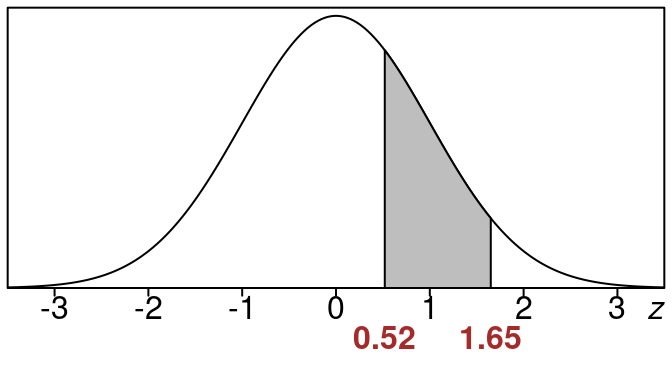

Here is the code with the requested find/replace operations:


::: {.cell}

:::

# Standard Normal Areas {#standard-normal-areas}

In this section we see how to find **left tail areas**, **right tail areas** and also **areas between** for the standard normal distribution by using the z-table. See [Appendix A](#z-table) for the table.

## Standard Normal Left Tail Areas {#standard-normal-left-tail-areas}

The first examples here are for **left tail areas**. We actually already saw how to do this in [Standard Normal Table](#standard-normal-table) by looking up the z-value and reading off the left tail area directly in the table, but it is worth doing one more example since it is so important.

Here is a problem with the z-value is positive:

:::{#exm-Find-left-tail-area-when-z-equals-1.52}

## Find left tail area when $z=1.52$


::: {.cell}
::: {.cell-output-display}


::: {.cell}

:::


Find the left tail area when $z=1.52$.

**_Solution:_**


::: {.cell}

:::


::: {.cell}

:::

We have $z = 1.52$. 

Here is the picture of the area we want.  


::: {.cell layout-align="center"}
::: {.cell-output-display}
{fig-align='center' width=336}
:::
:::


We want the shaded region to the left of $z=1.52$

If we look up the area in the standard normal z-table using  $z=1.52$ we go to the row that has 1.5 and then to the column that contains .02 and we see this: 


::: {.cell}
::: {.cell-output-display}

```{=html}
<table class="huxtable" data-quarto-disable-processing="true"  style="width: 85%; margin-left: auto; margin-right: auto;">
<col><col><col><col><col><col><col><col><col><col><col><thead>
<tr>
<th class="huxtable-cell huxtable-header" style="text-align: center;  border-style: solid solid solid solid; border-width: 0.5pt 0.5pt 0.5pt 0.5pt; border-top-color: rgb(0, 0, 0);  border-right-color: rgb(0, 0, 0);  border-bottom-color: rgb(0, 0, 0);  border-left-color: rgb(0, 0, 0);      font-size: 11pt;"></th><th class="huxtable-cell huxtable-header" style="text-align: center;  border-style: solid solid solid solid; border-width: 0.5pt 0.5pt 0.5pt 0.5pt; border-top-color: rgb(0, 0, 0);  border-right-color: rgb(0, 0, 0);  border-bottom-color: rgb(0, 0, 0);  border-left-color: rgb(0, 0, 0);      font-size: 11pt;">.00</th><th class="huxtable-cell huxtable-header" style="text-align: center;  border-style: solid solid solid solid; border-width: 0.5pt 0.5pt 0.5pt 0.5pt; border-top-color: rgb(0, 0, 0);  border-right-color: rgb(0, 0, 0);  border-bottom-color: rgb(0, 0, 0);  border-left-color: rgb(0, 0, 0);      font-size: 11pt;">.01</th><th class="huxtable-cell huxtable-header" style="text-align: center;  border-style: solid solid solid solid; border-width: 0.5pt 0.5pt 0.5pt 0.5pt; border-top-color: rgb(0, 0, 0);  border-right-color: rgb(0, 0, 0);  border-bottom-color: rgb(0, 0, 0);  border-left-color: rgb(0, 0, 0);      font-size: 11pt;">.02</th><th class="huxtable-cell huxtable-header" style="text-align: center;  border-style: solid solid solid solid; border-width: 0.5pt 0.5pt 0.5pt 0.5pt; border-top-color: rgb(0, 0, 0);  border-right-color: rgb(0, 0, 0);  border-bottom-color: rgb(0, 0, 0);  border-left-color: rgb(0, 0, 0);      font-size: 11pt;">.03</th><th class="huxtable-cell huxtable-header" style="text-align: center;  border-style: solid solid solid solid; border-width: 0.5pt 0.5pt 0.5pt 0.5pt; border-top-color: rgb(0, 0, 0);  border-right-color: rgb(0, 0, 0);  border-bottom-color: rgb(0, 0, 0);  border-left-color: rgb(0, 0, 0);      font-size: 11pt;">.04</th><th class="huxtable-cell huxtable-header" style="text-align: center;  border-style: solid solid solid solid; border-width: 0.5pt 0.5pt 0.5pt 0.5pt; border-top-color: rgb(0, 0, 0);  border-right-color: rgb(0, 0, 0);  border-bottom-color: rgb(0, 0, 0);  border-left-color: rgb(0, 0, 0);      font-size: 11pt;">.05</th><th class="huxtable-cell huxtable-header" style="text-align: center;  border-style: solid solid solid solid; border-width: 0.5pt 0.5pt 0.5pt 0.5pt; border-top-color: rgb(0, 0, 0);  border-right-color: rgb(0, 0, 0);  border-bottom-color: rgb(0, 0, 0);  border-left-color: rgb(0, 0, 0);      font-size: 11pt;">.06</th><th class="huxtable-cell huxtable-header" style="text-align: center;  border-style: solid solid solid solid; border-width: 0.5pt 0.5pt 0.5pt 0.5pt; border-top-color: rgb(0, 0, 0);  border-right-color: rgb(0, 0, 0);  border-bottom-color: rgb(0, 0, 0);  border-left-color: rgb(0, 0, 0);      font-size: 11pt;">.07</th><th class="huxtable-cell huxtable-header" style="text-align: center;  border-style: solid solid solid solid; border-width: 0.5pt 0.5pt 0.5pt 0.5pt; border-top-color: rgb(0, 0, 0);  border-right-color: rgb(0, 0, 0);  border-bottom-color: rgb(0, 0, 0);  border-left-color: rgb(0, 0, 0);      font-size: 11pt;">.08</th><th class="huxtable-cell huxtable-header" style="text-align: center;  border-style: solid solid solid solid; border-width: 0.5pt 0.5pt 0.5pt 0.5pt; border-top-color: rgb(0, 0, 0);  border-right-color: rgb(0, 0, 0);  border-bottom-color: rgb(0, 0, 0);  border-left-color: rgb(0, 0, 0);      font-size: 11pt;">.09</th></tr>
</thead>
<tbody>
<tr>
<td class="huxtable-cell" style="text-align: center;  border-style: solid solid solid solid; border-width: 0.5pt 0.5pt 0.5pt 0.5pt; border-top-color: rgb(0, 0, 0);  border-right-color: rgb(0, 0, 0);  border-bottom-color: rgb(0, 0, 0);  border-left-color: rgb(0, 0, 0);   font-weight: bold;   font-size: 11pt;">1.4</td><td class="huxtable-cell" style="text-align: center;  border-style: solid solid solid solid; border-width: 0.5pt 0.5pt 0.5pt 0.5pt; border-top-color: rgb(0, 0, 0);  border-right-color: rgb(0, 0, 0);  border-bottom-color: rgb(0, 0, 0);  border-left-color: rgb(0, 0, 0);      font-size: 11pt;">.9192</td><td class="huxtable-cell" style="text-align: center;  border-style: solid solid solid solid; border-width: 0.5pt 0.5pt 0.5pt 0.5pt; border-top-color: rgb(0, 0, 0);  border-right-color: rgb(0, 0, 0);  border-bottom-color: rgb(0, 0, 0);  border-left-color: rgb(0, 0, 0);      font-size: 11pt;">.9207</td><td class="huxtable-cell" style="text-align: center;  border-style: solid solid solid solid; border-width: 0.5pt 0.5pt 0.5pt 0.5pt; border-top-color: rgb(0, 0, 0);  border-right-color: rgb(0, 0, 0);  border-bottom-color: rgb(0, 0, 0);  border-left-color: rgb(0, 0, 0);  background-color: rgb(204, 204, 204);    font-size: 11pt;">.9222</td><td class="huxtable-cell" style="text-align: center;  border-style: solid solid solid solid; border-width: 0.5pt 0.5pt 0.5pt 0.5pt; border-top-color: rgb(0, 0, 0);  border-right-color: rgb(0, 0, 0);  border-bottom-color: rgb(0, 0, 0);  border-left-color: rgb(0, 0, 0);      font-size: 11pt;">.9236</td><td class="huxtable-cell" style="text-align: center;  border-style: solid solid solid solid; border-width: 0.5pt 0.5pt 0.5pt 0.5pt; border-top-color: rgb(0, 0, 0);  border-right-color: rgb(0, 0, 0);  border-bottom-color: rgb(0, 0, 0);  border-left-color: rgb(0, 0, 0);      font-size: 11pt;">.9251</td><td class="huxtable-cell" style="text-align: center;  border-style: solid solid solid solid; border-width: 0.5pt 0.5pt 0.5pt 0.5pt; border-top-color: rgb(0, 0, 0);  border-right-color: rgb(0, 0, 0);  border-bottom-color: rgb(0, 0, 0);  border-left-color: rgb(0, 0, 0);      font-size: 11pt;">.9265</td><td class="huxtable-cell" style="text-align: center;  border-style: solid solid solid solid; border-width: 0.5pt 0.5pt 0.5pt 0.5pt; border-top-color: rgb(0, 0, 0);  border-right-color: rgb(0, 0, 0);  border-bottom-color: rgb(0, 0, 0);  border-left-color: rgb(0, 0, 0);      font-size: 11pt;">.9279</td><td class="huxtable-cell" style="text-align: center;  border-style: solid solid solid solid; border-width: 0.5pt 0.5pt 0.5pt 0.5pt; border-top-color: rgb(0, 0, 0);  border-right-color: rgb(0, 0, 0);  border-bottom-color: rgb(0, 0, 0);  border-left-color: rgb(0, 0, 0);      font-size: 11pt;">.9292</td><td class="huxtable-cell" style="text-align: center;  border-style: solid solid solid solid; border-width: 0.5pt 0.5pt 0.5pt 0.5pt; border-top-color: rgb(0, 0, 0);  border-right-color: rgb(0, 0, 0);  border-bottom-color: rgb(0, 0, 0);  border-left-color: rgb(0, 0, 0);      font-size: 11pt;">.9306</td><td class="huxtable-cell" style="text-align: center;  border-style: solid solid solid solid; border-width: 0.5pt 0.5pt 0.5pt 0.5pt; border-top-color: rgb(0, 0, 0);  border-right-color: rgb(0, 0, 0);  border-bottom-color: rgb(0, 0, 0);  border-left-color: rgb(0, 0, 0);      font-size: 11pt;">.9319</td></tr>
<tr>
<td class="huxtable-cell" style="text-align: center;  border-style: solid solid solid solid; border-width: 0.5pt 0.5pt 0.5pt 0.5pt; border-top-color: rgb(0, 0, 0);  border-right-color: rgb(0, 0, 0);  border-bottom-color: rgb(0, 0, 0);  border-left-color: rgb(0, 0, 0);   font-weight: bold;   font-size: 11pt;">1.5</td><td class="huxtable-cell" style="text-align: center;  border-style: solid solid solid solid; border-width: 0.5pt 0.5pt 0.5pt 0.5pt; border-top-color: rgb(0, 0, 0);  border-right-color: rgb(0, 0, 0);  border-bottom-color: rgb(0, 0, 0);  border-left-color: rgb(0, 0, 0);  background-color: rgb(204, 204, 204);    font-size: 11pt;">.9332</td><td class="huxtable-cell" style="text-align: center;  border-style: solid solid solid solid; border-width: 0.5pt 0.5pt 0.5pt 0.5pt; border-top-color: rgb(0, 0, 0);  border-right-color: rgb(0, 0, 0);  border-bottom-color: rgb(0, 0, 0);  border-left-color: rgb(0, 0, 0);  background-color: rgb(204, 204, 204);    font-size: 11pt;">.9345</td><td class="huxtable-cell" style="text-align: center;  border-style: solid solid solid solid; border-width: 0.5pt 0.5pt 0.5pt 0.5pt; border-top-color: rgb(0, 0, 0);  border-right-color: rgb(0, 0, 0);  border-bottom-color: rgb(0, 0, 0);  border-left-color: rgb(0, 0, 0);  background-color: rgb(217, 217, 217); font-weight: bold;   font-size: 11pt;">.9357</td><td class="huxtable-cell" style="text-align: center;  border-style: solid solid solid solid; border-width: 0.5pt 0.5pt 0.5pt 0.5pt; border-top-color: rgb(0, 0, 0);  border-right-color: rgb(0, 0, 0);  border-bottom-color: rgb(0, 0, 0);  border-left-color: rgb(0, 0, 0);      font-size: 11pt;">.9370</td><td class="huxtable-cell" style="text-align: center;  border-style: solid solid solid solid; border-width: 0.5pt 0.5pt 0.5pt 0.5pt; border-top-color: rgb(0, 0, 0);  border-right-color: rgb(0, 0, 0);  border-bottom-color: rgb(0, 0, 0);  border-left-color: rgb(0, 0, 0);      font-size: 11pt;">.9382</td><td class="huxtable-cell" style="text-align: center;  border-style: solid solid solid solid; border-width: 0.5pt 0.5pt 0.5pt 0.5pt; border-top-color: rgb(0, 0, 0);  border-right-color: rgb(0, 0, 0);  border-bottom-color: rgb(0, 0, 0);  border-left-color: rgb(0, 0, 0);      font-size: 11pt;">.9394</td><td class="huxtable-cell" style="text-align: center;  border-style: solid solid solid solid; border-width: 0.5pt 0.5pt 0.5pt 0.5pt; border-top-color: rgb(0, 0, 0);  border-right-color: rgb(0, 0, 0);  border-bottom-color: rgb(0, 0, 0);  border-left-color: rgb(0, 0, 0);      font-size: 11pt;">.9406</td><td class="huxtable-cell" style="text-align: center;  border-style: solid solid solid solid; border-width: 0.5pt 0.5pt 0.5pt 0.5pt; border-top-color: rgb(0, 0, 0);  border-right-color: rgb(0, 0, 0);  border-bottom-color: rgb(0, 0, 0);  border-left-color: rgb(0, 0, 0);      font-size: 11pt;">.9418</td><td class="huxtable-cell" style="text-align: center;  border-style: solid solid solid solid; border-width: 0.5pt 0.5pt 0.5pt 0.5pt; border-top-color: rgb(0, 0, 0);  border-right-color: rgb(0, 0, 0);  border-bottom-color: rgb(0, 0, 0);  border-left-color: rgb(0, 0, 0);      font-size: 11pt;">.9429</td><td class="huxtable-cell" style="text-align: center;  border-style: solid solid solid solid; border-width: 0.5pt 0.5pt 0.5pt 0.5pt; border-top-color: rgb(0, 0, 0);  border-right-color: rgb(0, 0, 0);  border-bottom-color: rgb(0, 0, 0);  border-left-color: rgb(0, 0, 0);      font-size: 11pt;">.9441</td></tr>
<tr>
<td class="huxtable-cell" style="text-align: center;  border-style: solid solid solid solid; border-width: 0.5pt 0.5pt 0.5pt 0.5pt; border-top-color: rgb(0, 0, 0);  border-right-color: rgb(0, 0, 0);  border-bottom-color: rgb(0, 0, 0);  border-left-color: rgb(0, 0, 0);   font-weight: bold;   font-size: 11pt;">1.6</td><td class="huxtable-cell" style="text-align: center;  border-style: solid solid solid solid; border-width: 0.5pt 0.5pt 0.5pt 0.5pt; border-top-color: rgb(0, 0, 0);  border-right-color: rgb(0, 0, 0);  border-bottom-color: rgb(0, 0, 0);  border-left-color: rgb(0, 0, 0);      font-size: 11pt;">.9452</td><td class="huxtable-cell" style="text-align: center;  border-style: solid solid solid solid; border-width: 0.5pt 0.5pt 0.5pt 0.5pt; border-top-color: rgb(0, 0, 0);  border-right-color: rgb(0, 0, 0);  border-bottom-color: rgb(0, 0, 0);  border-left-color: rgb(0, 0, 0);      font-size: 11pt;">.9463</td><td class="huxtable-cell" style="text-align: center;  border-style: solid solid solid solid; border-width: 0.5pt 0.5pt 0.5pt 0.5pt; border-top-color: rgb(0, 0, 0);  border-right-color: rgb(0, 0, 0);  border-bottom-color: rgb(0, 0, 0);  border-left-color: rgb(0, 0, 0);      font-size: 11pt;">.9474</td><td class="huxtable-cell" style="text-align: center;  border-style: solid solid solid solid; border-width: 0.5pt 0.5pt 0.5pt 0.5pt; border-top-color: rgb(0, 0, 0);  border-right-color: rgb(0, 0, 0);  border-bottom-color: rgb(0, 0, 0);  border-left-color: rgb(0, 0, 0);      font-size: 11pt;">.9484</td><td class="huxtable-cell" style="text-align: center;  border-style: solid solid solid solid; border-width: 0.5pt 0.5pt 0.5pt 0.5pt; border-top-color: rgb(0, 0, 0);  border-right-color: rgb(0, 0, 0);  border-bottom-color: rgb(0, 0, 0);  border-left-color: rgb(0, 0, 0);      font-size: 11pt;">.9495</td><td class="huxtable-cell" style="text-align: center;  border-style: solid solid solid solid; border-width: 0.5pt 0.5pt 0.5pt 0.5pt; border-top-color: rgb(0, 0, 0);  border-right-color: rgb(0, 0, 0);  border-bottom-color: rgb(0, 0, 0);  border-left-color: rgb(0, 0, 0);      font-size: 11pt;">.9505</td><td class="huxtable-cell" style="text-align: center;  border-style: solid solid solid solid; border-width: 0.5pt 0.5pt 0.5pt 0.5pt; border-top-color: rgb(0, 0, 0);  border-right-color: rgb(0, 0, 0);  border-bottom-color: rgb(0, 0, 0);  border-left-color: rgb(0, 0, 0);      font-size: 11pt;">.9515</td><td class="huxtable-cell" style="text-align: center;  border-style: solid solid solid solid; border-width: 0.5pt 0.5pt 0.5pt 0.5pt; border-top-color: rgb(0, 0, 0);  border-right-color: rgb(0, 0, 0);  border-bottom-color: rgb(0, 0, 0);  border-left-color: rgb(0, 0, 0);      font-size: 11pt;">.9525</td><td class="huxtable-cell" style="text-align: center;  border-style: solid solid solid solid; border-width: 0.5pt 0.5pt 0.5pt 0.5pt; border-top-color: rgb(0, 0, 0);  border-right-color: rgb(0, 0, 0);  border-bottom-color: rgb(0, 0, 0);  border-left-color: rgb(0, 0, 0);      font-size: 11pt;">.9535</td><td class="huxtable-cell" style="text-align: center;  border-style: solid solid solid solid; border-width: 0.5pt 0.5pt 0.5pt 0.5pt; border-top-color: rgb(0, 0, 0);  border-right-color: rgb(0, 0, 0);  border-bottom-color: rgb(0, 0, 0);  border-left-color: rgb(0, 0, 0);      font-size: 11pt;">.9545</td></tr>
</tbody>
</table>

```

:::
:::

So that means:

\begin{equation}
\text{left tail area} =0.9357 
\end{equation}

Rounded to the nearest percent this is 94%. This means that the shaded area corresponds to 94% of the entire data.

$$
\tag*{$\blacksquare$}
$$
:::
:::


:::

## Standard Normal Right Tail Areas {#standard-normal-right-tail-areas}

Next lets take a look at finding a **right tail area**. Since our table only uses left tail areas we need a trick. This trick is sometimes called the **1 minus trick**.

It relies on this fact:

$$
\text{right tail area} + \text{left tail area} = 1.0
$$ {#eq-right-tail-plus-left-tail-equals-one}

That is any right tail and its corresponding left tail add up to 100%.


::: {.cell}

:::


So for example below the **right tail is 0.06** and the **left tail is 0.94** and these add up to **1.0**


::: {.cell layout-align="center"}
::: {.cell-output-display}
{fig-align='center' width=336}
:::
:::


So when we want to find the right tail area for some situation we can just find the left tail area and then subtract. Here are some examples.

:::{#exm-Find-right-tail-area-when-z-equals-minus-1.32}

## Find right tail area when $z=-1.32$


::: {.cell}
::: {.cell-output-display}


::: {.cell}

:::


Find the right tail area when $z=-1.32$.

**_Solution:_**


::: {.cell}

:::


::: {.cell}

:::

Here is the picture of the area we want. This area is called a "right tail area":


::: {.cell layout-align="center"}
::: {.cell-output-display}
{fig-align='center' width=336}
:::
:::


We want the shaded region to the right of $z=-1.32$ and underneath the standard normal curve.


::: {.cell}

:::


Since the standard normal table only has "left tail" areas in it, we cannot look up the area we want directly. But if we look up the left tail area in the z-table for $z=-1.32$, we can then subtract that from 1.0 to get the area that we want. 

Now to find the left tail area we need using standard normal z-table using  $z=-1.32$ we go to the row that has -1.3 and then to the column that contains .02 and we see this: 


::: {.cell}
::: {.cell-output-display}

```{=html}
<table class="huxtable" data-quarto-disable-processing="true"  style="width: 85%; margin-left: auto; margin-right: auto;">
<col><col><col><col><col><col><col><col><col><col><col><thead>
<tr>
<th class="huxtable-cell huxtable-header" style="text-align: center;  border-style: solid solid solid solid; border-width: 0.5pt 0.5pt 0.5pt 0.5pt; border-top-color: rgb(0, 0, 0);  border-right-color: rgb(0, 0, 0);  border-bottom-color: rgb(0, 0, 0);  border-left-color: rgb(0, 0, 0);      font-size: 11pt;"></th><th class="huxtable-cell huxtable-header" style="text-align: center;  border-style: solid solid solid solid; border-width: 0.5pt 0.5pt 0.5pt 0.5pt; border-top-color: rgb(0, 0, 0);  border-right-color: rgb(0, 0, 0);  border-bottom-color: rgb(0, 0, 0);  border-left-color: rgb(0, 0, 0);      font-size: 11pt;">.00</th><th class="huxtable-cell huxtable-header" style="text-align: center;  border-style: solid solid solid solid; border-width: 0.5pt 0.5pt 0.5pt 0.5pt; border-top-color: rgb(0, 0, 0);  border-right-color: rgb(0, 0, 0);  border-bottom-color: rgb(0, 0, 0);  border-left-color: rgb(0, 0, 0);      font-size: 11pt;">.01</th><th class="huxtable-cell huxtable-header" style="text-align: center;  border-style: solid solid solid solid; border-width: 0.5pt 0.5pt 0.5pt 0.5pt; border-top-color: rgb(0, 0, 0);  border-right-color: rgb(0, 0, 0);  border-bottom-color: rgb(0, 0, 0);  border-left-color: rgb(0, 0, 0);      font-size: 11pt;">.02</th><th class="huxtable-cell huxtable-header" style="text-align: center;  border-style: solid solid solid solid; border-width: 0.5pt 0.5pt 0.5pt 0.5pt; border-top-color: rgb(0, 0, 0);  border-right-color: rgb(0, 0, 0);  border-bottom-color: rgb(0, 0, 0);  border-left-color: rgb(0, 0, 0);      font-size: 11pt;">.03</th><th class="huxtable-cell huxtable-header" style="text-align: center;  border-style: solid solid solid solid; border-width: 0.5pt 0.5pt 0.5pt 0.5pt; border-top-color: rgb(0, 0, 0);  border-right-color: rgb(0, 0, 0);  border-bottom-color: rgb(0, 0, 0);  border-left-color: rgb(0, 0, 0);      font-size: 11pt;">.04</th><th class="huxtable-cell huxtable-header" style="text-align: center;  border-style: solid solid solid solid; border-width: 0.5pt 0.5pt 0.5pt 0.5pt; border-top-color: rgb(0, 0, 0);  border-right-color: rgb(0, 0, 0);  border-bottom-color: rgb(0, 0, 0);  border-left-color: rgb(0, 0, 0);      font-size: 11pt;">.05</th><th class="huxtable-cell huxtable-header" style="text-align: center;  border-style: solid solid solid solid; border-width: 0.5pt 0.5pt 0.5pt 0.5pt; border-top-color: rgb(0, 0, 0);  border-right-color: rgb(0, 0, 0);  border-bottom-color: rgb(0, 0, 0);  border-left-color: rgb(0, 0, 0);      font-size: 11pt;">.06</th><th class="huxtable-cell huxtable-header" style="text-align: center;  border-style: solid solid solid solid; border-width: 0.5pt 0.5pt 0.5pt 0.5pt; border-top-color: rgb(0, 0, 0);  border-right-color: rgb(0, 0, 0);  border-bottom-color: rgb(0, 0, 0);  border-left-color: rgb(0, 0, 0);      font-size: 11pt;">.07</th><th class="huxtable-cell huxtable-header" style="text-align: center;  border-style: solid solid solid solid; border-width: 0.5pt 0.5pt 0.5pt 0.5pt; border-top-color: rgb(0, 0, 0);  border-right-color: rgb(0, 0, 0);  border-bottom-color: rgb(0, 0, 0);  border-left-color: rgb(0, 0, 0);      font-size: 11pt;">.08</th><th class="huxtable-cell huxtable-header" style="text-align: center;  border-style: solid solid solid solid; border-width: 0.5pt 0.5pt 0.5pt 0.5pt; border-top-color: rgb(0, 0, 0);  border-right-color: rgb(0, 0, 0);  border-bottom-color: rgb(0, 0, 0);  border-left-color: rgb(0, 0, 0);      font-size: 11pt;">.09</th></tr>
</thead>
<tbody>
<tr>
<td class="huxtable-cell" style="text-align: center;  border-style: solid solid solid solid; border-width: 0.5pt 0.5pt 0.5pt 0.5pt; border-top-color: rgb(0, 0, 0);  border-right-color: rgb(0, 0, 0);  border-bottom-color: rgb(0, 0, 0);  border-left-color: rgb(0, 0, 0);   font-weight: bold;   font-size: 11pt;">-1.4</td><td class="huxtable-cell" style="text-align: center;  border-style: solid solid solid solid; border-width: 0.5pt 0.5pt 0.5pt 0.5pt; border-top-color: rgb(0, 0, 0);  border-right-color: rgb(0, 0, 0);  border-bottom-color: rgb(0, 0, 0);  border-left-color: rgb(0, 0, 0);      font-size: 11pt;">.0808</td><td class="huxtable-cell" style="text-align: center;  border-style: solid solid solid solid; border-width: 0.5pt 0.5pt 0.5pt 0.5pt; border-top-color: rgb(0, 0, 0);  border-right-color: rgb(0, 0, 0);  border-bottom-color: rgb(0, 0, 0);  border-left-color: rgb(0, 0, 0);      font-size: 11pt;">.0793</td><td class="huxtable-cell" style="text-align: center;  border-style: solid solid solid solid; border-width: 0.5pt 0.5pt 0.5pt 0.5pt; border-top-color: rgb(0, 0, 0);  border-right-color: rgb(0, 0, 0);  border-bottom-color: rgb(0, 0, 0);  border-left-color: rgb(0, 0, 0);  background-color: rgb(204, 204, 204);    font-size: 11pt;">.0778</td><td class="huxtable-cell" style="text-align: center;  border-style: solid solid solid solid; border-width: 0.5pt 0.5pt 0.5pt 0.5pt; border-top-color: rgb(0, 0, 0);  border-right-color: rgb(0, 0, 0);  border-bottom-color: rgb(0, 0, 0);  border-left-color: rgb(0, 0, 0);      font-size: 11pt;">.0764</td><td class="huxtable-cell" style="text-align: center;  border-style: solid solid solid solid; border-width: 0.5pt 0.5pt 0.5pt 0.5pt; border-top-color: rgb(0, 0, 0);  border-right-color: rgb(0, 0, 0);  border-bottom-color: rgb(0, 0, 0);  border-left-color: rgb(0, 0, 0);      font-size: 11pt;">.0749</td><td class="huxtable-cell" style="text-align: center;  border-style: solid solid solid solid; border-width: 0.5pt 0.5pt 0.5pt 0.5pt; border-top-color: rgb(0, 0, 0);  border-right-color: rgb(0, 0, 0);  border-bottom-color: rgb(0, 0, 0);  border-left-color: rgb(0, 0, 0);      font-size: 11pt;">.0735</td><td class="huxtable-cell" style="text-align: center;  border-style: solid solid solid solid; border-width: 0.5pt 0.5pt 0.5pt 0.5pt; border-top-color: rgb(0, 0, 0);  border-right-color: rgb(0, 0, 0);  border-bottom-color: rgb(0, 0, 0);  border-left-color: rgb(0, 0, 0);      font-size: 11pt;">.0721</td><td class="huxtable-cell" style="text-align: center;  border-style: solid solid solid solid; border-width: 0.5pt 0.5pt 0.5pt 0.5pt; border-top-color: rgb(0, 0, 0);  border-right-color: rgb(0, 0, 0);  border-bottom-color: rgb(0, 0, 0);  border-left-color: rgb(0, 0, 0);      font-size: 11pt;">.0708</td><td class="huxtable-cell" style="text-align: center;  border-style: solid solid solid solid; border-width: 0.5pt 0.5pt 0.5pt 0.5pt; border-top-color: rgb(0, 0, 0);  border-right-color: rgb(0, 0, 0);  border-bottom-color: rgb(0, 0, 0);  border-left-color: rgb(0, 0, 0);      font-size: 11pt;">.0694</td><td class="huxtable-cell" style="text-align: center;  border-style: solid solid solid solid; border-width: 0.5pt 0.5pt 0.5pt 0.5pt; border-top-color: rgb(0, 0, 0);  border-right-color: rgb(0, 0, 0);  border-bottom-color: rgb(0, 0, 0);  border-left-color: rgb(0, 0, 0);      font-size: 11pt;">.0681</td></tr>
<tr>
<td class="huxtable-cell" style="text-align: center;  border-style: solid solid solid solid; border-width: 0.5pt 0.5pt 0.5pt 0.5pt; border-top-color: rgb(0, 0, 0);  border-right-color: rgb(0, 0, 0);  border-bottom-color: rgb(0, 0, 0);  border-left-color: rgb(0, 0, 0);   font-weight: bold;   font-size: 11pt;">-1.3</td><td class="huxtable-cell" style="text-align: center;  border-style: solid solid solid solid; border-width: 0.5pt 0.5pt 0.5pt 0.5pt; border-top-color: rgb(0, 0, 0);  border-right-color: rgb(0, 0, 0);  border-bottom-color: rgb(0, 0, 0);  border-left-color: rgb(0, 0, 0);  background-color: rgb(204, 204, 204);    font-size: 11pt;">.0968</td><td class="huxtable-cell" style="text-align: center;  border-style: solid solid solid solid; border-width: 0.5pt 0.5pt 0.5pt 0.5pt; border-top-color: rgb(0, 0, 0);  border-right-color: rgb(0, 0, 0);  border-bottom-color: rgb(0, 0, 0);  border-left-color: rgb(0, 0, 0);  background-color: rgb(204, 204, 204);    font-size: 11pt;">.0951</td><td class="huxtable-cell" style="text-align: center;  border-style: solid solid solid solid; border-width: 0.5pt 0.5pt 0.5pt 0.5pt; border-top-color: rgb(0, 0, 0);  border-right-color: rgb(0, 0, 0);  border-bottom-color: rgb(0, 0, 0);  border-left-color: rgb(0, 0, 0);  background-color: rgb(217, 217, 217); font-weight: bold;   font-size: 11pt;">.0934</td><td class="huxtable-cell" style="text-align: center;  border-style: solid solid solid solid; border-width: 0.5pt 0.5pt 0.5pt 0.5pt; border-top-color: rgb(0, 0, 0);  border-right-color: rgb(0, 0, 0);  border-bottom-color: rgb(0, 0, 0);  border-left-color: rgb(0, 0, 0);      font-size: 11pt;">.0918</td><td class="huxtable-cell" style="text-align: center;  border-style: solid solid solid solid; border-width: 0.5pt 0.5pt 0.5pt 0.5pt; border-top-color: rgb(0, 0, 0);  border-right-color: rgb(0, 0, 0);  border-bottom-color: rgb(0, 0, 0);  border-left-color: rgb(0, 0, 0);      font-size: 11pt;">.0901</td><td class="huxtable-cell" style="text-align: center;  border-style: solid solid solid solid; border-width: 0.5pt 0.5pt 0.5pt 0.5pt; border-top-color: rgb(0, 0, 0);  border-right-color: rgb(0, 0, 0);  border-bottom-color: rgb(0, 0, 0);  border-left-color: rgb(0, 0, 0);      font-size: 11pt;">.0885</td><td class="huxtable-cell" style="text-align: center;  border-style: solid solid solid solid; border-width: 0.5pt 0.5pt 0.5pt 0.5pt; border-top-color: rgb(0, 0, 0);  border-right-color: rgb(0, 0, 0);  border-bottom-color: rgb(0, 0, 0);  border-left-color: rgb(0, 0, 0);      font-size: 11pt;">.0869</td><td class="huxtable-cell" style="text-align: center;  border-style: solid solid solid solid; border-width: 0.5pt 0.5pt 0.5pt 0.5pt; border-top-color: rgb(0, 0, 0);  border-right-color: rgb(0, 0, 0);  border-bottom-color: rgb(0, 0, 0);  border-left-color: rgb(0, 0, 0);      font-size: 11pt;">.0853</td><td class="huxtable-cell" style="text-align: center;  border-style: solid solid solid solid; border-width: 0.5pt 0.5pt 0.5pt 0.5pt; border-top-color: rgb(0, 0, 0);  border-right-color: rgb(0, 0, 0);  border-bottom-color: rgb(0, 0, 0);  border-left-color: rgb(0, 0, 0);      font-size: 11pt;">.0838</td><td class="huxtable-cell" style="text-align: center;  border-style: solid solid solid solid; border-width: 0.5pt 0.5pt 0.5pt 0.5pt; border-top-color: rgb(0, 0, 0);  border-right-color: rgb(0, 0, 0);  border-bottom-color: rgb(0, 0, 0);  border-left-color: rgb(0, 0, 0);      font-size: 11pt;">.0823</td></tr>
<tr>
<td class="huxtable-cell" style="text-align: center;  border-style: solid solid solid solid; border-width: 0.5pt 0.5pt 0.5pt 0.5pt; border-top-color: rgb(0, 0, 0);  border-right-color: rgb(0, 0, 0);  border-bottom-color: rgb(0, 0, 0);  border-left-color: rgb(0, 0, 0);   font-weight: bold;   font-size: 11pt;">-1.2</td><td class="huxtable-cell" style="text-align: center;  border-style: solid solid solid solid; border-width: 0.5pt 0.5pt 0.5pt 0.5pt; border-top-color: rgb(0, 0, 0);  border-right-color: rgb(0, 0, 0);  border-bottom-color: rgb(0, 0, 0);  border-left-color: rgb(0, 0, 0);      font-size: 11pt;">.1151</td><td class="huxtable-cell" style="text-align: center;  border-style: solid solid solid solid; border-width: 0.5pt 0.5pt 0.5pt 0.5pt; border-top-color: rgb(0, 0, 0);  border-right-color: rgb(0, 0, 0);  border-bottom-color: rgb(0, 0, 0);  border-left-color: rgb(0, 0, 0);      font-size: 11pt;">.1131</td><td class="huxtable-cell" style="text-align: center;  border-style: solid solid solid solid; border-width: 0.5pt 0.5pt 0.5pt 0.5pt; border-top-color: rgb(0, 0, 0);  border-right-color: rgb(0, 0, 0);  border-bottom-color: rgb(0, 0, 0);  border-left-color: rgb(0, 0, 0);      font-size: 11pt;">.1112</td><td class="huxtable-cell" style="text-align: center;  border-style: solid solid solid solid; border-width: 0.5pt 0.5pt 0.5pt 0.5pt; border-top-color: rgb(0, 0, 0);  border-right-color: rgb(0, 0, 0);  border-bottom-color: rgb(0, 0, 0);  border-left-color: rgb(0, 0, 0);      font-size: 11pt;">.1093</td><td class="huxtable-cell" style="text-align: center;  border-style: solid solid solid solid; border-width: 0.5pt 0.5pt 0.5pt 0.5pt; border-top-color: rgb(0, 0, 0);  border-right-color: rgb(0, 0, 0);  border-bottom-color: rgb(0, 0, 0);  border-left-color: rgb(0, 0, 0);      font-size: 11pt;">.1075</td><td class="huxtable-cell" style="text-align: center;  border-style: solid solid solid solid; border-width: 0.5pt 0.5pt 0.5pt 0.5pt; border-top-color: rgb(0, 0, 0);  border-right-color: rgb(0, 0, 0);  border-bottom-color: rgb(0, 0, 0);  border-left-color: rgb(0, 0, 0);      font-size: 11pt;">.1056</td><td class="huxtable-cell" style="text-align: center;  border-style: solid solid solid solid; border-width: 0.5pt 0.5pt 0.5pt 0.5pt; border-top-color: rgb(0, 0, 0);  border-right-color: rgb(0, 0, 0);  border-bottom-color: rgb(0, 0, 0);  border-left-color: rgb(0, 0, 0);      font-size: 11pt;">.1038</td><td class="huxtable-cell" style="text-align: center;  border-style: solid solid solid solid; border-width: 0.5pt 0.5pt 0.5pt 0.5pt; border-top-color: rgb(0, 0, 0);  border-right-color: rgb(0, 0, 0);  border-bottom-color: rgb(0, 0, 0);  border-left-color: rgb(0, 0, 0);      font-size: 11pt;">.1020</td><td class="huxtable-cell" style="text-align: center;  border-style: solid solid solid solid; border-width: 0.5pt 0.5pt 0.5pt 0.5pt; border-top-color: rgb(0, 0, 0);  border-right-color: rgb(0, 0, 0);  border-bottom-color: rgb(0, 0, 0);  border-left-color: rgb(0, 0, 0);      font-size: 11pt;">.1003</td><td class="huxtable-cell" style="text-align: center;  border-style: solid solid solid solid; border-width: 0.5pt 0.5pt 0.5pt 0.5pt; border-top-color: rgb(0, 0, 0);  border-right-color: rgb(0, 0, 0);  border-bottom-color: rgb(0, 0, 0);  border-left-color: rgb(0, 0, 0);      font-size: 11pt;">.0985</td></tr>
</tbody>
</table>

```

:::
:::


So the left tail area is 0.0934. We use this to find the right tail area now:

\begin{equation}
\text{right tail area}=1.0 - \text{left tail area} =1.0 - 0.0934 = 0.9066 
\end{equation}

Rounded to the nearest percent this right tail area is 91%. 

This means that the shaded area corresponds to 91% of the entire data. 

Another way to say it is that 91% of the data falls to the right of $z=-1.32$. 

$$
\tag*{$\blacksquare$}
$$
:::
:::


:::

Another example:

:::{#exm-Find-right-tail-area-when-z-equals-0.52}

## Find right tail area when $z=0.52$


::: {.cell}
::: {.cell-output-display}


::: {.cell}

:::


Find the right tail area when $z=0.52$.

**_Solution:_**


::: {.cell}

:::


::: {.cell}

:::

Here is the picture of the area we want. This area is called a "right tail area":


::: {.cell layout-align="center"}
::: {.cell-output-display}
{fig-align='center' width=336}
:::
:::


We want the shaded region to the right of $z=0.52$ and underneath the standard normal curve.


::: {.cell}

:::


Since the standard normal table only has "left tail" areas in it, we cannot look up the area we want directly. But if we look up the left tail area in the z-table for $z=0.52$, we can then subtract that from 1.0 to get the area that we want. 

Now to find the left tail area we need using standard normal z-table using  $z=0.52$ we go to the row that has 0.5 and then to the column that contains .02 and we see this: 


::: {.cell}
::: {.cell-output-display}

```{=html}
<table class="huxtable" data-quarto-disable-processing="true"  style="width: 85%; margin-left: auto; margin-right: auto;">
<col><col><col><col><col><col><col><col><col><col><col><thead>
<tr>
<th class="huxtable-cell huxtable-header" style="text-align: center;  border-style: solid solid solid solid; border-width: 0.5pt 0.5pt 0.5pt 0.5pt; border-top-color: rgb(0, 0, 0);  border-right-color: rgb(0, 0, 0);  border-bottom-color: rgb(0, 0, 0);  border-left-color: rgb(0, 0, 0);      font-size: 11pt;"></th><th class="huxtable-cell huxtable-header" style="text-align: center;  border-style: solid solid solid solid; border-width: 0.5pt 0.5pt 0.5pt 0.5pt; border-top-color: rgb(0, 0, 0);  border-right-color: rgb(0, 0, 0);  border-bottom-color: rgb(0, 0, 0);  border-left-color: rgb(0, 0, 0);      font-size: 11pt;">.00</th><th class="huxtable-cell huxtable-header" style="text-align: center;  border-style: solid solid solid solid; border-width: 0.5pt 0.5pt 0.5pt 0.5pt; border-top-color: rgb(0, 0, 0);  border-right-color: rgb(0, 0, 0);  border-bottom-color: rgb(0, 0, 0);  border-left-color: rgb(0, 0, 0);      font-size: 11pt;">.01</th><th class="huxtable-cell huxtable-header" style="text-align: center;  border-style: solid solid solid solid; border-width: 0.5pt 0.5pt 0.5pt 0.5pt; border-top-color: rgb(0, 0, 0);  border-right-color: rgb(0, 0, 0);  border-bottom-color: rgb(0, 0, 0);  border-left-color: rgb(0, 0, 0);      font-size: 11pt;">.02</th><th class="huxtable-cell huxtable-header" style="text-align: center;  border-style: solid solid solid solid; border-width: 0.5pt 0.5pt 0.5pt 0.5pt; border-top-color: rgb(0, 0, 0);  border-right-color: rgb(0, 0, 0);  border-bottom-color: rgb(0, 0, 0);  border-left-color: rgb(0, 0, 0);      font-size: 11pt;">.03</th><th class="huxtable-cell huxtable-header" style="text-align: center;  border-style: solid solid solid solid; border-width: 0.5pt 0.5pt 0.5pt 0.5pt; border-top-color: rgb(0, 0, 0);  border-right-color: rgb(0, 0, 0);  border-bottom-color: rgb(0, 0, 0);  border-left-color: rgb(0, 0, 0);      font-size: 11pt;">.04</th><th class="huxtable-cell huxtable-header" style="text-align: center;  border-style: solid solid solid solid; border-width: 0.5pt 0.5pt 0.5pt 0.5pt; border-top-color: rgb(0, 0, 0);  border-right-color: rgb(0, 0, 0);  border-bottom-color: rgb(0, 0, 0);  border-left-color: rgb(0, 0, 0);      font-size: 11pt;">.05</th><th class="huxtable-cell huxtable-header" style="text-align: center;  border-style: solid solid solid solid; border-width: 0.5pt 0.5pt 0.5pt 0.5pt; border-top-color: rgb(0, 0, 0);  border-right-color: rgb(0, 0, 0);  border-bottom-color: rgb(0, 0, 0);  border-left-color: rgb(0, 0, 0);      font-size: 11pt;">.06</th><th class="huxtable-cell huxtable-header" style="text-align: center;  border-style: solid solid solid solid; border-width: 0.5pt 0.5pt 0.5pt 0.5pt; border-top-color: rgb(0, 0, 0);  border-right-color: rgb(0, 0, 0);  border-bottom-color: rgb(0, 0, 0);  border-left-color: rgb(0, 0, 0);      font-size: 11pt;">.07</th><th class="huxtable-cell huxtable-header" style="text-align: center;  border-style: solid solid solid solid; border-width: 0.5pt 0.5pt 0.5pt 0.5pt; border-top-color: rgb(0, 0, 0);  border-right-color: rgb(0, 0, 0);  border-bottom-color: rgb(0, 0, 0);  border-left-color: rgb(0, 0, 0);      font-size: 11pt;">.08</th><th class="huxtable-cell huxtable-header" style="text-align: center;  border-style: solid solid solid solid; border-width: 0.5pt 0.5pt 0.5pt 0.5pt; border-top-color: rgb(0, 0, 0);  border-right-color: rgb(0, 0, 0);  border-bottom-color: rgb(0, 0, 0);  border-left-color: rgb(0, 0, 0);      font-size: 11pt;">.09</th></tr>
</thead>
<tbody>
<tr>
<td class="huxtable-cell" style="text-align: center;  border-style: solid solid solid solid; border-width: 0.5pt 0.5pt 0.5pt 0.5pt; border-top-color: rgb(0, 0, 0);  border-right-color: rgb(0, 0, 0);  border-bottom-color: rgb(0, 0, 0);  border-left-color: rgb(0, 0, 0);   font-weight: bold;   font-size: 11pt;">0.4</td><td class="huxtable-cell" style="text-align: center;  border-style: solid solid solid solid; border-width: 0.5pt 0.5pt 0.5pt 0.5pt; border-top-color: rgb(0, 0, 0);  border-right-color: rgb(0, 0, 0);  border-bottom-color: rgb(0, 0, 0);  border-left-color: rgb(0, 0, 0);      font-size: 11pt;">.6554</td><td class="huxtable-cell" style="text-align: center;  border-style: solid solid solid solid; border-width: 0.5pt 0.5pt 0.5pt 0.5pt; border-top-color: rgb(0, 0, 0);  border-right-color: rgb(0, 0, 0);  border-bottom-color: rgb(0, 0, 0);  border-left-color: rgb(0, 0, 0);      font-size: 11pt;">.6591</td><td class="huxtable-cell" style="text-align: center;  border-style: solid solid solid solid; border-width: 0.5pt 0.5pt 0.5pt 0.5pt; border-top-color: rgb(0, 0, 0);  border-right-color: rgb(0, 0, 0);  border-bottom-color: rgb(0, 0, 0);  border-left-color: rgb(0, 0, 0);  background-color: rgb(204, 204, 204);    font-size: 11pt;">.6628</td><td class="huxtable-cell" style="text-align: center;  border-style: solid solid solid solid; border-width: 0.5pt 0.5pt 0.5pt 0.5pt; border-top-color: rgb(0, 0, 0);  border-right-color: rgb(0, 0, 0);  border-bottom-color: rgb(0, 0, 0);  border-left-color: rgb(0, 0, 0);      font-size: 11pt;">.6664</td><td class="huxtable-cell" style="text-align: center;  border-style: solid solid solid solid; border-width: 0.5pt 0.5pt 0.5pt 0.5pt; border-top-color: rgb(0, 0, 0);  border-right-color: rgb(0, 0, 0);  border-bottom-color: rgb(0, 0, 0);  border-left-color: rgb(0, 0, 0);      font-size: 11pt;">.6700</td><td class="huxtable-cell" style="text-align: center;  border-style: solid solid solid solid; border-width: 0.5pt 0.5pt 0.5pt 0.5pt; border-top-color: rgb(0, 0, 0);  border-right-color: rgb(0, 0, 0);  border-bottom-color: rgb(0, 0, 0);  border-left-color: rgb(0, 0, 0);      font-size: 11pt;">.6736</td><td class="huxtable-cell" style="text-align: center;  border-style: solid solid solid solid; border-width: 0.5pt 0.5pt 0.5pt 0.5pt; border-top-color: rgb(0, 0, 0);  border-right-color: rgb(0, 0, 0);  border-bottom-color: rgb(0, 0, 0);  border-left-color: rgb(0, 0, 0);      font-size: 11pt;">.6772</td><td class="huxtable-cell" style="text-align: center;  border-style: solid solid solid solid; border-width: 0.5pt 0.5pt 0.5pt 0.5pt; border-top-color: rgb(0, 0, 0);  border-right-color: rgb(0, 0, 0);  border-bottom-color: rgb(0, 0, 0);  border-left-color: rgb(0, 0, 0);      font-size: 11pt;">.6808</td><td class="huxtable-cell" style="text-align: center;  border-style: solid solid solid solid; border-width: 0.5pt 0.5pt 0.5pt 0.5pt; border-top-color: rgb(0, 0, 0);  border-right-color: rgb(0, 0, 0);  border-bottom-color: rgb(0, 0, 0);  border-left-color: rgb(0, 0, 0);      font-size: 11pt;">.6844</td><td class="huxtable-cell" style="text-align: center;  border-style: solid solid solid solid; border-width: 0.5pt 0.5pt 0.5pt 0.5pt; border-top-color: rgb(0, 0, 0);  border-right-color: rgb(0, 0, 0);  border-bottom-color: rgb(0, 0, 0);  border-left-color: rgb(0, 0, 0);      font-size: 11pt;">.6879</td></tr>
<tr>
<td class="huxtable-cell" style="text-align: center;  border-style: solid solid solid solid; border-width: 0.5pt 0.5pt 0.5pt 0.5pt; border-top-color: rgb(0, 0, 0);  border-right-color: rgb(0, 0, 0);  border-bottom-color: rgb(0, 0, 0);  border-left-color: rgb(0, 0, 0);   font-weight: bold;   font-size: 11pt;">0.5</td><td class="huxtable-cell" style="text-align: center;  border-style: solid solid solid solid; border-width: 0.5pt 0.5pt 0.5pt 0.5pt; border-top-color: rgb(0, 0, 0);  border-right-color: rgb(0, 0, 0);  border-bottom-color: rgb(0, 0, 0);  border-left-color: rgb(0, 0, 0);  background-color: rgb(204, 204, 204);    font-size: 11pt;">.6915</td><td class="huxtable-cell" style="text-align: center;  border-style: solid solid solid solid; border-width: 0.5pt 0.5pt 0.5pt 0.5pt; border-top-color: rgb(0, 0, 0);  border-right-color: rgb(0, 0, 0);  border-bottom-color: rgb(0, 0, 0);  border-left-color: rgb(0, 0, 0);  background-color: rgb(204, 204, 204);    font-size: 11pt;">.6950</td><td class="huxtable-cell" style="text-align: center;  border-style: solid solid solid solid; border-width: 0.5pt 0.5pt 0.5pt 0.5pt; border-top-color: rgb(0, 0, 0);  border-right-color: rgb(0, 0, 0);  border-bottom-color: rgb(0, 0, 0);  border-left-color: rgb(0, 0, 0);  background-color: rgb(217, 217, 217); font-weight: bold;   font-size: 11pt;">.6985</td><td class="huxtable-cell" style="text-align: center;  border-style: solid solid solid solid; border-width: 0.5pt 0.5pt 0.5pt 0.5pt; border-top-color: rgb(0, 0, 0);  border-right-color: rgb(0, 0, 0);  border-bottom-color: rgb(0, 0, 0);  border-left-color: rgb(0, 0, 0);      font-size: 11pt;">.7019</td><td class="huxtable-cell" style="text-align: center;  border-style: solid solid solid solid; border-width: 0.5pt 0.5pt 0.5pt 0.5pt; border-top-color: rgb(0, 0, 0);  border-right-color: rgb(0, 0, 0);  border-bottom-color: rgb(0, 0, 0);  border-left-color: rgb(0, 0, 0);      font-size: 11pt;">.7054</td><td class="huxtable-cell" style="text-align: center;  border-style: solid solid solid solid; border-width: 0.5pt 0.5pt 0.5pt 0.5pt; border-top-color: rgb(0, 0, 0);  border-right-color: rgb(0, 0, 0);  border-bottom-color: rgb(0, 0, 0);  border-left-color: rgb(0, 0, 0);      font-size: 11pt;">.7088</td><td class="huxtable-cell" style="text-align: center;  border-style: solid solid solid solid; border-width: 0.5pt 0.5pt 0.5pt 0.5pt; border-top-color: rgb(0, 0, 0);  border-right-color: rgb(0, 0, 0);  border-bottom-color: rgb(0, 0, 0);  border-left-color: rgb(0, 0, 0);      font-size: 11pt;">.7123</td><td class="huxtable-cell" style="text-align: center;  border-style: solid solid solid solid; border-width: 0.5pt 0.5pt 0.5pt 0.5pt; border-top-color: rgb(0, 0, 0);  border-right-color: rgb(0, 0, 0);  border-bottom-color: rgb(0, 0, 0);  border-left-color: rgb(0, 0, 0);      font-size: 11pt;">.7157</td><td class="huxtable-cell" style="text-align: center;  border-style: solid solid solid solid; border-width: 0.5pt 0.5pt 0.5pt 0.5pt; border-top-color: rgb(0, 0, 0);  border-right-color: rgb(0, 0, 0);  border-bottom-color: rgb(0, 0, 0);  border-left-color: rgb(0, 0, 0);      font-size: 11pt;">.7190</td><td class="huxtable-cell" style="text-align: center;  border-style: solid solid solid solid; border-width: 0.5pt 0.5pt 0.5pt 0.5pt; border-top-color: rgb(0, 0, 0);  border-right-color: rgb(0, 0, 0);  border-bottom-color: rgb(0, 0, 0);  border-left-color: rgb(0, 0, 0);      font-size: 11pt;">.7224</td></tr>
<tr>
<td class="huxtable-cell" style="text-align: center;  border-style: solid solid solid solid; border-width: 0.5pt 0.5pt 0.5pt 0.5pt; border-top-color: rgb(0, 0, 0);  border-right-color: rgb(0, 0, 0);  border-bottom-color: rgb(0, 0, 0);  border-left-color: rgb(0, 0, 0);   font-weight: bold;   font-size: 11pt;">0.6</td><td class="huxtable-cell" style="text-align: center;  border-style: solid solid solid solid; border-width: 0.5pt 0.5pt 0.5pt 0.5pt; border-top-color: rgb(0, 0, 0);  border-right-color: rgb(0, 0, 0);  border-bottom-color: rgb(0, 0, 0);  border-left-color: rgb(0, 0, 0);      font-size: 11pt;">.7257</td><td class="huxtable-cell" style="text-align: center;  border-style: solid solid solid solid; border-width: 0.5pt 0.5pt 0.5pt 0.5pt; border-top-color: rgb(0, 0, 0);  border-right-color: rgb(0, 0, 0);  border-bottom-color: rgb(0, 0, 0);  border-left-color: rgb(0, 0, 0);      font-size: 11pt;">.7291</td><td class="huxtable-cell" style="text-align: center;  border-style: solid solid solid solid; border-width: 0.5pt 0.5pt 0.5pt 0.5pt; border-top-color: rgb(0, 0, 0);  border-right-color: rgb(0, 0, 0);  border-bottom-color: rgb(0, 0, 0);  border-left-color: rgb(0, 0, 0);      font-size: 11pt;">.7324</td><td class="huxtable-cell" style="text-align: center;  border-style: solid solid solid solid; border-width: 0.5pt 0.5pt 0.5pt 0.5pt; border-top-color: rgb(0, 0, 0);  border-right-color: rgb(0, 0, 0);  border-bottom-color: rgb(0, 0, 0);  border-left-color: rgb(0, 0, 0);      font-size: 11pt;">.7357</td><td class="huxtable-cell" style="text-align: center;  border-style: solid solid solid solid; border-width: 0.5pt 0.5pt 0.5pt 0.5pt; border-top-color: rgb(0, 0, 0);  border-right-color: rgb(0, 0, 0);  border-bottom-color: rgb(0, 0, 0);  border-left-color: rgb(0, 0, 0);      font-size: 11pt;">.7389</td><td class="huxtable-cell" style="text-align: center;  border-style: solid solid solid solid; border-width: 0.5pt 0.5pt 0.5pt 0.5pt; border-top-color: rgb(0, 0, 0);  border-right-color: rgb(0, 0, 0);  border-bottom-color: rgb(0, 0, 0);  border-left-color: rgb(0, 0, 0);      font-size: 11pt;">.7422</td><td class="huxtable-cell" style="text-align: center;  border-style: solid solid solid solid; border-width: 0.5pt 0.5pt 0.5pt 0.5pt; border-top-color: rgb(0, 0, 0);  border-right-color: rgb(0, 0, 0);  border-bottom-color: rgb(0, 0, 0);  border-left-color: rgb(0, 0, 0);      font-size: 11pt;">.7454</td><td class="huxtable-cell" style="text-align: center;  border-style: solid solid solid solid; border-width: 0.5pt 0.5pt 0.5pt 0.5pt; border-top-color: rgb(0, 0, 0);  border-right-color: rgb(0, 0, 0);  border-bottom-color: rgb(0, 0, 0);  border-left-color: rgb(0, 0, 0);      font-size: 11pt;">.7486</td><td class="huxtable-cell" style="text-align: center;  border-style: solid solid solid solid; border-width: 0.5pt 0.5pt 0.5pt 0.5pt; border-top-color: rgb(0, 0, 0);  border-right-color: rgb(0, 0, 0);  border-bottom-color: rgb(0, 0, 0);  border-left-color: rgb(0, 0, 0);      font-size: 11pt;">.7517</td><td class="huxtable-cell" style="text-align: center;  border-style: solid solid solid solid; border-width: 0.5pt 0.5pt 0.5pt 0.5pt; border-top-color: rgb(0, 0, 0);  border-right-color: rgb(0, 0, 0);  border-bottom-color: rgb(0, 0, 0);  border-left-color: rgb(0, 0, 0);      font-size: 11pt;">.7549</td></tr>
</tbody>
</table>

```

:::
:::


So the left tail area is 0.6985. We use this to find the right tail area now:

\begin{equation}
\text{right tail area}=1.0 - \text{left tail area} =1.0 - 0.6985 = 0.3015 
\end{equation}

Rounded to the nearest percent this right tail area is 30%. 

This means that the shaded area corresponds to 30% of the entire data. 

Another way to say it is that 30% of the data falls to the right of $z=0.52$. 

$$
\tag*{$\blacksquare$}
$$
:::
:::


:::


## Standard Normal Area Between Two Z Values {#standard-normal-area-between}

Finding the **area between** involves a trick as well.

_**Find Area Between Z Values**_

1. You look up the **left tail area** to the "upper z" (the one farthest to the right).
2. Then you look up the **left tail area** to the "lower z" (the one farthest to the left).
3. Then you subtract those two areas to get the **area between**.

Be sure to subtract these the right way. If you subtract them backwards your answer will turn out negative. Since areas cannot be negative, you will know you made a mistake.

Okay here are some examples of finding the **area between** two z-values.

:::{#exm-Find-area-between-z_1-equals-0.52-and-z_2-equals-1.65}

## Find area between $z_1=0.52$ and $z_2=1.65$


::: {.cell}
::: {.cell-output-display}


::: {.cell}

:::


Find the area between $z_{1}=0.52$ and $z_{2}=1.65$.

**_Solution:_**


::: {.cell}

:::


::: {.cell}

:::


::: {.cell}

:::

Here is the picture of the area we want.  


::: {.cell layout-align="center"}
::: {.cell-output-display}
{fig-align='center' width=336}
:::
:::


We want the shaded region to the left of $z_2=1.65$ and to the right of $z_1 = 0.52$

If we look up the areas in the standard normal z-table we find:

\begin{equation}
\text{left tail area for } z_2 =0.9505 
\end{equation}

\begin{equation}
\text{left tail area for } z_1 =0.6985 
\end{equation}
    
So the area between is:

\begin{equation}
\text{area between} =0.9505 - 0.6985 = 0.252 
\end{equation}

Rounded to the nearest percent this is 25%. 

This means that the shaded area corresponds to 25% of the entire data.

$$
\tag*{$\blacksquare$}
$$
:::
:::


:::

Another one

:::{#exm-Find-area-between-z_1-equals-minus-1.53-and-z_2-equals-1.23}

## Find area between $z_1=-1.53$ and $z_2=1.23$


::: {.cell}
::: {.cell-output-display}


::: {.cell}

:::


Find the area between $z_{1}=-1.53$ and $z_{2}=1.23$.

**_Solution:_**


::: {.cell}

:::


::: {.cell}

:::


::: {.cell}

:::

Here is the picture of the area we want.  


::: {.cell layout-align="center"}
::: {.cell-output-display}
{fig-align='center' width=336}
:::
:::


We want the shaded region to the left of $z_2=1.23$ and to the right of $z_1 = -1.53$

If we look up the areas in the standard normal z-table we find:

\begin{equation}
\text{left tail area for } z_2 =0.8907 
\end{equation}

\begin{equation}
\text{left tail area for } z_1 =0.063 
\end{equation}
    
So the area between is:

\begin{equation}
\text{area between} =0.8907 - 0.063 = 0.8277 
\end{equation}

Rounded to the nearest percent this is 83%. 

This means that the shaded area corresponds to 83% of the entire data.

$$
\tag*{$\blacksquare$}
$$
:::
:::


:::

## Applications of Standard Normal Distributions

We will see later in the text that **_service level_** in retail corresponds to the chance that a retailer would experience a lost sale (out of stock situation) for some period of interest.

- A service level of 90% means that lost sales would happen 10% of the time.
- A service level of 95% means that lost sales would happen be 5% of the time.
- A service level of 99% means that lost sales would happen be 1% of the time.

For demand that is distributed normally, the service level can be represented as a **left tail area**.

In addtion, the $z$-value that goes with a particular service level is called the **_service factor_**.

|   |   |
|---|---|
| service level | left tail area |
| service factor  | $z$-value for that left tail area |

- If you know the service factor ($z$-value) you can find the service level (the left tail area). (this section)
- If you know the service level (left tail area), you can find the service factor ($z$-value) (later in book)

:::{#exm-Service-Level}

## Service Level


::: {.cell}
::: {.cell-output-display}


::: {.cell}

:::


Suppose that monthly demand in units for a retail product is given by a normal distribution. Find the service level for service factor of $z=1.28$.

**_Solution:_**


::: {.cell}

:::


The service level can be found by finding the left tail area for the given service factor $z$-value.


::: {.cell}

:::


::: {.cell}

:::

We have $z = 1.28$. 

Here is the picture of the area we want.  


::: {.cell layout-align="center"}
::: {.cell-output-display}
{fig-align='center' width=336}
:::
:::


We want the shaded region to the left of $z=1.28$

If we look up the area in the standard normal z-table using  $z=1.28$ we go to the row that has 1.2 and then to the column that contains .08 and we see this: 


::: {.cell}
::: {.cell-output-display}

```{=html}
<table class="huxtable" data-quarto-disable-processing="true"  style="width: 85%; margin-left: auto; margin-right: auto;">
<col><col><col><col><col><col><col><col><col><col><col><thead>
<tr>
<th class="huxtable-cell huxtable-header" style="text-align: center;  border-style: solid solid solid solid; border-width: 0.5pt 0.5pt 0.5pt 0.5pt; border-top-color: rgb(0, 0, 0);  border-right-color: rgb(0, 0, 0);  border-bottom-color: rgb(0, 0, 0);  border-left-color: rgb(0, 0, 0);      font-size: 11pt;"></th><th class="huxtable-cell huxtable-header" style="text-align: center;  border-style: solid solid solid solid; border-width: 0.5pt 0.5pt 0.5pt 0.5pt; border-top-color: rgb(0, 0, 0);  border-right-color: rgb(0, 0, 0);  border-bottom-color: rgb(0, 0, 0);  border-left-color: rgb(0, 0, 0);      font-size: 11pt;">.00</th><th class="huxtable-cell huxtable-header" style="text-align: center;  border-style: solid solid solid solid; border-width: 0.5pt 0.5pt 0.5pt 0.5pt; border-top-color: rgb(0, 0, 0);  border-right-color: rgb(0, 0, 0);  border-bottom-color: rgb(0, 0, 0);  border-left-color: rgb(0, 0, 0);      font-size: 11pt;">.01</th><th class="huxtable-cell huxtable-header" style="text-align: center;  border-style: solid solid solid solid; border-width: 0.5pt 0.5pt 0.5pt 0.5pt; border-top-color: rgb(0, 0, 0);  border-right-color: rgb(0, 0, 0);  border-bottom-color: rgb(0, 0, 0);  border-left-color: rgb(0, 0, 0);      font-size: 11pt;">.02</th><th class="huxtable-cell huxtable-header" style="text-align: center;  border-style: solid solid solid solid; border-width: 0.5pt 0.5pt 0.5pt 0.5pt; border-top-color: rgb(0, 0, 0);  border-right-color: rgb(0, 0, 0);  border-bottom-color: rgb(0, 0, 0);  border-left-color: rgb(0, 0, 0);      font-size: 11pt;">.03</th><th class="huxtable-cell huxtable-header" style="text-align: center;  border-style: solid solid solid solid; border-width: 0.5pt 0.5pt 0.5pt 0.5pt; border-top-color: rgb(0, 0, 0);  border-right-color: rgb(0, 0, 0);  border-bottom-color: rgb(0, 0, 0);  border-left-color: rgb(0, 0, 0);      font-size: 11pt;">.04</th><th class="huxtable-cell huxtable-header" style="text-align: center;  border-style: solid solid solid solid; border-width: 0.5pt 0.5pt 0.5pt 0.5pt; border-top-color: rgb(0, 0, 0);  border-right-color: rgb(0, 0, 0);  border-bottom-color: rgb(0, 0, 0);  border-left-color: rgb(0, 0, 0);      font-size: 11pt;">.05</th><th class="huxtable-cell huxtable-header" style="text-align: center;  border-style: solid solid solid solid; border-width: 0.5pt 0.5pt 0.5pt 0.5pt; border-top-color: rgb(0, 0, 0);  border-right-color: rgb(0, 0, 0);  border-bottom-color: rgb(0, 0, 0);  border-left-color: rgb(0, 0, 0);      font-size: 11pt;">.06</th><th class="huxtable-cell huxtable-header" style="text-align: center;  border-style: solid solid solid solid; border-width: 0.5pt 0.5pt 0.5pt 0.5pt; border-top-color: rgb(0, 0, 0);  border-right-color: rgb(0, 0, 0);  border-bottom-color: rgb(0, 0, 0);  border-left-color: rgb(0, 0, 0);      font-size: 11pt;">.07</th><th class="huxtable-cell huxtable-header" style="text-align: center;  border-style: solid solid solid solid; border-width: 0.5pt 0.5pt 0.5pt 0.5pt; border-top-color: rgb(0, 0, 0);  border-right-color: rgb(0, 0, 0);  border-bottom-color: rgb(0, 0, 0);  border-left-color: rgb(0, 0, 0);      font-size: 11pt;">.08</th><th class="huxtable-cell huxtable-header" style="text-align: center;  border-style: solid solid solid solid; border-width: 0.5pt 0.5pt 0.5pt 0.5pt; border-top-color: rgb(0, 0, 0);  border-right-color: rgb(0, 0, 0);  border-bottom-color: rgb(0, 0, 0);  border-left-color: rgb(0, 0, 0);      font-size: 11pt;">.09</th></tr>
</thead>
<tbody>
<tr>
<td class="huxtable-cell" style="text-align: center;  border-style: solid solid solid solid; border-width: 0.5pt 0.5pt 0.5pt 0.5pt; border-top-color: rgb(0, 0, 0);  border-right-color: rgb(0, 0, 0);  border-bottom-color: rgb(0, 0, 0);  border-left-color: rgb(0, 0, 0);   font-weight: bold;   font-size: 11pt;">1.1</td><td class="huxtable-cell" style="text-align: center;  border-style: solid solid solid solid; border-width: 0.5pt 0.5pt 0.5pt 0.5pt; border-top-color: rgb(0, 0, 0);  border-right-color: rgb(0, 0, 0);  border-bottom-color: rgb(0, 0, 0);  border-left-color: rgb(0, 0, 0);      font-size: 11pt;">.8643</td><td class="huxtable-cell" style="text-align: center;  border-style: solid solid solid solid; border-width: 0.5pt 0.5pt 0.5pt 0.5pt; border-top-color: rgb(0, 0, 0);  border-right-color: rgb(0, 0, 0);  border-bottom-color: rgb(0, 0, 0);  border-left-color: rgb(0, 0, 0);      font-size: 11pt;">.8665</td><td class="huxtable-cell" style="text-align: center;  border-style: solid solid solid solid; border-width: 0.5pt 0.5pt 0.5pt 0.5pt; border-top-color: rgb(0, 0, 0);  border-right-color: rgb(0, 0, 0);  border-bottom-color: rgb(0, 0, 0);  border-left-color: rgb(0, 0, 0);      font-size: 11pt;">.8686</td><td class="huxtable-cell" style="text-align: center;  border-style: solid solid solid solid; border-width: 0.5pt 0.5pt 0.5pt 0.5pt; border-top-color: rgb(0, 0, 0);  border-right-color: rgb(0, 0, 0);  border-bottom-color: rgb(0, 0, 0);  border-left-color: rgb(0, 0, 0);      font-size: 11pt;">.8708</td><td class="huxtable-cell" style="text-align: center;  border-style: solid solid solid solid; border-width: 0.5pt 0.5pt 0.5pt 0.5pt; border-top-color: rgb(0, 0, 0);  border-right-color: rgb(0, 0, 0);  border-bottom-color: rgb(0, 0, 0);  border-left-color: rgb(0, 0, 0);      font-size: 11pt;">.8729</td><td class="huxtable-cell" style="text-align: center;  border-style: solid solid solid solid; border-width: 0.5pt 0.5pt 0.5pt 0.5pt; border-top-color: rgb(0, 0, 0);  border-right-color: rgb(0, 0, 0);  border-bottom-color: rgb(0, 0, 0);  border-left-color: rgb(0, 0, 0);      font-size: 11pt;">.8749</td><td class="huxtable-cell" style="text-align: center;  border-style: solid solid solid solid; border-width: 0.5pt 0.5pt 0.5pt 0.5pt; border-top-color: rgb(0, 0, 0);  border-right-color: rgb(0, 0, 0);  border-bottom-color: rgb(0, 0, 0);  border-left-color: rgb(0, 0, 0);      font-size: 11pt;">.8770</td><td class="huxtable-cell" style="text-align: center;  border-style: solid solid solid solid; border-width: 0.5pt 0.5pt 0.5pt 0.5pt; border-top-color: rgb(0, 0, 0);  border-right-color: rgb(0, 0, 0);  border-bottom-color: rgb(0, 0, 0);  border-left-color: rgb(0, 0, 0);      font-size: 11pt;">.8790</td><td class="huxtable-cell" style="text-align: center;  border-style: solid solid solid solid; border-width: 0.5pt 0.5pt 0.5pt 0.5pt; border-top-color: rgb(0, 0, 0);  border-right-color: rgb(0, 0, 0);  border-bottom-color: rgb(0, 0, 0);  border-left-color: rgb(0, 0, 0);  background-color: rgb(204, 204, 204);    font-size: 11pt;">.8810</td><td class="huxtable-cell" style="text-align: center;  border-style: solid solid solid solid; border-width: 0.5pt 0.5pt 0.5pt 0.5pt; border-top-color: rgb(0, 0, 0);  border-right-color: rgb(0, 0, 0);  border-bottom-color: rgb(0, 0, 0);  border-left-color: rgb(0, 0, 0);      font-size: 11pt;">.8830</td></tr>
<tr>
<td class="huxtable-cell" style="text-align: center;  border-style: solid solid solid solid; border-width: 0.5pt 0.5pt 0.5pt 0.5pt; border-top-color: rgb(0, 0, 0);  border-right-color: rgb(0, 0, 0);  border-bottom-color: rgb(0, 0, 0);  border-left-color: rgb(0, 0, 0);   font-weight: bold;   font-size: 11pt;">1.2</td><td class="huxtable-cell" style="text-align: center;  border-style: solid solid solid solid; border-width: 0.5pt 0.5pt 0.5pt 0.5pt; border-top-color: rgb(0, 0, 0);  border-right-color: rgb(0, 0, 0);  border-bottom-color: rgb(0, 0, 0);  border-left-color: rgb(0, 0, 0);  background-color: rgb(204, 204, 204);    font-size: 11pt;">.8849</td><td class="huxtable-cell" style="text-align: center;  border-style: solid solid solid solid; border-width: 0.5pt 0.5pt 0.5pt 0.5pt; border-top-color: rgb(0, 0, 0);  border-right-color: rgb(0, 0, 0);  border-bottom-color: rgb(0, 0, 0);  border-left-color: rgb(0, 0, 0);  background-color: rgb(204, 204, 204);    font-size: 11pt;">.8869</td><td class="huxtable-cell" style="text-align: center;  border-style: solid solid solid solid; border-width: 0.5pt 0.5pt 0.5pt 0.5pt; border-top-color: rgb(0, 0, 0);  border-right-color: rgb(0, 0, 0);  border-bottom-color: rgb(0, 0, 0);  border-left-color: rgb(0, 0, 0);  background-color: rgb(204, 204, 204);    font-size: 11pt;">.8888</td><td class="huxtable-cell" style="text-align: center;  border-style: solid solid solid solid; border-width: 0.5pt 0.5pt 0.5pt 0.5pt; border-top-color: rgb(0, 0, 0);  border-right-color: rgb(0, 0, 0);  border-bottom-color: rgb(0, 0, 0);  border-left-color: rgb(0, 0, 0);  background-color: rgb(204, 204, 204);    font-size: 11pt;">.8907</td><td class="huxtable-cell" style="text-align: center;  border-style: solid solid solid solid; border-width: 0.5pt 0.5pt 0.5pt 0.5pt; border-top-color: rgb(0, 0, 0);  border-right-color: rgb(0, 0, 0);  border-bottom-color: rgb(0, 0, 0);  border-left-color: rgb(0, 0, 0);  background-color: rgb(204, 204, 204);    font-size: 11pt;">.8925</td><td class="huxtable-cell" style="text-align: center;  border-style: solid solid solid solid; border-width: 0.5pt 0.5pt 0.5pt 0.5pt; border-top-color: rgb(0, 0, 0);  border-right-color: rgb(0, 0, 0);  border-bottom-color: rgb(0, 0, 0);  border-left-color: rgb(0, 0, 0);  background-color: rgb(204, 204, 204);    font-size: 11pt;">.8944</td><td class="huxtable-cell" style="text-align: center;  border-style: solid solid solid solid; border-width: 0.5pt 0.5pt 0.5pt 0.5pt; border-top-color: rgb(0, 0, 0);  border-right-color: rgb(0, 0, 0);  border-bottom-color: rgb(0, 0, 0);  border-left-color: rgb(0, 0, 0);  background-color: rgb(204, 204, 204);    font-size: 11pt;">.8962</td><td class="huxtable-cell" style="text-align: center;  border-style: solid solid solid solid; border-width: 0.5pt 0.5pt 0.5pt 0.5pt; border-top-color: rgb(0, 0, 0);  border-right-color: rgb(0, 0, 0);  border-bottom-color: rgb(0, 0, 0);  border-left-color: rgb(0, 0, 0);  background-color: rgb(204, 204, 204);    font-size: 11pt;">.8980</td><td class="huxtable-cell" style="text-align: center;  border-style: solid solid solid solid; border-width: 0.5pt 0.5pt 0.5pt 0.5pt; border-top-color: rgb(0, 0, 0);  border-right-color: rgb(0, 0, 0);  border-bottom-color: rgb(0, 0, 0);  border-left-color: rgb(0, 0, 0);  background-color: rgb(217, 217, 217); font-weight: bold;   font-size: 11pt;">.8997</td><td class="huxtable-cell" style="text-align: center;  border-style: solid solid solid solid; border-width: 0.5pt 0.5pt 0.5pt 0.5pt; border-top-color: rgb(0, 0, 0);  border-right-color: rgb(0, 0, 0);  border-bottom-color: rgb(0, 0, 0);  border-left-color: rgb(0, 0, 0);      font-size: 11pt;">.9015</td></tr>
<tr>
<td class="huxtable-cell" style="text-align: center;  border-style: solid solid solid solid; border-width: 0.5pt 0.5pt 0.5pt 0.5pt; border-top-color: rgb(0, 0, 0);  border-right-color: rgb(0, 0, 0);  border-bottom-color: rgb(0, 0, 0);  border-left-color: rgb(0, 0, 0);   font-weight: bold;   font-size: 11pt;">1.3</td><td class="huxtable-cell" style="text-align: center;  border-style: solid solid solid solid; border-width: 0.5pt 0.5pt 0.5pt 0.5pt; border-top-color: rgb(0, 0, 0);  border-right-color: rgb(0, 0, 0);  border-bottom-color: rgb(0, 0, 0);  border-left-color: rgb(0, 0, 0);      font-size: 11pt;">.9032</td><td class="huxtable-cell" style="text-align: center;  border-style: solid solid solid solid; border-width: 0.5pt 0.5pt 0.5pt 0.5pt; border-top-color: rgb(0, 0, 0);  border-right-color: rgb(0, 0, 0);  border-bottom-color: rgb(0, 0, 0);  border-left-color: rgb(0, 0, 0);      font-size: 11pt;">.9049</td><td class="huxtable-cell" style="text-align: center;  border-style: solid solid solid solid; border-width: 0.5pt 0.5pt 0.5pt 0.5pt; border-top-color: rgb(0, 0, 0);  border-right-color: rgb(0, 0, 0);  border-bottom-color: rgb(0, 0, 0);  border-left-color: rgb(0, 0, 0);      font-size: 11pt;">.9066</td><td class="huxtable-cell" style="text-align: center;  border-style: solid solid solid solid; border-width: 0.5pt 0.5pt 0.5pt 0.5pt; border-top-color: rgb(0, 0, 0);  border-right-color: rgb(0, 0, 0);  border-bottom-color: rgb(0, 0, 0);  border-left-color: rgb(0, 0, 0);      font-size: 11pt;">.9082</td><td class="huxtable-cell" style="text-align: center;  border-style: solid solid solid solid; border-width: 0.5pt 0.5pt 0.5pt 0.5pt; border-top-color: rgb(0, 0, 0);  border-right-color: rgb(0, 0, 0);  border-bottom-color: rgb(0, 0, 0);  border-left-color: rgb(0, 0, 0);      font-size: 11pt;">.9099</td><td class="huxtable-cell" style="text-align: center;  border-style: solid solid solid solid; border-width: 0.5pt 0.5pt 0.5pt 0.5pt; border-top-color: rgb(0, 0, 0);  border-right-color: rgb(0, 0, 0);  border-bottom-color: rgb(0, 0, 0);  border-left-color: rgb(0, 0, 0);      font-size: 11pt;">.9115</td><td class="huxtable-cell" style="text-align: center;  border-style: solid solid solid solid; border-width: 0.5pt 0.5pt 0.5pt 0.5pt; border-top-color: rgb(0, 0, 0);  border-right-color: rgb(0, 0, 0);  border-bottom-color: rgb(0, 0, 0);  border-left-color: rgb(0, 0, 0);      font-size: 11pt;">.9131</td><td class="huxtable-cell" style="text-align: center;  border-style: solid solid solid solid; border-width: 0.5pt 0.5pt 0.5pt 0.5pt; border-top-color: rgb(0, 0, 0);  border-right-color: rgb(0, 0, 0);  border-bottom-color: rgb(0, 0, 0);  border-left-color: rgb(0, 0, 0);      font-size: 11pt;">.9147</td><td class="huxtable-cell" style="text-align: center;  border-style: solid solid solid solid; border-width: 0.5pt 0.5pt 0.5pt 0.5pt; border-top-color: rgb(0, 0, 0);  border-right-color: rgb(0, 0, 0);  border-bottom-color: rgb(0, 0, 0);  border-left-color: rgb(0, 0, 0);      font-size: 11pt;">.9162</td><td class="huxtable-cell" style="text-align: center;  border-style: solid solid solid solid; border-width: 0.5pt 0.5pt 0.5pt 0.5pt; border-top-color: rgb(0, 0, 0);  border-right-color: rgb(0, 0, 0);  border-bottom-color: rgb(0, 0, 0);  border-left-color: rgb(0, 0, 0);      font-size: 11pt;">.9177</td></tr>
</tbody>
</table>

```

:::
:::

So that means:

\begin{equation}
\text{left tail area} =0.8997 
\end{equation}

Rounded to the nearest percent this is 90%. This means that the shaded area corresponds to 90% of the entire data.

This left tail area is the **service level**. A service level of $90\%$ means that there is just a $10\%$ chance of lost sales in given month.

$$
\tag*{$\blacksquare$}
$$
:::
:::


:::
