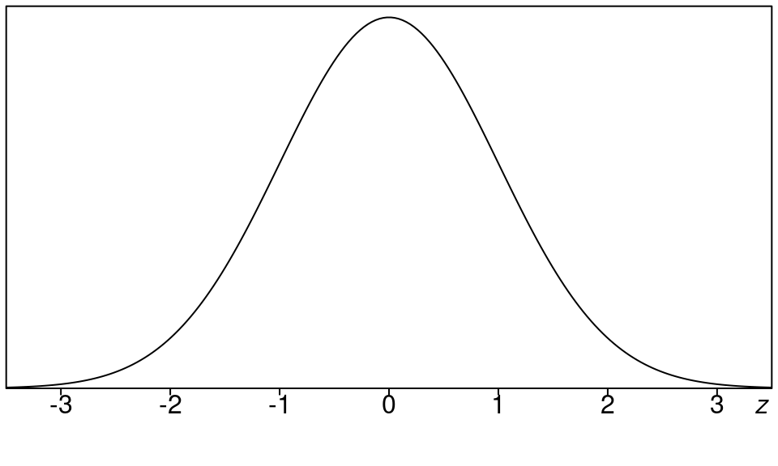
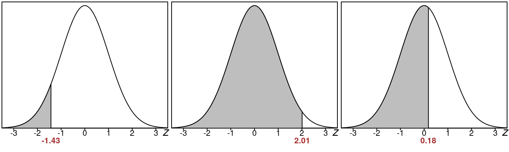
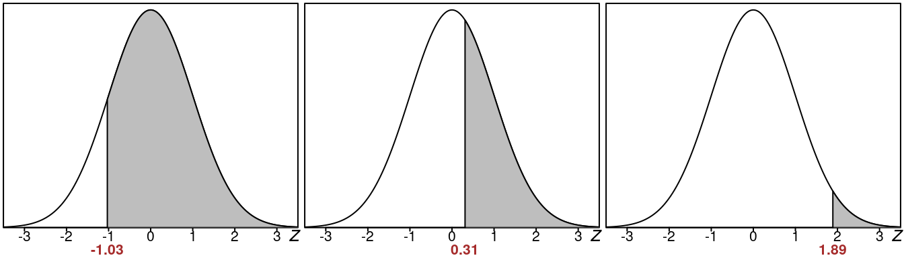
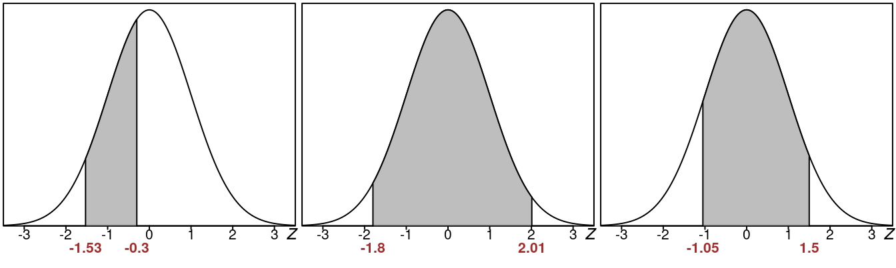

::: {.cell}

:::

# Standard Normal Curve {#standard-normal-curve}

Here we look at a very special normal distribution called a **standard normal curve**, This is also called the **z distribution**. This is a normal distribution with a mean 0 and standard deviation 1. 

In symbols that is $\mu=0$ and $\sigma=1$. 

Here is what the graph of a standard normal distribution looks like:

::: {.cell layout-align="center"}
::: {.cell-output-display}
{fig-align='center' width=480}
:::
:::

This graph shows that positive z-values are to the right of 0 and negative z-values are to the left of 0. Keeping mind that the mean $\mu$ is 0, we can say this:

- **Positive z-values are "above" the mean**
- **Negative z-values are "below" the mean** 

This holds for situations with other normal curves as well for which the mean $\mu$ is not 0.

- **A data value above the mean will have a positive z-value.**
- **A data value below the mean will have a negative z-value.** 

Notice how most the area under the curve is located between $z=-3.0$ and $z=3.0$. That means z-values that are outside this range are relatively rare and indicate some kind unusual sitation. We will talk about this later during our calculations. 

It turns out that the standard normal curve comes up in many calculations we do in statistics. Because it does, we want to understand everything about it. One important thing is to find the areas underneath the curve that are below or above a given z-value. These areas will tell us how likely or unlikely it is for something we are interested in to happen. So we need to have some easy way to find these areas.

These are the three important areas we need: 

1. **left tail areas** - the area to the left of a z-value 
1. **right tail areas** - the area to the right of a z-value 
1. **the area between** - the area between two z-values

Some pictures of these kinds of areas should make it clearer what we are talking about:

## Left Tail Areas

Here are some examples of various **left tail areas**:

::: {.cell layout-align="center"}
::: {.cell-output-display}
{fig-align='center' width=100%}
:::
:::

-  The first left tail area has a z-value of -1.43
-  The second left tail area has a z-value of 2.01 
-  The third left tail area has a z-value of 0.18 

Clearly the farther the z-value is to the right, the larger the left tail area.

-  The first left tail area is certainly less than 50%, something like 15% 
-  The second left tail area is more than 50%, looks like around 90% actually. 
-  The third left tail area is a little more than 50%

So you can see here that every z-value has a **left tail area** that goes with it.

## Right Tail Areas

Here are some examples of various **right tail areas**:

::: {.cell layout-align="center"}
::: {.cell-output-display}
{fig-align='center' width=100%}
:::
:::

-  The first right tail area has a z-value of -1.03
-  The second left tail area has a z-value of 0.31 
-  The third left tail area has a z-value of 1.89 

Clearly the farther the z-value is to the right, the smaller the right tail area.

- The first right tail area is more than 50%
- The second right tail area is slightly less than 50%
- The third right tail area is very small like around 10% 

## Area Between

::: {.cell layout-align="center"}
::: {.cell-output-display}
{fig-align='center' width=100%}
:::
:::

- The first area between looks like it might be about 25%
- The second area between looks like it might be around 80%
- The third area between looks like it might be around 70% 
